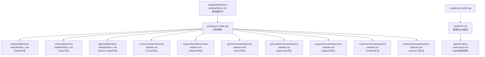
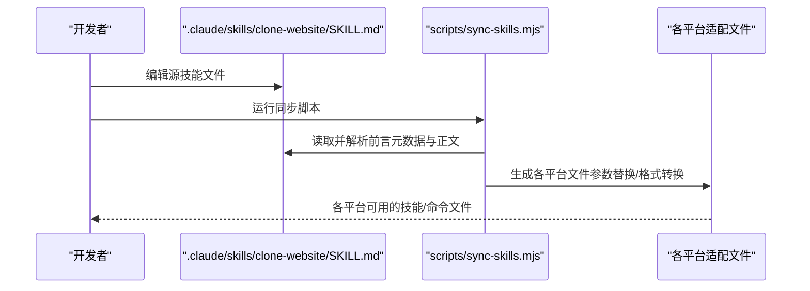
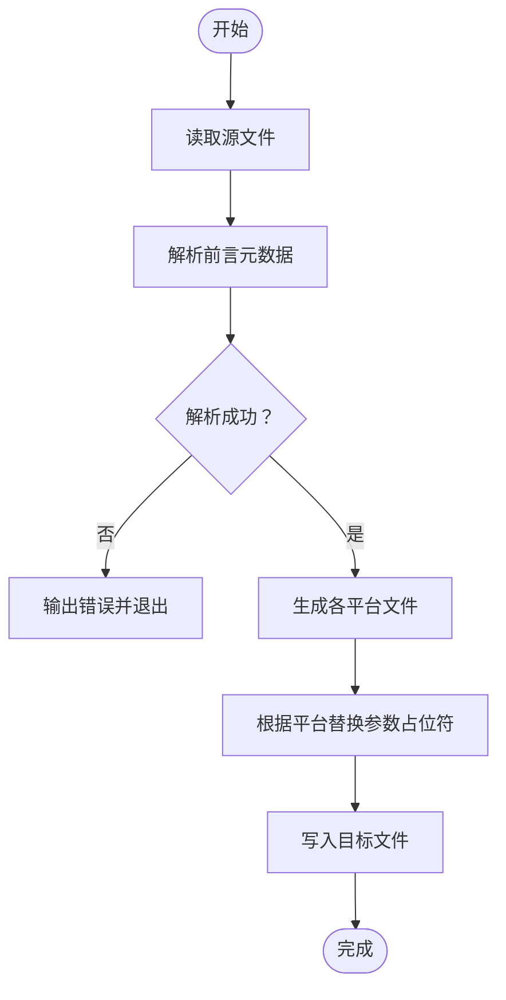
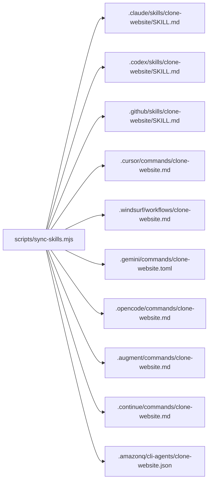

# AI代理技能管理

<cite>
**本文档引用的文件**
- [scripts/sync-skills.mjs](file://scripts/sync-skills.mjs)
- [.claude/skills/clone-website/SKILL.md](file://.claude/skills/clone-website/SKILL.md)
- [.augment/commands/clone-website.md](file://.augment/commands/clone-website.md)
- [.codex/skills/clone-website/SKILL.md](file://.codex/skills/clone-website/SKILL.md)
- [.gemini/commands/clone-website.toml](file://.gemini/commands/clone-website.toml)
- [AGENTS.md](file://AGENTS.md)
- [.github/copilot-instructions.md](file://.github/copilot-instructions.md)
- [.github/copilot-setup-steps.yml](file://.github/copilot-setup-steps.yml)
- [scripts/sync-agent-rules.sh](file://scripts/sync-agent-rules.sh)
</cite>

## 目录
1. [简介](#简介)
2. [项目结构](#项目结构)
3. [核心组件](#核心组件)
4. [架构总览](#架构总览)
5. [详细组件分析](#详细组件分析)
6. [依赖关系分析](#依赖关系分析)
7. [性能考虑](#性能考虑)
8. [故障排除指南](#故障排除指南)
9. [结论](#结论)
10. [附录](#附录)

## 简介
本项目为AI代理技能管理系统，围绕"/clone-website"技能构建了跨平台同步与自动化更新机制。通过统一的源文件（.claude/skills/clone-website/SKILL.md），系统自动生成适用于Claude、GitHub Copilot、Gemini、Cursor、Windsurf、OpenCode、Augment、Continue、Amazon Q等多平台的技能/命令文件，确保各平台在语法、参数占位符、元数据格式等方面保持一致性和可维护性。

## 项目结构
项目采用按平台分层的目录组织方式，核心技能源文件位于.clause/skills/clone-website/SKILL.md，其他平台的适配文件位于各自目录中。scripts/sync-skills.mjs负责解析源文件并批量生成各平台文件，AGENTS.md提供通用的Agent规则与说明，.github/copilot-instructions.md用于Copilot平台的规则同步。

**图表来源**
- [scripts/sync-skills.mjs:1-113](file://scripts/sync-skills.mjs#L1-L113)
- [.claude/skills/clone-website/SKILL.md:1-474](file://.claude/skills/clone-website/SKILL.md#L1-L474)
- [.augment/commands/clone-website.md:1-475](file://.augment/commands/clone-website.md#L1-L475)
- [.codex/skills/clone-website/SKILL.md:1-474](file://.codex/skills/clone-website/SKILL.md#L1-L474)
- [.gemini/commands/clone-website.toml:1-477](file://.gemini/commands/clone-website.toml#L1-L477)
- [AGENTS.md:1-66](file://AGENTS.md#L1-L66)
- [.github/copilot-instructions.md:1-148](file://.github/copilot-instructions.md#L1-L148)

**章节来源**
- [scripts/sync-skills.mjs:1-113](file://scripts/sync-skills.mjs#L1-L113)
- [.claude/skills/clone-website/SKILL.md:1-474](file://.claude/skills/clone-website/SKILL.md#L1-L474)
- [AGENTS.md:1-66](file://AGENTS.md#L1-L66)

## 核心组件
- 源技能文件：.claude/skills/clone-website/SKILL.md，包含技能元数据（名称、描述、参数提示、是否用户可调用）与完整技能说明。
- 同步脚本：scripts/sync-skills.mjs，负责读取源文件、解析前言元数据、替换参数占位符、生成各平台文件。
- 平台适配文件：各平台独立的技能/命令文件，遵循平台特定格式与参数语法。
- 通用规则：AGENTS.md提供通用Agent规则与注意事项；.github/copilot-instructions.md用于Copilot平台的规则同步。

**章节来源**
- [.claude/skills/clone-website/SKILL.md:1-6](file://.claude/skills/clone-website/SKILL.md#L1-L6)
- [scripts/sync-skills.mjs:1-113](file://scripts/sync-skills.mjs#L1-L113)
- [AGENTS.md:60-66](file://AGENTS.md#L60-L66)
- [.github/copilot-instructions.md:1-8](file://.github/copilot-instructions.md#L1-L8)

## 架构总览
系统采用“单一真实来源（Single Source of Truth）”策略：所有平台的技能内容均来源于.clause/skills/clone-website/SKILL.md。同步脚本通过解析该文件的前言元数据与正文内容，针对不同平台进行参数占位符替换与格式转换，最终输出到各平台目录。

**图表来源**
- [scripts/sync-skills.mjs:19-112](file://scripts/sync-skills.mjs#L19-L112)
- [.claude/skills/clone-website/SKILL.md:1-6](file://.claude/skills/clone-website/SKILL.md#L1-L6)

## 详细组件分析

### 同步脚本：scripts/sync-skills.mjs
- 功能概述
  - 读取源技能文件（.claude/skills/clone-website/SKILL.md）
  - 解析前言元数据（frontmatter），提取名称、描述、参数提示等
  - 替换参数占位符（$ARGUMENTS → {{args}} 或直接文本）
  - 生成各平台文件，包括：
    - Codex/Copilot：保留SKILL.md格式与$ARGUMENTS语法
    - Cursor/Windsurf：纯Markdown，无参数替换支持
    - Gemini：TOML格式，参数使用{{args}}
    - OpenCode/Augment：Markdown + YAML frontmatter，原生支持$ARGUMENTS
    - Continue：Markdown + YAML frontmatter，增加invokable字段
    - Amazon Q：JSON格式，包含prompt、fileContext等字段
- 错误处理
  - 源文件缺失时输出错误并退出
  - 前言解析失败时输出错误并退出
- 输出日志
  - 打印每个生成文件的相对路径，便于确认同步结果

**图表来源**
- [scripts/sync-skills.mjs:19-112](file://scripts/sync-skills.mjs#L19-L112)

**章节来源**
- [scripts/sync-skills.mjs:1-113](file://scripts/sync-skills.mjs#L1-L113)

### 源技能文件：.claude/skills/clone-website/SKILL.md
- 元数据
  - 名称：clone-website
  - 描述：反向工程并克隆一个或多个网站，逐节提取资产、CSS和内容，同时并行调度构建代理
  - 参数提示：<url1> [<url2> ...]
  - 用户可调用：true
- 内容结构
  - 技能目标与范围默认值
  - 预飞行检查清单
  - 设计原则（完整性、小任务、真实内容、基础优先、行为提取、交互模型识别、状态提取、规范文件、构建必须可编译）
  - 五个阶段：侦察、基础构建、组件规范与派发、页面装配、视觉QA对比
  - 预派发检查清单与禁止事项
  - 完成报告模板

**章节来源**
- [.claude/skills/clone-website/SKILL.md:1-6](file://.claude/skills/clone-website/SKILL.md#L1-L6)
- [.claude/skills/clone-website/SKILL.md:16-474](file://.claude/skills/clone-website/SKILL.md#L16-L474)

### 平台适配文件

#### Cursor：.cursor/commands/clone-website.md
- 特点：纯Markdown，不支持参数替换
- 处理：移除$ARGUMENTS占位符，添加自动生成头部注释

**章节来源**
- [scripts/sync-skills.mjs:63-63](file://scripts/sync-skills.mjs#L63-L63)
- [.augment/commands/clone-website.md:5-6](file://.augment/commands/clone-website.md#L5-L6)

#### Windsurf：.windsurf/workflows/clone-website.md
- 特点：Markdown工作流
- 处理：移除$ARGUMENTS占位符，添加自动生成头部注释

**章节来源**
- [scripts/sync-skills.mjs:66-66](file://scripts/sync-skills.mjs#L66-L66)
- [.augment/commands/clone-website.md:5-6](file://.augment/commands/clone-website.md#L5-L6)

#### Gemini：.gemini/commands/clone-website.toml
- 特点：TOML格式，参数使用{{args}}
- 处理：将$ARGUMENTS替换为{{args}}，生成description、name、prompt字段

**章节来源**
- [scripts/sync-skills.mjs:69-77](file://scripts/sync-skills.mjs#L69-L77)
- [.gemini/commands/clone-website.toml:1-477](file://.gemini/commands/clone-website.toml#L1-L477)

#### OpenCode：.opencode/commands/clone-website.md
- 特点：Markdown + YAML frontmatter，原生支持$ARGUMENTS
- 处理：添加YAML frontmatter（description），保留正文与$ARGUMENTS

**章节来源**
- [scripts/sync-skills.mjs:80-83](file://scripts/sync-skills.mjs#L80-L83)
- [.augment/commands/clone-website.md:1-4](file://.augment/commands/clone-website.md#L1-L4)

#### Augment：.augment/commands/clone-website.md
- 特点：Markdown + YAML frontmatter
- 处理：添加YAML frontmatter（description、argument-hint），保留正文与$ARGUMENTS

**章节来源**
- [scripts/sync-skills.mjs:85-89](file://scripts/sync-skills.mjs#L85-L89)
- [.augment/commands/clone-website.md:1-6](file://.augment/commands/clone-website.md#L1-L6)

#### Continue：.continue/commands/clone-website.md
- 特点：Markdown + YAML frontmatter，增加invokable字段
- 处理：添加YAML frontmatter（name、description、invokable），保留正文与$ARGUMENTS

**章节来源**
- [scripts/sync-skills.mjs:91-95](file://scripts/sync-skills.mjs#L91-L95)
- [.augment/commands/clone-website.md:1-6](file://.augment/commands/clone-website.md#L1-L6)

#### Amazon Q：.amazonq/cli-agents/clone-website.json
- 特点：JSON格式
- 处理：生成name、description、prompt（移除$ARGUMENTS）、fileContext字段

**章节来源**
- [scripts/sync-skills.mjs:97-110](file://scripts/sync-skills.mjs#L97-L110)

#### Codex/Copilot：.codex/skills/clone-website/SKILL.md 与 .github/skills/clone-website/SKILL.md
- 特点：SKILL.md格式，保留$ARGUMENTS语法
- 处理：直接复制源文件内容

**章节来源**
- [scripts/sync-skills.mjs:57-60](file://scripts/sync-skills.mjs#L57-L60)
- [.codex/skills/clone-website/SKILL.md:1-474](file://.codex/skills/clone-website/SKILL.md#L1-L474)
- [.augment/commands/clone-website.md:5-6](file://.augment/commands/clone-website.md#L5-L6)

### 通用Agent规则与Copilot同步
- AGENTS.md提供通用Agent规则、技术栈、设计原则、项目结构等说明，并包含同步脚本使用提示
- .github/copilot-instructions.md由AGENTS.md同步生成，包含相同的规则与说明，用于Copilot平台

**章节来源**
- [AGENTS.md:1-66](file://AGENTS.md#L1-L66)
- [.github/copilot-instructions.md:1-8](file://.github/copilot-instructions.md#L1-L8)
- [.github/copilot-instructions.md:63-66](file://.github/copilot-instructions.md#L63-L66)

## 依赖关系分析
- 耦合关系
  - 同步脚本与源文件强耦合：脚本依赖源文件的前言元数据与正文结构
  - 各平台文件弱耦合：仅依赖同步脚本生成，彼此独立
- 外部依赖
  - Node.js文件系统API用于读写文件
  - 路径工具用于拼接文件路径
- 潜在循环依赖
  - 无循环依赖：脚本单向生成文件，不反向依赖

**图表来源**
- [scripts/sync-skills.mjs:10-112](file://scripts/sync-skills.mjs#L10-L112)

**章节来源**
- [scripts/sync-skills.mjs:1-113](file://scripts/sync-skills.mjs#L1-L113)

## 性能考虑
- 文件I/O开销
  - 同步脚本仅执行少量文件读写操作，性能开销极低
- 参数替换复杂度
  - 字符串替换操作为线性时间，对大文件影响可忽略
- 并发建议
  - 当前脚本为顺序生成，若需提升速度可在保证原子性的前提下引入并发（需谨慎避免竞态）

## 故障排除指南
- 源文件缺失
  - 现象：同步脚本报错并退出
  - 处理：确认.clause/skills/clone-website/SKILL.md存在且可读
- 前言解析失败
  - 现象：同步脚本报错并退出
  - 处理：检查源文件前言格式是否符合YAML规范
- Copilot规则未更新
  - 现象：.github/copilot-instructions.md未反映最新规则
  - 处理：运行bash scripts/sync-agent-rules.sh以重新生成Copilot规则文件

**章节来源**
- [scripts/sync-skills.mjs:20-31](file://scripts/sync-skills.mjs#L20-L31)
- [AGENTS.md:62-62](file://AGENTS.md#L62-L62)
- [.github/copilot-instructions.md:1-2](file://.github/copilot-instructions.md#L1-L2)

## 结论
本系统通过单一真实来源与自动化同步脚本，实现了"/clone-website"技能在多平台的一致性与可维护性。开发者只需维护.clause/skills/clone-website/SKILL.md，即可自动适配各平台的语法差异。配合AGENTS.md与Copilot规则同步机制，整体技能管理体系清晰、高效且易于扩展。

## 附录

### 技能文件结构与配置选项
- 元数据字段
  - name：技能名称
  - description：技能描述
  - argument-hint：参数提示（如"url1 [url2 ...]"）
  - user-invocable：是否允许用户直接调用
- 正文内容
  - 包含技能目标、范围默认值、预飞行检查、设计原则、五阶段流程、预派发检查清单、禁止事项与完成报告模板

**章节来源**
- [.claude/skills/clone-website/SKILL.md:1-6](file://.claude/skills/clone-website/SKILL.md#L1-L6)
- [.claude/skills/clone-website/SKILL.md:16-474](file://.claude/skills/clone-website/SKILL.md#L16-L474)

### 不同AI平台的适配与转换规则
- Cursor/Windsurf：纯Markdown，移除$ARGUMENTS
- Gemini：TOML格式，参数使用{{args}}
- OpenCode/Augment：Markdown + YAML frontmatter，保留$ARGUMENTS
- Continue：Markdown + YAML frontmatter，增加invokable字段
- Amazon Q：JSON格式，包含prompt与fileContext
- Codex/Copilot：SKILL.md格式，保留$ARGUMENTS

**章节来源**
- [scripts/sync-skills.mjs:56-95](file://scripts/sync-skills.mjs#L56-L95)
- [.gemini/commands/clone-website.toml:1-477](file://.gemini/commands/clone-website.toml#L1-L477)
- [.augment/commands/clone-website.md:1-6](file://.augment/commands/clone-website.md#L1-L6)

### 技能同步完整流程
- 编辑AGENTS.md（通用规则）
- 编辑.clause/skills/clone-website/SKILL.md（技能正文与元数据）
- 运行node scripts/sync-skills.mjs（生成各平台文件）
- 运行bash scripts/sync-agent-rules.sh（更新Copilot规则文件）

**章节来源**
- [AGENTS.md:62-62](file://AGENTS.md#L62-L62)
- [scripts/sync-skills.mjs:53-54](file://scripts/sync-skills.mjs#L53-L54)
- [.github/copilot-instructions.md:1-2](file://.github/copilot-instructions.md#L1-L2)

### 版本管理、变更追踪与回滚机制
- 版本管理
  - 使用Git进行版本控制，通过提交记录追踪每次变更
- 变更追踪
  - 同步脚本输出每个生成文件的相对路径，便于快速定位变更
- 回滚机制
  - 通过Git log查看历史提交，使用git checkout或git revert进行回滚

**章节来源**
- [scripts/sync-skills.mjs:42-42](file://scripts/sync-skills.mjs#L42-L42)

### 技能开发最佳实践与调试技巧
- 最佳实践
  - 保持源文件前言元数据完整与准确
  - 在生成文件中保留自动生成头部注释，便于后续同步
  - 对复杂段落进行拆分，避免单个构建任务过长
  - 在多站点克隆场景中，为每个站点准备独立的输出目录
- 调试技巧
  - 检查同步脚本的错误输出，确认源文件解析与生成过程
  - 对比各平台生成文件，验证参数占位符替换是否正确
  - 在Copilot平台中运行bash scripts/sync-agent-rules.sh确保规则同步

**章节来源**
- [scripts/sync-skills.mjs:20-31](file://scripts/sync-skills.mjs#L20-L31)
- [AGENTS.md:62-62](file://AGENTS.md#L62-L62)
- [.github/copilot-instructions.md:63-66](file://.github/copilot-instructions.md#L63-L66)