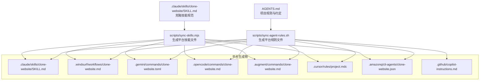
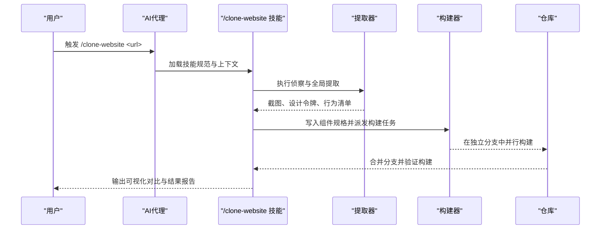
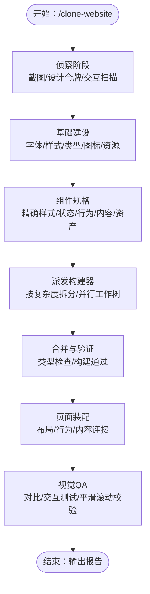
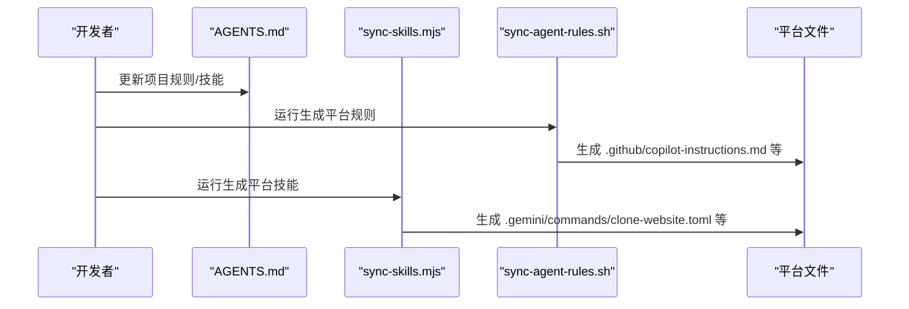
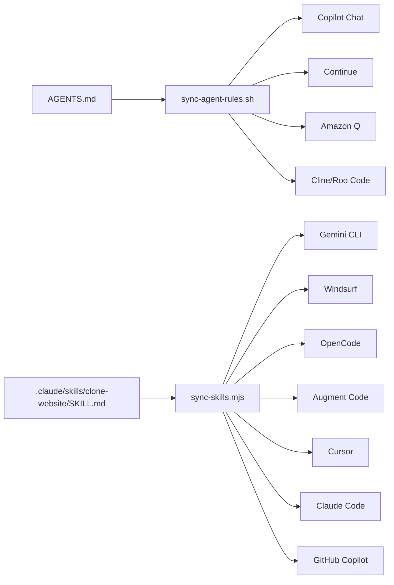

# AI代理集成

<cite>
**本文档引用的文件**
- [AGENTS.md](file://AGENTS.md)
- [CLAUDE.md](file://CLAUDE.md)
- [GEMINI.md](file://GEMINI.md)
- [.github/copilot-instructions.md](file://.github/copilot-instructions.md)
- [.github/copilot-setup-steps.yml](file://.github/copilot-setup-steps.yml)
- [.claude/skills/clone-website/SKILL.md](file://.claude/skills/clone-website/SKILL.md)
- [.windsurf/workflows/clone-website.md](file://.windsurf/workflows/clone-website.md)
- [.gemini/commands/clone-website.toml](file://.gemini/commands/clone-website.toml)
- [.opencode/commands/clone-website.md](file://.opencode/commands/clone-website.md)
- [.augment/commands/clone-website.md](file://.augment/commands/clone-website.md)
- [.cursor/rules/project.mdc](file://.cursor/rules/project.mdc)
- [.amazonq/cli-agents/clone-website.json](file://.amazonq/cli-agents/clone-website.json)
- [scripts/sync-skills.mjs](file://scripts/sync-skills.mjs)
- [scripts/sync-agent-rules.sh](file://scripts/sync-agent-rules.sh)
- [package.json](file://package.json)
- [README.md](file://README.md)
</cite>

## 目录
1. [简介](#简介)
2. [项目结构](#项目结构)
3. [核心组件](#核心组件)
4. [架构总览](#架构总览)
5. [详细组件分析](#详细组件分析)
6. [依赖关系分析](#依赖关系分析)
7. [性能考虑](#性能考虑)
8. [故障排查指南](#故障排查指南)
9. [结论](#结论)
10. [附录](#附录)

## 简介
本项目提供一套面向“蓝辉轻改网站”的AI代理集成功能，通过统一的“网站克隆”技能（/clone-website）驱动多平台AI编码代理协同工作，实现从目标站点到现代Next.js代码库的高保真重建。系统采用“侦察—基础建设—组件规格—并行构建—组装与质量保证”的五阶段流水线，确保每个环节可审计、可并行、可验证。

## 项目结构
项目以“单一真实来源”为核心：AGENTS.md定义项目规则与约定；.claude/skills/clone-website/SKILL.md定义“网站克隆”技能规范；scripts目录提供自动同步工具，将源内容生成到各平台所需的文件格式中。

图表来源
- [AGENTS.md](file://AGENTS.md)
- [.claude/skills/clone-website/SKILL.md](file://.claude/skills/clone-website/SKILL.md)
- [scripts/sync-agent-rules.sh](file://scripts/sync-agent-rules.sh)
- [scripts/sync-skills.mjs](file://scripts/sync-skills.mjs)

章节来源
- [README.md](file://README.md)
- [AGENTS.md](file://AGENTS.md)

## 核心组件
- 单一真实来源
  - AGENTS.md：项目规则、设计原则、命令与结构约定，供同步脚本生成各平台配置。
  - .claude/skills/clone-website/SKILL.md：/clone-website技能的完整规范，定义五阶段流程、提取清单、交互模型、构建约束与验收标准。
- 同步机制
  - scripts/sync-agent-rules.sh：将AGENTS.md解析并注入各平台规则文件（如Copilot Chat、Continue、Amazon Q等），支持@文件导入解析。
  - scripts/sync-skills.mjs：将.clone/skills/clone-website/SKILL.md转换为各平台所需格式（Markdown、TOML、JSON等），并替换参数占位符。
- 平台适配
  - Claude Code：通过CLAUDE.md引入AGENTS.md，配合.next-best-practices等背景技能。
  - GitHub Copilot：.github/copilot-instructions.md由AGENTS.md生成，.github/copilot-setup-steps.yml提供安装步骤。
  - Gemini CLI：.gemini/commands/clone-website.toml由SKILL.md生成，使用{{args}}占位符。
  - Cursor：.cursor/rules/project.mdc声明读取AGENTS.md。
  - Windsurf/OpenCode/Augment/Continue/Amazon Q/Aider等：通过各自文件格式生成或直接读取源文件。

章节来源
- [AGENTS.md](file://AGENTS.md)
- [.claude/skills/clone-website/SKILL.md](file://.claude/skills/clone-website/SKILL.md)
- [scripts/sync-agent-rules.sh](file://scripts/sync-agent-rules.sh)
- [scripts/sync-skills.mjs](file://scripts/sync-skills.mjs)
- [CLAUDE.md](file://CLAUDE.md)
- [.github/copilot-instructions.md](file://.github/copilot-instructions.md)
- [.github/copilot-setup-steps.yml](file://.github/copilot-setup-steps.yml)
- [.gemini/commands/clone-website.toml](file://.gemini/commands/clone-website.toml)
- [.cursor/rules/project.mdc](file://.cursor/rules/project.mdc)
- [.amazonq/cli-agents/clone-website.json](file://.amazonq/cli-agents/clone-website.json)

## 架构总览
系统以“网站克隆”技能为中心，围绕以下关键流程展开：

图表来源
- [.claude/skills/clone-website/SKILL.md](file://.claude/skills/clone-website/SKILL.md)
- [scripts/sync-skills.mjs](file://scripts/sync-skills.mjs)

章节来源
- [.claude/skills/clone-website/SKILL.md](file://.claude/skills/clone-website/SKILL.md)

## 详细组件分析

### /clone-website 技能规范
- 多阶段流程
  - 侦察：全页截图、字体与颜色提取、全局UI模式识别、强制交互扫描（滚动/点击/悬停/响应式）。
  - 基础建设：更新布局字体、全局样式、类型接口、SVG图标、下载全局资源，确保基础可编译。
  - 组件规格：为每个组件写入规范文件，包含精确computed样式、状态与行为、内容与资产映射、响应式断点。
  - 并行构建：按复杂度拆分，子组件优先，构建器接收完整规格内联提示，完成后合并并验证。
  - 装配与质量保证：装配页面、连接内容、实现页面级行为，进行视觉对比与交互测试。
- 关键约束
  - 完整性优先：每个构建器必须收到“一切所需”，避免猜测。
  - 小任务、完美结果：单个组件规格控制在约150行以内，超限则拆分。
  - 实物内容：使用真实文本、图片、视频与SVG，避免模拟。
  - 基础优先：全局样式与类型先于所有组件构建。
  - 行为提取：同时提取外观与行为，记录触发条件、前后状态与过渡。
  - 交互模型：在构建前明确是点击/滚动/悬停/时间驱动，错误的交互模型代价最高。
  - 规范文件为“事实来源”：每个组件在派发前必须有规范文件。
  - 必须可编译：构建器完成前需通过类型检查，合并后需通过生产构建。

图表来源
- [.claude/skills/clone-website/SKILL.md](file://.claude/skills/clone-website/SKILL.md)

章节来源
- [.claude/skills/clone-website/SKILL.md](file://.claude/skills/clone-website/SKILL.md)

### 同步机制与自动化脚本
- scripts/sync-agent-rules.sh
  - 作用：将AGENTS.md作为单一真实来源，生成各平台的规则文件；支持@文件导入解析，生成头部注释，避免手工维护。
  - 影响范围：GitHub Copilot Chat、Continue、Amazon Q、Cline等平台。
- scripts/sync-skills.mjs
  - 作用：将.clone/skills/clone-website/SKILL.md转换为各平台所需格式，处理参数占位符（$ARGUMENTS、{{args}}、YAML头等），并生成对应文件。
  - 影响范围：Codex CLI、GitHub Copilot、Cursor、Windsurf、Gemini CLI、OpenCode、Augment Code、Continue、Amazon Q等。

图表来源
- [scripts/sync-agent-rules.sh](file://scripts/sync-agent-rules.sh)
- [scripts/sync-skills.mjs](file://scripts/sync-skills.mjs)

章节来源
- [scripts/sync-agent-rules.sh](file://scripts/sync-agent-rules.sh)
- [scripts/sync-skills.mjs](file://scripts/sync-skills.mjs)

### 平台配置与最佳实践

- Claude Code
  - 配置要点：通过CLAUDE.md引入AGENTS.md；配合next-best-practices等背景技能，避免常见Next.js错误。
  - 最佳实践：在团队场景下，建议每个代理在独立worktree分支工作，结束后统一合并，减少冲突。
- GitHub Copilot
  - 配置要点：.github/copilot-instructions.md由AGENTS.md生成；.github/copilot-setup-steps.yml提供依赖安装步骤。
  - 最佳实践：先运行npm ci，再执行/clone-website，确保环境一致。
- Gemini CLI
  - 配置要点：.gemini/commands/clone-website.toml由SKILL.md生成，使用{{args}}占位符。
  - 最佳实践：确保本地已安装gemini-cli并正确配置认证。
- Cursor
  - 配置要点：.cursor/rules/project.mdc声明读取AGENTS.md，无需额外生成文件。
  - 最佳实践：在Cursor中打开项目根目录，确保自动加载AGENTS.md。
- Windsurf/OpenCode/Augment/Continue/Amazon Q/Aider
  - 配置要点：通过scripts/sync-skills.mjs生成对应文件；部分平台支持原生读取源文件。
  - 最佳实践：编辑源文件后，运行相应同步脚本更新平台文件。

章节来源
- [CLAUDE.md](file://CLAUDE.md)
- [.github/copilot-instructions.md](file://.github/copilot-instructions.md)
- [.github/copilot-setup-steps.yml](file://.github/copilot-setup-steps.yml)
- [.gemini/commands/clone-website.toml](file://.gemini/commands/clone-website.toml)
- [.cursor/rules/project.mdc](file://.cursor/rules/project.mdc)
- [.windsurf/workflows/clone-website.md](file://.windsurf/workflows/clone-website.md)
- [.opencode/commands/clone-website.md](file://.opencode/commands/clone-website.md)
- [.augment/commands/clone-website.md](file://.augment/commands/clone-website.md)
- [.amazonq/cli-agents/clone-website.json](file://.amazonq/cli-agents/clone-website.json)

## 依赖关系分析
- 源文件依赖
  - AGENTS.md被scripts/sync-agent-rules.sh消费，生成多个平台规则文件。
  - .claude/skills/clone-website/SKILL.md被scripts/sync-skills.mjs消费，生成多个平台技能文件。
- 平台依赖
  - 部分平台直接读取源文件（Cursor、部分平台原生支持），无需生成。
  - 部分平台需要特定格式（Gemini CLI TOML、Amazon Q JSON、Copilot Chat Markdown）。
- 工具链依赖
  - Node.js版本要求：package.json指定>=24。
  - Next.js 16、React 19、TypeScript严格模式、Tailwind CSS v4。

图表来源
- [AGENTS.md](file://AGENTS.md)
- [.claude/skills/clone-website/SKILL.md](file://.claude/skills/clone-website/SKILL.md)
- [scripts/sync-agent-rules.sh](file://scripts/sync-agent-rules.sh)
- [scripts/sync-skills.mjs](file://scripts/sync-skills.mjs)

章节来源
- [package.json](file://package.json)
- [README.md](file://README.md)

## 性能考虑
- 并行化策略
  - 组件级并行：在“组件规格→派发构建器→合并验证”阶段，按复杂度拆分任务，最大化并行度。
  - 资源下载：scripts目录提供资源下载脚本模板，建议使用批量并发下载与错误重试。
- 构建验证
  - 类型检查与生产构建：每个合并后均需通过npx tsc --noEmit与npm run build，避免累积问题。
- 交互扫描
  - 强制交互扫描（滚动/点击/悬停/响应式）应在早期完成，减少后期返工成本。
- 代理协作
  - 建议在Claude Code团队模式下，每个代理在独立worktree分支工作，统一合并，降低冲突修复成本。

## 故障排查指南
- 常见问题
  - 代理无法加载技能：确认源文件存在且路径正确；对于需要生成的平台，先运行同步脚本。
  - 构建失败：检查组件规格是否完整、交互模型是否正确、类型定义是否齐全。
  - 资源缺失：确认资源下载脚本已执行，图片/视频/字体已下载至public目录。
  - 代理间冲突：在Claude Code团队模式下，使用独立worktree分支，合并时解决冲突。
- 排查步骤
  - 重新生成平台文件：bash scripts/sync-agent-rules.sh 或 node scripts/sync-skills.mjs。
  - 验证构建：npm run typecheck 与 npm run build。
  - 回归测试：执行视觉QA，逐段对比原站与克隆站。

章节来源
- [scripts/sync-agent-rules.sh](file://scripts/sync-agent-rules.sh)
- [scripts/sync-skills.mjs](file://scripts/sync-skills.mjs)
- [.claude/skills/clone-website/SKILL.md](file://.claude/skills/clone-website/SKILL.md)

## 结论
本项目通过“单一真实来源+自动化同步”的方式，实现了多平台AI代理的无缝集成。/clone-website技能以五阶段流水线确保高质量交付，同步脚本保障各平台一致性。推荐在团队协作中采用Claude Code的worktree模式，结合严格的构建验证与视觉QA，最大化开发效率与产物质量。

## 附录
- 快速开始
  - 安装依赖：npm install
  - 启动代理：claude --chrome
  - 执行技能：/clone-website <目标URL>
- 支持平台一览
  - Claude Code、Codex CLI、OpenCode、GitHub Copilot、Cursor、Windsurf、Gemini CLI、Cline、Roo Code、Continue、Amazon Q、Augment Code、Aider

章节来源
- [README.md](file://README.md)
- [package.json](file://package.json)