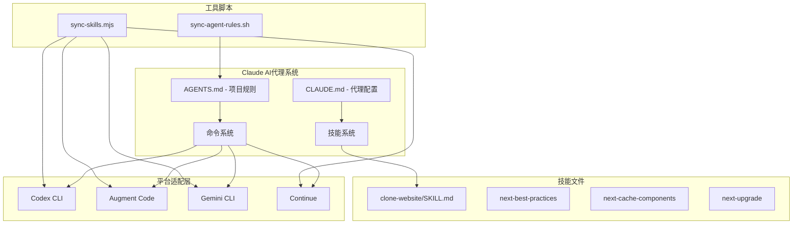
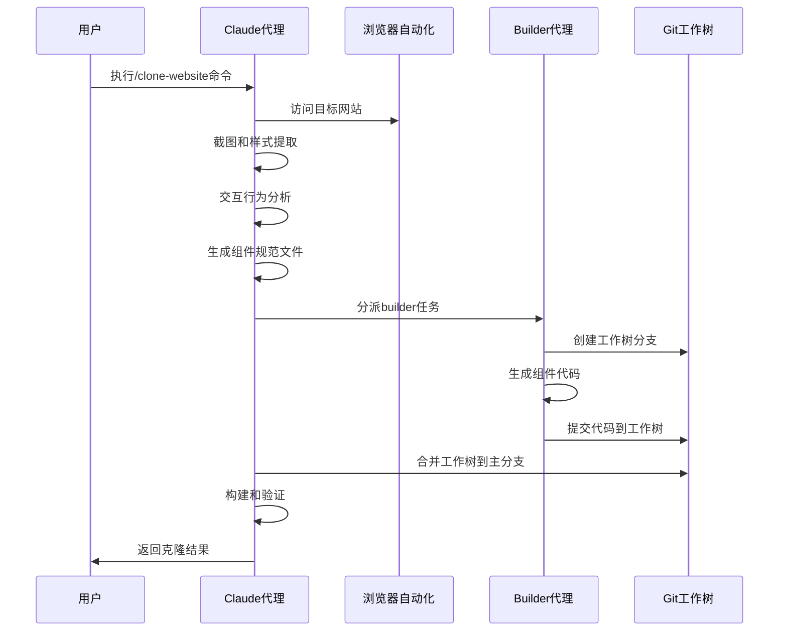
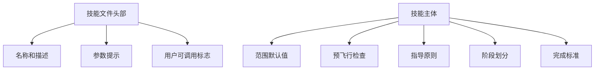
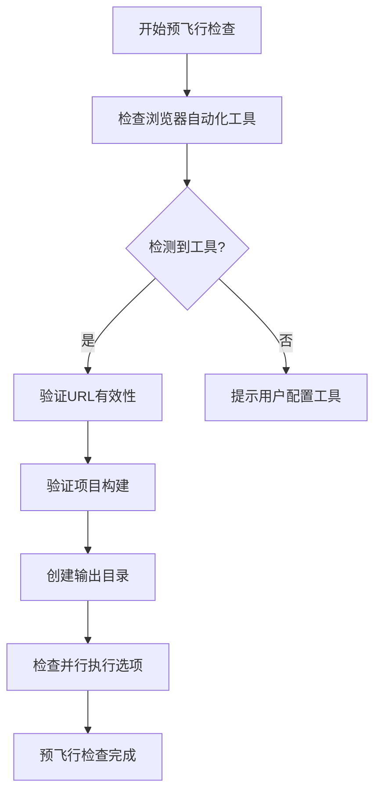
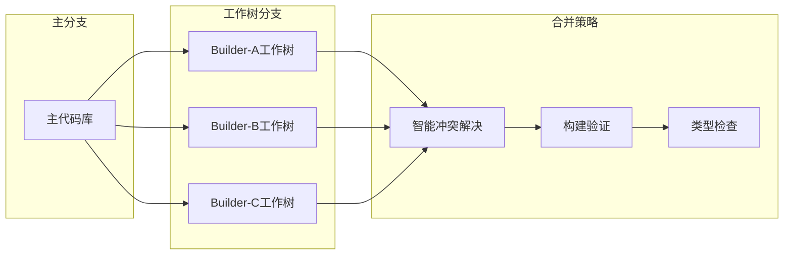
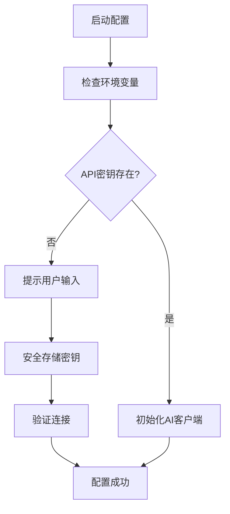
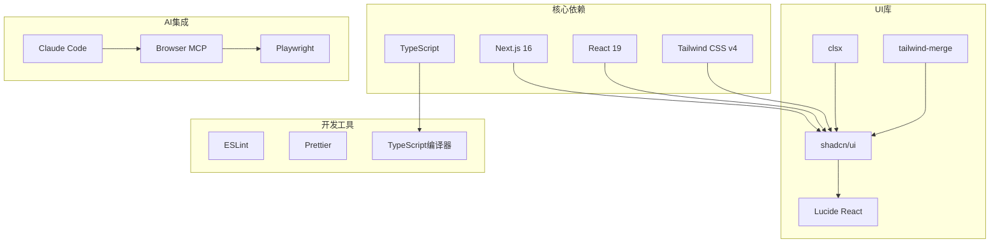
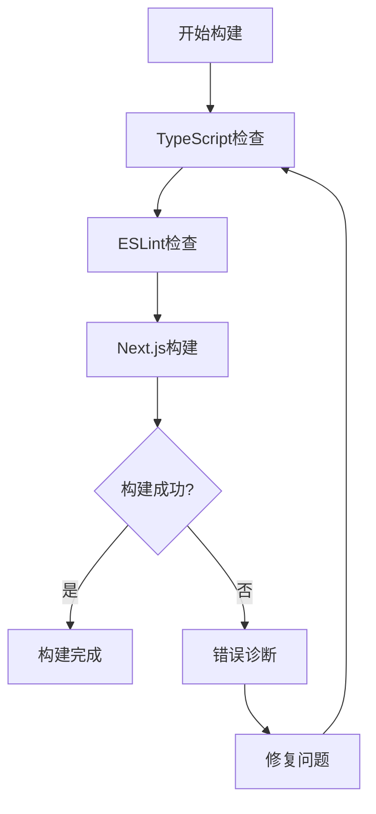
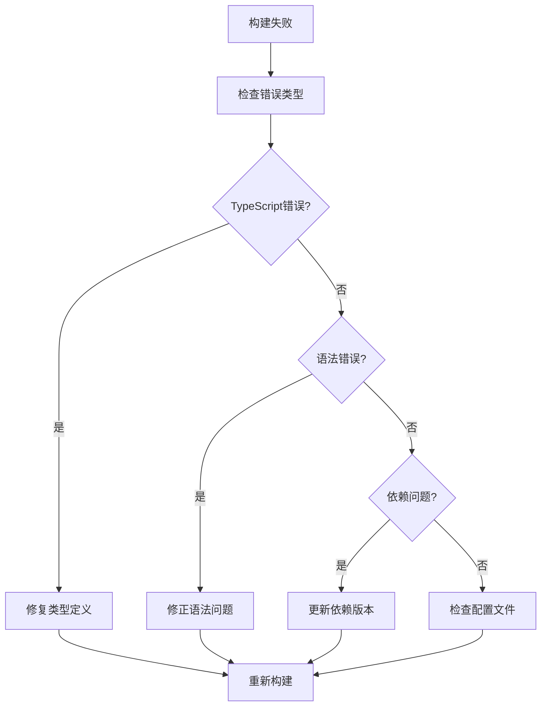

# Claude AI代理集成

<cite>
**本文档引用的文件**
- [CLAUDE.md](file://CLAUDE.md)
- [AGENTS.md](file://AGENTS.md)
- [.codex/skills/clone-website/SKILL.md](file://.codex/skills/clone-website/SKILL.md)
- [.augment/commands/clone-website.md](file://.augment/commands/clone-website.md)
- [.gemini/commands/clone-website.toml](file://.gemini/commands/clone-website.toml)
- [scripts/sync-skills.mjs](file://scripts/sync-skills.mjs)
- [scripts/sync-agent-rules.sh](file://scripts/sync-agent-rules.sh)
- [package.json](file://package.json)
- [.claude/skills/next-best-practices/SKILL.md](file://.claude/skills/next-best-practices/SKILL.md)
- [.claude/skills/next-cache-components/SKILL.md](file://.claude/skills/next-cache-components/SKILL.md)
- [.claude/skills/next-upgrade/SKILL.md](file://.claude/skills/next-upgrade/SKILL.md)
</cite>

## 目录
1. [简介](#简介)
2. [项目结构](#项目结构)
3. [核心组件](#核心组件)
4. [架构概览](#架构概览)
5. [详细组件分析](#详细组件分析)
6. [依赖关系分析](#依赖关系分析)
7. [性能考虑](#性能考虑)
8. [故障排除指南](#故障排除指南)
9. [结论](#结论)
10. [附录](#附录)

## 简介

本项目是一个基于Claude AI代理的网站克隆系统，专门用于将任何网站反向工程并重构为现代的Next.js代码库。该系统通过AI编码代理实现自动化网站克隆，支持像素级精确复制，并提供了完整的团队协作模式。

Claude AI代理在此项目中扮演着多重角色：
- **网站分析员**：负责分析目标网站的布局、样式、交互行为
- **架构师**：设计页面拓扑结构和组件划分策略
- **协调员**：管理多个builder代理的工作分配和合并流程
- **质量保证员**：执行视觉对比测试和行为验证

## 项目结构

该项目采用模块化设计，围绕Claude AI代理的核心功能构建：

**图表来源**
- [CLAUDE.md:1-18](file://CLAUDE.md#L1-L18)
- [AGENTS.md:1-66](file://AGENTS.md#L1-L66)
- [scripts/sync-skills.mjs:1-113](file://scripts/sync-skills.mjs#L1-L113)

**章节来源**
- [CLAUDE.md:1-18](file://CLAUDE.md#L1-L18)
- [AGENTS.md:1-66](file://AGENTS.md#L1-L66)
- [package.json:1-60](file://package.json#L1-L60)

## 核心组件

### Claude Code代理配置

Claude Code代理通过`.claude/skills/`目录下的技能文件进行配置。系统包含三个核心技能：

1. **网站克隆技能**：主要的克隆功能，支持多URL处理和并行构建
2. **最佳实践技能**：提供Next.js开发的最佳实践指导
3. **缓存组件技能**：针对Next.js 16+的缓存组件优化

### 技能同步机制

系统通过`sync-skills.mjs`脚本实现跨平台技能同步，自动生成适用于不同AI平台的配置文件。

**章节来源**
- [CLAUDE.md:3-18](file://CLAUDE.md#L3-L18)
- [.claude/skills/next-best-practices/SKILL.md:1-154](file://.claude/skills/next-best-practices/SKILL.md#L1-L154)
- [.claude/skills/next-cache-components/SKILL.md:1-412](file://.claude/skills/next-cache-components/SKILL.md#L1-L412)
- [.claude/skills/next-upgrade/SKILL.md:1-51](file://.claude/skills/next-upgrade/SKILL.md#L1-L51)

## 架构概览

**图表来源**
- [.codex/skills/clone-website/SKILL.md:120-404](file://.codex/skills/clone-website/SKILL.md#L120-L404)
- [AGENTS.md:60-63](file://AGENTS.md#L60-L63)

## 详细组件分析

### '/clone-website'技能配置

#### 技能文件结构

技能文件采用YAML前端内容格式，包含以下关键部分：

**图表来源**
- [.codex/skills/clone-website/SKILL.md:1-6](file://.codex/skills/clone-website/SKILL.md#L1-L6)

#### 配置参数详解

| 参数名称 | 类型 | 默认值 | 描述 |
|---------|------|--------|------|
| name | 字符串 | clone-website | 技能名称 |
| description | 字符串 | 网站克隆描述 | 技能描述 |
| argument-hint | 字符串 | "<url1> [<url2> ...]" | 参数提示格式 |
| user-invocable | 布尔值 | true | 是否允许用户调用 |

#### 预飞行检查流程

**图表来源**
- [.codex/skills/clone-website/SKILL.md:28-34](file://.codex/skills/clone-website/SKILL.md#L28-L34)

**章节来源**
- [.codex/skills/clone-website/SKILL.md:1-474](file://.codex/skills/clone-website/SKILL.md#L1-L474)
- [.augment/commands/clone-website.md:1-475](file://.augment/commands/clone-website.md#L1-L475)
- [.gemini/commands/clone-website.toml:1-477](file://.gemini/commands/clone-website.toml#L1-L477)

### 团队协作模式

#### 多代理分支工作树

系统采用Git工作树模式实现多代理协作：

**图表来源**
- [AGENTS.md:60-63](file://AGENTS.md#L60-L63)

#### 协作流程

1. **任务分解**：根据页面拓扑将复杂组件分解为子任务
2. **并行执行**：多个builder代理同时在独立工作树中开发
3. **智能合并**：协调员根据上下文信息解决合并冲突
4. **持续验证**：每次合并后执行构建和类型检查

**章节来源**
- [AGENTS.md:60-63](file://AGENTS.md#L60-L63)

### 安装配置步骤

#### 环境准备

1. **Node.js版本要求**：确保使用Node.js 24或更高版本
2. **项目依赖**：安装Next.js 16、React 19、Tailwind CSS v4
3. **AI平台配置**：配置Claude Code或其他支持的AI平台

#### API密钥设置

#### 工作空间配置

1. **项目根目录**：确保在项目根目录下运行命令
2. **权限设置**：确保有文件写入权限
3. **网络访问**：确保可以访问目标网站

**章节来源**
- [package.json:26-28](file://package.json#L26-L28)
- [AGENTS.md:12-17](file://AGENTS.md#L12-L17)

### 提示词优化策略

#### 指令优化原则

1. **明确性**：提供具体的CSS值和精确的尺寸
2. **完整性**：包含所有必要的上下文信息
3. **可执行性**：确保指令可以被AI代理理解和执行

#### 常用优化模式

| 优化类型 | 实现方式 | 示例效果 |
|---------|----------|----------|
| 状态描述 | 明确记录前后状态变化 | "从100vw变为1200px" |
| 交互模型 | 指定触发机制和过渡效果 | "滚动50px触发" |
| 资产识别 | 列出使用的具体资源 | "使用ArrowIcon组件" |
| 响应式设计 | 指定断点和变化 | "在768px断点切换" |

**章节来源**
- [.codex/skills/clone-website/SKILL.md:309-374](file://.codex/skills/clone-website/SKILL.md#L309-L374)

## 依赖关系分析

**图表来源**
- [package.json:37-58](file://package.json#L37-L58)

**章节来源**
- [package.json:1-60](file://package.json#L1-L60)

## 性能考虑

### 并行处理优化

1. **任务分割**：将大型组件分解为小任务，提高并行度
2. **资源管理**：控制同时运行的builder代理数量
3. **内存优化**：定期清理临时文件和缓存

### 构建性能

### 缓存策略

1. **浏览器缓存**：利用浏览器自动缓存减少重复请求
2. **组件缓存**：避免重复生成相同的组件代码
3. **构建缓存**：利用Next.js的增量构建功能

## 故障排除指南

### 常见问题及解决方案

#### 浏览器自动化问题

| 问题症状 | 可能原因 | 解决方案 |
|---------|----------|----------|
| 无法访问目标网站 | 网络连接问题 | 检查网络连接和代理设置 |
| 页面加载失败 | CSP限制 | 使用不同的浏览器工具 |
| 元素不可交互 | 动态内容加载 | 等待元素加载完成再操作 |

#### 构建错误

#### 性能问题

1. **内存不足**：减少同时运行的builder代理数量
2. **磁盘空间不足**：清理临时文件和缓存
3. **网络超时**：增加超时时间或使用本地镜像

**章节来源**
- [.codex/skills/clone-website/SKILL.md:446-463](file://.codex/skills/clone-website/SKILL.md#L446-L463)

## 结论

本项目为Claude AI代理的集成提供了完整的解决方案，通过精心设计的技能系统和团队协作模式，实现了高效的网站克隆自动化。关键优势包括：

1. **模块化设计**：清晰的技能分离和职责划分
2. **团队协作**：多代理并行工作和智能合并策略
3. **质量保证**：严格的构建验证和视觉对比测试
4. **跨平台兼容**：统一的技能文件生成机制

通过遵循本文档的配置指南和最佳实践，开发者可以充分利用Claude AI代理的强大能力，快速高质量地完成网站克隆项目。

## 附录

### 快速参考清单

- [ ] 确认Node.js版本满足要求
- [ ] 配置AI平台API密钥
- [ ] 验证浏览器自动化工具可用
- [ ] 运行预飞行检查
- [ ] 监控构建过程
- [ ] 执行视觉QA测试

### 支持的AI平台

- Claude Code
- GitHub Copilot
- Cursor
- Gemini CLI
- Continue
- OpenCode
- Windsurf
- Cline