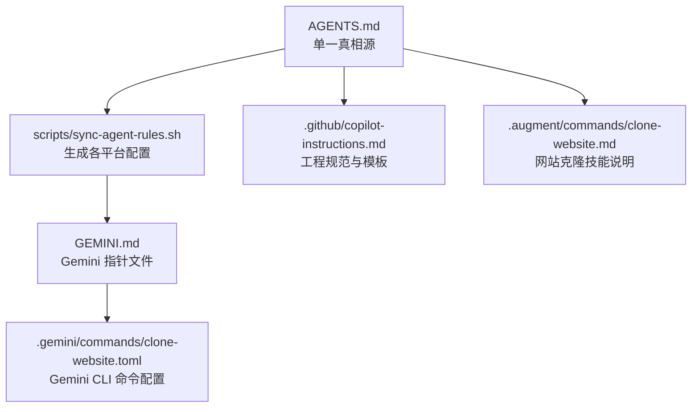
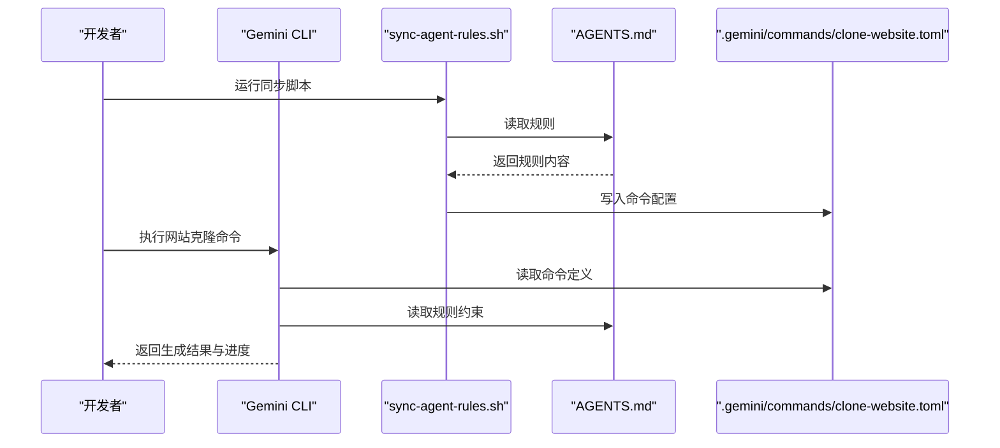
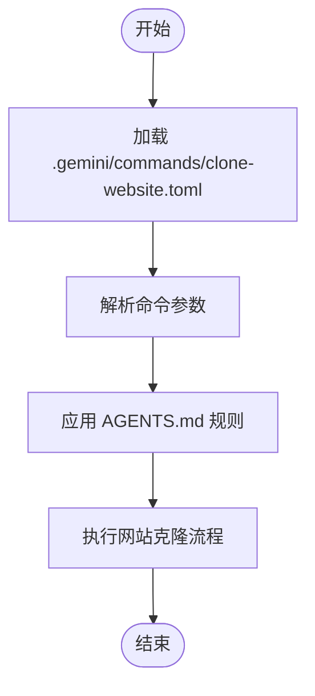
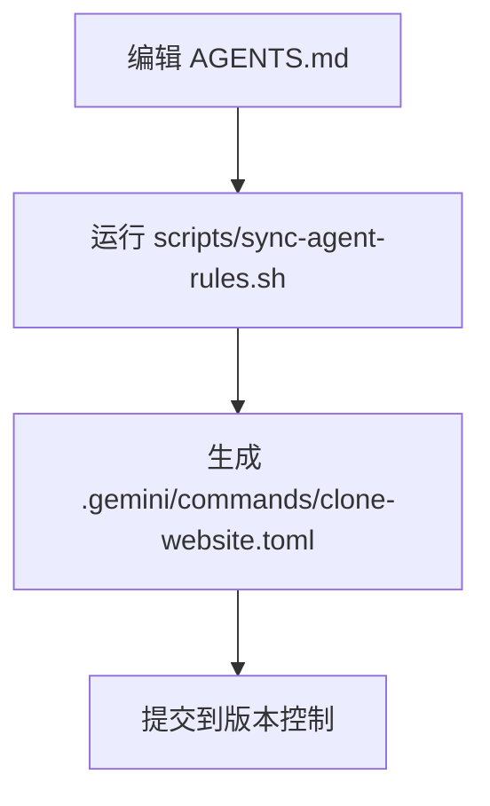
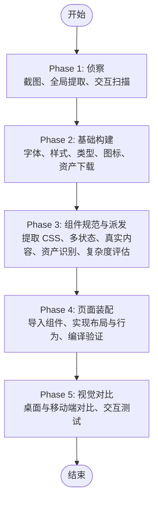
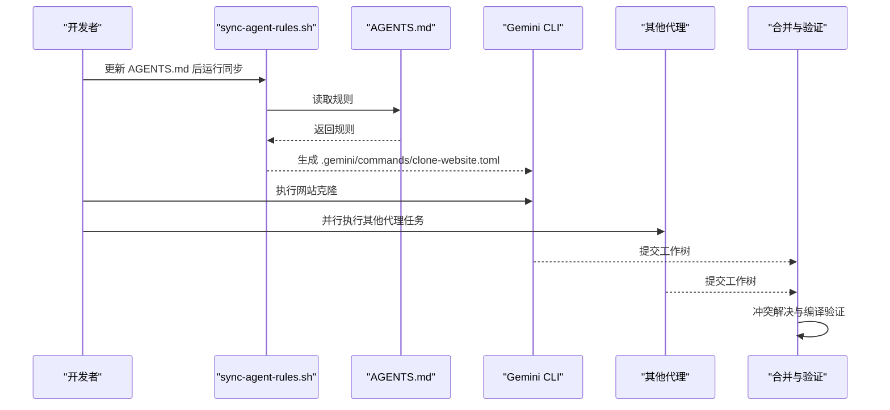
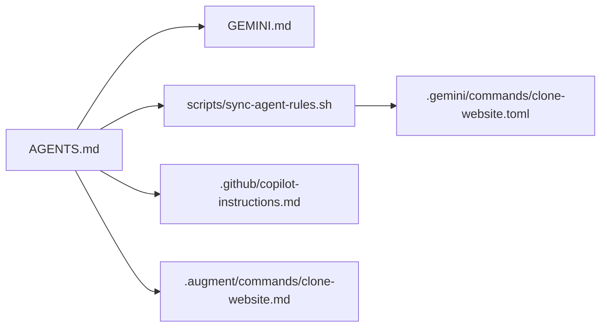

# Gemini AI集成

<cite>
**本文引用的文件**
- [GEMINI.md](file://GEMINI.md)
- [.gemini/commands/clone-website.toml](file://.gemini/commands/clone-website.toml)
- [AGENTS.md](file://AGENTS.md)
- [scripts/sync-agent-rules.sh](file://scripts/sync-agent-rules.sh)
- [.github/copilot-instructions.md](file://.github/copilot-instructions.md)
- [.github/copilot-setup-steps.yml](file://.github/copilot-setup-steps.yml)
- [.augment/commands/clone-website.md](file://.augment/commands/clone-website.md)
</cite>

## 目录
1. [简介](#简介)
2. [项目结构](#项目结构)
3. [核心组件](#核心组件)
4. [架构总览](#架构总览)
5. [详细组件分析](#详细组件分析)
6. [依赖关系分析](#依赖关系分析)
7. [性能考虑](#性能考虑)
8. [故障排除指南](#故障排除指南)
9. [结论](#结论)
10. [附录](#附录)

## 简介
本文件面向希望在网站克隆项目中集成与使用 Gemini AI 代理的开发者，系统性说明 Gemini 在本项目中的应用定位、配置方法、CLI 命令与参数、API 调用方式、提示词优化策略、与其它 AI 代理的协作模式以及故障排除与性能优化建议。  
本仓库采用“单一真相源”（AGENTS.md）统一管理各 AI 代理的规则与约束，并通过脚本自动生成各平台所需的配置文件。Gemini 作为 CLI 代理，通过指向 AGENTS.md 的轻量指针文件进行集成。

## 项目结构
围绕 Gemini 集成的关键目录与文件如下：
- .gemini/commands/clone-website.toml：Gemini CLI 的命令定义与参数配置
- GEMINI.md：Gemini CLI 的规则指针文件，指向 AGENTS.md
- AGENTS.md：所有 AI 代理的统一规则与约束来源
- scripts/sync-agent-rules.sh：从 AGENTS.md 生成各平台配置文件的同步脚本
- .github/copilot-instructions.md：通用工程规范与模板，辅助理解项目上下文
- .augment/commands/clone-website.md：网站克隆技能说明，体现 Gemini 可执行的工作流

**图表来源**
- [GEMINI.md](file://GEMINI.md)
- [.gemini/commands/clone-website.toml](file://.gemini/commands/clone-website.toml)
- [AGENTS.md](file://AGENTS.md)
- [scripts/sync-agent-rules.sh](file://scripts/sync-agent-rules.sh)
- [.github/copilot-instructions.md](file://.github/copilot-instructions.md)
- [.augment/commands/clone-website.md](file://.augment/commands/clone-website.md)

**章节来源**
- [GEMINI.md](file://GEMINI.md)
- [.gemini/commands/clone-website.toml](file://.gemini/commands/clone-website.toml)
- [AGENTS.md](file://AGENTS.md)
- [scripts/sync-agent-rules.sh](file://scripts/sync-agent-rules.sh)
- [.github/copilot-instructions.md](file://.github/copilot-instructions.md)
- [.augment/commands/clone-website.md](file://.augment/commands/clone-website.md)

## 核心组件
- 规则源文件（AGENTS.md）
  - 所有 AI 代理的统一规则与约束均在此维护，Gemini 通过 GEMINI.md 指向该文件。
- 同步脚本（scripts/sync-agent-rules.sh）
  - 将 AGENTS.md 解析为各平台所需的配置文件，包括 Gemini 的 .gemini/commands/clone-website.toml。
- 指针文件（GEMINI.md）
  - 仅包含对 AGENTS.md 的引用，确保 Gemini CLI 使用最新规则。
- 命令配置（.gemini/commands/clone-website.toml）
  - 定义 Gemini CLI 的命令行为、参数与默认值，供 Gemini CLI 读取执行。
- 工程规范（.github/copilot-instructions.md）
  - 提供 Next.js + shadcn/ui + Tailwind v4 的技术栈、命令与风格约束，便于 Gemini 理解项目上下文。
- 技能说明（.augment/commands/clone-website.md）
  - 详述网站克隆的完整工作流（侦察、基础构建、组件规范与派发、页面装配、视觉对比），为 Gemini 的提示词设计提供依据。

**章节来源**
- [GEMINI.md](file://GEMINI.md)
- [.gemini/commands/clone-website.toml](file://.gemini/commands/clone-website.toml)
- [AGENTS.md](file://AGENTS.md)
- [scripts/sync-agent-rules.sh](file://scripts/sync-agent-rules.sh)
- [.github/copilot-instructions.md](file://.github/copilot-instructions.md)
- [.augment/commands/clone-website.md](file://.augment/commands/clone-website.md)

## 架构总览
Gemini 集成遵循“规则集中化 + 平台适配”的架构：
- 规则集中化：AGENTS.md 作为唯一规则源，统一约束与最佳实践
- 平台适配：通过 sync-agent-rules.sh 生成各平台配置；Gemini 通过 GEMINI.md 指向 AGENTS.md
- 命令执行：Gemini CLI 读取 .gemini/commands/clone-website.toml 中的命令定义，结合工程规范与技能说明完成网站克隆任务

**图表来源**
- [scripts/sync-agent-rules.sh](file://scripts/sync-agent-rules.sh)
- [AGENTS.md](file://AGENTS.md)
- [.gemini/commands/clone-website.toml](file://.gemini/commands/clone-website.toml)

## 详细组件分析

### 组件一：Gemini CLI 命令与配置
- 命令文件位置：.gemini/commands/clone-website.toml
- 作用：定义 Gemini CLI 的命令行为、参数与默认值，供 Gemini CLI 读取执行
- 关联规则：GEMINI.md 指向 AGENTS.md，确保 Gemini CLI 使用统一规则

**图表来源**
- [.gemini/commands/clone-website.toml](file://.gemini/commands/clone-website.toml)
- [GEMINI.md](file://GEMINI.md)
- [AGENTS.md](file://AGENTS.md)

**章节来源**
- [.gemini/commands/clone-website.toml](file://.gemini/commands/clone-website.toml)
- [GEMINI.md](file://GEMINI.md)

### 组件二：规则同步与生成
- 脚本职责：从 AGENTS.md 生成各平台配置文件，包括 Gemini 的 .gemini/commands/clone-website.toml
- 关键点：编辑 AGENTS.md 后需运行脚本更新所有代理配置

**图表来源**
- [scripts/sync-agent-rules.sh](file://scripts/sync-agent-rules.sh)
- [AGENTS.md](file://AGENTS.md)

**章节来源**
- [scripts/sync-agent-rules.sh](file://scripts/sync-agent-rules.sh)
- [AGENTS.md](file://AGENTS.md)

### 组件三：网站克隆工作流（面向 Gemini 的提示词设计）
- 工作流概述：侦察（截图、全局提取、交互扫描）、基础构建（字体、样式、类型、图标、资产下载）、组件规范与派发（提取 CSS、多状态、真实内容、资产识别、复杂度评估）、页面装配（导入组件、实现布局与行为）、视觉对比（桌面与移动端对比、交互测试）
- Gemini 提示词要点：
  - 明确目标：像素级复刻，匹配颜色、间距、字体、动画
  - 限定范围：不包含真实后端、认证、实时特性、SEO、可访问性审计
  - 强调完整性：每个组件必须有完整的规范文件，包含外观与行为、多状态、响应式断点
  - 强制编译验证：每个构建阶段完成后执行类型检查与构建校验
  - 复杂度预算：单个组件规范不超过约 150 行，避免一次性构建过多子组件
  - 实际内容优先：使用真实文本与资源，而非占位符
  - 全局优先：先完成基础（设计令牌、类型、图标、资产），再并行构建其余部分
  - 交互模型：先滚动后点击，确定是点击驱动还是滚动驱动，错误的交互模型会导致完全错误的实现
  - 层次资产：注意叠加图层（背景水彩 + 前景 UI PNG + 覆盖图标），遗漏覆盖图层会使克隆看起来空洞
  - 平滑滚动：检查 Lenis/Locomotive 等平滑滚动库的存在与使用
  - 规范文件为“事实来源”：构建器收到的规范文件内容即合同，不可依赖外部文档

**图表来源**
- [.augment/commands/clone-website.md](file://.augment/commands/clone-website.md)

**章节来源**
- [.augment/commands/clone-website.md](file://.augment/commands/clone-website.md)

### 组件四：与其它 AI 代理的协作模式
- 单一真相源：AGENTS.md 是所有代理的共同规则源
- 平台适配：通过 sync-agent-rules.sh 生成各平台配置文件，Gemini 通过 GEMINI.md 指向 AGENTS.md
- 协作原则：
  - 各代理在自己的工作树分支中并行工作，完成后统一合并与冲突解决
  - 每个构建器接收完整的组件规范文件内容，无需查阅外部文档
  - 每个阶段完成后进行编译验证，确保构建始终处于可发布状态

**图表来源**
- [scripts/sync-agent-rules.sh](file://scripts/sync-agent-rules.sh)
- [AGENTS.md](file://AGENTS.md)
- [.gemini/commands/clone-website.toml](file://.gemini/commands/clone-website.toml)

**章节来源**
- [scripts/sync-agent-rules.sh](file://scripts/sync-agent-rules.sh)
- [AGENTS.md](file://AGENTS.md)

## 依赖关系分析
- GEMINI.md 依赖 AGENTS.md（规则源）
- .gemini/commands/clone-website.toml 由 sync-agent-rules.sh 生成
- .github/copilot-instructions.md 与 .augment/commands/clone-website.md 为 Gemini 的提示词与工作流提供上下文支撑

**图表来源**
- [GEMINI.md](file://GEMINI.md)
- [AGENTS.md](file://AGENTS.md)
- [scripts/sync-agent-rules.sh](file://scripts/sync-agent-rules.sh)
- [.gemini/commands/clone-website.toml](file://.gemini/commands/clone-website.toml)
- [.github/copilot-instructions.md](file://.github/copilot-instructions.md)
- [.augment/commands/clone-website.md](file://.augment/commands/clone-website.md)

**章节来源**
- [GEMINI.md](file://GEMINI.md)
- [AGENTS.md](file://AGENTS.md)
- [scripts/sync-agent-rules.sh](file://scripts/sync-agent-rules.sh)
- [.gemini/commands/clone-website.toml](file://.gemini/commands/clone-website.toml)
- [.github/copilot-instructions.md](file://.github/copilot-instructions.md)
- [.augment/commands/clone-website.md](file://.augment/commands/clone-website.md)

## 性能考虑
- 并行化与隔离：多站点克隆时尽可能并行处理，同时保持每站点的提取产物隔离在独立目录，减少相互影响
- 复杂度预算：单个组件规范控制在约 150 行以内，避免一次性构建过多子组件导致提示词过长与生成质量下降
- 编译验证前置：每次合并后立即执行编译验证，尽早发现类型错误与构建问题
- 资产批量下载：使用批处理并行下载图片、视频等二进制资源，提升整体效率
- 交互扫描：先滚动后点击，避免重复交互与无效工作

## 故障排除指南
- 规则未生效
  - 确认已运行同步脚本，使 .gemini/commands/clone-website.toml 与 AGENTS.md 保持一致
  - 检查 GEMINI.md 是否正确指向 AGENTS.md
- 构建失败
  - 每次合并后执行编译验证，修复类型错误后再继续
  - 确保每个组件规范文件完整，避免构建器因缺少必要信息而失败
- 组件实现与规范不符
  - 回到组件规范文件核对提取值，必要时重新提取并修正组件
- 交互模型错误
  - 先滚动后点击，明确是滚动驱动还是点击驱动，错误的交互模型会导致完全错误的实现
- 资产缺失
  - 检查是否遗漏叠加图层（背景水彩 + 前景 UI PNG + 覆盖图标），确保所有图像与图标都已下载并正确引用
- 平滑滚动差异
  - 检查是否存在 Lenis 或 Locomotive 等平滑滚动库，确保克隆后的滚动体验一致

**章节来源**
- [scripts/sync-agent-rules.sh](file://scripts/sync-agent-rules.sh)
- [GEMINI.md](file://GEMINI.md)
- [.augment/commands/clone-website.md](file://.augment/commands/clone-website.md)

## 结论
通过将 AGENTS.md 作为单一真相源，并借助 sync-agent-rules.sh 自动生成 Gemini CLI 的命令配置，本项目实现了 Gemini 与其它 AI 代理的统一规则与高效协作。配合完善的网站克隆工作流与严格的编译验证机制，Gemini 能够稳定、高质量地完成像素级网站复刻任务。开发者只需维护 AGENTS.md 并按流程执行，即可最大化发挥 Gemini 的能力，显著提升开发效率。

## 附录
- 安装与配置步骤
  - 安装依赖：参考 .github/copilot-setup-steps.yml 中的依赖安装步骤
  - 编辑规则：在 AGENTS.md 中维护统一规则
  - 同步配置：运行 scripts/sync-agent-rules.sh 生成各平台配置文件
  - 执行命令：使用 Gemini CLI 执行网站克隆命令
- 认证与环境变量
  - 本项目未提供具体的认证与环境变量配置示例，请根据 Gemini CLI 的官方要求进行配置
- 提示词优化建议
  - 明确目标与范围，强调像素级复刻与实际内容优先
  - 强制编译验证与复杂度预算，确保生成质量与可维护性
  - 交互模型先行，避免错误的交互实现导致返工

**章节来源**
- [.github/copilot-setup-steps.yml](file://.github/copilot-setup-steps.yml)
- [scripts/sync-agent-rules.sh](file://scripts/sync-agent-rules.sh)
- [AGENTS.md](file://AGENTS.md)
- [.augment/commands/clone-website.md](file://.augment/commands/clone-website.md)