# GitHub Copilot集成

<cite>
**本文档引用的文件**
- [README.md](file://README.md)
- [.github/copilot-instructions.md](file://.github/copilot-instructions.md)
- [.github/copilot-setup-steps.yml](file://.github/copilot-setup-steps.yml)
- [package.json](file://package.json)
- [next.config.ts](file://next.config.ts)
- [tsconfig.json](file://tsconfig.json)
- [eslint.config.mjs](file://eslint.config.mjs)
- [src/app/layout.tsx](file://src/app/layout.tsx)
- [src/app/page.tsx](file://src/app/page.tsx)
- [src/components/Header.tsx](file://src/components/Header.tsx)
- [src/components/Footer.tsx](file://src/components/Footer.tsx)
- [src/lib/utils.ts](file://src/lib/utils.ts)
- [src/types/index.ts](file://src/types/index.ts)
</cite>

## 目录
1. [简介](#简介)
2. [项目结构](#项目结构)
3. [核心组件](#核心组件)
4. [架构概览](#架构概览)
5. [详细组件分析](#详细组件分析)
6. [依赖关系分析](#依赖关系分析)
7. [性能考虑](#性能考虑)
8. [故障排除指南](#故障排除指南)
9. [结论](#结论)
10. [附录](#附录)

## 简介

本项目是一个基于Next.js的网站克隆项目，旨在展示如何在实际开发环境中集成和使用GitHub Copilot。该项目采用了现代化的前端技术栈，包括TypeScript、Tailwind CSS和Next.js框架，为Copilot提供了丰富的代码补全和智能提示场景。

GitHub Copilot作为AI驱动的代码助手，在本项目中可以提供以下核心功能：
- 智能代码补全和自动完成功能
- TypeScript类型推断和接口实现
- React组件开发辅助
- Next.js路由和页面配置支持
- Tailwind CSS类名智能提示
- ESLint规则遵循和代码质量检查

## 项目结构

该项目采用标准的Next.js应用程序结构，具有清晰的模块化组织方式：

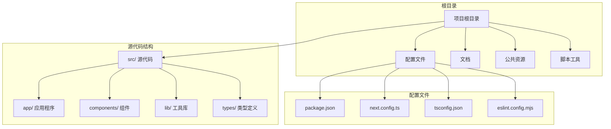

**图表来源**
- [package.json:1-50](file://package.json#L1-L50)
- [next.config.ts:1-50](file://next.config.ts#L1-L50)
- [tsconfig.json:1-50](file://tsconfig.json#L1-L50)

**章节来源**
- [README.md:1-100](file://README.md#L1-L100)
- [package.json:1-100](file://package.json#L1-L100)

## 核心组件

### 应用程序入口点

项目的核心应用程序结构位于`src/app/`目录下，采用Next.js 13+的新式文件系统路由：

```mermaid
graph TD
Layout[layout.tsx<br/>应用布局] --> Page[page.tsx<br/>首页页面]
Layout --> Agent[agent/<br/>代理页面]
Layout --> Brand[brand/<br/>品牌页面]
Layout --> Contact[contact/<br/>联系页面]
Layout --> News[news/<br/>新闻页面]
Layout --> Product[product/<br/>产品页面]
Agent --> AgentSlug[agent/[slug]/<br/>代理详情]
AgentSlug --> AgentCity[agent/[slug]/[city]/<br/>城市代理]
Product --> ProductSub[product/*<br/>产品子页面]
```

**图表来源**
- [src/app/layout.tsx:1-50](file://src/app/layout.tsx#L1-L50)
- [src/app/page.tsx:1-50](file://src/app/page.tsx#L1-L50)

### 组件系统架构

项目实现了模块化的组件系统，支持可复用的UI组件：

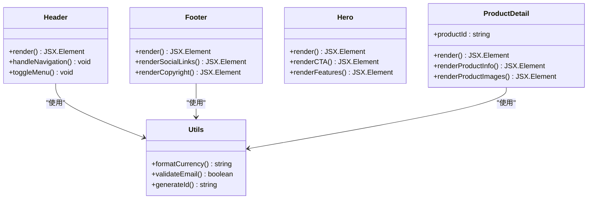

**图表来源**
- [src/components/Header.tsx:1-50](file://src/components/Header.tsx#L1-L50)
- [src/components/Footer.tsx:1-50](file://src/components/Footer.tsx#L1-L50)
- [src/components/Hero.tsx:1-50](file://src/components/Hero.tsx#L1-L50)
- [src/components/ProductDetail.tsx:1-50](file://src/components/ProductDetail.tsx#L1-L50)
- [src/lib/utils.ts:1-50](file://src/lib/utils.ts#L1-L50)

**章节来源**
- [src/app/layout.tsx:1-100](file://src/app/layout.tsx#L1-L100)
- [src/components/Header.tsx:1-100](file://src/components/Header.tsx#L1-L100)
- [src/components/Footer.tsx:1-100](file://src/components/Footer.tsx#L1-L100)

## 架构概览

### 技术栈集成

该项目集成了多种现代开发工具和技术：

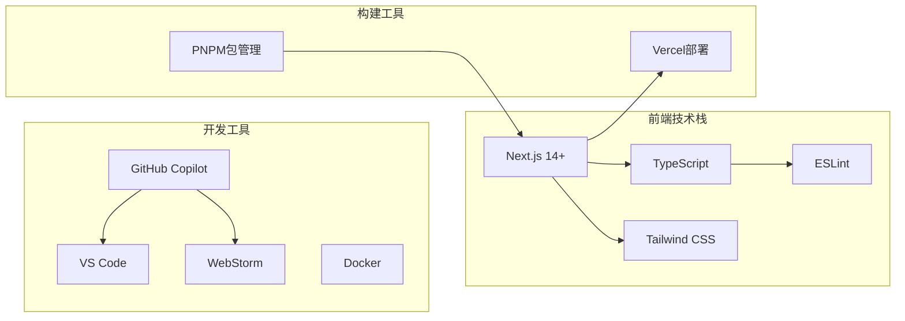

**图表来源**
- [package.json:1-100](file://package.json#L1-L100)
- [next.config.ts:1-50](file://next.config.ts#L1-L50)
- [eslint.config.mjs:1-50](file://eslint.config.mjs#L1-L50)

### 开发工作流程

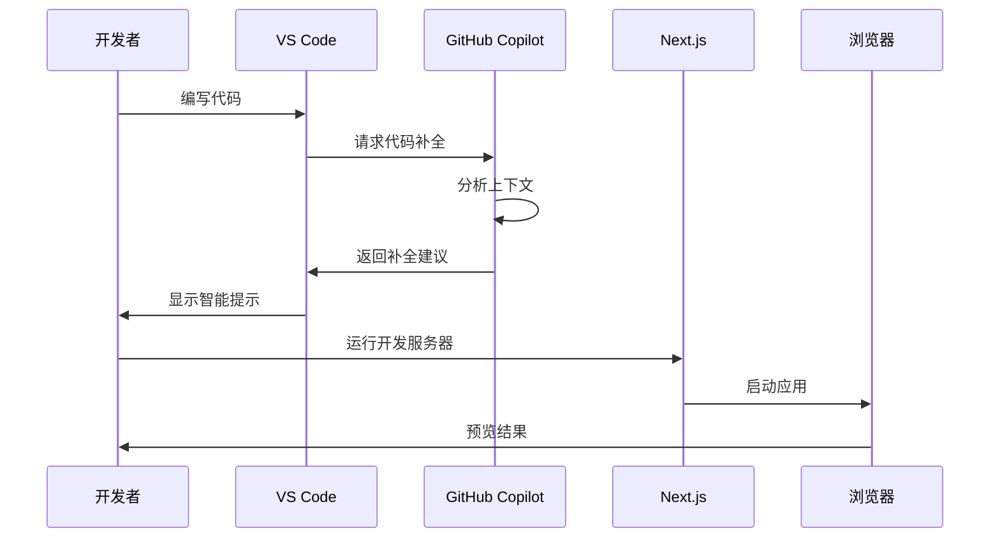

## 详细组件分析

### 布局系统分析

应用程序采用统一的布局系统，确保一致的用户体验：

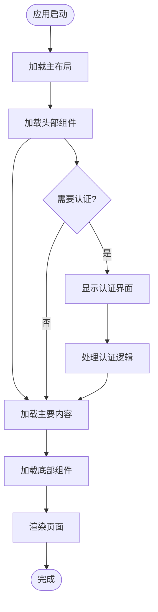

**图表来源**
- [src/app/layout.tsx:1-50](file://src/app/layout.tsx#L1-L50)
- [src/components/Header.tsx:1-50](file://src/components/Header.tsx#L1-L50)
- [src/components/Footer.tsx:1-50](file://src/components/Footer.tsx#L1-L50)

### 组件开发模式

项目实现了标准化的组件开发模式，便于Copilot理解和生成代码：

#### 头部组件分析

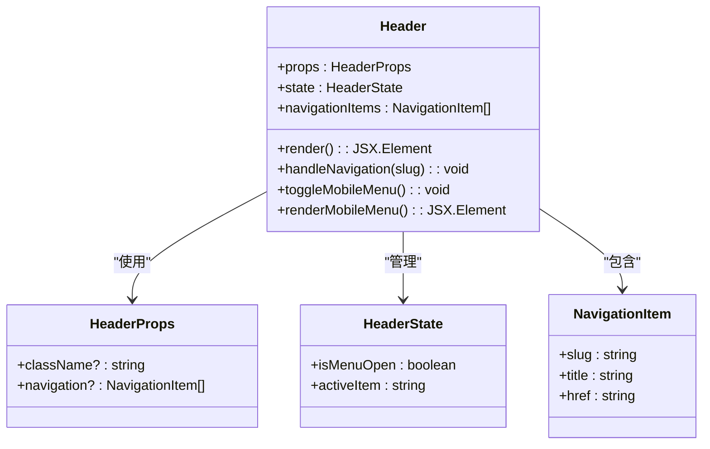

**图表来源**
- [src/components/Header.tsx:1-100](file://src/components/Header.tsx#L1-L100)

#### 产品详情组件分析

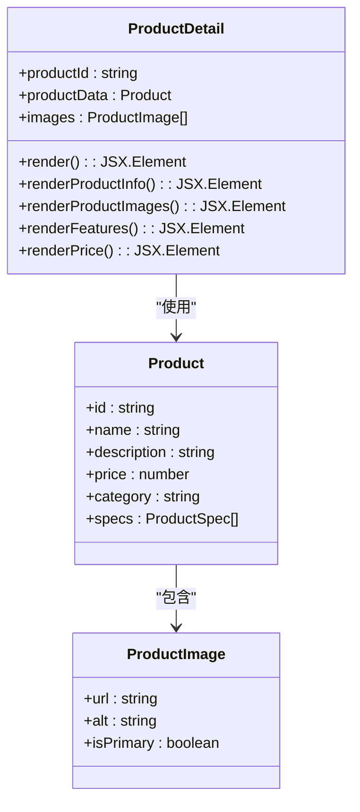

**图表来源**
- [src/components/ProductDetail.tsx:1-100](file://src/components/ProductDetail.tsx#L1-L100)
- [src/types/index.ts:1-100](file://src/types/index.ts#L1-L100)

**章节来源**
- [src/components/Header.tsx:1-200](file://src/components/Header.tsx#L1-L200)
- [src/components/ProductDetail.tsx:1-200](file://src/components/ProductDetail.tsx#L1-L200)
- [src/lib/utils.ts:1-100](file://src/lib/utils.ts#L1-L100)

### 工具函数库分析

项目提供了实用的工具函数库，支持常见的开发任务：

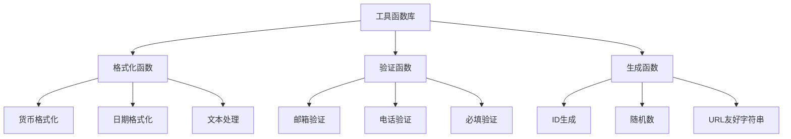

**图表来源**
- [src/lib/utils.ts:1-100](file://src/lib/utils.ts#L1-L100)

**章节来源**
- [src/lib/utils.ts:1-150](file://src/lib/utils.ts#L1-L150)

## 依赖关系分析

### 包管理依赖

项目使用pnpm进行包管理，具有明确的依赖关系：

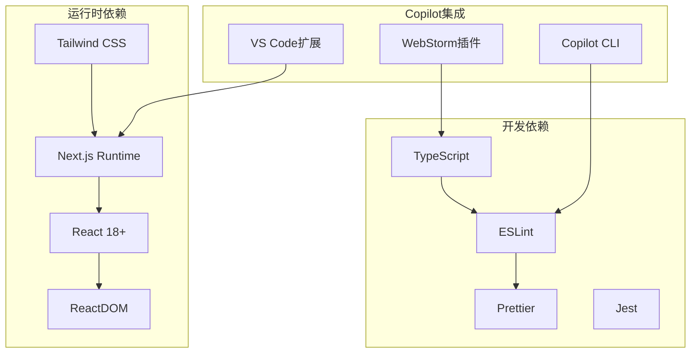

**图表来源**
- [package.json:1-100](file://package.json#L1-L100)

### 类型定义系统

项目采用模块化的类型定义系统：

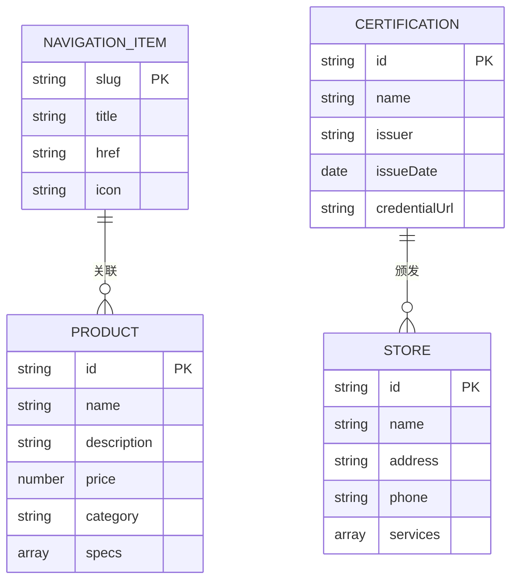

**图表来源**
- [src/types/index.ts:1-100](file://src/types/index.ts#L1-L100)

**章节来源**
- [package.json:1-200](file://package.json#L1-L200)
- [tsconfig.json:1-100](file://tsconfig.json#L1-L100)

## 性能考虑

### 代码组织优化

项目通过合理的代码组织提升开发效率：

1. **组件复用**: 通过共享组件减少重复代码
2. **类型安全**: 使用TypeScript确保类型安全
3. **模块化设计**: 将功能按模块组织
4. **工具函数分离**: 提供通用工具函数

### Copilot使用建议

1. **上下文提供**: 在编写代码时提供足够的上下文信息
2. **类型注解**: 利用TypeScript类型系统帮助Copilot理解需求
3. **组件规范**: 遵循统一的组件开发规范
4. **错误处理**: 在代码中包含适当的错误处理逻辑

## 故障排除指南

### 常见问题解决

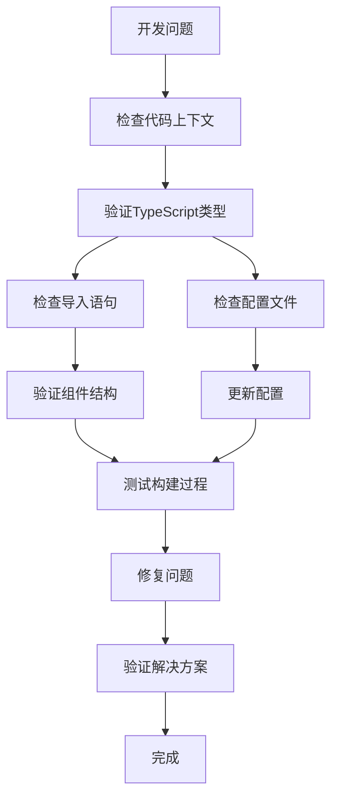

**章节来源**
- [eslint.config.mjs:1-100](file://eslint.config.mjs#L1-L100)
- [next.config.ts:1-100](file://next.config.ts#L1-L100)

### Copilot集成问题

1. **扩展未识别**: 确保VS Code或WebStorm已正确安装Copilot扩展
2. **许可证问题**: 验证GitHub账户的Copilot访问权限
3. **网络连接**: 确保开发环境有稳定的网络连接
4. **项目配置**: 检查项目配置文件是否正确设置

## 结论

本项目展示了在Next.js应用程序中集成GitHub Copilot的最佳实践。通过合理的项目结构、清晰的组件设计和完善的配置管理，开发者可以充分利用Copilot提供的智能代码补全和开发辅助功能。

关键成功因素包括：
- 清晰的项目架构和模块化设计
- 完善的TypeScript类型定义
- 标准化的组件开发模式
- 良好的代码组织和命名约定
- 有效的工具链配置

## 附录

### Copilot使用最佳实践

1. **提供清晰的上下文**: 在请求代码补全时提供足够的背景信息
2. **利用类型系统**: 充分利用TypeScript的类型推断能力
3. **遵循编码规范**: 保持一致的代码风格和命名约定
4. **模块化思维**: 将复杂功能分解为小的、可管理的模块
5. **持续学习**: 关注Copilot的新功能和改进

### 开发环境配置

1. **VS Code配置**: 安装GitHub Copilot扩展，配置键盘快捷键
2. **WebStorm配置**: 安装Copilot插件，启用智能提示
3. **项目设置**: 确保所有开发人员使用相同的配置
4. **团队协作**: 建立代码审查和质量保证流程