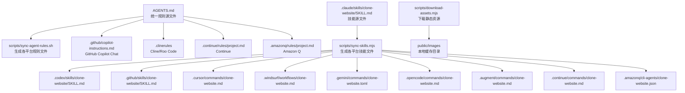
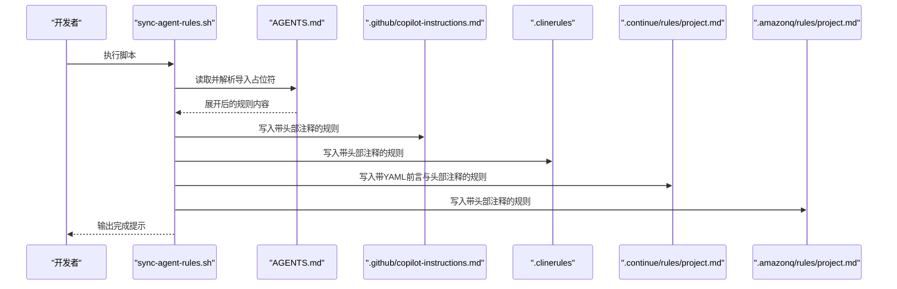
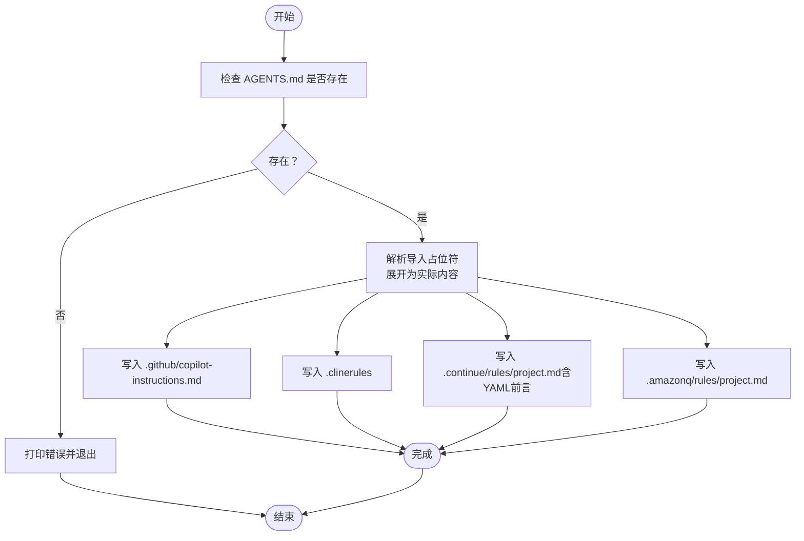
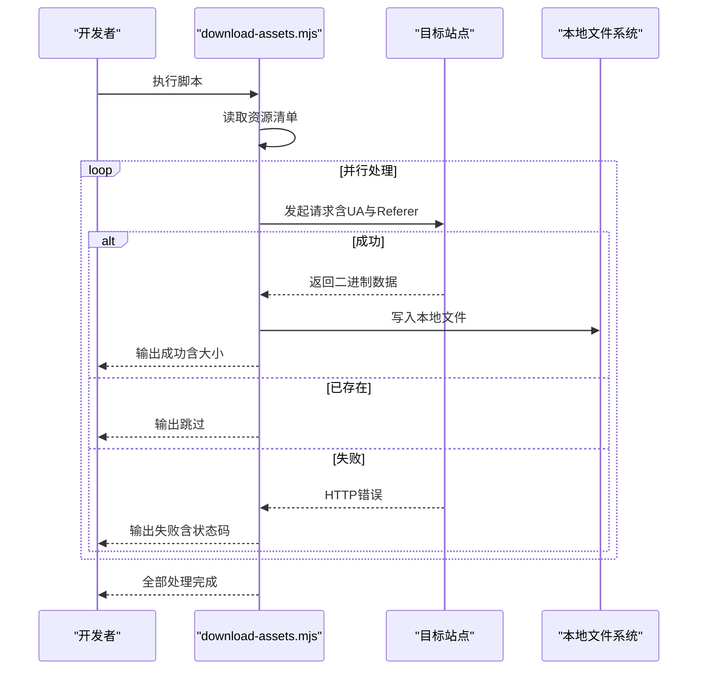
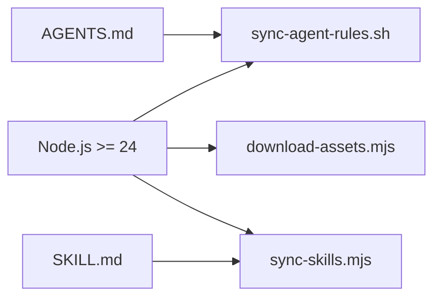

# 自动化脚本

<cite>
**本文引用的文件**
- [scripts/sync-agent-rules.sh](file://scripts/sync-agent-rules.sh)
- [scripts/download-assets.mjs](file://scripts/download-assets.mjs)
- [scripts/sync-skills.mjs](file://scripts/sync-skills.mjs)
- [AGENTS.md](file://AGENTS.md)
- [package.json](file://package.json)
</cite>

## 目录
1. [简介](#简介)
2. [项目结构](#项目结构)
3. [核心组件](#核心组件)
4. [架构总览](#架构总览)
5. [详细组件分析](#详细组件分析)
6. [依赖分析](#依赖分析)
7. [性能考虑](#性能考虑)
8. [故障排除指南](#故障排除指南)
9. [结论](#结论)
10. [附录](#附录)

## 简介
本文件面向需要使用AI代理进行网站克隆与工程化的开发者，系统性说明两类自动化脚本：  
- 同步类脚本：将统一的“代理规则源文件”生成为各平台（如 Cline、Continue、Amazon Q、GitHub Copilot Chat 等）所需的指令文件，确保多平台一致的开发约定与工作流。  
- 资源下载脚本：从目标站点批量下载图片、视频等静态资源到本地 public 目录，便于后续在Next.js应用中直接引用。

通过规范化的脚本执行与参数配置，开发者可以显著提升从“目标站点逆向工程”到“Next.js代码基”的整体效率，并降低跨平台协作中的信息偏差。

## 项目结构
与本主题直接相关的目录与文件如下：
- scripts/sync-agent-rules.sh：将 AGENTS.md 同步到各平台的规则文件
- scripts/download-assets.mjs：下载指定静态资源到 public/images
- scripts/sync-skills.mjs：将 .claude/skills/clone-website/SKILL.md 同步到各平台的技能/命令文件
- AGENTS.md：统一的代理规则与项目约定源文件
- package.json：Node.js 版本要求与常用脚本入口

**图表来源**
- [scripts/sync-agent-rules.sh:1-89](file://scripts/sync-agent-rules.sh#L1-L89)
- [scripts/sync-skills.mjs:1-113](file://scripts/sync-skills.mjs#L1-L113)
- [AGENTS.md:1-66](file://AGENTS.md#L1-L66)

**章节来源**
- [package.json:26-36](file://package.json#L26-L36)

## 核心组件
- 同步代理规则脚本：将 AGENTS.md 解析并写入多个平台的规则文件，支持导入占位符解析与自动头部注释生成。
- 下载静态资源脚本：按清单批量下载图片/视频，自动跳过已存在文件，输出下载结果统计。
- 同步技能脚本：将 .claude/skills/clone-website/SKILL.md 按不同平台格式生成对应文件，含参数替换与头部注释。

**章节来源**
- [scripts/sync-agent-rules.sh:1-89](file://scripts/sync-agent-rules.sh#L1-L89)
- [scripts/download-assets.mjs:1-64](file://scripts/download-assets.mjs#L1-L64)
- [scripts/sync-skills.mjs:1-113](file://scripts/sync-skills.mjs#L1-L113)

## 架构总览
下图展示“规则同步”与“资源下载”的端到端流程，以及与源文件和输出目录的关系。

**图表来源**
- [scripts/sync-agent-rules.sh:33-89](file://scripts/sync-agent-rules.sh#L33-L89)
- [AGENTS.md:60-66](file://AGENTS.md#L60-L66)

## 详细组件分析

### 组件A：同步代理规则脚本（sync-agent-rules.sh）
- 作用概述
  - 将 AGENTS.md 作为单一真实来源，生成各AI平台所需的规则文件，避免重复维护。
  - 支持解析以 @ 开头的导入占位符，将其替换为对应文件的实际内容；未找到时插入占位注释。
  - 为不同平台生成带统一头部注释的文件，明确来源与再生方式。
- 关键行为
  - 参数与输入：无外部参数，固定读取仓库根目录下的 AGENTS.md。
  - 导入解析：逐行扫描，识别形如 @path 的占位符，拼接为绝对路径后读取文件内容或输出“未找到”注释。
  - 文件生成：为 GitHub Copilot Chat、Cline/Roo Code、Continue、Amazon Q 等平台写入规则文件，均带有统一头部注释。
  - 错误处理：当 AGENTS.md 不存在时，打印错误并退出非零状态码。
  - 日志输出：打印同步进度与完成提示，便于CI/本地确认。
- 使用方法
  - 在仓库根目录执行脚本，修改 AGENTS.md 后再运行以更新所有平台规则文件。
  - 若新增平台或调整规则，请在脚本中添加相应写入逻辑。
- 可扩展点
  - 新增平台：在写入段落追加新的 write_file 调用，设置目标路径与内容。
  - 导入策略：可扩展解析规则，支持更多占位符语法或嵌套导入。
- 与开发流程集成
  - 建议在 PR 合并前统一执行一次同步，确保多平台规则一致性。
  - CI 中可加入该脚本执行步骤，失败即阻断合并。

**图表来源**
- [scripts/sync-agent-rules.sh:25-89](file://scripts/sync-agent-rules.sh#L25-L89)

**章节来源**
- [scripts/sync-agent-rules.sh:1-89](file://scripts/sync-agent-rules.sh#L1-L89)
- [AGENTS.md:60-66](file://AGENTS.md#L60-L66)

### 组件B：下载静态资源脚本（download-assets.mjs）
- 作用概述
  - 从目标站点批量下载图片/视频等静态资源到本地 public/images 或 public/videos 目录。
  - 对已存在的本地文件进行跳过，避免重复下载；对HTTP异常返回记录失败原因。
- 关键行为
  - 配置清单：在脚本内维护一个资源数组，包含远程URL与本地相对路径。
  - 并发策略：使用 Promise.all 并行下载，提升吞吐量。
  - 请求头：设置合理的 User-Agent 与 Referer，提高成功率。
  - 结果统计：逐项输出成功（含大小）、跳过（缓存）、失败（含HTTP状态码）。
- 使用方法
  - 在仓库根目录执行脚本，会自动创建所需子目录并下载资源。
  - 如需新增资源，请在资源清单中添加条目。
- 可扩展点
  - 支持更多媒体类型：在清单中增加视频/音频条目，或扩展为从外部配置文件加载。
  - 失败重试：为失败项增加重试机制或队列。
  - 进度条：在控制台输出更详细的进度信息。
- 与开发流程集成
  - 在首次克隆目标站点后执行一次下载，随后在Next.js应用中直接引用 public 下的资源。
  - CI 中可作为构建前置步骤，确保静态资源可用。

**图表来源**
- [scripts/download-assets.mjs:26-58](file://scripts/download-assets.mjs#L26-L58)

**章节来源**
- [scripts/download-assets.mjs:1-64](file://scripts/download-assets.mjs#L1-L64)

### 组件C：同步技能脚本（sync-skills.mjs）
- 作用概述
  - 将 .claude/skills/clone-website/SKILL.md 作为源文件，生成各平台的技能/命令文件，统一描述与参数占位符替换。
- 关键行为
  - 解析源文件：提取YAML前言与正文，若缺失则报错并退出。
  - 参数替换：根据平台差异将 $ARGUMENTS 替换为各平台支持的占位符（如 {{args}} 或直接保留）。
  - 文件生成：为 Codex、GitHub Copilot、Cursor、Windsurf、Gemini CLI、OpenCode、Augment、Continue、Amazon Q 等平台分别写入对应格式文件。
  - 头部注释：统一添加自动生成注释，指导后续再生。
- 使用方法
  - 修改 .claude/skills/clone-website/SKILL.md 后执行脚本，即可更新所有平台文件。
- 可扩展点
  - 新增平台：在生成段落追加新的写入逻辑，注意参数占位符与文件格式差异。
- 与开发流程集成
  - 在技能文档变更后统一执行，保证各平台一致的提示词与上下文。

**章节来源**
- [scripts/sync-skills.mjs:1-113](file://scripts/sync-skills.mjs#L1-L113)

## 依赖分析
- Node.js 版本要求
  - 脚本与项目均要求 Node.js >= 24，确保现代ES模块与API可用。
- 外部依赖
  - 本仓库脚本均为内置模块（fs、path、url等），无需额外安装依赖。
- 平台兼容性
  - Bash脚本在Linux/macOS通用；Windows用户建议使用WSL或Git Bash运行。

**图表来源**
- [package.json:26-28](file://package.json#L26-L28)
- [scripts/sync-agent-rules.sh:1-10](file://scripts/sync-agent-rules.sh#L1-L10)
- [scripts/sync-skills.mjs:1-8](file://scripts/sync-skills.mjs#L1-L8)
- [scripts/download-assets.mjs:1-9](file://scripts/download-assets.mjs#L1-L9)

**章节来源**
- [package.json:26-28](file://package.json#L26-L28)

## 性能考虑
- 并发下载
  - 资源下载脚本采用 Promise.all 并行处理，显著缩短总耗时；建议控制清单规模，避免瞬时过多并发导致目标站点限流。
- 缓存策略
  - 已存在文件直接跳过，减少网络与IO开销；可在CI中复用缓存目录以加速构建。
- 导入解析
  - 规则同步脚本逐行扫描并展开导入，文件较大时建议保持导入层级简洁，避免深层嵌套带来的读取成本。

## 故障排除指南
- AGENTS.md 不存在
  - 现象：脚本报错并退出。
  - 处理：确认 AGENTS.md 是否存在于仓库根目录，或在正确分支上执行。
  - 参考：[scripts/sync-agent-rules.sh:28-31](file://scripts/sync-agent-rules.sh#L28-L31)
- 导入占位符未解析
  - 现象：生成文件中出现占位注释而非预期内容。
  - 处理：检查占位符路径是否正确且文件存在；确认路径相对于仓库根目录。
  - 参考：[scripts/sync-agent-rules.sh:35-51](file://scripts/sync-agent-rules.sh#L35-L51)
- 资源下载失败
  - 现象：输出“失败（HTTP 状态码）”。
  - 处理：检查目标URL是否可访问、网络连通性、UA/Referer是否被拒绝；必要时手动下载后放入对应目录。
  - 参考：[scripts/download-assets.mjs:32-43](file://scripts/download-assets.mjs#L32-L43)
- Node.js 版本不满足
  - 现象：脚本执行时报错或功能不可用。
  - 处理：升级至 Node.js >= 24。
  - 参考：[package.json:26-28](file://package.json#L26-L28)
- 技能文件解析失败
  - 现象：提示无法解析前言或源文件不存在。
  - 处理：检查 .claude/skills/clone-website/SKILL.md 的格式与路径。
  - 参考：[scripts/sync-skills.mjs:19-31](file://scripts/sync-skills.mjs#L19-L31)

## 结论
通过上述三类自动化脚本，团队可以在多AI平台间保持一致的开发约定与技能提示词，同时高效地完成目标站点静态资源的本地化落地。建议在日常开发与CI流程中固化以下步骤：
- 修改 AGENTS.md 后立即执行规则同步脚本；
- 在首次克隆后执行资源下载脚本；
- 修改技能文档后执行技能同步脚本。

如此可显著降低跨平台协作成本，提升整体开发效率与质量。

## 附录
- 最佳实践
  - 将脚本执行纳入PR流程的“检查”阶段，确保规则与资源始终与源文件保持一致。
  - 对资源清单进行版本化管理，便于回溯与审计。
  - 为不同目标站点建立独立的资源清单与规则文件，避免相互污染。
- 扩展与自定义
  - 新增平台：在对应同步脚本中添加写入逻辑，注意参数占位符与文件格式差异。
  - 新增资源：在资源下载脚本的清单中添加条目，或扩展为外部配置文件。
  - 增强日志：在脚本中增加更详细的进度与统计信息，便于CI可视化。