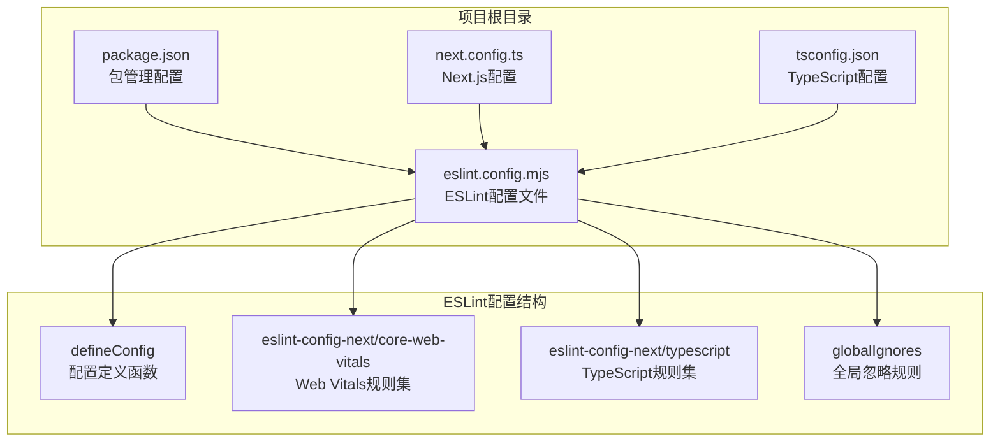
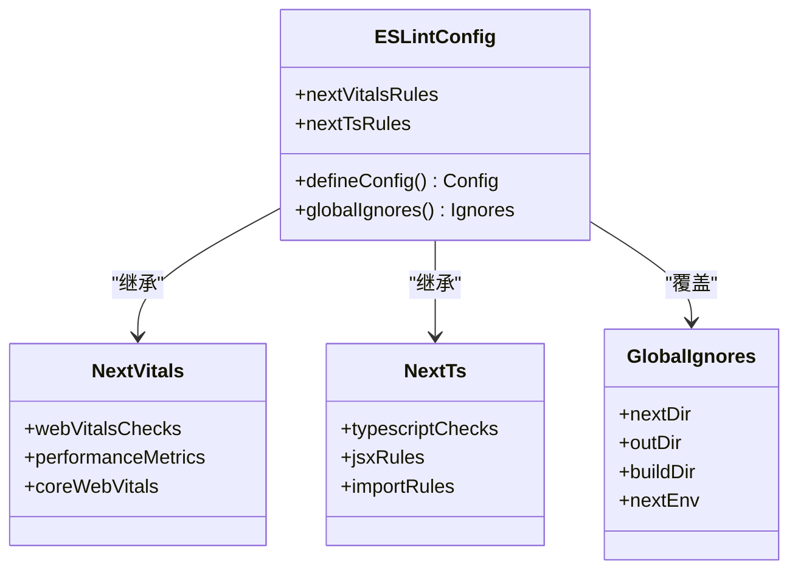
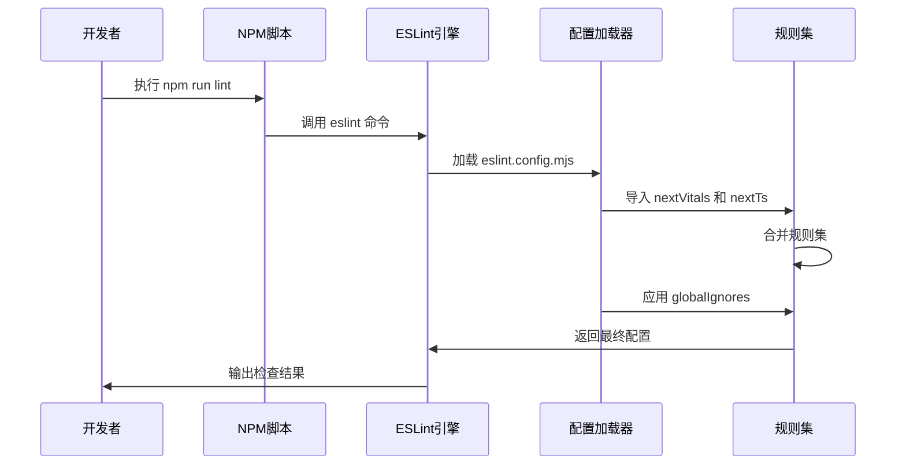
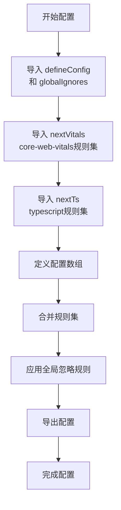
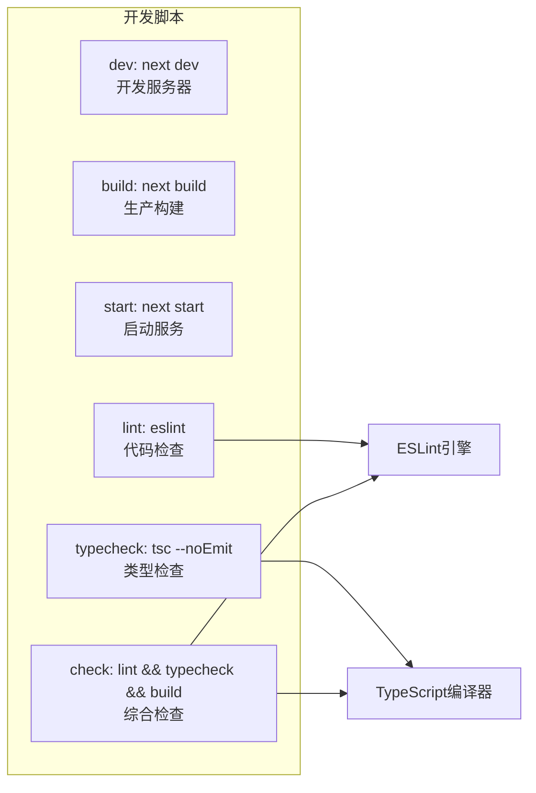

# ESLint配置

<cite>
**本文档引用的文件**
- [eslint.config.mjs](file://eslint.config.mjs)
- [package.json](file://package.json)
- [next.config.ts](file://next.config.ts)
- [tsconfig.json](file://tsconfig.json)
</cite>

## 目录
1. [简介](#简介)
2. [项目结构](#项目结构)
3. [核心组件](#核心组件)
4. [架构概览](#架构概览)
5. [详细组件分析](#详细组件分析)
6. [依赖分析](#依赖分析)
7. [性能考虑](#性能考虑)
8. [故障排除指南](#故障排除指南)
9. [结论](#结论)

## 简介

本文件为蓝辉轻改网站的ESLint配置详细文档。该项目使用现代ESLint配置格式（eslint.config.mjs），通过继承eslint-config-next提供的核心Web Vitals规则集和TypeScript规则集，结合自定义的全局忽略规则，构建了完整的代码质量检查体系。该配置特别针对Next.js应用进行了优化，确保开发环境中的代码质量和一致性。

## 项目结构

该项目采用现代化的Next.js项目结构，ESLint配置位于根目录的eslint.config.mjs文件中，与Next.js配置文件和TypeScript配置文件共同构成了完整的开发工具链。



**图表来源**
- [eslint.config.mjs:1-19](file://eslint.config.mjs#L1-L19)
- [package.json:29-36](file://package.json#L29-L36)

**章节来源**
- [eslint.config.mjs:1-19](file://eslint.config.mjs#L1-L19)
- [package.json:1-60](file://package.json#L1-L60)

## 核心组件

### 主要配置文件结构

项目的核心ESLint配置位于eslint.config.mjs文件中，采用了现代ESLint配置格式，具有以下特点：

- 使用ES模块语法导入依赖
- 继承eslint-config-next提供的预设规则
- 自定义全局忽略规则覆盖默认行为
- 支持TypeScript和Next.js特定的代码检查

### 配置继承体系

配置系统通过两层继承实现：
1. **Web Vitals规则集**：继承eslint-config-next/core-web-vitals，提供核心Web性能指标检查
2. **TypeScript规则集**：继承eslint-config-next/typescript，提供TypeScript代码质量检查



**图表来源**
- [eslint.config.mjs:5-16](file://eslint.config.mjs#L5-L16)

**章节来源**
- [eslint.config.mjs:1-19](file://eslint.config.mjs#L1-L19)

## 架构概览

ESLint配置的整体架构体现了现代前端开发的最佳实践，通过模块化设计实现了高度的可维护性和扩展性。



**图表来源**
- [package.json:33](file://package.json#L33)
- [eslint.config.mjs:1-19](file://eslint.config.mjs#L1-L19)

## 详细组件分析

### ESLint配置文件分析

#### 文件结构和导入机制

配置文件采用ES模块语法，通过静态导入方式引入必要的依赖：



**图表来源**
- [eslint.config.mjs:1-19](file://eslint.config.mjs#L1-L19)

#### 全局忽略规则配置

配置文件中的全局忽略规则覆盖了eslint-config-next的默认忽略设置，具体包括：

| 忽略模式 | 用途 | 说明 |
|---------|------|-----|
| `.next/**` | Next.js构建输出目录 | 排除框架生成的临时文件 |
| `out/**` | 输出目录 | 排除静态导出的构建产物 |
| `build/**` | 构建目录 | 排除标准构建输出 |
| `next-env.d.ts` | 类型声明文件 | 排除自动生成的类型定义 |

这些忽略规则确保ESLint不会对构建产物和自动生成的文件进行检查，提高检查效率并避免误报。

**章节来源**
- [eslint.config.mjs:8-16](file://eslint.config.mjs#L8-L16)

### 规则集继承机制

#### Web Vitals规则集

eslint-config-next/core-web-vitals规则集提供了针对Web性能指标的专门检查，包括：

- Core Web Vitals指标监控
- 性能相关代码模式识别
- 用户体验相关的代码质量检查

#### TypeScript规则集

eslint-config-next/typescript规则集专注于TypeScript代码质量，包括：

- 类型安全检查
- TypeScript语言特性最佳实践
- JSX代码风格统一
- 模块导入规范

**章节来源**
- [eslint.config.mjs:2-3](file://eslint.config.mjs#L2-L3)

### 开发环境集成

#### 脚本配置

项目通过package.json配置了完整的开发脚本，其中lint脚本直接调用ESLint：



**图表来源**
- [package.json:29-36](file://package.json#L29-L36)

**章节来源**
- [package.json:29-36](file://package.json#L29-L36)

## 依赖分析

### 外部依赖关系

项目依赖关系主要围绕ESLint生态系统构建，形成了清晰的依赖层次结构：

```mermaid
graph TB
subgraph "核心依赖"
ESLINT[eslint@^9<br/>ESLint核心引擎]
ESLINT_CONFIG_NEXT[eslint-config-next@16.2.1<br/>Next.js专用规则集]
end
subgraph "Next.js生态"
NEXT[next@16.2.1<br/>Next.js框架]
TYPESCRIPT[typescript@^5<br/>TypeScript编译器]
end
subgraph "开发工具"
NODE[node >= 24<br/>运行时要求]
end
ESLINT --> ESLINT_CONFIG_NEXT
ESLINT_CONFIG_NEXT --> NEXT
ESLINT --> TYPESCRIPT
NEXT --> NODE
```

**图表来源**
- [package.json:42-57](file://package.json#L42-L57)

### 版本兼容性

配置文件展示了严格的版本兼容性要求：

- **Node.js**: 要求版本24或更高
- **ESLint**: 版本9.x系列
- **Next.js**: 版本16.2.1
- **TypeScript**: 版本5.x系列

这种版本锁定确保了开发工具链的一致性和稳定性。

**章节来源**
- [package.json:26-28](file://package.json#L26-L28)
- [package.json:54-57](file://package.json#L54-L57)

## 性能考虑

### 配置优化策略

ESLint配置在性能方面采用了多项优化措施：

1. **选择性忽略**: 通过globalIgnores排除大型构建目录，减少扫描时间
2. **规则集合并**: 使用展开操作符高效合并多个规则集
3. **模块化设计**: 将配置拆分为独立的规则集，便于维护和更新

### 缓存和增量检查

虽然当前配置未显式启用缓存，但ESLint引擎本身支持多种性能优化机制：

- **增量检查**: 只检查修改过的文件
- **缓存机制**: 缓存检查结果以提高重复执行速度
- **并发处理**: 利用多核处理器并行检查文件

## 故障排除指南

### 常见问题及解决方案

#### 忽略规则不生效

**问题**: 自定义忽略规则未按预期工作

**解决方案**:
1. 检查glob模式是否正确
2. 确认路径相对于项目根目录
3. 验证规则优先级顺序

#### 规则冲突

**问题**: 不同规则集之间存在冲突

**解决方案**:
1. 使用更具体的规则覆盖
2. 检查规则优先级
3. 创建自定义规则集

#### 性能问题

**问题**: ESLint检查速度过慢

**解决方案**:
1. 优化忽略规则配置
2. 减少不必要的规则检查
3. 使用缓存机制

### 调试技巧

#### 启用详细日志

可以通过以下方式获取更多调试信息：
- 使用`--debug`标志启用调试模式
- 检查ESLint配置解析过程
- 分析规则执行顺序

#### 配置验证

定期验证配置文件的有效性：
- 检查语法错误
- 验证规则名称
- 确认依赖版本兼容性

**章节来源**
- [eslint.config.mjs:8-16](file://eslint.config.mjs#L8-L16)

## 结论

本项目的ESLint配置展现了现代前端开发工具链的最佳实践。通过精心设计的配置结构、完善的规则集继承机制和高效的性能优化策略，成功构建了一个既严格又实用的代码质量检查体系。

配置的核心优势包括：

1. **模块化设计**: 清晰的规则集分离和继承关系
2. **性能优化**: 智能的忽略规则和增量检查支持
3. **维护性**: 明确的配置结构和版本控制
4. **扩展性**: 易于添加自定义规则和覆盖现有规则

该配置为Next.js应用提供了全面的代码质量保障，同时保持了良好的开发体验和性能表现。