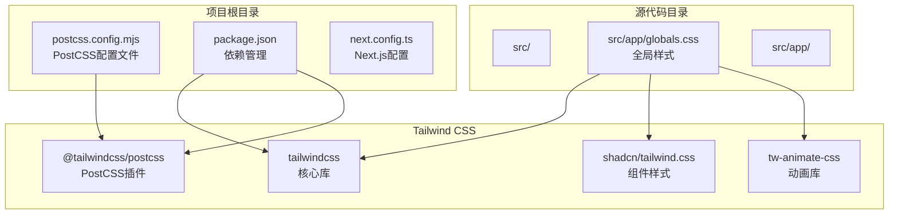
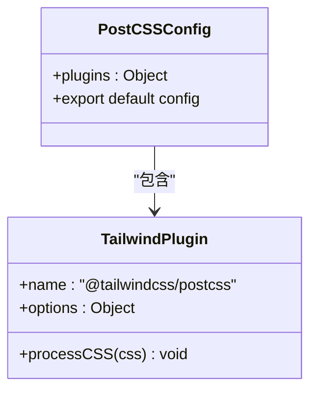
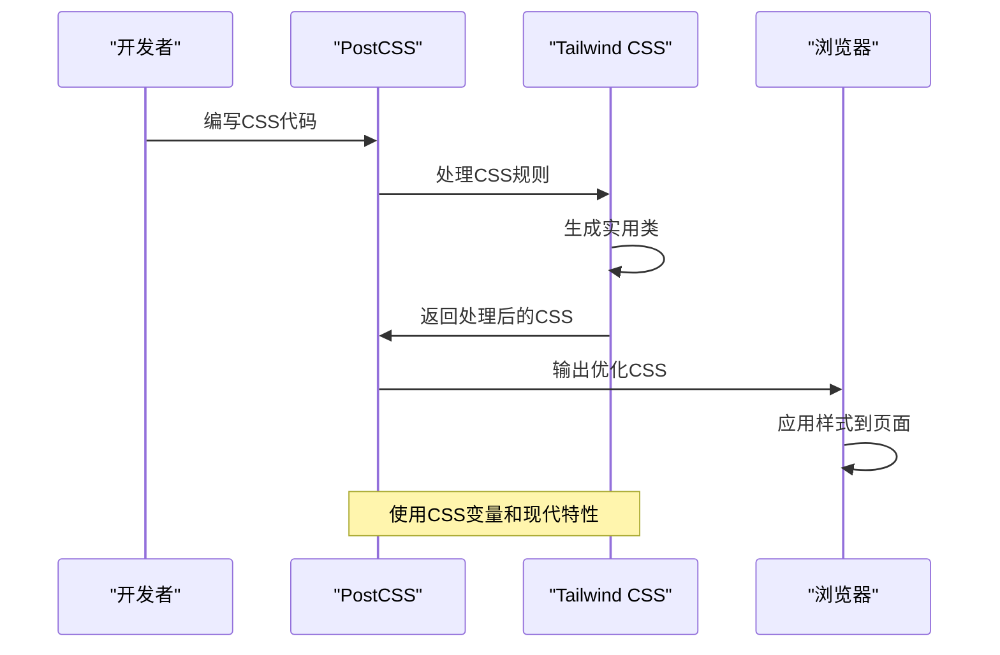
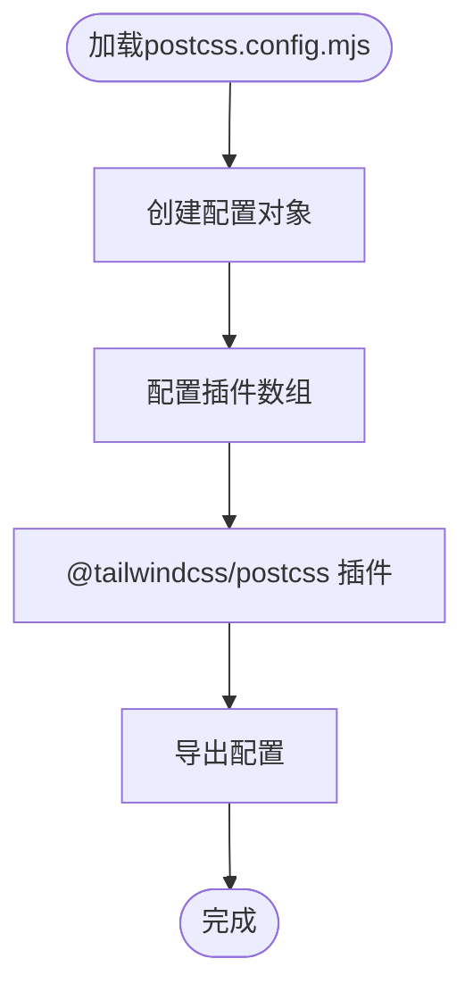
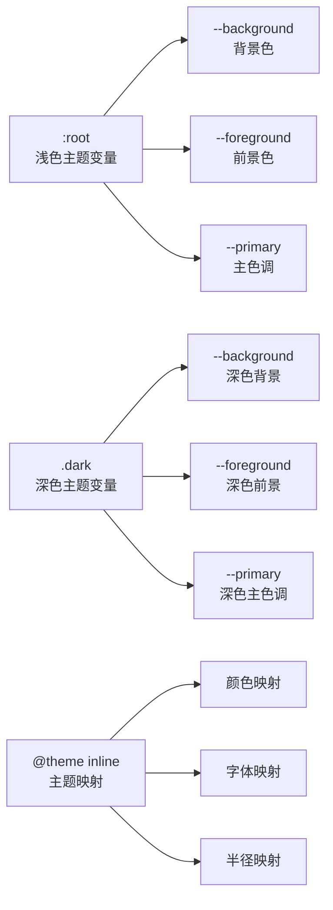
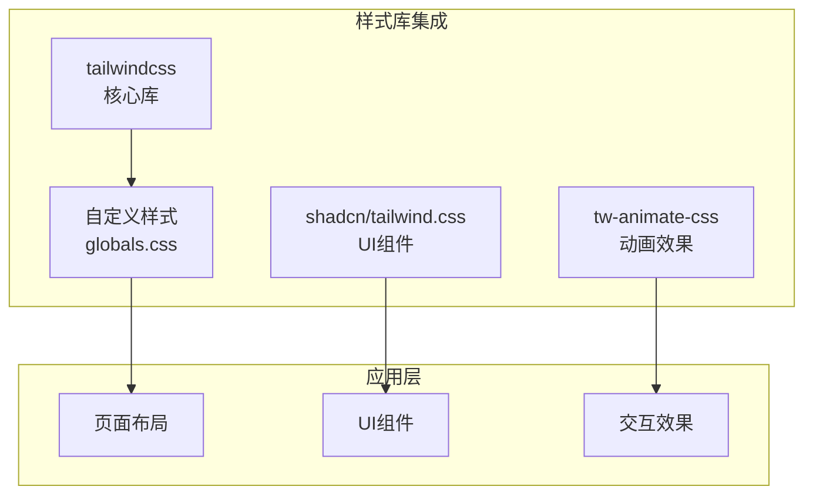
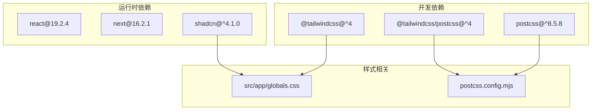

# PostCSS配置

<cite>
**本文档引用的文件**
- [postcss.config.mjs](file://postcss.config.mjs)
- [package.json](file://package.json)
- [next.config.ts](file://next.config.ts)
- [src/app/globals.css](file://src/app/globals.css)
- [components.json](file://components.json)
</cite>

## 目录
1. [简介](#简介)
2. [项目结构](#项目结构)
3. [核心组件](#核心组件)
4. [架构概览](#架构概览)
5. [详细组件分析](#详细组件分析)
6. [依赖关系分析](#依赖关系分析)
7. [性能考虑](#性能考虑)
8. [故障排除指南](#故障排除指南)
9. [结论](#结论)

## 简介

本文件为蓝辉轻改网站的PostCSS配置创建详细文档。该网站采用Next.js框架，使用Tailwind CSS作为主要的样式解决方案，并通过PostCSS进行CSS预处理和后处理。项目配置相对简洁，专注于现代化CSS特性和响应式设计的支持。

## 项目结构

该项目采用标准的Next.js项目结构，PostCSS配置位于根目录的`postcss.config.mjs`文件中，全局样式定义在`src/app/globals.css`中。



**图表来源**
- [postcss.config.mjs:1-8](file://postcss.config.mjs#L1-L8)
- [package.json:49-57](file://package.json#L49-L57)
- [src/app/globals.css:1-4](file://src/app/globals.css#L1-L4)

**章节来源**
- [postcss.config.mjs:1-8](file://postcss.config.mjs#L1-L8)
- [package.json:1-60](file://package.json#L1-L60)
- [next.config.ts:1-14](file://next.config.ts#L1-L14)

## 核心组件

### PostCSS配置核心

当前的PostCSS配置极其精简，仅包含一个插件：



**图表来源**
- [postcss.config.mjs:1-8](file://postcss.config.mjs#L1-L8)

### Tailwind CSS集成

项目通过多种方式集成了Tailwind CSS：

1. **PostCSS插件**: 使用官方的Tailwind CSS PostCSS插件
2. **全局样式导入**: 在globals.css中导入多个CSS文件
3. **CSS变量支持**: 使用现代CSS自定义属性系统

**章节来源**
- [postcss.config.mjs:1-8](file://postcss.config.mjs#L1-L8)
- [src/app/globals.css:1-4](file://src/app/globals.css#L1-L4)

## 架构概览

整个CSS处理流程从PostCSS开始，经过Tailwind CSS处理，最终生成优化的CSS输出。



**图表来源**
- [postcss.config.mjs:1-8](file://postcss.config.mjs#L1-L8)
- [src/app/globals.css:7-49](file://src/app/globals.css#L7-L49)

## 详细组件分析

### PostCSS配置文件分析

当前的配置文件非常简洁，只包含一个插件：



**图表来源**
- [postcss.config.mjs:1-8](file://postcss.config.mjs#L1-L8)

### Tailwind CSS插件配置

虽然配置文件中插件选项为空对象，但Tailwind CSS仍然能够正常工作，这表明它使用了默认配置。

**章节来源**
- [postcss.config.mjs:1-8](file://postcss.config.mjs#L1-L8)

### 全局样式系统

项目使用了多层次的样式组织方式：

#### CSS变量系统



**图表来源**
- [src/app/globals.css:51-118](file://src/app/globals.css#L51-L118)
- [src/app/globals.css:7-49](file://src/app/globals.css#L7-L49)

#### @theme指令使用

项目使用了Tailwind CSS 4的新特性`@theme`指令，这是一个重要的现代化CSS特性：

**章节来源**
- [src/app/globals.css:7-49](file://src/app/globals.css#L7-L49)

### 组件样式集成

项目集成了多个样式库：



**图表来源**
- [src/app/globals.css:1-3](file://src/app/globals.css#L1-L3)

**章节来源**
- [src/app/globals.css:1-4](file://src/app/globals.css#L1-L4)
- [components.json:6-12](file://components.json#L6-L12)

## 依赖关系分析

### 核心依赖关系



**图表来源**
- [package.json:49-57](file://package.json#L49-L57)
- [package.json:37-48](file://package.json#L37-L48)

### 版本兼容性

项目使用了较新的技术栈版本：
- Node.js >= 24
- Next.js 16.2.1
- Tailwind CSS 4.x
- React 19.2.4

**章节来源**
- [package.json:26-28](file://package.json#L26-L28)
- [package.json:42-47](file://package.json#L42-L47)

## 性能考虑

### 当前配置的性能特点

1. **简洁配置**: 最小化的PostCSS配置减少了构建时间
2. **现代CSS特性**: 使用CSS变量和@theme指令提高样式维护性
3. **按需加载**: Tailwind CSS只生成实际使用的样式类

### 优化建议

基于当前配置，可以考虑以下优化：

#### PostCSS插件扩展
```javascript
// 建议的增强配置
const config = {
  plugins: {
    "@tailwindcss/postcss": {},
    // 可选：添加CSS压缩插件
    // "cssnano": process.env.NODE_ENV === "production" ? {} : false,
  }
};
```

#### Tailwind CSS优化
- 启用Tree Shaking以移除未使用的样式
- 配置内容扫描路径以确保正确的样式生成
- 考虑使用`@apply`指令减少重复代码

#### 构建性能优化
- 使用缓存机制避免重复处理相同CSS
- 分离关键CSS和非关键CSS
- 实施CSS代码分割策略

## 故障排除指南

### 常见问题及解决方案

#### Tailwind CSS样式不生效
1. **检查PostCSS配置**: 确认`postcss.config.mjs`中的插件正确安装
2. **验证CSS导入顺序**: 确保`@import`语句的正确顺序
3. **检查类名拼写**: 确认HTML中的类名与Tailwind配置一致

#### CSS变量未生效
1. **验证`:root`选择器**: 确认CSS变量在`:root`中正确定义
2. **检查变量命名**: 确保CSS变量名称符合规范
3. **确认作用域**: 确保变量在正确的CSS作用域内

#### 构建错误
1. **检查Node.js版本**: 确认满足项目要求的最低版本
2. **清理缓存**: 运行`npm cache clean --force`
3. **重新安装依赖**: 删除`node_modules`和`package-lock.json`后重新安装

**章节来源**
- [src/app/globals.css:51-118](file://src/app/globals.css#L51-L118)
- [postcss.config.mjs:1-8](file://postcss.config.mjs#L1-L8)

## 结论

蓝辉轻改网站的PostCSS配置展现了现代前端开发的最佳实践：简洁、高效且功能完整。通过使用Tailwind CSS 4的最新特性（如`@theme`指令和CSS变量），项目实现了高度可维护的样式系统。

### 主要优势
- **简洁配置**: 最小化复杂度，降低维护成本
- **现代特性**: 充分利用CSS变量和新语法
- **组件集成**: 与shadcn UI库无缝集成
- **响应式设计**: 基于Tailwind的移动优先方法

### 发展方向
随着项目需求的增长，可以考虑：
- 添加CSS压缩和优化插件
- 实施更精细的样式模块化策略
- 探索CSS-in-JS或其他现代样式方案
- 建立完整的样式指南和最佳实践文档

这个配置为蓝辉轻改网站提供了坚实的技术基础，支持其现代化的设计理念和用户体验目标。