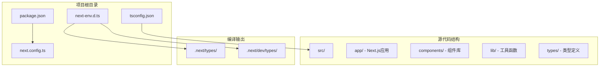
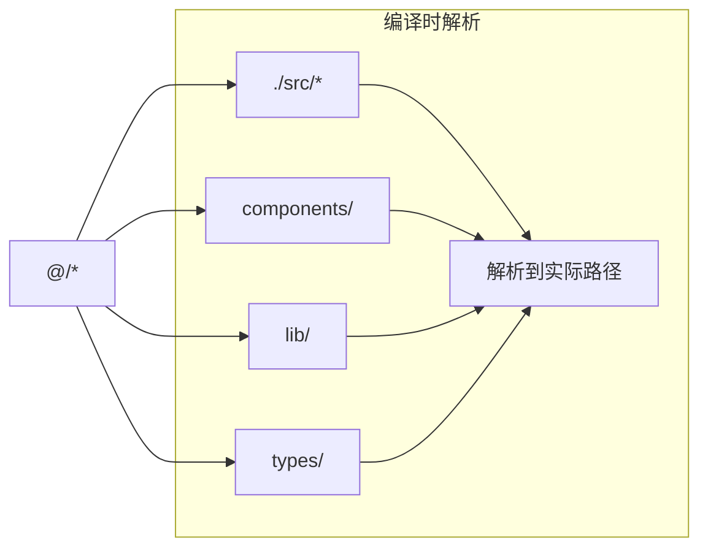
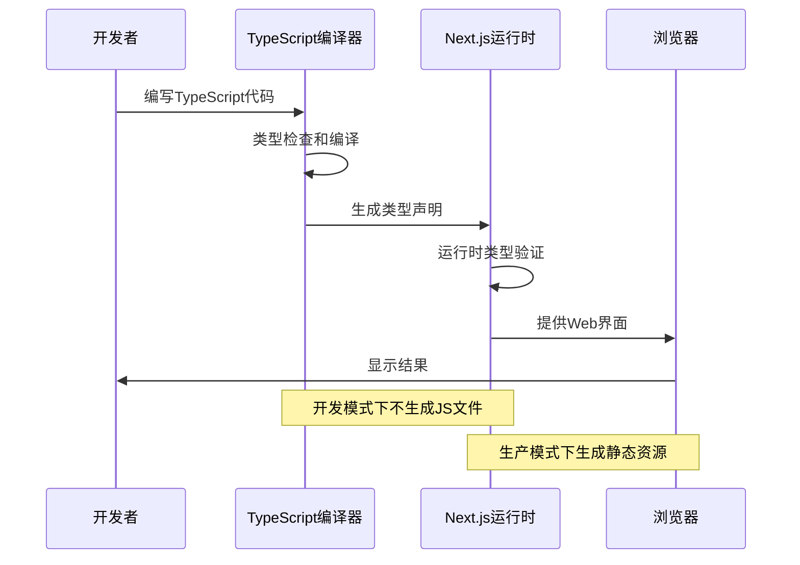
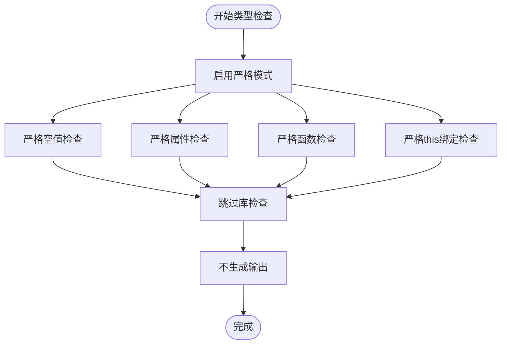
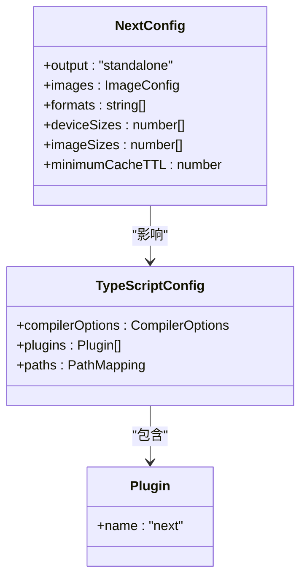
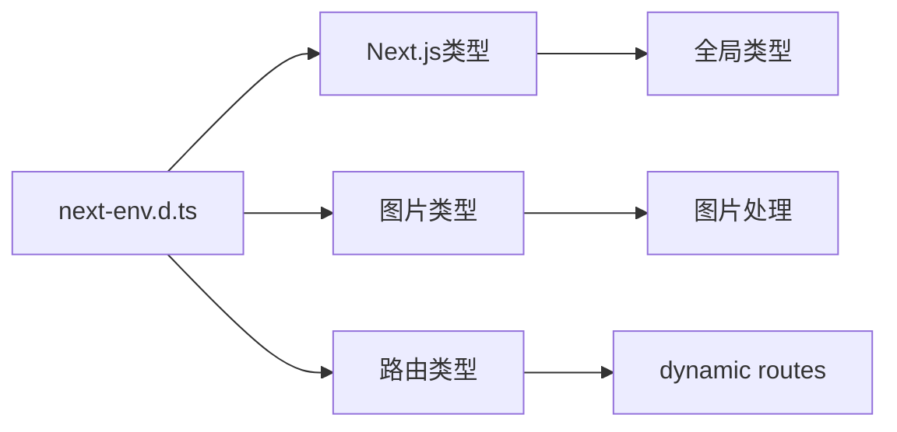
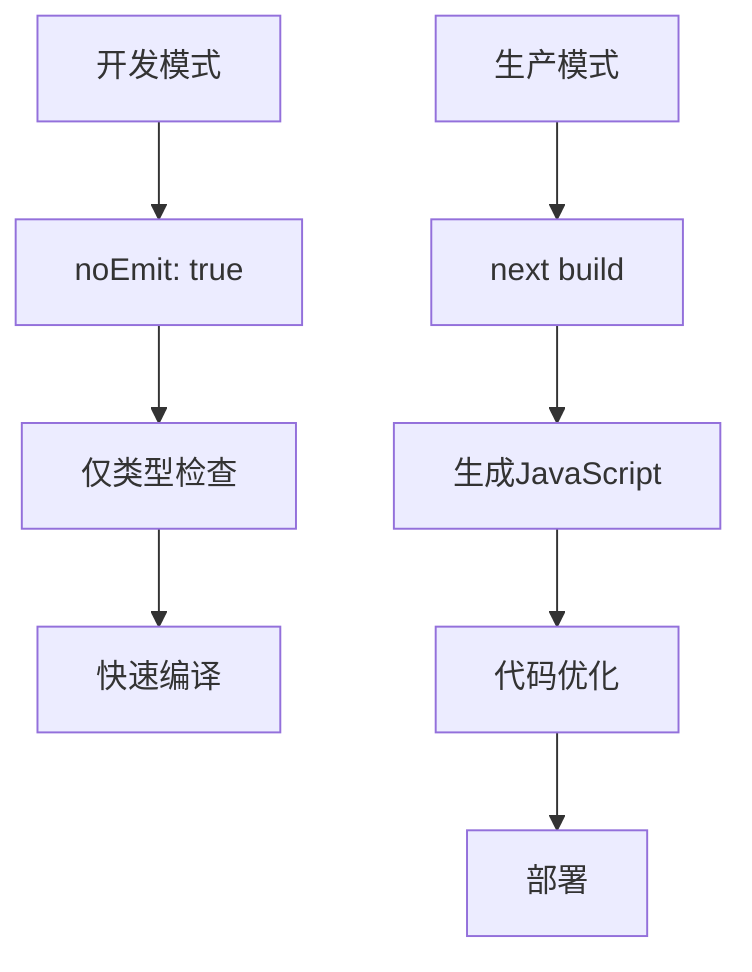

# TypeScript配置

<cite>
**本文档引用的文件**
- [tsconfig.json](file://tsconfig.json)
- [package.json](file://package.json)
- [next.config.ts](file://next.config.ts)
- [next-env.d.ts](file://next-env.d.ts)
- [src/app/layout.tsx](file://src/app/layout.tsx)
- [src/app/page.tsx](file://src/app/page.tsx)
</cite>

## 目录
1. [简介](#简介)
2. [项目结构](#项目结构)
3. [核心组件](#核心组件)
4. [架构概览](#架构概览)
5. [详细组件分析](#详细组件分析)
6. [依赖关系分析](#依赖关系分析)
7. [性能考虑](#性能考虑)
8. [故障排除指南](#故障排除指南)
9. [结论](#结论)

## 简介

本文件为蓝辉轻改网站的TypeScript配置详细文档。该项目基于Next.js框架构建，采用现代化的TypeScript配置以确保类型安全性和开发体验。文档将深入解释tsconfig.json文件的各项配置选项，包括严格模式、编译设置、项目引用、路径映射和模块解析策略，并提供在Next.js项目中使用TypeScript的最佳实践。

## 项目结构

蓝辉轻改网站采用标准的Next.js项目结构，TypeScript配置主要集中在根目录的tsconfig.json文件中：



**图表来源**
- [tsconfig.json:1-35](file://tsconfig.json#L1-L35)
- [package.json:1-60](file://package.json#L1-L60)
- [next.config.ts:1-14](file://next.config.ts#L1-L14)

**章节来源**
- [tsconfig.json:1-35](file://tsconfig.json#L1-L35)
- [package.json:1-60](file://package.json#L1-L60)

## 核心组件

### 编译器选项详解

项目的核心TypeScript配置包含以下关键编译器选项：

#### 严格模式配置
- **strict: true** - 启用所有严格类型检查选项
- **skipLibCheck: true** - 跳过库文件的类型检查，提升编译速度
- **noEmit: true** - 不生成JavaScript文件，仅进行类型检查

#### 目标环境设置
- **target: ES2017** - 目标JavaScript版本为ES2017
- **lib: ["dom", "dom.iterable", "esnext"]** - 包含DOM、ESNext等必要库

#### 模块系统配置
- **module: esnext** - 使用ESNext模块格式
- **moduleResolution: bundler** - 使用打包器模块解析策略
- **resolveJsonModule: true** - 允许导入JSON模块

#### JSX处理配置
- **jsx: react-jsx** - 使用React JSX转换
- **esModuleInterop: true** - 增强ES模块互操作性

#### 开发体验优化
- **incremental: true** - 启用增量编译
- **isolatedModules: true** - 模块隔离编译
- **allowJs: true** - 允许JavaScript文件参与编译

**章节来源**
- [tsconfig.json:2-24](file://tsconfig.json#L2-L24)

### 路径映射配置

项目使用了别名路径映射来简化模块导入：



**图表来源**
- [tsconfig.json:21-23](file://tsconfig.json#L21-L23)

**章节来源**
- [tsconfig.json:21-23](file://tsconfig.json#L21-L23)

### 包含和排除规则

编译包含规则涵盖了：
- **next-env.d.ts** - Next.js环境类型定义
- **所有.ts和.tsx文件** - TypeScript源文件
- **.next/types/**/*.ts** - Next.js生成的类型文件
- **.next/dev/types/**/*.ts** - 开发环境类型文件
- **所有.mts文件** - ES模块类型文件

**章节来源**
- [tsconfig.json:25-33](file://tsconfig.json#L25-L33)

## 架构概览

TypeScript在Next.js项目中的整体架构如下：



**图表来源**
- [tsconfig.json:7-8](file://tsconfig.json#L7-L8)
- [next.config.ts:4](file://next.config.ts#L4)

## 详细组件分析

### 严格类型检查机制

项目启用了全面的严格类型检查：



**图表来源**
- [tsconfig.json:6-8](file://tsconfig.json#L6-L8)

#### 类型检查流程

1. **编译前准备** - 加载tsconfig.json配置
2. **类型分析** - 分析所有TypeScript文件
3. **错误收集** - 收集类型错误和警告
4. **输出报告** - 通过命令行显示结果

**章节来源**
- [tsconfig.json:6-8](file://tsconfig.json#L6-L8)

### 模块解析策略

项目采用了现代化的模块解析策略：

```mermaid
graph TB
subgraph "模块解析策略"
BUNDLER[bundler] --> NODE[Node.js解析]
BUNDLER --> WEB[Web解析]
NODE --> FILE[文件系统查找]
NODE --> PACKAGE[package.json解析]
WEB --> ALIAS[别名解析]
WEB --> PATH[路径映射]
end
subgraph "别名配置"
AT["@/*"] --> SRC[./src/*]
ALIAS --> RESOLVE[@/components -> src/components]
end
```

**图表来源**
- [tsconfig.json:11](file://tsconfig.json#L11)
- [tsconfig.json:21-23](file://tsconfig.json#L21-L23)

**章节来源**
- [tsconfig.json:11](file://tsconfig.json#L11)
- [tsconfig.json:21-23](file://tsconfig.json#L21-L23)

### Next.js集成配置

项目集成了Next.js特定的TypeScript支持：



**图表来源**
- [next.config.ts:3-11](file://next.config.ts#L3-L11)
- [tsconfig.json:16-20](file://tsconfig.json#L16-L20)

**章节来源**
- [next.config.ts:3-11](file://next.config.ts#L3-L11)
- [tsconfig.json:16-20](file://tsconfig.json#L16-L20)

### 环境类型定义

项目使用了Next.js提供的类型定义：



**图表来源**
- [next-env.d.ts:1-3](file://next-env.d.ts#L1-L3)

**章节来源**
- [next-env.d.ts:1-3](file://next-env.d.ts#L1-L3)

## 依赖关系分析

### TypeScript生态系统依赖

```mermaid
graph TB
subgraph "核心依赖"
TS[TypeScript ^5]
NEXT[Next.js 16.2.1]
REACT[React 19.2.4]
end
subgraph "开发依赖"
TYPENODE[@types/node ^24]
TYPEREACT[@types/react ^19]
TYPEDOM[@types/react-dom ^19]
ESLINT[ESLint ^9]
end
subgraph "工具链"
TSC[tsc --noEmit]
ESLINT_CMD[eslint]
NEXT_DEV[next dev]
end
TS --> TSC
NEXT --> NEXT_DEV
REACT --> TSC
TYPENODE --> TSC
TYPEREACT --> TSC
TYPEDOM --> TSC
ESLINT --> ESLINT_CMD
```

**图表来源**
- [package.json:37-58](file://package.json#L37-L58)

**章节来源**
- [package.json:37-58](file://package.json#L37-L58)

### 版本兼容性

项目要求Node.js版本≥24，这确保了与现代TypeScript特性的兼容性。Next.js 16.2.1提供了最新的TypeScript支持和性能优化。

**章节来源**
- [package.json:26-28](file://package.json#L26-L28)

## 性能考虑

### 增量编译优化

项目启用了增量编译来提升开发体验：

- **incremental: true** - 启用增量编译缓存
- **isolatedModules: true** - 模块隔离编译，避免相互依赖问题
- **skipLibCheck: true** - 跳过库文件检查，减少编译时间

### 编译输出策略



**图表来源**
- [tsconfig.json:8](file://tsconfig.json#L8)
- [package.json:34](file://package.json#L34)

**章节来源**
- [tsconfig.json:8](file://tsconfig.json#L8)
- [package.json:34](file://package.json#L34)

## 故障排除指南

### 常见配置问题

1. **模块解析失败**
   - 检查路径映射配置是否正确
   - 确认@别名指向正确的源码目录

2. **类型检查错误**
   - 验证严格模式下的类型定义
   - 检查第三方库的类型声明

3. **Next.js集成问题**
   - 确认plugins配置包含"name": "next"
   - 验证next-env.d.ts文件存在且正确引用

### 调试技巧

- 使用`npm run typecheck`单独运行类型检查
- 检查`.next/types/`目录下的生成文件
- 验证TypeScript版本与Next.js版本兼容性

**章节来源**
- [tsconfig.json:16-20](file://tsconfig.json#L16-L20)
- [next-env.d.ts:1-3](file://next-env.d.ts#L1-L3)

## 结论

蓝辉轻改网站的TypeScript配置展现了现代Next.js项目的最佳实践：

1. **严格的类型安全** - 通过strict模式确保代码质量
2. **高效的开发体验** - 增量编译和模块隔离优化
3. **现代化的模块系统** - ESNext模块和别名路径映射
4. **完善的Next.js集成** - 专门的插件和类型定义支持

该配置为大型React应用提供了坚实的基础，既保证了类型安全，又保持了良好的开发效率。建议在维护过程中定期更新TypeScript和相关依赖版本，以获得最新的语言特性和性能改进。