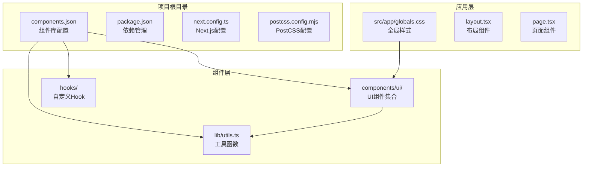
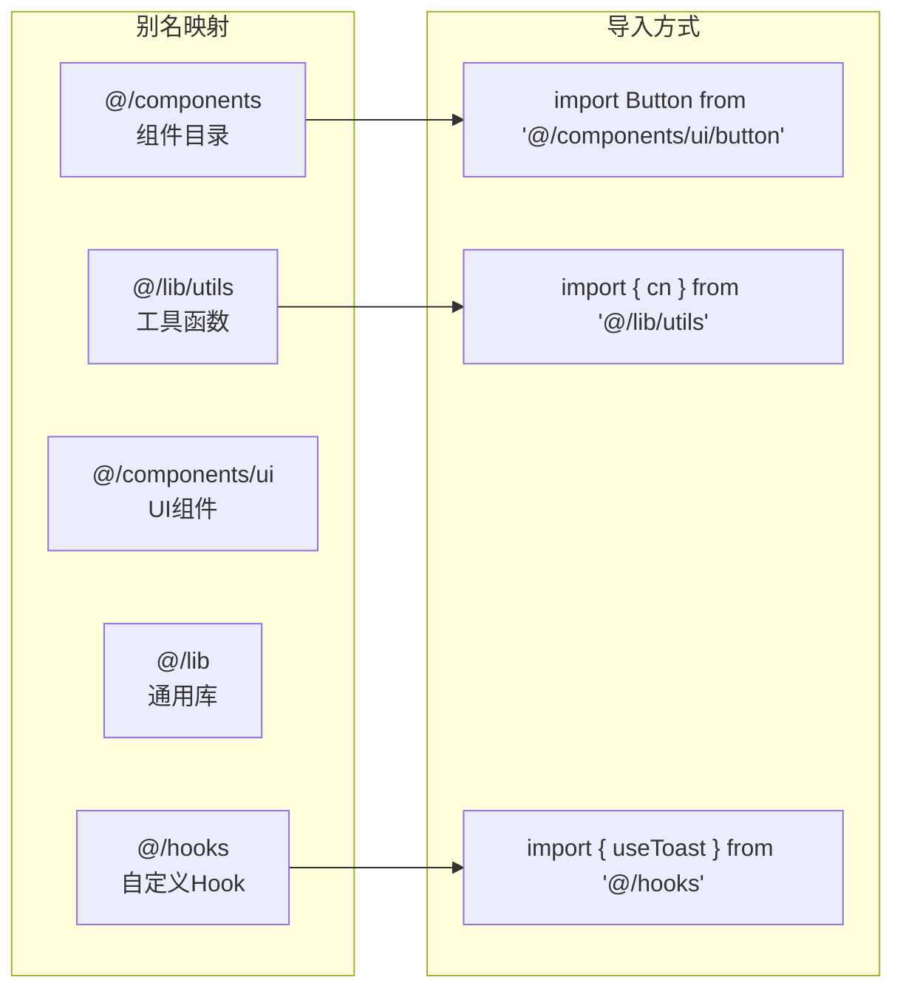
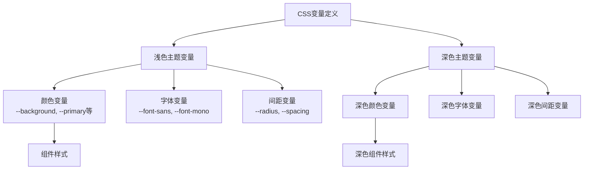
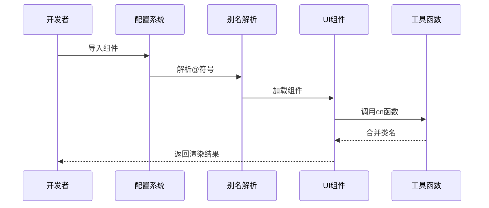
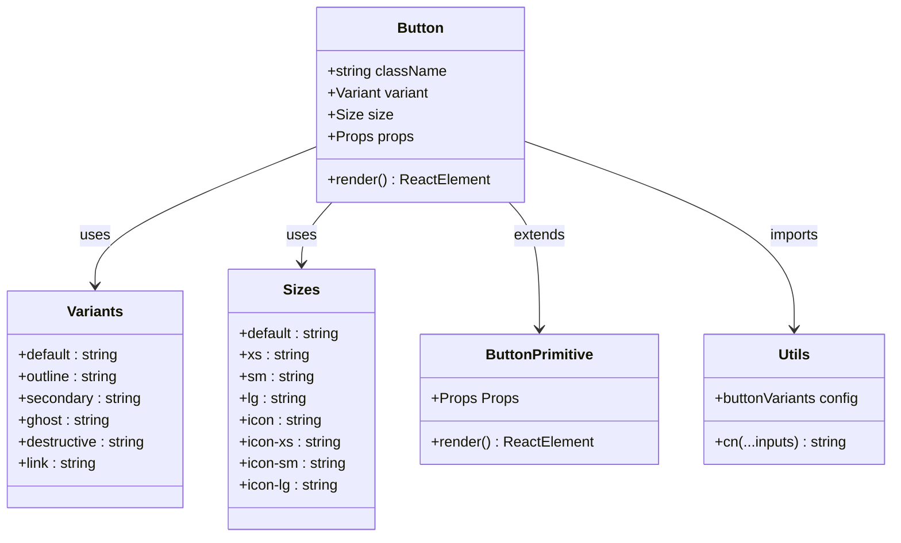
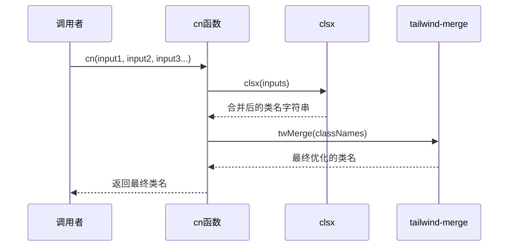
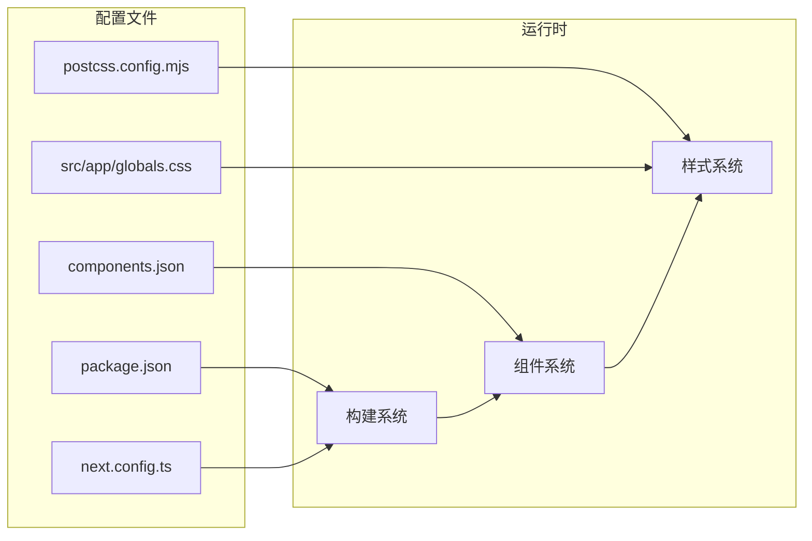

# UI组件库配置

<cite>
**本文档引用的文件**
- [components.json](file://components.json)
- [package.json](file://package.json)
- [next.config.ts](file://next.config.ts)
- [postcss.config.mjs](file://postcss.config.mjs)
- [src/app/globals.css](file://src/app/globals.css)
- [src/lib/utils.ts](file://src/lib/utils.ts)
- [src/components/ui/button.tsx](file://src/components/ui/button.tsx)
</cite>

## 目录
1. [简介](#简介)
2. [项目结构](#项目结构)
3. [核心组件](#核心组件)
4. [架构概览](#架构概览)
5. [详细组件分析](#详细组件分析)
6. [依赖关系分析](#依赖关系分析)
7. [性能考虑](#性能考虑)
8. [故障排除指南](#故障排除指南)
9. [结论](#结论)
10. [附录](#附录)

## 简介

本文件为蓝辉轻改网站的UI组件库配置详细文档，重点围绕shadcn/ui组件库的components.json配置文件进行深入解析。该组件库采用现代化的React组件设计，结合Tailwind CSS实现高度可定制的主题系统，并通过Base UI提供语义化和无障碍友好的基础组件。

组件库的核心特性包括：
- 基于Base UI的语义化组件架构
- 支持多种样式变体（默认、轮廓、次要、Ghost等）
- 完整的无障碍支持和键盘导航
- 细粒度的尺寸控制和图标集成
- 深色模式自动适配

## 项目结构

该项目采用标准的Next.js应用结构，UI组件库配置位于根目录的components.json文件中，通过别名系统实现模块化组织。



**图表来源**
- [components.json:1-26](file://components.json#L1-L26)
- [package.json:1-60](file://package.json#L1-L60)
- [src/app/globals.css:1-130](file://src/app/globals.css#L1-L130)

**章节来源**
- [components.json:1-26](file://components.json#L1-L26)
- [package.json:1-60](file://package.json#L1-L60)

## 核心组件

### 组件库配置详解

components.json文件是shadcn/ui组件库的核心配置文件，定义了组件库的安装、样式和集成参数。

#### 配置参数说明

| 参数 | 类型 | 默认值 | 描述 |
|------|------|--------|------|
| `$schema` | string | - | JSON Schema验证地址 |
| `style` | string | "default" | 组件样式主题（base-nova） |
| `rsc` | boolean | false | 启用React Server Components |
| `tsx` | boolean | false | 使用TypeScript JSX |
| `tailwind.config` | string | "" | Tailwind CSS配置文件路径 |
| `tailwind.css` | string | "styles/globals.css" | 全局CSS文件路径 |
| `tailwind.baseColor` | string | "slate" | 基础颜色方案 |
| `tailwind.cssVariables` | boolean | true | 启用CSS变量 |
| `iconLibrary` | string | "lucide" | 图标库选择 |
| `rtl` | boolean | false | 启用RTL语言支持 |
| `aliases` | object | - | 模块别名映射 |

#### 别名系统配置

组件库通过别名系统实现灵活的模块导入：



**图表来源**
- [components.json:15-21](file://components.json#L15-L21)

**章节来源**
- [components.json:1-26](file://components.json#L1-L26)

### 样式系统架构

项目采用多层样式架构，结合Tailwind CSS和CSS变量实现灵活的主题定制。

#### 主题变量体系



**图表来源**
- [src/app/globals.css:51-118](file://src/app/globals.css#L51-L118)

**章节来源**
- [src/app/globals.css:1-130](file://src/app/globals.css#L1-L130)

## 架构概览

### 组件库整体架构

```mermaid
graph TB
subgraph "配置层"
ConfigFile[components.json<br/>配置文件]
Aliases[别名系统<br/>@/components, @/lib]
end
subgraph "样式层"
Tailwind[Tailwind CSS<br/>原子类]
CSSVars[CSS变量<br/>主题定制]
Animations[动画系统<br/>tw-animate-css]
end
subgraph "组件层"
BaseUI[Base UI<br/>语义化组件]
Variants[变体系统<br/>cva + class-variance-authority]
Accessibility[无障碍支持<br/>ARIA属性]
end
subgraph "工具层"
CN[clsx + tailwind-merge<br/>类名合并]
Icons[Lucide Icons<br/>图标库]
end
ConfigFile --> Aliases
ConfigFile --> Tailwind
Tailwind --> CSSVars
CSSVars --> Animations
BaseUI --> Variants
Variants --> Accessibility
CN --> BaseUI
Icons --> BaseUI
```

**图表来源**
- [components.json:1-26](file://components.json#L1-L26)
- [src/app/globals.css:1-4](file://src/app/globals.css#L1-L4)

### 组件导入流程



**图表来源**
- [src/components/ui/button.tsx:6](file://src/components/ui/button.tsx#L6)
- [src/lib/utils.ts:4-6](file://src/lib/utils.ts#L4-L6)

## 详细组件分析

### Button组件深度解析

Button组件是shadcn/ui组件库的典型代表，展示了完整的组件设计模式。

#### 组件架构设计



**图表来源**
- [src/components/ui/button.tsx:8-43](file://src/components/ui/button.tsx#L8-L43)
- [src/components/ui/button.tsx:45-60](file://src/components/ui/button.tsx#L45-L60)

#### 变体系统实现

Button组件采用cva（Class Variance Authority）实现变体系统，支持多种样式组合：

| 变体类型 | 描述 | 主要样式类 |
|----------|------|------------|
| default | 默认样式 | bg-primary text-primary-foreground |
| outline | 轮廓样式 | border-border bg-background hover:bg-muted |
| secondary | 次要样式 | bg-secondary text-secondary-foreground |
| ghost | 透明样式 | hover:bg-muted hover:text-foreground |
| destructive | 错误样式 | bg-destructive/10 text-destructive |
| link | 链接样式 | text-primary underline-offset-4 |

#### 尺寸系统设计

```mermaid
flowchart LR
subgraph "尺寸映射"
Default[default: h-8 gap-1.5 px-2.5]
XS[xs: h-6 gap-1 rounded-[min(var(--radius-md),10px)]]
SM[sm: h-7 gap-1 rounded-[min(var(--radius-md),12px)]]
LG[lg: h-9 gap-1.5 px-2.5]
Icon[icon: size-8]
IconXS[icon-xs: size-6 rounded...]
IconSM[icon-sm: size-7 rounded...]
IconLG[icon-lg: size-9]
end
subgraph "响应式处理"
Responsive[响应式间距<br/>has-data-[icon=inline-end]]
Group[按钮组适配<br/>in-data-[slot=button-group]]
SVG[SVG尺寸处理<br/>not([class*='size-'])]
end
Default --> Responsive
XS --> Responsive
SM --> Responsive
LG --> Responsive
Icon --> Responsive
IconXS --> Responsive
IconSM --> Responsive
IconLG --> Responsive
```

**图表来源**
- [src/components/ui/button.tsx:24-36](file://src/components/ui/button.tsx#L24-L36)

**章节来源**
- [src/components/ui/button.tsx:1-61](file://src/components/ui/button.tsx#L1-L61)

### 工具函数系统

#### cn函数实现原理

cn函数是shadcn/ui组件库的核心工具，负责智能合并CSS类名。



**图表来源**
- [src/lib/utils.ts:4-6](file://src/lib/utils.ts#L4-L6)

**章节来源**
- [src/lib/utils.ts:1-7](file://src/lib/utils.ts#L1-L7)

## 依赖关系分析

### 核心依赖架构

```mermaid
graph TB
subgraph "运行时依赖"
React[react: 19.2.4]
ReactDOM[react-dom: 19.2.4]
Next[Next.js: 16.2.1]
BaseUI[@base-ui/react: 1.3.0]
Lucide[lucide-react: 1.6.0]
end
subgraph "开发依赖"
Tailwind[tailwindcss: ^4]
PostCSS["@tailwindcss/postcss": ^4]
TypeScript[typescript: ^5]
ESLint[eslint: ^9]
end
subgraph "工具库"
CVa[class-variance-authority: 0.7.1]
CLSX[clsx: 2.1.1]
Merge[tailwind-merge: 3.5.0]
Shadcn[shadcn: 4.1.0]
Animate[tw-animate-css: 1.4.0]
end
React --> BaseUI
React --> Lucide
Next --> Tailwind
Tailwind --> PostCSS
CVa --> CLSX
CVa --> Merge
Shadcn --> Tailwind
```

**图表来源**
- [package.json:37-58](file://package.json#L37-L58)

### 配置文件依赖关系



**图表来源**
- [components.json:1-26](file://components.json#L1-L26)
- [package.json:1-60](file://package.json#L1-L60)

**章节来源**
- [package.json:1-60](file://package.json#L1-L60)

## 性能考虑

### 组件性能优化策略

1. **按需加载**: 组件库支持Tree Shaking，仅导入使用的组件
2. **CSS变量优化**: 使用CSS变量减少样式计算开销
3. **类名合并**: 通过clsx和tailwind-merge避免重复类名
4. **无障碍优化**: 内置ARIA属性减少额外的DOM操作

### 构建性能优化

- **增量编译**: Next.js的快速刷新机制
- **代码分割**: 自动路由级别的代码分割
- **图片优化**: 内置WebP AVIF格式支持

## 故障排除指南

### 常见问题及解决方案

#### 组件样式不生效

**问题描述**: 组件显示异常或样式丢失

**可能原因**:
1. Tailwind CSS未正确配置
2. CSS变量未定义
3. 组件导入路径错误

**解决方案**:
1. 检查globals.css中的@import声明
2. 验证CSS变量定义是否完整
3. 确认组件导入路径使用@别名

#### TypeScript类型错误

**问题描述**: 编译时报类型相关错误

**解决方案**:
1. 确保所有依赖都已安装
2. 检查tsconfig.json配置
3. 验证组件接口定义

#### 构建失败

**问题描述**: npm run build执行失败

**解决方案**:
1. 运行npm run typecheck检查类型
2. 检查ESLint配置
3. 确保Node.js版本符合要求

**章节来源**
- [src/app/globals.css:1-4](file://src/app/globals.css#L1-L4)
- [package.json:26-28](file://package.json#L26-L28)

## 结论

蓝辉轻改网站的UI组件库配置展现了现代前端开发的最佳实践。通过精心设计的components.json配置文件，结合Base UI的语义化组件架构和Tailwind CSS的原子类系统，实现了高度可定制且性能优异的组件库。

关键优势包括：
- **模块化架构**: 清晰的别名系统和组件组织
- **主题定制**: 基于CSS变量的灵活主题系统
- **无障碍支持**: 完整的ARIA属性和键盘导航
- **性能优化**: 智能的类名合并和按需加载

这套配置为后续的功能扩展和维护奠定了坚实的基础。

## 附录

### 组件库配置最佳实践

1. **保持配置一致性**: 所有团队成员遵循相同的配置规范
2. **定期更新依赖**: 及时更新组件库和相关依赖
3. **文档维护**: 保持配置文档与实际实现同步
4. **测试覆盖**: 为新组件编写充分的测试用例

### 自定义组件开发指南

1. **遵循现有模式**: 参考Button组件的设计模式
2. **使用变体系统**: 通过cva实现统一的变体管理
3. **保持无障碍**: 确保组件具有完整的ARIA支持
4. **测试兼容性**: 在不同设备和浏览器上测试组件表现