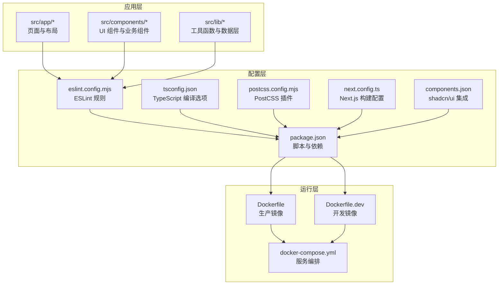
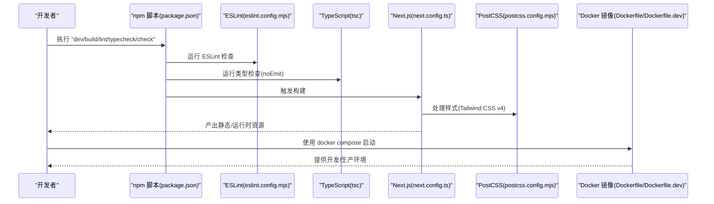
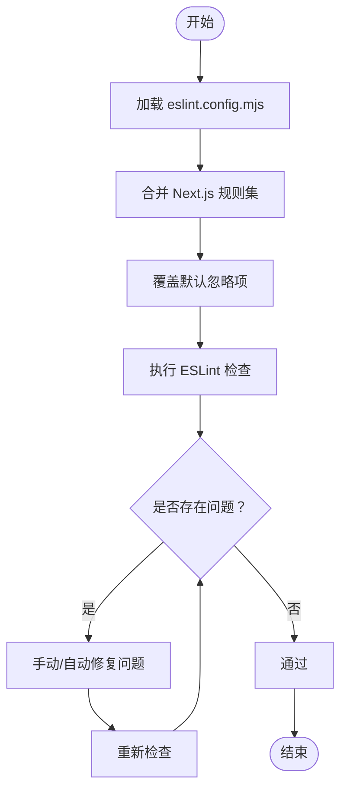
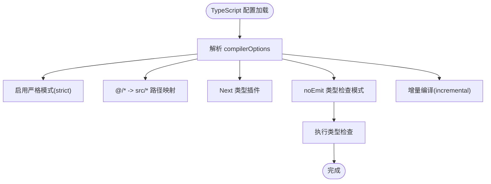
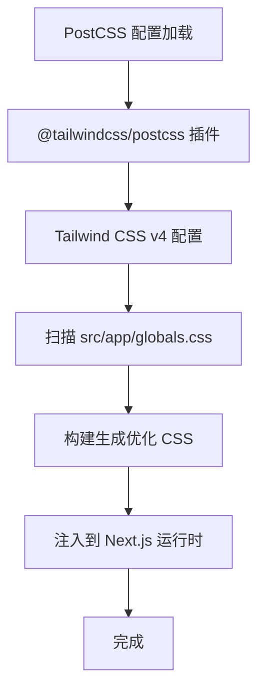
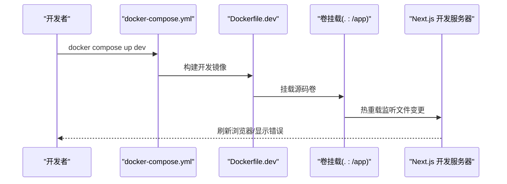
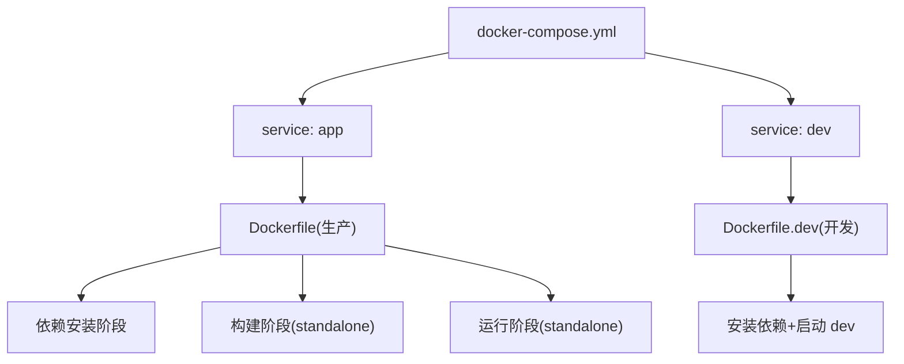
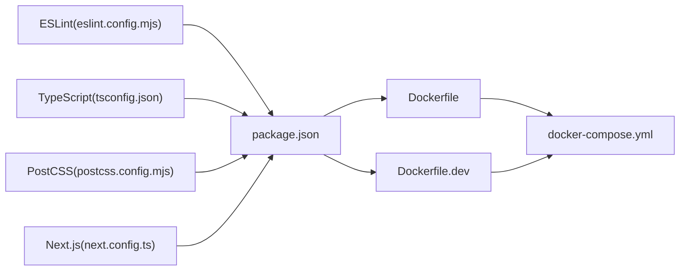

# 开发工具链

<cite>
**本文引用的文件**
- [eslint.config.mjs](file://eslint.config.mjs)
- [postcss.config.mjs](file://postcss.config.mjs)
- [tsconfig.json](file://tsconfig.json)
- [next.config.ts](file://next.config.ts)
- [package.json](file://package.json)
- [Dockerfile](file://Dockerfile)
- [Dockerfile.dev](file://Dockerfile.dev)
- [docker-compose.yml](file://docker-compose.yml)
- [components.json](file://components.json)
- [README.md](file://README.md)
</cite>

## 目录
1. [简介](#简介)
2. [项目结构](#项目结构)
3. [核心组件](#核心组件)
4. [架构总览](#架构总览)
5. [详细组件分析](#详细组件分析)
6. [依赖关系分析](#依赖关系分析)
7. [性能考量](#性能考量)
8. [故障排查指南](#故障排查指南)
9. [结论](#结论)
10. [附录](#附录)

## 简介
本文件系统性梳理蓝辉轻改网站（Next.js 16 + TypeScript + Tailwind CSS v4）的开发工具链，覆盖以下主题：
- ESLint 配置与代码质量保障：基于官方 Next.js 规则集的配置方式、忽略项覆盖与扩展建议。
- TypeScript 严格模式与类型推导：编译器选项、路径映射、增量编译与类型检查脚本。
- PostCSS 插件与样式处理流程：Tailwind CSS v4 的集成方式与构建产物。
- 开发工具推荐与调试技巧：编辑器与 IDE 配置要点、常用调试命令与日志定位。
- 代码格式化、自动修复与持续集成：lint 脚本、类型检查与构建串联。
- 开发服务器热重载与性能优化：Next.js 开发服务器特性、Docker 开发容器与端口映射。
- 个性化配置与团队协作规范：环境变量、容器健康检查、镜像版本对齐与 CI/CD 建议。

## 项目结构
该仓库采用 Next.js App Router 结构，核心开发工具链配置集中在根目录的配置文件中，并通过 Docker 与 docker-compose 提供一致的本地与生产运行环境。

图表来源
- [eslint.config.mjs:1-19](file://eslint.config.mjs#L1-L19)
- [tsconfig.json:1-35](file://tsconfig.json#L1-L35)
- [postcss.config.mjs:1-8](file://postcss.config.mjs#L1-L8)
- [next.config.ts:1-9](file://next.config.ts#L1-L9)
- [package.json:1-60](file://package.json#L1-L60)
- [components.json:1-26](file://components.json#L1-L26)
- [Dockerfile:1-114](file://Dockerfile#L1-L114)
- [Dockerfile.dev:1-16](file://Dockerfile.dev#L1-L16)
- [docker-compose.yml:1-54](file://docker-compose.yml#L1-L54)

章节来源
- [README.md:110-134](file://README.md#L110-L134)

## 核心组件
- ESLint 配置：使用官方 Next.js 规则集“core-web-vitals”和“typescript”，并覆盖默认忽略项以适配项目结构。
- TypeScript 配置：启用严格模式、增量编译、路径别名与 Next.js 类型插件；包含类型声明与 Next 运行时类型目录。
- PostCSS 配置：集成 Tailwind CSS v4 插件，作为样式处理入口。
- Next.js 配置：输出模式为 standalone，便于容器化部署。
- 包管理与脚本：统一的开发、构建、类型检查与质量门禁脚本；支持多包管理器锁文件。
- 容器化：生产镜像与开发镜像分离，支持健康检查与卷挂载实现热重载。

章节来源
- [eslint.config.mjs:1-19](file://eslint.config.mjs#L1-L19)
- [tsconfig.json:1-35](file://tsconfig.json#L1-L35)
- [postcss.config.mjs:1-8](file://postcss.config.mjs#L1-L8)
- [next.config.ts:1-9](file://next.config.ts#L1-L9)
- [package.json:29-36](file://package.json#L29-L36)
- [Dockerfile:1-114](file://Dockerfile#L1-L114)
- [Dockerfile.dev:1-16](file://Dockerfile.dev#L1-L16)
- [docker-compose.yml:1-54](file://docker-compose.yml#L1-L54)
- [components.json:1-26](file://components.json#L1-L26)

## 架构总览
下图展示从开发到生产的工具链闭环：编辑器/终端触发脚本，ESLint 与 TypeScript 检查作为质量门禁，Next.js 构建生成静态资源与运行时，最终由 Docker 生产镜像或开发容器承载。

图表来源
- [package.json:29-36](file://package.json#L29-L36)
- [eslint.config.mjs:1-19](file://eslint.config.mjs#L1-L19)
- [tsconfig.json:1-35](file://tsconfig.json#L1-L35)
- [next.config.ts:1-9](file://next.config.ts#L1-L9)
- [postcss.config.mjs:1-8](file://postcss.config.mjs#L1-L8)
- [Dockerfile:1-114](file://Dockerfile#L1-L114)
- [Dockerfile.dev:1-16](file://Dockerfile.dev#L1-L16)
- [docker-compose.yml:1-54](file://docker-compose.yml#L1-L54)

## 详细组件分析

### ESLint 配置与代码质量保障
- 规则来源：继承官方 Next.js 规则集“core-web-vitals”和“typescript”，确保现代 Web 性能指标与 TypeScript 最佳实践。
- 忽略项覆盖：显式覆盖默认忽略项，避免在构建产物与临时目录上误报。
- 自定义规则建议：
  - 在现有配置基础上新增领域规则（如命名约定、导入顺序、禁用特定 API），通过 defineConfig 的数组合并方式追加。
  - 对于测试文件与脚本文件，可单独配置独立规则集并通过 overrides 字段限定范围。
  - 与编辑器集成：VS Code 推荐安装 ESLint 扩展并启用保存时自动修复；WebStorm/IntelliJ 可启用 ESLint 插件并设置自动格式化。
- 自动修复与 CI 集成：
  - 本地：npm run lint 后根据输出逐项修复；若存在可自动修复的问题，优先使用编辑器自动修复功能。
  - CI：在流水线中执行 npm run lint && npm run typecheck && npm run build，任一失败即阻断合并。

图表来源
- [eslint.config.mjs:5-16](file://eslint.config.mjs#L5-L16)

章节来源
- [eslint.config.mjs:1-19](file://eslint.config.mjs#L1-L19)
- [package.json:33-35](file://package.json#L33-L35)

### TypeScript 配置与类型推导
- 严格模式：启用 strict 以获得更强的类型安全保障；noEmit 确保仅做类型检查，不生成 JS。
- 路径别名：@/* 映射至 src/*，提升导入可读性与维护性。
- Next.js 集成：启用 isolatedModules 与 bundler 解析，配合 Next 类型插件提升 App Router 场景下的类型准确性。
- 增量编译：incremental 提升大型项目的编译效率；include 中包含 Next 运行时类型目录，确保类型完整性。
- 类型检查脚本：npm run typecheck 使用 tsc --noEmit，作为 CI 的类型门禁。

图表来源
- [tsconfig.json:2-24](file://tsconfig.json#L2-L24)

章节来源
- [tsconfig.json:1-35](file://tsconfig.json#L1-L35)
- [package.json:34-35](file://package.json#L34-L35)

### PostCSS 与样式处理流程
- 插件配置：使用 @tailwindcss/postcss 插件，作为 Tailwind CSS v4 的 PostCSS 集成入口。
- 样式入口：components.json 中 tailwind.css 指向 src/app/globals.css，确保全局样式被正确扫描与生成。
- 构建流程：Next.js 在构建阶段调用 PostCSS 处理样式，生成优化后的 CSS 并注入运行时。

图表来源
- [postcss.config.mjs:1-8](file://postcss.config.mjs#L1-L8)
- [components.json:6-12](file://components.json#L6-L12)

章节来源
- [postcss.config.mjs:1-8](file://postcss.config.mjs#L1-L8)
- [components.json:1-26](file://components.json#L1-L26)

### 开发服务器与热重载机制
- Next.js 开发服务器：npm run dev 启动，具备快速刷新与错误边界提示。
- Docker 开发容器：Dockerfile.dev 将源码以卷挂载方式映射到容器内，结合环境变量 NODE_ENV=development 实现热重载。
- 端口映射：docker-compose.yml 将宿主机端口映射到容器端口，默认开发端口 DEV_PORT=3001，生产端口 PORT=3000。
- 健康检查：容器启动后通过 HTTP GET / 进行健康检查，确保服务可用。

图表来源
- [Dockerfile.dev:1-16](file://Dockerfile.dev#L1-L16)
- [docker-compose.yml:27-54](file://docker-compose.yml#L27-L54)

章节来源
- [Dockerfile.dev:1-16](file://Dockerfile.dev#L1-L16)
- [docker-compose.yml:1-54](file://docker-compose.yml#L1-L54)
- [package.json:30-31](file://package.json#L30-L31)

### 容器化与部署
- 生产镜像：Dockerfile 分三阶段构建，使用 standalone 输出，最终以 node server.js 启动。
- 开发镜像：Dockerfile.dev 仅安装依赖并启动开发服务器，适合本地联调。
- docker-compose：提供 app 与 dev 两个服务，分别对应生产与开发环境；支持环境变量与健康检查。
- 版本一致性：Dockerfile 与 package.json 均要求 Node.js >= 24，确保镜像与宿主环境一致。

图表来源
- [Dockerfile:1-114](file://Dockerfile#L1-L114)
- [Dockerfile.dev:1-16](file://Dockerfile.dev#L1-L16)
- [docker-compose.yml:1-54](file://docker-compose.yml#L1-L54)

章节来源
- [Dockerfile:1-114](file://Dockerfile#L1-L114)
- [Dockerfile.dev:1-16](file://Dockerfile.dev#L1-L16)
- [docker-compose.yml:1-54](file://docker-compose.yml#L1-L54)
- [package.json:26-28](file://package.json#L26-L28)

### 团队协作与个性化配置
- 环境变量：通过 .env 与 .env.local 注入，compose 中统一管理；生产与开发环境隔离。
- 脚本统一：npm run check 将 lint、typecheck、build 串联，作为 PR 与 CI 的统一门禁。
- shadcn/ui 集成：components.json 定义了组件别名与 Tailwind 配置，确保团队成员使用一致的 UI 命名与样式基线。
- 个性化建议：
  - VS Code：启用 ESLint 保存时修复、Prettier 格式化、TypeScript 智能感知；设置工作区路径映射与任务面板快捷键。
  - WebStorm/IntelliJ：启用 ESLint、TypeScript、Tailwind CSS 支持；配置自动格式化与代码检查。
  - Docker：开发时使用 dev 服务，生产使用 app 服务；必要时开启缓存目录映射以加速构建。

章节来源
- [docker-compose.yml:12-19](file://docker-compose.yml#L12-L19)
- [components.json:1-26](file://components.json#L1-L26)
- [package.json:29-36](file://package.json#L29-L36)
- [README.md:136-151](file://README.md#L136-L151)

## 依赖关系分析
- 工具链耦合度：ESLint、TypeScript、PostCSS 与 Next.js 通过 package.json 的脚本与依赖形成强关联；Dockerfile 与 package.json 的 Node 版本要求保持一致。
- 外部依赖：Next.js 16、React 19、Tailwind CSS v4、shadcn/ui、Lucide React 等。
- 可能的循环依赖：当前配置未发现直接循环依赖；建议后续在自定义 ESLint 规则或 PostCSS 插件时避免跨模块相互引用。

图表来源
- [eslint.config.mjs:1-19](file://eslint.config.mjs#L1-L19)
- [tsconfig.json:1-35](file://tsconfig.json#L1-L35)
- [postcss.config.mjs:1-8](file://postcss.config.mjs#L1-L8)
- [next.config.ts:1-9](file://next.config.ts#L1-L9)
- [package.json:1-60](file://package.json#L1-L60)
- [Dockerfile:1-114](file://Dockerfile#L1-L114)
- [Dockerfile.dev:1-16](file://Dockerfile.dev#L1-L16)
- [docker-compose.yml:1-54](file://docker-compose.yml#L1-L54)

章节来源
- [package.json:37-58](file://package.json#L37-L58)

## 性能考量
- 构建性能：
  - TypeScript 增量编译与 noEmit 模式减少重复工作；在 CI 中可缓存 node_modules 与 Next 缓存目录。
  - Next.js standalone 输出减小运行时体积，Docker 层级复用提升镜像构建速度。
- 开发体验：
  - Docker 卷挂载实现热重载；合理设置 .dockerignore 与忽略目录，避免无关文件进入镜像层。
  - ESLint 与 TypeScript 检查在编辑器中按需触发，避免在 CI 中重复执行。
- 样式性能：
  - Tailwind CSS v4 通过 PostCSS 按需生成样式，建议在生产构建中启用 Tree Shaking 与压缩。

## 故障排查指南
- ESLint 报错：
  - 若规则冲突，检查 eslint.config.mjs 的合并顺序与覆盖项；优先在本地修复并提交。
  - 在 CI 中若失败，查看具体文件与规则名称，逐条修正。
- TypeScript 类型错误：
  - 使用 npm run typecheck 定位问题；逐步缩小范围，补充缺失类型或调整严格模式相关选项。
- 样式异常：
  - 检查 components.json 中 tailwind.css 路径与 PostCSS 插件是否正确加载。
- 开发服务器无法热重载：
  - 确认 docker-compose.yml 中卷挂载路径与权限；检查端口占用与防火墙设置。
- 容器启动失败：
  - 查看健康检查日志与容器状态；确认 .env 文件与环境变量是否正确注入。

章节来源
- [eslint.config.mjs:1-19](file://eslint.config.mjs#L1-L19)
- [tsconfig.json:1-35](file://tsconfig.json#L1-L35)
- [postcss.config.mjs:1-8](file://postcss.config.mjs#L1-L8)
- [docker-compose.yml:20-25](file://docker-compose.yml#L20-L25)

## 结论
本工具链以 Next.js 16、TypeScript 严格模式与 Tailwind CSS v4 为核心，结合 ESLint 与 Docker 容器化方案，提供了从开发到生产的完整质量保障与运行支撑。建议团队在现有基础上完善自定义 ESLint 规则、强化 CI 质量门禁，并统一编辑器配置以提升协作效率与代码一致性。

## 附录
- 常用命令速查：
  - 开发：npm run dev
  - 构建：npm run build
  - Lint：npm run lint
  - 类型检查：npm run typecheck
  - 全流程检查：npm run check
  - Docker 生产：docker compose up app --build
  - Docker 开发：docker compose up dev --build

章节来源
- [README.md:136-151](file://README.md#L136-L151)
- [package.json:29-36](file://package.json#L29-L36)