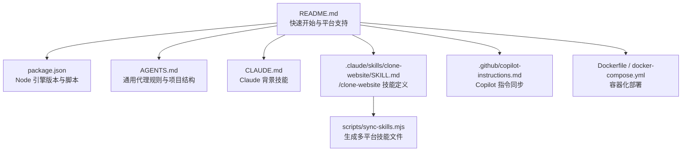
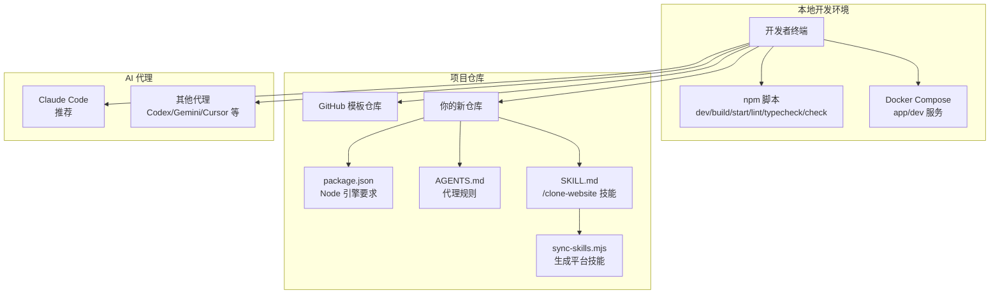
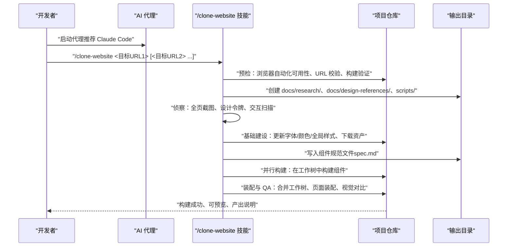
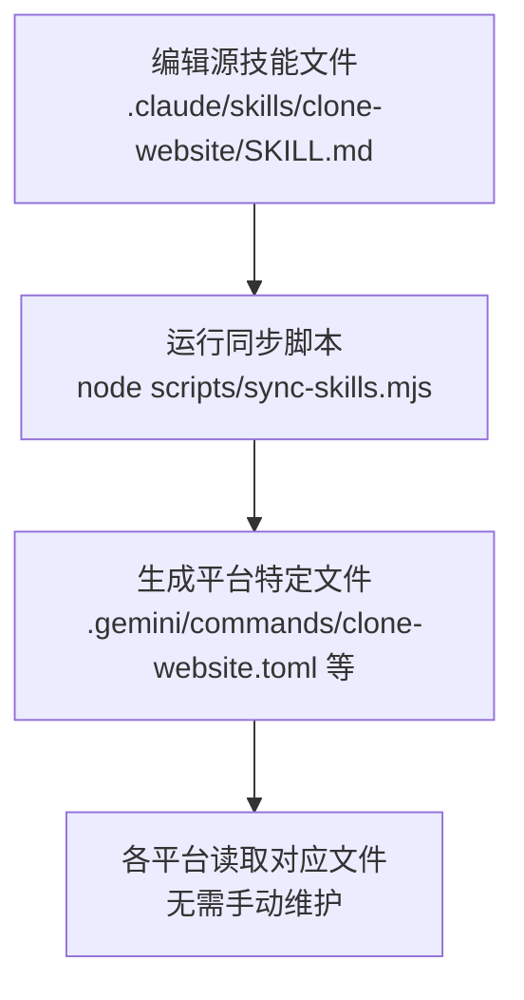
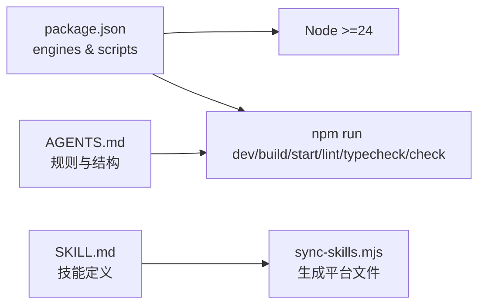

# 快速开始

<cite>
**本文引用的文件**
- [README.md](file://README.md)
- [package.json](file://package.json)
- [AGENTS.md](file://AGENTS.md)
- [CLAUDE.md](file://CLAUDE.md)
- [.claude/skills/clone-website/SKILL.md](file://.claude/skills/clone-website/SKILL.md)
- [scripts/sync-skills.mjs](file://scripts/sync-skills.mjs)
- [.github/copilot-instructions.md](file://.github/copilot-instructions.md)
- [Dockerfile](file://Dockerfile)
- [docker-compose.yml](file://docker-compose.yml)
</cite>

## 目录
1. [简介](#简介)
2. [项目结构](#项目结构)
3. [核心组件](#核心组件)
4. [架构总览](#架构总览)
5. [详细组件分析](#详细组件分析)
6. [依赖分析](#依赖分析)
7. [性能考虑](#性能考虑)
8. [故障排除指南](#故障排除指南)
9. [结论](#结论)
10. [附录](#附录)

## 简介
本指南面向新手开发者，帮助你从零开始在本地搭建并运行蓝辉轻改网站项目，完成网站克隆的端到端流程。你将学会：
- 安装与验证前置条件（Node.js 24+）
- 使用 GitHub 模板创建新仓库并克隆到本地
- 安装项目依赖
- 配置并启动 AI 代理（推荐 Claude Code）
- 执行 '/clone-website' 技能，输入目标 URL 并理解预期结果
- 常见初始化问题排查与解决方案

## 项目结构
该项目是一个基于 Next.js 16 的可复用网站克隆模板，支持多种 AI 编程代理，通过 '/clone-website' 技能实现对任意网站的逆向工程与像素级克隆。

**图表来源**
- [README.md:17-55](file://README.md#L17-L55)
- [package.json:26-36](file://package.json#L26-L36)
- [AGENTS.md:39-59](file://AGENTS.md#L39-L59)
- [CLAUDE.md:1-18](file://CLAUDE.md#L1-L18)
- [.claude/skills/clone-website/SKILL.md:1-6](file://.claude/skills/clone-website/SKILL.md#L1-L6)
- [scripts/sync-skills.mjs:10-113](file://scripts/sync-skills.mjs#L10-L113)
- [.github/copilot-instructions.md:1-148](file://.github/copilot-instructions.md#L1-L148)
- [Dockerfile:1-114](file://Dockerfile#L1-L114)
- [docker-compose.yml:1-54](file://docker-compose.yml#L1-L54)

**章节来源**
- [README.md:17-55](file://README.md#L17-L55)
- [package.json:26-36](file://package.json#L26-L36)
- [AGENTS.md:39-59](file://AGENTS.md#L39-L59)

## 核心组件
- 通用代理规则与项目结构：定义技术栈、代码风格、设计原则与项目目录结构，确保各平台代理遵循一致规范。
- Claude 背景技能：自动加载 Next.js 最佳实践、缓存组件与升级技能，避免常见错误。
- /clone-website 技能：定义逆向工程与克隆的全流程，包括侦察、基础建设、组件规范与并行构建、页面装配与视觉对比等阶段。
- 多平台技能同步：通过脚本将源技能文件生成为各平台所需的指令格式。
- 容器化支持：提供 Dockerfile 与 docker-compose.yml，便于在容器中运行与开发。

**章节来源**
- [AGENTS.md:1-66](file://AGENTS.md#L1-L66)
- [CLAUDE.md:1-18](file://CLAUDE.md#L1-L18)
- [.claude/skills/clone-website/SKILL.md:1-474](file://.claude/skills/clone-website/SKILL.md#L1-L474)
- [scripts/sync-skills.mjs:1-113](file://scripts/sync-skills.mjs#L1-L113)
- [Dockerfile:1-114](file://Dockerfile#L1-L114)
- [docker-compose.yml:1-54](file://docker-compose.yml#L1-L54)

## 架构总览
下图展示了从创建仓库到执行克隆技能的整体流程，以及关键文件之间的关系。

**图表来源**
- [README.md:17-55](file://README.md#L17-L55)
- [package.json:26-36](file://package.json#L26-L36)
- [AGENTS.md:60-66](file://AGENTS.md#L60-L66)
- [.claude/skills/clone-website/SKILL.md:1-6](file://.claude/skills/clone-website/SKILL.md#L1-L6)
- [scripts/sync-skills.mjs:52-113](file://scripts/sync-skills.mjs#L52-L113)
- [docker-compose.yml:1-54](file://docker-compose.yml#L1-L54)

## 详细组件分析

### 前置条件与环境准备
- Node.js 版本要求：项目要求 Node.js 24+，请确保本地已安装满足条件的版本。
- 包管理器：项目同时支持 package-lock.json、yarn.lock、pnpm-lock.yaml，会根据存在情况自动选择安装方式。
- 可选：Docker 与 docker-compose，用于容器化运行与开发。

**章节来源**
- [package.json:26-28](file://package.json#L26-L28)
- [README.md:74-78](file://README.md#L74-L78)
- [Dockerfile:20-32](file://Dockerfile#L20-L32)
- [docker-compose.yml:1-54](file://docker-compose.yml#L1-L54)

### 创建项目副本（GitHub 模板）
- 在模板仓库页面点击“Use this template”，创建你的新仓库。
- 命名、选择公开或私有后创建；如出现“包含所有分支”选项，可按需勾选。
- 在新仓库页面点击“Code”，使用你偏好的工具打开或克隆。

**章节来源**
- [README.md:19-31](file://README.md#L19-L31)

### 克隆到本地并安装依赖
- 使用终端执行克隆命令并进入目录。
- 安装依赖：根据是否存在 package-lock.json、yarn.lock 或 pnpm-lock.yaml 自动选择安装方式。

**章节来源**
- [README.md:33-43](file://README.md#L33-L43)
- [Dockerfile:20-32](file://Dockerfile#L20-L32)

### 启动 AI 代理（推荐 Claude Code）
- 推荐使用 Claude Code（Opus 4.7）以获得最佳效果。
- 启动命令：在项目根目录执行代理启动命令。
- Claude 背景技能：自动应用 Next.js 最佳实践、缓存组件与升级技能，减少常见错误。

**章节来源**
- [README.md:44-47](file://README.md#L44-L47)
- [CLAUDE.md:1-18](file://CLAUDE.md#L1-L18)

### 执行 '/clone-website' 技能
- 基本语法：在代理中输入 /clone-website 并提供一个或多个目标 URL。
- 输入格式：每个 URL 应为有效链接，代理会在执行前进行解析与校验。
- 预期结果：
  - 项目将并行执行多阶段流程：侦察（截图、设计令牌提取、交互扫描）、基础建设（字体、颜色、全局样式、下载资产）、组件规范（写出详细规范文件）、并行构建（在工作树中并行构建）、装配与 QA（合并、页面装配、视觉对比）。
  - 输出目录：docs/research/、docs/design-references/、public/ 等。
  - 组件：src/components/ 下生成对应 React 组件。
  - 页面装配：src/app/page.tsx 中整合页面布局与行为。
  - 构建验证：每次合并后执行构建检查，最终产物可通过 npm run build 与本地预览验证。

**图表来源**
- [.claude/skills/clone-website/SKILL.md:16-34](file://.claude/skills/clone-website/SKILL.md#L16-L34)
- [.claude/skills/clone-website/SKILL.md:120-177](file://.claude/skills/clone-website/SKILL.md#L120-L177)
- [.claude/skills/clone-website/SKILL.md:178-188](file://.claude/skills/clone-website/SKILL.md#L178-L188)
- [.claude/skills/clone-website/SKILL.md:229-403](file://.claude/skills/clone-website/SKILL.md#L229-L403)
- [.claude/skills/clone-website/SKILL.md:405-429](file://.claude/skills/clone-website/SKILL.md#L405-L429)

**章节来源**
- [README.md:48-52](file://README.md#L48-L52)
- [.claude/skills/clone-website/SKILL.md:1-6](file://.claude/skills/clone-website/SKILL.md#L1-L6)
- [.claude/skills/clone-website/SKILL.md:16-34](file://.claude/skills/clone-website/SKILL.md#L16-L34)
- [.claude/skills/clone-website/SKILL.md:120-177](file://.claude/skills/clone-website/SKILL.md#L120-L177)
- [.claude/skills/clone-website/SKILL.md:178-188](file://.claude/skills/clone-website/SKILL.md#L178-L188)
- [.claude/skills/clone-website/SKILL.md:229-403](file://.claude/skills/clone-website/SKILL.md#L229-L403)
- [.claude/skills/clone-website/SKILL.md:405-429](file://.claude/skills/clone-website/SKILL.md#L405-L429)

### 多平台技能同步机制
- 源文件：.claude/skills/clone-website/SKILL.md
- 同步脚本：scripts/sync-skills.mjs
- 功能：将源技能文件生成为各平台所需的指令格式（如 .gemini/commands/clone-website.toml、.github/skills/clone-website/SKILL.md 等），并自动添加头部注释提示。

**图表来源**
- [scripts/sync-skills.mjs:10-113](file://scripts/sync-skills.mjs#L10-L113)
- [AGENTS.md:60-66](file://AGENTS.md#L60-L66)

**章节来源**
- [scripts/sync-skills.mjs:1-113](file://scripts/sync-skills.mjs#L1-L113)
- [AGENTS.md:60-66](file://AGENTS.md#L60-L66)

### 容器化运行（可选）
- 生产镜像：docker-compose.yml 定义了 app 服务，暴露端口 3000，默认 NODE_ENV=production。
- 开发镜像：dev 服务映射到 3001 端口，挂载当前目录与 node_modules 缓存，便于热重载与调试。
- Dockerfile：按锁文件选择安装方式，分阶段构建与运行，支持 Telemetry 禁用。

**章节来源**
- [docker-compose.yml:1-54](file://docker-compose.yml#L1-L54)
- [Dockerfile:1-114](file://Dockerfile#L1-L114)

## 依赖分析
- Node 引擎：>=24
- 运行脚本：dev、build、start、lint、typecheck、check
- 代理规则：AGENTS.md 提供统一的 Next.js 代码风格、设计原则与项目结构约定
- 技能同步：scripts/sync-skills.mjs 将源技能文件转换为多平台指令

**图表来源**
- [package.json:26-36](file://package.json#L26-L36)
- [AGENTS.md:1-66](file://AGENTS.md#L1-L66)
- [.claude/skills/clone-website/SKILL.md:1-6](file://.claude/skills/clone-website/SKILL.md#L1-L6)
- [scripts/sync-skills.mjs:10-113](file://scripts/sync-skills.mjs#L10-L113)

**章节来源**
- [package.json:26-36](file://package.json#L26-L36)
- [AGENTS.md:1-66](file://AGENTS.md#L1-L66)
- [.claude/skills/clone-website/SKILL.md:1-6](file://.claude/skills/clone-website/SKILL.md#L1-L6)
- [scripts/sync-skills.mjs:10-113](file://scripts/sync-skills.mjs#L10-L113)

## 性能考虑
- 并行构建：技能在提取的同时并行调度构建器，缩短整体时间。
- 分阶段构建：基础建设完成后才进入组件构建，保证依赖顺序正确。
- 视觉 QA：在装配后进行视觉对比，确保像素级还原。
- 容器优化：Dockerfile 使用多阶段构建与缓存策略，提升镜像构建效率。

[本节为通用建议，不直接分析具体文件]

## 故障排除指南
- Node 版本不满足要求
  - 现象：安装或运行时报 Node 版本过低。
  - 解决：升级到 Node.js 24+。
  - 参考：[package.json:26-28](file://package.json#L26-L28)
- 未使用 GitHub 模板创建仓库
  - 现象：直接克隆模板导致无法提交或 PR。
  - 解决：使用“Use this template”创建你的新仓库后再克隆。
  - 参考：[README.md:19-28](file://README.md#L19-L28)
- 代理无法启动浏览器自动化
  - 现象：/clone-website 技能报错缺少浏览器自动化工具。
  - 解决：安装并配置 Chrome MCP 或其他可用的浏览器 MCP 工具。
  - 参考：[.claude/skills/clone-website/SKILL.md:29](file://.claude/skills/clone-website/SKILL.md#L29)
- 构建失败
  - 现象：npm run build 或类型检查失败。
  - 解决：先确保基础建设阶段完成（字体、颜色、全局样式、下载资产），再逐段合并与构建。
  - 参考：[.claude/skills/clone-website/SKILL.md:178-188](file://.claude/skills/clone-website/SKILL.md#L178-L188)
- URL 格式错误
  - 现象：代理提示 URL 无效或不可访问。
  - 解决：确认 URL 正确且可访问，必要时在代理中修正后再执行。
  - 参考：[.claude/skills/clone-website/SKILL.md:30](file://.claude/skills/clone-website/SKILL.md#L30)
- 容器启动失败
  - 现象：健康检查失败或端口占用。
  - 解决：检查端口映射（默认 3000/3001）、环境变量与 .env 文件，确保服务可访问。
  - 参考：[docker-compose.yml:20-25](file://docker-compose.yml#L20-L25), [docker-compose.yml:48-53](file://docker-compose.yml#L48-L53)

**章节来源**
- [package.json:26-28](file://package.json#L26-L28)
- [README.md:19-28](file://README.md#L19-L28)
- [.claude/skills/clone-website/SKILL.md:29-30](file://.claude/skills/clone-website/SKILL.md#L29-L30)
- [.claude/skills/clone-website/SKILL.md:178-188](file://.claude/skills/clone-website/SKILL.md#L178-L188)
- [docker-compose.yml:20-25](file://docker-compose.yml#L20-L25)
- [docker-compose.yml:48-53](file://docker-compose.yml#L48-L53)

## 结论
通过本指南，你可以：
- 正确设置 Node.js 24+ 环境
- 使用 GitHub 模板创建专属仓库并克隆到本地
- 安装依赖并启动 Claude Code 代理
- 执行 '/clone-website' 技能，理解输入格式与预期结果
- 利用多平台技能同步机制与容器化能力，稳定推进项目开发

[本节为总结，不直接分析具体文件]

## 附录
- 常用命令
  - 启动开发服务器：npm run dev
  - 生产构建：npm run build
  - 类型检查：npm run typecheck
  - ESLint 检查：npm run lint
  - 全量检查：npm run check
- 容器化
  - 运行生产服务：docker compose up app --build
  - 运行开发服务：docker compose up dev --build

**章节来源**
- [README.md:136-151](file://README.md#L136-L151)
- [package.json:29-36](file://package.json#L29-L36)
- [docker-compose.yml:1-54](file://docker-compose.yml#L1-L54)