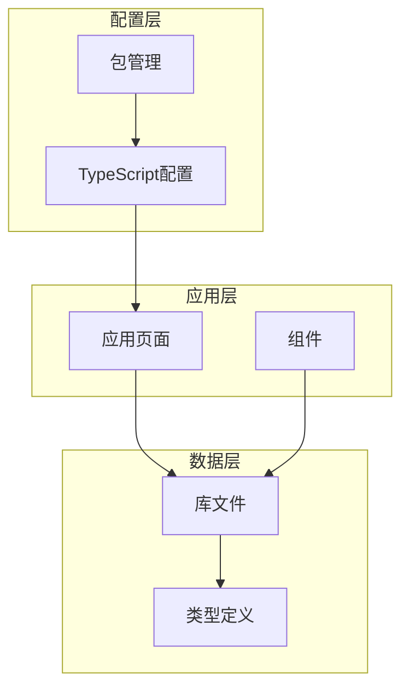
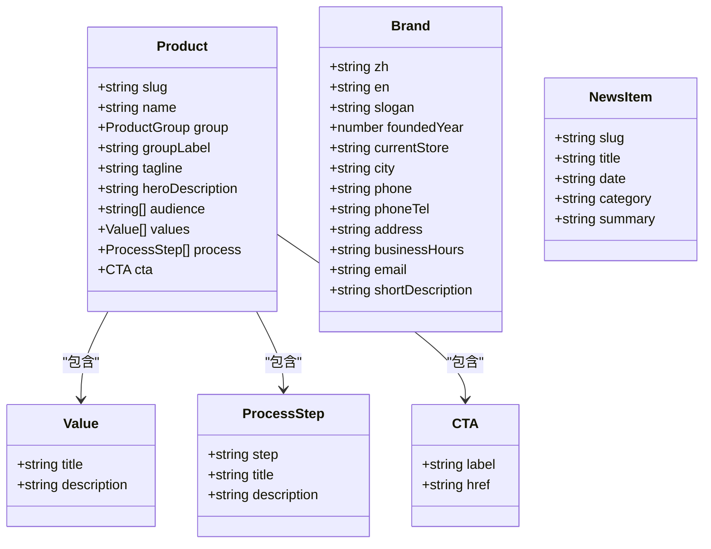
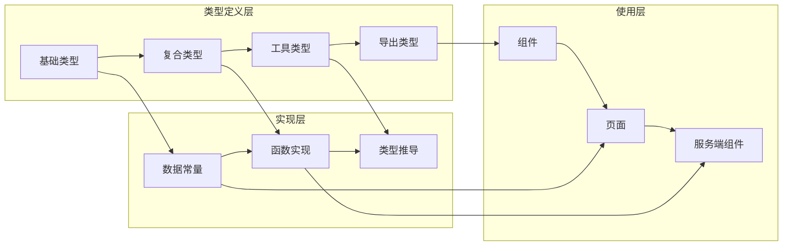
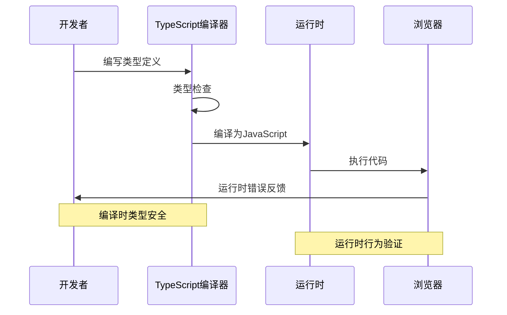
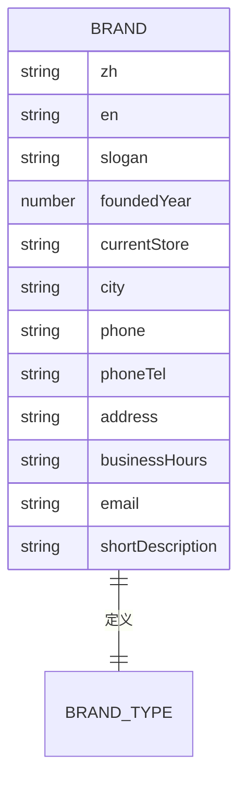
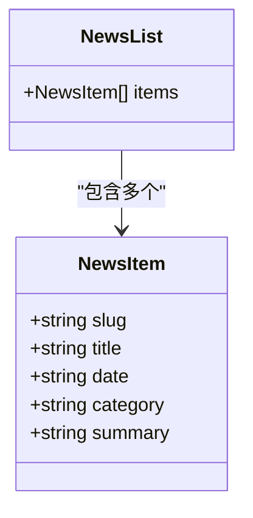
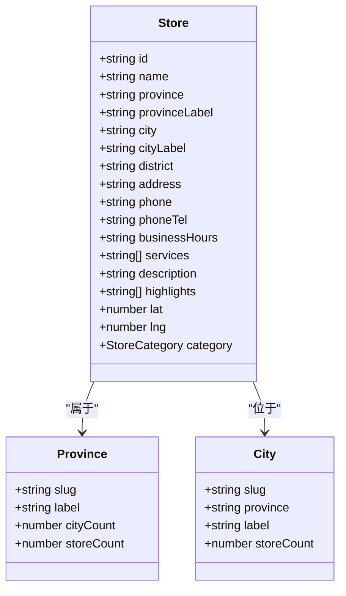
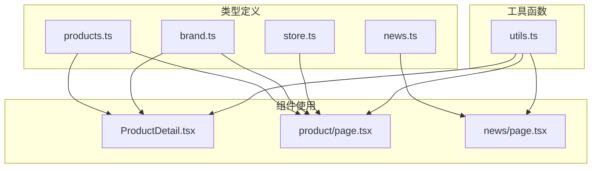
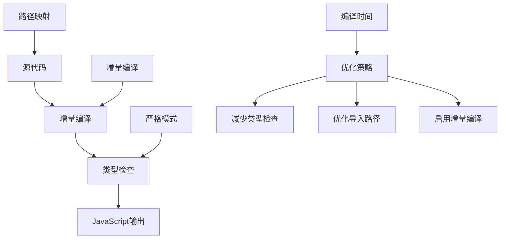
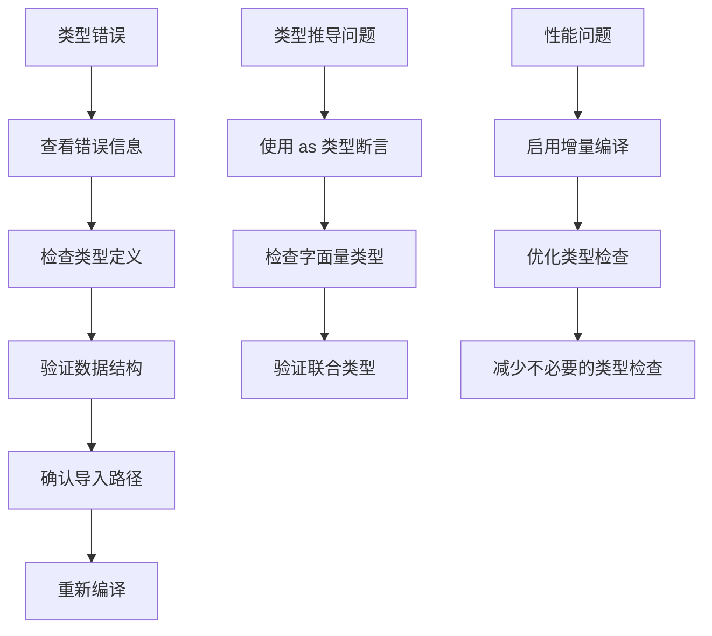

# TypeScript类型扩展

<cite>
**本文档引用的文件**
- [products.ts](file://src/lib/products.ts)
- [brand.ts](file://src/lib/brand.ts)
- [news.ts](file://src/lib/news.ts)
- [store.ts](file://src/lib/store.ts)
- [utils.ts](file://src/lib/utils.ts)
- [ProductDetail.tsx](file://src/components/ProductDetail.tsx)
- [page.tsx](file://src/app/product/page.tsx)
- [page.tsx](file://src/app/news/page.tsx)
- [tsconfig.json](file://tsconfig.json)
- [package.json](file://package.json)
</cite>

## 目录
1. [引言](#引言)
2. [项目结构](#项目结构)
3. [核心组件](#核心组件)
4. [架构概览](#架构概览)
5. [详细组件分析](#详细组件分析)
6. [依赖关系分析](#依赖关系分析)
7. [性能考虑](#性能考虑)
8. [故障排除指南](#故障排除指南)
9. [结论](#结论)
10. [附录](#附录)

## 引言

本指南专注于在现有TypeScript项目中进行类型扩展的最佳实践。该项目是一个基于Next.js的网站克隆模板，展示了如何在现有的产品、品牌、新闻和门店数据基础上添加新的数据模型和接口定义。

该项目采用了严格的TypeScript配置，启用了所有严格模式选项，确保类型安全性和代码质量。通过分析项目中的实际实现，我们将提供一套完整的类型扩展方法论。

## 项目结构

项目采用模块化的文件组织方式，主要分为以下几个部分：



**图表来源**
- [tsconfig.json:1-35](file://tsconfig.json#L1-L35)
- [package.json:1-60](file://package.json#L1-L60)

**章节来源**
- [tsconfig.json:1-35](file://tsconfig.json#L1-L35)
- [package.json:1-60](file://package.json#L1-L60)

## 核心组件

### 类型系统基础

项目中的类型系统建立在几个核心概念之上：

1. **字面量类型**：用于定义固定的字符串值集合
2. **接口定义**：描述数据结构的形状
3. **联合类型**：组合多种可能的类型
4. **泛型约束**：提供类型安全的通用实现

### 数据模型层次



**图表来源**
- [products.ts:10-21](file://src/lib/products.ts#L10-L21)
- [brand.ts:8-27](file://src/lib/brand.ts#L8-L27)
- [news.ts:8-14](file://src/lib/news.ts#L8-L14)

**章节来源**
- [products.ts:8-282](file://src/lib/products.ts#L8-L282)
- [brand.ts:1-28](file://src/lib/brand.ts#L1-L28)
- [news.ts:1-46](file://src/lib/news.ts#L1-L46)

## 架构概览

### 类型扩展架构



### 类型安全流程



**图表来源**
- [tsconfig.json:7](file://tsconfig.json#L7)
- [package.json:34](file://package.json#L34)

## 详细组件分析

### 产品类型扩展

#### 基础产品类型

产品类型系统展现了完整的类型设计模式：

```mermaid
classDiagram
class ProductGroup {
<<枚举>>
"light-mod"
"film"
}
class Product {
+string slug
+string name
+ProductGroup group
+string groupLabel
+string tagline
+string heroDescription
+string[] audience
+Value[] values
+ProcessStep[] process
+CTA cta
}
class Value {
+string title
+string description
}
class ProcessStep {
+string step
+string title
+string description
}
class CTA {
+string label
+string href
}
ProductGroup <|-- Product : "使用"
Product --> Value : "包含多个"
Product --> ProcessStep : "包含多个"
Product --> CTA : "包含"
```

**图表来源**
- [products.ts:8](file://src/lib/products.ts#L8)
- [products.ts:10-21](file://src/lib/products.ts#L10-L21)

#### 类型推导最佳实践

项目中展示了多种类型推导技巧：

1. **字面量类型推导**：使用 `as const` 保持字面量精度
2. **联合类型推导**：通过枚举值创建类型安全的联合
3. **嵌套对象推导**：利用 `typeof` 获取复杂对象的类型

**章节来源**
- [brand.ts:25-27](file://src/lib/brand.ts#L25-L27)
- [products.ts:274-281](file://src/lib/products.ts#L274-L281)

### 品牌信息类型

品牌信息类型体现了类型安全的数据建模：



**图表来源**
- [brand.ts:8-27](file://src/lib/brand.ts#L8-L27)

**章节来源**
- [brand.ts:1-28](file://src/lib/brand.ts#L1-L28)

### 新闻数据类型

新闻系统展示了简单而有效的类型设计：



**图表来源**
- [news.ts:8-14](file://src/lib/news.ts#L8-L14)

**章节来源**
- [news.ts:1-46](file://src/lib/news.ts#L1-L46)

### 门店数据类型

门店系统展现了地理位置相关的复杂类型设计：



**图表来源**
- [store.ts:8-26](file://src/lib/store.ts#L8-L26)

**章节来源**
- [store.ts:1-122](file://src/lib/store.ts#L1-L122)

## 依赖关系分析

### 类型导入关系



**图表来源**
- [ProductDetail.tsx:5-6](file://src/components/ProductDetail.tsx#L5-L6)
- [page.tsx:6](file://src/app/product/page.tsx#L6)
- [page.tsx:6](file://src/app/news/page.tsx#L6)

### 类型兼容性分析

项目中的类型兼容性处理展现了良好的设计原则：

1. **向前兼容**：新增字段时保持可选性
2. **向后兼容**：删除字段时提供默认值
3. **类型收敛**：使用联合类型限制取值范围

**章节来源**
- [products.ts:23-44](file://src/lib/products.ts#L23-L44)
- [store.ts:23-25](file://src/lib/store.ts#L23-L25)

## 性能考虑

### 类型检查优化

项目配置了全面的TypeScript严格模式，这虽然增加了编译时间，但显著提升了代码质量：

- **严格空值检查**：防止未定义值导致的运行时错误
- **严格属性检查**：确保对象属性的完整性
- **严格函数检查**：验证函数参数和返回值类型

### 编译性能优化



**图表来源**
- [tsconfig.json:13](file://tsconfig.json#L13)
- [tsconfig.json:16-23](file://tsconfig.json#L16-L23)

**章节来源**
- [tsconfig.json:1-35](file://tsconfig.json#L1-L35)
- [package.json:34](file://package.json#L34)

## 故障排除指南

### 常见类型错误

1. **属性不存在错误**：确保访问的对象属性在类型定义中存在
2. **类型不兼容错误**：检查联合类型和接口的兼容性
3. **泛型约束错误**：验证泛型参数的约束条件

### 类型调试技巧



### 最佳实践清单

- 使用 `as const` 保持字面量类型精度
- 为可选属性提供默认值
- 使用联合类型限制取值范围
- 通过接口定义清晰的数据结构
- 利用泛型实现类型安全的复用

**章节来源**
- [utils.ts:1-7](file://src/lib/utils.ts#L1-L7)

## 结论

本指南展示了在现有TypeScript项目中进行类型扩展的完整方法论。通过分析项目的实际实现，我们总结了以下关键要点：

1. **类型设计原则**：从简单到复杂的渐进式设计
2. **类型安全策略**：严格的类型检查和推导
3. **兼容性保证**：向前和向后兼容的设计考虑
4. **性能优化**：在类型安全和编译性能之间找到平衡

这些实践不仅适用于当前项目，也可以推广到其他TypeScript项目中，帮助开发者建立健壮的类型系统。

## 附录

### 类型扩展模板

```typescript
// 基础类型定义
export type NewDataType = {
  id: string;
  name: string;
  description: string;
};

// 复合类型定义
export type ExtendedType = NewDataType & {
  metadata: Record<string, unknown>;
  tags: string[];
};

// 工具类型
export type OptionalFields<T> = {
  [P in keyof T]?: T[P];
};

// 导出类型
export type ExportedType = ExtendedType | null;
```

### 配置参考

项目使用了以下关键的TypeScript配置：

- **严格模式**：启用所有严格检查选项
- **增量编译**：提高开发效率
- **路径映射**：简化模块导入
- **插件支持**：集成Next.js特定功能

**章节来源**
- [tsconfig.json:7](file://tsconfig.json#L7)
- [tsconfig.json:15](file://tsconfig.json#L15)
- [tsconfig.json:21-23](file://tsconfig.json#L21-L23)