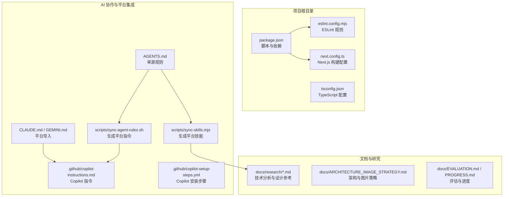
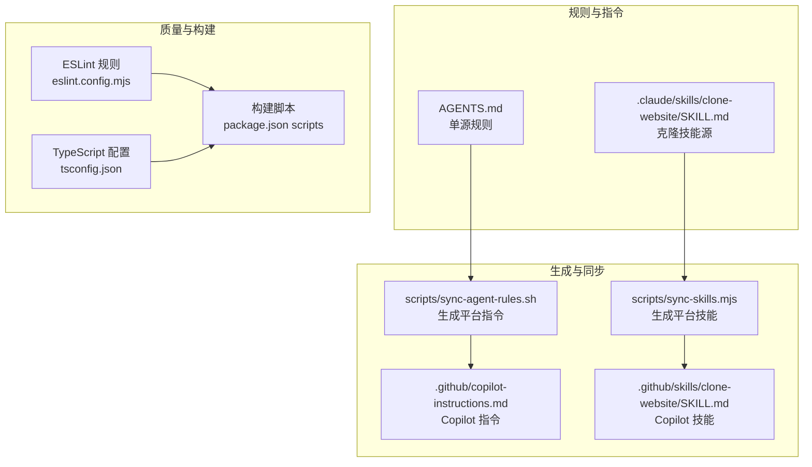
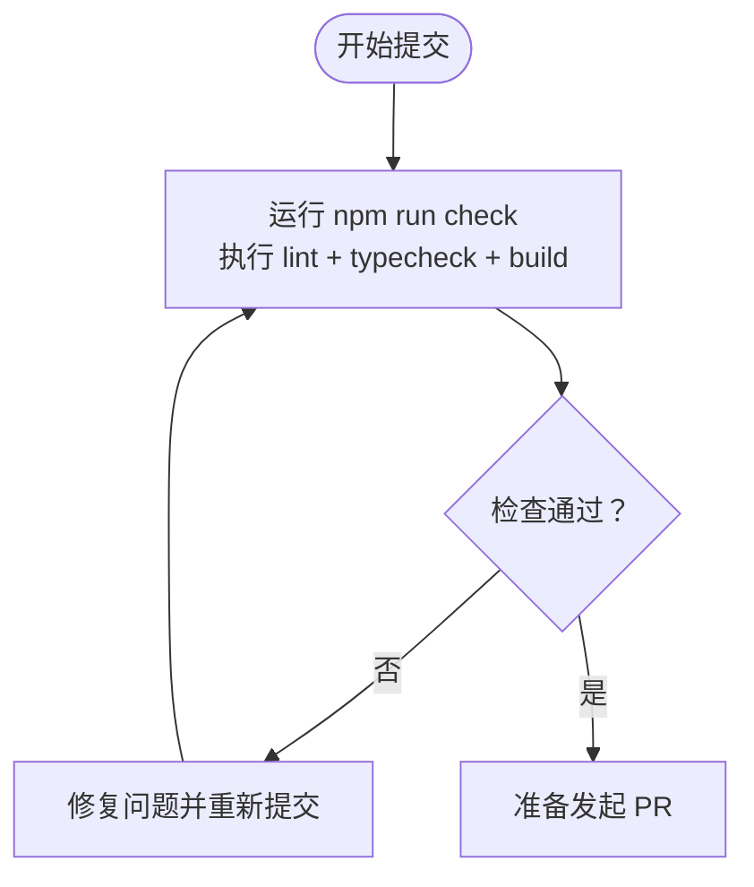
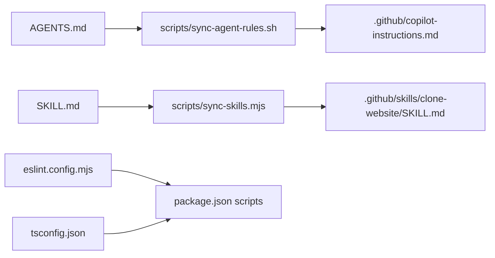

# 团队协作规范

<cite>
**本文档引用的文件**
- [README.md](file://README.md)
- [package.json](file://package.json)
- [AGENTS.md](file://AGENTS.md)
- [CLAUDE.md](file://CLAUDE.md)
- [GEMINI.md](file://GEMINI.md)
- [.github/PULL_REQUEST_TEMPLATE.md](file://.github/PULL_REQUEST_TEMPLATE.md)
- [.github/copilot-instructions.md](file://.github/copilot-instructions.md)
- [.github/copilot-setup-steps.yml](file://.github/copilot-setup-steps.yml)
- [scripts/sync-agent-rules.sh](file://scripts/sync-agent-rules.sh)
- [scripts/sync-skills.mjs](file://scripts/sync-skills.mjs)
- [eslint.config.mjs](file://eslint.config.mjs)
- [tsconfig.json](file://tsconfig.json)
- [next.config.ts](file://next.config.ts)
</cite>

## 目录
1. [引言](#引言)
2. [项目结构](#项目结构)
3. [核心组件](#核心组件)
4. [架构总览](#架构总览)
5. [详细组件分析](#详细组件分析)
6. [依赖关系分析](#依赖关系分析)
7. [性能考虑](#性能考虑)
8. [故障排除指南](#故障排除指南)
9. [结论](#结论)
10. [附录](#附录)

## 引言
本规范面向使用 AI 编码代理进行“网站克隆”项目的团队协作，目标是统一代码提交、分支管理与合并策略，规范代码审查流程、质量标准与测试要求，明确 Git 工作流最佳实践（含 commit message 格式、分支命名规范与 PR 模板），建立文档编写标准、知识分享机制与团队沟通流程，并给出 CI/CD 配置与自动化测试的实施建议。本规范以仓库现有配置与脚本为依据，结合 Next.js + shadcn/ui + Tailwind CSS v4 的技术栈特性制定。

## 项目结构
该项目采用 Next.js 16 App Router + TypeScript + ESLint + Tailwind CSS v4 的现代化前端工程，配合多平台 AI 编码代理支持与自动化同步脚本，形成“单源规则 + 多端生成”的协作模式。

图表来源
- [package.json:1-60](file://package.json#L1-L60)
- [tsconfig.json:1-35](file://tsconfig.json#L1-L35)
- [eslint.config.mjs:1-19](file://eslint.config.mjs#L1-L19)
- [next.config.ts:1-14](file://next.config.ts#L1-L14)
- [AGENTS.md:1-66](file://AGENTS.md#L1-L66)
- [scripts/sync-agent-rules.sh:1-89](file://scripts/sync-agent-rules.sh#L1-L89)
- [scripts/sync-skills.mjs:1-113](file://scripts/sync-skills.mjs#L1-L113)

章节来源
- [README.md:110-134](file://README.md#L110-L134)
- [package.json:29-36](file://package.json#L29-L36)

## 核心组件
- 质量保障体系：ESLint + TypeScript 类型检查 + 构建校验，统一在脚本中串联执行，确保提交前质量门禁。
- AI 协作规则：AGENTS.md 作为“单源规则”，通过脚本同步到各平台（Copilot、Continue、Amazon Q 等）。
- 平台技能同步：.claude/skills/clone-website/SKILL.md 为源文件，通过脚本生成各平台命令文件。
- 文档与研究：docs/research 下存放设计令牌、组件清单、布局架构等研究输出，支撑克隆过程的可追溯性与复用性。

章节来源
- [eslint.config.mjs:1-19](file://eslint.config.mjs#L1-L19)
- [tsconfig.json:7-23](file://tsconfig.json#L7-L23)
- [package.json:33-35](file://package.json#L33-L35)
- [AGENTS.md:26-37](file://AGENTS.md#L26-L37)
- [scripts/sync-agent-rules.sh:55-87](file://scripts/sync-agent-rules.sh#L55-L87)
- [scripts/sync-skills.mjs:45-112](file://scripts/sync-skills.mjs#L45-L112)

## 架构总览
下图展示从“单源规则”到“多平台生成”的协作架构，以及质量门禁与构建流程：

图表来源
- [AGENTS.md:1-66](file://AGENTS.md#L1-L66)
- [scripts/sync-agent-rules.sh:55-87](file://scripts/sync-agent-rules.sh#L55-L87)
- [scripts/sync-skills.mjs:45-112](file://scripts/sync-skills.mjs#L45-L112)
- [eslint.config.mjs:1-19](file://eslint.config.mjs#L1-L19)
- [tsconfig.json:1-35](file://tsconfig.json#L1-L35)
- [package.json:29-36](file://package.json#L29-L36)

## 详细组件分析

### 代码提交规范与质量门禁
- 提交前检查：统一通过脚本执行“lint + typecheck + build”，确保代码风格、类型安全与构建通过。
- ESLint 配置：基于 next-core-web-vitals 与 next-typescript，覆盖现代 Web 性能指标与 TS 最佳实践。
- TypeScript 严格模式：启用严格类型检查，路径别名 @/* 指向 src，提升模块化与可维护性。
- 构建配置：Next.js standalone 输出与图片优化参数，兼顾部署与性能。

图表来源
- [package.json:33-35](file://package.json#L33-L35)
- [eslint.config.mjs:1-19](file://eslint.config.mjs#L1-L19)
- [tsconfig.json:7-23](file://tsconfig.json#L7-L23)
- [next.config.ts:4-11](file://next.config.ts#L4-L11)

章节来源
- [package.json:29-36](file://package.json#L29-L36)
- [eslint.config.mjs:1-19](file://eslint.config.mjs#L1-L19)
- [tsconfig.json:1-35](file://tsconfig.json#L1-L35)
- [next.config.ts:1-14](file://next.config.ts#L1-L14)

### 分支管理与合并策略
- 基础分支：主分支用于发布稳定版本；开发分支用于集成特性。
- 功能分支：按功能或页面拆分，命名建议采用“类型/主题/子主题”结构，例如 feat/product-detail、fix/home-hero、docs/architecture-image-strategy。
- 合并策略：优先使用“squash merge”整合功能分支，保持主分支提交历史整洁；合并前必须通过质量门禁与代码审查。
- 冲突解决：AI 团队并行工作时，建议在独立 worktree 分支上并行开发，最终统一合并并解决冲突。

章节来源
- [AGENTS.md:60-66](file://AGENTS.md#L60-L66)

### 代码审查流程与质量标准
- 审查范围：变更需覆盖功能正确性、样式一致性、性能影响与可访问性。
- 质量标准：遵循 AGENTS.md 中的设计原则与代码风格，确保像素级还原与移动优先响应式设计。
- 审查清单：包含是否满足 lint/typecheck/build、是否符合设计令牌与组件清单、是否存在破坏性变更等。

章节来源
- [AGENTS.md:26-37](file://AGENTS.md#L26-L37)
- [.github/PULL_REQUEST_TEMPLATE.md:17-20](file://.github/PULL_REQUEST_TEMPLATE.md#L17-L20)

### 测试要求与自动化
- 当前仓库未发现显式的单元/集成测试配置文件；建议在后续阶段引入 Vitest/Jest 与 Playwright，覆盖关键组件与端到端场景。
- 测试策略：以“设计令牌与组件清单”为基准，验证克隆结果与目标站点的一致性；对交互状态（hover、active、加载骨架、错误状态）进行回归测试。
- 自动化：将测试纳入质量门禁（npm run check），确保每次提交均通过测试。

章节来源
- [AGENTS.md:85-120](file://AGENTS.md#L85-L120)

### Git 工作流最佳实践
- Commit Message 格式：采用“类型: 主题”格式，如 feat: 新增产品详情页、fix: 修复导航栏样式、docs: 更新克隆流程说明。
- 分支命名规范：见“分支管理与合并策略”。
- PR 模板使用：在 PR 描述中填写摘要、关联 Issue、选择变更类型、勾选质量检查项，确保审查信息完整。

章节来源
- [.github/PULL_REQUEST_TEMPLATE.md:1-20](file://.github/PULL_REQUEST_TEMPLATE.md#L1-L20)

### 文档编写标准与知识分享
- 文档结构：docs/research 下按阶段产出 DESIGN_TOKENS.md、COMPONENT_INVENTORY.md、LAYOUT_ARCHITECTURE.md、INTERACTION_PATTERNS.md、TECH_STACK_ANALYSIS.md。
- 知识分享：定期在团队内分享“技术分析报告”与“克隆经验总结”，沉淀可复用的设计与实现模式。
- 变更追踪：通过 CHANGELOG.md 记录版本迭代与重大变更，便于回溯与审计。

章节来源
- [AGENTS.md:140-148](file://AGENTS.md#L140-L148)
- [README.md:164-167](file://README.md#L164-L167)

### 团队沟通流程
- 使用 Discord 等即时通讯工具进行日常沟通与问题讨论。
- 对于跨平台协作（Claude Code 团队），建议在独立 worktree 分支上并行开发，最终统一合并，减少冲突成本。

章节来源
- [README.md:3](file://README.md#L3)
- [AGENTS.md:60-66](file://AGENTS.md#L60-L66)

### CI/CD 流程与自动化测试
- CI 阶段建议包含：安装依赖、运行 lint、类型检查、构建、测试（待引入）。
- CD 阶段建议：根据分支策略自动部署预览环境，主分支合并后部署生产环境。
- 仓库已提供 Copilot 安装步骤与平台指令，可作为 CI 环境初始化参考。

章节来源
- [.github/copilot-setup-steps.yml:1-4](file://.github/copilot-setup-steps.yml#L1-L4)
- [.github/copilot-instructions.md:23-27](file://.github/copilot-instructions.md#L23-L27)

### 团队开发工具使用指南
- 支持平台：Claude Code、GitHub Copilot、Cursor、Windsurf、Gemini CLI、Continue、Amazon Q、Augment Code、Aider 等。
- 平台配置：通过 AGENTS.md 与 SKILL.md 统一规则，使用同步脚本自动生成各平台配置，避免分散维护。
- 平台导入：CLAUDE.md、GEMINI.md 作为轻量导入文件，指向 AGENTS.md，确保一致性。

章节来源
- [README.md:56-73](file://README.md#L56-L73)
- [AGENTS.md:1-66](file://AGENTS.md#L1-L66)
- [CLAUDE.md:1-18](file://CLAUDE.md#L1-L18)
- [GEMINI.md:1-2](file://GEMINI.md#L1-L2)

## 依赖关系分析
- 脚本依赖：sync-agent-rules.sh 依赖 AGENTS.md；sync-skills.mjs 依赖 .claude/skills/clone-website/SKILL.md。
- 质量依赖：ESLint 与 TS 配置共同约束代码质量；package.json 脚本串联三者。
- 平台依赖：各平台通过生成文件读取统一规则，降低维护成本。

图表来源
- [AGENTS.md:1-66](file://AGENTS.md#L1-L66)
- [scripts/sync-agent-rules.sh:55-87](file://scripts/sync-agent-rules.sh#L55-L87)
- [scripts/sync-skills.mjs:45-112](file://scripts/sync-skills.mjs#L45-L112)
- [eslint.config.mjs:1-19](file://eslint.config.mjs#L1-L19)
- [tsconfig.json:1-35](file://tsconfig.json#L1-L35)
- [package.json:29-36](file://package.json#L29-L36)

章节来源
- [scripts/sync-agent-rules.sh:1-89](file://scripts/sync-agent-rules.sh#L1-L89)
- [scripts/sync-skills.mjs:1-113](file://scripts/sync-skills.mjs#L1-L113)
- [package.json:29-36](file://package.json#L29-L36)

## 性能考虑
- 图片优化：Next.js 配置了 AVIF/WebP 格式与多设备尺寸，最小缓存时间较长，有助于提升首屏性能。
- 构建输出：standalone 输出便于容器化部署与冷启动优化。
- 开发体验：TypeScript 严格模式与 ESLint 提前暴露潜在性能与可维护性问题。

章节来源
- [next.config.ts:4-11](file://next.config.ts#L4-L11)

## 故障排除指南
- 同步失败：若 AGENTS.md 或 SKILL.md 更新后未生效，请确认对应同步脚本执行成功且生成文件已提交。
- 质量门禁失败：优先查看 lint 与类型检查输出，逐项修复后再重新执行质量门禁脚本。
- 平台指令不一致：检查 CLAUDE.md、GEMINI.md 是否仍指向 AGENTS.md，必要时重新生成。

章节来源
- [scripts/sync-agent-rules.sh:55-87](file://scripts/sync-agent-rules.sh#L55-L87)
- [scripts/sync-skills.mjs:45-112](file://scripts/sync-skills.mjs#L45-L112)
- [CLAUDE.md:1-18](file://CLAUDE.md#L1-L18)
- [GEMINI.md:1-2](file://GEMINI.md#L1-L2)

## 结论
本规范以“单源规则 + 多端生成”为核心，结合严格的代码质量门禁与清晰的分支/合并策略，辅以完善的文档与知识分享机制，旨在提升团队协作效率与交付质量。建议在现有基础上逐步引入自动化测试与 CI/CD 流水线，持续优化开发体验与稳定性。

## 附录
- 快速参考
  - 质量门禁：npm run check（lint + typecheck + build）
  - 开发命令：npm run dev、npm run build、npm run lint、npm run typecheck
  - 平台同步：bash scripts/sync-agent-rules.sh；node scripts/sync-skills.mjs
  - 设计原则：像素级还原、无个人审美改动、真实内容、移动优先

章节来源
- [package.json:29-36](file://package.json#L29-L36)
- [AGENTS.md:26-37](file://AGENTS.md#L26-L37)
- [scripts/sync-agent-rules.sh:67-89](file://scripts/sync-agent-rules.sh#L67-L89)
- [scripts/sync-skills.mjs:53-113](file://scripts/sync-skills.mjs#L53-L113)