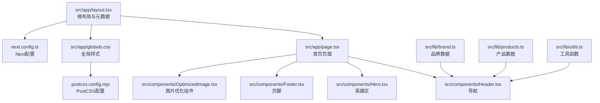
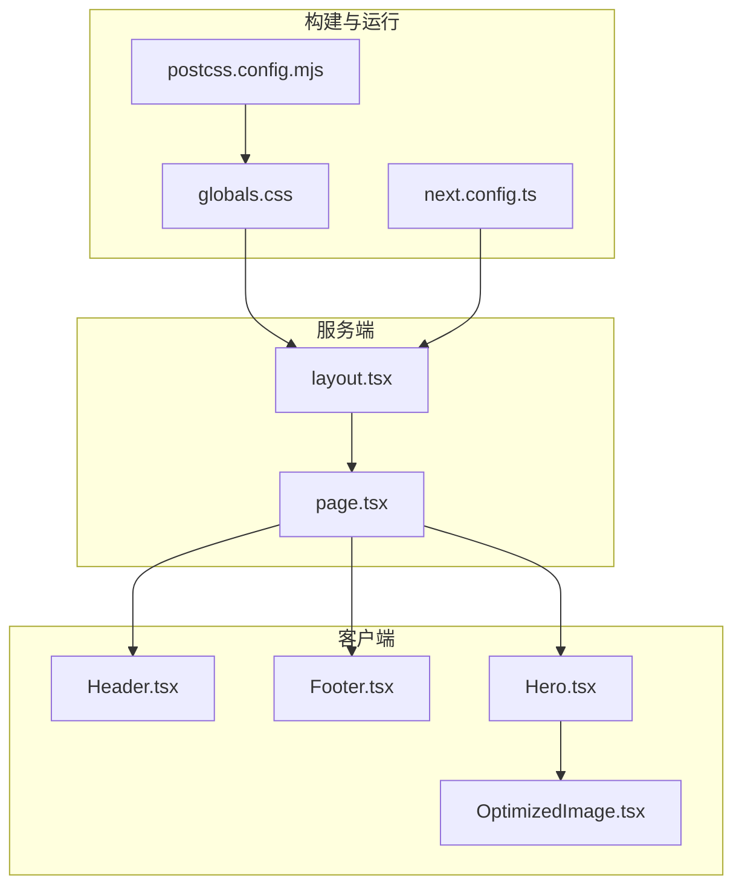
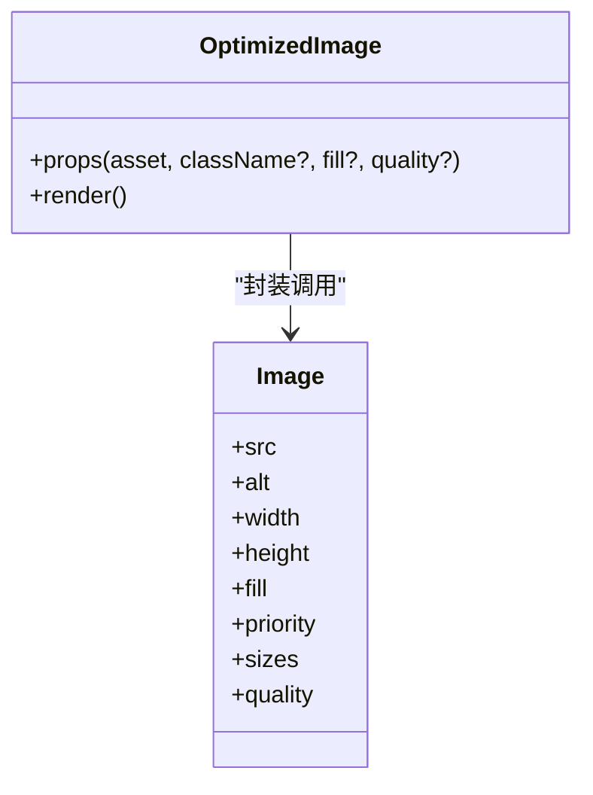
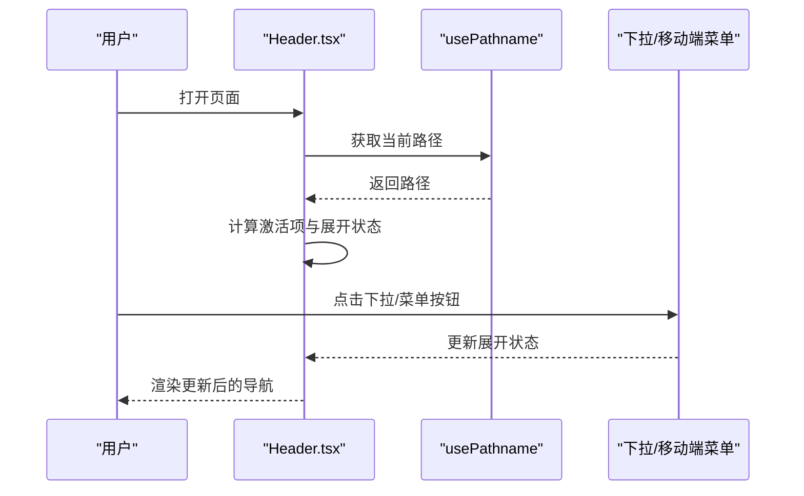
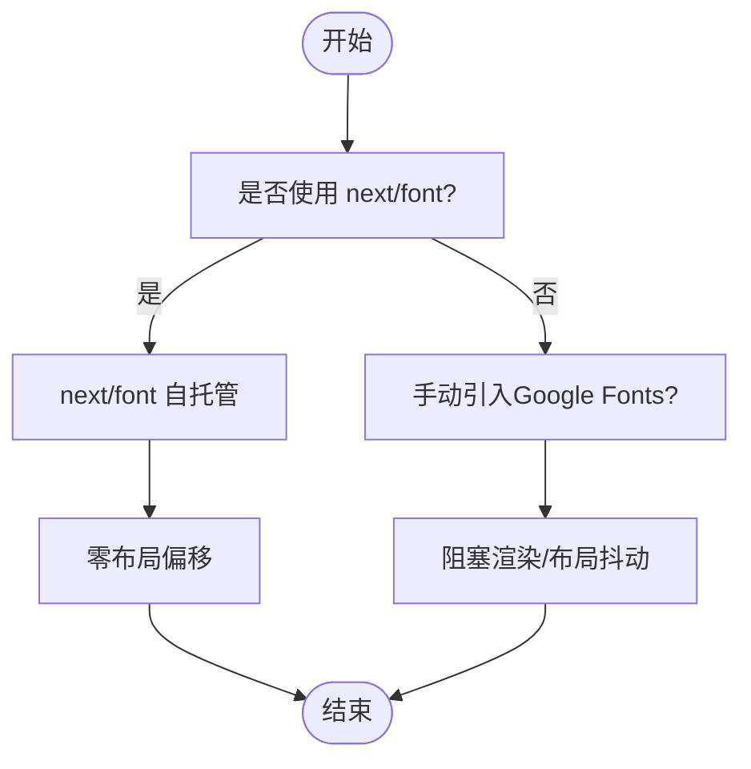
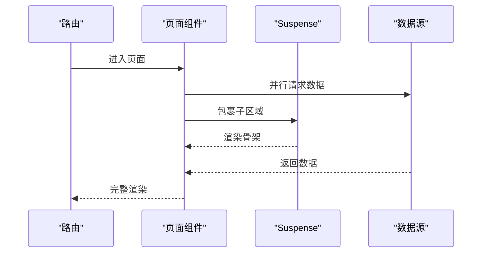
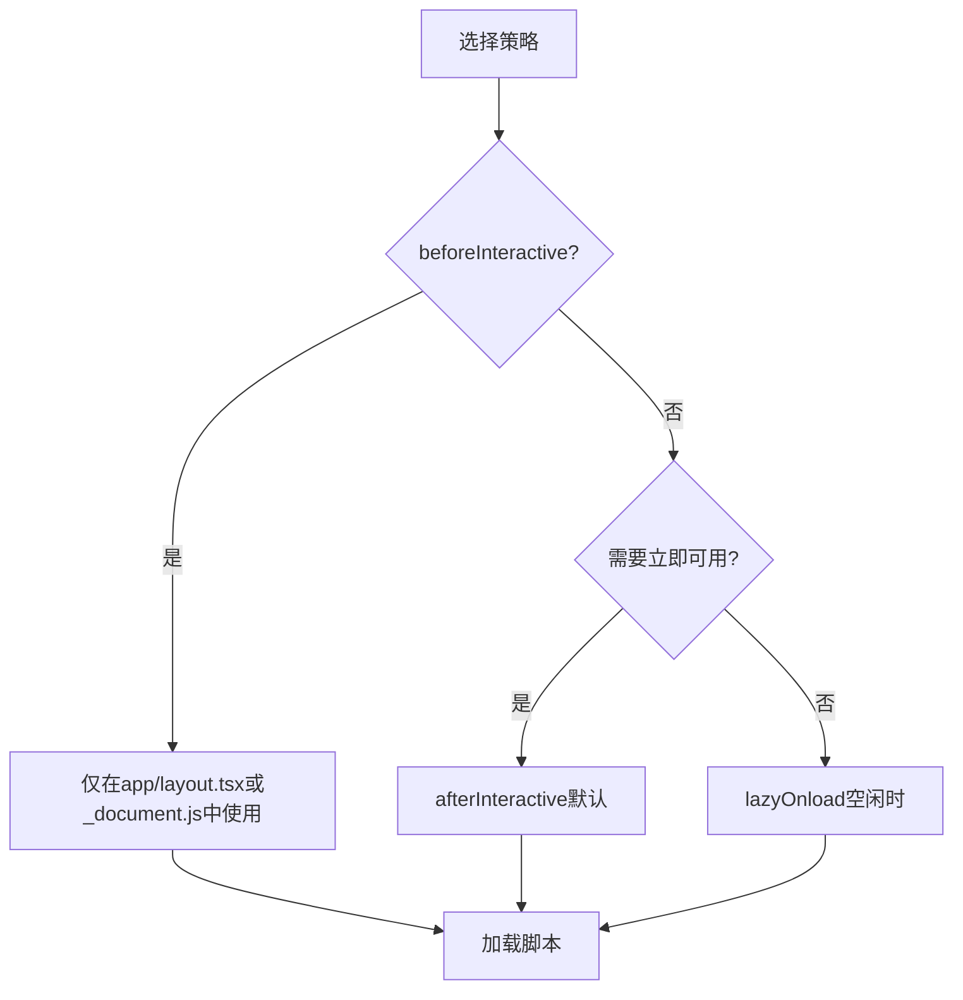
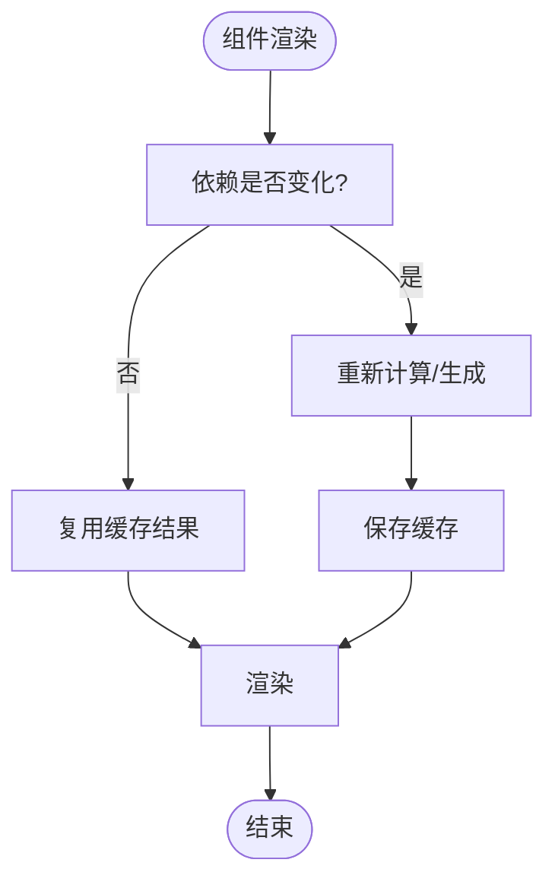
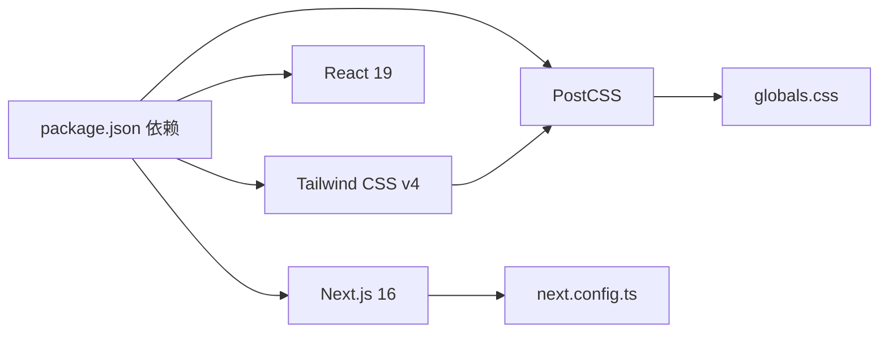

# 性能优化策略

<cite>
**本文引用的文件**
- [next.config.ts](file://next.config.ts)
- [package.json](file://package.json)
- [src/app/layout.tsx](file://src/app/layout.tsx)
- [src/app/page.tsx](file://src/app/page.tsx)
- [src/components/Header.tsx](file://src/components/Header.tsx)
- [src/components/Footer.tsx](file://src/components/Footer.tsx)
- [src/components/Hero.tsx](file://src/components/Hero.tsx)
- [src/components/OptimizedImage.tsx](file://src/components/OptimizedImage.tsx)
- [src/lib/utils.ts](file://src/lib/utils.ts)
- [src/lib/brand.ts](file://src/lib/brand.ts)
- [src/lib/products.ts](file://src/lib/products.ts)
- [src/app/globals.css](file://src/app/globals.css)
- [postcss.config.mjs](file://postcss.config.mjs)
- [.claude/skills/next-best-practices/bundling.md](file://.claude/skills/next-best-practices/bundling.md)
- [.claude/skills/next-best-practices/font.md](file://.claude/skills/next-best-practices/font.md)
- [.claude/skills/next-best-practices/data-patterns.md](file://.claude/skills/next-best-practices/data-patterns.md)
- [.claude/skills/next-best-practices/scripts.md](file://.claude/skills/next-best-practices/scripts.md)
</cite>

## 目录
1. [引言](#引言)
2. [项目结构](#项目结构)
3. [核心组件](#核心组件)
4. [架构总览](#架构总览)
5. [详细组件分析](#详细组件分析)
6. [依赖关系分析](#依赖关系分析)
7. [性能考量](#性能考量)
8. [故障排查指南](#故障排查指南)
9. [结论](#结论)
10. [附录](#附录)

## 引言
本指南聚焦于Next.js应用的性能优化策略，结合仓库现有实现，系统讲解代码分割、懒加载与预取策略；图片优化、字体优化与静态资源处理最佳实践；组件级优化技巧（如React.memo、useMemo、useCallback的应用场景与替代方案）；数据获取优化与缓存策略；CDN配置方法；以及性能监控与分析工具使用、性能基准测试与持续优化流程。内容既面向技术读者，也兼顾非技术读者的理解。

## 项目结构
该项目采用Next.js App Router目录结构，页面组件位于src/app下，通用布局与元数据定义在根布局文件中，全局样式通过PostCSS与Tailwind集成。组件层包含头部导航、页脚、英雄区等业务组件，品牌与产品数据集中在lib目录，图片优化通过统一组件封装。

**图表来源**
- [src/app/layout.tsx:1-39](file://src/app/layout.tsx#L1-L39)
- [src/app/page.tsx:1-22](file://src/app/page.tsx#L1-L22)
- [src/components/Header.tsx:1-292](file://src/components/Header.tsx#L1-L292)
- [src/components/Hero.tsx:1-56](file://src/components/Hero.tsx#L1-L56)
- [src/components/Footer.tsx:1-113](file://src/components/Footer.tsx#L1-L113)
- [src/components/OptimizedImage.tsx:1-51](file://src/components/OptimizedImage.tsx#L1-L51)
- [src/app/globals.css:1-130](file://src/app/globals.css#L1-L130)
- [postcss.config.mjs:1-8](file://postcss.config.mjs#L1-L8)
- [next.config.ts:1-14](file://next.config.ts#L1-L14)
- [src/lib/brand.ts:1-28](file://src/lib/brand.ts#L1-L28)
- [src/lib/products.ts:1-304](file://src/lib/products.ts#L1-L304)
- [src/lib/utils.ts:1-7](file://src/lib/utils.ts#L1-L7)

**章节来源**
- [src/app/layout.tsx:1-39](file://src/app/layout.tsx#L1-L39)
- [src/app/page.tsx:1-22](file://src/app/page.tsx#L1-L22)
- [src/app/globals.css:1-130](file://src/app/globals.css#L1-L130)
- [postcss.config.mjs:1-8](file://postcss.config.mjs#L1-L8)
- [next.config.ts:1-14](file://next.config.ts#L1-L14)

## 核心组件
- 根布局与元数据：负责站点标题、描述、OpenGraph等SEO元数据注入，以及全局样式与主题变量。
- 首页页面：组织Header、Hero、核心服务、产品入口与Footer等模块。
- 导航组件：包含桌面端与移动端菜单、下拉子菜单、路径高亮逻辑与外部事件监听清理。
- 英雄区组件：展示品牌信息与行动号召按钮，强调首屏视觉体验。
- 页脚组件：提供快捷导航、产品中心链接与联系方式。
- 图片优化组件：统一封装next/image，支持priority与sizes策略，保证首屏与下屏的差异化加载。

**章节来源**
- [src/app/layout.tsx:1-39](file://src/app/layout.tsx#L1-L39)
- [src/app/page.tsx:1-22](file://src/app/page.tsx#L1-L22)
- [src/components/Header.tsx:1-292](file://src/components/Header.tsx#L1-L292)
- [src/components/Hero.tsx:1-56](file://src/components/Hero.tsx#L1-L56)
- [src/components/Footer.tsx:1-113](file://src/components/Footer.tsx#L1-L113)
- [src/components/OptimizedImage.tsx:1-51](file://src/components/OptimizedImage.tsx#L1-L51)

## 架构总览
整体架构遵循Next.js App Router模式，页面作为服务器组件渲染，客户端交互通过“use client”标记的组件实现。图片与字体通过Next.js内置优化能力与自定义组件进行统一管理，构建时由PostCSS与Tailwind处理样式，运行时由Next配置控制图片格式与缓存策略。

**图表来源**
- [src/app/layout.tsx:1-39](file://src/app/layout.tsx#L1-L39)
- [src/app/page.tsx:1-22](file://src/app/page.tsx#L1-L22)
- [src/components/Header.tsx:1-292](file://src/components/Header.tsx#L1-L292)
- [src/components/Hero.tsx:1-56](file://src/components/Hero.tsx#L1-L56)
- [src/components/Footer.tsx:1-113](file://src/components/Footer.tsx#L1-L113)
- [src/components/OptimizedImage.tsx:1-51](file://src/components/OptimizedImage.tsx#L1-L51)
- [src/app/globals.css:1-130](file://src/app/globals.css#L1-L130)
- [postcss.config.mjs:1-8](file://postcss.config.mjs#L1-L8)
- [next.config.ts:1-14](file://next.config.ts#L1-L14)

## 详细组件分析

### 图片优化组件（OptimizedImage）
该组件统一封装next/image，提供：
- 统一质量参数与优先级策略（priority/lazy）
- fill与非fill两种尺寸适配
- sizes配置支持响应式宽度
- 可扩展的className与质量参数

**图表来源**
- [src/components/OptimizedImage.tsx:1-51](file://src/components/OptimizedImage.tsx#L1-L51)

**章节来源**
- [src/components/OptimizedImage.tsx:1-51](file://src/components/OptimizedImage.tsx#L1-L51)

### 导航组件（Header）
职责与优化点：
- 使用usePathname进行路径高亮判断，避免不必要的重渲染。
- 下拉菜单与移动端菜单的状态管理，配合事件监听清理，减少内存泄漏风险。
- 将品牌与产品数据导入到导航中，便于统一维护与扩展。

**图表来源**
- [src/components/Header.tsx:1-292](file://src/components/Header.tsx#L1-L292)

**章节来源**
- [src/components/Header.tsx:1-292](file://src/components/Header.tsx#L1-L292)
- [src/lib/brand.ts:1-28](file://src/lib/brand.ts#L1-L28)
- [src/lib/products.ts:1-304](file://src/lib/products.ts#L1-L304)

### 字体与样式优化
- 全局样式通过PostCSS与Tailwind集成，使用CSS变量定义主题与字体族。
- 推荐使用next/font进行字体自托管与零布局偏移优化，避免手动<link>引入导致的阻塞与布局抖动。
- 在layout中一次性声明字体变量，避免在多个组件重复导入字体实例。

**图表来源**
- [.claude/skills/next-best-practices/font.md:1-227](file://.claude/skills/next-best-practices/font.md#L1-L227)
- [src/app/globals.css:1-130](file://src/app/globals.css#L1-L130)

**章节来源**
- [.claude/skills/next-best-practices/font.md:1-227](file://.claude/skills/next-best-practices/font.md#L1-L227)
- [src/app/globals.css:1-130](file://src/app/globals.css#L1-L130)

### 数据获取与缓存策略
- 并行获取：使用Promise.all并行请求多个数据源，缩短首屏等待时间。
- 流式渲染：利用Suspense分段显示内容，提升感知性能。
- 预取模式：在路由进入前触发数据获取，使数据在组件渲染时已就绪。

**图表来源**
- [.claude/skills/next-best-practices/data-patterns.md:149-229](file://.claude/skills/next-best-practices/data-patterns.md#L149-L229)

**章节来源**
- [.claude/skills/next-best-practices/data-patterns.md:149-229](file://.claude/skills/next-best-practices/data-patterns.md#L149-L229)

### 脚本加载策略
- 使用next/script替代原生<script>标签，获得更好的性能与可维护性。
- 合理选择strategy：afterInteractive（默认）、lazyOnload（空闲时加载）、beforeInteractive（仅在特定文件中使用）。
- 避免将next/script放入next/head内部，交由next/script自行处理位置。

**图表来源**
- [.claude/skills/next-best-practices/scripts.md:56-71](file://.claude/skills/next-best-practices/scripts.md#L56-L71)

**章节来源**
- [.claude/skills/next-best-practices/scripts.md:1-71](file://.claude/skills/next-best-practices/scripts.md#L1-L71)

### 组件级性能优化技巧
- React.memo：适用于纯展示型组件，避免因父组件重渲染导致的子组件重渲染。
- useMemo：用于缓存昂贵计算结果，避免重复计算。
- useCallback：用于缓存回调函数引用，防止子组件因引用变化而重渲染。
- 替代方案：在Next.js中，优先使用服务器组件与Suspense，减少客户端状态与副作用，从而降低重渲染成本。

**图表来源**
- [.claude/skills/next-best-practices/data-patterns.md:149-229](file://.claude/skills/next-best-practices/data-patterns.md#L149-L229)

**章节来源**
- [.claude/skills/next-best-practices/data-patterns.md:149-229](file://.claude/skills/next-best-practices/data-patterns.md#L149-L229)

## 依赖关系分析
- 构建与运行时依赖：Next.js 16、React 19、Tailwind CSS v4、PostCSS等。
- 样式管线：PostCSS加载tailwind插件，全局CSS定义主题变量与字体族。
- 图片优化：Next配置启用WebP/AVIF格式、设备像素比与缓存策略，结合OptimizedImage组件实现优先级与响应式尺寸控制。

**图表来源**
- [package.json:1-60](file://package.json#L1-L60)
- [postcss.config.mjs:1-8](file://postcss.config.mjs#L1-L8)
- [src/app/globals.css:1-130](file://src/app/globals.css#L1-L130)
- [next.config.ts:1-14](file://next.config.ts#L1-L14)

**章节来源**
- [package.json:1-60](file://package.json#L1-L60)
- [postcss.config.mjs:1-8](file://postcss.config.mjs#L1-L8)
- [src/app/globals.css:1-130](file://src/app/globals.css#L1-L130)
- [next.config.ts:1-14](file://next.config.ts#L1-L14)

## 性能考量
- 代码分割与懒加载
  - 利用App Router的路由级代码分割，确保每个页面只加载所需模块。
  - 对非首屏使用的重型组件采用动态导入与ssr: false，减少首屏体积。
  - 结合next/script的strategy选择，将非关键脚本延迟加载。
- 图片优化
  - 使用next/image与OptimizedImage组件，设置priority与sizes，实现首屏优先与响应式尺寸。
  - 在next.config.ts中启用WebP/AVIF格式与较长缓存时间，降低带宽与提升加载速度。
- 字体优化
  - 使用next/font进行自托管，避免网络请求与布局抖动。
  - 在layout中一次性声明字体变量，避免重复实例化。
- 静态资源处理
  - 通过PostCSS与Tailwind生成最小化CSS，减少网络传输。
  - 将品牌与产品数据集中管理，避免在组件内重复定义。
- 数据获取与缓存
  - 并行获取多个数据源，缩短首屏等待。
  - 使用Suspense实现流式渲染，提升感知性能。
  - 在路由进入前触发数据预取，使数据在渲染时已就绪。
- CDN配置
  - 利用Next.js内置的静态资源缓存策略（minimumCacheTTL），结合CDN可进一步加速全球访问。
  - 对图片与字体资源启用持久缓存与压缩，减少重复下载。

**章节来源**
- [next.config.ts:1-14](file://next.config.ts#L1-L14)
- [src/components/OptimizedImage.tsx:1-51](file://src/components/OptimizedImage.tsx#L1-L51)
- [.claude/skills/next-best-practices/font.md:1-227](file://.claude/skills/next-best-practices/font.md#L1-L227)
- [.claude/skills/next-best-practices/data-patterns.md:149-229](file://.claude/skills/next-best-practices/data-patterns.md#L149-L229)
- [.claude/skills/next-best-practices/scripts.md:56-71](file://.claude/skills/next-best-practices/scripts.md#L56-L71)

## 故障排查指南
- 图片未按预期加载
  - 检查OptimizedImage的priority与sizes配置是否正确。
  - 确认next.config.ts中的deviceSizes与imageSizes是否覆盖目标设备。
- 字体加载阻塞或布局抖动
  - 确认使用next/font而非手动<link>引入。
  - 检查是否在多个组件重复导入字体实例。
- 脚本加载时机问题
  - 确认next/script未放置在next/head内部。
  - 根据场景选择afterInteractive或lazyOnload策略。
- 客户端包打包失败
  - 若第三方包依赖浏览器API，需在客户端组件中使用动态导入或包装器。
  - 对于服务端不可用的包，考虑externalize或替换兼容方案。

**章节来源**
- [next.config.ts:1-14](file://next.config.ts#L1-L14)
- [src/components/OptimizedImage.tsx:1-51](file://src/components/OptimizedImage.tsx#L1-L51)
- [.claude/skills/next-best-practices/font.md:180-227](file://.claude/skills/next-best-practices/font.md#L180-L227)
- [.claude/skills/next-best-practices/scripts.md:36-54](file://.claude/skills/next-best-practices/scripts.md#L36-L54)
- [.claude/skills/next-best-practices/bundling.md:1-78](file://.claude/skills/next-best-practices/bundling.md#L1-L78)

## 结论
本指南基于仓库现有实现，总结了Next.js应用在图片、字体、数据获取、脚本加载与样式管线等方面的性能优化策略。通过合理的代码分割、懒加载与预取、图片与字体优化、以及构建与运行时配置，可以显著提升首屏速度与用户体验。建议在后续迭代中持续引入性能监控与基准测试，形成闭环优化流程。

## 附录
- 性能监控与分析工具
  - 使用浏览器开发者工具的Performance与Network面板进行加载分析。
  - 利用Lighthouse或WebPageTest进行离线与在线性能评估。
  - 在生产环境集成CDN与缓存策略，结合日志与指标监控（如Core Web Vitals）。
- 基准测试与持续优化流程
  - 设定关键指标（LCP、FID、CLS等），建立基线。
  - 对每次改动进行A/B测试或灰度发布，对比前后指标。
  - 形成定期回顾机制，持续优化代码分割、资源加载与缓存策略。