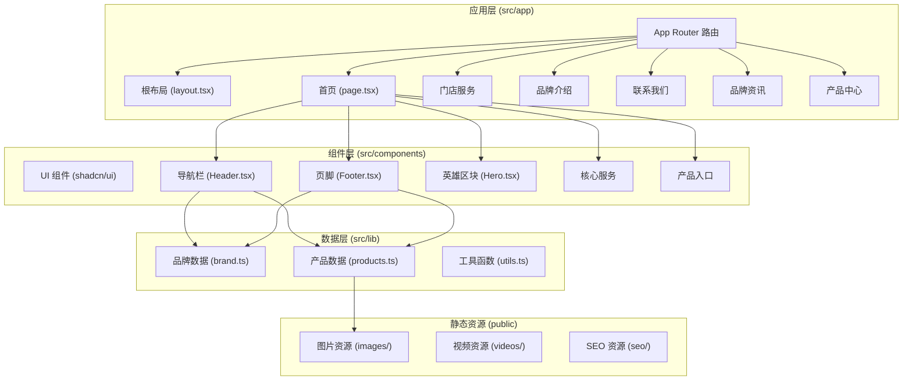
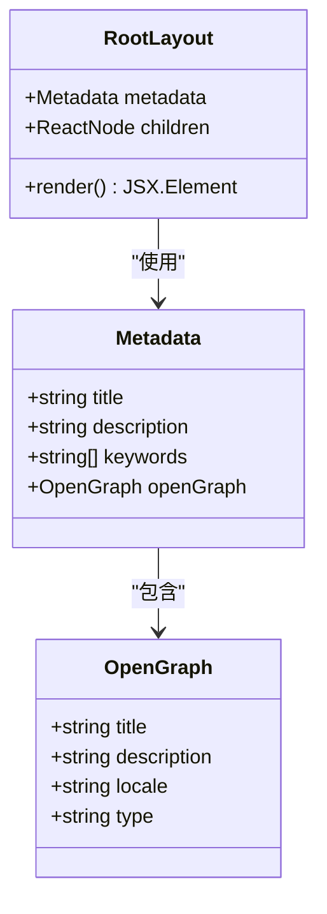
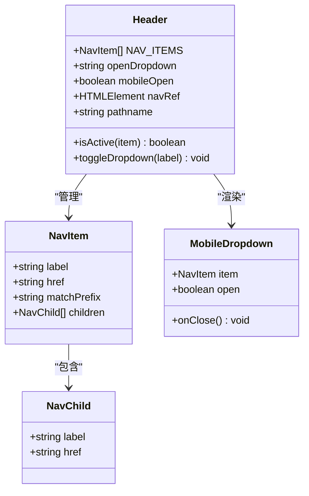
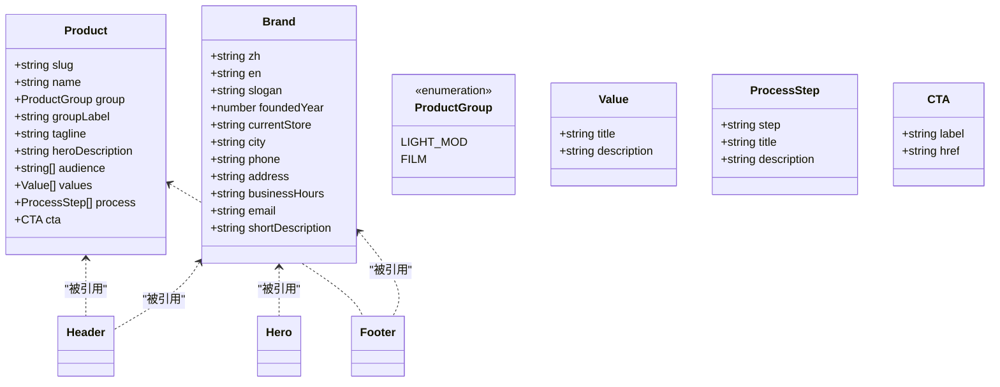
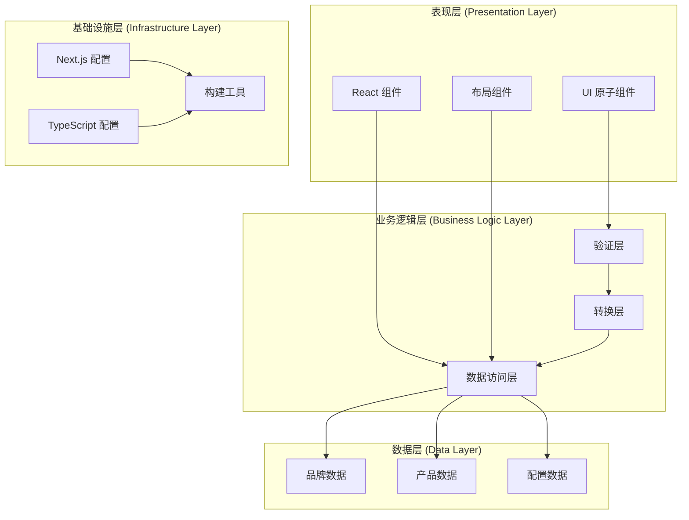
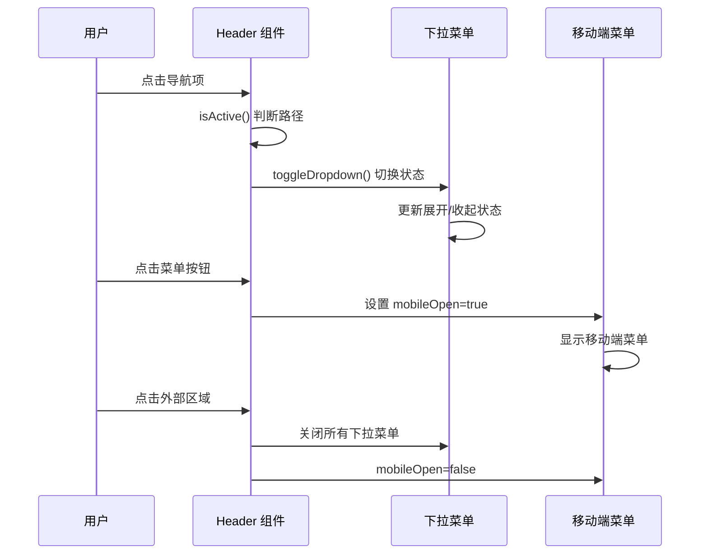
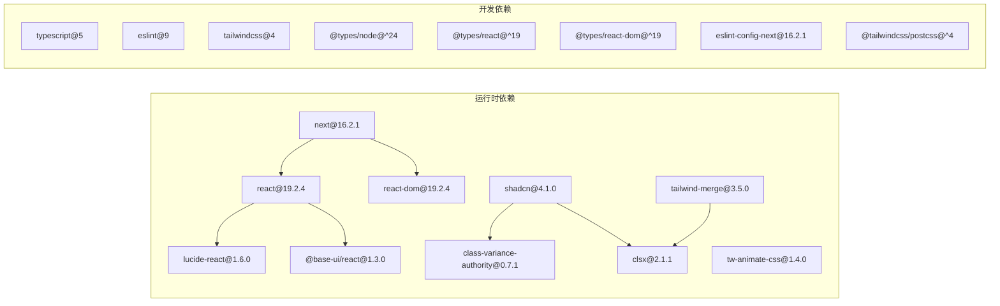

# 扩展开发指南

<cite>
**本文档引用的文件**
- [README.md](file://README.md)
- [package.json](file://package.json)
- [next.config.ts](file://next.config.ts)
- [tsconfig.json](file://tsconfig.json)
- [src/app/layout.tsx](file://src/app/layout.tsx)
- [src/app/page.tsx](file://src/app/page.tsx)
- [src/components/Header.tsx](file://src/components/Header.tsx)
- [src/components/Footer.tsx](file://src/components/Footer.tsx)
- [src/components/Hero.tsx](file://src/components/Hero.tsx)
- [src/components/WhyChooseUs.tsx](file://src/components/WhyChooseUs.tsx)
- [src/lib/utils.ts](file://src/lib/utils.ts)
- [src/lib/brand.ts](file://src/lib/brand.ts)
- [src/lib/products.ts](file://src/lib/products.ts)
</cite>

## 目录
1. [引言](#引言)
2. [项目结构](#项目结构)
3. [核心组件](#核心组件)
4. [架构概览](#架构概览)
5. [详细组件分析](#详细组件分析)
6. [依赖分析](#依赖分析)
7. [性能考虑](#性能考虑)
8. [故障排除指南](#故障排除指南)
9. [结论](#结论)
10. [附录](#附录)

## 引言

本指南面向蓝辉轻改网站的扩展开发，提供从页面创建到组件开发、从数据层扩展到类型系统完善的完整工作流程。项目基于 Next.js 16 App Router 架构，采用 React 19、TypeScript 严格模式、Tailwind CSS v4 和 shadcn/ui 组件体系，遵循现代化前端工程的最佳实践。

本指南重点涵盖：
- 新功能开发的标准流程与最佳实践
- 页面创建、组件开发、数据层扩展的完整工作流
- TypeScript 类型扩展方法与类型安全维护策略
- 自定义 Hooks 的设计模式与复用机制
- 第三方库集成的评估标准与接入方法
- 性能优化、代码分割与懒加载的实现策略
- 文档编写与知识管理的重要性
- 团队协作开发规范与代码审查流程

## 项目结构

项目采用基于功能的模块化组织方式，核心目录结构如下：

**图表来源**
- [src/app/layout.tsx:1-32](file://src/app/layout.tsx#L1-L32)
- [src/app/page.tsx:1-22](file://src/app/page.tsx#L1-L22)
- [src/components/Header.tsx:1-292](file://src/components/Header.tsx#L1-L292)
- [src/components/Footer.tsx:1-113](file://src/components/Footer.tsx#L1-L113)

**章节来源**
- [README.md:110-134](file://README.md#L110-L134)
- [package.json:1-60](file://package.json#L1-L60)

## 核心组件

### 布局系统

项目采用全局根布局，统一管理元数据、语言设置和主题配置：

**图表来源**
- [src/app/layout.tsx:1-32](file://src/app/layout.tsx#L1-L32)

### 导航系统

Header 组件实现了响应式导航，支持多级菜单和移动端适配：

**图表来源**
- [src/components/Header.tsx:1-292](file://src/components/Header.tsx#L1-L292)

### 数据层架构

品牌信息和产品数据采用集中式管理，便于跨组件共享：

**图表来源**
- [src/lib/brand.ts:1-28](file://src/lib/brand.ts#L1-L28)
- [src/lib/products.ts:1-282](file://src/lib/products.ts#L1-L282)

**章节来源**
- [src/app/layout.tsx:1-32](file://src/app/layout.tsx#L1-L32)
- [src/components/Header.tsx:1-292](file://src/components/Header.tsx#L1-L292)
- [src/lib/brand.ts:1-28](file://src/lib/brand.ts#L1-L28)
- [src/lib/products.ts:1-282](file://src/lib/products.ts#L1-L282)

## 架构概览

项目采用分层架构，各层职责明确，耦合度低：

**图表来源**
- [next.config.ts:1-9](file://next.config.ts#L1-L9)
- [tsconfig.json:1-35](file://tsconfig.json#L1-L35)

## 详细组件分析

### 头部导航组件 (Header)

Header 组件实现了复杂的导航逻辑，包括：

#### 导航状态管理
- 下拉菜单的展开/收起控制
- 移动端菜单的状态切换
- 路径匹配的活动状态判断

#### 交互行为
- 点击外部区域自动关闭下拉菜单
- ESC 键盘事件处理
- 响应式布局适配

**图表来源**
- [src/components/Header.tsx:44-78](file://src/components/Header.tsx#L44-L78)

**章节来源**
- [src/components/Header.tsx:1-292](file://src/components/Header.tsx#L1-L292)

### 英雄区块组件 (Hero)

Hero 组件负责首页的主要视觉展示，包含渐变背景和行动号召按钮：

#### 设计特性
- 渐变背景层叠效果
- 动态色彩强调
- 响应式内容布局
- 视觉焦点引导

**章节来源**
- [src/components/Hero.tsx:1-56](file://src/components/Hero.tsx#L1-L56)

### 选择我们组件 (WhyChooseUs)

WhyChooseUs 组件展示了品牌的核心优势，采用卡片网格布局：

#### 组件设计
- 特性卡片的动态配色系统
- 图标与文本的组合展示
- 悬停交互效果
- 响应式网格布局

**章节来源**
- [src/components/WhyChooseUs.tsx:1-84](file://src/components/WhyChooseUs.tsx#L1-L84)

### 品牌数据管理

品牌数据采用常量对象形式，提供类型安全保障：

#### 数据结构
- 品牌基本信息（中英文名、标语等）
- 联系方式和地址信息
- 业务描述和定位信息

**章节来源**
- [src/lib/brand.ts:1-28](file://src/lib/brand.ts#L1-L28)

### 产品数据管理

产品数据采用类型安全的结构化设计：

#### 数据模型
- 产品分类（轻改装备 vs 膜系）
- 产品核心属性（名称、描述、受众等）
- 服务流程模板
- 价值主张列表

**章节来源**
- [src/lib/products.ts:1-282](file://src/lib/products.ts#L1-L282)

## 依赖分析

项目依赖关系清晰，主要依赖包括：

**图表来源**
- [package.json:37-58](file://package.json#L37-L58)

**章节来源**
- [package.json:1-60](file://package.json#L1-L60)

## 性能考虑

### 构建配置优化

项目采用独立输出配置，优化生产环境部署：

- 独立输出模式减少容器体积
- 内联样式和资源优化
- 代码压缩和 Tree Shaking

### TypeScript 类型检查

严格的类型配置确保代码质量：

- 启用严格模式
- 禁止 JavaScript 运行时错误
- 模块解析优化
- 路径映射配置

### 组件性能优化

#### 按需加载策略
- 使用 React.lazy 实现组件懒加载
- 动态导入路由组件
- 图片资源的延迟加载

#### 渲染优化
- memo 包装昂贵组件
- key 属性的正确使用
- 事件委托减少绑定数量

## 故障排除指南

### 常见问题诊断

#### 构建失败
- 检查 Node.js 版本是否满足要求
- 验证 TypeScript 配置的兼容性
- 确认依赖包的版本冲突

#### 运行时错误
- 检查组件的 prop 类型
- 验证数据层的完整性
- 确认路由配置的正确性

#### 性能问题
- 分析 bundle 大小
- 检查不必要的 re-render
- 优化图片和媒体资源

**章节来源**
- [README.md:74-85](file://README.md#L74-L85)

## 结论

本指南提供了蓝辉轻改网站扩展开发的完整框架，涵盖了从基础架构到高级特性的各个方面。通过遵循这些最佳实践，开发者可以：

- 快速创建符合项目标准的新页面和组件
- 安全地扩展数据层并维护类型系统的完整性
- 设计可复用的自定义 Hook 和组件
- 评估和集成合适的第三方库
- 实施有效的性能优化策略
- 建立良好的文档和知识管理体系
- 遵循团队协作和代码审查规范

建议在实际开发中，始终以类型安全为核心，以用户体验为导向，以性能优化为目标，逐步完善和扩展网站功能。

## 附录

### 开发环境设置

#### 本地开发
1. 安装依赖：`npm install`
2. 启动开发服务器：`npm run dev`
3. 访问 `http://localhost:3000`

#### 生产构建
1. 生成构建文件：`npm run build`
2. 启动生产服务器：`npm run start`

### 代码规范

#### 文件命名
- 组件文件使用 PascalCase
- 数据文件使用 kebab-case
- 类型文件使用 kebab-case

#### 目录结构
- 功能相关的组件放在同一目录
- 公共组件放置在 `components/ui` 中
- 工具函数集中管理

### 版本管理

#### 提交规范
- feat: 新功能
- fix: 修复
- docs: 文档更新
- style: 样式调整
- refactor: 重构
- test: 测试
- chore: 构建过程或辅助工具的变动