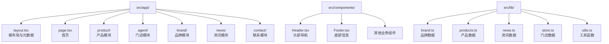
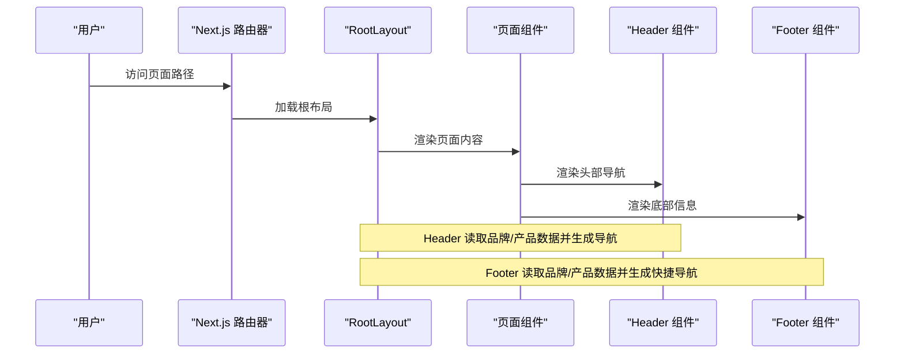
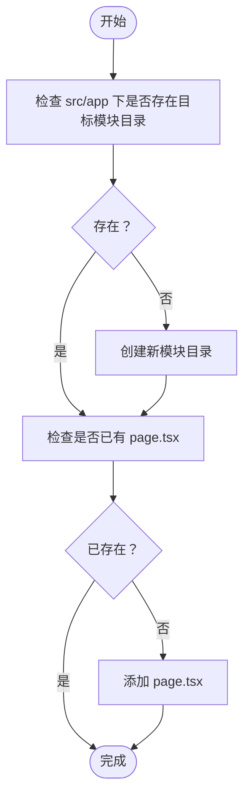
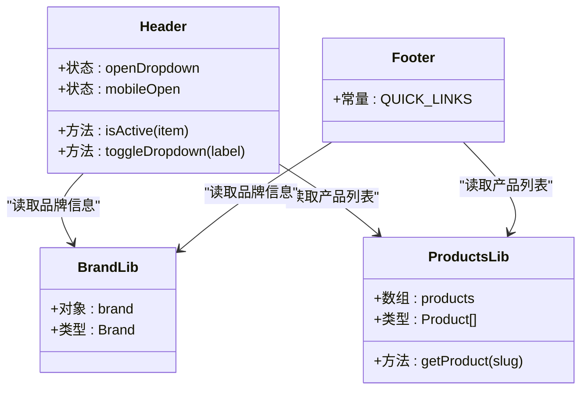
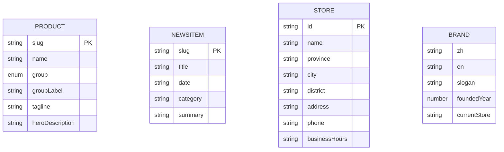
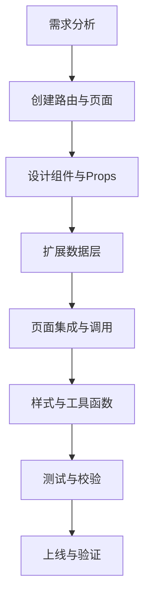
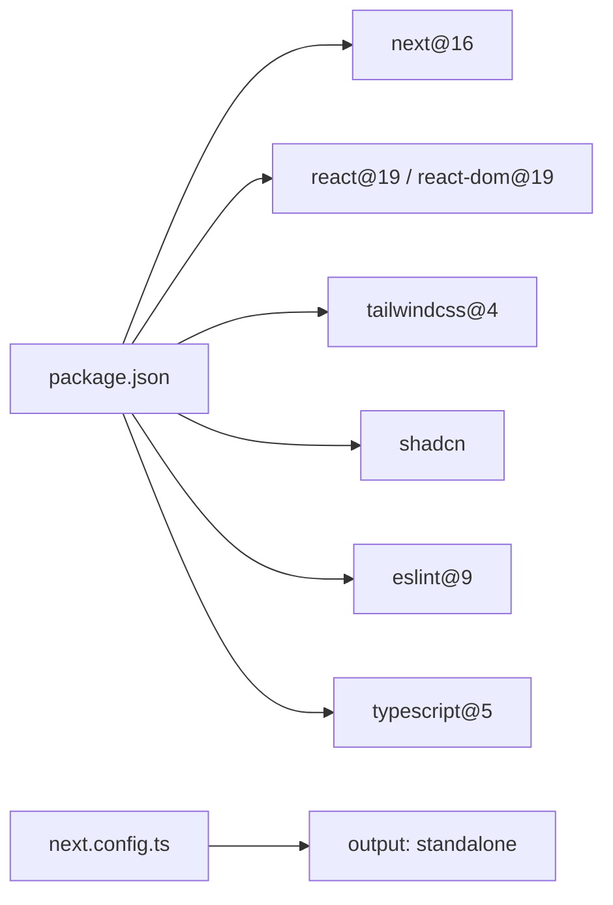

# 新功能开发流程

<cite>
**本文档引用的文件**
- [README.md](file://README.md)
- [package.json](file://package.json)
- [next.config.ts](file://next.config.ts)
- [src/app/layout.tsx](file://src/app/layout.tsx)
- [src/app/page.tsx](file://src/app/page.tsx)
- [src/components/Header.tsx](file://src/components/Header.tsx)
- [src/components/Footer.tsx](file://src/components/Footer.tsx)
- [src/lib/utils.ts](file://src/lib/utils.ts)
- [src/lib/brand.ts](file://src/lib/brand.ts)
- [src/lib/products.ts](file://src/lib/products.ts)
- [src/lib/news.ts](file://src/lib/news.ts)
- [src/lib/store.ts](file://src/lib/store.ts)
</cite>

## 目录
1. [引言](#引言)
2. [项目结构](#项目结构)
3. [核心组件](#核心组件)
4. [架构总览](#架构总览)
5. [详细组件分析](#详细组件分析)
6. [依赖关系分析](#依赖关系分析)
7. [性能考虑](#性能考虑)
8. [故障排除指南](#故障排除指南)
9. [结论](#结论)
10. [附录](#附录)

## 引言
本指南面向需要在现有 Next.js App Router 项目中新增功能的开发者，提供从需求分析到功能上线的完整流程，涵盖页面路由创建、组件设计、数据层扩展的标准步骤。文档基于仓库中的现有实现进行提炼，确保最佳实践与现有代码风格一致。

## 项目结构
该项目采用 Next.js App Router 的目录约定，页面组件位于 src/app 下，按功能模块组织；通用组件位于 src/components；数据与工具逻辑位于 src/lib；全局样式与元数据配置位于根级 app 目录。

图表来源
- [src/app/layout.tsx:1-32](file://src/app/layout.tsx#L1-L32)
- [src/app/page.tsx:1-22](file://src/app/page.tsx#L1-L22)
- [src/components/Header.tsx:1-292](file://src/components/Header.tsx#L1-L292)
- [src/components/Footer.tsx:1-113](file://src/components/Footer.tsx#L1-L113)
- [src/lib/brand.ts:1-28](file://src/lib/brand.ts#L1-L28)
- [src/lib/products.ts:1-282](file://src/lib/products.ts#L1-L282)
- [src/lib/news.ts:1-46](file://src/lib/news.ts#L1-L46)
- [src/lib/store.ts:1-119](file://src/lib/store.ts#L1-L119)

章节来源
- [README.md:110-134](file://README.md#L110-L134)
- [package.json:1-60](file://package.json#L1-L60)

## 核心组件
- 根布局与元数据：负责站点标题、关键词、Open Graph 等元信息，以及全局样式挂载点。
- 首页页面：组合 Header、Hero、WhyChooseUs、CoreServices、ProductsQuickEntry、Footer 等组件。
- 头部导航：支持多级菜单、移动端折叠、路径高亮与点击外侧关闭等交互。
- 底部信息：包含快捷导航、产品中心链接、联系方式等。

章节来源
- [src/app/layout.tsx:1-32](file://src/app/layout.tsx#L1-L32)
- [src/app/page.tsx:1-22](file://src/app/page.tsx#L1-L22)
- [src/components/Header.tsx:1-292](file://src/components/Header.tsx#L1-L292)
- [src/components/Footer.tsx:1-113](file://src/components/Footer.tsx#L1-L113)

## 架构总览
下图展示了从请求到页面渲染的关键路径，以及与数据层的交互：

图表来源
- [src/app/layout.tsx:1-32](file://src/app/layout.tsx#L1-L32)
- [src/app/page.tsx:1-22](file://src/app/page.tsx#L1-L22)
- [src/components/Header.tsx:1-292](file://src/components/Header.tsx#L1-L292)
- [src/components/Footer.tsx:1-113](file://src/components/Footer.tsx#L1-L113)

## 详细组件分析

### 页面路由与动态路由
- 目录约定：App Router 将 src/app 下的目录作为路由层级，例如 /product、/brand、/news 等。
- 动态路由：使用方括号 [param] 表示动态段，如 /agent/[slug]/[city]、/news/[slug]。
- 页面文件：每个路由末尾的 page.tsx 即为该路由的页面组件。

图表来源
- [src/app/agent/[slug]/[city]/page.tsx](file://src/app/agent/[slug]/[city]/page.tsx)
- [src/app/news/[slug]/page.tsx](file://src/app/news/[slug]/page.tsx)

章节来源
- [src/app/agent/[slug]/[city]/page.tsx](file://src/app/agent/[slug]/[city]/page.tsx)
- [src/app/news/[slug]/page.tsx](file://src/app/news/[slug]/page.tsx)

### 组件设计最佳实践
- 组件拆分：遵循单一职责，Header 仅处理导航与高亮，Footer 仅处理信息展示。
- Props 设计：使用明确的类型定义，如 NavItem、NavChild，避免任意类型污染。
- 状态管理：在客户端组件中使用 useState/useEffect 管理本地状态（如移动端菜单开关、下拉菜单开关），避免跨组件共享复杂状态。
- 可访问性：为交互元素提供 aria-* 属性，如 aria-haspopup、aria-expanded、aria-label。
- 一致性：复用品牌与产品数据，保证导航与页脚的一致性。

图表来源
- [src/components/Header.tsx:1-292](file://src/components/Header.tsx#L1-L292)
- [src/components/Footer.tsx:1-113](file://src/components/Footer.tsx#L1-L113)
- [src/lib/brand.ts:1-28](file://src/lib/brand.ts#L1-L28)
- [src/lib/products.ts:1-282](file://src/lib/products.ts#L1-L282)

章节来源
- [src/components/Header.tsx:1-292](file://src/components/Header.tsx#L1-L292)
- [src/components/Footer.tsx:1-113](file://src/components/Footer.tsx#L1-L113)

### 数据层扩展方法
- TypeScript 接口定义：在 src/lib 下新增或扩展类型定义，如 Brand、Product、NewsItem、Store。
- 数据访问层：提供查询函数（如 getProduct、getAllNewsSlugs、getStore），统一数据来源。
- 图片映射：通过映射表将 slug 映射到静态资源路径，便于组件直接引用。

图表来源
- [src/lib/products.ts:1-282](file://src/lib/products.ts#L1-L282)
- [src/lib/news.ts:1-46](file://src/lib/news.ts#L1-L46)
- [src/lib/store.ts:1-119](file://src/lib/store.ts#L1-L119)
- [src/lib/brand.ts:1-28](file://src/lib/brand.ts#L1-L28)

章节来源
- [src/lib/products.ts:1-282](file://src/lib/products.ts#L1-L282)
- [src/lib/news.ts:1-46](file://src/lib/news.ts#L1-L46)
- [src/lib/store.ts:1-119](file://src/lib/store.ts#L1-L119)
- [src/lib/brand.ts:1-28](file://src/lib/brand.ts#L1-L28)

### 新功能开发流程步骤
- 需求分析：明确页面用途、路由层级、数据来源与交互行为。
- 路由创建：在 src/app 下创建模块目录与 page.tsx，必要时使用动态路由 [param]。
- 组件设计：拆分页面为多个子组件，定义清晰的 Props 类型与交互逻辑。
- 数据层扩展：在 src/lib 下新增或扩展类型与查询函数，提供数据访问能力。
- 页面集成：在页面组件中引入 Header、Footer 等通用组件，并调用数据层。
- 样式与工具：使用 cn 工具函数合并类名，确保样式一致性。
- 测试与校验：运行 lint、typecheck、build，确保类型安全与构建通过。
- 上线与验证：启动应用，验证路由、导航、数据展示与交互。

图表来源
- [src/app/layout.tsx:1-32](file://src/app/layout.tsx#L1-L32)
- [src/app/page.tsx:1-22](file://src/app/page.tsx#L1-L22)
- [src/lib/utils.ts:1-7](file://src/lib/utils.ts#L1-L7)

章节来源
- [src/app/layout.tsx:1-32](file://src/app/layout.tsx#L1-L32)
- [src/app/page.tsx:1-22](file://src/app/page.tsx#L1-L22)
- [src/lib/utils.ts:1-7](file://src/lib/utils.ts#L1-L7)

## 依赖关系分析
- 运行时依赖：Next.js 16、React 19、shadcn/ui、Tailwind CSS v4、Lucide React 等。
- 开发依赖：ESLint、TypeScript、TailwindCSS。
- 构建配置：输出模式为 standalone，便于容器化部署。

图表来源
- [package.json:1-60](file://package.json#L1-L60)
- [next.config.ts:1-9](file://next.config.ts#L1-L9)

章节来源
- [package.json:1-60](file://package.json#L1-L60)
- [next.config.ts:1-9](file://next.config.ts#L1-L9)

## 性能考虑
- 构建输出：使用 standalone 输出，减少容器体积与启动时间。
- 样式合并：通过 cn 工具函数合并类名，避免重复样式与冲突。
- 资源加载：图片与视频放置于 public 目录，按需加载，避免阻塞首屏。
- 导航性能：Header 使用 matchPrefix 判断路径高亮，避免不必要的重渲染。
- 代码分割：App Router 自动按路由分割代码，按需加载页面组件。

章节来源
- [next.config.ts:1-9](file://next.config.ts#L1-L9)
- [src/lib/utils.ts:1-7](file://src/lib/utils.ts#L1-L7)
- [src/components/Header.tsx:1-292](file://src/components/Header.tsx#L1-L292)

## 故障排除指南
- 路由不生效：检查 src/app 下目录命名与 page.tsx 是否正确，动态路由参数是否与调用一致。
- 导航高亮异常：确认 Header 中 matchPrefix 与实际路由前缀一致。
- 数据未显示：确认数据层导出的查询函数返回预期值，页面组件正确调用。
- 样式冲突：使用 cn 工具函数合并类名，避免重复覆盖。
- 构建失败：运行 typecheck 与 lint，修复类型错误与规则违规。

章节来源
- [src/components/Header.tsx:1-292](file://src/components/Header.tsx#L1-L292)
- [src/lib/products.ts:1-282](file://src/lib/products.ts#L1-L282)
- [src/lib/news.ts:1-46](file://src/lib/news.ts#L1-L46)
- [src/lib/store.ts:1-119](file://src/lib/store.ts#L1-L119)
- [src/lib/utils.ts:1-7](file://src/lib/utils.ts#L1-L7)

## 结论
通过遵循 App Router 的目录约定、组件拆分与数据层扩展的最佳实践，可以高效地在现有项目中新增功能。配合类型检查、代码规范与构建配置，能够确保功能的质量与可维护性。

## 附录
- 快速参考
  - 创建新路由：在 src/app 下新建目录并添加 page.tsx。
  - 动态路由：使用 [param] 定义动态段。
  - 组件类型：在 src/components 下创建类型明确的组件。
  - 数据访问：在 src/lib 下新增类型与查询函数。
  - 样式工具：使用 cn 合并类名，保持一致性。
  - 校验命令：npm run check（lint + typecheck + build）。

章节来源
- [README.md:136-144](file://README.md#L136-L144)
- [src/lib/utils.ts:1-7](file://src/lib/utils.ts#L1-L7)