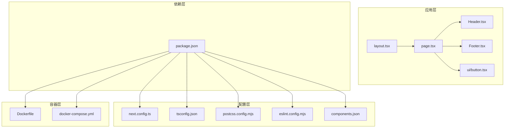
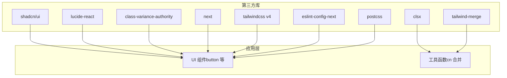
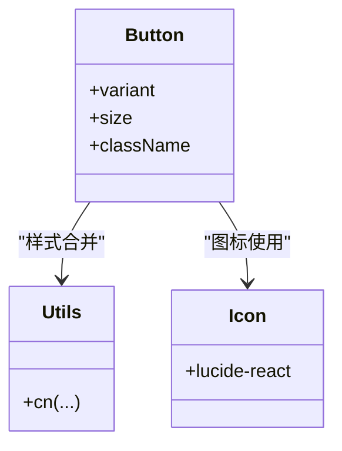
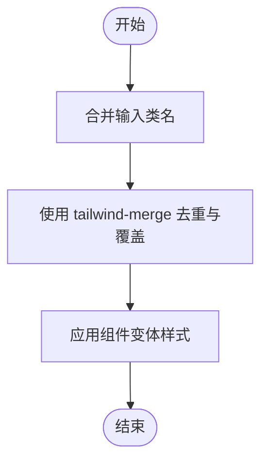
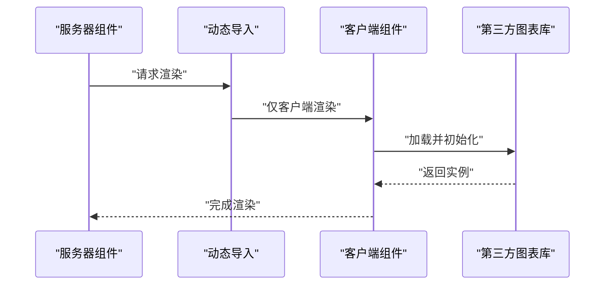
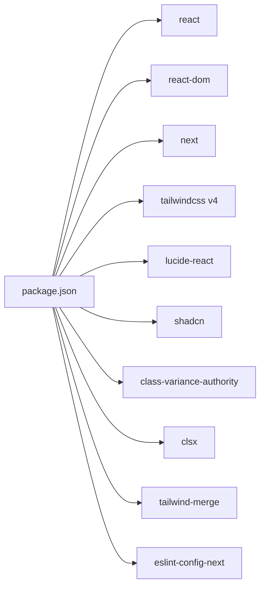
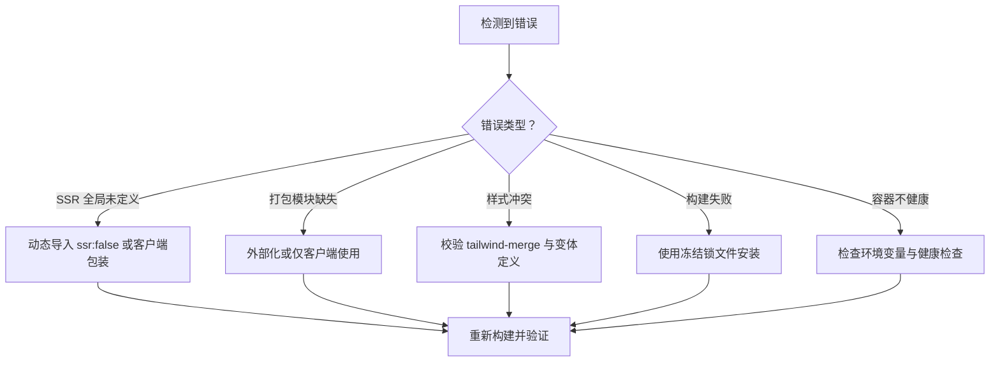

# 第三方库集成

<cite>
**本文引用的文件**
- [package.json](file://package.json)
- [next.config.ts](file://next.config.ts)
- [components.json](file://components.json)
- [tsconfig.json](file://tsconfig.json)
- [eslint.config.mjs](file://eslint.config.mjs)
- [postcss.config.mjs](file://postcss.config.mjs)
- [Dockerfile](file://Dockerfile)
- [docker-compose.yml](file://docker-compose.yml)
- [src/app/layout.tsx](file://src/app/layout.tsx)
- [src/app/page.tsx](file://src/app/page.tsx)
- [src/components/ui/button.tsx](file://src/components/ui/button.tsx)
- [src/lib/utils.ts](file://src/lib/utils.ts)
- [src/components/Header.tsx](file://src/components/Header.tsx)
- [src/components/Footer.tsx](file://src/components/Footer.tsx)
- [.claude/skills/next-best-practices/bundling.md](file://.claude/skills/next-best-practices/bundling.md)
</cite>

## 目录
1. [引言](#引言)
2. [项目结构](#项目结构)
3. [核心组件](#核心组件)
4. [架构总览](#架构总览)
5. [详细组件分析](#详细组件分析)
6. [依赖关系分析](#依赖关系分析)
7. [性能考量](#性能考量)
8. [故障排查指南](#故障排查指南)
9. [结论](#结论)
10. [附录](#附录)

## 引言
本指南面向在现有 Next.js 项目中集成第三方库的工程实践，结合仓库中的实际配置与组件，系统讲解第三方库的评估标准、安装与配置流程、UI 组件库与工具库的集成策略、版本管理与冲突处理、性能影响评估、配置文件与构建系统的适配，以及可复用的集成示例（图表库、富文本编辑器、地图服务）。同时提供集成后的测试验证与文档更新流程建议。

## 项目结构
该项目采用 Next.js 16 应用，使用 Tailwind CSS v4 与 shadcn/ui 基础组件体系，TypeScript 类型检查，ESLint 核心规则，PostCSS 处理样式，Docker 化部署。关键目录与文件如下：
- 应用入口与页面：src/app
- 组件层：src/components
- 工具与通用函数：src/lib
- 构建与运行配置：next.config.ts、tsconfig.json、postcss.config.mjs、eslint.config.mjs
- UI 组件基线：components.json（定义 tailwind、别名、图标库等）
- 依赖与脚本：package.json
- 容器化：Dockerfile、docker-compose.yml

**图示来源**
- [src/app/layout.tsx:1-39](file://src/app/layout.tsx#L1-L39)
- [src/app/page.tsx:1-22](file://src/app/page.tsx#L1-L22)
- [src/components/Header.tsx:1-292](file://src/components/Header.tsx#L1-L292)
- [src/components/Footer.tsx:1-113](file://src/components/Footer.tsx#L1-L113)
- [src/components/ui/button.tsx:1-61](file://src/components/ui/button.tsx#L1-L61)
- [next.config.ts:1-14](file://next.config.ts#L1-L14)
- [tsconfig.json:1-35](file://tsconfig.json#L1-L35)
- [postcss.config.mjs:1-8](file://postcss.config.mjs#L1-L8)
- [eslint.config.mjs:1-19](file://eslint.config.mjs#L1-L19)
- [components.json:1-26](file://components.json#L1-L26)
- [package.json:1-60](file://package.json#L1-L60)
- [Dockerfile:1-114](file://Dockerfile#L1-L114)
- [docker-compose.yml:1-54](file://docker-compose.yml#L1-L54)

**章节来源**
- [package.json:1-60](file://package.json#L1-L60)
- [next.config.ts:1-14](file://next.config.ts#L1-L14)
- [components.json:1-26](file://components.json#L1-L26)
- [tsconfig.json:1-35](file://tsconfig.json#L1-L35)
- [eslint.config.mjs:1-19](file://eslint.config.mjs#L1-L19)
- [postcss.config.mjs:1-8](file://postcss.config.mjs#L1-L8)
- [Dockerfile:1-114](file://Dockerfile#L1-L114)
- [docker-compose.yml:1-54](file://docker-compose.yml#L1-L54)

## 核心组件
- UI 组件基线与变体系统：通过 class-variance-authority 与 tailwind-merge 实现一致的样式组合与合并逻辑，组件按需引入与复用。
- 图标库：lucide-react 提供统一图标资源，配合 UI 组件使用。
- 构建与运行：Next.js 16 的 standalone 输出模式，Tailwind v4 PostCSS 插件，TypeScript 严格模式，ESLint Next 核心规则。
- 容器化：多阶段构建，支持 npm/yarn/pnpm 锁定文件，生产镜像基于 standalone 运行。

**章节来源**
- [src/components/ui/button.tsx:1-61](file://src/components/ui/button.tsx#L1-L61)
- [src/lib/utils.ts:1-7](file://src/lib/utils.ts#L1-L7)
- [package.json:37-58](file://package.json#L37-L58)
- [next.config.ts:3-11](file://next.config.ts#L3-L11)
- [postcss.config.mjs:1-8](file://postcss.config.mjs#L1-L8)
- [tsconfig.json:21-23](file://tsconfig.json#L21-L23)
- [Dockerfile:12-32](file://Dockerfile#L12-L32)

## 架构总览
下图展示第三方库在项目中的集成位置与交互关系：UI 组件库（shadcn/ui）与图标库（lucide-react）作为基础层；工具库（clsx、tailwind-merge、class-variance-authority）提供样式与变体能力；构建与运行时（Next.js、Tailwind v4、ESLint、PostCSS）负责打包与质量控制；容器化（Docker）负责交付与运行。

**图示来源**
- [package.json:37-58](file://package.json#L37-L58)
- [src/components/ui/button.tsx:1-61](file://src/components/ui/button.tsx#L1-L61)
- [src/lib/utils.ts:1-7](file://src/lib/utils.ts#L1-L7)
- [postcss.config.mjs:1-8](file://postcss.config.mjs#L1-L8)
- [eslint.config.mjs:1-19](file://eslint.config.mjs#L1-L19)

## 详细组件分析

### UI 组件库集成（shadcn/ui + lucide-react）
- 集成方式：通过 components.json 定义 tailwind、别名、图标库等，确保组件路径与样式配置一致。
- 使用模式：在组件中按需导入基础 UI 组件与图标，利用变体系统与样式合并函数实现一致风格。
- 依赖关系：UI 组件依赖 class-variance-authority 与 tailwind-merge，图标依赖 lucide-react。

**图示来源**
- [src/components/ui/button.tsx:1-61](file://src/components/ui/button.tsx#L1-L61)
- [src/lib/utils.ts:1-7](file://src/lib/utils.ts#L1-L7)
- [components.json:6-21](file://components.json#L6-L21)

**章节来源**
- [components.json:1-26](file://components.json#L1-L26)
- [src/components/ui/button.tsx:1-61](file://src/components/ui/button.tsx#L1-L61)
- [src/lib/utils.ts:1-7](file://src/lib/utils.ts#L1-L7)

### 工具库集成（clsx、tailwind-merge、class-variance-authority）
- clsx：条件类名合并，避免重复与冲突。
- tailwind-merge：同名 Tailwind 类覆盖合并，保证最终样式正确性。
- class-variance-authority：组件变体系统，集中管理不同状态下的样式集合。

**图示来源**
- [src/lib/utils.ts:1-7](file://src/lib/utils.ts#L1-L7)
- [src/components/ui/button.tsx:8-43](file://src/components/ui/button.tsx#L8-L43)

**章节来源**
- [src/lib/utils.ts:1-7](file://src/lib/utils.ts#L1-L7)
- [src/components/ui/button.tsx:1-61](file://src/components/ui/button.tsx#L1-L61)

### API 客户端与服务端兼容性（以图表库为例）
- 兼容性问题：某些图表库依赖浏览器全局对象（如 window），在服务器组件中会报错。
- 解决策略：
  - 将第三方包标记为仅客户端渲染（动态导入 ssr: false）。
  - 对于需要服务端运行但打包有问题的包，可考虑外部化或客户端包装组件。
- 参考最佳实践：针对“window/document/localStorage”未定义、模块找不到等错误的处理方法。

**图示来源**
- [.claude/skills/next-best-practices/bundling.md:18-78](file://.claude/skills/next-best-practices/bundling.md#L18-L78)

**章节来源**
- [.claude/skills/next-best-practices/bundling.md:1-78](file://.claude/skills/next-best-practices/bundling.md#L1-L78)

### 富文本编辑器集成（概念性方案）
- 评估标准：功能完整性、体积与性能、主题与可定制性、SSR 兼容性、社区活跃度与维护周期。
- 安装与配置：选择合适的包管理器锁定文件，安装依赖并在客户端组件中按需加载。
- SSR 兼容性：若编辑器依赖浏览器 API，采用动态导入或客户端包装组件。
- 性能影响：关注首屏加载体积，必要时拆分代码与懒加载。
- 测试验证：单元测试、快照测试、端到端测试覆盖编辑器交互与渲染稳定性。

[本节为概念性内容，不直接分析具体文件，故无“章节来源”]

### 地图服务集成（概念性方案）
- 评估标准：API 可靠性、离线缓存策略、按需加载与体积、隐私与合规要求。
- 安装与配置：根据官方 SDK 文档安装并配置密钥与域名白名单。
- SSR 兼容性：仅在客户端渲染，避免在服务端发起网络请求。
- 性能影响：启用懒加载与预取策略，减少对首屏的影响。
- 测试验证：模拟地图初始化、交互事件与错误边界，确保异常场景稳定降级。

[本节为概念性内容，不直接分析具体文件，故无“章节来源”]

## 依赖关系分析
- 依赖来源：package.json 中的 dependencies 与 devDependencies。
- 关键依赖：next、react、react-dom、tailwindcss v4、lucide-react、shadcn、class-variance-authority、clsx、tailwind-merge、eslint-config-next。
- 版本管理：优先使用锁定文件（package-lock.json/yarn/pnpm）确保可重现构建。
- 冲突处理：当出现重复或冲突包时，优先保留项目已有的统一依赖版本，必要时通过 peerDependencies 或别名策略解决。

**图示来源**
- [package.json:37-58](file://package.json#L37-L58)

**章节来源**
- [package.json:1-60](file://package.json#L1-L60)

## 性能考量
- 构建输出：Next.js 使用 standalone 输出，减少运行时依赖，提升启动速度与镜像体积可控性。
- 图片优化：next.config.ts 中配置图片格式与缓存策略，降低带宽与存储成本。
- 样式体积：Tailwind v4 与 PostCSS 结合，按需生成样式，避免全局污染。
- 依赖体积：优先选择轻量级替代品，按需加载第三方库，避免一次性引入重型包。
- 容器化优化：多阶段构建与缓存层，缩短构建时间并减小最终镜像体积。

**章节来源**
- [next.config.ts:3-11](file://next.config.ts#L3-L11)
- [postcss.config.mjs:1-8](file://postcss.config.mjs#L1-L8)
- [Dockerfile:21-32](file://Dockerfile#L21-L32)

## 故障排查指南
- SSR 报错（window/document/localStorage 未定义）：采用动态导入 ssr: false 或客户端包装组件。
- 打包失败（模块找不到）：确认是否应外部化或仅在客户端使用。
- 样式冲突：检查 tailwind-merge 是否正确合并类名，确认组件变体定义是否一致。
- 构建失败（无锁定文件）：确保使用 npm ci/yarn/pnpm 的冻结锁文件模式进行安装。
- 容器健康检查失败：检查环境变量、端口映射与健康检查脚本。

**图示来源**
- [.claude/skills/next-best-practices/bundling.md:9-78](file://.claude/skills/next-best-practices/bundling.md#L9-L78)
- [Dockerfile:21-32](file://Dockerfile#L21-L32)
- [docker-compose.yml:20-25](file://docker-compose.yml#L20-L25)

**章节来源**
- [.claude/skills/next-best-practices/bundling.md:1-78](file://.claude/skills/next-best-practices/bundling.md#L1-L78)
- [Dockerfile:1-114](file://Dockerfile#L1-L114)
- [docker-compose.yml:1-54](file://docker-compose.yml#L1-L54)

## 结论
本项目提供了清晰的第三方库集成基线：以 shadcn/ui 与 lucide-react 为基础 UI 体系，借助 class-variance-authority、clsx 与 tailwind-merge 实现一致且高性能的样式管理；通过 Next.js 16、Tailwind v4、ESLint 与 PostCSS 构建高质量前端产物；通过 Docker 多阶段构建实现可复现与高效的交付。对于图表库、富文本编辑器与地图服务等第三方库，应遵循 SSR 兼容性、按需加载与体积控制的原则，并配套完善的测试与文档更新流程。

## 附录
- 集成流程清单
  - 评估：功能、体积、兼容性、维护状况
  - 安装：锁定文件模式安装，避免重复依赖
  - 配置：调整 next.config.ts、tsconfig.json、components.json、postcss.config.mjs
  - 适配：按需动态导入、客户端包装、外部化策略
  - 测试：本地开发验证、端到端测试、性能回归
  - 文档：更新 README/设计文档，记录版本与变更

[本节为通用流程说明，不直接分析具体文件，故无“章节来源”]