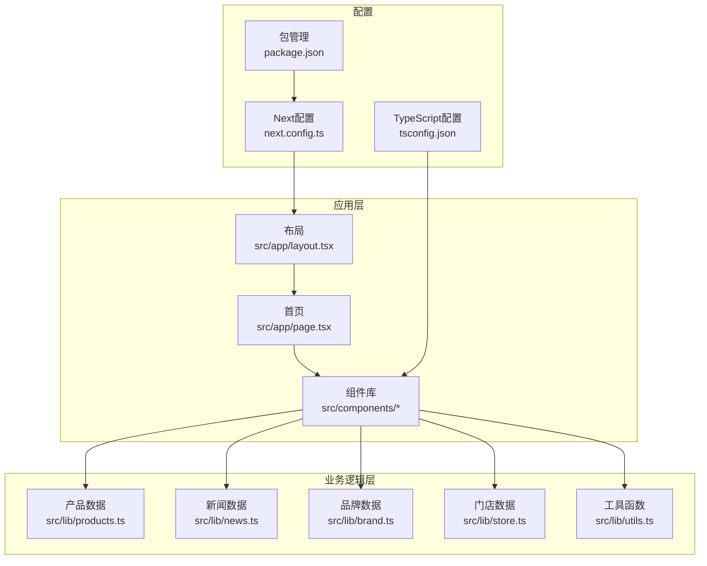
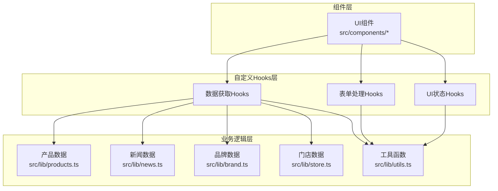
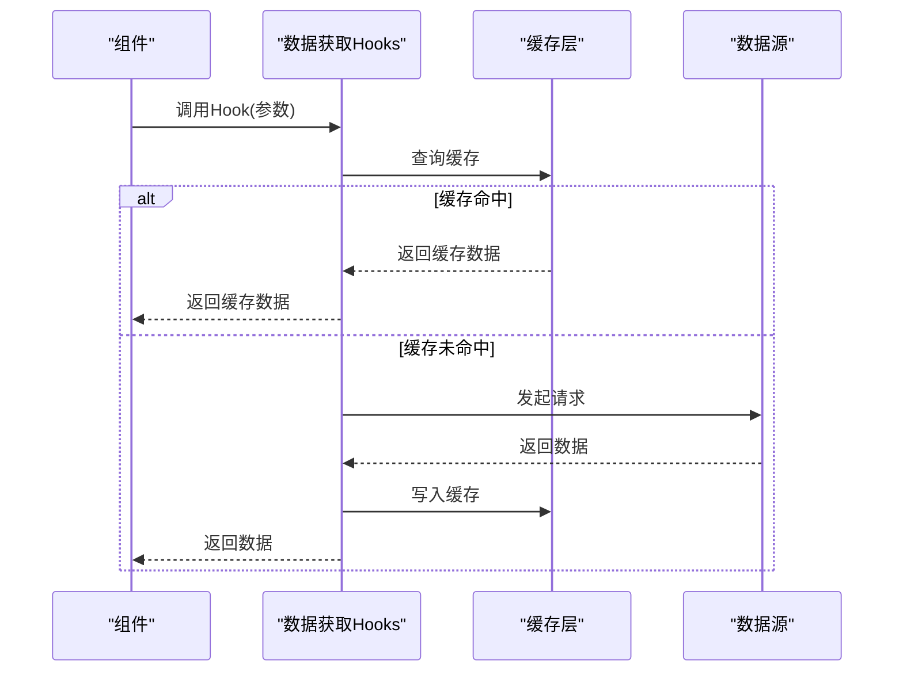
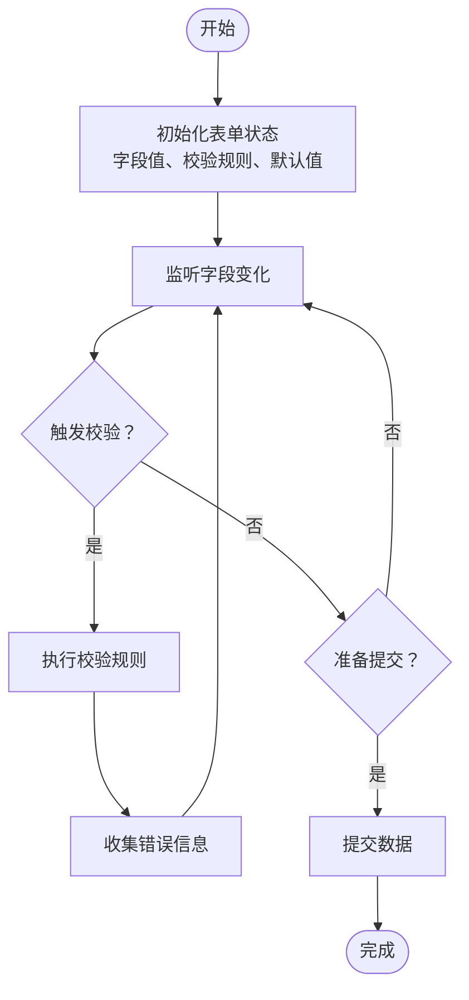
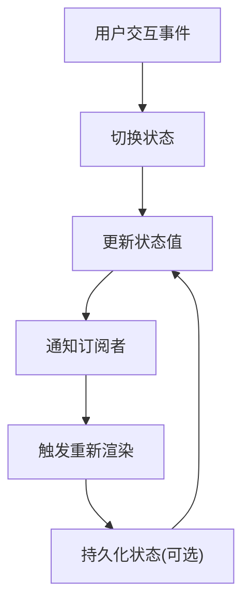
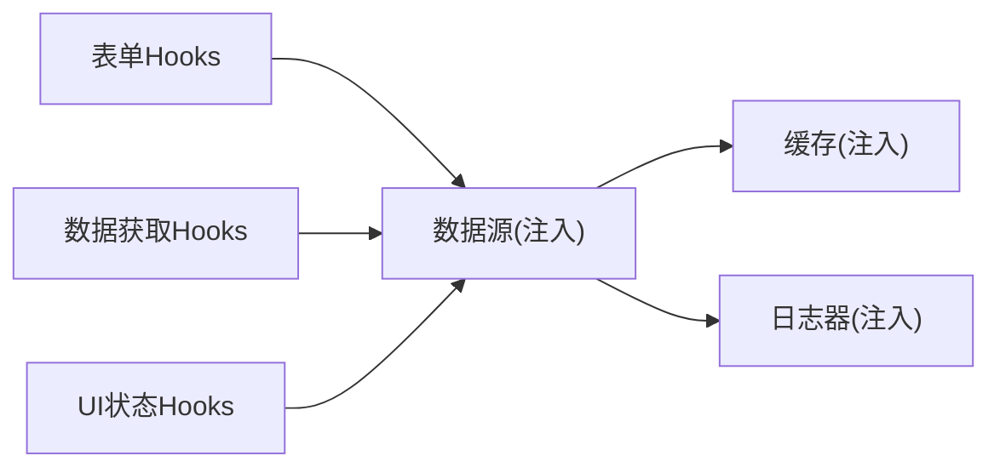
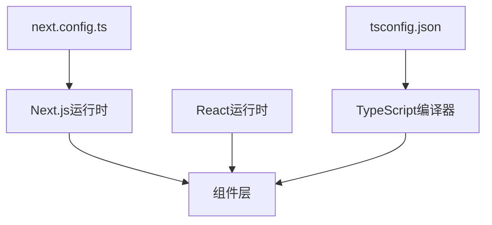

# 自定义Hooks开发

<cite>
**本文档引用的文件**
- [README.md](file://README.md)
- [package.json](file://package.json)
- [next.config.ts](file://next.config.ts)
- [tsconfig.json](file://tsconfig.json)
- [src/app/layout.tsx](file://src/app/layout.tsx)
- [src/app/page.tsx](file://src/app/page.tsx)
- [src/components/ui/button.tsx](file://src/components/ui/button.tsx)
- [src/components/Hero.tsx](file://src/components/Hero.tsx)
- [src/components/Footer.tsx](file://src/components/Footer.tsx)
- [src/components/Header.tsx](file://src/components/Header.tsx)
- [src/lib/products.ts](file://src/lib/products.ts)
- [src/lib/news.ts](file://src/lib/news.ts)
- [src/lib/brand.ts](file://src/lib/brand.ts)
- [src/lib/store.ts](file://src/lib/store.ts)
- [src/lib/utils.ts](file://src/lib/utils.ts)
</cite>

## 目录
1. [简介](#简介)
2. [项目结构](#项目结构)
3. [核心组件](#核心组件)
4. [架构概览](#架构概览)
5. [详细组件分析](#详细组件分析)
6. [依赖分析](#依赖分析)
7. [性能考虑](#性能考虑)
8. [故障排除指南](#故障排除指南)
9. [结论](#结论)
10. [附录](#附录)

## 简介
本指南面向希望在Next.js应用中开发高质量自定义Hooks的开发者，系统讲解设计原则、复用机制、状态管理、副作用处理与性能优化。文档结合项目实际，提供数据获取Hooks、表单处理Hooks、UI状态Hooks的开发模式，以及Hooks组合使用与依赖注入方法。同时涵盖异步数据处理、缓存策略、错误处理的实现方案，并给出产品数据获取、品牌信息管理、新闻列表处理等实际示例的开发思路与测试调试建议。

## 项目结构
该项目采用Next.js App Router架构，采用按功能分层的目录组织方式：
- src/app：页面路由与布局
- src/components：可复用UI组件
- src/lib：业务逻辑与数据访问层
- src/hooks：自定义Hooks（当前为空，后续可在此添加）
- public：静态资源
- 配置文件：next.config.ts、tsconfig.json、package.json等

**图表来源**
- [src/app/layout.tsx](file://src/app/layout.tsx)
- [src/app/page.tsx](file://src/app/page.tsx)
- [src/components/Hero.tsx](file://src/components/Hero.tsx)
- [src/components/Footer.tsx](file://src/components/Footer.tsx)
- [src/components/Header.tsx](file://src/components/Header.tsx)
- [src/lib/products.ts](file://src/lib/products.ts)
- [src/lib/news.ts](file://src/lib/news.ts)
- [src/lib/brand.ts](file://src/lib/brand.ts)
- [src/lib/store.ts](file://src/lib/store.ts)
- [src/lib/utils.ts](file://src/lib/utils.ts)
- [next.config.ts](file://next.config.ts)
- [tsconfig.json](file://tsconfig.json)
- [package.json](file://package.json)

**章节来源**
- [README.md](file://README.md)
- [next.config.ts](file://next.config.ts)
- [tsconfig.json](file://tsconfig.json)
- [package.json](file://package.json)

## 核心组件
- 布局与页面：App Router的根布局与首页作为入口，负责全局样式与页面级数据加载。
- 组件库：包含Hero、Header、Footer等可复用UI组件，为自定义Hooks提供使用场景。
- 业务逻辑库：products、news、brand、store、utils等模块封装数据获取与处理逻辑，为Hooks提供数据源。

**章节来源**
- [src/app/layout.tsx](file://src/app/layout.tsx)
- [src/app/page.tsx](file://src/app/page.tsx)
- [src/components/Hero.tsx](file://src/components/Hero.tsx)
- [src/components/Footer.tsx](file://src/components/Footer.tsx)
- [src/components/Header.tsx](file://src/components/Header.tsx)
- [src/lib/products.ts](file://src/lib/products.ts)
- [src/lib/news.ts](file://src/lib/news.ts)
- [src/lib/brand.ts](file://src/lib/brand.ts)
- [src/lib/store.ts](file://src/lib/store.ts)
- [src/lib/utils.ts](file://src/lib/utils.ts)

## 架构概览
自定义Hooks应遵循以下架构原则：
- 单一职责：每个Hook专注于一个明确的功能域（如数据获取、表单状态、UI状态）。
- 可组合性：多个Hook可以组合使用，通过依赖注入或参数传递共享状态。
- 可测试性：通过抽象依赖（如数据源接口）实现易于测试的结构。
- 性能优化：避免不必要的重渲染，合理使用缓存与去抖节流。

**图表来源**
- [src/lib/products.ts](file://src/lib/products.ts)
- [src/lib/news.ts](file://src/lib/news.ts)
- [src/lib/brand.ts](file://src/lib/brand.ts)
- [src/lib/store.ts](file://src/lib/store.ts)
- [src/lib/utils.ts](file://src/lib/utils.ts)
- [src/components/Hero.tsx](file://src/components/Hero.tsx)
- [src/components/Footer.tsx](file://src/components/Footer.tsx)
- [src/components/Header.tsx](file://src/components/Header.tsx)

## 详细组件分析

### 数据获取Hooks开发模式
目标：构建可复用的数据获取Hooks，支持异步加载、缓存、错误处理与重试。

**图表来源**
- [src/lib/products.ts](file://src/lib/products.ts)
- [src/lib/news.ts](file://src/lib/news.ts)
- [src/lib/brand.ts](file://src/lib/brand.ts)
- [src/lib/store.ts](file://src/lib/store.ts)

开发要点
- 参数化：通过输入参数（如查询条件、分页、过滤器）控制缓存键，确保不同参数对应不同缓存条目。
- 错误处理：统一捕获网络错误与业务错误，返回标准化错误对象，避免组件内重复处理。
- 并发控制：避免同一请求重复发起，可通过请求去重或队列化处理。
- 缓存策略：支持内存缓存、持久化缓存（localStorage/sessionStorage），并设置过期时间。
- 重试机制：对临时性错误进行指数退避重试，限制最大重试次数。
- SSR/CSR兼容：在服务端仅读取缓存，客户端负责实时更新与交互。

**章节来源**
- [src/lib/products.ts](file://src/lib/products.ts)
- [src/lib/news.ts](file://src/lib/news.ts)
- [src/lib/brand.ts](file://src/lib/brand.ts)
- [src/lib/store.ts](file://src/lib/store.ts)

### 表单处理Hooks开发模式
目标：封装表单状态、验证、提交流程，提升表单组件的可复用性与一致性。

**图表来源**
- [src/lib/utils.ts](file://src/lib/utils.ts)

开发要点
- 字段状态：集中管理字段值、是否已触发表单、聚焦状态等。
- 校验规则：支持同步与异步校验，返回统一格式的错误对象；支持链式校验与条件校验。
- 提交流程：封装提交前准备、提交中状态、提交后处理与错误回滚。
- 性能优化：使用浅比较避免不必要重渲染；对昂贵校验进行防抖。
- 与数据获取Hooks组合：在提交成功后调用数据获取Hooks刷新列表或详情。

**章节来源**
- [src/lib/utils.ts](file://src/lib/utils.ts)

### UI状态Hooks开发模式
目标：封装UI交互状态（如模态框、侧边栏、加载状态、分页状态等），提升组件解耦与复用。

**图表来源**
- [src/components/Hero.tsx](file://src/components/Hero.tsx)
- [src/components/Header.tsx](file://src/components/Header.tsx)
- [src/components/Footer.tsx](file://src/components/Footer.tsx)

开发要点
- 状态隔离：每个UI状态Hooks只管理自身状态，避免跨状态耦合。
- 默认值与受控：支持受控与非受控两种模式，便于在不同场景下灵活使用。
- 持久化：对需要跨会话保持的状态进行本地存储，注意序列化与反序列化。
- 事件总线：通过回调或订阅机制向父组件传递状态变更，保持单向数据流。

**章节来源**
- [src/components/Hero.tsx](file://src/components/Hero.tsx)
- [src/components/Header.tsx](file://src/components/Header.tsx)
- [src/components/Footer.tsx](file://src/components/Footer.tsx)

### Hooks组合使用与依赖注入
- 组合策略：将数据获取Hooks与表单Hooks组合，形成“数据驱动的表单”；将UI状态Hooks与数据获取Hooks组合，实现“加载-空态-错误-内容”的完整流程。
- 依赖注入：通过参数或上下文（Context）注入数据源、缓存实例、日志器等，便于测试与替换实现。
- 参数传递：将通用配置（如缓存键前缀、超时时间、重试策略）以参数形式传入，提高灵活性。

**图表来源**
- [src/lib/products.ts](file://src/lib/products.ts)
- [src/lib/news.ts](file://src/lib/news.ts)
- [src/lib/brand.ts](file://src/lib/brand.ts)
- [src/lib/store.ts](file://src/lib/store.ts)
- [src/lib/utils.ts](file://src/lib/utils.ts)

**章节来源**
- [src/lib/products.ts](file://src/lib/products.ts)
- [src/lib/news.ts](file://src/lib/news.ts)
- [src/lib/brand.ts](file://src/lib/brand.ts)
- [src/lib/store.ts](file://src/lib/store.ts)
- [src/lib/utils.ts](file://src/lib/utils.ts)

### 实际Hooks开发示例

#### 产品数据获取Hooks
- 功能：根据分类、品牌、价格区间等筛选条件获取产品列表，支持分页与排序。
- 设计：以参数为缓存键，封装请求、缓存、错误与重试；提供刷新、加载更多等操作。
- 使用：在产品列表页与产品筛选组件中复用。

**章节来源**
- [src/lib/products.ts](file://src/lib/products.ts)

#### 品牌信息管理Hooks
- 功能：获取品牌详情、品牌下的产品列表、品牌历史与证书展示。
- 设计：品牌详情与子数据分离加载，避免阻塞主流程；提供品牌切换后的数据预热。
- 使用：在品牌详情页与品牌历史页中复用。

**章节来源**
- [src/lib/brand.ts](file://src/lib/brand.ts)

#### 新闻列表处理Hooks
- 功能：获取新闻列表、详情、相关文章；支持按分类筛选与分页。
- 设计：新闻详情独立缓存，列表与详情共享基础数据；提供“加载更多”与“刷新”能力。
- 使用：在新闻列表页与新闻详情页中复用。

**章节来源**
- [src/lib/news.ts](file://src/lib/news.ts)

## 依赖分析
- 外部依赖：Next.js、React、TypeScript等运行时与编译时依赖。
- 内部依赖：组件依赖业务逻辑库；业务逻辑库之间无循环依赖，遵循单向数据流。
- 配置依赖：next.config.ts、tsconfig.json影响构建行为与类型检查。

**图表来源**
- [next.config.ts](file://next.config.ts)
- [tsconfig.json](file://tsconfig.json)
- [package.json](file://package.json)

**章节来源**
- [next.config.ts](file://next.config.ts)
- [tsconfig.json](file://tsconfig.json)
- [package.json](file://package.json)

## 性能考虑
- 渲染优化：使用React.memo、useMemo、useCallback减少不必要渲染；避免在渲染期间进行昂贵计算。
- 数据获取：优先使用服务端组件直接获取数据，减少客户端请求；对客户端请求进行并发控制与去重。
- 缓存策略：合理设置缓存过期时间，区分强缓存与弱缓存；对用户敏感数据禁用缓存或缩短过期时间。
- 异步处理：对高频事件（如滚动、输入）使用防抖/节流；对长任务使用分片或Web Worker。
- 资源加载：图片懒加载、骨架屏、骨架屏占位符；关键路径CSS内联，非关键CSS延迟加载。

## 故障排除指南
- Hydration错误：确保客户端组件在挂载后才访问浏览器API；对日期时间渲染进行客户端处理；避免随机ID与无效HTML嵌套。
- Suspense边界：在使用useSearchParams、usePathname等可能触发CSR回退的钩子时，确保在静态路由中包裹Suspense。
- 数据水龙头：避免串行多次请求，使用并行加载或合并请求；对依赖关系明确的数据使用顺序加载。
- Server Actions与Route Handlers：内部读取使用服务端组件，外部API使用Route Handlers；变更后及时清理缓存或失效标签。

**章节来源**
- [README.md](file://README.md)

## 结论
通过将数据获取、表单处理与UI状态抽象为可复用的自定义Hooks，并结合依赖注入与组合使用，可以显著提升代码的可维护性与可测试性。配合合理的缓存策略、错误处理与性能优化手段，能够构建高性能、高可用的前端数据流。建议在项目中逐步引入Hooks，先从高频使用的场景开始，持续完善测试与文档。

## 附录
- 测试建议：为每个Hooks编写单元测试，覆盖正常流程、错误分支与边界条件；对依赖注入点进行Mock；对异步逻辑使用FakeTimers。
- 调试技巧：利用React DevTools Profiler观察渲染性能；在开发环境开启严格模式与类型检查；对缓存与请求进行日志记录以便追踪问题。