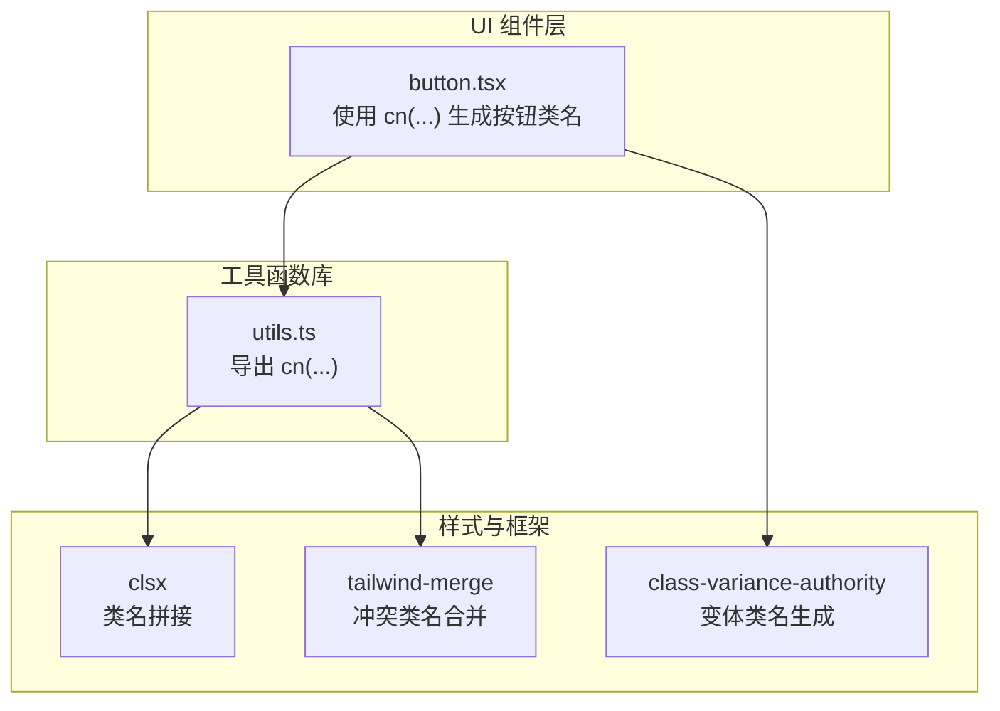
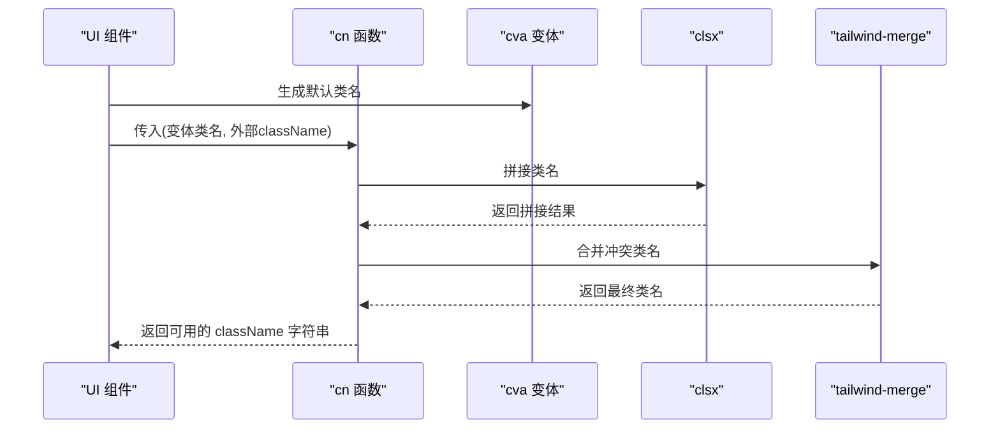
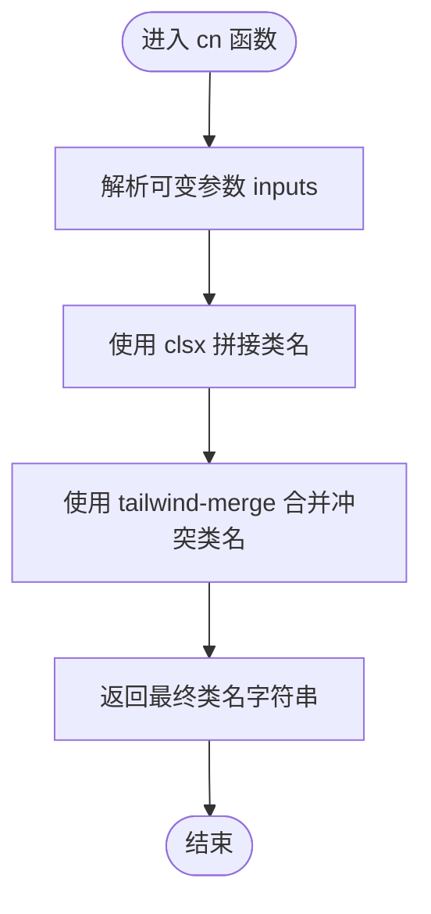
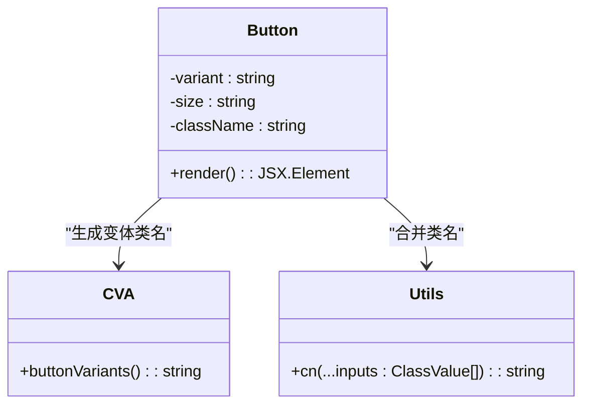
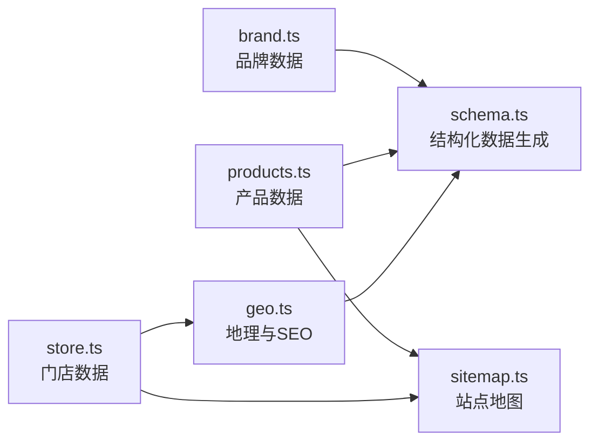
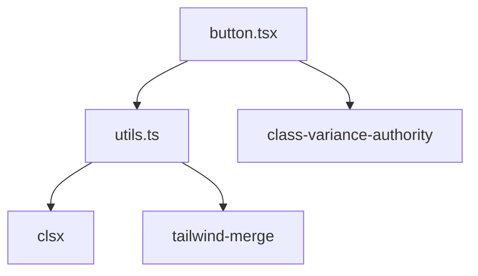

# 工具函数库

<cite>
**本文档引用的文件**
- [src/lib/utils.ts](file://src/lib/utils.ts)
- [src/components/ui/button.tsx](file://src/components/ui/button.tsx)
- [src/lib/brand.ts](file://src/lib/brand.ts)
- [src/lib/products.ts](file://src/lib/products.ts)
- [src/lib/store.ts](file://src/lib/store.ts)
- [src/lib/geo.ts](file://src/lib/geo.ts)
- [src/lib/schema.ts](file://src/lib/schema.ts)
- [src/app/sitemap.ts](file://src/app/sitemap.ts)
- [package.json](file://package.json)
</cite>

## 目录
1. [简介](#简介)
2. [项目结构](#项目结构)
3. [核心组件](#核心组件)
4. [架构总览](#架构总览)
5. [详细组件分析](#详细组件分析)
6. [依赖分析](#依赖分析)
7. [性能考量](#性能考量)
8. [故障排查指南](#故障排查指南)
9. [结论](#结论)
10. [附录](#附录)

## 简介
本文件聚焦于蓝辉轻改网站的工具函数库，系统梳理并深入解析 src/lib/utils.ts 中的通用工具函数设计思路与实现细节。尽管当前仓库中 utils.ts 仅包含一个用于类名合并的工具函数，本文仍基于现有代码与项目上下文，提供完整的使用指南、性能特性、扩展建议与质量保障措施，帮助开发者在不改变既有约定的前提下，安全地扩展新的工具函数。

## 项目结构
工具函数库位于 src/lib/utils.ts，主要提供类名合并能力；其典型使用场景是在 UI 组件中通过 cva 生成变体类名并进行合并，确保 Tailwind CSS 与 class-variance-authority 的组合使用效果最佳。

**图表来源**
- [src/lib/utils.ts:1-6](file://src/lib/utils.ts#L1-L6)
- [src/components/ui/button.tsx:6](file://src/components/ui/button.tsx#L6)

**章节来源**
- [src/lib/utils.ts:1-6](file://src/lib/utils.ts#L1-L6)
- [src/components/ui/button.tsx:6](file://src/components/ui/button.tsx#L6)

## 核心组件
- cn(...inputs: ClassValue[]): 将传入的类名输入经由 clsx 拼接后，再通过 tailwind-merge 合并冲突类名，最终返回可用于 React 组件 className 的字符串。该函数是项目中类名管理的核心入口，确保 cva 变体与外部传入类名不会产生冲突。

使用场景
- 在 UI 组件中将 cva 生成的默认类名与外部传入的 className 进行合并，避免 Tailwind 冲突类名导致的样式覆盖问题。
- 在需要动态拼接条件类名时，统一使用该函数以保证一致性。

参数与返回值
- 参数：可变数量的 ClassValue 类型输入，支持字符串、对象、数组等。
- 返回值：string，可用于 React 组件 className 的最终类名字符串。

异常处理
- 该函数内部调用第三方库，若传入非法类型，可能触发运行时错误。建议在调用前确保传入合法的类名值。

**章节来源**
- [src/lib/utils.ts:4-6](file://src/lib/utils.ts#L4-L6)
- [src/components/ui/button.tsx:54](file://src/components/ui/button.tsx#L54)

## 架构总览
工具函数库与 UI 层、样式框架之间的交互关系如下：

**图表来源**
- [src/lib/utils.ts:4-6](file://src/lib/utils.ts#L4-L6)
- [src/components/ui/button.tsx:54](file://src/components/ui/button.tsx#L54)

## 详细组件分析

### 类名合并工具函数 cn(...)
- 设计目标：解决 Tailwind CSS 与 class-variance-authority 在同一元素上应用多个类名时可能出现的冲突问题，确保最终渲染的类名既包含所有必要的样式，又不会因重复或冲突而产生意外效果。
- 实现要点：
  - 使用 clsx 对输入进行拼接，支持多种输入类型。
  - 使用 tailwind-merge 合并冲突类名，保留后者定义的样式。
- 性能特征：
  - 时间复杂度近似 O(n)，其中 n 为传入类名的数量级。
  - 空间复杂度近似 O(m)，其中 m 为最终类名字符串长度。
- 使用模式：
  - 在组件中将 cva 生成的变体类名与外部传入的 className 合并，作为最终的 className。
  - 在需要条件类名时，将条件判断的结果与静态类名一并传入，由 cn 统一处理。

**图表来源**
- [src/lib/utils.ts:4-6](file://src/lib/utils.ts#L4-L6)

**章节来源**
- [src/lib/utils.ts:4-6](file://src/lib/utils.ts#L4-L6)
- [src/components/ui/button.tsx:54](file://src/components/ui/button.tsx#L54)

### 与 UI 组件的集成
- button.tsx 通过导入 cn，并将其作为 cva 变体的 className 参数，确保按钮在不同变体与尺寸下，类名合并逻辑一致且无冲突。
- 该集成体现了“单一职责”的工具函数设计：cn 仅负责类名合并，UI 组件负责组合 cva 与外部类名。

**图表来源**
- [src/lib/utils.ts:4-6](file://src/lib/utils.ts#L4-L6)
- [src/components/ui/button.tsx:54](file://src/components/ui/button.tsx#L54)

**章节来源**
- [src/components/ui/button.tsx:54](file://src/components/ui/button.tsx#L54)

### 数据与工具的协同
虽然 utils.ts 当前不包含字符串处理、数据格式化、URL 处理或日期时间工具，但在项目其他模块中存在大量数据与结构化内容，这些模块与工具函数库共同构成数据到视图的完整链路。

**图表来源**
- [src/lib/brand.ts:8-25](file://src/lib/brand.ts#L8-L25)
- [src/lib/schema.ts:12-66](file://src/lib/schema.ts#L12-L66)
- [src/lib/products.ts:46-251](file://src/lib/products.ts#L46-L251)
- [src/lib/store.ts:28-57](file://src/lib/store.ts#L28-L57)
- [src/lib/geo.ts:44-99](file://src/lib/geo.ts#L44-L99)
- [src/app/sitemap.ts:17-123](file://src/app/sitemap.ts#L17-L123)

**章节来源**
- [src/lib/brand.ts:8-25](file://src/lib/brand.ts#L8-L25)
- [src/lib/schema.ts:12-66](file://src/lib/schema.ts#L12-L66)
- [src/lib/products.ts:46-251](file://src/lib/products.ts#L46-L251)
- [src/lib/store.ts:28-57](file://src/lib/store.ts#L28-L57)
- [src/lib/geo.ts:44-99](file://src/lib/geo.ts#L44-L99)
- [src/app/sitemap.ts:17-123](file://src/app/sitemap.ts#L17-L123)

## 依赖分析
工具函数库依赖以下三方库：
- clsx：用于拼接类名，支持多种输入类型。
- tailwind-merge：用于合并冲突类名，确保样式优先级正确。
- class-variance-authority：用于生成变体类名，配合 cn 使用。

**图表来源**
- [src/lib/utils.ts:1-2](file://src/lib/utils.ts#L1-L2)
- [src/components/ui/button.tsx:4](file://src/components/ui/button.tsx#L4)

**章节来源**
- [src/lib/utils.ts:1-2](file://src/lib/utils.ts#L1-L2)
- [src/components/ui/button.tsx:4](file://src/components/ui/button.tsx#L4)
- [package.json:37-47](file://package.json#L37-L47)

## 性能考量
- cn 函数的时间与空间复杂度与传入类名数量及最终字符串长度成正比，通常在 UI 组件中调用频率较高，应避免在循环中频繁创建大量临时类名。
- 在组件中尽量将类名计算逻辑外置或缓存，减少重复计算。
- 对于高频渲染的列表项，建议在父组件层面预计算类名，再传递给子组件，以降低重复合并成本。

## 故障排查指南
- 类名冲突：若发现样式未生效或被覆盖，检查是否同时传入了相互冲突的类名（例如同属一个样式的不同变体），建议通过 cn 统一合并。
- 输入类型错误：传入非字符串或不可识别的对象可能导致运行时错误，建议在调用前进行类型校验或使用受控组件。
- 组件未更新：若类名已变更但界面未反映，请确认是否正确将 cn 的返回值赋给组件的 className。

## 结论
当前工具函数库以 cn 为核心，承担了类名拼接与冲突合并的关键职责，与 cva 和 UI 组件形成清晰的分层协作关系。尽管尚未包含字符串处理、数据格式化、URL 处理或日期时间工具，但通过现有的数据模块与工具函数库，项目已具备良好的扩展基础。建议在新增工具函数时遵循统一的命名、参数与返回值约定，并在必要时引入对应的类型声明与单元测试，以确保代码质量与可维护性。

## 附录
- 扩展新工具函数的开发指导与编码规范（建议）
  - 命名规范：使用语义化英文命名，避免缩写；与现有工具函数风格一致。
  - 参数与返回值：明确参数类型与默认值，统一返回值类型；必要时提供类型声明。
  - 错误处理：对非法输入进行防御性编程，抛出清晰的错误信息或返回安全默认值。
  - 性能：避免在热路径中进行昂贵操作；对高频调用的函数进行缓存或批处理。
  - 测试：为关键工具函数编写单元测试，覆盖正常与异常分支；在 CI 中集成类型检查与构建验证。
  - 文档：为每个工具函数添加简要注释，说明用途、参数、返回值与注意事项。