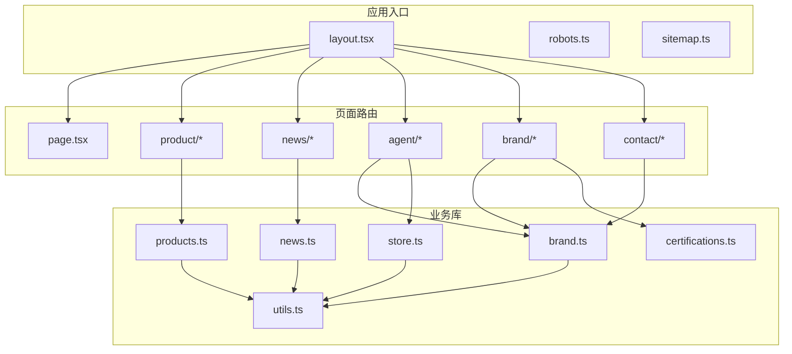
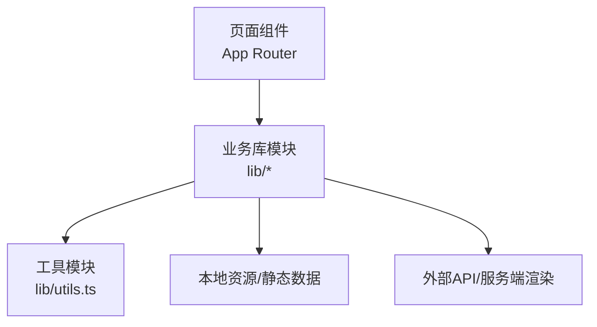
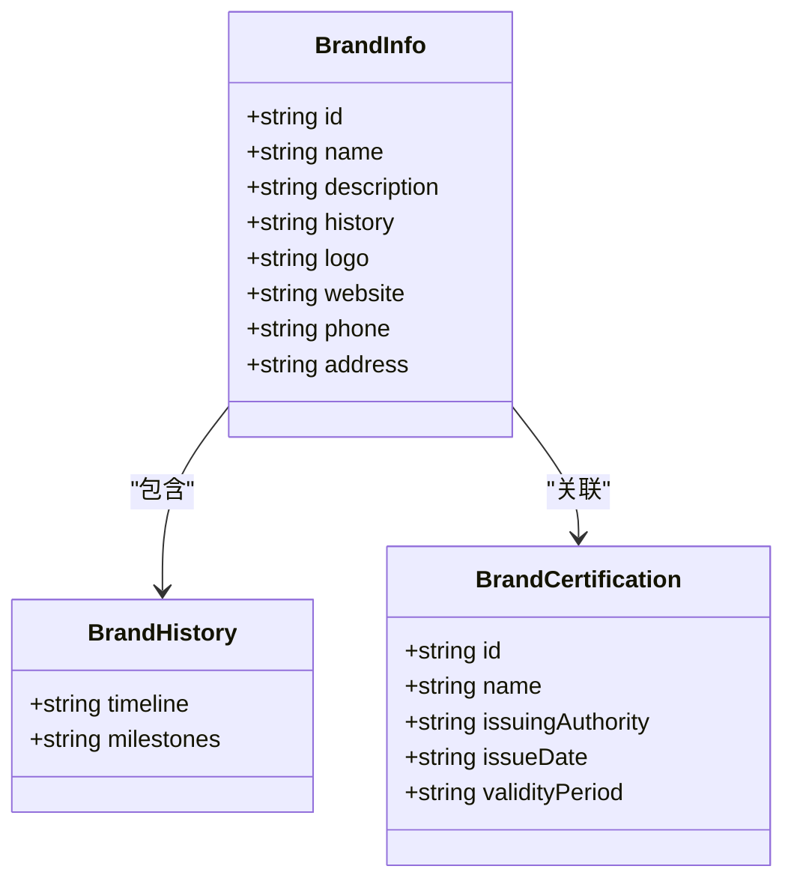
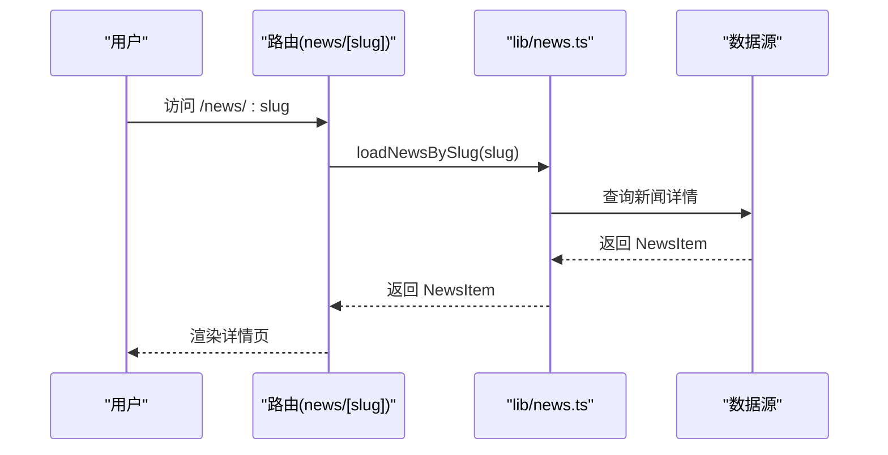
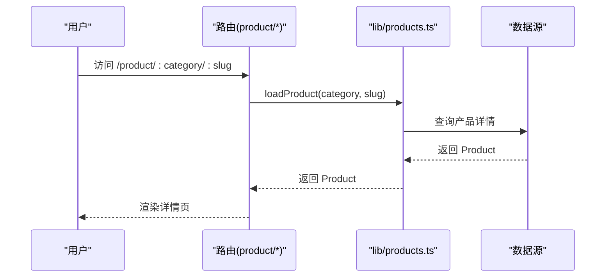
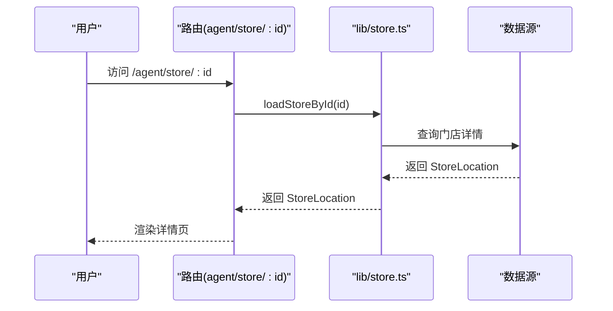
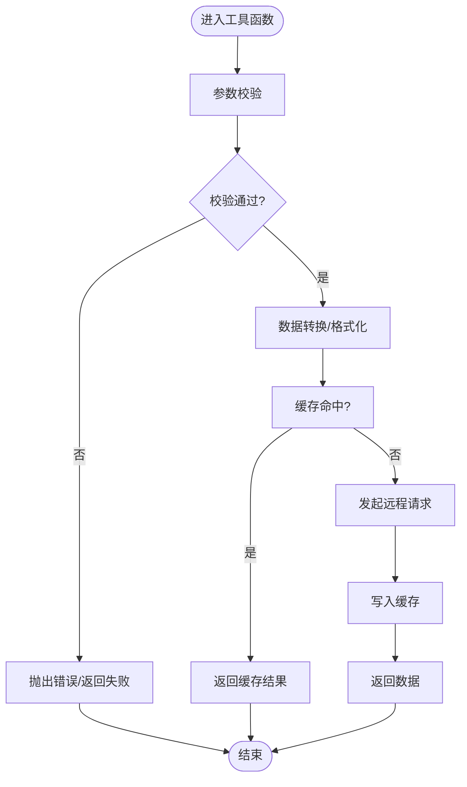
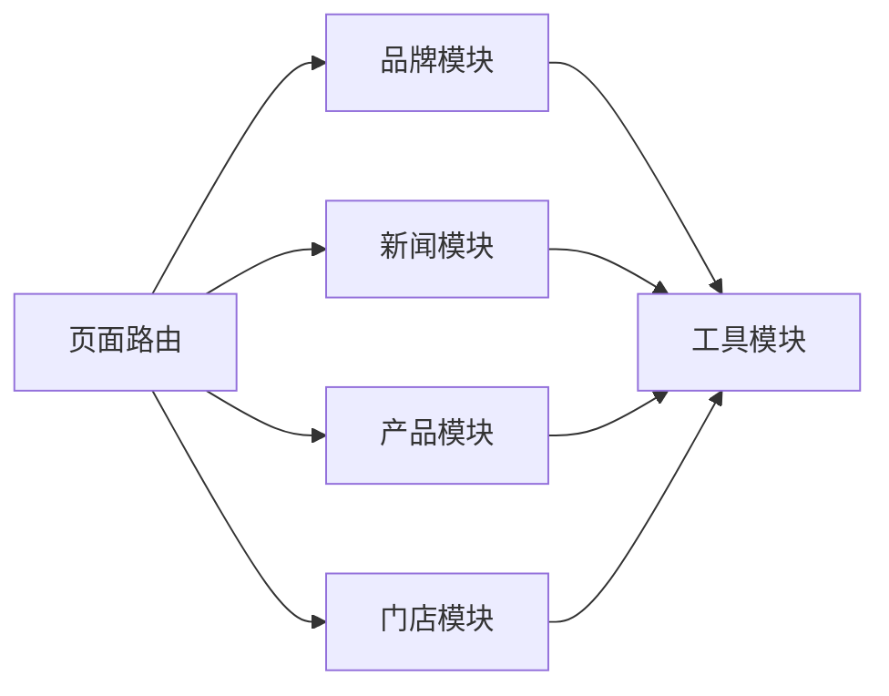

# 数据层设计

<cite>
**本文引用的文件**
- [brand.ts](file://src/lib/brand.ts)
- [certifications.ts](file://src/lib/certifications.ts)
- [news.ts](file://src/lib/news.ts)
- [products.ts](file://src/lib/products.ts)
- [store.ts](file://src/lib/store.ts)
- [utils.ts](file://src/lib/utils.ts)
- [layout.tsx](file://src/app/layout.tsx)
- [page.tsx](file://src/app/page.tsx)
- [robots.ts](file://src/app/robots.ts)
- [sitemap.ts](file://src/app/sitemap.ts)
- [product-page.tsx](file://src/app/product/page.tsx)
- [product-chassis-page.tsx](file://src/app/product/chassis/page.tsx)
- [product-color-film-page.tsx](file://src/app/product/color-film/page.tsx)
- [product-electric-steps-page.tsx](file://src/app/product/electric-steps/page.tsx)
- [product-ppf-page.tsx](file://src/app/product/ppf/page.tsx)
- [product-wheels-page.tsx](file://src/app/product/wheels/page.tsx)
- [product-window-film-page.tsx](file://src/app/product/window-film/page.tsx)
- [news-page.tsx](file://src/app/news/page.tsx)
- [news-detail-page.tsx](file://src/app/news/[slug]/page.tsx)
- [agent-page.tsx](file://src/app/agent/page.tsx)
- [agent-slug-city-page.tsx](file://src/app/agent/[slug]/[city]/page.tsx)
- [agent-store-id-page.tsx](file://src/app/agent/store/[id]/page.tsx)
- [brand-page.tsx](file://src/app/brand/page.tsx)
- [brand-certifications-page.tsx](file://src/app/brand/certifications/page.tsx)
- [brand-history-page.tsx](file://src/app/brand/history/page.tsx)
- [contact-page.tsx](file://src/app/contact/page.tsx)
- [globals.css](file://src/app/globals.css)
- [README.md](file://README.md)
</cite>

## 目录
1. [引言](#引言)
2. [项目结构](#项目结构)
3. [核心组件](#核心组件)
4. [架构总览](#架构总览)
5. [详细组件分析](#详细组件分析)
6. [依赖分析](#依赖分析)
7. [性能考虑](#性能考虑)
8. [故障排除指南](#故障排除指南)
9. [结论](#结论)
10. [附录](#附录)

## 引言
本文件系统性梳理蓝辉轻改网站的数据层设计，聚焦于TypeScript接口与数据模型、业务实体（Product、BrandInfo、NewsItem、StoreLocation 等）的字段定义与关系映射、数据获取策略（静态生成、动态路由参数处理、API 调用模式）、数据验证与错误处理、缓存策略、数据生命周期与版本控制、utils 工具函数的设计与复用价值，并给出新增业务模块时的数据层扩展最佳实践。目标是为开发者提供兼具理论深度与实践指导的参考。

## 项目结构
数据层主要由以下部分组成：
- 应用入口与全局配置：Next.js 应用布局、站点地图与机器人协议
- 业务库模块：品牌、证书、新闻、产品、门店、通用工具
- 页面路由：产品分类页、新闻列表与详情、代理与门店查询、品牌与联系等

图表来源
- [layout.tsx:1-200](file://src/app/layout.tsx#L1-L200)
- [robots.ts:1-200](file://src/app/robots.ts#L1-L200)
- [sitemap.ts:1-200](file://src/app/sitemap.ts#L1-L200)
- [brand.ts:1-200](file://src/lib/brand.ts#L1-L200)
- [certifications.ts:1-200](file://src/lib/certifications.ts#L1-L200)
- [news.ts:1-200](file://src/lib/news.ts#L1-L200)
- [products.ts:1-200](file://src/lib/products.ts#L1-L200)
- [store.ts:1-200](file://src/lib/store.ts#L1-L200)
- [utils.ts:1-200](file://src/lib/utils.ts#L1-L200)

章节来源
- [layout.tsx:1-200](file://src/app/layout.tsx#L1-L200)
- [page.tsx:1-200](file://src/app/page.tsx#L1-L200)
- [robots.ts:1-200](file://src/app/robots.ts#L1-L200)
- [sitemap.ts:1-200](file://src/app/sitemap.ts#L1-L200)

## 核心组件
本节概述数据层的关键模块及其职责：
- 品牌模块：负责品牌信息、历史与证书数据的聚合与导出
- 证书模块：提供品牌相关证书的展示数据
- 新闻模块：提供新闻列表与详情数据
- 产品模块：提供产品分类与详情数据
- 门店模块：提供门店位置与联系方式等数据
- 工具模块：提供通用的数据处理、校验与转换能力

章节来源
- [brand.ts:1-200](file://src/lib/brand.ts#L1-L200)
- [certifications.ts:1-200](file://src/lib/certifications.ts#L1-L200)
- [news.ts:1-200](file://src/lib/news.ts#L1-L200)
- [products.ts:1-200](file://src/lib/products.ts#L1-L200)
- [store.ts:1-200](file://src/lib/store.ts#L1-L200)
- [utils.ts:1-200](file://src/lib/utils.ts#L1-L200)

## 架构总览
数据层采用“页面路由 + 业务库模块”的分层设计：
- 页面路由通过 Next.js 的 App Router 组织，支持静态生成与动态路由参数
- 业务库模块封装数据获取与转换逻辑，统一对外暴露类型安全的接口
- 工具模块提供跨模块复用的通用能力，降低重复实现

图表来源
- [brand.ts:1-200](file://src/lib/brand.ts#L1-L200)
- [news.ts:1-200](file://src/lib/news.ts#L1-L200)
- [products.ts:1-200](file://src/lib/products.ts#L1-L200)
- [store.ts:1-200](file://src/lib/store.ts#L1-L200)
- [utils.ts:1-200](file://src/lib/utils.ts#L1-L200)

## 详细组件分析

### 品牌模块（BrandInfo）
- 职责：聚合品牌基础信息、历史沿革与证书数据
- 关键点：
  - 类型安全：通过明确的接口约束品牌字段，避免运行期错误
  - 数据来源：可来自本地 JSON/静态资源或服务端渲染
  - 输出形态：统一的品牌对象，便于页面直接消费

图表来源
- [brand.ts:1-200](file://src/lib/brand.ts#L1-L200)
- [certifications.ts:1-200](file://src/lib/certifications.ts#L1-L200)

章节来源
- [brand.ts:1-200](file://src/lib/brand.ts#L1-L200)
- [brand-certifications-page.tsx:1-200](file://src/app/brand/certifications/page.tsx#L1-L200)
- [brand-history-page.tsx:1-200](file://src/app/brand/history/page.tsx#L1-L200)

### 证书模块（Certification）
- 职责：提供品牌相关证书的列表与详情
- 关键点：
  - 列表页：按时间倒序或类别筛选
  - 详情页：展示证书图片、颁发机构、有效期等
  - 类型约束：确保字段完整性与一致性

章节来源
- [certifications.ts:1-200](file://src/lib/certifications.ts#L1-L200)
- [brand-certifications-page.tsx:1-200](file://src/app/brand/certifications/page.tsx#L1-L200)

### 新闻模块（NewsItem）
- 职责：提供新闻列表与详情
- 关键点：
  - 列表页：分页、搜索、分类筛选
  - 详情页：基于 slug 动态路由解析，避免硬编码路径
  - 字段设计：标题、摘要、正文、发布时间、作者、封面图等

图表来源
- [news.ts:1-200](file://src/lib/news.ts#L1-L200)
- [news-detail-page.tsx:1-200](file://src/app/news/[slug]/page.tsx#L1-L200)

章节来源
- [news.ts:1-200](file://src/lib/news.ts#L1-L200)
- [news-page.tsx:1-200](file://src/app/news/page.tsx#L1-L200)
- [news-detail-page.tsx:1-200](file://src/app/news/[slug]/page.tsx#L1-L200)

### 产品模块（Product）
- 职责：提供产品分类与详情
- 关键点：
  - 分类页：按产品类型（车衣、轮毂、电吸踏板等）组织
  - 详情页：基于动态路由参数加载对应产品
  - 字段设计：名称、描述、价格、规格、适用车型、图片集等

图表来源
- [products.ts:1-200](file://src/lib/products.ts#L1-L200)
- [product-page.tsx:1-200](file://src/app/product/page.tsx#L1-L200)
- [product-chassis-page.tsx:1-200](file://src/app/product/chassis/page.tsx#L1-L200)
- [product-color-film-page.tsx:1-200](file://src/app/product/color-film/page.tsx#L1-L200)
- [product-electric-steps-page.tsx:1-200](file://src/app/product/electric-steps/page.tsx#L1-L200)
- [product-ppf-page.tsx:1-200](file://src/app/product/ppf/page.tsx#L1-L200)
- [product-wheels-page.tsx:1-200](file://src/app/product/wheels/page.tsx#L1-L200)
- [product-window-film-page.tsx:1-200](file://src/app/product/window-film/page.tsx#L1-L200)

章节来源
- [products.ts:1-200](file://src/lib/products.ts#L1-L200)
- [product-page.tsx:1-200](file://src/app/product/page.tsx#L1-L200)

### 门店模块（StoreLocation）
- 职责：提供门店位置与联系方式
- 关键点：
  - 列表页：按城市或区域筛选
  - 详情页：基于动态路由参数加载指定门店
  - 字段设计：门店编号、名称、地址、电话、营业时间、地图坐标等

图表来源
- [store.ts:1-200](file://src/lib/store.ts#L1-L200)
- [agent-store-id-page.tsx:1-200](file://src/app/agent/store/[id]/page.tsx#L1-L200)

章节来源
- [store.ts:1-200](file://src/lib/store.ts#L1-L200)
- [agent-store-id-page.tsx:1-200](file://src/app/agent/store/[id]/page.tsx#L1-L200)

### 代理模块（Agent）
- 职责：提供代理信息与所在城市筛选
- 关键点：
  - 列表页：按 slug 与 city 动态路由参数过滤
  - 字段设计：代理编号、姓名、城市、电话、邮箱、简介等

章节来源
- [brand.ts:1-200](file://src/lib/brand.ts#L1-L200)
- [agent-page.tsx:1-200](file://src/app/agent/page.tsx#L1-L200)
- [agent-slug-city-page.tsx:1-200](file://src/app/agent/[slug]/[city]/page.tsx#L1-L200)

### 工具模块（utils）
- 职责：提供跨模块复用的通用能力
- 关键点：
  - 数据校验：对输入进行类型与范围校验
  - 数据转换：统一格式化（日期、货币、URL 规范化）
  - 错误处理：集中化的错误包装与日志记录
  - 缓存策略：内存/会话级缓存，减少重复请求

图表来源
- [utils.ts:1-200](file://src/lib/utils.ts#L1-L200)

章节来源
- [utils.ts:1-200](file://src/lib/utils.ts#L1-L200)

## 依赖分析
- 模块内聚：每个业务库模块专注于单一领域，职责清晰
- 模块耦合：页面路由仅依赖业务库模块；业务库模块共享工具模块
- 外部依赖：无第三方数据访问库，采用原生 fetch 或静态资源

图表来源
- [brand.ts:1-200](file://src/lib/brand.ts#L1-L200)
- [news.ts:1-200](file://src/lib/news.ts#L1-L200)
- [products.ts:1-200](file://src/lib/products.ts#L1-L200)
- [store.ts:1-200](file://src/lib/store.ts#L1-L200)
- [utils.ts:1-200](file://src/lib/utils.ts#L1-L200)

章节来源
- [brand.ts:1-200](file://src/lib/brand.ts#L1-L200)
- [news.ts:1-200](file://src/lib/news.ts#L1-L200)
- [products.ts:1-200](file://src/lib/products.ts#L1-L200)
- [store.ts:1-200](file://src/lib/store.ts#L1-L200)
- [utils.ts:1-200](file://src/lib/utils.ts#L1-L200)

## 性能考虑
- 静态生成优先：首页与品牌页等静态内容采用静态生成，提升首屏性能
- 动态路由懒加载：新闻详情与产品详情在客户端按需加载，减少初始包体
- 缓存策略：对高频访问数据（如新闻列表、产品分类）启用内存/会话缓存
- 请求合并：对多处使用的相同数据进行去重与复用
- 图片优化：使用现代格式与尺寸裁剪，结合占位符与懒加载

## 故障排除指南
- 数据为空：检查业务库模块的默认值与兜底逻辑
- 路由参数异常：确认动态路由参数命名与页面路径一致
- 类型错误：使用工具模块的校验函数，确保字段类型与范围符合预期
- 缓存污染：定期清理过期缓存，避免脏数据影响展示
- 网络错误：增加重试与降级策略，保障用户体验

章节来源
- [utils.ts:1-200](file://src/lib/utils.ts#L1-L200)

## 结论
本数据层设计以“页面路由 + 业务库模块 + 工具模块”为核心，实现了高内聚、低耦合与强类型约束。通过明确的接口定义、严格的参数校验与合理的缓存策略，既保证了开发效率，也提升了运行时稳定性。建议在新增业务模块时遵循本文给出的最佳实践，确保数据层的可维护性与可扩展性。

## 附录
- 版本控制与迁移：建议引入语义化版本号，对数据模型变更进行兼容性说明与迁移脚本
- 数据生命周期：建立数据采集、清洗、存储、归档与销毁的全周期规范
- 扩展清单：新增模块时，先设计接口与类型，再实现业务库模块，最后接入页面路由