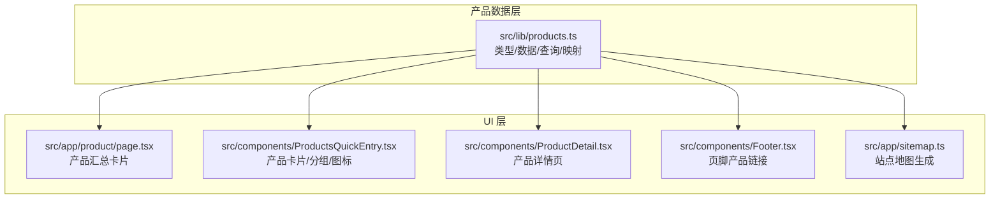
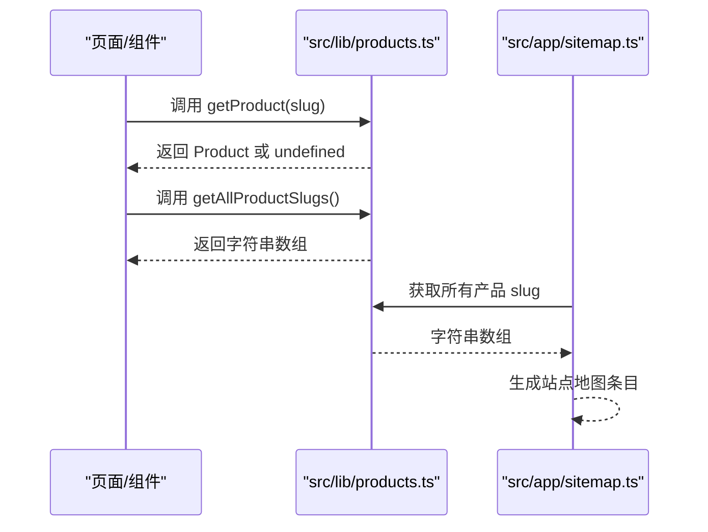
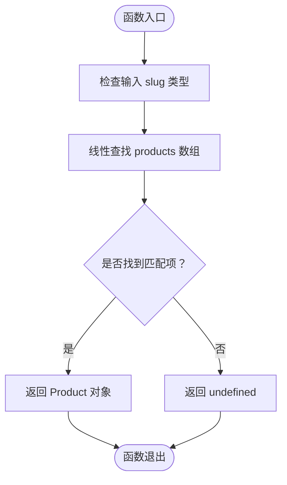
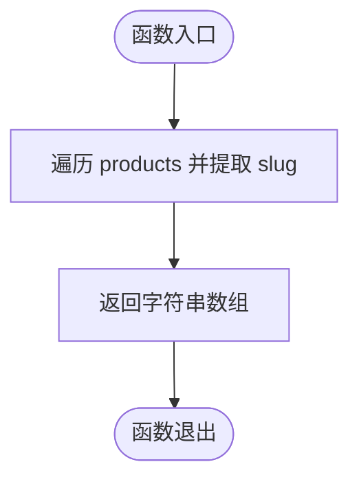
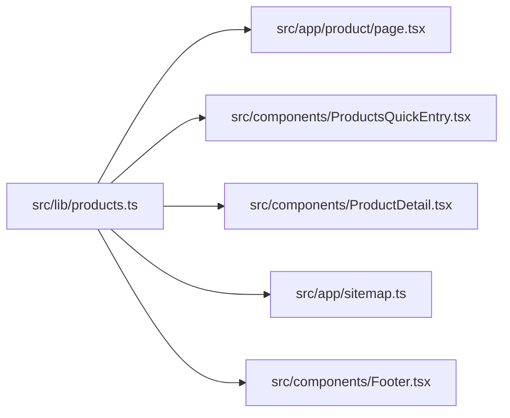

# 产品数据操作

<cite>
**本文引用的文件**
- [src/lib/products.ts](file://src/lib/products.ts)
- [src/components/ProductsQuickEntry.tsx](file://src/components/ProductsQuickEntry.tsx)
- [src/app/product/page.tsx](file://src/app/product/page.tsx)
- [src/components/ProductDetail.tsx](file://src/components/ProductDetail.tsx)
- [src/app/sitemap.ts](file://src/app/sitemap.ts)
- [src/components/Footer.tsx](file://src/components/Footer.tsx)
</cite>

## 目录
1. [简介](#简介)
2. [项目结构](#项目结构)
3. [核心组件](#核心组件)
4. [架构总览](#架构总览)
5. [详细组件分析](#详细组件分析)
6. [依赖关系分析](#依赖关系分析)
7. [性能考量](#性能考量)
8. [故障排查指南](#故障排查指南)
9. [结论](#结论)
10. [附录](#附录)

## 简介
本文件聚焦于产品数据操作，系统化梳理产品数据模型结构（Product 接口、ProductGroup 分类体系）、关键函数实现（getProduct、getAllProductSlugs）以及产品分组机制与图片映射策略。同时提供增删改查操作的实践建议、错误处理与边界情况处理方法，并结合前端页面组件展示如何消费这些数据。

## 项目结构
与产品数据相关的关键位置如下：
- 数据与工具：src/lib/products.ts 提供产品类型、产品列表、分组配置、查询函数与图片映射。
- 页面与组件：src/app/product/page.tsx 展示产品汇总卡片；src/components/ProductsQuickEntry.tsx 使用分组与图标映射；src/components/ProductDetail.tsx 展示产品详情页；src/app/sitemap.ts 使用 getAllProductSlugs 生成站点地图；src/components/Footer.tsx 在页脚中链接到产品详情页。



**图表来源**
- [src/lib/products.ts](file://src/lib/products.ts)
- [src/app/product/page.tsx](file://src/app/product/page.tsx)
- [src/components/ProductsQuickEntry.tsx](file://src/components/ProductsQuickEntry.tsx)
- [src/components/ProductDetail.tsx](file://src/components/ProductDetail.tsx)
- [src/app/sitemap.ts](file://src/app/sitemap.ts)
- [src/components/Footer.tsx](file://src/components/Footer.tsx)

**章节来源**
- [src/lib/products.ts](file://src/lib/products.ts)
- [src/app/product/page.tsx](file://src/app/product/page.tsx)
- [src/components/ProductsQuickEntry.tsx](file://src/components/ProductsQuickEntry.tsx)
- [src/components/ProductDetail.tsx](file://src/components/ProductDetail.tsx)
- [src/app/sitemap.ts](file://src/app/sitemap.ts)
- [src/components/Footer.tsx](file://src/components/Footer.tsx)

## 核心组件
- 产品类型与分组
  - ProductGroup：限定为 "light-mod" 或 "film"。
  - Product：包含 slug、name、group、groupLabel、tagline、heroDescription 等字段。
  - productGroups：定义两类分组的标识、标签与描述。
- 查询与映射
  - getProduct(slug)：按 slug 查找产品。
  - getAllProductSlugs()：返回所有产品 slug 列表。
  - productImageMap：slug 到静态图片路径的映射。
  - PRODUCT_ICON_MAP：slug 到图标组件的映射。

**章节来源**
- [src/lib/products.ts](file://src/lib/products.ts)

## 架构总览
产品数据在应用中的流转路径：
- 数据源：src/lib/products.ts 中的产品数组与分组配置。
- 查询入口：getProduct 与 getAllProductSlugs。
- 消费端：页面组件通过 slug 渲染详情页、汇总页、站点地图等。



**图表来源**
- [src/lib/products.ts](file://src/lib/products.ts)
- [src/app/sitemap.ts](file://src/app/sitemap.ts)

## 详细组件分析

### 产品数据模型与分组体系
- 类型定义
  - ProductGroup：两类分组标识。
  - Product：包含 slug、name、group、groupLabel、tagline、heroDescription 等字段。
- 分组配置
  - light-mod：强调姿态、便利、行驶质感等功能性升级。
  - film：强调隔热、隐私、漆面保护与个性化表达。
- 图片与图标映射
  - productImageMap：slug 到静态图片路径的映射。
  - PRODUCT_ICON_MAP：slug 到图标组件的映射。

```mermaid
classDiagram
class Product {
+string slug
+string name
+ProductGroup group
+string groupLabel
+string tagline
+string heroDescription
}
class ProductGroup {
<<enumeration>>
"light-mod"
"film"
}
class ProductsModule {
+getProduct(slug) Product|undefined
+getAllProductSlugs() string[]
+productImageMap Record
+PRODUCT_ICON_MAP Record
}
ProductsModule --> Product : "返回/查询"
Product --> ProductGroup : "使用"
```

**图表来源**
- [src/lib/products.ts](file://src/lib/products.ts)

**章节来源**
- [src/lib/products.ts](file://src/lib/products.ts)

### 函数实现与行为分析

#### getProduct(slug) 实现原理
- 参数验证
  - 输入为字符串 slug；未进行额外正则或长度校验。
- 查找算法
  - 基于数组的线性查找（find），匹配 p.slug === slug。
- 返回值处理
  - 找到返回对应 Product；未找到返回 undefined。
- 错误处理与边界情况
  - 当 slug 不存在时返回 undefined，调用方需显式检查返回值。
  - 若传入空字符串或非字符串，将按严格相等比较，不会命中任何项。



**图表来源**
- [src/lib/products.ts](file://src/lib/products.ts)

**章节来源**
- [src/lib/products.ts](file://src/lib/products.ts)

#### getAllProductSlugs() 行为与性能
- 功能：返回所有产品的 slug 组成的字符串数组。
- 性能特征：时间复杂度 O(n)，空间复杂度 O(n)。
- 使用场景：站点地图生成、导航、预渲染等需要全量 slug 的场景。
- 注意事项：当产品数量增长时，应避免在热路径频繁重复生成数组；可考虑缓存结果。



**图表来源**
- [src/lib/products.ts](file://src/lib/products.ts)

**章节来源**
- [src/lib/products.ts](file://src/lib/products.ts)

### 产品分组机制与应用场景
- light-mod（轻改装备）
  - 特点：围绕姿态、便利、行驶质感的功能性升级。
  - 应用场景：外观与操控体验提升，适合追求驾驶质感与日常便利的用户。
- film（汽车膜系）
  - 特点：围绕隔热、隐私、漆面保护与个性化表达。
  - 应用场景：注重车窗隔热、隐私保护与外观个性化的用户。

**章节来源**
- [src/lib/products.ts](file://src/lib/products.ts)

### 图片映射与静态资源管理
- 图片映射
  - productImageMap：将产品 slug 映射到静态图片路径，用于详情页或汇总页的图片展示。
- 图标映射
  - PRODUCT_ICON_MAP：将产品 slug 映射到图标组件，用于卡片与导航中的视觉标识。
- 静态资源策略
  - 图片放置于 public/images/products 下，通过相对路径直接访问。
  - 建议：确保 slug 与实际文件名一致，避免 404；可在构建期增加校验以保证映射完整性。

**章节来源**
- [src/lib/products.ts](file://src/lib/products.ts)

### 增删改查操作示例与最佳实践
- 查询
  - 单个产品：调用 getProduct(slug)，对返回值进行存在性判断后再渲染。
  - 全部 slug：调用 getAllProductSlugs()，用于生成站点地图或导航列表。
- 新增
  - 在 products 数组中添加新的 Product 对象，补充对应的 slug、图片与图标映射。
  - 验证：确保 slug 唯一且与图片/图标映射一致。
- 删除
  - 从 products 数组移除对应项；同步清理 productImageMap 与 PRODUCT_ICON_MAP 中的映射。
  - 验证：确认无页面仍引用该 slug，必要时更新站点地图与导航。
- 修改
  - 更新 products 中的字段；如修改 slug，需同步更新所有引用处（页面、映射、站点地图）。
  - 验证：确保 group 与 groupLabel 保持一致，避免 UI 显示不一致。
- 错误处理与边界情况
  - getProduct 返回 undefined 时，应提供兜底文案或跳转至错误页。
  - getAllProductSlugs 返回空数组时，应避免渲染空列表或提供提示。
  - slug 为空或非法时，应在路由层拦截或在查询前做基础校验。

**章节来源**
- [src/lib/products.ts](file://src/lib/products.ts)
- [src/app/sitemap.ts](file://src/app/sitemap.ts)
- [src/components/Footer.tsx](file://src/components/Footer.tsx)

## 依赖关系分析
- 模块内聚与耦合
  - src/lib/products.ts 内部高度内聚：类型、数据、查询、映射集中管理。
  - 与其他模块松耦合：仅通过导出函数被外部页面与工具使用。
- 外部依赖
  - 页面与组件通过 import 引用查询函数与映射表。
  - 站点地图通过 getAllProductSlugs 生成动态路由条目。



**图表来源**
- [src/lib/products.ts](file://src/lib/products.ts)
- [src/app/product/page.tsx](file://src/app/product/page.tsx)
- [src/components/ProductsQuickEntry.tsx](file://src/components/ProductsQuickEntry.tsx)
- [src/components/ProductDetail.tsx](file://src/components/ProductDetail.tsx)
- [src/app/sitemap.ts](file://src/app/sitemap.ts)
- [src/components/Footer.tsx](file://src/components/Footer.tsx)

**章节来源**
- [src/lib/products.ts](file://src/lib/products.ts)
- [src/app/product/page.tsx](file://src/app/product/page.tsx)
- [src/components/ProductsQuickEntry.tsx](file://src/components/ProductsQuickEntry.tsx)
- [src/components/ProductDetail.tsx](file://src/components/ProductDetail.tsx)
- [src/app/sitemap.ts](file://src/app/sitemap.ts)
- [src/components/Footer.tsx](file://src/components/Footer.tsx)

## 性能考量
- 查询性能
  - getProduct 使用线性查找，n 较小时性能可接受；若产品规模扩大，可考虑：
    - 建立基于 slug 的 Map 结构以实现 O(1) 查找。
    - 在 SSR/ISR 场景缓存查询结果。
- 计算开销
  - getAllProductSlugs 每次都会重新 map 整个数组；在高频调用场景可引入内存缓存。
- 渲染优化
  - 在汇总页与详情页按需加载图片，避免阻塞首屏。
  - 使用懒加载与占位图提升感知性能。

## 故障排查指南
- getProduct 返回 undefined
  - 检查传入 slug 是否正确（大小写、拼写、特殊字符）。
  - 确认 products 数组中是否存在该 slug。
- 站点地图缺少产品页
  - 检查 getAllProductSlugs 是否返回预期数组。
  - 确认 sitemap.ts 中的映射逻辑与 URL 规则。
- 图片或图标显示异常
  - 检查 productImageMap 与 PRODUCT_ICON_MAP 中的键是否与 slug 一致。
  - 确认 public/images/products 下的文件存在且命名一致。
- 分组标签显示不一致
  - 确认 Product.group 与 productGroups 的 id 匹配，groupLabel 与分组配置一致。

**章节来源**
- [src/lib/products.ts](file://src/lib/products.ts)
- [src/app/sitemap.ts](file://src/app/sitemap.ts)

## 结论
本项目采用集中式产品数据管理，通过清晰的类型定义、稳定的查询接口与直观的映射表，实现了产品信息在页面与工具间的高效复用。建议在产品规模扩大后引入索引与缓存策略，以进一步提升查询与渲染性能；同时完善构建期校验，确保 slug、图片与图标映射的一致性与可维护性。

## 附录
- 关键函数与用途速览
  - getProduct(slug)：按 slug 查询单个产品。
  - getAllProductSlugs()：获取全部产品 slug，用于站点地图与导航。
  - productImageMap：slug 到静态图片路径的映射。
  - PRODUCT_ICON_MAP：slug 到图标组件的映射。
- 页面与组件中的使用
  - 产品汇总页：使用 Product 与分组信息渲染卡片。
  - 产品详情页：根据 slug 渲染详情与面包屑。
  - 页脚导航：遍历产品列表生成快捷链接。
  - 站点地图：遍历所有 slug 生成动态路由条目。

**章节来源**
- [src/lib/products.ts](file://src/lib/products.ts)
- [src/app/product/page.tsx](file://src/app/product/page.tsx)
- [src/components/ProductsQuickEntry.tsx](file://src/components/ProductsQuickEntry.tsx)
- [src/components/ProductDetail.tsx](file://src/components/ProductDetail.tsx)
- [src/components/Footer.tsx](file://src/components/Footer.tsx)
- [src/app/sitemap.ts](file://src/app/sitemap.ts)