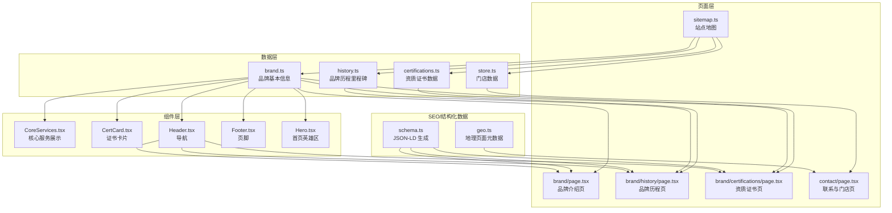
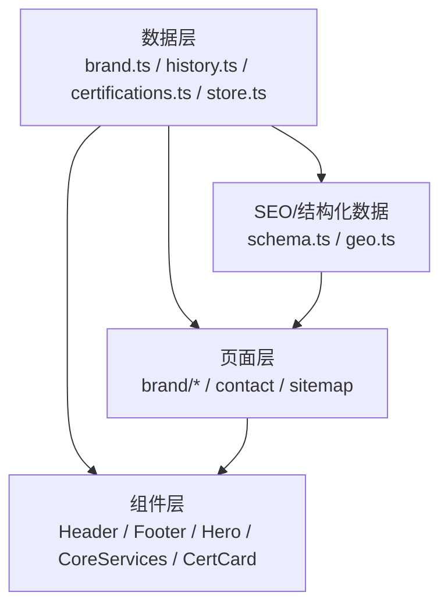
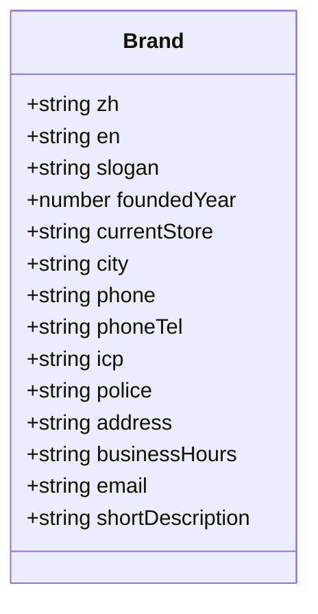
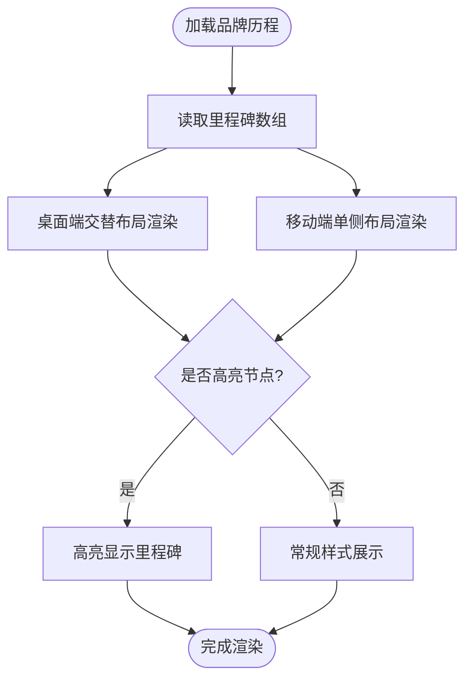
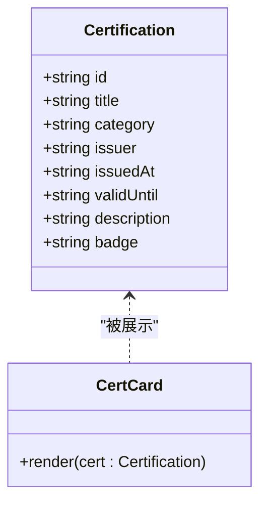
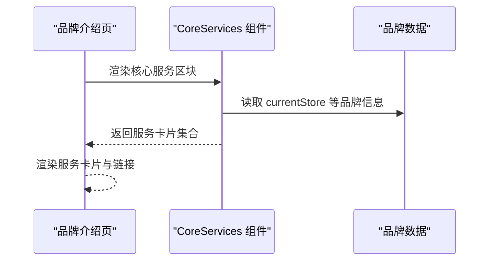
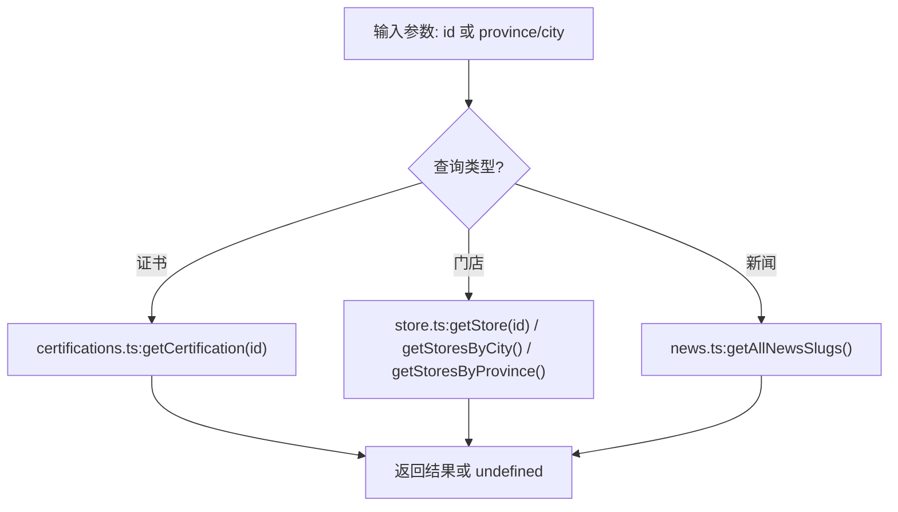
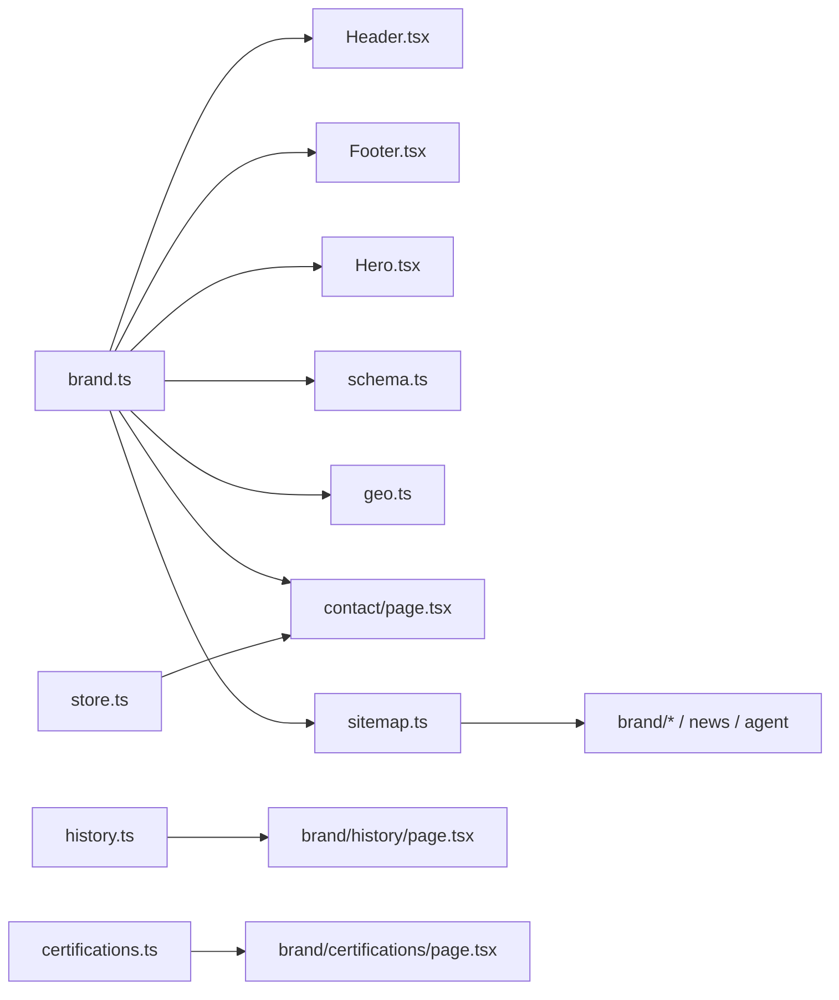
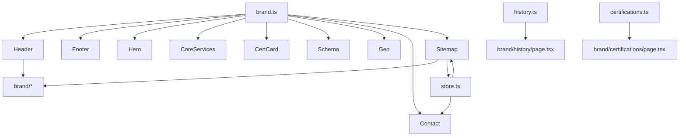

# 品牌数据操作

<cite>
**本文档引用的文件**
- [src/lib/brand.ts](file://src/lib/brand.ts)
- [src/app/brand/page.tsx](file://src/app/brand/page.tsx)
- [src/app/brand/history/page.tsx](file://src/app/brand/history/page.tsx)
- [src/app/brand/certifications/page.tsx](file://src/app/brand/certifications/page.tsx)
- [src/lib/history.ts](file://src/lib/history.ts)
- [src/lib/certifications.ts](file://src/lib/certifications.ts)
- [src/components/CoreServices.tsx](file://src/components/CoreServices.tsx)
- [src/components/CertCard.tsx](file://src/components/CertCard.tsx)
- [src/lib/schema.ts](file://src/lib/schema.ts)
- [src/lib/geo.ts](file://src/lib/geo.ts)
- [src/components/Header.tsx](file://src/components/Header.tsx)
- [src/components/Footer.tsx](file://src/components/Footer.tsx)
- [src/components/Hero.tsx](file://src/components/Hero.tsx)
- [src/app/contact/page.tsx](file://src/app/contact/page.tsx)
- [src/app/sitemap.ts](file://src/app/sitemap.ts)
- [src/lib/store.ts](file://src/lib/store.ts)
- [docs/ARCHITECTURE_IMAGE_STRATEGY.md](file://docs/ARCHITECTURE_IMAGE_STRATEGY.md)
- [docs/EVALUATION.md](file://docs/EVALUATION.md)
</cite>

## 目录
1. [引言](#引言)
2. [项目结构](#项目结构)
3. [核心组件](#核心组件)
4. [架构总览](#架构总览)
5. [详细组件分析](#详细组件分析)
6. [依赖关系分析](#依赖关系分析)
7. [性能考虑](#性能考虑)
8. [故障排除指南](#故障排除指南)
9. [结论](#结论)
10. [附录](#附录)

## 引言
本文件聚焦于品牌数据操作的综合文档，系统阐述品牌信息的数据结构设计、历史与资质数据组织、核心服务的呈现方式，以及品牌数据在前端应用中的获取、缓存与更新机制。同时，结合现有代码分析品牌数据的多语言支持现状与本地化策略，并给出查询接口使用示例（基于现有静态数据与路由）、与其他模块的关联关系及数据一致性保障机制，最后提出扩展性设计与未来功能预留。

## 项目结构
品牌数据相关的核心文件分布于以下位置：
- 数据层：src/lib/brand.ts、src/lib/history.ts、src/lib/certifications.ts
- 页面层：src/app/brand/*.tsx、src/app/brand/certifications/page.tsx
- 组件层：src/components/CoreServices.tsx、src/components/CertCard.tsx
- SEO/结构化数据：src/lib/schema.ts、src/lib/geo.ts
- 导航与展示：src/components/Header.tsx、src/components/Footer.tsx、src/components/Hero.tsx
- 联系与门店：src/app/contact/page.tsx、src/lib/store.ts
- 站点地图：src/app/sitemap.ts
- 架构与规划：docs/ARCHITECTURE_IMAGE_STRATEGY.md、docs/EVALUATION.md

图表来源
- [src/lib/brand.ts:1-27](file://src/lib/brand.ts#L1-L27)
- [src/lib/history.ts:1-54](file://src/lib/history.ts#L1-L54)
- [src/lib/certifications.ts:1-114](file://src/lib/certifications.ts#L1-L114)
- [src/lib/store.ts:91-121](file://src/lib/store.ts#L91-L121)
- [src/app/brand/page.tsx:1-181](file://src/app/brand/page.tsx#L1-L181)
- [src/app/brand/history/page.tsx:1-180](file://src/app/brand/history/page.tsx#L1-L180)
- [src/app/brand/certifications/page.tsx:1-107](file://src/app/brand/certifications/page.tsx#L1-L107)
- [src/app/contact/page.tsx:163-189](file://src/app/contact/page.tsx#L163-L189)
- [src/app/sitemap.ts:1-66](file://src/app/sitemap.ts#L1-L66)
- [src/components/CoreServices.tsx:1-89](file://src/components/CoreServices.tsx#L1-L89)
- [src/components/CertCard.tsx:1-77](file://src/components/CertCard.tsx#L1-L77)
- [src/components/Header.tsx:1-48](file://src/components/Header.tsx#L1-L48)
- [src/components/Footer.tsx:76-112](file://src/components/Footer.tsx#L76-L112)
- [src/components/Hero.tsx:34-55](file://src/components/Hero.tsx#L34-L55)
- [src/lib/schema.ts:1-69](file://src/lib/schema.ts#L1-L69)
- [src/lib/geo.ts:1-41](file://src/lib/geo.ts#L1-L41)

章节来源
- [src/lib/brand.ts:1-27](file://src/lib/brand.ts#L1-L27)
- [src/lib/history.ts:1-54](file://src/lib/history.ts#L1-L54)
- [src/lib/certifications.ts:1-114](file://src/lib/certifications.ts#L1-L114)
- [src/lib/store.ts:91-121](file://src/lib/store.ts#L91-L121)
- [src/app/brand/page.tsx:1-181](file://src/app/brand/page.tsx#L1-L181)
- [src/app/brand/history/page.tsx:1-180](file://src/app/brand/history/page.tsx#L1-L180)
- [src/app/brand/certifications/page.tsx:1-107](file://src/app/brand/certifications/page.tsx#L1-L107)
- [src/app/contact/page.tsx:163-189](file://src/app/contact/page.tsx#L163-L189)
- [src/app/sitemap.ts:1-66](file://src/app/sitemap.ts#L1-L66)
- [src/components/CoreServices.tsx:1-89](file://src/components/CoreServices.tsx#L1-L89)
- [src/components/CertCard.tsx:1-77](file://src/components/CertCard.tsx#L1-L77)
- [src/components/Header.tsx:1-48](file://src/components/Header.tsx#L1-L48)
- [src/components/Footer.tsx:76-112](file://src/components/Footer.tsx#L76-L112)
- [src/components/Hero.tsx:34-55](file://src/components/Hero.tsx#L34-L55)
- [src/lib/schema.ts:1-69](file://src/lib/schema.ts#L1-L69)
- [src/lib/geo.ts:1-41](file://src/lib/geo.ts#L1-L41)

## 核心组件
- 品牌基本信息（brand.ts）：集中管理品牌名称、成立年份、标语、当前门店、城市、联系方式、简述等，供全局统一引用。
- 品牌历程（history.ts）：以里程碑形式组织品牌发展时间线，支持高亮关键节点。
- 资质证书（certifications.ts）：定义证书数据模型与分类，提供查询与展示能力。
- 页面与组件：品牌介绍页、历程页、证书页、核心服务组件、证书卡片组件等，均直接或间接依赖上述数据层。
- SEO/结构化数据：通过 schema.ts 生成 Organization/Product/LocalBusiness/BreadcrumbList 等 JSON-LD，确保搜索引擎友好。
- 导航与展示：Header/ Footer/ Hero 组件统一引用品牌数据，形成一致的品牌形象。

章节来源
- [src/lib/brand.ts:8-25](file://src/lib/brand.ts#L8-L25)
- [src/lib/history.ts:8-14](file://src/lib/history.ts#L8-L14)
- [src/lib/certifications.ts:8-17](file://src/lib/certifications.ts#L8-L17)
- [src/components/CoreServices.tsx:5-30](file://src/components/CoreServices.tsx#L5-L30)
- [src/components/CertCard.tsx:4-13](file://src/components/CertCard.tsx#L4-L13)
- [src/lib/schema.ts:12-38](file://src/lib/schema.ts#L12-L38)
- [src/lib/schema.ts:40-63](file://src/lib/schema.ts#L40-L63)
- [src/lib/geo.ts:17-41](file://src/lib/geo.ts#L17-L41)

## 架构总览
品牌数据在前端采用“数据层-页面层-组件层”的分层设计，数据层提供纯数据对象与类型定义，页面层负责业务编排与路由，组件层负责 UI 展示与交互。SEO/结构化数据模块独立生成 JSON-LD，贯穿全站。

图表来源
- [src/lib/brand.ts:1-27](file://src/lib/brand.ts#L1-L27)
- [src/lib/history.ts:1-54](file://src/lib/history.ts#L1-L54)
- [src/lib/certifications.ts:1-114](file://src/lib/certifications.ts#L1-L114)
- [src/lib/store.ts:91-121](file://src/lib/store.ts#L91-L121)
- [src/app/brand/page.tsx:1-181](file://src/app/brand/page.tsx#L1-L181)
- [src/app/brand/history/page.tsx:1-180](file://src/app/brand/history/page.tsx#L1-L180)
- [src/app/brand/certifications/page.tsx:1-107](file://src/app/brand/certifications/page.tsx#L1-L107)
- [src/app/contact/page.tsx:163-189](file://src/app/contact/page.tsx#L163-L189)
- [src/app/sitemap.ts:1-66](file://src/app/sitemap.ts#L1-L66)
- [src/components/Header.tsx:1-48](file://src/components/Header.tsx#L1-L48)
- [src/components/Footer.tsx:76-112](file://src/components/Footer.tsx#L76-L112)
- [src/components/Hero.tsx:34-55](file://src/components/Hero.tsx#L34-L55)
- [src/lib/schema.ts:1-69](file://src/lib/schema.ts#L1-L69)
- [src/lib/geo.ts:1-41](file://src/lib/geo.ts#L1-L41)

## 详细组件分析

### 品牌信息数据结构设计
- 品牌基本信息字段涵盖中英文名称、标语、成立年份、当前门店、城市、联系方式、简述等，便于跨页面统一引用。
- 类型定义确保字段完整性与类型安全，避免运行时错误。
- 品牌数据在 Header/ Footer/ Hero/ 品牌页等多处复用，形成一致的品牌形象。

图表来源
- [src/lib/brand.ts:8-25](file://src/lib/brand.ts#L8-L25)

章节来源
- [src/lib/brand.ts:1-27](file://src/lib/brand.ts#L1-L27)

### 品牌历史与里程碑组织
- 历史数据以里程碑数组形式存储，支持年份、月份、标题、描述与高亮标记。
- 历程页按桌面/移动端交替布局渲染时间轴，突出关键节点。
- 通过高亮标记与时间轴视觉设计，增强用户对品牌发展脉络的理解。

图表来源
- [src/lib/history.ts:16-53](file://src/lib/history.ts#L16-L53)
- [src/app/brand/history/page.tsx:44-94](file://src/app/brand/history/page.tsx#L44-L94)
- [src/app/brand/history/page.tsx:135-179](file://src/app/brand/history/page.tsx#L135-L179)

章节来源
- [src/lib/history.ts:1-54](file://src/lib/history.ts#L1-L54)
- [src/app/brand/history/page.tsx:1-180](file://src/app/brand/history/page.tsx#L1-L180)

### 资质认证数据与展示
- 资质证书数据包含类别、颁发方、颁发日期、有效期、描述与徽章标识，支持按类别聚合与卡片化展示。
- 证书卡片组件根据类别映射不同边框与背景色，提升视觉层次。
- 证书页提供分类概览与证书网格展示，并提示真实证书以到店出示为准。

图表来源
- [src/lib/certifications.ts:8-17](file://src/lib/certifications.ts#L8-L17)
- [src/components/CertCard.tsx:15-76](file://src/components/CertCard.tsx#L15-L76)

章节来源
- [src/lib/certifications.ts:1-114](file://src/lib/certifications.ts#L1-L114)
- [src/components/CertCard.tsx:1-77](file://src/components/CertCard.tsx#L1-L77)
- [src/app/brand/certifications/page.tsx:1-107](file://src/app/brand/certifications/page.tsx#L1-L107)

### 核心服务组织与展示
- 核心服务以三栏卡片形式展示，涵盖轻改装备、汽车膜系与线下门店服务，提供跳转链接与强调色。
- 服务卡片与品牌数据联动，体现当前唯一线下服务中心的信息。

图表来源
- [src/app/brand/page.tsx:39-180](file://src/app/brand/page.tsx#L39-L180)
- [src/components/CoreServices.tsx:38-89](file://src/components/CoreServices.tsx#L38-L89)
- [src/lib/brand.ts:13-13](file://src/lib/brand.ts#L13-L13)

章节来源
- [src/components/CoreServices.tsx:1-89](file://src/components/CoreServices.tsx#L1-L89)
- [src/app/brand/page.tsx:1-181](file://src/app/brand/page.tsx#L1-L181)

### 多语言支持与本地化策略
- 现状：品牌数据与页面主要使用中文，英文字段仅用于品牌名称与标语，未见完整的 i18n 实现。
- 规划：评估文档明确提出“多语言 (i18n) — 中/英双语, Next.js i18n routing”，表明未来将引入 i18n 路由与翻译资源。
- 建议：在数据层为品牌信息增加英文字段映射，在页面层引入 i18n 路由与翻译键值，逐步迁移至完整双语支持。

章节来源
- [src/lib/brand.ts:9-10](file://src/lib/brand.ts#L9-L10)
- [docs/EVALUATION.md:223-223](file://docs/EVALUATION.md#L223-L223)

### 查询接口使用示例（基于现有静态数据）
- 获取单个证书：通过 id 查询证书详情，返回匹配项或未找到。
- 获取门店信息：按 id、省/市维度查询门店与城市列表。
- 获取新闻/资讯：获取所有文章 slug 列表（用于导航与 sitemap）。

图表来源
- [src/lib/certifications.ts:88-90](file://src/lib/certifications.ts#L88-L90)
- [src/lib/store.ts:91-121](file://src/lib/store.ts#L91-L121)
- [src/lib/news.ts:43-45](file://src/lib/news.ts#L43-L45)

章节来源
- [src/lib/certifications.ts:88-90](file://src/lib/certifications.ts#L88-L90)
- [src/lib/store.ts:91-121](file://src/lib/store.ts#L91-L121)
- [src/lib/news.ts:43-45](file://src/lib/news.ts#L43-L45)

### 数据获取、缓存与更新机制
- 获取：品牌数据通过静态导入在构建时注入，页面与组件直接引用，无需运行时请求。
- 缓存：由于数据为静态常量，不存在传统前端缓存；可通过浏览器缓存静态资源与 Next.js 的静态导出优化。
- 更新：修改 src/lib/brand.ts、history.ts、certifications.ts 等数据文件后，重新构建即可生效。

章节来源
- [src/lib/brand.ts:1-27](file://src/lib/brand.ts#L1-L27)
- [src/app/brand/page.tsx:13-13](file://src/app/brand/page.tsx#L13-L13)

### 与其他模块的关联关系与一致性保障
- Header/ Footer/ Hero 组件统一引用品牌数据，确保品牌信息一致性。
- SEO/结构化数据模块（schema.ts/geo.ts）依赖品牌数据生成 Organization/Product/LocalBusiness/BreadcrumbList，保障搜索引擎友好。
- 联系页与门店数据（store.ts）联动，展示当前服务中心与联系方式。
- 站点地图（sitemap.ts）整合品牌、历程、证书、新闻与门店等静态路由，确保索引覆盖。

图表来源
- [src/lib/brand.ts:1-27](file://src/lib/brand.ts#L1-L27)
- [src/components/Header.tsx:1-48](file://src/components/Header.tsx#L1-L48)
- [src/components/Footer.tsx:76-112](file://src/components/Footer.tsx#L76-L112)
- [src/components/Hero.tsx:34-55](file://src/components/Hero.tsx#L34-L55)
- [src/lib/schema.ts:1-69](file://src/lib/schema.ts#L1-L69)
- [src/lib/geo.ts:1-41](file://src/lib/geo.ts#L1-L41)
- [src/app/contact/page.tsx:163-189](file://src/app/contact/page.tsx#L163-L189)
- [src/app/sitemap.ts:1-66](file://src/app/sitemap.ts#L1-L66)
- [src/lib/history.ts:1-54](file://src/lib/history.ts#L1-L54)
- [src/app/brand/history/page.tsx:1-180](file://src/app/brand/history/page.tsx#L1-L180)
- [src/lib/certifications.ts:1-114](file://src/lib/certifications.ts#L1-L114)
- [src/app/brand/certifications/page.tsx:1-107](file://src/app/brand/certifications/page.tsx#L1-L107)
- [src/lib/store.ts:91-121](file://src/lib/store.ts#L91-L121)

章节来源
- [src/components/Header.tsx:1-48](file://src/components/Header.tsx#L1-L48)
- [src/components/Footer.tsx:76-112](file://src/components/Footer.tsx#L76-L112)
- [src/components/Hero.tsx:34-55](file://src/components/Hero.tsx#L34-L55)
- [src/lib/schema.ts:1-69](file://src/lib/schema.ts#L1-L69)
- [src/lib/geo.ts:1-41](file://src/lib/geo.ts#L1-L41)
- [src/app/contact/page.tsx:163-189](file://src/app/contact/page.tsx#L163-L189)
- [src/app/sitemap.ts:1-66](file://src/app/sitemap.ts#L1-L66)

### 扩展性设计与未来功能预留
- 数据层扩展：新增 assets.ts（图片资源管理）、seo.ts（canonical/OG/Schema 生成）以支撑长期维护。
- 多语言：Next.js i18n 路由与翻译资源，逐步实现中英双语。
- 门店网络：通过 store.ts 的数据结构与路由，支持全国门店网络扩展，无需重构路由。
- SEO/结构化数据：统一的 JSON-LD 生成器，便于扩展新页面类型。

章节来源
- [docs/ARCHITECTURE_IMAGE_STRATEGY.md:105-118](file://docs/ARCHITECTURE_IMAGE_STRATEGY.md#L105-L118)
- [docs/EVALUATION.md:223-223](file://docs/EVALUATION.md#L223-L223)
- [src/lib/store.ts:91-121](file://src/lib/store.ts#L91-L121)

## 依赖关系分析
- 组件依赖：Header/ Footer/ Hero/ CoreServices/ CertCard 直接依赖品牌数据与产品数据。
- 页面依赖：品牌介绍页依赖品牌数据与核心服务组件；历程页依赖历史数据；证书页依赖证书数据与卡片组件。
- SEO 依赖：schema.ts/geo.ts 依赖品牌数据与地理数据，生成结构化数据。
- 路由与导航：Header 维护品牌子菜单，指向品牌介绍、历程、证书页面。
- 门店联动：联系页与 store.ts 数据联动，展示当前服务中心信息。

图表来源
- [src/lib/brand.ts:1-27](file://src/lib/brand.ts#L1-L27)
- [src/components/Header.tsx:1-48](file://src/components/Header.tsx#L1-L48)
- [src/components/Footer.tsx:76-112](file://src/components/Footer.tsx#L76-L112)
- [src/components/Hero.tsx:34-55](file://src/components/Hero.tsx#L34-L55)
- [src/components/CoreServices.tsx:1-89](file://src/components/CoreServices.tsx#L1-L89)
- [src/components/CertCard.tsx:1-77](file://src/components/CertCard.tsx#L1-L77)
- [src/lib/schema.ts:1-69](file://src/lib/schema.ts#L1-L69)
- [src/lib/geo.ts:1-41](file://src/lib/geo.ts#L1-L41)
- [src/app/contact/page.tsx:163-189](file://src/app/contact/page.tsx#L163-L189)
- [src/app/sitemap.ts:1-66](file://src/app/sitemap.ts#L1-L66)
- [src/lib/history.ts:1-54](file://src/lib/history.ts#L1-L54)
- [src/app/brand/history/page.tsx:1-180](file://src/app/brand/history/page.tsx#L1-L180)
- [src/lib/certifications.ts:1-114](file://src/lib/certifications.ts#L1-L114)
- [src/app/brand/certifications/page.tsx:1-107](file://src/app/brand/certifications/page.tsx#L1-L107)
- [src/lib/store.ts:91-121](file://src/lib/store.ts#L91-L121)

章节来源
- [src/components/Header.tsx:1-48](file://src/components/Header.tsx#L1-L48)
- [src/app/brand/page.tsx:1-181](file://src/app/brand/page.tsx#L1-L181)
- [src/app/brand/history/page.tsx:1-180](file://src/app/brand/history/page.tsx#L1-L180)
- [src/app/brand/certifications/page.tsx:1-107](file://src/app/brand/certifications/page.tsx#L1-L107)
- [src/app/contact/page.tsx:163-189](file://src/app/contact/page.tsx#L163-L189)
- [src/app/sitemap.ts:1-66](file://src/app/sitemap.ts#L1-L66)

## 性能考虑
- 静态数据导入：品牌数据为常量，构建时注入，减少运行时解析成本。
- 组件复用：Header/ Footer/ Hero 等组件统一引用品牌数据，避免重复计算。
- SEO 优化：通过 schema.ts/geo.ts 生成结构化数据，提升搜索引擎抓取效率。
- 资源缓存：利用浏览器缓存与静态导出优化，降低带宽与延迟。

## 故障排除指南
- 品牌信息显示异常：检查 brand.ts 字段是否正确，确认页面/组件是否正确导入。
- 历程页布局错乱：检查历史数据数组长度与高亮标记，确认移动端/桌面端布局逻辑。
- 证书页空白：确认证书数据数组非空，检查类别映射与卡片组件渲染逻辑。
- 联系页门店信息不显示：检查 store.ts 数据是否存在，确认联系页与 store.ts 的联动逻辑。
- SEO 数据缺失：检查 schema.ts/geo.ts 是否正确引用品牌数据，确认 JSON-LD 输出。

章节来源
- [src/lib/brand.ts:1-27](file://src/lib/brand.ts#L1-L27)
- [src/lib/history.ts:1-54](file://src/lib/history.ts#L1-L54)
- [src/lib/certifications.ts:1-114](file://src/lib/certifications.ts#L1-L114)
- [src/lib/store.ts:91-121](file://src/lib/store.ts#L91-L121)
- [src/lib/schema.ts:1-69](file://src/lib/schema.ts#L1-L69)
- [src/lib/geo.ts:1-41](file://src/lib/geo.ts#L1-L41)

## 结论
品牌数据操作在当前代码库中采用集中式数据层与多页面/组件复用的设计，确保了品牌信息的一致性与可维护性。历史与证书数据以结构化数组组织，配合页面与组件的渲染逻辑，形成了清晰的品牌故事与信任背书。SEO/结构化数据模块进一步提升了搜索引擎友好度。未来可按规划引入多语言支持、扩展数据层与 SEO 工具模块，并通过 store.ts 的数据结构支撑全国门店网络扩展。

## 附录
- 数据模型与类型定义参考：品牌信息、里程碑、证书、门店等类型与查询函数。
- 未来功能预留：多语言（i18n）、资产与 SEO 工具模块、门店网络扩展。

章节来源
- [src/lib/brand.ts:1-27](file://src/lib/brand.ts#L1-L27)
- [src/lib/history.ts:1-54](file://src/lib/history.ts#L1-L54)
- [src/lib/certifications.ts:1-114](file://src/lib/certifications.ts#L1-L114)
- [src/lib/store.ts:91-121](file://src/lib/store.ts#L91-L121)
- [docs/ARCHITECTURE_IMAGE_STRATEGY.md:105-118](file://docs/ARCHITECTURE_IMAGE_STRATEGY.md#L105-L118)
- [docs/EVALUATION.md:223-223](file://docs/EVALUATION.md#L223-L223)