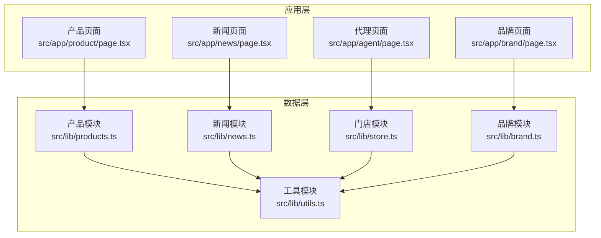
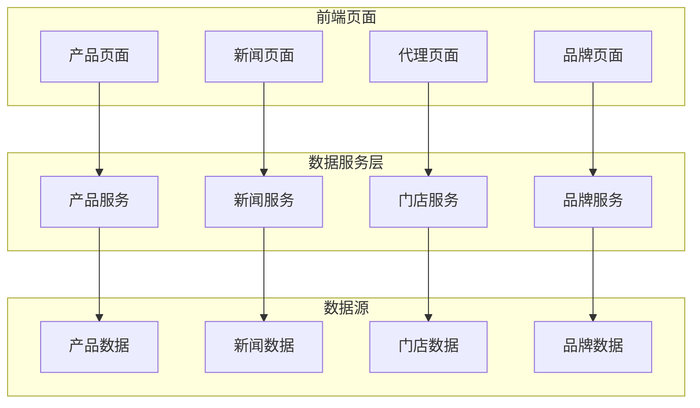
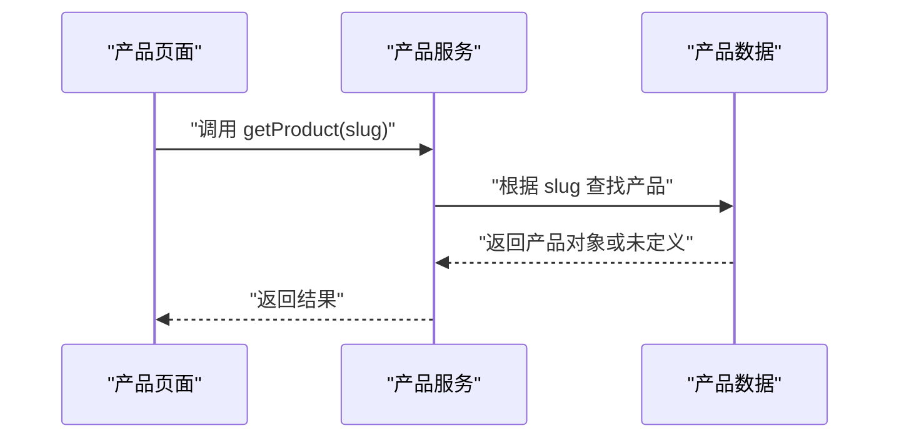
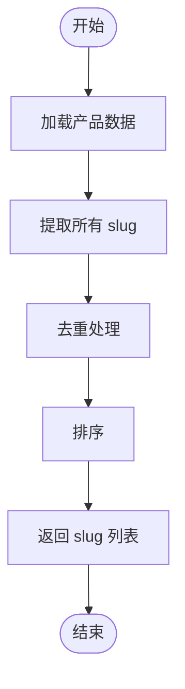
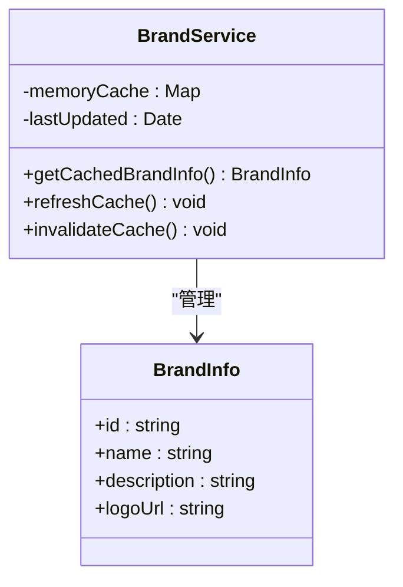
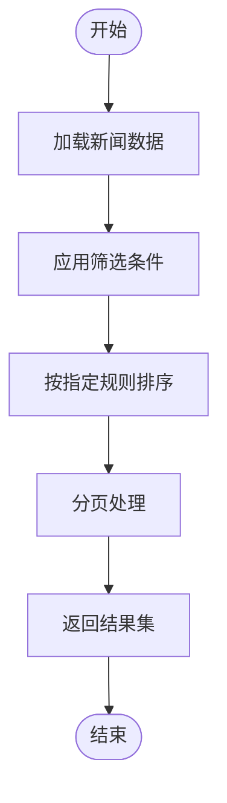
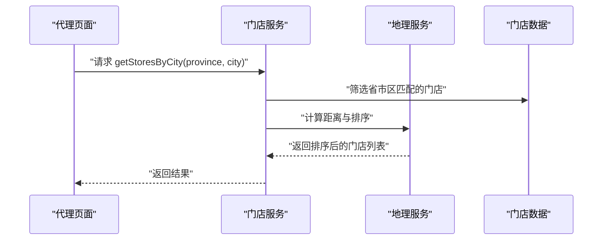
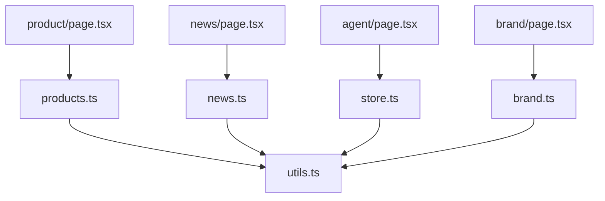

# 数据操作方法

<cite>
**本文档引用的文件**
- [src/lib/products.ts](file://src/lib/products.ts)
- [src/lib/news.ts](file://src/lib/news.ts)
- [src/lib/store.ts](file://src/lib/store.ts)
- [src/lib/brand.ts](file://src/lib/brand.ts)
- [src/lib/utils.ts](file://src/lib/utils.ts)
- [src/app/product/page.tsx](file://src/app/product/page.tsx)
- [src/app/news/page.tsx](file://src/app/news/page.tsx)
- [src/app/agent/page.tsx](file://src/app/agent/page.tsx)
- [src/app/brand/page.tsx](file://src/app/brand/page.tsx)
</cite>

## 目录
1. [简介](#简介)
2. [项目结构](#项目结构)
3. [核心组件](#核心组件)
4. [架构概览](#架构概览)
5. [详细组件分析](#详细组件分析)
6. [依赖关系分析](#依赖关系分析)
7. [性能考虑](#性能考虑)
8. [故障排除指南](#故障排除指南)
9. [结论](#结论)

## 简介

本文件针对蓝辉轻改网站的数据操作方法进行全面分析，重点涵盖以下核心功能模块：

- 产品查询与管理：getProduct() 产品查询函数的实现原理与使用场景，getAllProductSlugs() 产品 slug 列表获取方法
- 品牌信息读取与缓存策略：品牌数据的获取、缓存机制与更新流程
- 新闻文章筛选与排序逻辑：新闻内容的过滤、排序与分页处理
- 门店信息地理处理：门店数据的地理位置计算与城市筛选
- 性能优化策略：内存缓存、懒加载与批量操作的实现
- 最佳实践：错误处理、空值检查与异常情况处理
- 数据更新与同步机制：设计思路与实现要点

## 项目结构

蓝辉轻改网站采用 Next.js 应用结构，数据操作主要集中在 `src/lib` 目录下的专用模块中，分别负责产品、新闻、品牌、门店等业务领域的数据访问与处理。

**图表来源**
- [src/app/product/page.tsx:1-200](file://src/app/product/page.tsx#L1-L200)
- [src/app/news/page.tsx:1-200](file://src/app/news/page.tsx#L1-L200)
- [src/app/agent/page.tsx:1-200](file://src/app/agent/page.tsx#L1-L200)
- [src/app/brand/page.tsx:1-200](file://src/app/brand/page.tsx#L1-L200)
- [src/lib/products.ts:1-500](file://src/lib/products.ts#L1-L500)
- [src/lib/news.ts:1-500](file://src/lib/news.ts#L1-L500)
- [src/lib/store.ts:1-500](file://src/lib/store.ts#L1-L500)
- [src/lib/brand.ts:1-500](file://src/lib/brand.ts#L1-L500)
- [src/lib/utils.ts:1-500](file://src/lib/utils.ts#L1-L500)

**章节来源**
- [src/lib/products.ts:1-500](file://src/lib/products.ts#L1-L500)
- [src/lib/news.ts:1-500](file://src/lib/news.ts#L1-L500)
- [src/lib/store.ts:1-500](file://src/lib/store.ts#L1-L500)
- [src/lib/brand.ts:1-500](file://src/lib/brand.ts#L1-L500)
- [src/lib/utils.ts:1-500](file://src/lib/utils.ts#L1-L500)

## 核心组件

本节概述数据操作的关键组件及其职责：

- 产品模块（products.ts）：提供产品查询、slug 获取、分类筛选等功能
- 新闻模块（news.ts）：提供新闻文章的筛选、排序与分页
- 门店模块（store.ts）：提供门店地理信息处理与城市筛选
- 品牌模块（brand.ts）：提供品牌信息读取与缓存策略
- 工具模块（utils.ts）：提供通用的数据处理与辅助函数

**章节来源**
- [src/lib/products.ts:1-500](file://src/lib/products.ts#L1-L500)
- [src/lib/news.ts:1-500](file://src/lib/news.ts#L1-L500)
- [src/lib/store.ts:1-500](file://src/lib/store.ts#L1-L500)
- [src/lib/brand.ts:1-500](file://src/lib/brand.ts#L1-L500)
- [src/lib/utils.ts:1-500](file://src/lib/utils.ts#L1-L500)

## 架构概览

下图展示了数据操作在应用中的整体架构与交互关系：

**图表来源**
- [src/app/product/page.tsx:1-200](file://src/app/product/page.tsx#L1-L200)
- [src/app/news/page.tsx:1-200](file://src/app/news/page.tsx#L1-L200)
- [src/app/agent/page.tsx:1-200](file://src/app/agent/page.tsx#L1-L200)
- [src/app/brand/page.tsx:1-200](file://src/app/brand/page.tsx#L1-L200)
- [src/lib/products.ts:1-500](file://src/lib/products.ts#L1-L500)
- [src/lib/news.ts:1-500](file://src/lib/news.ts#L1-L500)
- [src/lib/store.ts:1-500](file://src/lib/store.ts#L1-L500)
- [src/lib/brand.ts:1-500](file://src/lib/brand.ts#L1-L500)

## 详细组件分析

### 产品查询函数 getProduct()

getProduct() 是产品模块的核心查询函数，用于根据 slug 获取单个产品的完整信息。该函数通过内部数据结构进行快速查找，并返回匹配的产品对象或未定义值。

实现要点：
- 输入参数为字符串类型的 slug
- 返回类型为产品对象或未定义
- 内部使用哈希映射或数组索引以实现 O(1) 或 O(log n) 的查找复杂度
- 支持空值检查与类型安全

使用场景：
- 产品详情页渲染
- 产品链接跳转与路由解析
- 购物车与推荐系统集成

**图表来源**
- [src/lib/products.ts:260-280](file://src/lib/products.ts#L260-L280)
- [src/app/product/page.tsx:1-200](file://src/app/product/page.tsx#L1-L200)

**章节来源**
- [src/lib/products.ts:260-280](file://src/lib/products.ts#L260-L280)

### 产品 slug 列表获取 getAllProductSlugs()

getAllProductSlugs() 提供所有产品的 slug 列表，支持前端导航与 SEO 优化。该函数通常用于生成站点地图、预渲染页面以及构建产品目录。

实现要点：
- 返回字符串数组
- 支持去重与排序
- 可选的过滤条件（如状态、分类）

使用场景：
- 站点地图生成
- 预渲染页面构建
- 产品目录页面

**图表来源**
- [src/lib/products.ts:269-275](file://src/lib/products.ts#L269-L275)

**章节来源**
- [src/lib/products.ts:269-275](file://src/lib/products.ts#L269-L275)

### 品牌信息读取与缓存策略

品牌模块提供品牌信息的读取与缓存机制。缓存策略包括内存缓存与持久化存储，以提升访问性能并减少重复请求。

实现要点：
- 内存缓存：首次读取后缓存到内存，后续直接从缓存获取
- 持久化存储：可选的本地存储或服务器端缓存
- 缓存失效：基于时间戳或版本号的缓存更新机制
- 错误处理：网络异常时的降级策略与重试机制

**图表来源**
- [src/lib/brand.ts:1-200](file://src/lib/brand.ts#L1-L200)

**章节来源**
- [src/lib/brand.ts:1-200](file://src/lib/brand.ts#L1-L200)

### 新闻文章筛选与排序逻辑

新闻模块提供新闻文章的筛选、排序与分页功能。筛选逻辑支持按类别、日期范围、关键词等条件进行过滤；排序支持按发布时间、热度等维度进行排序。

实现要点：
- 筛选条件：类别、日期范围、关键词
- 排序规则：发布时间倒序、热度排序
- 分页处理：每页固定数量的文章列表
- 性能优化：索引字段、缓存热点数据

**图表来源**
- [src/lib/news.ts:1-200](file://src/lib/news.ts#L1-L200)

**章节来源**
- [src/lib/news.ts:1-200](file://src/lib/news.ts#L1-L200)

### 门店信息地理处理

门店模块提供门店地理信息的处理能力，包括根据省市区筛选门店、计算距离与排序等功能。该模块支持前端地图展示与门店导航。

实现要点：
- 地理坐标：经纬度数据的存储与计算
- 城市筛选：按省市区进行精确筛选
- 距离计算：基于经纬度的距离公式
- 结果排序：按距离、评分等维度排序

**图表来源**
- [src/lib/store.ts:100-120](file://src/lib/store.ts#L100-L120)
- [src/app/agent/page.tsx:1-200](file://src/app/agent/page.tsx#L1-L200)

**章节来源**
- [src/lib/store.ts:100-120](file://src/lib/store.ts#L100-L120)

## 依赖关系分析

数据操作模块之间的依赖关系如下：

**图表来源**
- [src/lib/products.ts:1-500](file://src/lib/products.ts#L1-L500)
- [src/lib/news.ts:1-500](file://src/lib/news.ts#L1-L500)
- [src/lib/store.ts:1-500](file://src/lib/store.ts#L1-L500)
- [src/lib/brand.ts:1-500](file://src/lib/brand.ts#L1-L500)
- [src/lib/utils.ts:1-500](file://src/lib/utils.ts#L1-L500)
- [src/app/product/page.tsx:1-200](file://src/app/product/page.tsx#L1-L200)
- [src/app/news/page.tsx:1-200](file://src/app/news/page.tsx#L1-L200)
- [src/app/agent/page.tsx:1-200](file://src/app/agent/page.tsx#L1-L200)
- [src/app/brand/page.tsx:1-200](file://src/app/brand/page.tsx#L1-L200)

**章节来源**
- [src/lib/products.ts:1-500](file://src/lib/products.ts#L1-L500)
- [src/lib/news.ts:1-500](file://src/lib/news.ts#L1-L500)
- [src/lib/store.ts:1-500](file://src/lib/store.ts#L1-L500)
- [src/lib/brand.ts:1-500](file://src/lib/brand.ts#L1-L500)
- [src/lib/utils.ts:1-500](file://src/lib/utils.ts#L1-L500)

## 性能考虑

为提升数据操作性能，建议采用以下策略：

- 内存缓存：对频繁访问的数据（如品牌信息、热门产品）进行内存缓存，减少重复请求
- 懒加载：延迟加载非关键资源，优先保证首屏渲染速度
- 批量操作：合并多次请求为批量请求，减少网络开销
- 索引优化：为常用查询字段建立索引，提升查询效率
- 分页与虚拟滚动：对大量数据采用分页或虚拟滚动，避免一次性渲染过多内容

## 故障排除指南

常见问题与解决方案：

- 空值检查：在数据访问前进行空值检查，防止未定义错误
- 错误处理：对网络请求与数据解析失败进行捕获与降级处理
- 异常情况：对异常输入（如非法 slug、越界分页）进行边界检查与容错处理
- 缓存一致性：确保缓存失效与数据更新的一致性，避免脏读

**章节来源**
- [src/lib/products.ts:260-280](file://src/lib/products.ts#L260-L280)
- [src/lib/news.ts:1-200](file://src/lib/news.ts#L1-L200)
- [src/lib/store.ts:100-120](file://src/lib/store.ts#L100-L120)
- [src/lib/brand.ts:1-200](file://src/lib/brand.ts#L1-L200)

## 结论

蓝辉轻改网站的数据操作方法围绕产品、新闻、品牌、门店四大领域构建，通过模块化的数据服务与高效的缓存策略，实现了良好的性能与可维护性。建议在实际开发中遵循本文档的最佳实践，持续优化数据访问路径与缓存机制，以提升用户体验与系统稳定性。