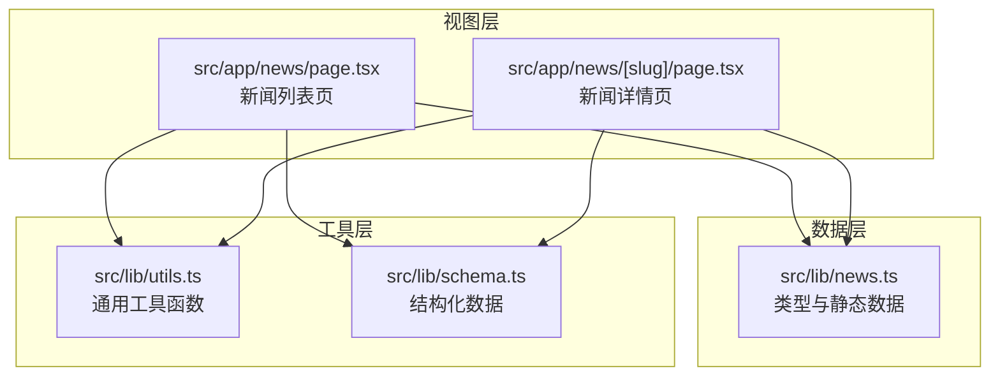
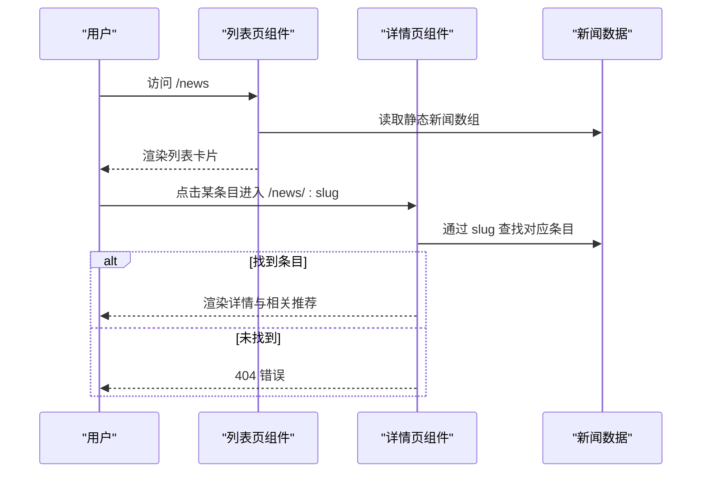
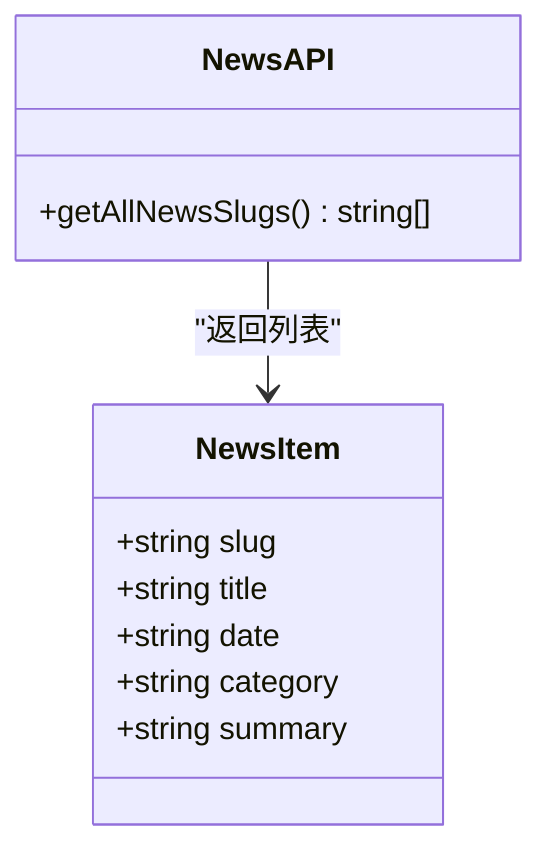
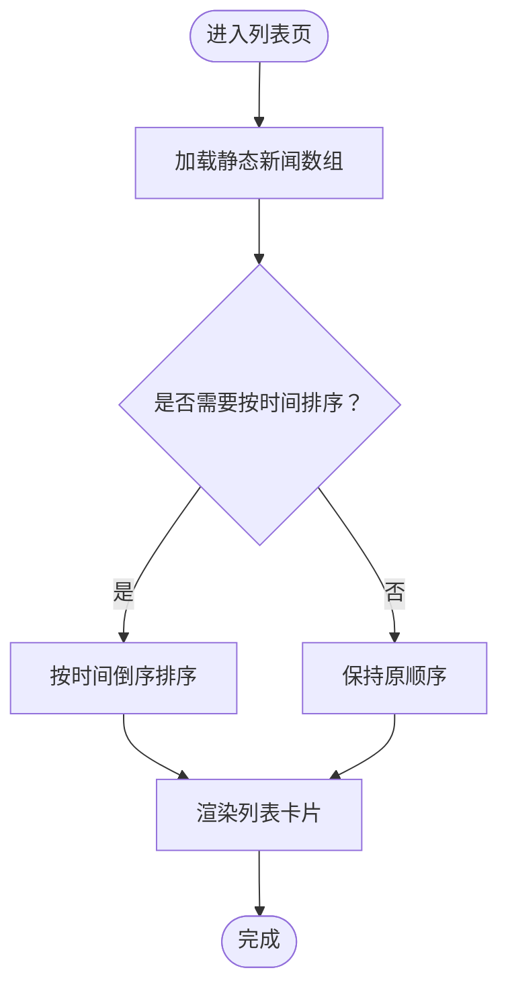
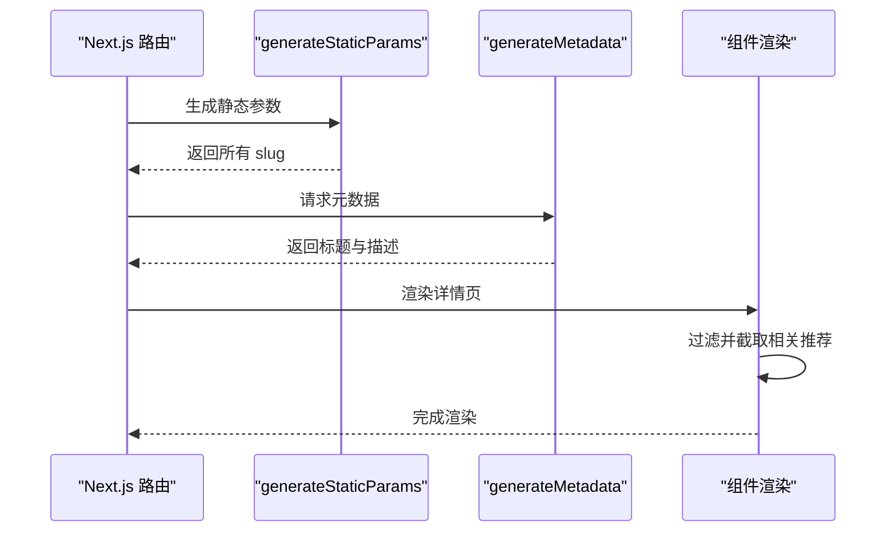
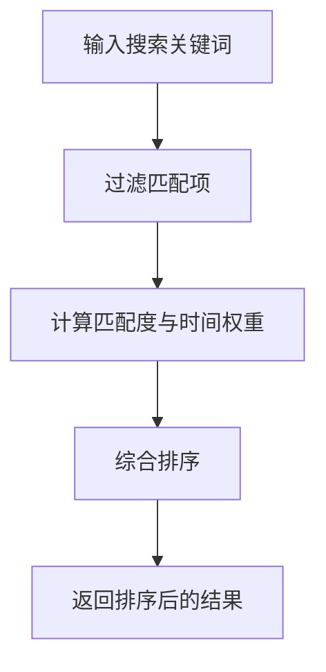
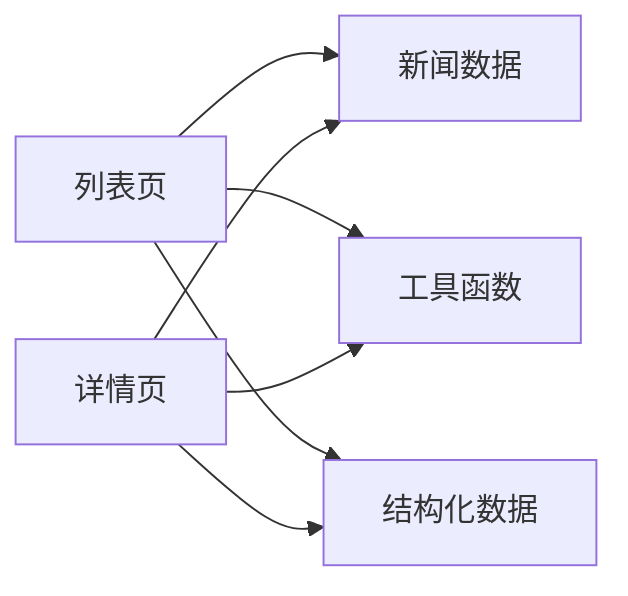

# 新闻数据操作

<cite>
**本文档引用的文件**
- [src/lib/news.ts](file://src/lib/news.ts)
- [src/app/news/page.tsx](file://src/app/news/page.tsx)
- [src/app/news/[slug]/page.tsx](file://src/app/news/[slug]/page.tsx)
- [src/lib/utils.ts](file://src/lib/utils.ts)
- [src/lib/schema.ts](file://src/lib/schema.ts)
</cite>

## 目录
1. [简介](#简介)
2. [项目结构](#项目结构)
3. [核心组件](#核心组件)
4. [架构概览](#架构概览)
5. [详细组件分析](#详细组件分析)
6. [依赖分析](#依赖分析)
7. [性能考虑](#性能考虑)
8. [故障排除指南](#故障排除指南)
9. [结论](#结论)

## 简介
本文件面向新闻数据操作的实现，基于当前代码库中的静态新闻内容系统，提供从数据模型设计、筛选排序分页机制、搜索功能、分类系统到增删改查操作示例与性能优化策略的完整说明。当前实现采用静态数据源，后续可平滑扩展至动态数据库与全文检索。

## 项目结构
新闻功能由三层组成：
- 数据层：静态新闻数据与类型定义
- 视图层：新闻列表页与详情页
- 工具层：通用工具函数与结构化数据支持

**图表来源**
- [src/lib/news.ts:1-46](file://src/lib/news.ts#L1-L46)
- [src/app/news/page.tsx:1-77](file://src/app/news/page.tsx#L1-L77)
- [src/app/news/[slug]/page.tsx:1-181](file://src/app/news/[slug]/page.tsx#L1-L181)
- [src/lib/utils.ts:1-7](file://src/lib/utils.ts#L1-L7)
- [src/lib/schema.ts:1-70](file://src/lib/schema.ts#L1-L70)

**章节来源**
- [src/lib/news.ts:1-46](file://src/lib/news.ts#L1-L46)
- [src/app/news/page.tsx:1-77](file://src/app/news/page.tsx#L1-L77)
- [src/app/news/[slug]/page.tsx:1-181](file://src/app/news/[slug]/page.tsx#L1-L181)
- [src/lib/utils.ts:1-7](file://src/lib/utils.ts#L1-L7)
- [src/lib/schema.ts:1-70](file://src/lib/schema.ts#L1-L70)

## 核心组件
- 新闻数据模型：包含标识符、标题、日期、分类、摘要等字段，用于统一描述新闻条目。
- 列表页组件：渲染新闻列表，展示日期、分类标签、标题与摘要，并提供跳转到详情页的链接。
- 详情页组件：根据 slug 动态渲染单篇新闻，展示完整信息与相关推荐。
- 工具函数：提供类名合并等通用能力，便于样式组合。
- 结构化数据：输出组织、产品等 JSON-LD，提升 SEO 友好度。

**章节来源**
- [src/lib/news.ts:8-14](file://src/lib/news.ts#L8-L14)
- [src/app/news/page.tsx:37-65](file://src/app/news/page.tsx#L37-L65)
- [src/app/news/[slug]/page.tsx:27-34](file://src/app/news/[slug]/page.tsx#L27-L34)
- [src/lib/utils.ts:4-6](file://src/lib/utils.ts#L4-L6)
- [src/lib/schema.ts:11-38](file://src/lib/schema.ts#L11-L38)

## 架构概览
新闻系统采用“静态数据 + Next.js 路由”的轻量架构：
- 列表页通过导入静态数据进行渲染；
- 详情页通过动态路由参数 slug 匹配对应条目；
- 相关推荐在客户端侧按同分类（当前为全量过滤）与排除自身后截取前若干条；
- SEO 通过结构化数据增强。

**图表来源**
- [src/app/news/page.tsx:37-65](file://src/app/news/page.tsx#L37-L65)
- [src/app/news/[slug]/page.tsx:9-34](file://src/app/news/[slug]/page.tsx#L9-L34)
- [src/lib/news.ts:16-41](file://src/lib/news.ts#L16-L41)

## 详细组件分析

### 新闻数据模型与静态数据
- 数据模型字段
  - 标识符：slug（URL 友好）
  - 标题：title
  - 发布时间：date（字符串占位，当前使用年份）
  - 分类：category（如品牌动态、门店动态、产品动态）
  - 摘要：summary（用于列表与 SEO 描述）
- 静态数据：newsItems 数组包含多条新闻条目，提供 slug、title、date、category、summary 字段。

**图表来源**
- [src/lib/news.ts:8-14](file://src/lib/news.ts#L8-L14)
- [src/lib/news.ts:43-45](file://src/lib/news.ts#L43-L45)

**章节来源**
- [src/lib/news.ts:8-14](file://src/lib/news.ts#L8-L14)
- [src/lib/news.ts:16-41](file://src/lib/news.ts#L16-L41)
- [src/lib/news.ts:43-45](file://src/lib/news.ts#L43-L45)

### 新闻列表页（筛选、排序与分页）
- 筛选：当前实现直接渲染全部新闻，未进行分类或关键词筛选。
- 排序：默认按静态数组顺序渲染；如需按时间倒序，可在渲染前对数组进行排序。
- 分页：当前未实现分页；可通过切片方式限制每页数量并生成分页链接。

**图表来源**
- [src/app/news/page.tsx:37-65](file://src/app/news/page.tsx#L37-L65)
- [src/lib/news.ts:16-41](file://src/lib/news.ts#L16-L41)

**章节来源**
- [src/app/news/page.tsx:37-65](file://src/app/news/page.tsx#L37-L65)
- [src/lib/news.ts:16-41](file://src/lib/news.ts#L16-L41)

### 新闻详情页（路由与相关推荐）
- 动态路由：generateStaticParams 基于 getAllNewsSlugs 生成静态路径参数，提升构建期优化。
- 元数据：generateMetadata 根据条目动态生成标题与描述，增强 SEO。
- 相关推荐：过滤掉当前条目后取前若干条作为“相关资讯”。

**图表来源**
- [src/app/news/[slug]/page.tsx:9-25](file://src/app/news/[slug]/page.tsx#L9-L25)
- [src/app/news/[slug]/page.tsx:36-39](file://src/app/news/[slug]/page.tsx#L36-L39)
- [src/lib/news.ts:43-45](file://src/lib/news.ts#L43-L45)

**章节来源**
- [src/app/news/[slug]/page.tsx:9-25](file://src/app/news/[slug]/page.tsx#L9-L25)
- [src/app/news/[slug]/page.tsx:36-39](file://src/app/news/[slug]/page.tsx#L36-L39)
- [src/lib/news.ts:43-45](file://src/lib/news.ts#L43-L45)

### 搜索功能（关键词匹配、全文检索与排序）
- 当前实现：未提供搜索输入与后端检索逻辑。
- 建议方案：
  - 前端过滤：在渲染前对 title 与 summary 进行大小写无关的包含匹配。
  - 全文检索：引入轻量索引（如 Fuse.js）或服务端全文检索（如 PostgreSQL 全文搜索）。
  - 结果排序：按匹配度与时间综合评分排序。

[此图为概念性流程图，不直接映射具体源码文件]

### 新闻分类系统（层级、标签管理与内容关联）
- 分类字段：category 为字符串，当前值包括“品牌动态”、“门店动态”、“产品动态”。
- 层级建议：可扩展为树形结构（如一级分类：品牌/产品/门店；二级子类），但当前实现为扁平标签。
- 标签管理：可在 UI 中按分类筛选，或在路由中增加查询参数进行过滤。
- 内容关联：相关推荐当前按“非自身条目”简单实现，可改为同分类或语义相似度更高的条目。

**章节来源**
- [src/lib/news.ts:12](file://src/lib/news.ts#L12)
- [src/app/news/[slug]/page.tsx:37-39](file://src/app/news/[slug]/page.tsx#L37-L39)

### 增删改查操作示例（含验证、富文本与媒体）
- 查询：通过 slug 查找条目；列表页遍历数组；相关推荐过滤并截取。
- 创建：在静态数组中新增对象；后续可接入表单校验与持久化存储。
- 更新：替换数组中对应条目的字段；注意 slug 的唯一性与路由一致性。
- 删除：从数组中移除对应条目；同时清理静态参数生成与路由映射。
- 数据验证：可引入 Zod 等模式校验库，确保字段完整性与类型正确。
- 富文本处理：当前摘要为纯文本；若扩展富文本，建议使用安全的富文本编辑器与渲染库，并严格过滤 HTML。
- 媒体资源：可在数据模型中增加图片、视频等字段，并在详情页中渲染。

**章节来源**
- [src/lib/news.ts:16-41](file://src/lib/news.ts#L16-L41)
- [src/app/news/[slug]/page.tsx:37-39](file://src/app/news/[slug]/page.tsx#L37-L39)

### 缓存策略与性能优化
- 构建期优化：利用 generateStaticParams 生成静态路由参数，减少运行时计算。
- 客户端渲染优化：使用 React.memo 或 useMemo 缓存列表项与相关推荐计算。
- 图片与媒体：采用现代图片格式与懒加载策略，结合 CDN 加速。
- SEO 优化：通过 generateMetadata 输出页面标题与描述；使用结构化数据（JSON-LD）增强搜索引擎理解。
- 性能监控：在生产环境启用性能指标采集，关注首屏渲染与交互延迟。

**章节来源**
- [src/app/news/[slug]/page.tsx:9-25](file://src/app/news/[slug]/page.tsx#L9-L25)
- [src/lib/schema.ts:11-38](file://src/lib/schema.ts#L11-L38)

## 依赖分析
- 组件耦合关系
  - 列表页依赖新闻数据模块以渲染列表。
  - 详情页依赖新闻数据模块以查找条目与生成元数据。
  - 工具函数被两个页面共享，用于样式合并等通用逻辑。
  - 结构化数据模块独立提供 JSON-LD 输出，与页面解耦。

**图表来源**
- [src/app/news/page.tsx:6](file://src/app/news/page.tsx#L6)
- [src/app/news/[slug]/page.tsx:7](file://src/app/news/[slug]/page.tsx#L7)
- [src/lib/news.ts:16-41](file://src/lib/news.ts#L16-L41)
- [src/lib/utils.ts:4-6](file://src/lib/utils.ts#L4-L6)
- [src/lib/schema.ts:11-38](file://src/lib/schema.ts#L11-L38)

**章节来源**
- [src/app/news/page.tsx:6](file://src/app/news/page.tsx#L6)
- [src/app/news/[slug]/page.tsx:7](file://src/app/news/[slug]/page.tsx#L7)
- [src/lib/news.ts:16-41](file://src/lib/news.ts#L16-L41)
- [src/lib/utils.ts:4-6](file://src/lib/utils.ts#L4-L6)
- [src/lib/schema.ts:11-38](file://src/lib/schema.ts#L11-L38)

## 性能考虑
- 列表渲染：避免在渲染过程中进行昂贵计算；可将过滤与排序逻辑前置到数据准备阶段。
- 相关推荐：限制推荐数量并缓存计算结果，减少重复过滤。
- 路由参数：使用静态参数生成减少运行时开销。
- 资源加载：优先使用现代图片格式与懒加载，配合 CDN 提升加载速度。
- SEO：结构化数据与动态元数据有助于搜索引擎抓取与索引。

[本节为通用性能指导，无需特定文件引用]

## 故障排除指南
- 404 页面：当 slug 不存在时，详情页调用 notFound 触发 404。
- 数据不一致：更新新闻条目后，需同步更新静态参数生成与路由映射。
- SEO 异常：检查 generateMetadata 是否正确返回标题与描述；确认结构化数据输出无误。

**章节来源**
- [src/app/news/[slug]/page.tsx:33-34](file://src/app/news/[slug]/page.tsx#L33-L34)
- [src/app/news/[slug]/page.tsx:20-24](file://src/app/news/[slug]/page.tsx#L20-L24)
- [src/lib/schema.ts:11-38](file://src/lib/schema.ts#L11-L38)

## 结论
当前新闻系统以静态数据为核心，结构简洁、易于维护。建议在保持现有架构优势的同时，逐步引入搜索、分类层级、富文本与媒体资源管理，并通过缓存与 SEO 优化进一步提升用户体验与性能表现。