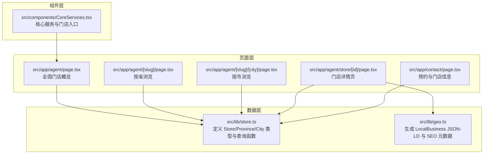
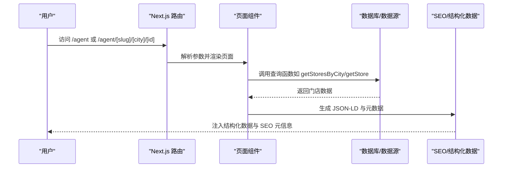
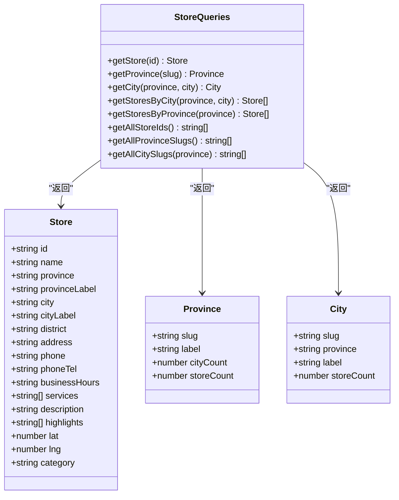
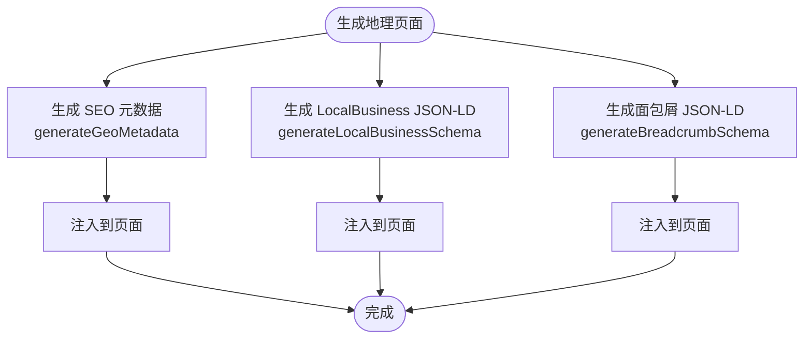
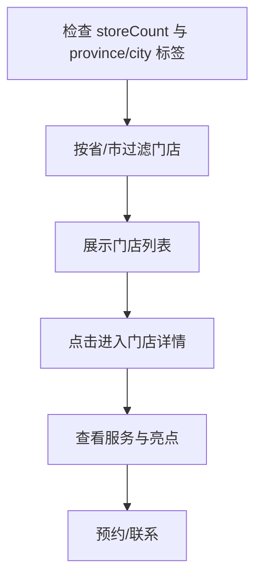
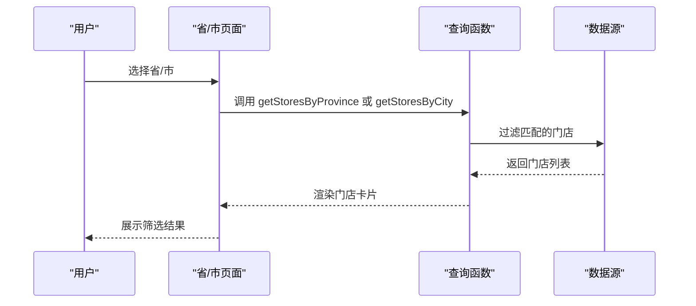
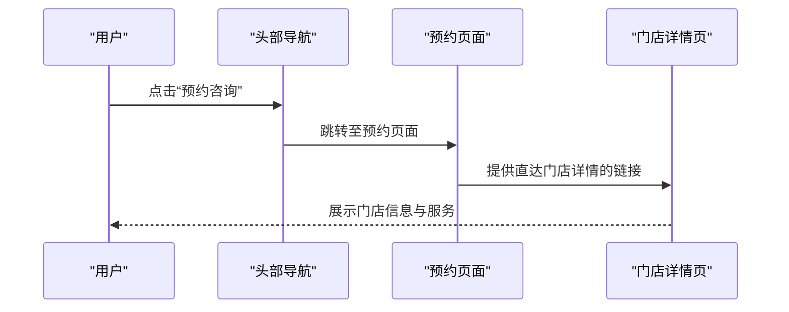
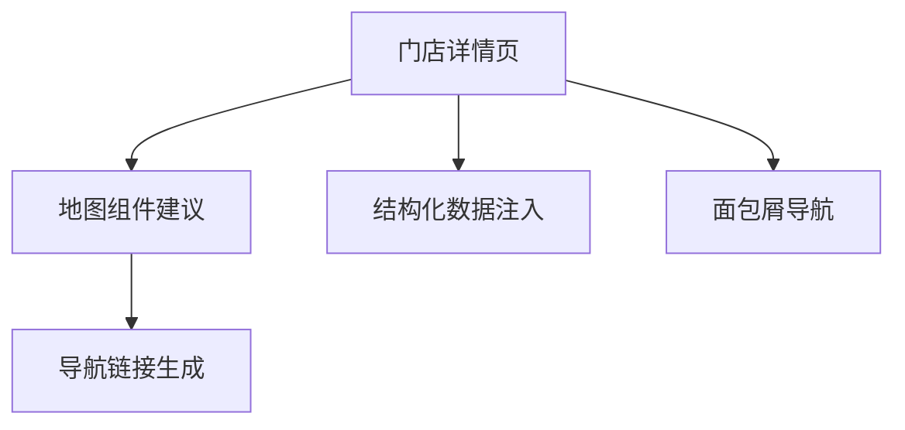
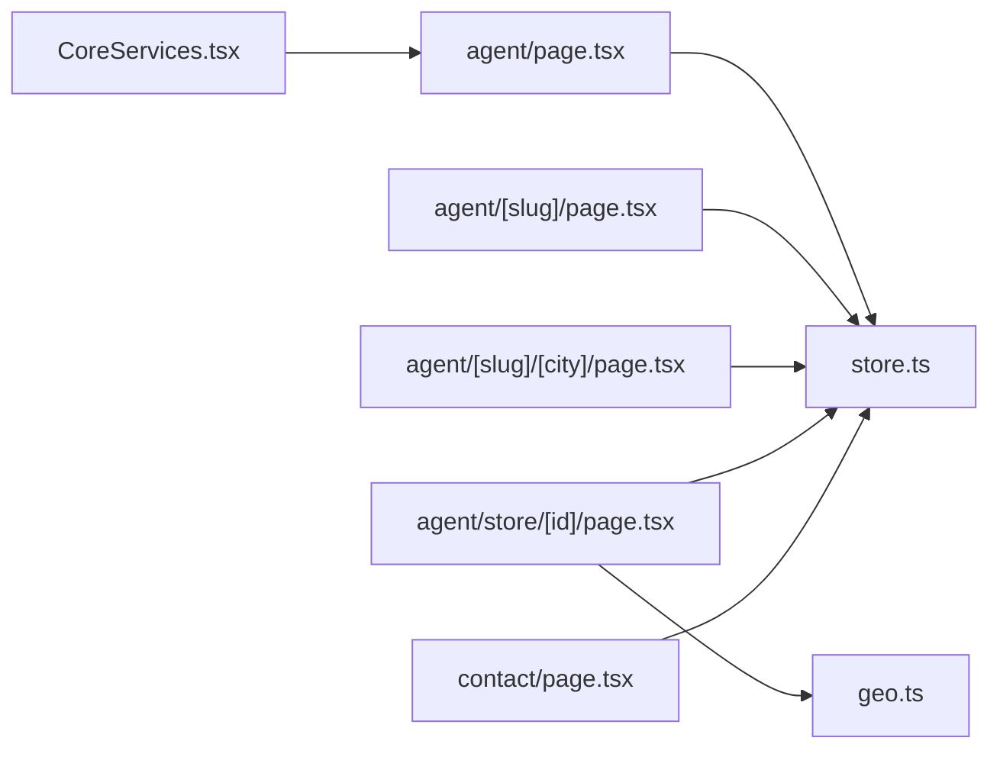

# 门店数据操作

<cite>
**本文档引用的文件**
- [src/lib/store.ts](file://src/lib/store.ts)
- [src/lib/geo.ts](file://src/lib/geo.ts)
- [src/app/agent/page.tsx](file://src/app/agent/page.tsx)
- [src/app/agent/[slug]/page.tsx](file://src/app/agent/[slug]/page.tsx)
- [src/app/agent/[slug]/[city]/page.tsx](file://src/app/agent/[slug]/[city]/page.tsx)
- [src/app/agent/store/[id]/page.tsx](file://src/app/agent/store/[id]/page.tsx)
- [src/components/CoreServices.tsx](file://src/components/CoreServices.tsx)
- [src/app/contact/page.tsx](file://src/app/contact/page.tsx)
</cite>

## 目录
1. [简介](#简介)
2. [项目结构](#项目结构)
3. [核心组件](#核心组件)
4. [架构总览](#架构总览)
5. [详细组件分析](#详细组件分析)
6. [依赖关系分析](#依赖关系分析)
7. [性能考虑](#性能考虑)
8. [故障排除指南](#故障排除指南)
9. [结论](#结论)
10. [附录](#附录)

## 简介
本文件面向门店数据操作的综合文档，聚焦于蓝辉轻改门店数据模型、地理信息系统集成、多门店管理机制、查询接口设计以及与预约系统的集成与可视化展示。当前系统处于第一阶段，仅包含真实门店数据，不虚构全国门店数量，确保信息真实可靠。

## 项目结构
本项目采用 Next.js App Router 结构，门店相关逻辑主要分布在以下模块：
- 数据层：src/lib/store.ts 定义门店数据模型与基础查询函数；src/lib/geo.ts 提供地理页面的 SEO 和结构化数据支持。
- 页面层：src/app/agent/* 下的页面负责按省/市/门店详情的展示与导航；src/app/agent/store/[id]/page.tsx 展示具体门店详情。
- 组件层：src/components/CoreServices.tsx 展示核心服务与门店入口；src/app/contact/page.tsx 提供预约入口与门店信息展示。

**图表来源**
- [src/lib/store.ts:1-122](file://src/lib/store.ts#L1-L122)
- [src/lib/geo.ts:1-100](file://src/lib/geo.ts#L1-L100)
- [src/app/agent/page.tsx:1-125](file://src/app/agent/page.tsx#L1-L125)
- [src/app/agent/[slug]/page.tsx:1-134](file://src/app/agent/[slug]/page.tsx#L1-L134)
- [src/app/agent/[slug]/[city]/page.tsx:1-136](file://src/app/agent/[slug]/[city]/page.tsx#L1-L136)
- [src/app/agent/store/[id]/page.tsx:1-226](file://src/app/agent/store/[id]/page.tsx#L1-L226)
- [src/components/CoreServices.tsx:1-89](file://src/components/CoreServices.tsx#L1-L89)
- [src/app/contact/page.tsx:163-189](file://src/app/contact/page.tsx#L163-L189)

**章节来源**
- [src/lib/store.ts:1-122](file://src/lib/store.ts#L1-L122)
- [src/lib/geo.ts:1-100](file://src/lib/geo.ts#L1-L100)
- [src/app/agent/page.tsx:1-125](file://src/app/agent/page.tsx#L1-L125)
- [src/app/agent/[slug]/page.tsx:1-134](file://src/app/agent/[slug]/page.tsx#L1-L134)
- [src/app/agent/[slug]/[city]/page.tsx:1-136](file://src/app/agent/[slug]/[city]/page.tsx#L1-L136)
- [src/app/agent/store/[id]/page.tsx:1-226](file://src/app/agent/store/[id]/page.tsx#L1-L226)
- [src/components/CoreServices.tsx:1-89](file://src/components/CoreServices.tsx#L1-L89)
- [src/app/contact/page.tsx:163-189](file://src/app/contact/page.tsx#L163-L189)

## 核心组件
- 门店数据模型（Store）：包含 id、名称、省市区 slug 与标签、地址、电话、营业时间、服务清单、描述、亮点、经纬度预留字段与门店类型等。
- 省份与城市索引：Province 与 City 类型用于构建导航与筛选。
- 查询函数：提供按 id、省、市、省市区组合查询门店列表的能力，并导出所有 id/slug 列表以支持静态参数生成。

**章节来源**
- [src/lib/store.ts:8-26](file://src/lib/store.ts#L8-L26)
- [src/lib/store.ts:59-89](file://src/lib/store.ts#L59-L89)
- [src/lib/store.ts:91-121](file://src/lib/store.ts#L91-L121)

## 架构总览
系统采用“数据层 + 页面层 + 组件层”的分层架构：
- 数据层通过 store.ts 提供类型与查询能力，geo.ts 提供地理页面的 SEO 与结构化数据。
- 页面层根据路由参数动态加载数据，生成静态参数以优化 SEO。
- 组件层复用核心服务入口，引导用户至门店与预约流程。

**图表来源**
- [src/app/agent/[slug]/[city]/page.tsx:38-46](file://src/app/agent/[slug]/[city]/page.tsx#L38-L46)
- [src/app/agent/store/[id]/page.tsx:36-43](file://src/app/agent/store/[id]/page.tsx#L36-L43)
- [src/lib/store.ts:91-121](file://src/lib/store.ts#L91-L121)
- [src/lib/geo.ts:44-78](file://src/lib/geo.ts#L44-L78)

## 详细组件分析

### 数据模型与查询接口
- 数据模型：Store 定义了地址、联系方式、营业时间、服务与亮点等字段，并预留经纬度与门店类型字段，便于后续地理信息系统扩展。
- 查询接口：提供按 id、省、市、省市区组合查询门店列表，以及导出所有 id/slug 列表，支持静态参数生成与 SEO 优化。

**图表来源**
- [src/lib/store.ts:8-26](file://src/lib/store.ts#L8-L26)
- [src/lib/store.ts:59-89](file://src/lib/store.ts#L59-L89)
- [src/lib/store.ts:91-121](file://src/lib/store.ts#L91-L121)

**章节来源**
- [src/lib/store.ts:1-122](file://src/lib/store.ts#L1-L122)

### 地理信息系统集成
- 结构化数据：generateLocalBusinessSchema 生成 LocalBusiness JSON-LD，包含名称、地址、电话、营业时间、坐标与父组织信息，提升 SEO 与搜索引擎理解。
- 面包屑：generateBreadcrumbSchema 生成 BreadcrumbList JSON-LD，配合页面面包屑导航增强可访问性与 SEO。
- 元数据：generateGeoMetadata 生成动态 SEO 元数据与 canonical URL，支持省/市两级地理页面。

**图表来源**
- [src/lib/geo.ts:17-41](file://src/lib/geo.ts#L17-L41)
- [src/lib/geo.ts:44-78](file://src/lib/geo.ts#L44-L78)
- [src/lib/geo.ts:81-94](file://src/lib/geo.ts#L81-L94)

**章节来源**
- [src/lib/geo.ts:1-100](file://src/lib/geo.ts#L1-L100)

### 多门店管理机制
- 门店状态：当前系统仅展示真实开放门店，通过 province/city/storeCount 字段反映开放情况。
- 服务能力：通过 services 与 highlights 字段表达门店提供的服务与特色，便于用户快速识别。
- 服务范围：通过省市区三层结构与 slug 标识，限定服务范围，避免跨区域误导。

**图表来源**
- [src/app/agent/[slug]/page.tsx:77-98](file://src/app/agent/[slug]/page.tsx#L77-L98)
- [src/app/agent/[slug]/[city]/page.tsx:83-118](file://src/app/agent/[slug]/[city]/page.tsx#L83-L118)
- [src/lib/store.ts:59-89](file://src/lib/store.ts#L59-L89)

**章节来源**
- [src/app/agent/[slug]/page.tsx:1-134](file://src/app/agent/[slug]/page.tsx#L1-L134)
- [src/app/agent/[slug]/[city]/page.tsx:1-136](file://src/app/agent/[slug]/[city]/page.tsx#L1-L136)
- [src/lib/store.ts:59-89](file://src/lib/store.ts#L59-L89)

### 查询接口与筛选功能
- 按地区筛选：支持按省、市、省市区组合筛选门店，页面通过路由参数与查询函数实现。
- 营业时间查询：页面直接展示 store.businessHours，便于用户了解营业时间。
- 距离排序：当前未实现距离排序功能，但数据模型预留 lat/lng 字段，为后续扩展提供基础。

**图表来源**
- [src/app/agent/[slug]/page.tsx:39-39](file://src/app/agent/[slug]/page.tsx#L39-L39)
- [src/app/agent/[slug]/[city]/page.tsx:46-46](file://src/app/agent/[slug]/[city]/page.tsx#L46-L46)
- [src/lib/store.ts:103-109](file://src/lib/store.ts#L103-L109)

**章节来源**
- [src/app/agent/[slug]/page.tsx:1-134](file://src/app/agent/[slug]/page.tsx#L1-L134)
- [src/app/agent/[slug]/[city]/page.tsx:1-136](file://src/app/agent/[slug]/[city]/page.tsx#L1-L136)
- [src/lib/store.ts:103-109](file://src/lib/store.ts#L103-L109)

### 与预约系统的集成与实时状态同步
- 集成方式：页面通过预约入口（如导航栏“预约咨询”、联系侧边栏）跳转至预约页面；预约页面提供门店信息展示与直达门店详情的链接。
- 实时状态同步：当前系统为静态数据，未实现预约状态的实时同步。建议后续引入后端服务或第三方预约平台，通过 API 同步状态并在前端展示。

**图表来源**
- [src/components/CoreServices.tsx:22-29](file://src/components/CoreServices.tsx#L22-L29)
- [src/app/contact/page.tsx:163-189](file://src/app/contact/page.tsx#L163-L189)
- [src/app/agent/store/[id]/page.tsx:171-178](file://src/app/agent/store/[id]/page.tsx#L171-L178)

**章节来源**
- [src/components/CoreServices.tsx:1-89](file://src/components/CoreServices.tsx#L1-L89)
- [src/app/contact/page.tsx:163-189](file://src/app/contact/page.tsx#L163-L189)
- [src/app/agent/store/[id]/page.tsx:1-226](file://src/app/agent/store/[id]/page.tsx#L1-L226)

### 可视化展示与地图集成最佳实践
- 可视化展示：页面采用卡片式布局展示门店信息，结合图标与标签突出关键信息；详情页提供服务与亮点列表，增强信息密度与可读性。
- 地图集成：数据模型预留 lat/lng 字段，建议在详情页集成地图组件（如静态地图或交互式地图），并生成导航链接（如高德/百度地图）。
- SEO 优化：通过结构化数据与面包屑 JSON-LD 提升搜索引擎可见性；页面标题与描述根据省/市/门店动态生成。

**图表来源**
- [src/app/agent/store/[id]/page.tsx:147-218](file://src/app/agent/store/[id]/page.tsx#L147-L218)
- [src/lib/geo.ts:44-78](file://src/lib/geo.ts#L44-L78)
- [src/lib/geo.ts:81-94](file://src/lib/geo.ts#L81-L94)

**章节来源**
- [src/app/agent/store/[id]/page.tsx:1-226](file://src/app/agent/store/[id]/page.tsx#L1-L226)
- [src/lib/geo.ts:1-100](file://src/lib/geo.ts#L1-L100)

## 依赖关系分析
- 页面依赖数据层：省/市/门店详情页面均依赖 store.ts 的查询函数；门店详情页额外依赖 geo.ts 的结构化数据生成。
- 组件依赖：核心服务组件提供统一入口，引导用户至门店与预约流程。
- 外部依赖：Next.js App Router、lucide-react 图标库、结构化数据规范（schema.org）。

**图表来源**
- [src/app/agent/page.tsx:6](file://src/app/agent/page.tsx#L6-L6)
- [src/app/agent/[slug]/page.tsx:11](file://src/app/agent/[slug]/page.tsx#L11-L11)
- [src/app/agent/[slug]/[city]/page.tsx:12](file://src/app/agent/[slug]/[city]/page.tsx#L12-L12)
- [src/app/agent/store/[id]/page.tsx:15-L16](file://src/app/agent/store/[id]/page.tsx#L15-L16)
- [src/components/CoreServices.tsx:1-4](file://src/components/CoreServices.tsx#L1-L4)
- [src/app/contact/page.tsx:163-189](file://src/app/contact/page.tsx#L163-L189)

**章节来源**
- [src/app/agent/page.tsx:1-125](file://src/app/agent/page.tsx#L1-L125)
- [src/app/agent/[slug]/page.tsx:1-134](file://src/app/agent/[slug]/page.tsx#L1-L134)
- [src/app/agent/[slug]/[city]/page.tsx:1-136](file://src/app/agent/[slug]/[city]/page.tsx#L1-L136)
- [src/app/agent/store/[id]/page.tsx:1-226](file://src/app/agent/store/[id]/page.tsx#L1-L226)
- [src/components/CoreServices.tsx:1-89](file://src/components/CoreServices.tsx#L1-L89)
- [src/app/contact/page.tsx:163-189](file://src/app/contact/page.tsx#L163-L189)

## 性能考虑
- 静态参数生成：通过 getAllStoreIds/getAllProvinceSlugs/getAllCitySlugs 生成静态参数，减少运行时查询开销。
- 数据缓存：当前为内存数据，建议在生产环境引入缓存策略（如 Redis）或 CDN 加速静态页面。
- 图片与资源：详情页图片采用占位符，建议使用响应式图片与懒加载优化首屏性能。
- SEO 与结构化数据：提前注入 JSON-LD，减少运行时计算成本。

## 故障排除指南
- 门店不存在：当按 id 查询不到门店时，页面返回 404，确保静态参数生成与路由配置正确。
- 省/市参数错误：当省/市 slug 无效时，页面返回 404，检查 slug 是否存在于 provinces/cities。
- 结构化数据缺失：若页面缺少 JSON-LD，检查 generateLocalBusinessSchema/generateBreadcrumbSchema 的调用与注入位置。
- 预约入口异常：检查导航栏与联系页面的链接是否指向正确的预约与门店详情页面。

**章节来源**
- [src/app/agent/store/[id]/page.tsx:42-43](file://src/app/agent/store/[id]/page.tsx#L42-L43)
- [src/app/agent/[slug]/page.tsx:37-39](file://src/app/agent/[slug]/page.tsx#L37-L39)
- [src/app/agent/[slug]/[city]/page.tsx:44-46](file://src/app/agent/[slug]/[city]/page.tsx#L44-L46)
- [src/app/agent/store/[id]/page.tsx:49-68](file://src/app/agent/store/[id]/page.tsx#L49-L68)

## 结论
本系统以真实门店数据为核心，通过清晰的数据模型与页面层分离，实现了按省/市/门店的三级导航与详情展示，并通过结构化数据与 SEO 元数据提升搜索引擎表现。建议后续扩展包括：距离排序、地图集成、预约状态实时同步与缓存优化，以进一步完善用户体验与性能表现。

## 附录
- 数据模型字段说明
  - id：门店唯一标识
  - name：门店名称
  - province/city：拼音 slug
  - provinceLabel/cityLabel：中文标签
  - district/address：区域与详细地址
  - phone/phoneTel：电话与 tel 链接
  - businessHours：营业时间
  - services/highlights：服务与亮点
  - lat/lng：经纬度（预留）
  - category：门店类型（预留）

**章节来源**
- [src/lib/store.ts:8-26](file://src/lib/store.ts#L8-L26)