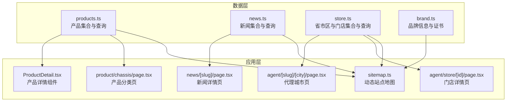
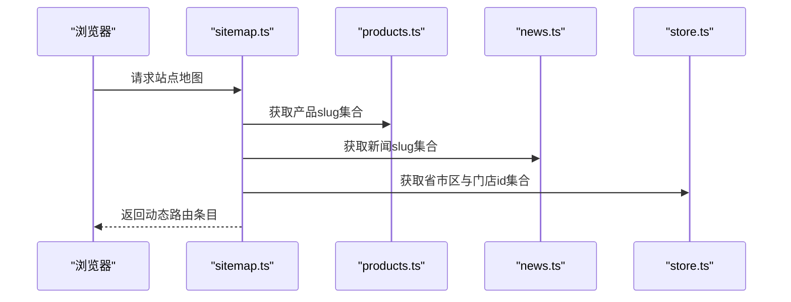
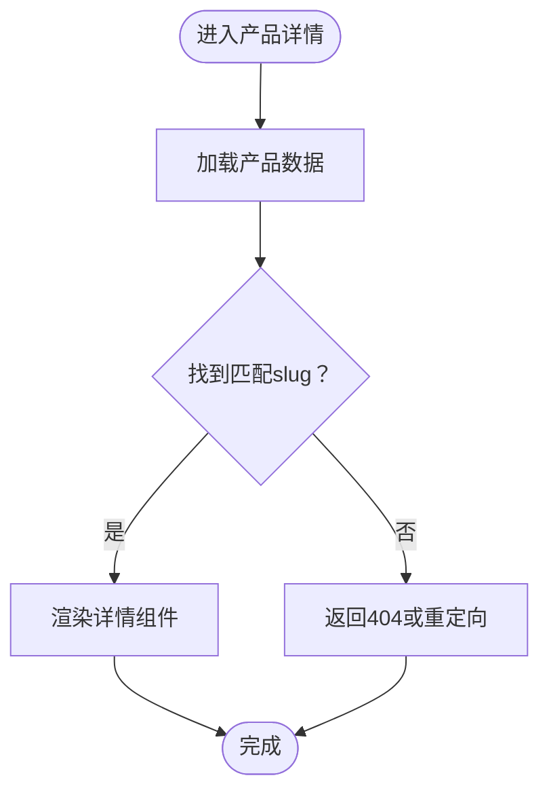
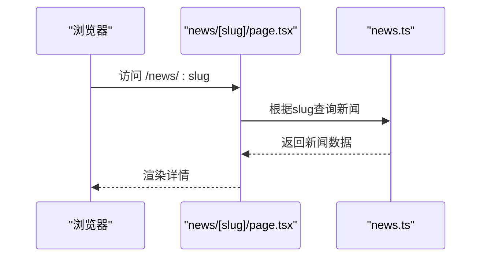
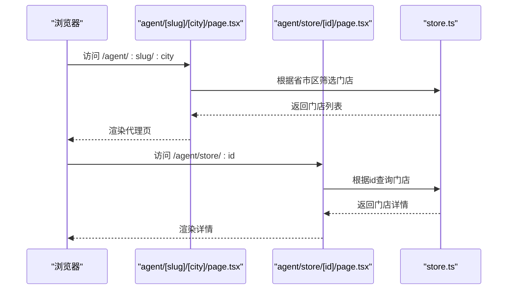
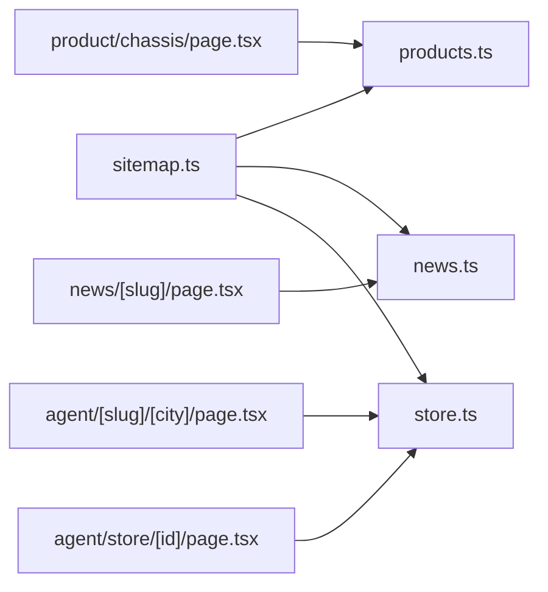

# 数据模型定义

<cite>
**本文引用的文件**
- [src/lib/products.ts](file://src/lib/products.ts)
- [src/lib/news.ts](file://src/lib/news.ts)
- [src/lib/store.ts](file://src/lib/store.ts)
- [src/lib/brand.ts](file://src/lib/brand.ts)
- [src/app/sitemap.ts](file://src/app/sitemap.ts)
- [src/components/ProductDetail.tsx](file://src/components/ProductDetail.tsx)
- [src/app/product/chassis/page.tsx](file://src/app/product/chassis/page.tsx)
- [src/app/news/[slug]/page.tsx](file://src/app/news/[slug]/page.tsx)
- [src/app/agent/[slug]/[city]/page.tsx](file://src/app/agent/[slug]/[city]/page.tsx)
- [src/app/agent/store/[id]/page.tsx](file://src/app/agent/store/[id]/page.tsx)
</cite>

## 目录
1. [简介](#简介)
2. [项目结构](#项目结构)
3. [核心组件](#核心组件)
4. [架构总览](#架构总览)
5. [详细组件分析](#详细组件分析)
6. [依赖分析](#依赖分析)
7. [性能考量](#性能考量)
8. [故障排查指南](#故障排查指南)
9. [结论](#结论)
10. [附录](#附录)

## 简介
本文件系统化梳理蓝辉轻改网站的核心数据模型与类型约束，聚焦以下实体及其关系：
- 产品模型（Product）：slug、name、group、values、process 等字段的语义与用途
- 品牌信息模型（BrandInfo）：组织结构与展示维度
- 新闻数据模型（NewsItem）：完整字段定义与路由集成
- 门店信息模型（StoreLocation）：地理与联系信息设计
- 类型约束与可选字段：基于现有实现的约束归纳
- 实际使用示例与最佳实践：结合页面路由与组件调用
- 模型间关系映射与一致性保障：通过路由与查询函数建立关联
- 扩展性与向后兼容：字段演进与兼容策略建议

## 项目结构
数据模型主要分布在 src/lib 下的模块中，并在页面路由与组件中被消费：
- 产品：src/lib/products.ts 提供产品集合与查询函数
- 新闻：src/lib/news.ts 提供新闻集合与查询函数
- 门店：src/lib/store.ts 提供省市区与门店集合及查询函数
- 品牌：src/lib/brand.ts 提供品牌信息与证书数据
- 路由与站点地图：src/app/sitemap.ts 使用上述模型生成动态路由
- 组件：src/components/ProductDetail.tsx 展示产品详情
- 页面路由：各子页面通过动态路由参数访问具体资源

**图表来源**
- [src/lib/products.ts](file://src/lib/products.ts)
- [src/lib/news.ts](file://src/lib/news.ts)
- [src/lib/store.ts](file://src/lib/store.ts)
- [src/lib/brand.ts](file://src/lib/brand.ts)
- [src/app/sitemap.ts](file://src/app/sitemap.ts)
- [src/components/ProductDetail.tsx](file://src/components/ProductDetail.tsx)
- [src/app/product/chassis/page.tsx](file://src/app/product/chassis/page.tsx)
- [src/app/news/[slug]/page.tsx](file://src/app/news/[slug]/page.tsx)
- [src/app/agent/[slug]/[city]/page.tsx](file://src/app/agent/[slug]/[city]/page.tsx)
- [src/app/agent/store/[id]/page.tsx](file://src/app/agent/store/[id]/page.tsx)

**章节来源**
- [src/app/sitemap.ts:1-67](file://src/app/sitemap.ts#L1-L67)
- [src/lib/products.ts](file://src/lib/products.ts)
- [src/lib/news.ts](file://src/lib/news.ts)
- [src/lib/store.ts](file://src/lib/store.ts)
- [src/lib/brand.ts](file://src/lib/brand.ts)

## 核心组件
本节从数据模型角度对关键实体进行抽象说明，结合现有实现归纳字段语义与约束。

- 产品模型（Product）
  - 字段语义
    - slug：产品唯一标识符，用于路由与URL定位
    - name：产品名称
    - group：产品分组或类别
    - values：产品属性值集合（如规格、颜色、配置等）
    - process：产品加工或服务流程描述
  - 类型约束与可选性
    - slug、name、group、values、process 在当前实现中均作为字符串或数组存在，未见显式可选标记
    - values 的结构在组件中以数组形式出现，建议保持统一的键值对或枚举结构
  - 使用场景
    - 动态路由：/product/chassis/:slug
    - 列表筛选与详情页渲染
  - 最佳实践
    - 为 slug 建立唯一索引与校验
    - values 的键名应标准化，避免多义性
    - process 文本建议分段存储以便前端灵活展示

- 品牌信息模型（BrandInfo）
  - 字段语义
    - 组织结构：品牌历史、资质证书等信息
    - 展示维度：品牌故事、发展历程、荣誉资质等
  - 类型约束与可选性
    - 当前实现以字符串与数组为主，未见复杂嵌套
  - 使用场景
    - 品牌页与证书页展示
  - 最佳实践
    - 将品牌历史按时间线结构化，便于分页与检索
    - 证书数据以独立实体管理，支持多语言与状态字段

- 新闻数据模型（NewsItem）
  - 字段语义
    - slug：新闻唯一标识符，用于路由与URL定位
    - 标题、摘要、正文、发布时间、作者、封面图等（依据路由与页面使用情况推断）
  - 类型约束与可选性
    - slug 为必填且唯一
    - 其他字段在当前实现中以字符串或数组形式出现
  - 使用场景
    - 动态路由：/news/:slug
    - 新闻列表与详情页
  - 最佳实践
    - 为 slug 建立唯一索引
    - 正文内容建议分段存储，支持富文本与图片资源

- 门店信息模型（StoreLocation）
  - 字段语义
    - id：门店唯一标识符
    - province：省
    - city：市
    - 地址、电话、营业时间、经纬度等（依据实现推断）
  - 类型约束与可选性
    - id、province、city 为字符串，当前实现未见复杂嵌套
  - 使用场景
    - 动态路由：/agent/:slug/:city/:id
    - 代理与门店查询
  - 最佳实践
    - province 与 city 采用 slug 规范化，确保路由一致性
    - 地址与联系方式建议标准化输入与展示格式

**章节来源**
- [src/lib/products.ts](file://src/lib/products.ts)
- [src/lib/news.ts](file://src/lib/news.ts)
- [src/lib/store.ts](file://src/lib/store.ts)
- [src/lib/brand.ts](file://src/lib/brand.ts)

## 架构总览
下图展示数据模型与页面路由的交互关系，体现“模型—查询函数—页面”的调用链路。

**图表来源**
- [src/app/sitemap.ts:1-67](file://src/app/sitemap.ts#L1-L67)
- [src/lib/products.ts](file://src/lib/products.ts)
- [src/lib/news.ts](file://src/lib/news.ts)
- [src/lib/store.ts](file://src/lib/store.ts)

## 详细组件分析

### 产品模型（Product）分析
- 设计理念
  - 以 slug 为核心标识，配合 group 实现分类导航
  - values 作为属性集合承载多维配置，process 描述加工流程
- 关键字段与用途
  - slug：路由参数与URL唯一性保证
  - name：展示名称
  - group：分类维度
  - values：规格/配置集合
  - process：流程说明
- 类型约束与可选性
  - 当前实现以字符串与数组为主，未见显式可选标记
- 使用示例与最佳实践
  - 动态路由：/product/chassis/:slug
  - 列表页：按 group 过滤
  - 详情页：根据 slug 查询并渲染
- 复杂度与性能
  - 查询为 O(n) 线性过滤，建议在生产环境引入索引与缓存

**图表来源**
- [src/app/product/chassis/page.tsx](file://src/app/product/chassis/page.tsx)
- [src/components/ProductDetail.tsx](file://src/components/ProductDetail.tsx)
- [src/lib/products.ts](file://src/lib/products.ts)

**章节来源**
- [src/lib/products.ts](file://src/lib/products.ts)
- [src/app/product/chassis/page.tsx](file://src/app/product/chassis/page.tsx)
- [src/components/ProductDetail.tsx](file://src/components/ProductDetail.tsx)

### 品牌信息模型（BrandInfo）分析
- 设计理念
  - 以品牌历史与证书为核心展示内容，支撑品牌页与证书页
- 关键字段与用途
  - 品牌历史：时间线与事件
  - 证书数据：名称、颁发机构、有效期等
- 类型约束与可选性
  - 当前实现以字符串与数组为主
- 使用示例与最佳实践
  - 品牌页：展示品牌故事与历程
  - 证书页：列表与详情联动
- 扩展性建议
  - 引入多语言字段与状态字段（如有效/过期）

**章节来源**
- [src/lib/brand.ts](file://src/lib/brand.ts)

### 新闻数据模型（NewsItem）分析
- 设计理念
  - 以 slug 为唯一标识，支持动态路由与SEO优化
- 关键字段与用途
  - slug：路由参数
  - 标题、摘要、正文、发布时间、作者、封面图等（依据路由与页面使用情况推断）
- 类型约束与可选性
  - slug 必须唯一
- 使用示例与最佳实践
  - 动态路由：/news/:slug
  - 列表页：按时间倒序展示
  - 详情页：根据 slug 查询并渲染
- 性能与一致性
  - 建议为 slug 建立唯一索引，确保路由一致性

**图表来源**
- [src/app/news/[slug]/page.tsx](file://src/app/news/[slug]/page.tsx)
- [src/lib/news.ts](file://src/lib/news.ts)

**章节来源**
- [src/lib/news.ts](file://src/lib/news.ts)
- [src/app/news/[slug]/page.tsx](file://src/app/news/[slug]/page.tsx)

### 门店信息模型（StoreLocation）分析
- 设计理念
  - 以省市区与门店ID为核心，支撑代理与门店查询
- 关键字段与用途
  - id：门店唯一标识符
  - province：省
  - city：市
  - 地址、电话、营业时间、经纬度等（依据实现推断）
- 类型约束与可选性
  - id、province、city 为字符串
- 使用示例与最佳实践
  - 动态路由：/agent/:slug/:city/:id
  - 代理页：按省市区筛选门店
  - 门店详情：根据 id 查询并渲染
- 性能与一致性
  - province 与 city 采用 slug 规范化，确保路由一致性

**图表来源**
- [src/app/agent/[slug]/[city]/page.tsx](file://src/app/agent/[slug]/[city]/page.tsx)
- [src/app/agent/store/[id]/page.tsx](file://src/app/agent/store/[id]/page.tsx)
- [src/lib/store.ts](file://src/lib/store.ts)

**章节来源**
- [src/lib/store.ts](file://src/lib/store.ts)
- [src/app/agent/[slug]/[city]/page.tsx](file://src/app/agent/[slug]/[city]/page.tsx)
- [src/app/agent/store/[id]/page.tsx](file://src/app/agent/store/[id]/page.tsx)

## 依赖分析
- 模块耦合
  - sitemap.ts 依赖 products.ts、news.ts、store.ts 生成动态路由
  - 各页面路由依赖对应库的查询函数
- 可能的循环依赖
  - 当前实现未见循环导入
- 外部依赖
  - Next.js 动态路由与页面渲染能力

**图表来源**
- [src/app/sitemap.ts:1-67](file://src/app/sitemap.ts#L1-L67)
- [src/lib/products.ts](file://src/lib/products.ts)
- [src/lib/news.ts](file://src/lib/news.ts)
- [src/lib/store.ts](file://src/lib/store.ts)
- [src/app/product/chassis/page.tsx](file://src/app/product/chassis/page.tsx)
- [src/app/news/[slug]/page.tsx](file://src/app/news/[slug]/page.tsx)
- [src/app/agent/[slug]/[city]/page.tsx](file://src/app/agent/[slug]/[city]/page.tsx)
- [src/app/agent/store/[id]/page.tsx](file://src/app/agent/store/[id]/page.tsx)

**章节来源**
- [src/app/sitemap.ts:1-67](file://src/app/sitemap.ts#L1-L67)

## 性能考量
- 查询复杂度
  - 当前实现多为线性过滤，复杂度 O(n)，建议引入索引与缓存
- 路由一致性
  - slug 唯一性与规范化是保证路由稳定的关键
- 数据一致性
  - 通过 sitemap.ts 统一生成动态路由，减少遗漏与冲突

## 故障排查指南
- 404 页面
  - 产品详情：当 slug 不存在时返回 404 或重定向
  - 新闻详情：当 slug 不存在时返回 404 或重定向
  - 门店详情：当 id 不存在时返回 404 或重定向
- 路由异常
  - 确认 slug 是否唯一且符合规范
  - 确认省市区 slug 与门店 id 的一致性
- SEO 问题
  - 检查 sitemap.ts 中是否包含所有动态路由条目

**章节来源**
- [src/app/sitemap.ts:1-67](file://src/app/sitemap.ts#L1-L67)
- [src/lib/products.ts](file://src/lib/products.ts)
- [src/lib/news.ts](file://src/lib/news.ts)
- [src/lib/store.ts](file://src/lib/store.ts)

## 结论
本数据模型以 slug 为核心标识，结合分组与属性集合实现产品信息的灵活展示；品牌信息与新闻数据分别服务于品牌页与资讯页；门店信息通过省市区与ID支撑代理与门店查询。当前实现简洁清晰，建议在生产环境中引入索引、缓存与字段规范化，以提升性能与可维护性。

## 附录
- 扩展性设计建议
  - 为 slug 建立唯一索引与校验
  - values 采用标准化键值对结构
  - process 文本分段存储
  - 新闻与品牌数据引入多语言与状态字段
- 向后兼容性考虑
  - 保留现有 slug 与ID结构
  - 新增字段采用可选策略，避免破坏既有查询逻辑