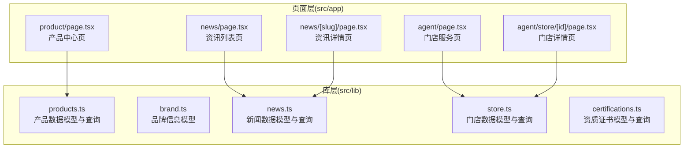
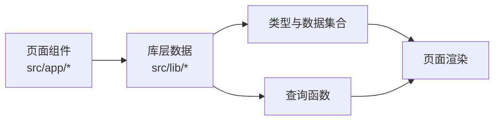
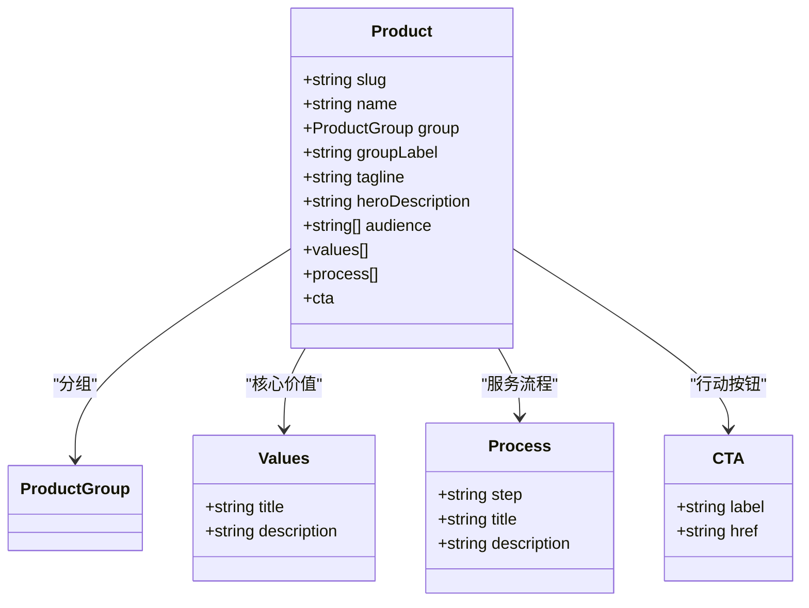
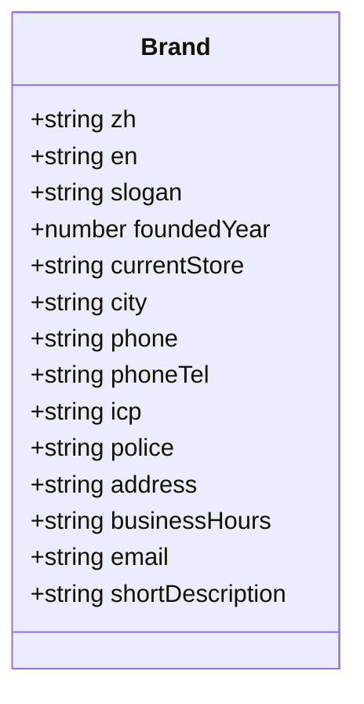
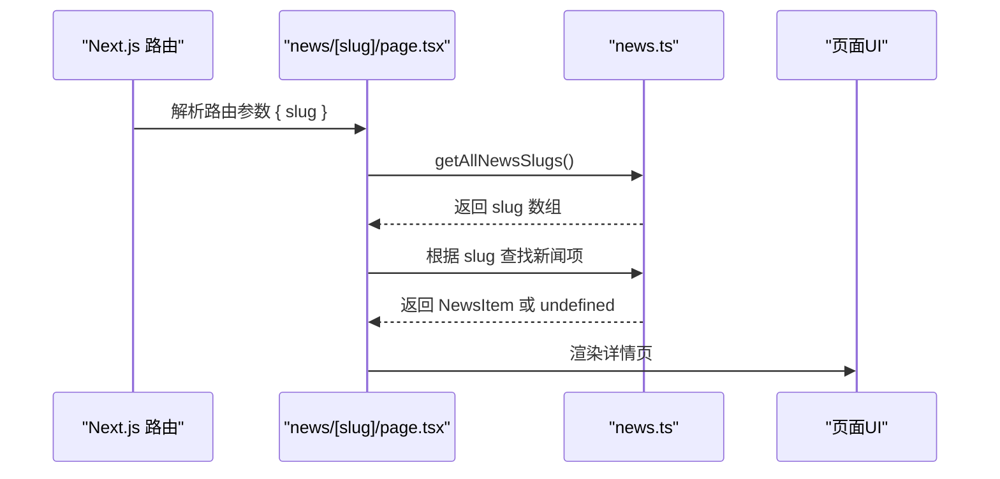
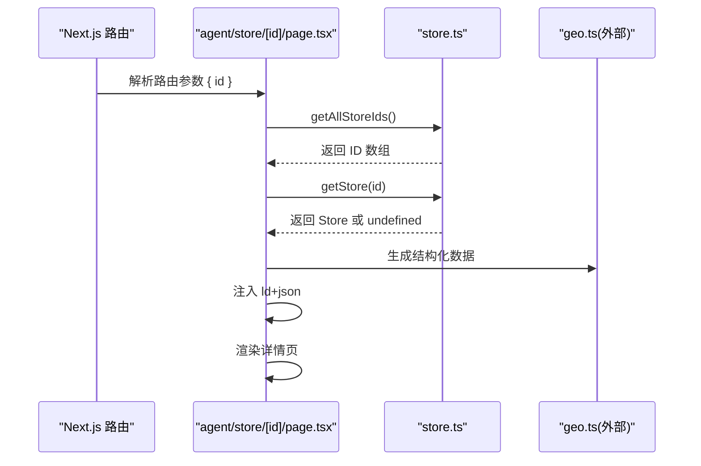
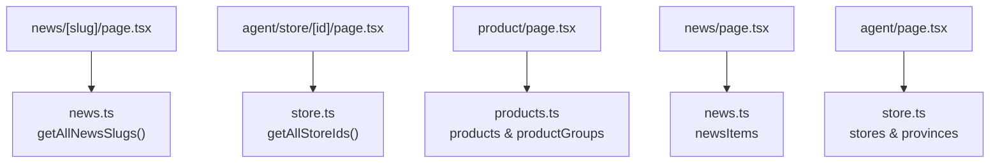

# 数据层设计

<cite>
**本文档引用的文件**
- [src/lib/products.ts](file://src/lib/products.ts)
- [src/lib/brand.ts](file://src/lib/brand.ts)
- [src/lib/news.ts](file://src/lib/news.ts)
- [src/lib/store.ts](file://src/lib/store.ts)
- [src/lib/certifications.ts](file://src/lib/certifications.ts)
- [src/app/product/page.tsx](file://src/app/product/page.tsx)
- [src/app/news/page.tsx](file://src/app/news/page.tsx)
- [src/app/news/[slug]/page.tsx](file://src/app/news/[slug]/page.tsx)
- [src/app/agent/page.tsx](file://src/app/agent/page.tsx)
- [src/app/agent/store/[id]/page.tsx](file://src/app/agent/store/[id]/page.tsx)
- [next.config.ts](file://next.config.ts)
</cite>

## 目录
1. [引言](#引言)
2. [项目结构](#项目结构)
3. [核心组件](#核心组件)
4. [架构总览](#架构总览)
5. [详细组件分析](#详细组件分析)
6. [依赖分析](#依赖分析)
7. [性能考量](#性能考量)
8. [故障排查指南](#故障排查指南)
9. [结论](#结论)
10. [附录](#附录)

## 引言
本文件系统化梳理蓝辉轻改网站的数据层设计，聚焦数据模型的设计原则与 TypeScript 接口定义规范，详解产品、品牌、新闻与门店四大业务模块的数据结构与关系映射；阐述数据获取策略（静态生成、服务端渲染与客户端获取）的时机选择；总结缓存机制与性能优化（含 ISR 与客户端缓存）；说明数据验证与类型安全的实现方式；最后提供扩展指南，帮助新增业务模块时快速落地一致的数据层。

## 项目结构
数据层采用“库函数 + 页面组件”的分层组织：
- 库层（src/lib）：集中定义各业务模块的 TypeScript 类型与纯数据集合，提供查询函数与常量，保证类型安全与可复用性。
- 页面层（src/app）：按路由组织页面组件，直接导入库层数据进行渲染；部分页面使用静态生成参数与元数据生成能力。

图表来源
- [src/lib/products.ts:1-282](file://src/lib/products.ts#L1-L282)
- [src/lib/brand.ts:1-28](file://src/lib/brand.ts#L1-L28)
- [src/lib/news.ts:1-46](file://src/lib/news.ts#L1-L46)
- [src/lib/store.ts:1-122](file://src/lib/store.ts#L1-L122)
- [src/lib/certifications.ts:1-114](file://src/lib/certifications.ts#L1-L114)
- [src/app/product/page.tsx:1-146](file://src/app/product/page.tsx#L1-L146)
- [src/app/news/page.tsx:1-77](file://src/app/news/page.tsx#L1-L77)
- [src/app/news/[slug]/page.tsx](file://src/app/news/[slug]/page.tsx#L1-L181)
- [src/app/agent/page.tsx:1-125](file://src/app/agent/page.tsx#L1-L125)
- [src/app/agent/store/[id]/page.tsx](file://src/app/agent/store/[id]/page.tsx#L1-L247)

章节来源
- [src/lib/products.ts:1-282](file://src/lib/products.ts#L1-L282)
- [src/lib/brand.ts:1-28](file://src/lib/brand.ts#L1-L28)
- [src/lib/news.ts:1-46](file://src/lib/news.ts#L1-L46)
- [src/lib/store.ts:1-122](file://src/lib/store.ts#L1-L122)
- [src/lib/certifications.ts:1-114](file://src/lib/certifications.ts#L1-L114)
- [src/app/product/page.tsx:1-146](file://src/app/product/page.tsx#L1-L146)
- [src/app/news/page.tsx:1-77](file://src/app/news/page.tsx#L1-L77)
- [src/app/news/[slug]/page.tsx](file://src/app/news/[slug]/page.tsx#L1-L181)
- [src/app/agent/page.tsx:1-125](file://src/app/agent/page.tsx#L1-L125)
- [src/app/agent/store/[id]/page.tsx](file://src/app/agent/store/[id]/page.tsx#L1-L247)

## 核心组件
- 产品数据模型（Product）：包含产品分组、标题、标语、受众、核心价值、服务流程与行动按钮等字段，支持按分组聚合与按 slug 查询。
- 品牌信息模型（BrandInfo）：集中品牌名称、口号、成立年份、当前门店、城市、联系方式、简述等信息，便于全局复用。
- 新闻数据模型（NewsItem）：包含标题、日期、分类、摘要等字段，支持 slug 列表生成与详情页静态参数生成。
- 门店位置模型（StoreLocation）：包含省市区标签、地址、电话、营业时间、服务项、亮点等字段，支持按省/市过滤与 ID 查询。

章节来源
- [src/lib/products.ts:8-21](file://src/lib/products.ts#L8-L21)
- [src/lib/brand.ts:8-25](file://src/lib/brand.ts#L8-L25)
- [src/lib/news.ts:8-14](file://src/lib/news.ts#L8-L14)
- [src/lib/store.ts:8-26](file://src/lib/store.ts#L8-L26)

## 架构总览
数据层遵循“纯数据 + 类型约束 + 查询函数”的设计范式，页面组件仅负责渲染与路由行为，数据访问通过库层函数完成，确保：
- 类型安全：所有数据结构以 TypeScript 接口/类型约束定义，避免运行时错误。
- 可测试性：查询函数与数据集合解耦，便于单元测试。
- 可扩展性：新增模块只需新增类型、数据与查询函数，无需改动现有页面。

图表来源
- [src/lib/products.ts:266-282](file://src/lib/products.ts#L266-L282)
- [src/lib/news.ts:43-46](file://src/lib/news.ts#L43-L46)
- [src/lib/store.ts:91-122](file://src/lib/store.ts#L91-L122)
- [src/app/news/[slug]/page.tsx](file://src/app/news/[slug]/page.tsx#L9-L11)
- [src/app/agent/store/[id]/page.tsx](file://src/app/agent/store/[id]/page.tsx#L17-L19)

## 详细组件分析

### 产品数据模型（Product）
- 字段定义与语义
  - 分组标识与标签：用于页面分组展示与导航。
  - 标语与英雄描述：用于页面头部与概览展示。
  - 受众列表：面向不同用户群体的价值点说明。
  - 核心价值与服务流程：以键值对与步骤化数组呈现。
  - 行动按钮：统一的 CTA 结构，便于跨页面复用。
- 关系映射
  - 产品与分组存在多对一关系（一个分组包含多个产品）。
  - 产品与图片映射通过 slug 到资源路径的字典实现。
- 查询与工具
  - 支持按 slug 获取单个产品与获取全部 slug 列表，便于静态生成参数与链接构建。

图表来源
- [src/lib/products.ts:8-21](file://src/lib/products.ts#L8-L21)
- [src/lib/products.ts:23-44](file://src/lib/products.ts#L23-L44)
- [src/lib/products.ts:266-282](file://src/lib/products.ts#L266-L282)

章节来源
- [src/lib/products.ts:8-282](file://src/lib/products.ts#L8-L282)
- [src/app/product/page.tsx:47-84](file://src/app/product/page.tsx#L47-L84)

### 品牌信息模型（BrandInfo）
- 字段定义与语义
  - 中英文品牌名、标语、成立年份、当前门店、城市、联系方式、简述等。
- 使用场景
  - 多处页面（品牌页、产品页、门店页）统一引用，确保品牌信息一致性。
- 类型安全
  - 使用只读常量与类型推断，避免误修改。

图表来源
- [src/lib/brand.ts:8-25](file://src/lib/brand.ts#L8-L25)

章节来源
- [src/lib/brand.ts:1-28](file://src/lib/brand.ts#L1-L28)
- [src/app/product/page.tsx:93-94](file://src/app/product/page.tsx#L93-L94)

### 新闻数据模型（NewsItem）
- 字段定义与语义
  - 标题、日期、分类、摘要等，满足列表与详情页展示。
- 静态生成策略
  - 详情页通过 generateStaticParams 基于 slug 列表生成静态页面，提升首屏性能与 SEO。
- 查询与工具
  - 提供 slug 列表查询函数，便于生成静态参数与导航。

图表来源
- [src/app/news/[slug]/page.tsx](file://src/app/news/[slug]/page.tsx#L9-L11)
- [src/app/news/[slug]/page.tsx](file://src/app/news/[slug]/page.tsx#L13-L25)
- [src/lib/news.ts:43-46](file://src/lib/news.ts#L43-L46)

章节来源
- [src/lib/news.ts:1-46](file://src/lib/news.ts#L1-L46)
- [src/app/news/page.tsx:1-77](file://src/app/news/page.tsx#L1-L77)
- [src/app/news/[slug]/page.tsx](file://src/app/news/[slug]/page.tsx#L1-L181)

### 门店位置模型（StoreLocation）
- 字段定义与语义
  - 省市区标签与 ID、地址、电话、营业时间、服务项、亮点、地理坐标等。
- 查询与工具
  - 支持按 ID、省、市过滤与获取全部 ID 列表，用于静态生成参数与导航。
- SEO 与结构化数据
  - 详情页注入本地商业结构化数据与面包屑结构化数据，提升 SEO。

图表来源
- [src/app/agent/store/[id]/page.tsx](file://src/app/agent/store/[id]/page.tsx#L17-L19)
- [src/app/agent/store/[id]/page.tsx](file://src/app/agent/store/[id]/page.tsx#L21-L33)
- [src/lib/store.ts:111-122](file://src/lib/store.ts#L111-L122)

章节来源
- [src/lib/store.ts:1-122](file://src/lib/store.ts#L1-L122)
- [src/app/agent/page.tsx:1-125](file://src/app/agent/page.tsx#L1-L125)
- [src/app/agent/store/[id]/page.tsx](file://src/app/agent/store/[id]/page.tsx#L1-L247)

### 资质证书模型（Certifications）
- 字段定义与语义
  - 标识、标题、分类、颁发方、日期、有效期、描述与徽章等，用于品牌信任背书。
- 使用场景
  - 品牌页的资质卡片展示，增强用户信任。

章节来源
- [src/lib/certifications.ts:1-114](file://src/lib/certifications.ts#L1-L114)

## 依赖分析
- 页面到库层的依赖
  - 产品中心页依赖产品库的集合与分组信息。
  - 资讯列表与详情页依赖新闻库的数据与查询函数。
  - 门店服务与详情页依赖门店库的数据与查询函数。
- 静态生成与参数生成
  - 资讯详情页与门店详情页均通过 generateStaticParams 基于查询函数返回的 slug/ID 列表生成静态页面。
- 图片与缓存
  - Next.js 图像优化配置包含格式、设备像素比与缓存 TTL，提升图片加载性能与缓存命中。

图表来源
- [src/app/news/[slug]/page.tsx](file://src/app/news/[slug]/page.tsx#L9-L11)
- [src/lib/news.ts:43-46](file://src/lib/news.ts#L43-L46)
- [src/app/agent/store/[id]/page.tsx](file://src/app/agent/store/[id]/page.tsx#L17-L19)
- [src/lib/store.ts:111-122](file://src/lib/store.ts#L111-L122)
- [src/app/product/page.tsx:6-8](file://src/app/product/page.tsx#L6-L8)
- [src/app/news/page.tsx](file://src/app/news/page.tsx#L6)
- [src/app/agent/page.tsx](file://src/app/agent/page.tsx#L6)

章节来源
- [src/app/news/[slug]/page.tsx](file://src/app/news/[slug]/page.tsx#L1-L181)
- [src/app/agent/store/[id]/page.tsx](file://src/app/agent/store/[id]/page.tsx#L1-L247)
- [src/app/product/page.tsx:1-146](file://src/app/product/page.tsx#L1-L146)
- [src/app/news/page.tsx:1-77](file://src/app/news/page.tsx#L1-L77)
- [src/app/agent/page.tsx:1-125](file://src/app/agent/page.tsx#L1-L125)

## 性能考量
- 静态生成（SSG）
  - 资讯详情页与门店详情页通过 generateStaticParams 生成静态页面，显著降低首屏渲染延迟与服务器压力。
- 服务端渲染（SSR）与客户端获取
  - 当前页面主要采用静态生成；若未来引入实时数据或用户态数据，可在页面导出 generateMetadata 或使用客户端请求函数进行补充。
- 缓存策略
  - Next.js 图像缓存默认 30 天（minimumCacheTTL），配合 CDN 可进一步提升图片加载性能。
- 增量静态再生（ISR）
  - 若未来资讯或门店数据更新频率较高，可在页面导出 revalidate 字段，结合静态生成实现增量更新，平衡新鲜度与性能。
- 客户端缓存
  - 对于非敏感的静态数据，可在客户端使用内存缓存或浏览器缓存（localStorage/sessionStorage）减少重复请求；注意版本控制与失效策略。

章节来源
- [src/app/news/[slug]/page.tsx](file://src/app/news/[slug]/page.tsx#L9-L11)
- [src/app/agent/store/[id]/page.tsx](file://src/app/agent/store/[id]/page.tsx#L17-L19)
- [next.config.ts](file://next.config.ts#L9)

## 故障排查指南
- 404 场景
  - 资讯详情页与门店详情页在找不到目标数据时调用 notFound，确保正确的 404 响应。
- 参数校验
  - 详情页通过查询函数获取数据，若返回 undefined 则触发 404，避免渲染空内容。
- SEO 元数据
  - 详情页通过 generateMetadata 动态生成标题与描述，确保 SEO 一致性；若数据缺失则回退到默认标题。

章节来源
- [src/app/news/[slug]/page.tsx](file://src/app/news/[slug]/page.tsx#L33-L34)
- [src/app/agent/store/[id]/page.tsx](file://src/app/agent/store/[id]/page.tsx#L41-L42)

## 结论
本数据层以明确的类型约束与查询函数为核心，实现了产品、品牌、新闻与门店四大模块的一致化建模与高效复用。通过静态生成与合理的缓存策略，兼顾了性能与可维护性。未来在引入实时数据或用户态数据时，可结合 SSR 与 ISR 进一步优化体验。

## 附录

### 数据获取策略与时机选择
- 静态生成（SSG）
  - 适用于内容稳定、可预知的详情页（资讯、门店）与列表页（产品中心、资讯列表）。
  - 优势：首屏快、SEO 友好、成本低。
- 服务端渲染（SSR）
  - 适用于需要用户态或实时数据的页面（如带登录态的预约页）。
- 客户端数据获取
  - 适用于非关键信息或异步补充（如相关推荐、评论）。

章节来源
- [src/app/news/[slug]/page.tsx](file://src/app/news/[slug]/page.tsx#L9-L11)
- [src/app/agent/store/[id]/page.tsx](file://src/app/agent/store/[id]/page.tsx#L17-L19)

### 数据验证与类型安全
- 使用 TypeScript 接口/类型约束定义数据结构，确保字段完整性与类型一致性。
- 页面层通过查询函数获取数据，结合条件判断与 notFound 实现运行时校验。
- 对于外部结构化数据（如 ld+json），建议在生成时进行字段校验与序列化。

章节来源
- [src/lib/products.ts:8-21](file://src/lib/products.ts#L8-L21)
- [src/lib/news.ts:8-14](file://src/lib/news.ts#L8-L14)
- [src/lib/store.ts:8-26](file://src/lib/store.ts#L8-L26)
- [src/app/news/[slug]/page.tsx](file://src/app/news/[slug]/page.tsx#L33-L34)
- [src/app/agent/store/[id]/page.tsx](file://src/app/agent/store/[id]/page.tsx#L41-L42)

### 扩展指南：新增业务模块
- 步骤
  1) 在 src/lib 下新增模块文件，定义类型与数据集合，提供查询函数与常量。
  2) 在 src/app 下新增对应路由页面，导入库层数据并渲染。
  3) 如需静态生成，导出 generateStaticParams 与 generateMetadata。
  4) 如需 SEO，注入结构化数据（如 ld+json）。
  5) 在页面中使用类型约束与条件渲染，确保健壮性。
- 示例参考
  - 产品中心页展示了如何使用库层数据进行分组与卡片渲染。
  - 资讯详情页展示了静态参数生成与元数据生成的实践。

章节来源
- [src/app/product/page.tsx:47-84](file://src/app/product/page.tsx#L47-L84)
- [src/app/news/[slug]/page.tsx](file://src/app/news/[slug]/page.tsx#L9-L25)
- [src/app/agent/store/[id]/page.tsx](file://src/app/agent/store/[id]/page.tsx#L48-L67)