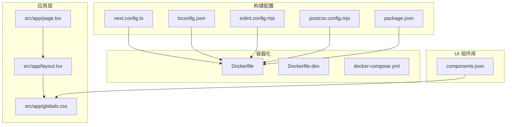
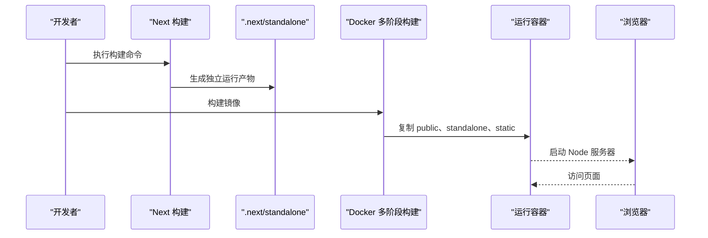
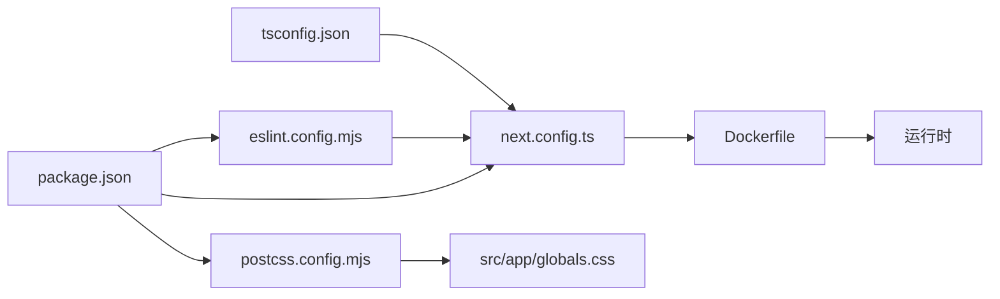

# 构建配置

<cite>
**本文引用的文件**
- [next.config.ts](file://next.config.ts)
- [tsconfig.json](file://tsconfig.json)
- [eslint.config.mjs](file://eslint.config.mjs)
- [postcss.config.mjs](file://postcss.config.mjs)
- [package.json](file://package.json)
- [Dockerfile](file://Dockerfile)
- [Dockerfile.dev](file://Dockerfile.dev)
- [docker-compose.yml](file://docker-compose.yml)
- [components.json](file://components.json)
- [src/app/layout.tsx](file://src/app/layout.tsx)
- [src/app/page.tsx](file://src/app/page.tsx)
- [src/app/globals.css](file://src/app/globals.css)
</cite>

## 目录
1. [简介](#简介)
2. [项目结构](#项目结构)
3. [核心组件](#核心组件)
4. [架构总览](#架构总览)
5. [详细组件分析](#详细组件分析)
6. [依赖关系分析](#依赖关系分析)
7. [性能考量](#性能考量)
8. [故障排查指南](#故障排查指南)
9. [结论](#结论)
10. [附录](#附录)

## 简介
本文件系统化梳理蓝辉轻改网站的构建配置，覆盖以下主题：
- TypeScript 严格模式与类型检查策略（strict、noImplicitAny、strictNullChecks 等）
- Next.js 构建配置与输出模式（output: 'standalone'）及 Docker 部署优化
- ESLint 规则集与代码质量保障机制
- PostCSS 与 CSS 预处理流程（Tailwind v4、插件与浏览器兼容）
- 包管理与依赖策略（开发依赖与生产依赖）
- 构建优化最佳实践（代码分割、Tree Shaking、Bundle 分析）
- 开发与生产环境差异化配置与部署策略

## 项目结构
该仓库采用 Next.js App Router 结构，核心配置集中在根目录的构建与工具配置文件中，前端样式通过 Tailwind v4 与 PostCSS 处理，容器化部署使用多阶段 Docker 构建。

图表来源
- [next.config.ts:1-14](file://next.config.ts#L1-L14)
- [tsconfig.json:1-35](file://tsconfig.json#L1-L35)
- [eslint.config.mjs:1-19](file://eslint.config.mjs#L1-L19)
- [postcss.config.mjs:1-8](file://postcss.config.mjs#L1-L8)
- [package.json:1-60](file://package.json#L1-L60)
- [Dockerfile:1-114](file://Dockerfile#L1-L114)
- [Dockerfile.dev:1-16](file://Dockerfile.dev#L1-L16)
- [docker-compose.yml:1-54](file://docker-compose.yml#L1-L54)
- [components.json:1-26](file://components.json#L1-L26)
- [src/app/layout.tsx:1-39](file://src/app/layout.tsx#L1-L39)
- [src/app/page.tsx:1-22](file://src/app/page.tsx#L1-L22)
- [src/app/globals.css:1-130](file://src/app/globals.css#L1-L130)

章节来源
- [next.config.ts:1-14](file://next.config.ts#L1-L14)
- [tsconfig.json:1-35](file://tsconfig.json#L1-L35)
- [eslint.config.mjs:1-19](file://eslint.config.mjs#L1-L19)
- [postcss.config.mjs:1-8](file://postcss.config.mjs#L1-L8)
- [package.json:1-60](file://package.json#L1-L60)
- [Dockerfile:1-114](file://Dockerfile#L1-L114)
- [Dockerfile.dev:1-16](file://Dockerfile.dev#L1-L16)
- [docker-compose.yml:1-54](file://docker-compose.yml#L1-L54)
- [components.json:1-26](file://components.json#L1-L26)
- [src/app/layout.tsx:1-39](file://src/app/layout.tsx#L1-L39)
- [src/app/page.tsx:1-22](file://src/app/page.tsx#L1-L22)
- [src/app/globals.css:1-130](file://src/app/globals.css#L1-L130)

## 核心组件
- Next.js 构建配置：启用 output: 'standalone'，优化 Docker 部署；图片优化配置提升性能与缓存。
- TypeScript 严格模式：开启 strict 并结合 bundler 解析器、增量编译等，确保类型安全与快速开发体验。
- ESLint：基于 eslint-config-next 的 core-web-vitals 与 TypeScript 规则，自定义忽略项。
- PostCSS/Tailwind：使用 Tailwind v4 与 @tailwindcss/postcss 插件，配合 CSS 变量与暗色主题。
- 容器化：多阶段 Docker 构建，支持 npm/yarn/pnpm 锁文件，输出文件追踪减少镜像体积。
- UI 组件库：shadcn/ui 集成，TSX、RSC 支持，Tailwind 配置指向全局样式入口。

章节来源
- [next.config.ts:1-14](file://next.config.ts#L1-L14)
- [tsconfig.json:1-35](file://tsconfig.json#L1-L35)
- [eslint.config.mjs:1-19](file://eslint.config.mjs#L1-L19)
- [postcss.config.mjs:1-8](file://postcss.config.mjs#L1-L8)
- [package.json:1-60](file://package.json#L1-L60)
- [Dockerfile:1-114](file://Dockerfile#L1-L114)
- [components.json:1-26](file://components.json#L1-L26)

## 架构总览
下图展示从源码到运行时的关键构建与部署路径，突出 Next.js standalone 输出与 Docker 多阶段构建的协同。

图表来源
- [next.config.ts:3-11](file://next.config.ts#L3-L11)
- [Dockerfile:35-114](file://Dockerfile#L35-L114)

章节来源
- [next.config.ts:1-14](file://next.config.ts#L1-L14)
- [Dockerfile:1-114](file://Dockerfile#L1-L114)

## 详细组件分析

### TypeScript 严格模式与类型检查策略
- 关键设置
  - 编译目标与库：ES2017、dom、dom.iterable、esnext
  - 严格模式：开启 strict
  - 无 emit：noEmit，仅用于类型检查
  - 模块解析：bundler（与 Vercel/Next 构建链路一致）
  - 增量编译：incremental 提升大型项目编译速度
  - JSX：react-jsx
  - 路径别名：@/* -> ./src/*
  - 内置插件：next（Next 类型插件）
- 类型检查策略
  - 通过 tsc --noEmit 进行类型检查，避免生成 JS
  - 配合 ESLint 的 TypeScript 规则形成双重保障
- 影响与收益
  - 强类型约束减少运行时错误
  - 严格的模块解析与增量编译提升开发效率
  - 与 Next 构建链路一致，避免类型不一致问题

章节来源
- [tsconfig.json:1-35](file://tsconfig.json#L1-L35)

### Next.js 构建配置与输出模式（output: 'standalone'）
- 核心配置
  - output: 'standalone'：生成可独立运行的 Node 服务器产物，便于 Docker 部署
  - 图片优化：支持 AVIF/WebP，设备像素比与尺寸配置，长期缓存（30 天）
- Docker 部署优化
  - 多阶段构建：依赖安装、构建、运行三阶段分离
  - 输出文件追踪：仅复制 .next/standalone 与 .next/static，减小镜像体积
  - 运行用户：非 root 用户启动，提升安全性
  - Telemetry 控制：可通过环境变量禁用遥测
- 生产与开发差异
  - 生产镜像：使用 runner 目标，复制 standalone 产物
  - 开发镜像：基于 Alpine，挂载源码实现热重载

章节来源
- [next.config.ts:1-14](file://next.config.ts#L1-L14)
- [Dockerfile:1-114](file://Dockerfile#L1-L114)
- [Dockerfile.dev:1-16](file://Dockerfile.dev#L1-L16)

### ESLint 配置与代码质量保障
- 规则集
  - 基于 eslint-config-next 的 core-web-vitals 与 TypeScript 规则
  - 自定义忽略项覆盖默认忽略（.next、out、build、next-env.d.ts）
- 质量保障机制
  - 在 CI 中统一执行 npm run lint 与 tsc --noEmit
  - 与 Next.js App Router、React 19、TypeScript 5 协同
- 使用建议
  - 保持与 tsconfig.json 的严格模式一致
  - 避免在业务代码中放宽严格规则

章节来源
- [eslint.config.mjs:1-19](file://eslint.config.mjs#L1-L19)
- [package.json:29-36](file://package.json#L29-L36)

### PostCSS 与 CSS 预处理流程
- 配置
  - 插件：@tailwindcss/postcss
  - 全局样式：src/app/globals.css
  - 主题：CSS 变量 + 暗色主题变体
- 流程
  - Tailwind v4 通过 PostCSS 插件注入原子类
  - shadcn/tailwind.css 提供组件库样式基线
  - tw-animate-css 提供动画能力
- 浏览器兼容性
  - 由 Tailwind v4 与 PostCSS 插件自动处理现代浏览器特性
  - 如需更广泛的兼容，可在 PostCSS 中添加 autoprefixer 或相应插件

章节来源
- [postcss.config.mjs:1-8](file://postcss.config.mjs#L1-L8)
- [components.json:1-26](file://components.json#L1-L26)
- [src/app/globals.css:1-130](file://src/app/globals.css#L1-L130)

### 包管理与依赖策略
- Node 版本要求：>= 24
- 生产依赖（示例）
  - next、react、react-dom、lucide-react、class-variance-authority、clsx、tailwind-merge、tw-animate-css、@base-ui/react、shadcn
- 开发依赖（示例）
  - tailwindcss、@tailwindcss/postcss、typescript、eslint、eslint-config-next、@types/node、@types/react、@types/react-dom
- 依赖安装策略
  - Docker 构建支持 npm/yarn/pnpm 锁文件，优先 frozen-lockfile 保证可重复构建
  - 使用缓存 mount 提升安装速度

章节来源
- [package.json:1-60](file://package.json#L1-L60)
- [Dockerfile:20-32](file://Dockerfile#L20-L32)

### 构建优化最佳实践
- 代码分割
  - Next.js App Router 默认按路由拆分代码，结合动态导入进一步优化首屏
- Tree Shaking
  - 使用 ES Modules 与 bundler 解析器，确保未使用的导出被移除
- Bundle 分析
  - 在本地或 CI 中集成分析工具（如 @next/bundle-analyzer），识别大体积依赖
- 缓存与图片优化
  - Next 图片优化与长缓存 TTL，减少带宽与加载时间
- TypeScript 与 ESLint
  - 严格模式 + 类型检查 + ESLint 规则，提前发现潜在问题

章节来源
- [next.config.ts:5-10](file://next.config.ts#L5-L10)
- [tsconfig.json:10-14](file://tsconfig.json#L10-L14)
- [eslint.config.mjs:1-19](file://eslint.config.mjs#L1-L19)

### 开发与生产环境差异化配置与部署策略
- 开发环境
  - docker-compose dev 服务：挂载源码目录，Alpine 基础镜像，端口映射 3001:3000
  - 环境变量：NODE_ENV=development，禁用遥测
- 生产环境
  - docker-compose app 服务：使用 Dockerfile runner 目标，暴露 3000 端口
  - 环境变量：NODE_ENV=production，禁用遥测，读取 .env/.env.local
  - 健康检查：HTTP GET /，间隔 30s，超时 10s，重试 3 次
- 容器化细节
  - 多阶段构建：dependencies、builder、runner 三阶段
  - 输出文件追踪：仅复制 .next/standalone 与 .next/static，减小镜像体积
  - 非 root 用户运行，提升安全性

章节来源
- [docker-compose.yml:1-54](file://docker-compose.yml#L1-L54)
- [Dockerfile.dev:1-16](file://Dockerfile.dev#L1-L16)
- [Dockerfile:1-114](file://Dockerfile#L1-L114)

## 依赖关系分析
- 构建链路耦合
  - tsconfig.json 的 moduleResolution: bundler 与 Next 构建链路强关联
  - next.config.ts 的 output: 'standalone' 与 Docker 复制 .next/standalone 强耦合
  - eslint.config.mjs 与 tsconfig.json 的严格模式需保持一致
- 外部依赖
  - Next.js 16、React 19、TypeScript 5、Tailwind v4、shadcn/ui
  - Docker 多包管理器支持（npm/yarn/pnpm）

图表来源
- [tsconfig.json:1-35](file://tsconfig.json#L1-L35)
- [next.config.ts:1-14](file://next.config.ts#L1-L14)
- [eslint.config.mjs:1-19](file://eslint.config.mjs#L1-L19)
- [postcss.config.mjs:1-8](file://postcss.config.mjs#L1-L8)
- [package.json:1-60](file://package.json#L1-L60)
- [Dockerfile:1-114](file://Dockerfile#L1-L114)

章节来源
- [tsconfig.json:1-35](file://tsconfig.json#L1-L35)
- [next.config.ts:1-14](file://next.config.ts#L1-L14)
- [eslint.config.mjs:1-19](file://eslint.config.mjs#L1-L19)
- [postcss.config.mjs:1-8](file://postcss.config.mjs#L1-L8)
- [package.json:1-60](file://package.json#L1-L60)
- [Dockerfile:1-114](file://Dockerfile#L1-L114)

## 性能考量
- 编译与类型检查
  - incremental 增量编译与 bundler 模块解析显著提升大型项目开发体验
- 构建产物
  - output: 'standalone' 与 .next/standalone 文件追踪减少镜像体积
- 资源优化
  - Next 图片优化与长缓存 TTL，Tailwind v4 原子类减少冗余 CSS
- 运行时
  - 非 root 用户运行、健康检查、端口与主机绑定，提升稳定性与可观测性

## 故障排查指南
- 构建失败（无锁文件）
  - Dockerfile 在缺少 package-lock.json/yarn.lock/pnpm-lock.yaml 时会退出，需提供对应锁文件
- Node 版本不匹配
  - package.json 指定 Node >= 24，Dockerfile ARG NODE_VERSION=24.14.1-slim，需保持一致
- 类型检查失败
  - 确保 tsc --noEmit 与 ESLint 规则一致，避免放宽严格模式
- 图片加载异常
  - 检查 next.config.ts 的 images 配置与缓存 TTL 是否合理
- Docker 镜像过大
  - 确认是否复制了不必要的缓存目录，遵循 .next/standalone 与 .next/static 的最小化原则

章节来源
- [Dockerfile:20-32](file://Dockerfile#L20-L32)
- [package.json:26-28](file://package.json#L26-L28)
- [tsconfig.json:15-15](file://tsconfig.json#L15-L15)
- [next.config.ts:5-10](file://next.config.ts#L5-L10)

## 结论
本项目在构建配置上实现了高一致性与高可维护性：
- TypeScript 严格模式与 Next 构建链路无缝衔接
- Next.js standalone 输出与 Docker 多阶段构建相辅相成
- ESLint 与 TypeScript 双轨质量保障
- Tailwind v4 与 PostCSS 插件驱动的现代化样式体系
- 明确的开发/生产差异化配置与健壮的容器化部署策略

## 附录
- 快速检查清单
  - 运行前：npm run check（lint + typecheck + build）
  - 开发：docker compose up dev
  - 生产：docker compose up app
- 建议扩展
  - 引入 Bundle 分析工具进行持续优化
  - 在 CI 中增加覆盖率与性能回归检测