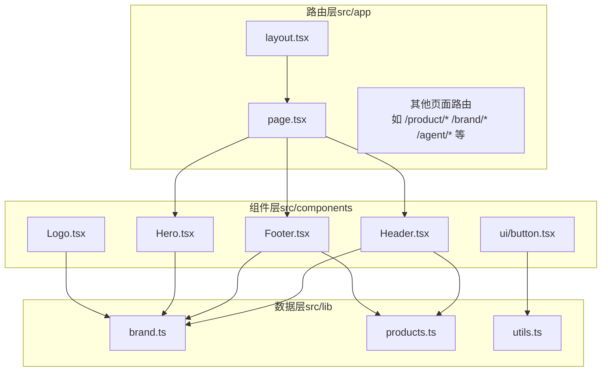
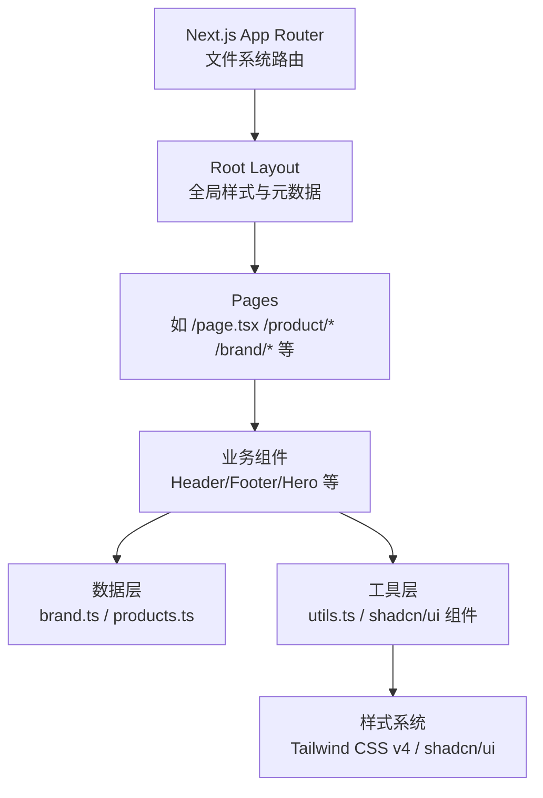
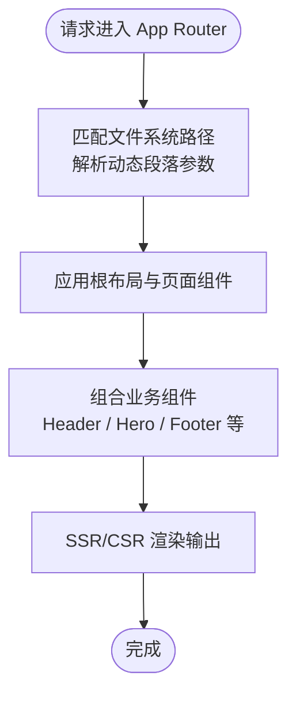
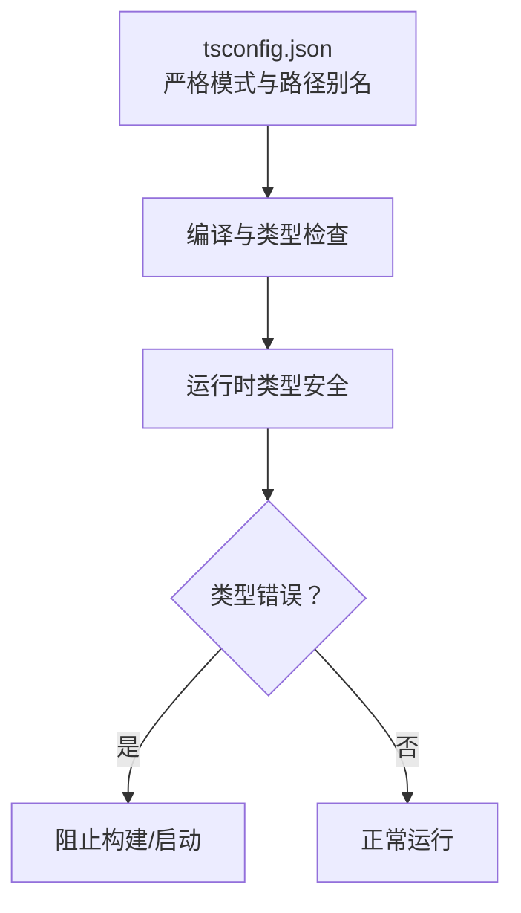
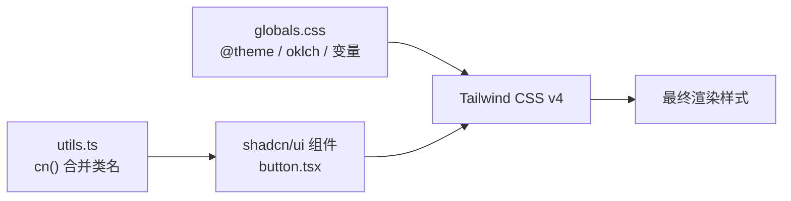
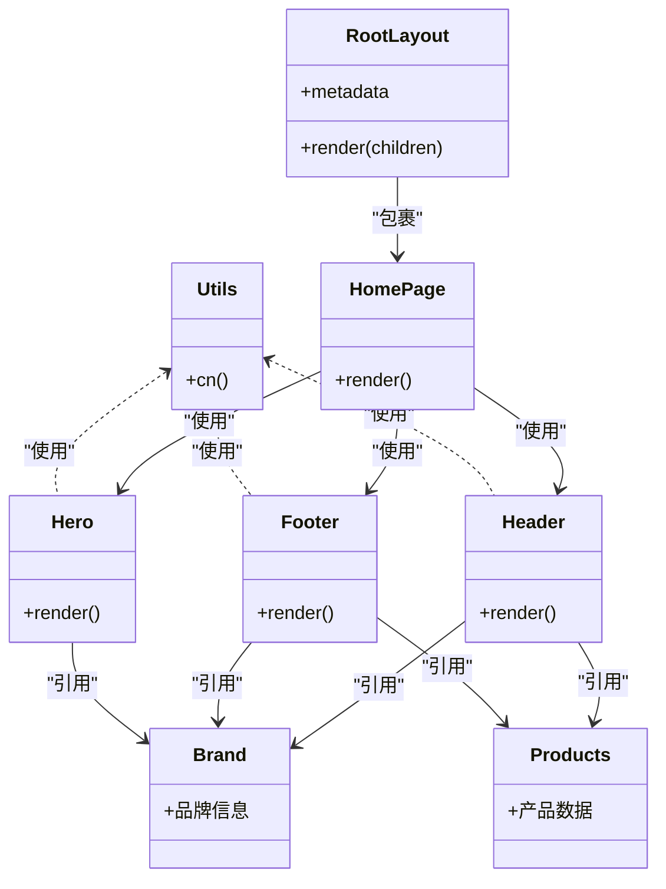
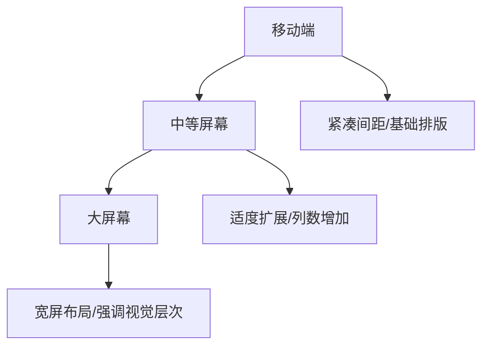
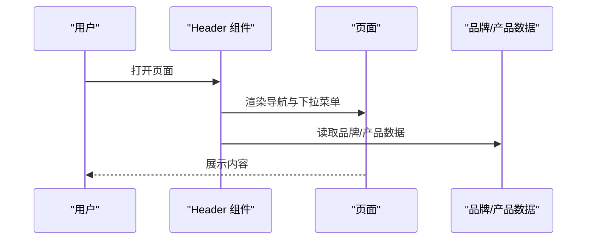
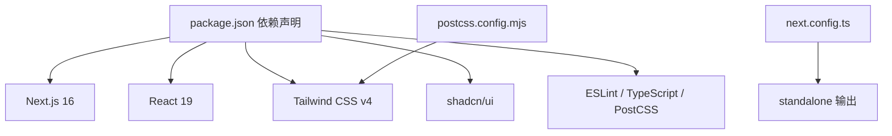
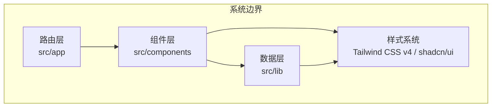

# 架构设计

<cite>
**本文档引用的文件**
- [README.md](file://README.md)
- [package.json](file://package.json)
- [next.config.ts](file://next.config.ts)
- [tsconfig.json](file://tsconfig.json)
- [components.json](file://components.json)
- [postcss.config.mjs](file://postcss.config.mjs)
- [src/app/layout.tsx](file://src/app/layout.tsx)
- [src/app/page.tsx](file://src/app/page.tsx)
- [src/app/globals.css](file://src/app/globals.css)
- [src/components/Header.tsx](file://src/components/Header.tsx)
- [src/components/Footer.tsx](file://src/components/Footer.tsx)
- [src/components/Hero.tsx](file://src/components/Hero.tsx)
- [src/components/Logo.tsx](file://src/components/Logo.tsx)
- [src/components/ui/button.tsx](file://src/components/ui/button.tsx)
- [src/lib/utils.ts](file://src/lib/utils.ts)
- [src/lib/brand.ts](file://src/lib/brand.ts)
- [src/lib/products.ts](file://src/lib/products.ts)
</cite>

## 目录
1. [引言](#引言)
2. [项目结构](#项目结构)
3. [核心组件](#核心组件)
4. [架构总览](#架构总览)
5. [详细组件分析](#详细组件分析)
6. [依赖分析](#依赖分析)
7. [性能考量](#性能考量)
8. [故障排查指南](#故障排查指南)
9. [结论](#结论)
10. [附录](#附录)

## 引言
本项目是一个基于 Next.js 16 App Router 的现代前端网站，服务于“蓝辉轻改”品牌，聚焦汽车轻改装与车身膜服务。项目采用 React 19、TypeScript 严格模式、Tailwind CSS v4 与 shadcn/ui 设计系统，遵循文件系统路由与分层架构，强调类型安全、响应式设计与移动端优先策略。本文档旨在帮助开发者全面理解系统架构、组件交互与实现细节。

## 项目结构
项目采用“约定优于配置”的目录组织方式，核心分为三层：
- 路由层（src/app）：基于 Next.js App Router 的文件系统路由，页面与布局在此定义。
- 组件层（src/components）：可复用 UI 组件与业务组件，包含基础 UI 组件（ui）与业务组件（如 Header、Footer、Hero 等）。
- 数据层（src/lib）：品牌信息、产品数据、工具函数等，提供类型安全的数据模型与通用能力。

图表来源
- [src/app/layout.tsx:1-32](file://src/app/layout.tsx#L1-L32)
- [src/app/page.tsx:1-22](file://src/app/page.tsx#L1-L22)
- [src/components/Header.tsx:1-292](file://src/components/Header.tsx#L1-L292)
- [src/components/Footer.tsx:1-113](file://src/components/Footer.tsx#L1-L113)
- [src/components/Hero.tsx:1-56](file://src/components/Hero.tsx#L1-L56)
- [src/components/Logo.tsx:1-32](file://src/components/Logo.tsx#L1-L32)
- [src/components/ui/button.tsx:1-61](file://src/components/ui/button.tsx#L1-L61)
- [src/lib/brand.ts:1-28](file://src/lib/brand.ts#L1-L28)
- [src/lib/products.ts:1-282](file://src/lib/products.ts#L1-L282)
- [src/lib/utils.ts:1-7](file://src/lib/utils.ts#L1-L7)

章节来源
- [README.md:110-134](file://README.md#L110-L134)
- [src/app/layout.tsx:1-32](file://src/app/layout.tsx#L1-L32)
- [src/app/page.tsx:1-22](file://src/app/page.tsx#L1-L22)

## 核心组件
- 全局布局与元数据：根布局负责站点元信息、语言与全局样式注入，确保页面具备 SEO 友好性与一致的主题风格。
- 主页组合：主页通过组合多个业务组件（头部、英雄区、优势区、服务区、快捷入口、底部）构建完整内容流。
- 品牌与产品数据：品牌信息与产品数据集中于数据层，供组件按需引用，保证跨页面一致性与可维护性。
- UI 组件：基于 shadcn/ui 的按钮组件提供变体与尺寸，配合工具函数实现类名合并与条件样式。

章节来源
- [src/app/layout.tsx:1-32](file://src/app/layout.tsx#L1-L32)
- [src/app/page.tsx:1-22](file://src/app/page.tsx#L1-L22)
- [src/lib/brand.ts:1-28](file://src/lib/brand.ts#L1-L28)
- [src/lib/products.ts:1-282](file://src/lib/products.ts#L1-L282)
- [src/components/ui/button.tsx:1-61](file://src/components/ui/button.tsx#L1-L61)
- [src/lib/utils.ts:1-7](file://src/lib/utils.ts#L1-L7)

## 架构总览
系统采用“路由层-组件层-数据层”的分层架构，结合 Next.js App Router 的文件系统路由与 React Server Components/Client Components 的混合渲染模式，实现高性能与可维护性。

图表来源
- [src/app/layout.tsx:1-32](file://src/app/layout.tsx#L1-L32)
- [src/app/page.tsx:1-22](file://src/app/page.tsx#L1-L22)
- [src/lib/brand.ts:1-28](file://src/lib/brand.ts#L1-L28)
- [src/lib/products.ts:1-282](file://src/lib/products.ts#L1-L282)
- [src/lib/utils.ts:1-7](file://src/lib/utils.ts#L1-L7)
- [src/components/ui/button.tsx:1-61](file://src/components/ui/button.tsx#L1-L61)
- [src/app/globals.css:1-130](file://src/app/globals.css#L1-L130)

## 详细组件分析

### 文件系统路由与 App Router 工作原理
- 页面与布局：根布局负责注入全局样式与元数据；主页作为默认页面，组合多个业务组件形成内容流。
- 动态路由：产品、品牌、门店等页面通过动态段落（如 [slug]、[city]）实现参数化路由，便于扩展更多子页面。
- 优势：无需手动配置路由表，按文件夹层级自动生成路由；支持并行数据加载与流式渲染，提升首屏性能。

图表来源
- [src/app/layout.tsx:1-32](file://src/app/layout.tsx#L1-L32)
- [src/app/page.tsx:1-22](file://src/app/page.tsx#L1-L22)

章节来源
- [src/app/layout.tsx:1-32](file://src/app/layout.tsx#L1-L32)
- [src/app/page.tsx:1-22](file://src/app/page.tsx#L1-L22)

### TypeScript 严格模式与类型安全策略
- 编译器选项：启用严格模式、禁止发出 JS、隔离模块、路径别名等，确保类型检查与模块解析一致性。
- 路径映射：通过路径别名简化导入，减少相对路径复杂度。
- 类型约束：品牌与产品数据采用只读类型，保障运行时不变性；组件 props 使用明确类型，降低错误传播。

图表来源
- [tsconfig.json:1-35](file://tsconfig.json#L1-L35)

章节来源
- [tsconfig.json:1-35](file://tsconfig.json#L1-L35)

### Tailwind CSS v4 与 shadcn/ui 集成
- 设计令牌：使用 oklch 色彩空间与 CSS 变量，支持明暗主题切换；通过 @theme inline 定义字体、圆角等设计令牌。
- 组件系统：shadcn/ui 提供语义化组件与变体，结合 cva 实现样式变体与尺寸；工具函数 cn 合并类名，避免冲突。
- 样式注入：全局样式通过 globals.css 注入 Tailwind、动画与 shadcn 样式，确保组件样式一致性。

图表来源
- [src/app/globals.css:1-130](file://src/app/globals.css#L1-L130)
- [src/components/ui/button.tsx:1-61](file://src/components/ui/button.tsx#L1-L61)
- [src/lib/utils.ts:1-7](file://src/lib/utils.ts#L1-L7)

章节来源
- [src/app/globals.css:1-130](file://src/app/globals.css#L1-L130)
- [src/components/ui/button.tsx:1-61](file://src/components/ui/button.tsx#L1-L61)
- [src/lib/utils.ts:1-7](file://src/lib/utils.ts#L1-L7)
- [components.json:1-26](file://components.json#L1-L26)
- [postcss.config.mjs:1-8](file://postcss.config.mjs#L1-L8)

### 分层架构：路由层、组件层、数据层
- 路由层（src/app）：负责页面与布局，承载 SEO 元数据与全局样式。
- 组件层（src/components）：封装可复用 UI 与业务组件，依赖数据层与工具层。
- 数据层（src/lib）：提供品牌、产品等数据模型与工具函数，保证类型安全与跨组件共享。

图表来源
- [src/app/layout.tsx:1-32](file://src/app/layout.tsx#L1-L32)
- [src/app/page.tsx:1-22](file://src/app/page.tsx#L1-L22)
- [src/components/Header.tsx:1-292](file://src/components/Header.tsx#L1-L292)
- [src/components/Footer.tsx:1-113](file://src/components/Footer.tsx#L1-L113)
- [src/components/Hero.tsx:1-56](file://src/components/Hero.tsx#L1-L56)
- [src/lib/brand.ts:1-28](file://src/lib/brand.ts#L1-L28)
- [src/lib/products.ts:1-282](file://src/lib/products.ts#L1-L282)
- [src/lib/utils.ts:1-7](file://src/lib/utils.ts#L1-L7)

章节来源
- [src/app/layout.tsx:1-32](file://src/app/layout.tsx#L1-L32)
- [src/app/page.tsx:1-22](file://src/app/page.tsx#L1-L22)
- [src/components/Header.tsx:1-292](file://src/components/Header.tsx#L1-L292)
- [src/components/Footer.tsx:1-113](file://src/components/Footer.tsx#L1-L113)
- [src/components/Hero.tsx:1-56](file://src/components/Hero.tsx#L1-L56)
- [src/lib/brand.ts:1-28](file://src/lib/brand.ts#L1-L28)
- [src/lib/products.ts:1-282](file://src/lib/products.ts#L1-L282)
- [src/lib/utils.ts:1-7](file://src/lib/utils.ts#L1-L7)

### 响应式设计与移动端优先策略
- 移动端优先：组件普遍采用小屏优先的断点与间距，再在中等及以上屏幕进行增强。
- 导航适配：桌面端显示完整导航与下拉菜单，移动端折叠为汉堡菜单，支持子菜单展开。
- 视觉层次：通过渐变背景、阴影与对比色突出关键信息，保证在小屏幕上仍具可读性。

图表来源
- [src/components/Header.tsx:1-292](file://src/components/Header.tsx#L1-L292)
- [src/components/Footer.tsx:1-113](file://src/components/Footer.tsx#L1-L113)
- [src/components/Hero.tsx:1-56](file://src/components/Hero.tsx#L1-L56)

章节来源
- [src/components/Header.tsx:1-292](file://src/components/Header.tsx#L1-L292)
- [src/components/Footer.tsx:1-113](file://src/components/Footer.tsx#L1-L113)
- [src/components/Hero.tsx:1-56](file://src/components/Hero.tsx#L1-L56)

### 模块化设计：组件复用、样式隔离与状态管理
- 组件复用：Header、Footer、Hero 等组件在多页面复用，减少重复代码；Logo 组件统一品牌标识。
- 样式隔离：通过 Tailwind CSS 与 shadcn/ui 的原子化样式，避免全局污染；CSS 变量与 @layer 确保主题一致性。
- 状态管理：导航与移动端菜单状态在组件内部管理，必要时可通过 Context 或外部状态库扩展。

图表来源
- [src/components/Header.tsx:1-292](file://src/components/Header.tsx#L1-L292)
- [src/lib/brand.ts:1-28](file://src/lib/brand.ts#L1-L28)
- [src/lib/products.ts:1-282](file://src/lib/products.ts#L1-L282)

章节来源
- [src/components/Header.tsx:1-292](file://src/components/Header.tsx#L1-L292)
- [src/lib/brand.ts:1-28](file://src/lib/brand.ts#L1-L28)
- [src/lib/products.ts:1-282](file://src/lib/products.ts#L1-L282)

## 依赖分析
- 运行时依赖：Next.js 16、React 19、shadcn/ui、Tailwind CSS v4、Lucide React 等。
- 开发依赖：ESLint、TypeScript、Tailwind CSS v4 PostCSS 插件等。
- 构建配置：Next.js standalone 输出模式，PostCSS 使用 Tailwind v4 插件。

图表来源
- [package.json:1-60](file://package.json#L1-L60)
- [next.config.ts:1-9](file://next.config.ts#L1-L9)
- [postcss.config.mjs:1-8](file://postcss.config.mjs#L1-L8)

章节来源
- [package.json:1-60](file://package.json#L1-L60)
- [next.config.ts:1-9](file://next.config.ts#L1-L9)
- [postcss.config.mjs:1-8](file://postcss.config.mjs#L1-L8)

## 性能考量
- 构建输出：使用 standalone 模式，便于容器化部署与冷启动优化。
- 样式体积：通过 Tailwind v4 的按需生成与变量化设计，减少冗余样式。
- 图像优化：Logo 使用 Next/Image 并支持优先级，提升 LCP 表现。
- 类名合并：工具函数 cn 合并类名，避免重复与冲突，减少运行时样式计算。

## 故障排查指南
- 类型错误：检查 tsconfig 严格模式与路径别名配置，确保类型检查通过后再启动。
- 样式异常：确认 globals.css 中的 @theme 与 CSS 变量是否正确注入，shadcn 组件是否使用 cn 合并类名。
- 路由问题：核对文件系统路由命名与动态段落参数，确保路径与组件导出一致。
- 构建失败：检查 package.json 脚本与依赖版本，确保 Node 版本满足要求。

章节来源
- [tsconfig.json:1-35](file://tsconfig.json#L1-L35)
- [src/app/globals.css:1-130](file://src/app/globals.css#L1-L130)
- [src/lib/utils.ts:1-7](file://src/lib/utils.ts#L1-L7)
- [package.json:1-60](file://package.json#L1-L60)

## 结论
本项目以 Next.js 16 App Router 为核心，结合 TypeScript 严格模式、Tailwind CSS v4 与 shadcn/ui，构建了类型安全、主题一致、响应式友好的现代化前端架构。通过清晰的分层设计与模块化组件，项目在可维护性与性能之间取得良好平衡，适合持续扩展与迭代。

## 附录
- 系统边界图：展示路由层、组件层、数据层与样式系统的交互范围与职责边界。
  

图表来源
- [src/app/layout.tsx:1-32](file://src/app/layout.tsx#L1-L32)
- [src/app/page.tsx:1-22](file://src/app/page.tsx#L1-L22)
- [src/components/Header.tsx:1-292](file://src/components/Header.tsx#L1-L292)
- [src/components/Footer.tsx:1-113](file://src/components/Footer.tsx#L1-L113)
- [src/components/Hero.tsx:1-56](file://src/components/Hero.tsx#L1-L56)
- [src/lib/brand.ts:1-28](file://src/lib/brand.ts#L1-L28)
- [src/lib/products.ts:1-282](file://src/lib/products.ts#L1-L282)
- [src/lib/utils.ts:1-7](file://src/lib/utils.ts#L1-L7)
- [src/app/globals.css:1-130](file://src/app/globals.css#L1-L130)