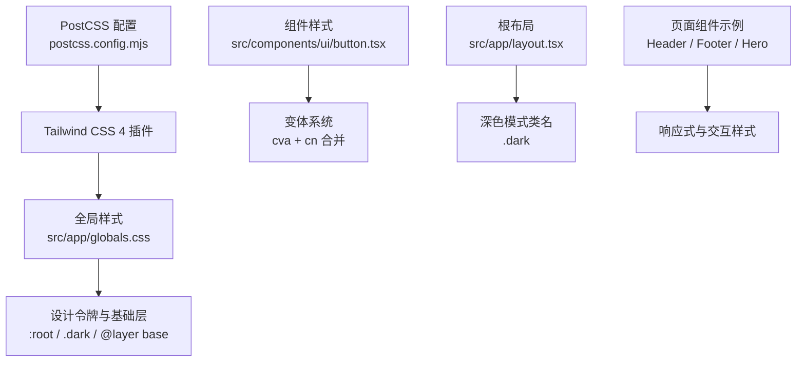
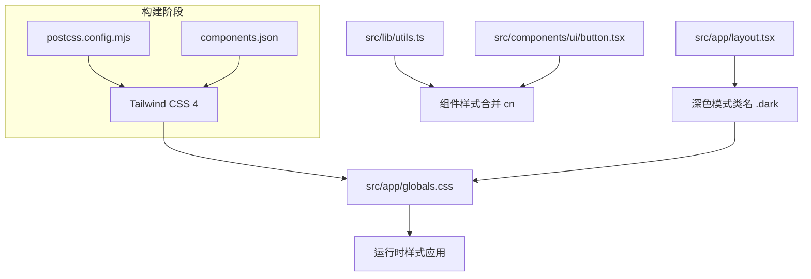
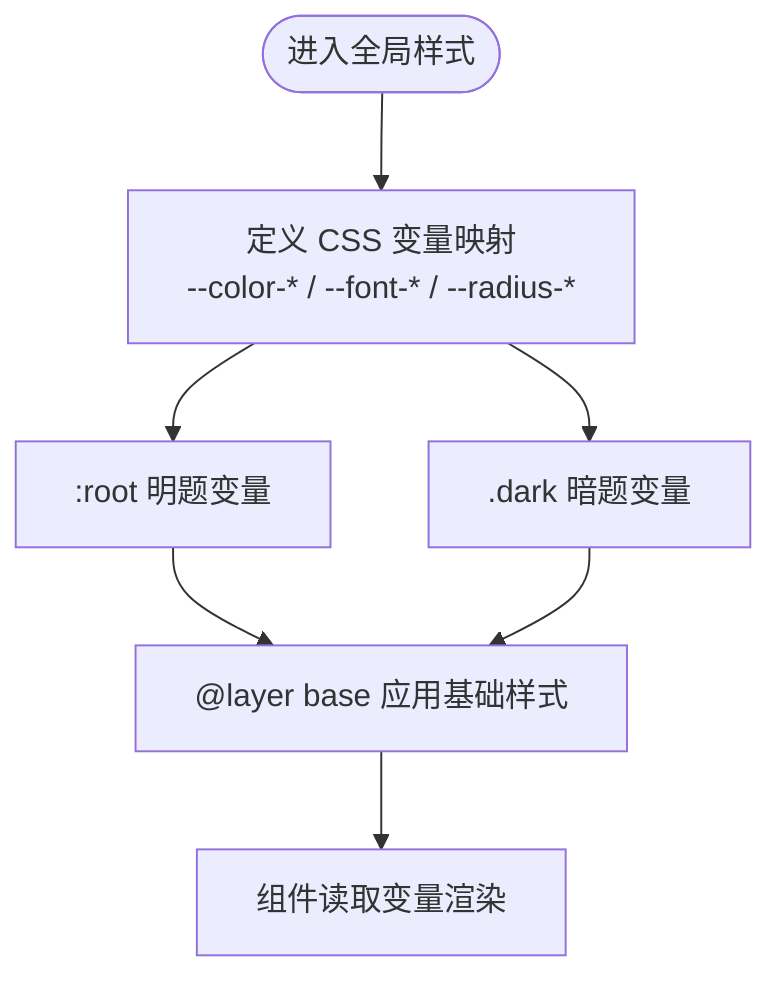
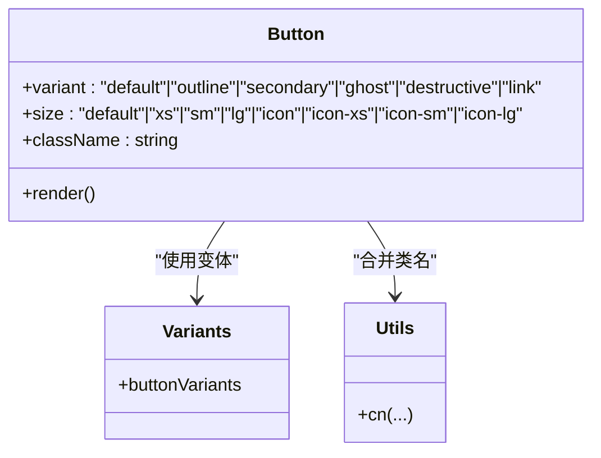
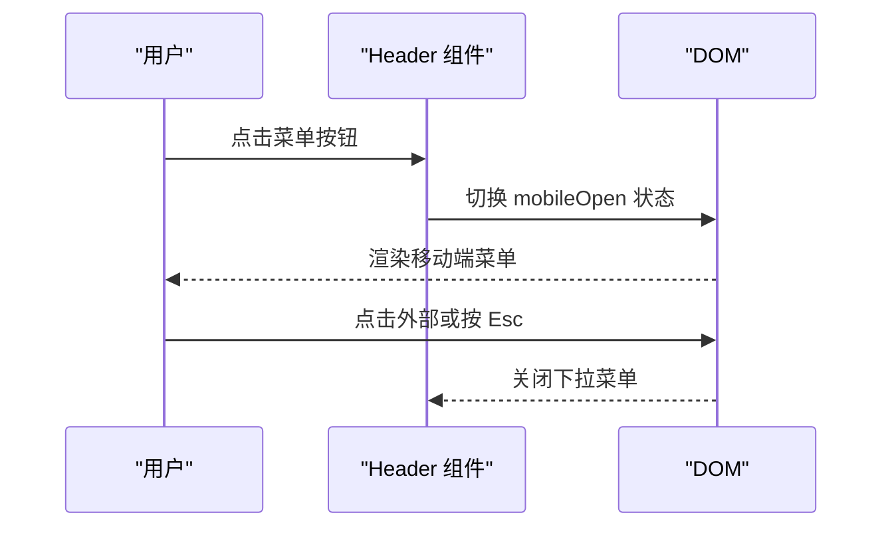
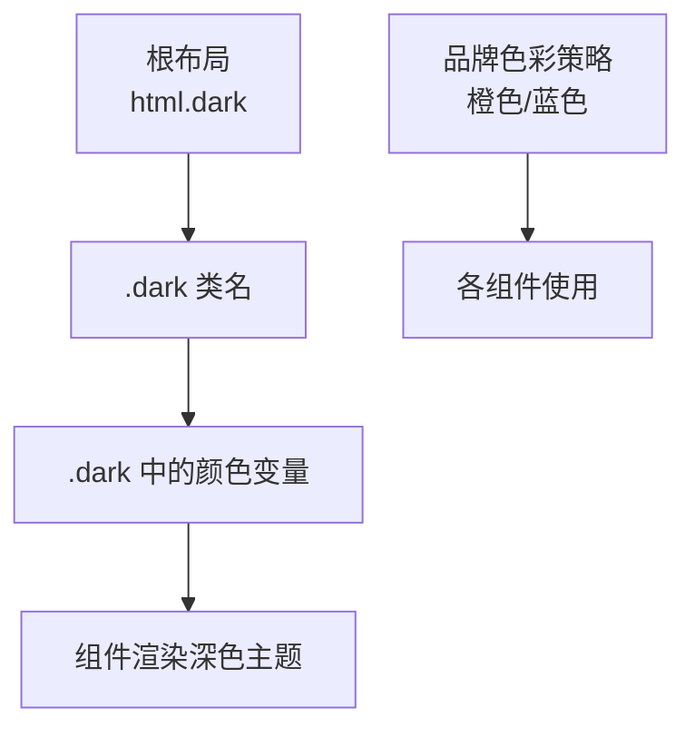
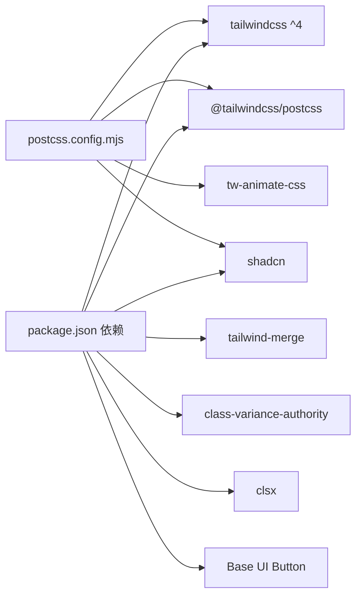

# 样式系统

<cite>
**本文引用的文件**
- [package.json](file://package.json)
- [postcss.config.mjs](file://postcss.config.mjs)
- [components.json](file://components.json)
- [next.config.ts](file://next.config.ts)
- [src/app/globals.css](file://src/app/globals.css)
- [src/app/layout.tsx](file://src/app/layout.tsx)
- [src/components/ui/button.tsx](file://src/components/ui/button.tsx)
- [src/components/Header.tsx](file://src/components/Header.tsx)
- [src/components/Footer.tsx](file://src/components/Footer.tsx)
- [src/components/Hero.tsx](file://src/components/Hero.tsx)
- [src/lib/utils.ts](file://src/lib/utils.ts)
- [src/lib/brand.ts](file://src/lib/brand.ts)
- [tsconfig.json](file://tsconfig.json)
</cite>

## 目录
1. [引言](#引言)
2. [项目结构](#项目结构)
3. [核心组件](#核心组件)
4. [架构总览](#架构总览)
5. [详细组件分析](#详细组件分析)
6. [依赖关系分析](#依赖关系分析)
7. [性能考量](#性能考量)
8. [故障排查指南](#故障排查指南)
9. [结论](#结论)
10. [附录](#附录)

## 引言
本文件系统性梳理蓝辉轻改网站的样式系统，重点围绕 Tailwind CSS 4 与 shadcn/ui 的集成方案与配置方法，详解设计令牌（颜色、字体、间距、圆角）的落地方式，说明组件样式的封装策略（含 CSS 模块化与样式隔离），阐述响应式设计的断点与移动端优先策略，并给出主题定制（深色模式与品牌色彩）的实现路径。最后总结样式开发的最佳实践与调试技巧。

## 项目结构
样式系统由以下关键要素构成：
- 构建与插件：通过 PostCSS 插件加载 Tailwind CSS 4，启用 shadcn/tailwind.css 并引入动画库。
- 全局样式：在全局 CSS 中定义设计令牌（oklch 颜色空间）、字体族、圆角半径与基础层应用。
- 组件样式：以 shadcn/ui 为基础风格，结合 cva 变体系统与 cn 合并工具实现组件样式封装。
- 主题与布局：根布局开启深色模式类名，配合 CSS 自定义属性实现明/暗两套主题。
- 响应式与交互：通过 Tailwind 断点与组件内条件样式实现移动端优先与跨设备适配。

图表来源
- [postcss.config.mjs:1-8](file://postcss.config.mjs#L1-L8)
- [src/app/globals.css:1-130](file://src/app/globals.css#L1-L130)
- [src/components/ui/button.tsx:1-61](file://src/components/ui/button.tsx#L1-L61)
- [src/app/layout.tsx:1-39](file://src/app/layout.tsx#L1-L39)
- [src/components/Header.tsx:1-292](file://src/components/Header.tsx#L1-L292)
- [src/components/Footer.tsx:1-113](file://src/components/Footer.tsx#L1-L113)
- [src/components/Hero.tsx:1-56](file://src/components/Hero.tsx#L1-L56)

章节来源
- [package.json:1-60](file://package.json#L1-L60)
- [postcss.config.mjs:1-8](file://postcss.config.mjs#L1-L8)
- [components.json:1-26](file://components.json#L1-L26)
- [next.config.ts:1-14](file://next.config.ts#L1-L14)
- [src/app/globals.css:1-130](file://src/app/globals.css#L1-L130)
- [src/app/layout.tsx:1-39](file://src/app/layout.tsx#L1-L39)

## 核心组件
- Tailwind CSS 4 与 PostCSS 集成：通过 PostCSS 插件加载 Tailwind，确保原子类与设计令牌生效。
- shadcn/ui 集成：使用官方 tailwind.css 作为基础风格，组件风格统一，便于扩展与定制。
- 设计令牌：采用 oklch 颜色空间，定义主色、辅助色、背景、边框、输入、环形光晕等；圆角半径按比例缩放形成体系。
- 组件封装：基于 cva 定义按钮变体与尺寸，使用 cn 合并工具保证类名冲突最小化。
- 深色模式：根元素添加 .dark 类名，配合 CSS 自定义属性在 .dark 中重定义颜色变量，实现主题切换。
- 响应式：使用 Tailwind 断点（sm/md/lg 等）与组件内条件样式，遵循移动端优先策略。

章节来源
- [package.json:37-48](file://package.json#L37-L48)
- [postcss.config.mjs:1-8](file://postcss.config.mjs#L1-L8)
- [components.json:6-12](file://components.json#L6-L12)
- [src/app/globals.css:7-49](file://src/app/globals.css#L7-L49)
- [src/components/ui/button.tsx:8-43](file://src/components/ui/button.tsx#L8-L43)
- [src/lib/utils.ts:1-7](file://src/lib/utils.ts#L1-L7)
- [src/app/layout.tsx:26-27](file://src/app/layout.tsx#L26-L27)

## 架构总览
下图展示样式系统的关键交互：构建阶段加载 Tailwind 与 shadcn 基础样式，运行时通过根布局注入深色模式类名，组件通过 cva 与 cn 实现样式变体与合并，全局 CSS 提供设计令牌与基础层。

图表来源
- [postcss.config.mjs:1-8](file://postcss.config.mjs#L1-L8)
- [components.json:1-26](file://components.json#L1-L26)
- [src/app/globals.css:1-130](file://src/app/globals.css#L1-L130)
- [src/app/layout.tsx:26-27](file://src/app/layout.tsx#L26-L27)
- [src/lib/utils.ts:1-7](file://src/lib/utils.ts#L1-L7)
- [src/components/ui/button.tsx:1-61](file://src/components/ui/button.tsx#L1-L61)

## 详细组件分析

### 设计令牌与颜色系统
- 颜色体系：采用 oklch 颜色空间，定义背景、前景、卡片、弹出层、主色、次色、静默色、强调色、破坏性、边框、输入、环形光晕、侧边栏等变量；明/暗两套主题分别在 :root 与 .dark 中重定义。
- 圆角体系：以 --radius 为基准，按比例缩放生成不同层级的圆角半径，用于按钮、卡片、输入框等组件。
- 字体与排版：通过 CSS 变量指定无衬线与等宽字体族，基础层应用字体族与边框/轮廓样式。

图表来源
- [src/app/globals.css:7-49](file://src/app/globals.css#L7-L49)
- [src/app/globals.css:51-84](file://src/app/globals.css#L51-L84)
- [src/app/globals.css:86-118](file://src/app/globals.css#L86-L118)
- [src/app/globals.css:120-130](file://src/app/globals.css#L120-L130)

章节来源
- [src/app/globals.css:1-130](file://src/app/globals.css#L1-L130)

### 组件样式封装：按钮组件
- 变体系统：使用 cva 定义 variant（默认/描边/次要/幽影/破坏/链接）与 size（默认/xs/sm/lg/icon 系列）两类维度，形成高内聚的样式矩阵。
- 样式合并：通过 cn 合并工具处理类名冲突，确保原子类与变体类叠加时的确定性。
- 交互状态：聚焦、悬停、激活、禁用、错误态等通过 Tailwind 原子类与伪类组合实现。
- 图标与间距：支持内联图标尺寸与间距，保持视觉一致性。

图表来源
- [src/components/ui/button.tsx:8-43](file://src/components/ui/button.tsx#L8-L43)
- [src/components/ui/button.tsx:45-58](file://src/components/ui/button.tsx#L45-L58)
- [src/lib/utils.ts:1-7](file://src/lib/utils.ts#L1-L7)

章节来源
- [src/components/ui/button.tsx:1-61](file://src/components/ui/button.tsx#L1-L61)
- [src/lib/utils.ts:1-7](file://src/lib/utils.ts#L1-L7)

### 响应式设计与移动端优先
- 断点与容器：使用 Tailwind 断点（sm/md/lg 等）控制布局切换，如桌面端主导航隐藏、移动端抽屉菜单出现。
- 移动优先：组件内优先设置移动端基础样式，再在断点上叠加增强样式，保证小屏体验优先。
- 交互细节：移动端菜单折叠/展开、下拉菜单的点击/键盘事件处理，均在组件内部实现。

图表来源
- [src/components/Header.tsx:44-78](file://src/components/Header.tsx#L44-L78)
- [src/components/Header.tsx:200-209](file://src/components/Header.tsx#L200-L209)
- [src/components/Header.tsx:213-247](file://src/components/Header.tsx#L213-L247)

章节来源
- [src/components/Header.tsx:1-292](file://src/components/Header.tsx#L1-L292)

### 主题定制：深色模式与品牌色彩
- 深色模式：根布局添加 .dark 类名，全局 CSS 在 .dark 中重定义颜色变量，实现一键主题切换。
- 品牌色彩：橙色作为强调色贯穿 CTA 与导航选中态，蓝色用于背景渐变与强调文字，形成品牌识别度。
- 组件一致性：按钮、导航、页脚等组件共享同一套颜色变量，确保视觉统一。

图表来源
- [src/app/layout.tsx:26-27](file://src/app/layout.tsx#L26-L27)
- [src/app/globals.css:86-118](file://src/app/globals.css#L86-L118)
- [src/components/Header.tsx:192-198](file://src/components/Header.tsx#L192-L198)
- [src/components/Hero.tsx:21-30](file://src/components/Hero.tsx#L21-L30)

章节来源
- [src/app/layout.tsx:1-39](file://src/app/layout.tsx#L1-L39)
- [src/app/globals.css:1-130](file://src/app/globals.css#L1-L130)
- [src/components/Hero.tsx:1-56](file://src/components/Hero.tsx#L1-L56)
- [src/components/Header.tsx:1-292](file://src/components/Header.tsx#L1-L292)

### 页面级样式示例
- 头部导航：桌面端使用 flex 布局与下划线选中态，移动端抽屉菜单与下拉子菜单。
- 页脚：网格布局分栏，品牌信息、快捷导航、产品中心与联系方式四列布局。
- 英雄区：背景渐变与装饰圆形，强调文案使用品牌渐变色，CTA 使用品牌强调色。

章节来源
- [src/components/Header.tsx:1-292](file://src/components/Header.tsx#L1-L292)
- [src/components/Footer.tsx:1-113](file://src/components/Footer.tsx#L1-L113)
- [src/components/Hero.tsx:1-56](file://src/components/Hero.tsx#L1-L56)

## 依赖关系分析
- 构建依赖：Tailwind CSS 4、@tailwindcss/postcss、shadcn/tailwind.css、tw-animate-css。
- 运行时依赖：class-variance-authority、clsx、tailwind-merge、@base-ui/react。
- 配置文件：postcss.config.mjs、components.json、next.config.ts、tsconfig.json。

图表来源
- [package.json:37-48](file://package.json#L37-L48)
- [postcss.config.mjs:1-8](file://postcss.config.mjs#L1-L8)

章节来源
- [package.json:1-60](file://package.json#L1-L60)
- [postcss.config.mjs:1-8](file://postcss.config.mjs#L1-L8)
- [components.json:1-26](file://components.json#L1-L26)
- [next.config.ts:1-14](file://next.config.ts#L1-L14)
- [tsconfig.json:1-35](file://tsconfig.json#L1-L35)

## 性能考量
- 原子类体积控制：仅引入必要的 Tailwind 工具类，避免过度使用未使用的类导致包体膨胀。
- 动画与过渡：合理使用 tw-animate-css 与过渡类，减少复杂动画对首屏性能的影响。
- 图片与资源：Next.js 图像优化已启用，建议在组件中使用 next/image 并设置合适的尺寸与格式。
- 构建优化：PostCSS 插件按需加载，避免重复引入相同样式源。

## 故障排查指南
- 样式不生效
  - 检查是否正确引入全局样式与 shadcn/tailwind.css。
  - 确认组件是否使用 cn 合并类名，避免类名冲突。
- 深色模式无效
  - 确认根元素是否包含 .dark 类名。
  - 检查 .dark 中的颜色变量是否被正确覆盖。
- 组件变体异常
  - 检查 cva 变体定义与默认值是否符合预期。
  - 确认 variant/size 参数传入是否正确。
- 响应式问题
  - 使用浏览器开发者工具检查断点与媒体查询是否生效。
  - 确保移动端优先的样式声明顺序正确。

章节来源
- [src/app/globals.css:1-130](file://src/app/globals.css#L1-L130)
- [src/app/layout.tsx:26-27](file://src/app/layout.tsx#L26-L27)
- [src/components/ui/button.tsx:8-43](file://src/components/ui/button.tsx#L8-L43)
- [src/lib/utils.ts:1-7](file://src/lib/utils.ts#L1-L7)

## 结论
该样式系统以 Tailwind CSS 4 为核心，结合 shadcn/ui 的基础风格与 cva 变体系统，实现了高内聚、低耦合的组件样式封装。通过 oklch 颜色体系与 CSS 变量，建立了完整的明/暗双主题与品牌色彩体系；响应式设计遵循移动端优先原则，配合断点与组件内逻辑实现跨设备一致体验。整体架构清晰、扩展性强，适合长期演进与团队协作。

## 附录
- 设计令牌清单（节选）
  - 颜色：背景、前景、主色、次色、静默色、强调色、破坏性、边框、输入、环形光晕、侧边栏系列。
  - 字体：无衬线、等宽、标题字体族。
  - 圆角：--radius 及其比例派生值。
- 组件变体参考
  - 按钮：variant（默认/描边/次要/幽影/破坏/链接）、size（默认/xs/sm/lg/icon 系列）。
- 品牌色彩应用
  - 导航选中态与 CTA 使用橙色；强调文案与装饰使用蓝色渐变。