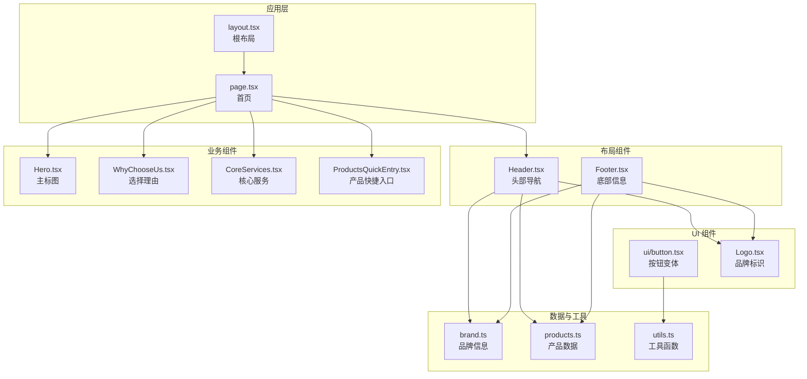
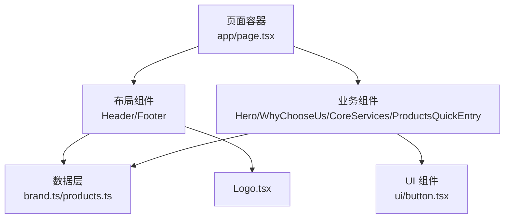
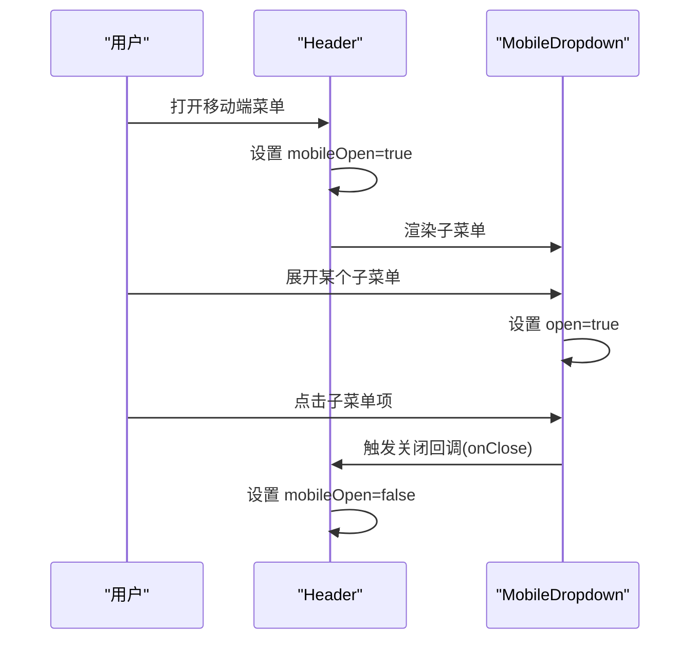
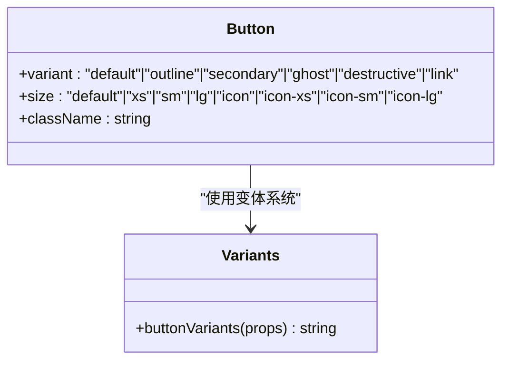
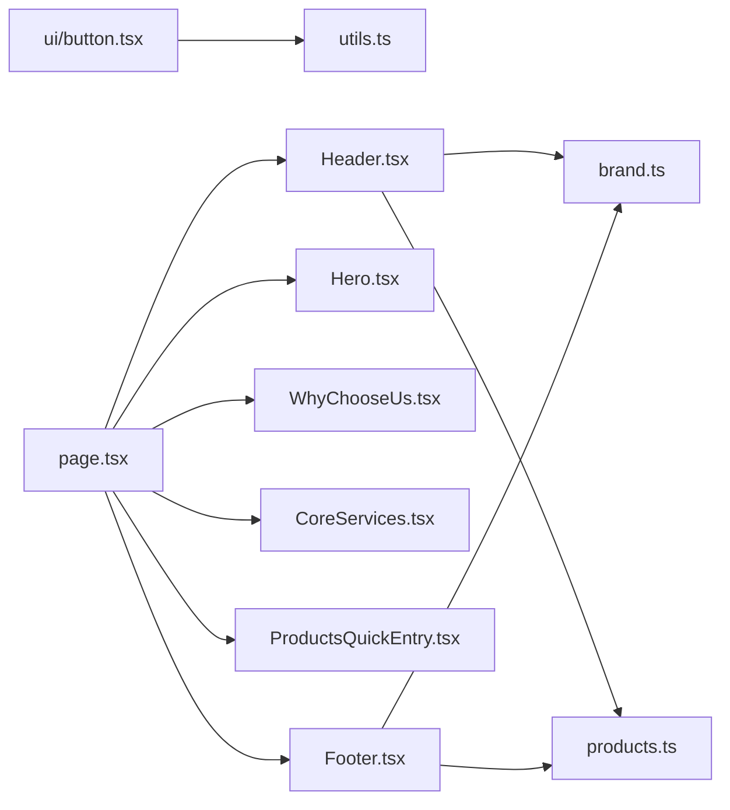

# 组件架构

<cite>
**本文档引用的文件**
- [src/app/layout.tsx](file://src/app/layout.tsx)
- [src/app/page.tsx](file://src/app/page.tsx)
- [src/components/Header.tsx](file://src/components/Header.tsx)
- [src/components/Footer.tsx](file://src/components/Footer.tsx)
- [src/components/Hero.tsx](file://src/components/Hero.tsx)
- [src/components/WhyChooseUs.tsx](file://src/components/WhyChooseUs.tsx)
- [src/components/ui/button.tsx](file://src/components/ui/button.tsx)
- [src/components/CoreServices.tsx](file://src/components/CoreServices.tsx)
- [src/components/ProductsQuickEntry.tsx](file://src/components/ProductsQuickEntry.tsx)
- [src/components/Logo.tsx](file://src/components/Logo.tsx)
- [src/lib/brand.ts](file://src/lib/brand.ts)
- [src/lib/products.ts](file://src/lib/products.ts)
- [src/lib/utils.ts](file://src/lib/utils.ts)
- [package.json](file://package.json)
- [next.config.ts](file://next.config.ts)
</cite>

## 目录
1. [引言](#引言)
2. [项目结构](#项目结构)
3. [核心组件](#核心组件)
4. [架构总览](#架构总览)
5. [详细组件分析](#详细组件分析)
6. [依赖关系分析](#依赖关系分析)
7. [性能考量](#性能考量)
8. [故障排查指南](#故障排查指南)
9. [结论](#结论)
10. [附录](#附录)

## 引言
本项目基于 Next.js 构建，采用 React 组件化理念与分层架构原则，围绕“布局组件 + 业务组件 + UI 组件”的分层组织方式，实现可复用、可组合、可扩展的前端架构。组件间通过 Props 传递、Context 使用与事件冒泡进行通信；状态管理遵循“就近原则”，在组件内部维护本地状态，在数据层集中管理品牌与产品等全局信息；同时引入可变样式系统与工具函数库，提升组件一致性与可维护性。

## 项目结构
项目采用“页面级路由 + 组件库”相结合的目录组织方式：
- 页面入口位于 src/app 下，如根页面与各业务页面
- 公共组件集中在 src/components 下，按职责分为布局、业务、UI 三类
- 数据与工具位于 src/lib 下，提供品牌、产品、通用工具等能力
- 样式与主题通过 Tailwind CSS 与 class-variance-authority 实现一致的视觉与交互体验

图表来源
- [src/app/layout.tsx:1-32](file://src/app/layout.tsx#L1-L32)
- [src/app/page.tsx:1-22](file://src/app/page.tsx#L1-L22)
- [src/components/Header.tsx:1-292](file://src/components/Header.tsx#L1-L292)
- [src/components/Footer.tsx:1-113](file://src/components/Footer.tsx#L1-L113)
- [src/components/Hero.tsx:1-56](file://src/components/Hero.tsx#L1-L56)
- [src/components/WhyChooseUs.tsx:1-84](file://src/components/WhyChooseUs.tsx#L1-L84)
- [src/components/ui/button.tsx:1-61](file://src/components/ui/button.tsx#L1-L61)
- [src/components/CoreServices.tsx](file://src/components/CoreServices.tsx)
- [src/components/ProductsQuickEntry.tsx](file://src/components/ProductsQuickEntry.tsx)
- [src/components/Logo.tsx](file://src/components/Logo.tsx)
- [src/lib/brand.ts:1-28](file://src/lib/brand.ts#L1-L28)
- [src/lib/products.ts:1-282](file://src/lib/products.ts#L1-L282)
- [src/lib/utils.ts](file://src/lib/utils.ts)

章节来源
- [src/app/layout.tsx:1-32](file://src/app/layout.tsx#L1-L32)
- [src/app/page.tsx:1-22](file://src/app/page.tsx#L1-L22)

## 核心组件
- 布局组件
  - Header：负责主导航、移动端菜单、下拉子菜单、路径高亮与外部交互（点击外部关闭、Esc 关闭）
  - Footer：负责品牌信息、快捷导航、产品导航与联系方式展示
- 业务组件
  - Hero：首页主视觉区域，包含品牌标语、行动号召与门店预约入口
  - WhyChooseUs：展示三大核心优势的卡片网格
  - CoreServices / ProductsQuickEntry：作为页面内容扩展，提供服务与产品入口
- UI 组件
  - Button：基于 class-variance-authority 的可变样式按钮，支持多种变体与尺寸

章节来源
- [src/components/Header.tsx:1-292](file://src/components/Header.tsx#L1-L292)
- [src/components/Footer.tsx:1-113](file://src/components/Footer.tsx#L1-L113)
- [src/components/Hero.tsx:1-56](file://src/components/Hero.tsx#L1-L56)
- [src/components/WhyChooseUs.tsx:1-84](file://src/components/WhyChooseUs.tsx#L1-L84)
- [src/components/ui/button.tsx:1-61](file://src/components/ui/button.tsx#L1-L61)

## 架构总览
整体架构遵循“页面容器 + 组件组合”的模式：
- 页面容器负责装配布局与业务组件
- 布局组件通过路由与品牌/产品数据驱动导航与内容
- UI 组件通过变体系统保证一致的交互与视觉
- 数据层通过模块化导出提供全局可读的品牌与产品信息

图表来源
- [src/app/page.tsx:1-22](file://src/app/page.tsx#L1-L22)
- [src/components/Header.tsx:1-292](file://src/components/Header.tsx#L1-L292)
- [src/components/Footer.tsx:1-113](file://src/components/Footer.tsx#L1-L113)
- [src/components/Hero.tsx:1-56](file://src/components/Hero.tsx#L1-L56)
- [src/components/WhyChooseUs.tsx:1-84](file://src/components/WhyChooseUs.tsx#L1-L84)
- [src/components/ui/button.tsx:1-61](file://src/components/ui/button.tsx#L1-L61)
- [src/components/Logo.tsx](file://src/components/Logo.tsx)
- [src/lib/brand.ts:1-28](file://src/lib/brand.ts#L1-L28)
- [src/lib/products.ts:1-282](file://src/lib/products.ts#L1-L282)

## 详细组件分析

### 布局组件：Header
- 职责与设计要点
  - 导航项动态生成：根据产品数据与品牌数据构建导航树
  - 路由高亮：基于 pathname 判断当前激活项，支持精确匹配与前缀匹配
  - 下拉菜单：桌面端与移动端分别实现，支持点击外部关闭与 Esc 关闭
  - 移动端菜单：折叠式子菜单，支持子项展开与关闭回调
- 状态管理
  - 本地状态：下拉开关 openDropdown、移动端菜单开关 mobileOpen
  - 生命周期：通过 useEffect 注册/卸载全局事件监听器
- 可复用与组合
  - 将子菜单拆分为独立的 MobileDropdown 组件，便于复用与测试
  - 通过 props 接收关闭回调，实现父子通信

图表来源
- [src/components/Header.tsx:213-246](file://src/components/Header.tsx#L213-L246)
- [src/components/Header.tsx:251-291](file://src/components/Header.tsx#L251-L291)

章节来源
- [src/components/Header.tsx:1-292](file://src/components/Header.tsx#L1-L292)

### 布局组件：Footer
- 职责与设计要点
  - 四列布局：品牌信息、快捷导航、产品中心、联系方式
  - 动态导航：基于品牌与产品数据生成导航列表
  - 响应式：在小屏设备下调整为单列显示
- 复用策略
  - 通过品牌与产品模块导出的常量与数组，减少硬编码
  - Logo 组件复用，保持品牌一致性

章节来源
- [src/components/Footer.tsx:1-113](file://src/components/Footer.tsx#L1-L113)
- [src/lib/brand.ts:1-28](file://src/lib/brand.ts#L1-L28)
- [src/lib/products.ts:1-282](file://src/lib/products.ts#L1-L282)
- [src/components/Logo.tsx](file://src/components/Logo.tsx)

### 业务组件：Hero
- 职责与设计要点
  - 主视觉展示：品牌标语、核心描述与两个行动号召按钮
  - 背景装饰：渐变与圆形遮罩营造科技感
- 组合模式
  - 通过 Link 组件与图标组合实现按钮行为与视觉统一

章节来源
- [src/components/Hero.tsx:1-56](file://src/components/Hero.tsx#L1-L56)

### 业务组件：WhyChooseUs
- 职责与设计要点
  - 三栏卡片网格：展示“轻改方案整合”“本地门店交付”“兼顾颜值与实用”
  - 颜色映射：通过映射表为不同卡片分配边框、背景与文字颜色
- 可复用与组合
  - 特性数组与颜色映射解耦，便于新增特性与主题色

章节来源
- [src/components/WhyChooseUs.tsx:1-84](file://src/components/WhyChooseUs.tsx#L1-L84)

### UI 组件：Button
- 设计与实现
  - 基于 class-variance-authority 的变体系统，支持 variant 与 size 两种维度
  - 通过 cn 工具函数合并类名，确保样式可组合与可覆盖
  - 遵循无障碍与焦点可见性约定
- 复用策略
  - 在业务组件中统一使用，保证交互与视觉一致性

图表来源
- [src/components/ui/button.tsx:8-43](file://src/components/ui/button.tsx#L8-L43)

章节来源
- [src/components/ui/button.tsx:1-61](file://src/components/ui/button.tsx#L1-L61)

### 页面容器：Home
- 装配逻辑
  - 依次渲染 Header、Hero、WhyChooseUs、CoreServices、ProductsQuickEntry 与 Footer
- 通信机制
  - 通过 props 向子组件传递品牌与产品数据
  - 通过 Link 组件实现页面内导航

章节来源
- [src/app/page.tsx:1-22](file://src/app/page.tsx#L1-L22)

## 依赖关系分析
- 组件依赖
  - Header 依赖品牌与产品数据模块，用于动态生成导航
  - Footer 同样依赖品牌与产品数据模块
  - UI 组件依赖工具函数库，保证样式合并与可访问性
- 外部依赖
  - Next.js 提供路由与页面渲染能力
  - Tailwind CSS 与 class-variance-authority 提供样式与变体系统
  - lucide-react 提供图标资源

图表来源
- [src/components/Header.tsx:1-292](file://src/components/Header.tsx#L1-L292)
- [src/components/Footer.tsx:1-113](file://src/components/Footer.tsx#L1-L113)
- [src/components/ui/button.tsx:1-61](file://src/components/ui/button.tsx#L1-L61)
- [src/app/page.tsx:1-22](file://src/app/page.tsx#L1-L22)
- [src/lib/brand.ts:1-28](file://src/lib/brand.ts#L1-L28)
- [src/lib/products.ts:1-282](file://src/lib/products.ts#L1-L282)
- [src/lib/utils.ts](file://src/lib/utils.ts)

章节来源
- [package.json:37-48](file://package.json#L37-L48)
- [next.config.ts:1-9](file://next.config.ts#L1-L9)

## 性能考量
- 组件渲染
  - 使用 React 客户端指令与受控组件，避免不必要的重渲染
  - 下拉菜单与移动端菜单仅在需要时渲染，减少 DOM 负担
- 图标与样式
  - lucide-react 采用 SVG 图标，按需加载，体积小
  - Tailwind CSS 与 class-variance-authority 通过原子化类名提升样式复用效率
- 路由与页面
  - Next.js 的客户端路由与静态输出配置有助于首屏加载与 SEO

## 故障排查指南
- 导航高亮异常
  - 检查 pathname 匹配逻辑与 matchPrefix 配置是否正确
  - 确认路由前缀与实际路径一致
- 下拉菜单无法关闭
  - 检查点击外部关闭与 Esc 键盘事件绑定是否生效
  - 确认 useEffect 返回的清理函数是否正确移除事件监听
- 移动端菜单不响应
  - 检查 mobileOpen 状态切换逻辑与子菜单展开状态
  - 确认子菜单项点击后是否触发父级关闭回调
- 样式不生效
  - 检查 class-variance-authority 变体与 cn 工具函数的合并顺序
  - 确认 Tailwind CSS 配置与类名拼接是否正确

章节来源
- [src/components/Header.tsx:62-78](file://src/components/Header.tsx#L62-L78)
- [src/components/ui/button.tsx:45-58](file://src/components/ui/button.tsx#L45-L58)

## 结论
本项目通过清晰的分层架构与组件化设计，实现了布局、业务与 UI 的职责分离与高内聚低耦合。借助数据层与变体系统，组件具备良好的可复用性与一致性；通过 Props、事件与上下文的组合使用，满足了页面与组件间的通信需求。未来可在状态管理层面引入更完善的全局状态方案，并持续优化可访问性与性能指标。

## 附录
- 组件分类与职责
  - 布局组件：Header、Footer（负责导航与信息展示）
  - 业务组件：Hero、WhyChooseUs、CoreServices、ProductsQuickEntry（负责页面内容与业务逻辑）
  - UI 组件：Button（负责统一的交互与视觉）
- 组件通信机制
  - Props：父传子参数与回调
  - 事件：点击、键盘事件与滚动事件
  - 上下文：当前项目未使用 Context，状态集中在组件内部
- 状态管理策略
  - 本地状态：Header 的下拉与移动端菜单状态
  - 全局状态：品牌与产品数据通过模块导出共享，避免重复请求与状态分散