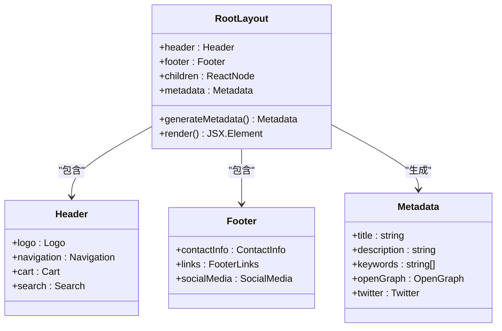
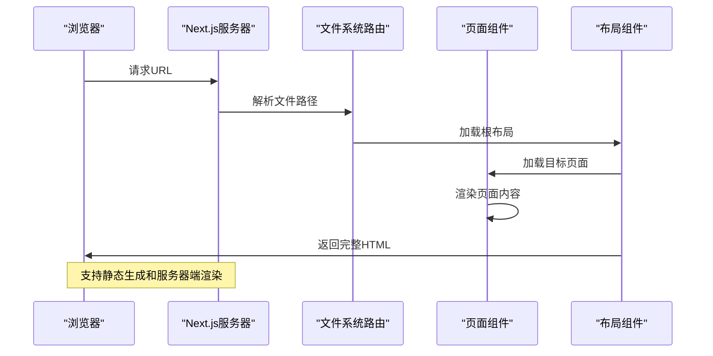
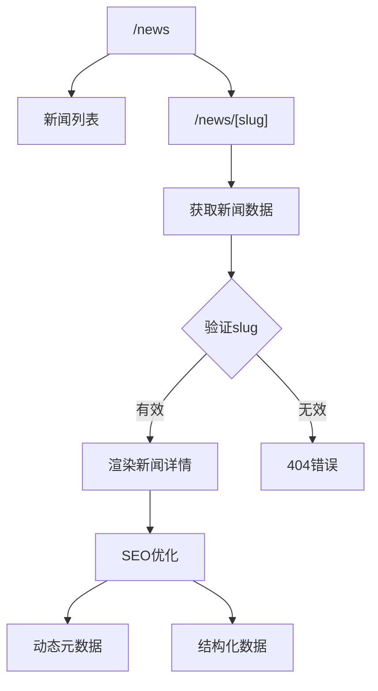
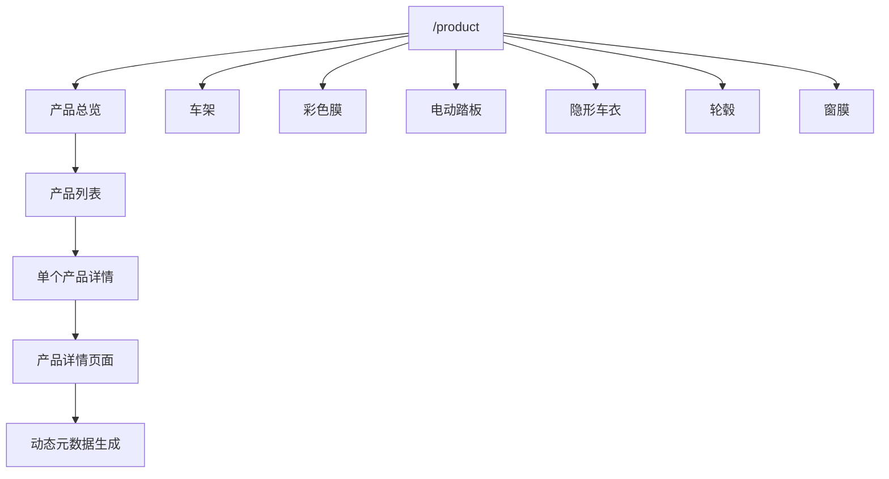
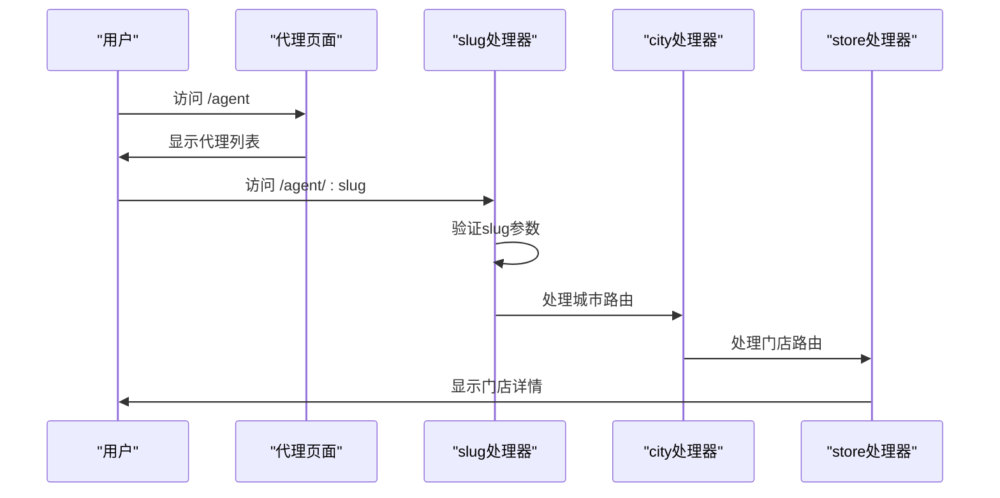
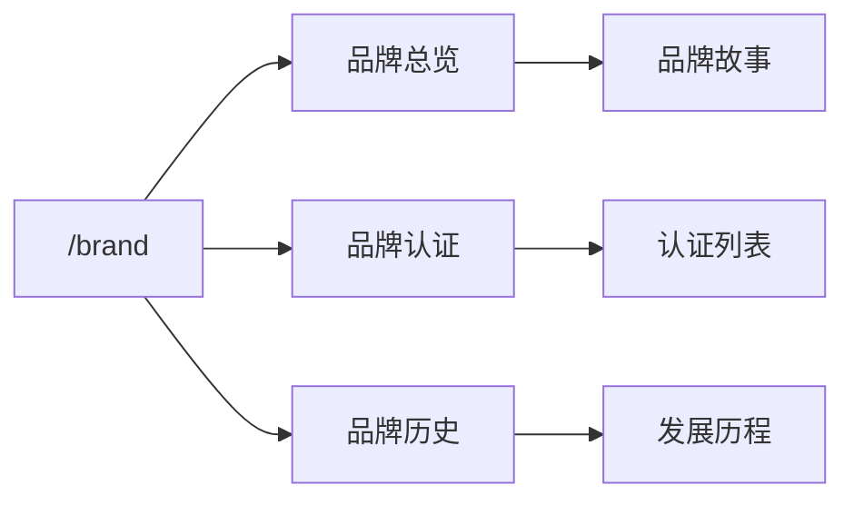
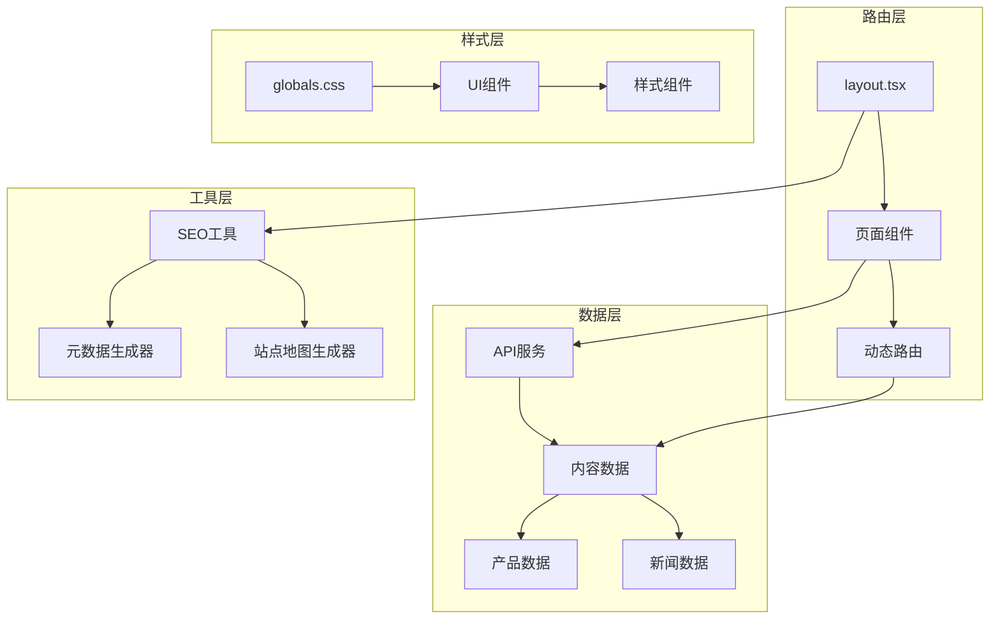
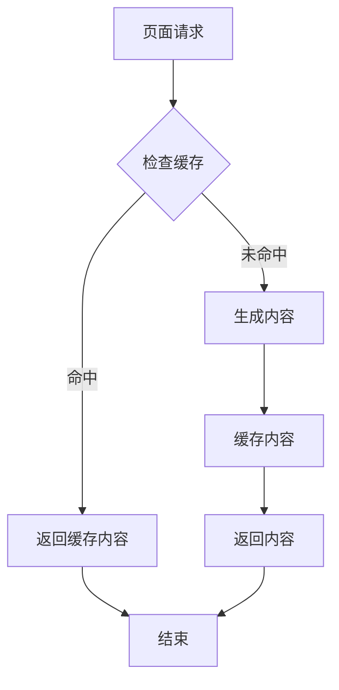

# 路由系统

<cite>
**本文档引用的文件**
- [src/app/layout.tsx](file://src/app/layout.tsx)
- [src/app/page.tsx](file://src/app/page.tsx)
- [src/app/news/page.tsx](file://src/app/news/page.tsx)
- [src/app/news/[slug]/page.tsx](file://src/app/news/[slug]/page.tsx)
- [src/app/product/page.tsx](file://src/app/product/page.tsx)
- [src/app/product/chassis/page.tsx](file://src/app/product/chassis/page.tsx)
- [src/app/product/color-film/page.tsx](file://src/app/product/color-film/page.tsx)
- [src/app/product/electric-steps/page.tsx](file://src/app/product/electric-steps/page.tsx)
- [src/app/product/ppf/page.tsx](file://src/app/product/ppf/page.tsx)
- [src/app/product/wheels/page.tsx](file://src/app/product/wheels/page.tsx)
- [src/app/product/window-film/page.tsx](file://src/app/product/window-film/page.tsx)
- [src/app/agent/page.tsx](file://src/app/agent/page.tsx)
- [src/app/agent/[slug]/page.tsx](file://src/app/agent/[slug]/page.tsx)
- [src/app/agent/[slug]/[city]/page.tsx](file://src/app/agent/[slug]/[city]/page.tsx)
- [src/app/agent/store/[id]/page.tsx](file://src/app/agent/store/[id]/page.tsx)
- [src/app/brand/page.tsx](file://src/app/brand/page.tsx)
- [src/app/brand/certifications/page.tsx](file://src/app/brand/certifications/page.tsx)
- [src/app/brand/history/page.tsx](file://src/app/brand/history/page.tsx)
- [src/app/contact/page.tsx](file://src/app/contact/page.tsx)
- [src/app/robots.ts](file://src/app/robots.ts)
- [src/app/sitemap.ts](file://src/app/sitemap.ts)
- [next.config.ts](file://next.config.ts)
- [package.json](file://package.json)
</cite>

## 目录
1. [简介](#简介)
2. [项目结构](#项目结构)
3. [核心组件](#核心组件)
4. [架构概览](#架构概览)
5. [详细组件分析](#详细组件分析)
6. [依赖关系分析](#依赖关系分析)
7. [性能考虑](#性能考虑)
8. [故障排除指南](#故障排除指南)
9. [结论](#结论)

## 简介

蓝辉轻改网站采用Next.js 16的App Router文件系统路由架构，实现了现代化的React应用路由系统。该系统基于文件夹结构自动生成路由，支持动态路由参数、嵌套路由和SEO优化功能。

## 项目结构

项目采用标准的Next.js App Router目录结构，所有路由页面位于`src/app`目录下：

```mermaid
graph TB
subgraph "应用根目录"
Root[src/app/] --> Layout[layout.tsx<br/>根布局]
Root --> Page[page.tsx<br/>首页]
Root --> News[news/<br/>新闻模块]
Root --> Product[product/<br/>产品模块]
Root --> Agent[agent/<br/>代理模块]
Root --> Brand[brand/<br/>品牌模块]
Root --> Contact[contact/<br/>联系模块]
end
subgraph "新闻模块"
News --> NewsList[news/page.tsx<br/>新闻列表]
News --> NewsDetail[news/[slug]/page.tsx<br/>新闻详情]
end
subgraph "产品模块"
Product --> ProductList[product/page.tsx<br/>产品总览]
Product --> Chassis[product/chassis/page.tsx<br/>车架]
Product --> ColorFilm[product/color-film/page.tsx<br/>彩色膜]
Product --> ElectricSteps[product/electric-steps/page.tsx<br/>电动踏板]
Product --> PPF[product/ppf/page.tsx<br/>隐形车衣]
Product --> Wheels[product/wheels/page.tsx<br/>轮毂]
Product --> WindowFilm[product/window-film/page.tsx<br/>窗膜]
end
subgraph "代理模块"
Agent --> AgentList[agent/page.tsx<br/>代理列表]
Agent --> AgentDetail[agent/[slug]/page.tsx<br/>代理详情]
Agent --> CityDetail[agent/[slug]/[city]/page.tsx<br/>城市详情]
Agent --> StoreDetail[agent/store/[id]/page.tsx<br/>门店详情]
end
```

**图表来源**
- [src/app/layout.tsx](file://src/app/layout.tsx)
- [src/app/news/page.tsx](file://src/app/news/page.tsx)
- [src/app/news/[slug]/page.tsx](file://src/app/news/[slug]/page.tsx)
- [src/app/product/page.tsx](file://src/app/product/page.tsx)
- [src/app/agent/page.tsx](file://src/app/agent/page.tsx)
- [src/app/agent/[slug]/page.tsx](file://src/app/agent/[slug]/page.tsx)
- [src/app/agent/[slug]/[city]/page.tsx](file://src/app/agent/[slug]/[city]/page.tsx)
- [src/app/agent/store/[id]/page.tsx](file://src/app/agent/store/[id]/page.tsx)

**章节来源**
- [src/app/layout.tsx](file://src/app/layout.tsx)
- [src/app/page.tsx](file://src/app/page.tsx)
- [src/app/news/page.tsx](file://src/app/news/page.tsx)
- [src/app/product/page.tsx](file://src/app/product/page.tsx)
- [src/app/agent/page.tsx](file://src/app/agent/page.tsx)

## 核心组件

### 根布局组件（layout.tsx）

根布局组件是整个应用的容器，负责共享的头部、尾部和元数据管理：



**图表来源**
- [src/app/layout.tsx](file://src/app/layout.tsx)

根布局的主要职责：
- 提供全局共享的头部导航和品牌标识
- 管理网站的元数据（标题、描述、关键词等）
- 统一的页脚信息和联系方式
- SEO优化的Open Graph和Twitter卡片配置

### 动态路由参数

系统广泛使用动态路由参数来处理可变内容：

| 路由模式 | 参数名称 | 用途 | 示例 |
|---------|---------|------|------|
| `[slug]` | slug | 文章和产品标识符 | `/news/2024-new-product` |
| `[city]` | city | 城市名称 | `/agent/beijing` |
| `[id]` | id | 数字标识符 | `/agent/store/123` |

**章节来源**
- [src/app/news/[slug]/page.tsx](file://src/app/news/[slug]/page.tsx)
- [src/app/agent/[slug]/page.tsx](file://src/app/agent/[slug]/page.tsx)
- [src/app/agent/[slug]/[city]/page.tsx](file://src/app/agent/[slug]/[city]/page.tsx)
- [src/app/agent/store/[id]/page.tsx](file://src/app/agent/store/[id]/page.tsx)

## 架构概览

Next.js 16 App Router采用文件系统驱动的路由架构，具有以下特点：



**图表来源**
- [src/app/layout.tsx](file://src/app/layout.tsx)
- [src/app/page.tsx](file://src/app/page.tsx)

## 详细组件分析

### 新闻模块路由系统

新闻模块实现了完整的博客式内容管理系统：



**图表来源**
- [src/app/news/page.tsx](file://src/app/news/page.tsx)
- [src/app/news/[slug]/page.tsx](file://src/app/news/[slug]/page.tsx)

#### 新闻列表页面
- 展示所有可用的新闻文章
- 支持分页和分类筛选
- 预渲染静态生成以提升性能

#### 新闻详情页面
- 使用动态路由参数`[slug]`捕获文章标识符
- 从内容管理系统获取对应的文章数据
- 自动生成SEO友好的元数据

**章节来源**
- [src/app/news/page.tsx](file://src/app/news/page.tsx)
- [src/app/news/[slug]/page.tsx](file://src/app/news/[slug]/page.tsx)

### 产品模块路由系统

产品模块采用多层次的分类导航结构：



**图表来源**
- [src/app/product/page.tsx](file://src/app/product/page.tsx)
- [src/app/product/chassis/page.tsx](file://src/app/product/chassis/page.tsx)
- [src/app/product/color-film/page.tsx](file://src/app/product/color-film/page.tsx)
- [src/app/product/electric-steps/page.tsx](file://src/app/product/electric-steps/page.tsx)
- [src/app/product/ppf/page.tsx](file://src/app/product/ppf/page.tsx)
- [src/app/product/wheels/page.tsx](file://src/app/product/wheels/page.tsx)
- [src/app/product/window-film/page.tsx](file://src/app/product/window-film/page.tsx)

每个产品类别都有专门的页面组件，支持：
- 类别级别的产品展示
- 产品图片和规格信息
- 价格和购买选项
- 结构化数据标记

**章节来源**
- [src/app/product/page.tsx](file://src/app/product/page.tsx)
- [src/app/product/chassis/page.tsx](file://src/app/product/chassis/page.tsx)
- [src/app/product/color-film/page.tsx](file://src/app/product/color-film/page.tsx)
- [src/app/product/electric-steps/page.tsx](file://src/app/product/electric-steps/page.tsx)
- [src/app/product/ppf/page.tsx](file://src/app/product/ppf/page.tsx)
- [src/app/product/wheels/page.tsx](file://src/app/product/wheels/page.tsx)
- [src/app/product/window-film/page.tsx](file://src/app/product/window-film/page.tsx)

### 代理模块路由系统

代理模块实现了复杂的多级动态路由：



**图表来源**
- [src/app/agent/page.tsx](file://src/app/agent/page.tsx)
- [src/app/agent/[slug]/page.tsx](file://src/app/agent/[slug]/page.tsx)
- [src/app/agent/[slug]/[city]/page.tsx](file://src/app/agent/[slug]/[city]/page.tsx)
- [src/app/agent/store/[id]/page.tsx](file://src/app/agent/store/[id]/page.tsx)

#### 一级代理页面
- 显示所有可用的代理信息
- 支持按地区和类型筛选

#### 二级动态路由
- `[slug]`参数用于代理标识符
- 支持代理基本信息和联系方式

#### 三级嵌套路由
- `[city]`参数指定城市
- `[id]`参数指定具体门店

**章节来源**
- [src/app/agent/page.tsx](file://src/app/agent/page.tsx)
- [src/app/agent/[slug]/page.tsx](file://src/app/agent/[slug]/page.tsx)
- [src/app/agent/[slug]/[city]/page.tsx](file://src/app/agent/[slug]/[city]/page.tsx)
- [src/app/agent/store/[id]/page.tsx](file://src/app/agent/store/[id]/page.tsx)

### 品牌模块路由系统

品牌模块提供了简洁的品牌信息展示：



**图表来源**
- [src/app/brand/page.tsx](file://src/app/brand/page.tsx)
- [src/app/brand/certifications/page.tsx](file://src/app/brand/certifications/page.tsx)
- [src/app/brand/history/page.tsx](file://src/app/brand/history/page.tsx)

**章节来源**
- [src/app/brand/page.tsx](file://src/app/brand/page.tsx)
- [src/app/brand/certifications/page.tsx](file://src/app/brand/certifications/page.tsx)
- [src/app/brand/history/page.tsx](file://src/app/brand/history/page.tsx)

## 依赖关系分析



**图表来源**
- [src/app/layout.tsx](file://src/app/layout.tsx)
- [src/app/news/[slug]/page.tsx](file://src/app/news/[slug]/page.tsx)
- [src/app/product/[slug]/page.tsx](file://src/app/product/[slug]/page.tsx)

**章节来源**
- [src/app/layout.tsx](file://src/app/layout.tsx)
- [src/app/news/[slug]/page.tsx](file://src/app/news/[slug]/page.tsx)
- [src/app/product/[slug]/page.tsx](file://src/app/product/[slug]/page.tsx)

## 性能考虑

### 静态生成优化

Next.js 16支持多种静态生成策略：

1. **静态生成（SSG）**
   - 适用于内容相对固定的页面
   - 提前生成HTML文件，提升首屏加载速度
   - 适合新闻列表和品牌信息页面

2. **服务器端渲染（SSR）**
   - 适用于需要实时数据的页面
   - 每次请求时生成最新内容
   - 适合代理详情和产品搜索页面

3. **增量静态再生（ISR）**
   - 结合SSG和SSR的优势
   - 在后台更新缓存内容
   - 适合新闻和产品目录页面

### 缓存策略



**章节来源**
- [next.config.ts](file://next.config.ts)
- [src/app/layout.tsx](file://src/app/layout.tsx)

## 故障排除指南

### 常见路由问题

1. **404错误页面**
   - 检查动态路由参数是否正确传递
   - 验证URL路径与文件夹结构匹配
   - 确认slug参数的有效性

2. **嵌套路由冲突**
   - 确保子路由文件夹结构正确
   - 检查父级路由是否正确处理参数
   - 验证路由优先级顺序

3. **SEO优化问题**
   - 检查元数据生成逻辑
   - 验证Open Graph标签完整性
   - 确认结构化数据格式正确

**章节来源**
- [src/app/news/[slug]/page.tsx](file://src/app/news/[slug]/page.tsx)
- [src/app/agent/[slug]/[city]/page.tsx](file://src/app/agent/[slug]/[city]/page.tsx)
- [src/app/layout.tsx](file://src/app/layout.tsx)

## 结论

蓝辉轻改网站的Next.js 16 App Router路由系统展现了现代Web应用的最佳实践：

- **文件系统驱动**：通过直观的文件夹结构自动生成路由
- **动态路由支持**：灵活处理可变内容和参数
- **嵌套路由管理**：清晰的多级路由组织结构
- **SEO优化集成**：内置的元数据管理和结构化数据支持
- **性能优化**：支持多种渲染策略和缓存机制

该路由系统为蓝辉轻改网站提供了稳定、可扩展且SEO友好的内容管理基础，能够有效支撑业务发展和用户体验优化。