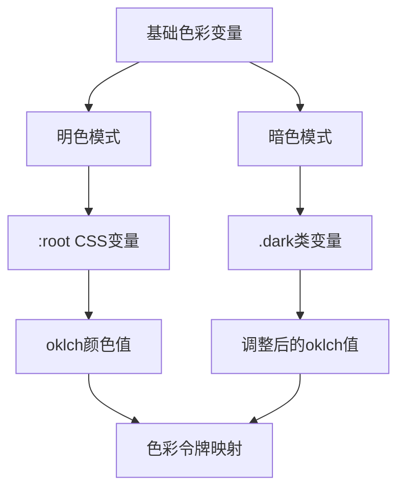
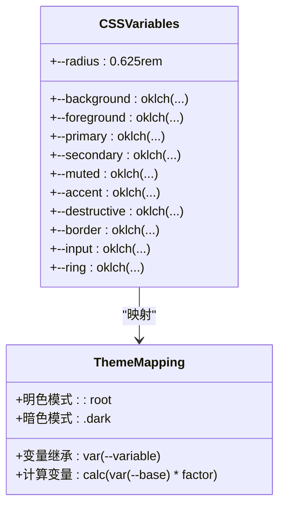
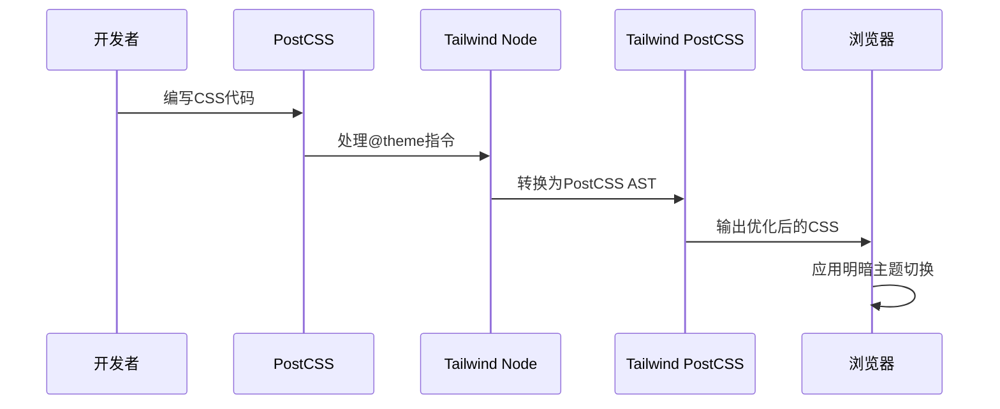
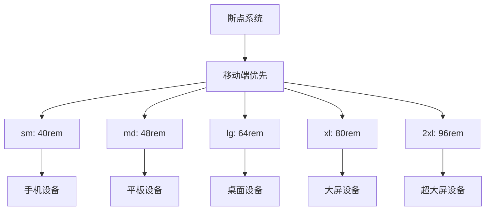
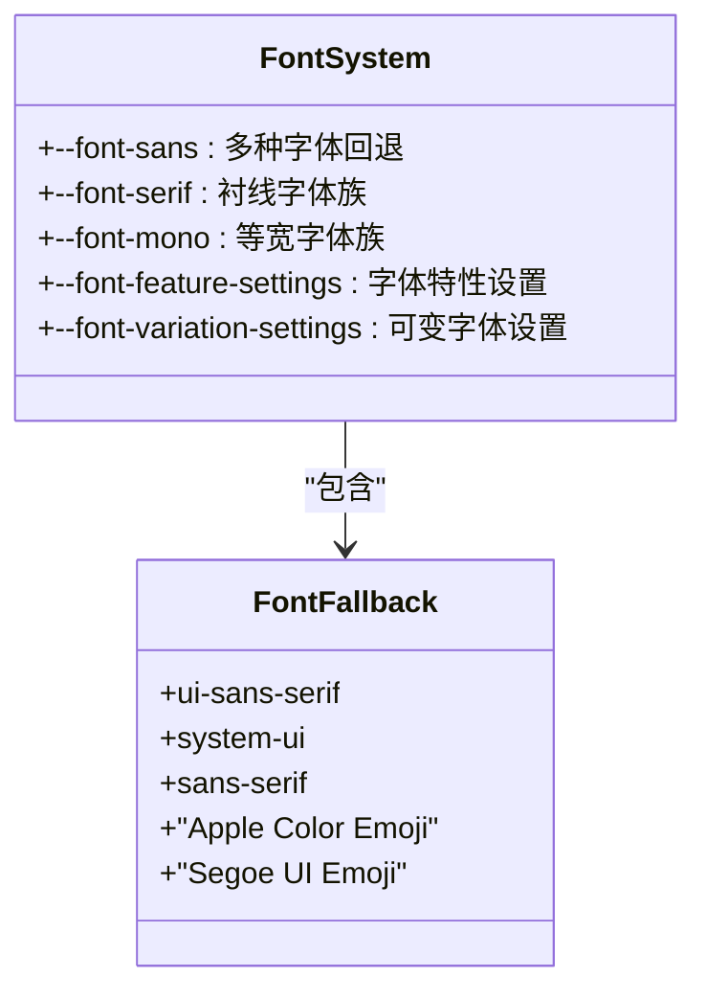
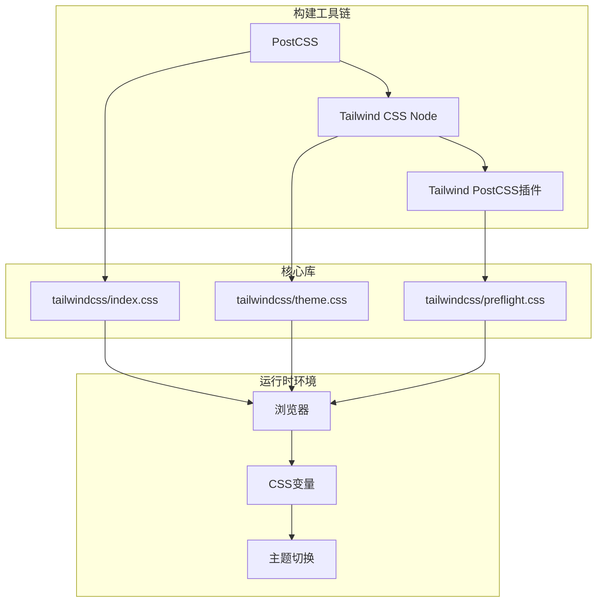
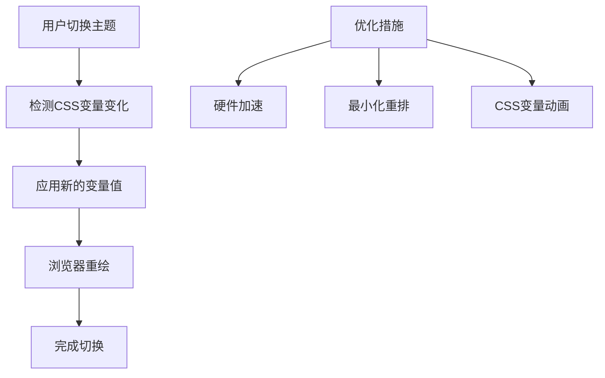

# Tailwind CSS配置

<cite>
**本文档引用的文件**
- [src/app/globals.css](file://src/app/globals.css)
- [postcss.config.mjs](file://postcss.config.mjs)
- [node_modules/tailwindcss/index.css](file://node_modules/tailwindcss/index.css)
- [node_modules/tailwindcss/theme.css](file://node_modules/tailwindcss/theme.css)
- [node_modules/tailwindcss/preflight.css](file://node_modules/tailwindcss/preflight.css)
- [node_modules/@tailwindcss/node/dist/index.mjs](file://node_modules/@tailwindcss/node/dist/index.mjs)
- [node_modules/@tailwindcss/postcss/dist/index.mjs](file://node_modules/@tailwindcss/postcss/dist/index.mjs)
</cite>

## 目录
1. [简介](#简介)
2. [项目结构](#项目结构)
3. [核心组件](#核心组件)
4. [架构概览](#架构概览)
5. [详细组件分析](#详细组件分析)
6. [依赖关系分析](#依赖关系分析)
7. [性能考虑](#性能考虑)
8. [故障排除指南](#故障排除指南)
9. [结论](#结论)

## 简介

本文件为蓝辉轻改网站的Tailwind CSS 4配置详细文档。项目采用最新的Tailwind CSS 4版本，实现了基于oklch色彩空间的现代化色彩系统、完整的CSS变量映射机制以及灵活的主题切换功能。文档深入解析了配置结构、自定义选项、色彩令牌系统、CSS变量映射、@theme指令使用方法，并提供了断点配置、字体系统和间距系统的详细说明。

## 项目结构

蓝辉轻改网站的Tailwind CSS配置主要分布在以下位置：

```mermaid
graph TB
subgraph "配置文件"
A[postcss.config.mjs<br/>PostCSS配置]
B[components.json<br/>组件配置]
end
subgraph "样式文件"
C[src/app/globals.css<br/>全局样式]
D[next.config.ts<br/>Next.js配置]
end
subgraph "Tailwind核心"
E[node_modules/tailwindcss/<br/>核心库]
F[node_modules/@tailwindcss/<br/>扩展插件]
end
A --> C
C --> E
F --> E
```

**图表来源**
- [postcss.config.mjs](file://postcss.config.mjs)
- [src/app/globals.css](file://src/app/globals.css)

**章节来源**
- [postcss.config.mjs](file://postcss.config.mjs)
- [src/app/globals.css](file://src/app/globals.css)

## 核心组件

### 色彩系统配置

项目实现了基于oklch色彩空间的完整色彩系统，支持明暗两种主题模式：



**图表来源**
- [src/app/globals.css](file://src/app/globals.css)

色彩系统特点：
- 使用oklch色彩空间确保色彩感知一致性
- 支持明暗主题自动切换
- 完整的颜色令牌系统（primary、secondary、destructive等）
- 图表颜色专用令牌（chart-1到chart-5）

**章节来源**
- [src/app/globals.css](file://src/app/globals.css)

### CSS变量映射机制

项目建立了完整的CSS变量映射体系：



**图表来源**
- [src/app/globals.css](file://src/app/globals.css)

**章节来源**
- [src/app/globals.css](file://src/app/globals.css)

## 架构概览

Tailwind CSS在项目中的工作流程如下：



**图表来源**
- [node_modules/@tailwindcss/node/dist/index.mjs](file://node_modules/@tailwindcss/node/dist/index.mjs)
- [node_modules/@tailwindcss/postcss/dist/index.mjs](file://node_modules/@tailwindcss/postcss/dist/index.mjs)

## 详细组件分析

### @theme指令实现

Tailwind CSS 4引入了强大的@theme指令系统，用于声明和管理设计令牌：

```mermaid
flowchart LR
A[@theme指令] --> B[设计令牌声明]
B --> C[CSS变量定义]
C --> D[主题函数调用]
D --> E[运行时变量解析]
F[明色主题] --> G[:root选择器]
H[暗色主题] --> I[.dark选择器]
G --> C
I --> C
```

**图表来源**
- [node_modules/tailwindcss/index.css](file://node_modules/tailwindcss/index.css)
- [node_modules/tailwindcss/theme.css](file://node_modules/tailwindcss/theme.css)

### 色彩令牌系统

项目实现了完整的色彩令牌系统，包括基础色彩和语义化色彩：

| 基础色彩令牌 | 明色模式值 | 暗色模式值 |
|------------|-----------|-----------|
| --background | oklch(1 0 0) | oklch(0.145 0 0) |
| --foreground | oklch(0.145 0 0) | oklch(0.985 0 0) |
| --primary | oklch(0.205 0 0) | oklch(0.922 0 0) |
| --secondary | oklch(0.97 0 0) | oklch(0.269 0 0) |
| --destructive | oklch(0.577 0.245 27.325) | oklch(0.704 0.191 22.216) |

**章节来源**
- [src/app/globals.css](file://src/app/globals.css)

### 断点配置系统

项目使用Tailwind CSS 4的标准断点系统：



**图表来源**
- [node_modules/tailwindcss/index.css](file://node_modules/tailwindcss/index.css)

### 字体系统配置

字体系统采用现代化的可变字体技术：



**图表来源**
- [node_modules/tailwindcss/index.css](file://node_modules/tailwindcss/index.css)
- [node_modules/tailwindcss/preflight.css](file://node_modules/tailwindcss/preflight.css)

**章节来源**
- [node_modules/tailwindcss/index.css](file://node_modules/tailwindcss/index.css)
- [node_modules/tailwindcss/preflight.css](file://node_modules/tailwindcss/preflight.css)

### 间距系统

项目实现了完整的间距系统，支持响应式间距：

| 间距单位 | 值 | 描述 |
|---------|----|------|
| px | 1px | 最小间距单位 |
| 0 | 0px | 无间距 |
| 0.5 | 0.125rem | 2px间距 |
| 1 | 0.25rem | 4px间距 |
| 1.5 | 0.375rem | 6px间距 |
| 2 | 0.5rem | 8px间距 |
| ... | ... | ... |
| 96 | 24rem | 最大间距 |

**章节来源**
- [node_modules/tailwindcss/index.css](file://node_modules/tailwindcss/index.css)

## 依赖关系分析



**图表来源**
- [node_modules/@tailwindcss/node/dist/index.mjs](file://node_modules/@tailwindcss/node/dist/index.mjs)
- [node_modules/@tailwindcss/postcss/dist/index.mjs](file://node_modules/@tailwindcss/postcss/dist/index.mjs)

**章节来源**
- [node_modules/@tailwindcss/node/dist/index.mjs](file://node_modules/@tailwindcss/node/dist/index.mjs)
- [node_modules/@tailwindcss/postcss/dist/index.mjs](file://node_modules/@tailwindcss/postcss/dist/index.mjs)

## 性能考虑

### 优化策略

1. **增量编译**: Tailwind CSS 4支持智能增量编译，只重新处理变更的文件
2. **CSS变量缓存**: 利用CSS变量减少重复计算
3. **主题函数优化**: `--theme()`函数提供高效的变量解析
4. **预构建优化**: 生产环境下启用CSS压缩和优化

### 主题切换性能



## 故障排除指南

### 常见问题及解决方案

1. **@theme指令不生效**
   - 检查PostCSS配置是否正确加载Tailwind插件
   - 确认CSS文件中正确使用了@theme指令

2. **色彩显示异常**
   - 验证oklch色彩值格式正确性
   - 检查浏览器对oklch色彩空间的支持情况

3. **主题切换失效**
   - 确认`:root`和`.dark`选择器都正确定义
   - 检查CSS变量的优先级和继承关系

4. **字体渲染问题**
   - 验证字体回退列表的完整性
   - 检查字体文件的加载状态

**章节来源**
- [src/app/globals.css](file://src/app/globals.css)
- [postcss.config.mjs](file://postcss.config.mjs)

## 结论

蓝辉轻改网站的Tailwind CSS 4配置展现了现代CSS架构的最佳实践。通过oklch色彩空间、完整的CSS变量映射、灵活的主题切换机制，以及基于@theme指令的设计令牌系统，项目实现了高度一致且易于维护的样式体系。

配置的关键优势包括：
- 基于oklch的色彩感知一致性
- 完整的主题切换支持
- 灵活的设计令牌系统
- 优秀的性能表现
- 良好的可扩展性

开发者可以根据项目需求，在现有配置基础上进行定制化修改，如调整色彩令牌、添加新的设计令牌、或扩展主题变体等。