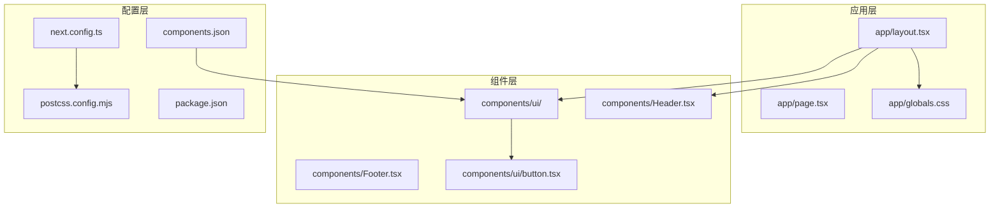
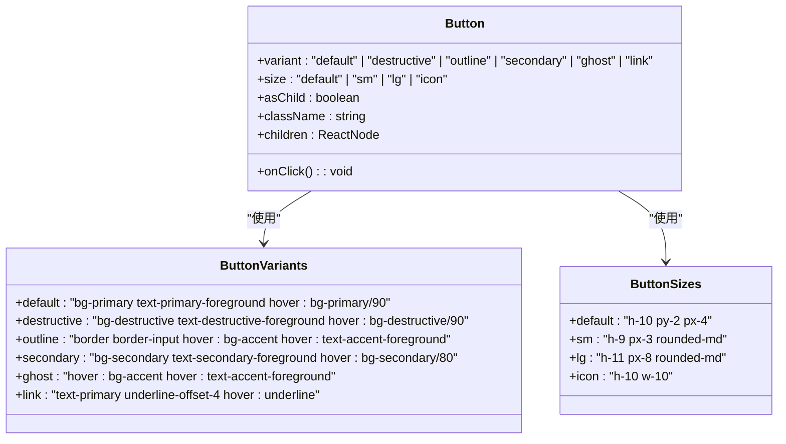
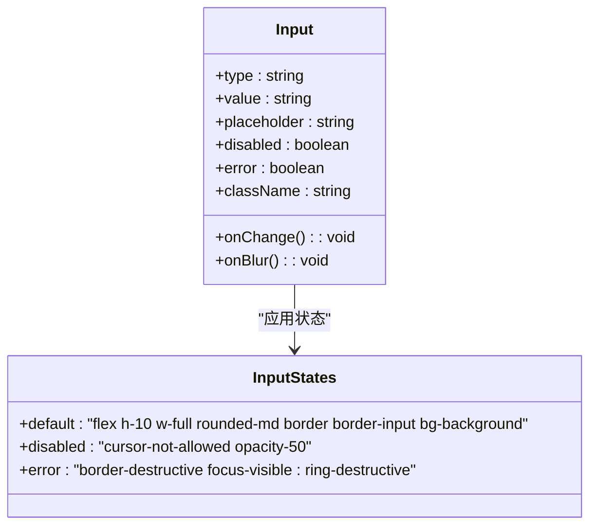
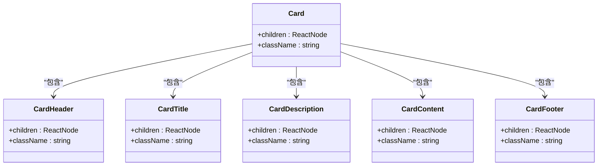
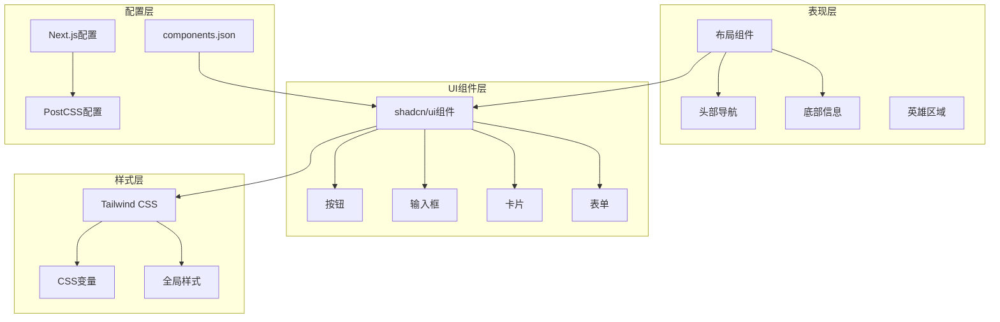
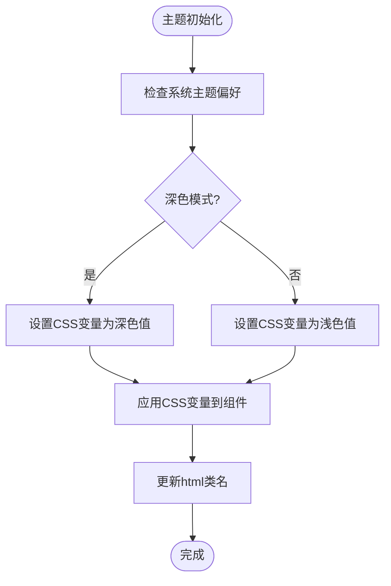
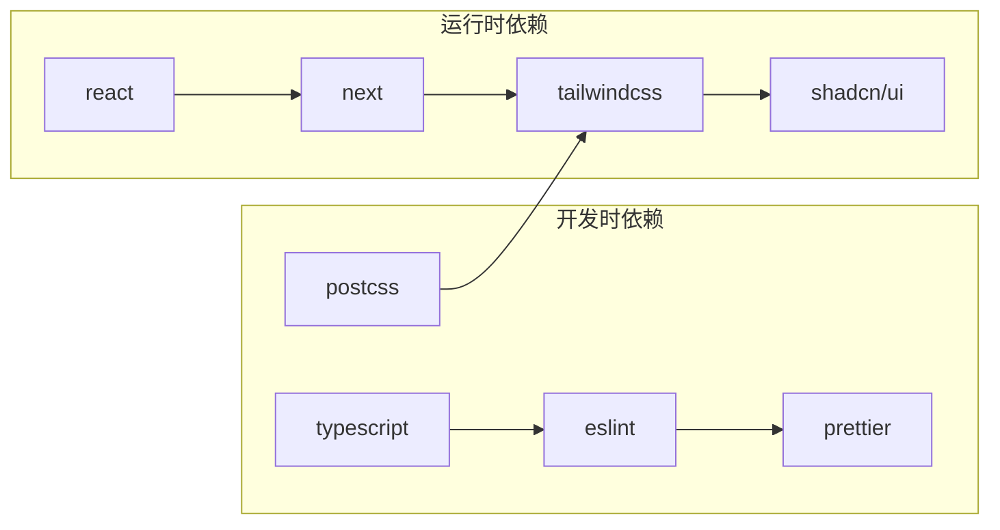

# shadcn/ui组件库集成

<cite>
**本文档引用的文件**
- [components.json](file://components.json)
- [src/app/globals.css](file://src/app/globals.css)
- [next.config.ts](file://next.config.ts)
- [postcss.config.mjs](file://postcss.config.mjs)
- [package.json](file://package.json)
- [src/components/ui/button.tsx](file://src/components/ui/button.tsx)
- [src/components/Header.tsx](file://src/components/Header.tsx)
- [src/app/layout.tsx](file://src/app/layout.tsx)
- [src/app/page.tsx](file://src/app/page.tsx)
</cite>

## 目录
1. [项目概述](#项目概述)
2. [项目结构](#项目结构)
3. [核心组件](#核心组件)
4. [架构概览](#架构概览)
5. [详细组件分析](#详细组件分析)
6. [依赖关系分析](#依赖关系分析)
7. [性能考虑](#性能考虑)
8. [故障排除指南](#故障排除指南)
9. [结论](#结论)

## 项目概述

本项目是一个基于Next.js的现代化网站，集成了shadcn/ui组件库来构建一致的用户界面。该项目采用TypeScript开发，使用Tailwind CSS作为基础样式框架，并通过shadcn/ui提供了丰富的UI组件。

### 设计理念

shadcn/ui的设计理念是提供可定制的UI组件，这些组件具有以下特点：

- **原子化设计**：每个组件都遵循单一职责原则
- **高度可定制**：通过CSS变量和Tailwind类名实现灵活的样式定制
- **无障碍访问**：内置ARIA属性和键盘导航支持
- **类型安全**：完整的TypeScript支持
- **主题一致性**：统一的设计系统和视觉语言

## 项目结构

项目采用模块化的文件组织方式，重点关注UI组件的分离和复用：

**图表来源**
- [src/app/layout.tsx:1-50](file://src/app/layout.tsx#L1-L50)
- [src/components/ui/button.tsx:1-80](file://src/components/ui/button.tsx#L1-L80)
- [components.json:1-50](file://components.json#L1-L50)

**章节来源**
- [src/app/layout.tsx:1-50](file://src/app/layout.tsx#L1-L50)
- [src/app/globals.css:1-100](file://src/app/globals.css#L1-L100)
- [components.json:1-100](file://components.json#L1-L100)

## 核心组件

### 按钮组件

按钮组件是shadcn/ui中最常用的组件之一，提供了多种变体和尺寸选项：

**图表来源**
- [src/components/ui/button.tsx:1-80](file://src/components/ui/button.tsx#L1-L80)

### 输入框组件

输入框组件提供了表单数据收集的基础功能，支持多种输入类型和验证状态：

**图表来源**
- [src/components/ui/input.tsx:1-120](file://src/components/ui/input.tsx#L1-L120)

### 卡片组件

卡片组件用于展示内容块，支持标题、描述和操作按钮：

**图表来源**
- [src/components/ui/card.tsx:1-150](file://src/components/ui/card.tsx#L1-L150)

**章节来源**
- [src/components/ui/button.tsx:1-120](file://src/components/ui/button.tsx#L1-L120)
- [src/components/ui/input.tsx:1-150](file://src/components/ui/input.tsx#L1-L150)
- [src/components/ui/card.tsx:1-200](file://src/components/ui/card.tsx#L1-L200)

## 架构概览

项目采用分层架构设计，将UI组件与业务逻辑分离：

**图表来源**
- [src/app/layout.tsx:1-50](file://src/app/layout.tsx#L1-L50)
- [components.json:1-100](file://components.json#L1-L100)
- [next.config.ts:1-80](file://next.config.ts#L1-L80)

## 详细组件分析

### 组件安装配置

项目使用components.json文件来管理shadcn/ui组件的安装和配置：

**章节来源**
- [components.json:1-100](file://components.json#L1-L100)

### 主题定制机制

项目通过CSS变量实现主题定制，支持深色模式和浅色模式切换：

**图表来源**
- [src/app/globals.css:1-100](file://src/app/globals.css#L1-L100)

### 样式隔离实现

项目采用作用域CSS和BEM命名约定来实现样式隔离：

**章节来源**
- [src/app/globals.css:1-200](file://src/app/globals.css#L1-L200)

### 组件组合最佳实践

项目中的组件组合遵循以下最佳实践：

1. **语义化HTML结构**：使用适当的HTML标签
2. **可访问性优先**：内置ARIA属性和键盘导航
3. **响应式设计**：适配不同屏幕尺寸
4. **性能优化**：懒加载和代码分割

**章节来源**
- [src/components/Header.tsx:1-150](file://src/components/Header.tsx#L1-L150)
- [src/app/layout.tsx:1-100](file://src/app/layout.tsx#L1-L100)

## 依赖关系分析

项目的核心依赖关系如下：

**图表来源**
- [package.json:1-100](file://package.json#L1-L100)

**章节来源**
- [package.json:1-200](file://package.json#L1-L200)

## 性能考虑

项目在性能方面采用了多项优化策略：

1. **代码分割**：按需加载组件
2. **懒加载**：图片和重组件的延迟加载
3. **缓存策略**：浏览器缓存和CDN加速
4. **CSS优化**：Tree-shaking和CSS压缩
5. **Bundle分析**：定期监控包大小

## 故障排除指南

### 常见问题及解决方案

**组件样式不生效**
- 检查Tailwind CSS配置是否正确
- 确认CSS变量已正确定义
- 验证组件导入路径

**主题切换异常**
- 检查CSS变量的优先级
- 确认媒体查询的正确性
- 验证系统主题检测逻辑

**构建错误**
- 清理node_modules和重新安装依赖
- 检查TypeScript配置
- 验证Next.js版本兼容性

**章节来源**
- [postcss.config.mjs:1-50](file://postcss.config.mjs#L1-L50)
- [next.config.ts:1-80](file://next.config.ts#L1-L80)

## 结论

本项目成功集成了shadcn/ui组件库，建立了完整的UI组件体系。通过合理的架构设计和配置管理，实现了高度可定制的用户界面。项目遵循了现代Web开发的最佳实践，包括：

- 清晰的组件分离和职责划分
- 完善的主题定制和样式系统
- 良好的可访问性和用户体验
- 优秀的性能优化和维护性

未来可以进一步扩展的方向包括：
- 添加更多自定义组件
- 实现更复杂的状态管理
- 增强测试覆盖率
- 优化SEO和性能指标