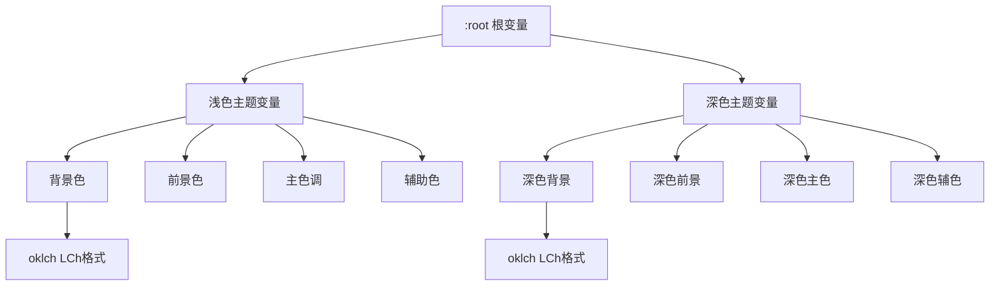
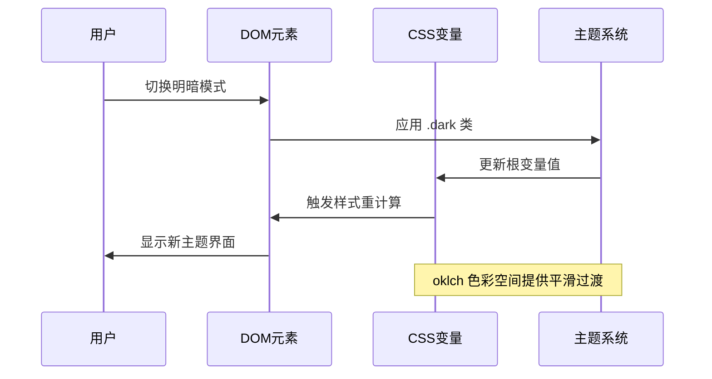
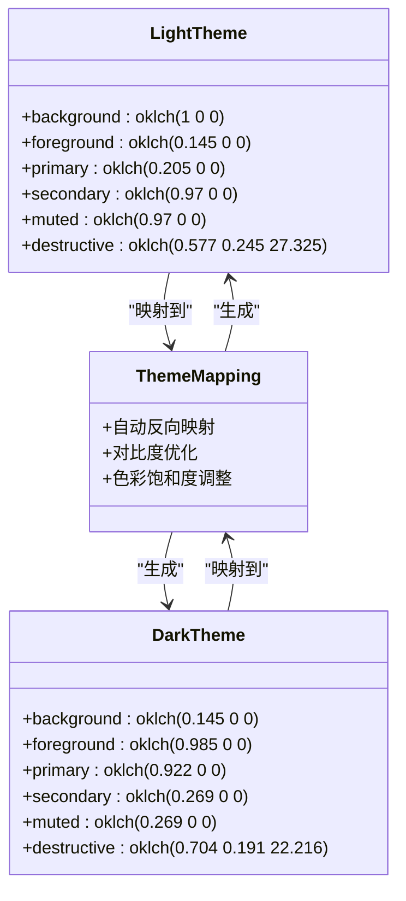
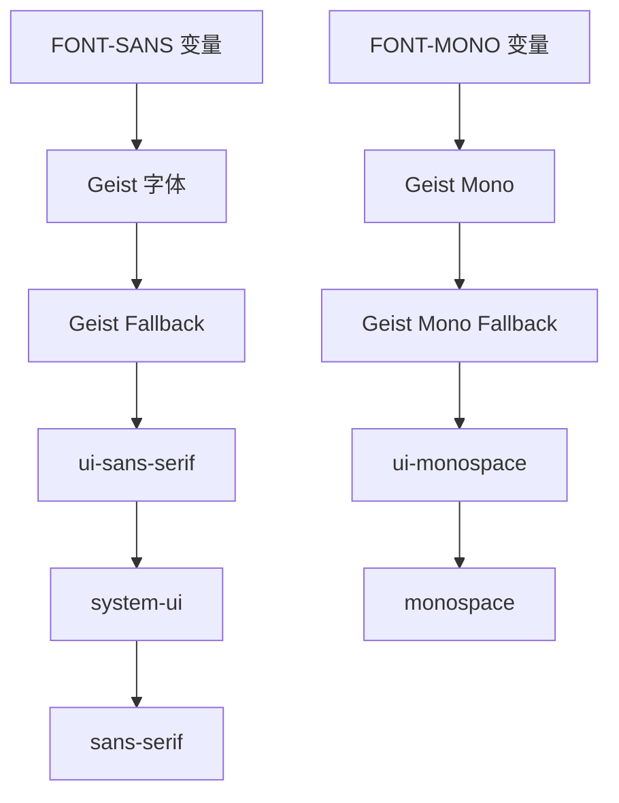
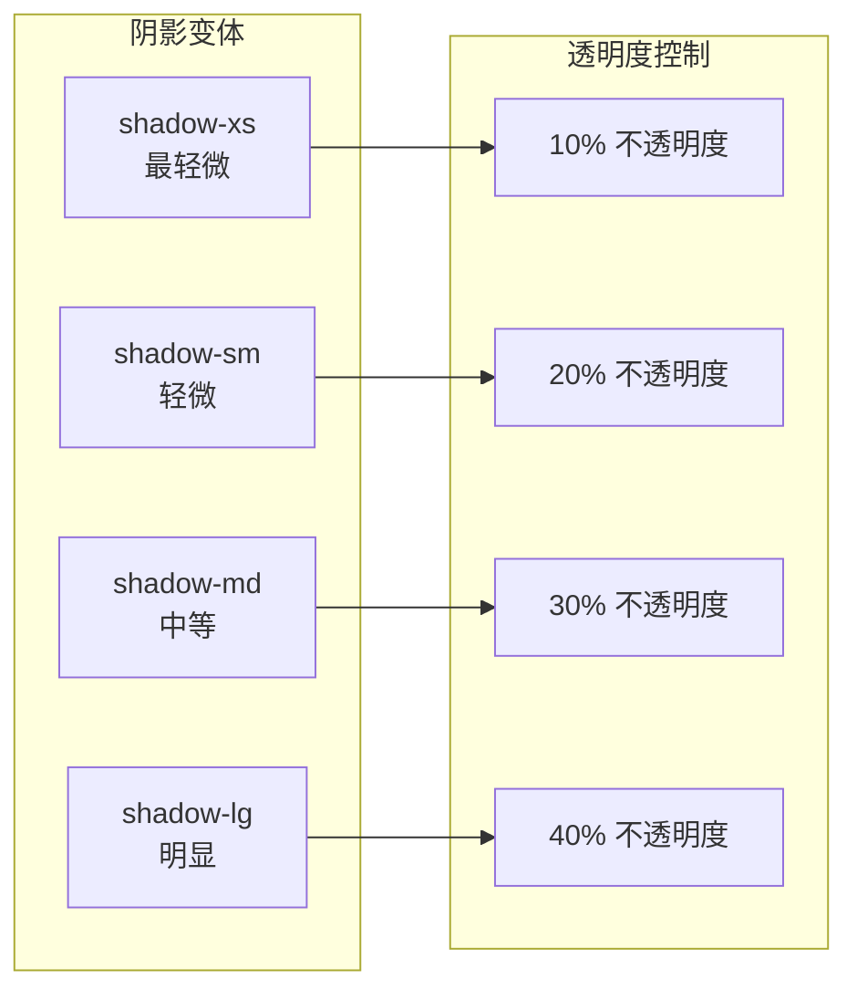
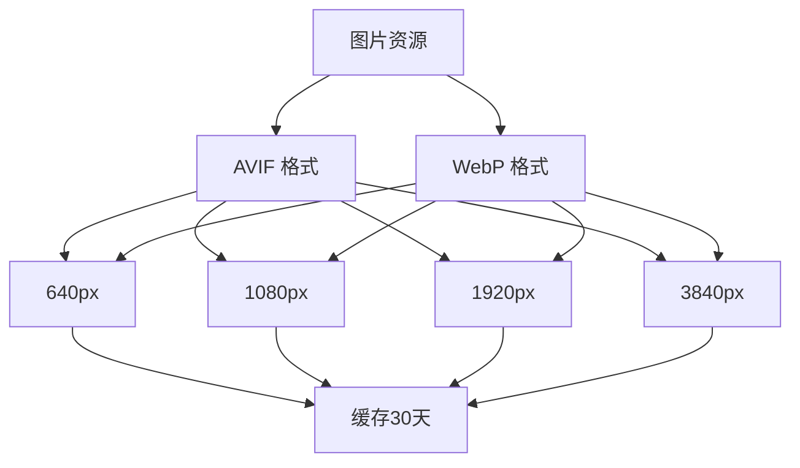

# 主题定制系统

<cite>
**本文档引用的文件**
- [src/app/globals.css](file://src/app/globals.css)
- [components.json](file://components.json)
- [package.json](file://package.json)
- [postcss.config.mjs](file://postcss.config.mjs)
- [next.config.ts](file://next.config.ts)
- [src/components/ui/button.tsx](file://src/components/ui/button.tsx)
- [src/lib/brand.ts](file://src/lib/brand.ts)
</cite>

## 目录
1. [简介](#简介)
2. [项目结构](#项目结构)
3. [核心组件](#核心组件)
4. [架构概览](#架构概览)
5. [详细组件分析](#详细组件分析)
6. [依赖关系分析](#依赖关系分析)
7. [性能考虑](#性能考虑)
8. [故障排除指南](#故障排除指南)
9. [结论](#结论)
10. [附录](#附录)

## 简介

蓝辉轻改网站采用基于 Tailwind CSS v4 的现代主题定制系统，通过 oklch 色彩空间实现科学的色彩设计和跨设备的一致性体验。该系统的核心优势在于：

- **科学的色彩理论**：使用 oklch 色彩空间替代传统 RGB/HSL，提供更均匀的颜色感知差异
- **明暗主题自动映射**：通过 CSS 变量和自定义变体实现无缝的主题切换
- **模块化设计系统**：完整的色彩、字体、间距、圆角和阴影体系
- **品牌一致性保障**：统一的品牌色彩集成和视觉规范

## 项目结构

该项目采用现代化的 Next.js 架构，主题系统主要集中在全局样式文件中：

```mermaid
graph TB
subgraph "样式系统"
GC[globals.css<br/>全局样式]
TV[dark 变体<br/>自定义变体]
THEME[主题变量<br/>@theme inline]
end
subgraph "配置系统"
CJ[components.json<br/>组件配置]
PC[postcss.config.mjs<br/>PostCSS配置]
NC[next.config.ts<br/>Next.js配置]
end
subgraph "组件系统"
BTN[Button 组件<br/>CVA变体]
UI[UI组件库<br/>shadcn/ui]
end
GC --> TV
GC --> THEME
CJ --> GC
PC --> GC
BTN --> UI
```

**图表来源**
- [src/app/globals.css:1-130](file://src/app/globals.css#L1-L130)
- [components.json:1-26](file://components.json#L1-L26)

**章节来源**
- [src/app/globals.css:1-130](file://src/app/globals.css#L1-L130)
- [components.json:1-26](file://components.json#L1-L26)

## 核心组件

### oklch 色彩空间系统

oklch 是基于人类视觉感知的色彩空间，具有以下优势：

- **均匀色彩差异**：颜色之间的感知差异与数值差异成正比
- **更好的可访问性**：确保足够的对比度和可读性
- **自然的色彩映射**：提供更符合人类视觉习惯的色彩过渡

色彩系统采用分层设计：



**图表来源**
- [src/app/globals.css:51-118](file://src/app/globals.css#L51-L118)

### CSS 变量层次结构

系统采用三层变量架构：

1. **基础变量层**：定义核心色彩和设计令牌
2. **派生变量层**：通过计算函数生成衍生色彩
3. **组件变量层**：为特定组件定制的变量

**章节来源**
- [src/app/globals.css:7-49](file://src/app/globals.css#L7-L49)
- [src/app/globals.css:51-118](file://src/app/globals.css#L51-L118)

## 架构概览

主题系统采用声明式架构，通过 CSS 自定义属性实现动态主题切换：



**图表来源**
- [src/app/globals.css:5](file://src/app/globals.css#L5)
- [src/app/globals.css:86-118](file://src/app/globals.css#L86-L118)

## 详细组件分析

### 明暗主题映射机制

系统实现了智能的明暗主题色彩映射规则：



**图表来源**
- [src/app/globals.css:51-118](file://src/app/globals.css#L51-L118)

### 字体系统定制

字体系统采用双层回退机制：



**图表来源**
- [src/app/globals.css:10-12](file://src/app/globals.css#L10-L12)

### 圆角半径系统

圆角半径采用比例化设计：

| 变量名 | 计算公式 | 实际值 |
|--------|----------|--------|
| --radius | 基准值 | 0.625rem |
| --radius-sm | --radius × 0.6 | 0.375rem |
| --radius-md | --radius × 0.8 | 0.5rem |
| --radius-lg | --radius × 1.0 | 0.625rem |
| --radius-xl | --radius × 1.4 | 0.875rem |
| --radius-2xl | --radius × 1.8 | 1.125rem |
| --radius-3xl | --radius × 2.2 | 1.375rem |
| --radius-4xl | --radius × 2.6 | 1.625rem |

**章节来源**
- [src/app/globals.css:42-48](file://src/app/globals.css#L42-L48)

### 阴影效果系统

阴影系统基于 Tailwind CSS v4 的原子化设计：



**图表来源**
- [src/app/globals.css:120-130](file://src/app/globals.css#L120-L130)

## 依赖关系分析

主题系统的核心依赖关系：

```mermaid
graph TB
subgraph "核心依赖"
TWC[Tailwind CSS v4]
SHADCN[shadcn/ui]
NEXT[Next.js]
end
subgraph "开发依赖"
POSTCSS[PostCSS]
TYPESCRIPT[TypeScript]
ESLINT[ESLint]
end
subgraph "运行时依赖"
REACT[React 19]
BASEUI[@base-ui/react]
LUCIDE[lucide-react]
end
TWC --> SHADCN
POSTCSS --> TWC
NEXT --> REACT
SHADCN --> BASEUI
```

**图表来源**
- [package.json:37-47](file://package.json#L37-L47)
- [postcss.config.mjs:1-8](file://postcss.config.mjs#L1-L8)

**章节来源**
- [package.json:1-60](file://package.json#L1-L60)
- [postcss.config.mjs:1-8](file://postcss.config.mjs#L1-L8)

## 性能考虑

### 主题切换性能优化

1. **CSS 变量更新**：避免重新渲染整个 DOM 树
2. **oklch 色彩空间**：减少色彩插值计算开销
3. **原子化样式**：最小化 CSS 文件大小

### 图片优化策略



**图表来源**
- [next.config.ts:5-10](file://next.config.ts#L5-L10)

**章节来源**
- [next.config.ts:1-14](file://next.config.ts#L1-L14)

## 故障排除指南

### 常见问题及解决方案

| 问题类型 | 症状 | 解决方案 |
|----------|------|----------|
| 主题切换失效 | 页面不随系统主题变化 | 检查 `.dark` 类是否正确应用 |
| 色彩显示异常 | 颜色看起来不正确 | 验证 oklch 值的有效性 |
| 字体加载失败 | 文字显示为方块 | 检查字体回退链配置 |
| 圆角显示异常 | 边框圆角不匹配 | 确认 `--radius` 变量值 |

### 调试技巧

1. **浏览器开发者工具**：检查 CSS 变量的实际值
2. **主题预览**：在不同设备上测试主题效果
3. **对比度检查**：使用 WCAG 工具验证可访问性

**章节来源**
- [src/app/globals.css:5](file://src/app/globals.css#L5)
- [src/app/globals.css:86-118](file://src/app/globals.css#L86-L118)

## 结论

蓝辉轻改网站的主题定制系统通过以下关键特性实现了优秀的用户体验：

- **科学的色彩设计**：基于 oklch 色彩空间的精确色彩控制
- **智能的主题切换**：无缝的明暗模式转换体验
- **模块化的组件系统**：可扩展的主题变量架构
- **性能优化**：高效的 CSS 变量更新机制

该系统为品牌提供了强大的视觉一致性保障，同时保持了高度的灵活性和可维护性。

## 附录

### 主题变量命名规范

| 前缀 | 用途 | 示例 |
|------|------|------|
| `--color-` | 色彩变量 | `--color-primary` |
| `--font-` | 字体变量 | `--font-sans` |
| `--radius-` | 圆角变量 | `--radius-lg` |
| `--sidebar-` | 侧边栏变量 | `--sidebar-primary` |

### 开发者最佳实践

1. **变量复用**：优先使用主题变量而非硬编码值
2. **一致性**：确保所有组件遵循相同的变量命名约定
3. **可访问性**：始终验证色彩对比度符合 WCAG 标准
4. **性能**：避免在 JavaScript 中频繁修改 CSS 变量