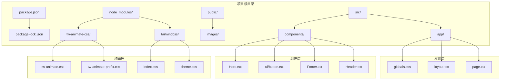
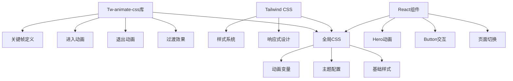
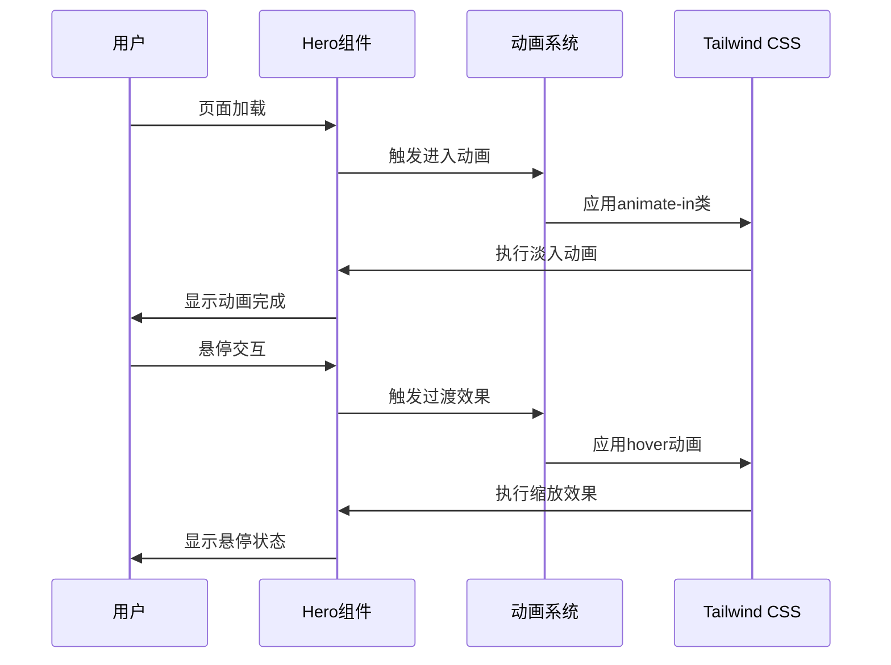
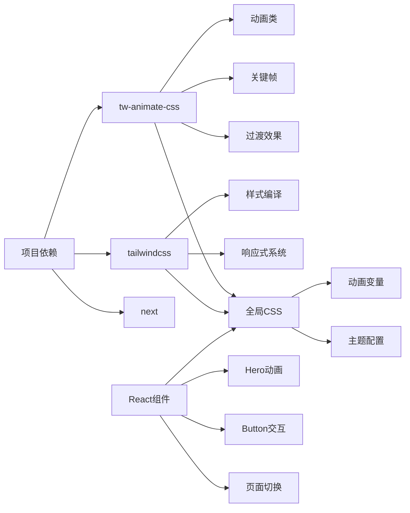

# 动画效果实现

<cite>
**本文档引用的文件**
- [package.json](file://package.json)
- [package-lock.json](file://package-lock.json)
- [src/app/globals.css](file://src/app/globals.css)
- [src/app/layout.tsx](file://src/app/layout.tsx)
- [src/components/Hero.tsx](file://src/components/Hero.tsx)
- [src/components/ui/button.tsx](file://src/components/ui/button.tsx)
- [node_modules/tw-animate-css/README.md](file://node_modules/tw-animate-css/README.md)
- [node_modules/tw-animate-css/dist/tw-animate.css](file://node_modules/tw-animate-css/dist/tw-animate.css)
- [node_modules/tw-animate-css/dist/tw-animate-prefix.css](file://node_modules/tw-animate-css/dist/tw-animate-prefix.css)
- [node_modules/tailwindcss/index.css](file://node_modules/tailwindcss/index.css)
- [node_modules/tailwindcss/theme.css](file://node_modules/tailwindcss/theme.css)
</cite>

## 目录
1. [项目概述](#项目概述)
2. [项目结构](#项目结构)
3. [核心组件](#核心组件)
4. [架构概览](#架构概览)
5. [详细组件分析](#详细组件分析)
6. [依赖关系分析](#依赖关系分析)
7. [性能考虑](#性能考虑)
8. [故障排除指南](#故障排除指南)
9. [结论](#结论)

## 项目概述

蓝辉轻改网站是一个基于Next.js框架构建的企业官网，专注于动画效果的实现和用户体验优化。该项目集成了tw-animate-css动画库，提供了丰富的CSS动画功能，包括进入/退出动画、过渡效果和关键帧定义。

该项目的核心目标是创建流畅且高性能的动画体验，涵盖页面切换动画、悬停效果、加载动画等多个方面。通过合理的动画策略和性能优化技巧，确保在不同设备上都能提供优秀的视觉体验。

## 项目结构

**图表来源**
- [package.json](file://package.json)
- [src/app/globals.css](file://src/app/globals.css)
- [src/components/Hero.tsx](file://src/components/Hero.tsx)

**章节来源**
- [package.json](file://package.json)
- [src/app/globals.css](file://src/app/globals.css)
- [src/app/layout.tsx](file://src/app/layout.tsx)

## 核心组件

### 动画库集成

项目集成了tw-animate-css库，这是一个专门为Tailwind CSS设计的动画库。该库提供了预定义的动画类，可以轻松地为元素添加进入、退出和过渡动画效果。

**章节来源**
- [package.json](file://package.json)
- [package-lock.json](file://package-lock.json)

### 全局样式配置

全局CSS文件包含了动画相关的样式定义和主题配置。该文件是整个项目动画系统的基础，定义了动画的关键帧、过渡效果和基础样式变量。

**章节来源**
- [src/app/globals.css](file://src/app/globals.css)

### 组件动画实现

各个React组件都实现了相应的动画效果，包括Hero组件的主标题动画、按钮的悬停效果等。这些组件展示了如何在实际开发中应用动画库的功能。

**章节来源**
- [src/components/Hero.tsx](file://src/components/Hero.tsx)
- [src/components/ui/button.tsx](file://src/components/ui/button.tsx)

## 架构概览

**图表来源**
- [node_modules/tw-animate-css/README.md](file://node_modules/tw-animate-css/README.md)
- [src/app/globals.css](file://src/app/globals.css)

## 详细组件分析

### Tw-animate-css动画库集成

#### 安装和配置

项目通过npm安装了tw-animate-css库，版本为1.4.0。该库提供了完整的动画解决方案，包括预定义的动画类和自定义动画支持。

#### 关键特性

1. **进入动画**: 提供多种进入效果，如淡入、缩放、滑动等
2. **退出动画**: 支持对应的退出效果，确保动画的完整性
3. **过渡效果**: 包含颜色、透明度、变换等过渡属性
4. **硬件加速**: 优化的GPU加速支持

**章节来源**
- [package.json](file://package.json)
- [package-lock.json](file://package-lock.json)
- [node_modules/tw-animate-css/README.md](file://node_modules/tw-animate-css/README.md)

### CSS动画关键帧定义

#### 预定义动画

项目使用了Tailwind CSS提供的标准动画关键帧，包括：

- **Spin**: 旋转动画，用于加载指示器
- **Pulse**: 脉冲动画，用于强调效果
- **Ping**: 弹跳动画，用于通知提示
- **Bounce**: 弹跳动画，用于反馈效果

#### 自定义动画

通过tw-animate-css库，可以创建自定义的动画效果，包括：

- 自定义进入/退出动画序列
- 复杂的多步骤动画
- 基于状态变化的动画过渡

**章节来源**
- [node_modules/tailwindcss/index.css](file://node_modules/tailwindcss/index.css)
- [node_modules/tailwindcss/theme.css](file://node_modules/tailwindcss/theme.css)

### 组件状态变化动画策略

#### Hero组件动画

Hero组件实现了主要的页面标题动画效果，包括：

**图表来源**
- [src/components/Hero.tsx](file://src/components/Hero.tsx)

#### Button组件交互

Button组件实现了响应式的悬停和点击动画效果：

**章节来源**
- [src/components/ui/button.tsx](file://src/components/ui/button.tsx)

### 页面切换动画

页面切换动画是现代Web应用的重要组成部分，提供了流畅的用户体验。项目中的页面切换动画包括：

1. **路由动画**: 页面间的平滑过渡
2. **内容动画**: 新内容的加载和显示
3. **导航动画**: 导航菜单的展开和收起

### 悬停效果设计原则

悬停效果应该遵循以下设计原则：

1. **即时反馈**: 用户交互后立即响应
2. **适度动画**: 避免过度复杂的动画影响性能
3. **一致性**: 相同类型的元素使用相同的动画效果
4. **可访问性**: 确保动画不会影响屏幕阅读器的使用

### 加载动画实现

加载动画为用户提供操作进度的视觉反馈，包括：

1. **线性加载**: 进度条形式的加载指示
2. **环形加载**: 圆形旋转的加载指示器
3. **骨架屏**: 内容区域的占位符动画

**章节来源**
- [src/components/Hero.tsx](file://src/components/Hero.tsx)

## 依赖关系分析

**图表来源**
- [package.json](file://package.json)
- [src/app/globals.css](file://src/app/globals.css)

**章节来源**
- [package.json](file://package.json)
- [package-lock.json](file://package-lock.json)

## 性能考虑

### 硬件加速优化

为了确保动画的流畅性，项目采用了以下硬件加速优化策略：

1. **Transform优化**: 使用transform属性而非改变布局属性
2. **GPU加速**: 利用CSS3硬件加速能力
3. **合成层管理**: 合理控制合成层的创建和销毁

### 动画性能监控

建议使用以下工具和技术进行动画性能监控：

1. **浏览器开发者工具**: 分析动画帧率和性能瓶颈
2. **Performance面板**: 监控动画执行时间
3. **FPS计数器**: 实时显示帧率变化

### 设备兼容性策略

针对不同设备的动画表现差异，项目采用了以下降级策略：

1. **移动设备优化**: 简化复杂动画效果
2. **高刷新率显示器适配**: 调整动画速度和缓动函数
3. **低功耗设备优化**: 减少动画复杂度和频率

## 故障排除指南

### 常见问题及解决方案

#### 动画不生效

**症状**: 元素没有显示预期的动画效果

**可能原因**:
1. CSS类名拼写错误
2. 样式未正确导入
3. 动画持续时间设置过短

**解决方法**:
1. 检查CSS类名是否正确
2. 确认globals.css文件已正确导入
3. 调整动画持续时间参数

#### 性能问题

**症状**: 动画出现卡顿或掉帧现象

**可能原因**:
1. 动画过于复杂
2. 同时运行过多动画
3. 缺乏硬件加速

**解决方法**:
1. 简化动画效果
2. 控制同时运行的动画数量
3. 确保使用transform属性

### 调试技巧

1. **使用浏览器开发者工具**检查元素的计算样式
2. **启用CSS动画回放**功能观察动画执行过程
3. **使用性能面板**监控动画对整体性能的影响

## 结论

蓝辉轻改网站的动画效果实现展现了现代Web开发中动画技术的最佳实践。通过tw-animate-css库与Tailwind CSS的完美结合，项目实现了丰富而流畅的动画体验。

关键成功因素包括：

1. **合理的架构设计**: 将动画系统与组件系统有机结合
2. **性能优先的实现**: 采用硬件加速和优化策略
3. **跨设备兼容性**: 针对不同设备提供合适的动画效果
4. **可维护性**: 清晰的代码结构和文档

未来可以进一步优化的方向包括：

1. **动画系统模块化**: 将动画逻辑抽象为独立的hooks
2. **动画性能监控**: 建立自动化的性能监控机制
3. **动画测试**: 添加动画效果的自动化测试
4. **动画定制化**: 提供更灵活的动画定制选项

通过持续的优化和改进，这个动画系统将继续为用户创造出色的视觉体验，同时保持良好的性能表现和可维护性。