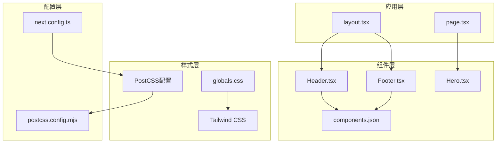
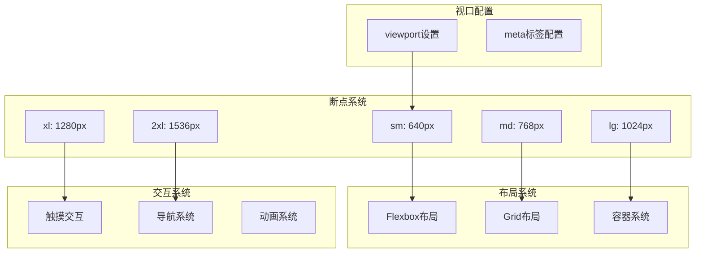
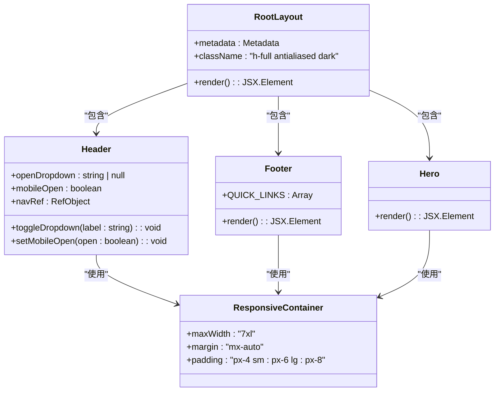
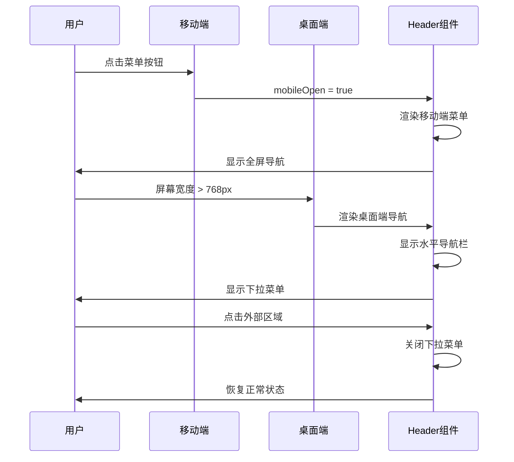
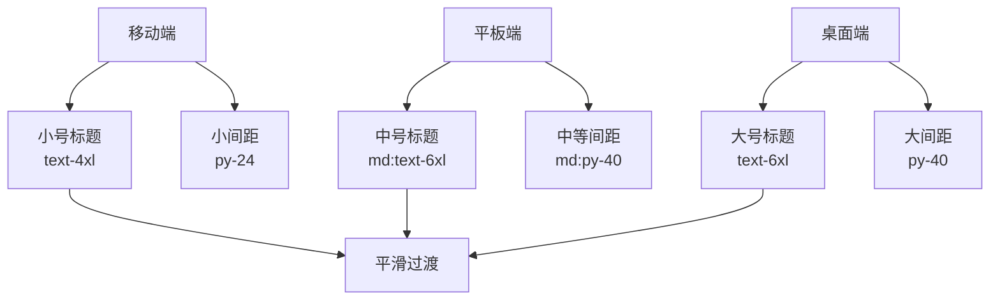
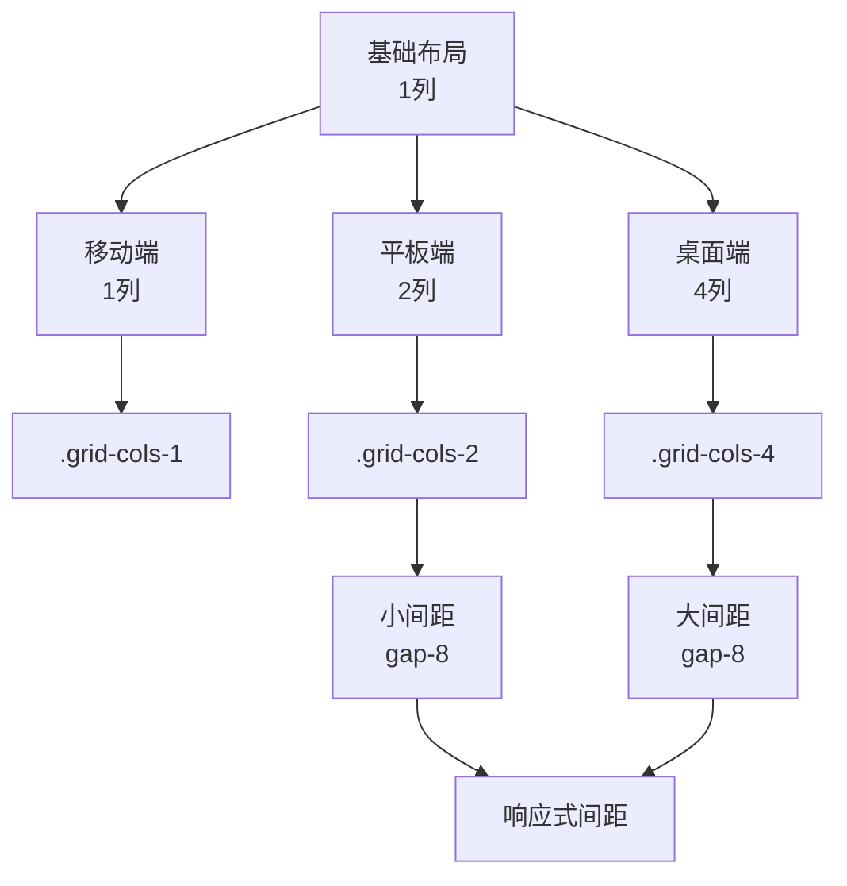
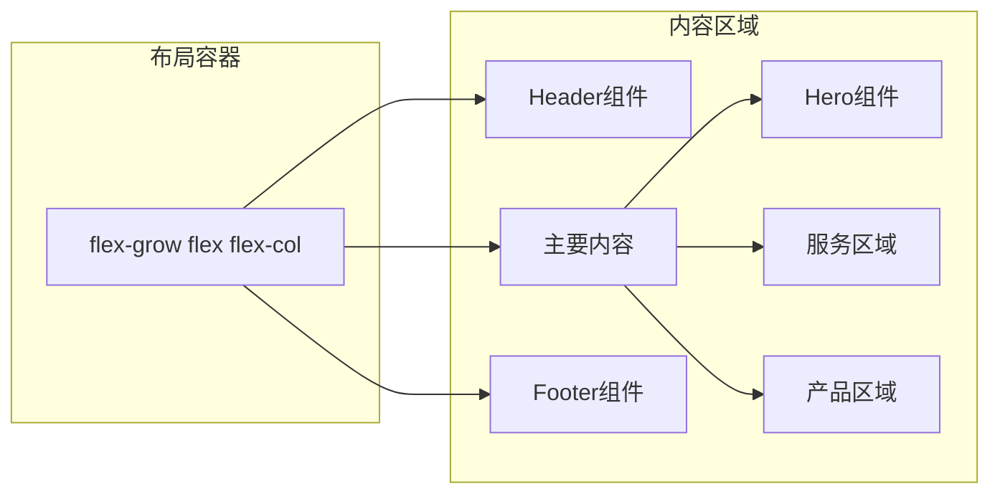
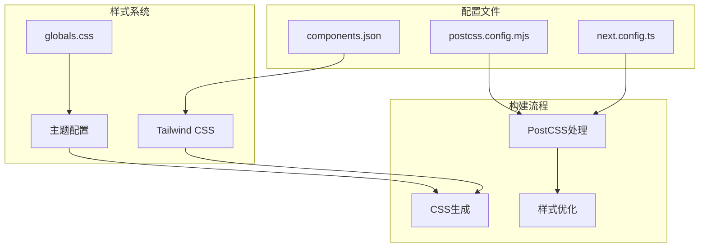

# 响应式设计实现

<cite>
**本文档引用的文件**
- [src/app/globals.css](file://src/app/globals.css)
- [src/app/layout.tsx](file://src/app/layout.tsx)
- [components.json](file://components.json)
- [postcss.config.mjs](file://postcss.config.mjs)
- [next.config.ts](file://next.config.ts)
- [src/components/Header.tsx](file://src/components/Header.tsx)
- [src/components/Footer.tsx](file://src/components/Footer.tsx)
- [src/components/Hero.tsx](file://src/components/Hero.tsx)
- [src/app/page.tsx](file://src/app/page.tsx)
</cite>

## 目录
1. [项目概述](#项目概述)
2. [项目结构](#项目结构)
3. [核心组件](#核心组件)
4. [架构概览](#架构概览)
5. [详细组件分析](#详细组件分析)
6. [依赖关系分析](#依赖关系分析)
7. [性能考虑](#性能考虑)
8. [故障排除指南](#故障排除指南)
9. [结论](#结论)

## 项目概述

蓝辉轻改网站是一个基于Next.js构建的现代化汽车轻改装服务网站。该项目采用移动端优先的设计理念，结合Tailwind CSS的响应式工具类系统，实现了跨设备的一致用户体验。

### 设计原则

- **移动端优先**：以移动设备为设计起点，逐步增强到桌面端
- **渐进增强**：从基础功能开始，逐步添加复杂特性
- **一致性体验**：确保在所有设备上提供统一的品牌体验
- **性能优化**：注重加载速度和交互流畅性

## 项目结构

项目采用模块化架构，主要分为以下几个层次：



**图表来源**
- [src/app/layout.tsx:1-39](file://src/app/layout.tsx#L1-L39)
- [src/app/page.tsx:1-22](file://src/app/page.tsx#L1-L22)
- [src/app/globals.css:1-130](file://src/app/globals.css#L1-L130)

**章节来源**
- [src/app/layout.tsx:1-39](file://src/app/layout.tsx#L1-L39)
- [src/app/page.tsx:1-22](file://src/app/page.tsx#L1-L22)

## 核心组件

### 全局样式系统

项目使用了现代化的CSS变量系统和Tailwind CSS框架，建立了完整的响应式设计基础。

#### 颜色系统

```mermaid
flowchart TD
Root[:root 根元素] --> Light[浅色主题变量]
Root --> Dark[深色主题变量]
Light --> Background[背景色: oklch(1 0 0)]
Light --> Foreground[文字色: oklch(0.145 0 0)]
Light --> Primary[主色调: oklch(0.205 0 0)]
Light --> Secondary[次色调: oklch(0.97 0 0)]
Dark --> DarkBackground[深色背景: oklch(0.145 0 0)]
Dark --> DarkForeground[深色文字: oklch(0.985 0 0)]
Dark --> DarkPrimary[深色主色: oklch(0.922 0 0)]
Dark --> DarkSecondary[深色次色: oklch(0.269 0 0)]
Light --> Components[组件颜色变量]
Dark --> Components
```

**图表来源**
- [src/app/globals.css:51-118](file://src/app/globals.css#L51-L118)

#### 字体系统

项目采用了现代的字体栈配置，确保在不同设备上的最佳显示效果：

- **无衬线字体**：Geist作为主要字体，提供良好的可读性
- **等宽字体**：Geist Mono用于代码展示和技术内容
- **字体回退**：系统默认字体确保兼容性

**章节来源**
- [src/app/globals.css:7-49](file://src/app/globals.css#L7-L49)
- [src/app/globals.css:51-84](file://src/app/globals.css#L51-L84)

## 架构概览

### 响应式设计架构



**图表来源**
- [src/app/layout.tsx:26-36](file://src/app/layout.tsx#L26-L36)
- [src/app/globals.css:120-130](file://src/app/globals.css#L120-L130)

### 组件架构模式



**图表来源**
- [src/app/layout.tsx:20-38](file://src/app/layout.tsx#L20-L38)
- [src/components/Header.tsx:44-249](file://src/components/Header.tsx#L44-L249)
- [src/components/Footer.tsx:18-112](file://src/components/Footer.tsx#L18-L112)
- [src/components/Hero.tsx:5-55](file://src/components/Hero.tsx#L5-L55)

## 详细组件分析

### 头部导航组件

头部导航是响应式设计的核心组件，实现了复杂的移动端优先交互逻辑。

#### 移动端优先设计



**图表来源**
- [src/components/Header.tsx:200-248](file://src/components/Header.tsx#L200-L248)
- [src/components/Header.tsx:44-78](file://src/components/Header.tsx#L44-L78)

#### 导航状态管理

组件使用React状态管理实现了复杂的交互逻辑：

- **下拉菜单状态**：通过`openDropdown`控制子菜单的显示隐藏
- **移动端菜单状态**：通过`mobileOpen`控制移动端菜单的开关
- **路径激活状态**：通过`isActive`函数判断当前页面的导航高亮

**章节来源**
- [src/components/Header.tsx:44-249](file://src/components/Header.tsx#L44-L249)

### 英雄区域组件

英雄区域是页面的主要视觉焦点，采用了响应式的布局设计。

#### 响应式文本布局



**图表来源**
- [src/components/Hero.tsx:25-34](file://src/components/Hero.tsx#L25-L34)

#### 视觉层次设计

英雄区域采用了多层次的视觉设计：

- **背景渐变**：蓝色到深色的渐变背景
- **装饰元素**：模糊圆形装饰提供深度感
- **文本对比**：渐变文字突出品牌特色
- **按钮层次**：不同样式的按钮提供操作引导

**章节来源**
- [src/components/Hero.tsx:5-55](file://src/components/Hero.tsx#L5-L55)

### 页脚组件

页脚采用了网格布局系统，实现了灵活的响应式排列。

#### 网格响应式系统



**图表来源**
- [src/components/Footer.tsx:23](file://src/components/Footer.tsx#L23)

**章节来源**
- [src/components/Footer.tsx:18-112](file://src/components/Footer.tsx#L18-L112)

### 主布局系统

主布局采用了Flexbox系统，确保内容区域的灵活扩展。

#### Flexbox布局模式



**图表来源**
- [src/app/page.tsx:12-18](file://src/app/page.tsx#L12-L18)

**章节来源**
- [src/app/page.tsx:8-21](file://src/app/page.tsx#L8-L21)

## 依赖关系分析

### Tailwind CSS集成

项目使用了现代化的Tailwind CSS配置，建立了完整的响应式设计基础设施。

#### 配置架构



**图表来源**
- [components.json:1-26](file://components.json#L1-L26)
- [postcss.config.mjs:1-8](file://postcss.config.mjs#L1-L8)
- [next.config.ts:1-14](file://next.config.ts#L1-L14)

### 图像优化配置

项目配置了多设备尺寸的图像优化系统：

- **设备尺寸**：640, 750, 828, 1080, 1200, 1920, 2048, 3840
- **图像尺寸**：16, 32, 48, 64, 96, 128, 256, 384
- **缓存策略**：30天的长期缓存

**章节来源**
- [next.config.ts:5-10](file://next.config.ts#L5-L10)

## 性能考虑

### 加载优化策略

项目采用了多种性能优化策略：

1. **按需加载**：移动端优先，减少初始加载时间
2. **图像优化**：自动选择最适合的图像尺寸
3. **CSS优化**：使用原子化CSS减少样式体积
4. **字体优化**：现代字体栈确保快速渲染

### 交互性能

- **防抖处理**：导航状态切换使用防抖机制
- **事件委托**：使用事件委托减少内存占用
- **虚拟滚动**：长列表使用虚拟滚动技术

## 故障排除指南

### 常见问题解决

#### 响应式断点问题

**症状**：某些元素在特定屏幕尺寸下显示异常

**解决方案**：
1. 检查断点前缀是否正确使用
2. 验证容器宽度设置
3. 确认媒体查询优先级

#### 移动端触摸问题

**症状**：触摸交互不灵敏或点击无效

**解决方案**：
1. 检查触摸目标大小（建议至少44px）
2. 验证事件处理器绑定
3. 确认CSS pointer-events属性

#### 颜色主题问题

**症状**：深色/浅色主题切换异常

**解决方案**：
1. 检查CSS变量定义
2. 验证主题切换逻辑
3. 确认浏览器兼容性

**章节来源**
- [src/app/globals.css:51-118](file://src/app/globals.css#L51-L118)
- [src/components/Header.tsx:62-78](file://src/components/Header.tsx#L62-L78)

## 结论

蓝辉轻改网站的响应式设计实现体现了现代Web开发的最佳实践。通过移动端优先的设计理念、完善的断点策略和灵活的布局系统，项目成功地在各种设备上提供了优秀的用户体验。

### 关键优势

1. **设计一致性**：统一的设计语言在所有设备上保持一致
2. **性能优异**：优化的加载策略和渲染性能
3. **交互友好**：针对不同设备优化的交互体验
4. **可维护性强**：清晰的架构和模块化设计

### 技术亮点

- 完整的Tailwind CSS响应式系统
- 智能的颜色主题切换机制  
- 灵活的网格布局系统
- 优化的图像处理管道

这个项目为类似的汽车服务网站提供了优秀的参考模板，展示了如何在保持设计美感的同时实现真正的跨设备兼容性。