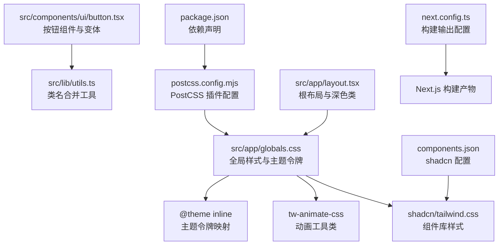
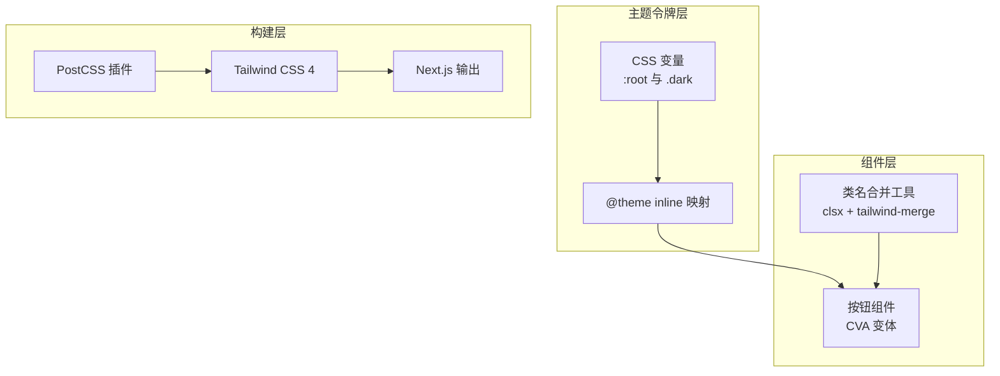
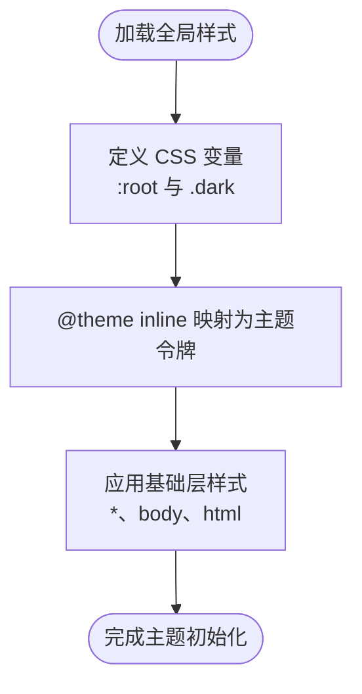
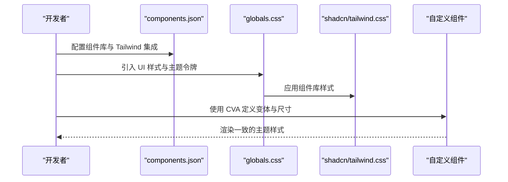
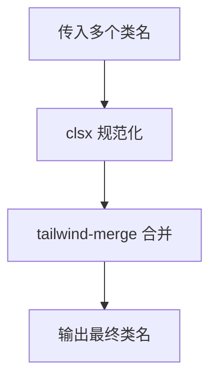
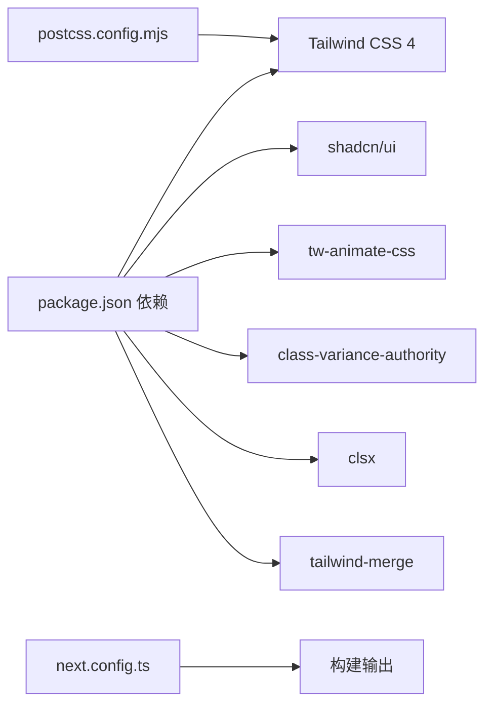

# 样式系统

<cite>
**本文档引用的文件**
- [package.json](file://package.json)
- [postcss.config.mjs](file://postcss.config.mjs)
- [components.json](file://components.json)
- [next.config.ts](file://next.config.ts)
- [src/app/globals.css](file://src/app/globals.css)
- [src/app/layout.tsx](file://src/app/layout.tsx)
- [src/lib/utils.ts](file://src/lib/utils.ts)
- [src/components/ui/button.tsx](file://src/components/ui/button.tsx)
</cite>

## 目录
1. [简介](#简介)
2. [项目结构](#项目结构)
3. [核心组件](#核心组件)
4. [架构总览](#架构总览)
5. [详细组件分析](#详细组件分析)
6. [依赖关系分析](#依赖关系分析)
7. [性能考量](#性能考量)
8. [故障排除指南](#故障排除指南)
9. [结论](#结论)
10. [附录](#附录)

## 简介
本项目采用 Tailwind CSS 4 作为核心样式框架，并结合 shadcn/ui 组件库与 oklch 色彩空间，构建现代化、可维护且具备深浅色主题能力的前端样式系统。通过 CSS 变量驱动的主题令牌、基于 oklch 的色彩模型以及组件级样式变体（variants）管理，实现统一的颜色、字体与间距体系，同时提供动画与交互的性能优化方案。

## 项目结构
样式系统由以下关键部分组成：
- 全局样式入口：在全局 CSS 中引入 Tailwind、动画库与 shadcn 样式，并定义主题令牌与深浅色变量。
- 主题配置：通过 CSS 自定义属性与 @theme 定义颜色、字体与圆角半径等令牌。
- 组件样式：使用 class-variance-authority（CVA）与 tailwind-merge、clsx 进行组件变体与类名合并。
- 构建工具链：PostCSS 插件与 Tailwind CSS 4 的集成，Next.js 配置输出模式。

**图表来源**
- [package.json:1-60](file://package.json#L1-L60)
- [postcss.config.mjs:1-8](file://postcss.config.mjs#L1-L8)
- [src/app/globals.css:1-130](file://src/app/globals.css#L1-L130)
- [src/components/ui/button.tsx:1-61](file://src/components/ui/button.tsx#L1-L61)
- [src/lib/utils.ts:1-7](file://src/lib/utils.ts#L1-L7)
- [src/app/layout.tsx:1-32](file://src/app/layout.tsx#L1-L32)
- [components.json:1-26](file://components.json#L1-L26)
- [next.config.ts:1-9](file://next.config.ts#L1-L9)

**章节来源**
- [package.json:1-60](file://package.json#L1-L60)
- [postcss.config.mjs:1-8](file://postcss.config.mjs#L1-L8)
- [src/app/globals.css:1-130](file://src/app/globals.css#L1-L130)
- [src/app/layout.tsx:1-32](file://src/app/layout.tsx#L1-L32)
- [components.json:1-26](file://components.json#L1-L26)
- [next.config.ts:1-9](file://next.config.ts#L1-L9)

## 核心组件
- 全局样式与主题令牌
  - 在全局 CSS 中引入 Tailwind、动画库与 shadcn 样式，并通过 @theme inline 将 CSS 变量映射为主题令牌，供 Tailwind 与组件使用。
  - 定义深浅色模式下的 CSS 变量，实现自动主题切换。
- 组件样式与变体
  - 使用 class-variance-authority（CVA）定义组件变体与尺寸，结合 tailwind-merge 与 clsx 合并类名，避免冲突并提升可维护性。
- 动画与过渡
  - 引入 tw-animate-css，提供 enter/exit 动画与常用过渡效果，配合 CSS 变量控制动画参数。

**章节来源**
- [src/app/globals.css:1-130](file://src/app/globals.css#L1-L130)
- [src/components/ui/button.tsx:1-61](file://src/components/ui/button.tsx#L1-L61)
- [src/lib/utils.ts:1-7](file://src/lib/utils.ts#L1-L7)

## 架构总览
样式系统采用“主题令牌 + 组件变体 + 构建插件”的分层架构：
- 主题令牌层：集中定义颜色、字体、圆角等 CSS 变量，支持深浅色模式。
- 组件层：以 CVA 管理变体与尺寸，使用工具函数进行类名合并。
- 构建层：通过 PostCSS 与 Tailwind CSS 4 处理样式，生成最终产物。

**图表来源**
- [src/app/globals.css:1-130](file://src/app/globals.css#L1-L130)
- [src/components/ui/button.tsx:1-61](file://src/components/ui/button.tsx#L1-L61)
- [src/lib/utils.ts:1-7](file://src/lib/utils.ts#L1-L7)
- [postcss.config.mjs:1-8](file://postcss.config.mjs#L1-L8)
- [package.json:1-60](file://package.json#L1-L60)

## 详细组件分析

### 主题令牌系统（oklch 与 CSS 变量）
- oklch 色彩空间
  - 使用 oklch 表达色相、色度与亮度，便于在深浅模式间保持一致的感知亮度与对比度。
  - 在 :root 与 .dark 中分别定义背景、前景、主色、次色、强调色、边框、输入、环光等变量。
- 主题令牌映射
  - 通过 @theme inline 将 CSS 变量映射为 Tailwind 主题令牌，使设计令牌可在工具类中直接使用。
- 字体与圆角
  - 定义无衬线与等宽字体族，并通过 CSS 变量统一管理圆角半径，按规模缩放。

**图表来源**
- [src/app/globals.css:1-130](file://src/app/globals.css#L1-L130)

**章节来源**
- [src/app/globals.css:1-130](file://src/app/globals.css#L1-L130)

### shadcn/ui 组件库与样式定制
- 组件库集成
  - 在全局 CSS 中引入 shadcn/tailwind.css，确保组件样式与主题一致。
  - 通过 components.json 配置组件库风格、Tailwind 集成方式与别名。
- 样式定制方法
  - 使用 CSS 变量覆盖组件默认颜色与边框，保证与主题令牌一致。
  - 通过 CVA 为自定义组件扩展变体与尺寸，遵循组件库的命名与数据槽约定。

**图表来源**
- [components.json:1-26](file://components.json#L1-L26)
- [src/app/globals.css:1-130](file://src/app/globals.css#L1-L130)

**章节来源**
- [components.json:1-26](file://components.json#L1-L26)
- [src/app/globals.css:1-130](file://src/app/globals.css#L1-L130)

### 响应式设计与移动端优先
- 移动端优先
  - 通过基础层样式与工具类组合，确保在小屏幕设备上获得良好体验。
  - 利用 CSS 变量与圆角缩放，适配不同设备密度。
- 断点设置
  - Tailwind CSS 4 默认断点策略与项目布局需求保持一致，无需额外配置。

**章节来源**
- [src/app/globals.css:120-130](file://src/app/globals.css#L120-L130)
- [src/app/layout.tsx:24-31](file://src/app/layout.tsx#L24-L31)

### 组件样式隔离与冲突解决
- 类名合并策略
  - 使用工具函数合并多个类名，避免重复与冲突，确保组件样式独立于外部影响。
- 组件变体隔离
  - 通过 CVA 为组件定义明确的变体与尺寸，减少全局样式对组件的影响。

**图表来源**
- [src/lib/utils.ts:1-7](file://src/lib/utils.ts#L1-L7)
- [src/components/ui/button.tsx:45-61](file://src/components/ui/button.tsx#L45-L61)

**章节来源**
- [src/lib/utils.ts:1-7](file://src/lib/utils.ts#L1-L7)
- [src/components/ui/button.tsx:1-61](file://src/components/ui/button.tsx#L1-L61)

### 动画效果与性能优化
- 动画实现
  - 引入 tw-animate-css，提供 enter/exit 动画与常用过渡效果，通过 CSS 变量控制时长、缓动与延迟。
- 性能优化
  - 使用 CSS 变量与原子化工具类，减少重绘与回流。
  - 通过 CVA 与类名合并，避免不必要的样式计算。

**章节来源**
- [src/app/globals.css:1-3](file://src/app/globals.css#L1-L3)
- [src/lib/utils.ts:1-7](file://src/lib/utils.ts#L1-L7)

## 依赖关系分析
- 核心依赖
  - Tailwind CSS 4：提供原子化样式与主题系统。
  - shadcn/ui：提供可定制的 UI 组件库。
  - tw-animate-css：提供动画工具类与关键帧。
  - class-variance-authority、clsx、tailwind-merge：用于组件变体与类名合并。
- 构建依赖
  - PostCSS 插件负责处理 Tailwind CSS 4 的主题与工具类生成。
  - Next.js 配置输出模式确保生产环境产物体积最小化。

**图表来源**
- [package.json:1-60](file://package.json#L1-L60)
- [postcss.config.mjs:1-8](file://postcss.config.mjs#L1-L8)
- [next.config.ts:1-9](file://next.config.ts#L1-L9)

**章节来源**
- [package.json:1-60](file://package.json#L1-L60)
- [postcss.config.mjs:1-8](file://postcss.config.mjs#L1-L8)
- [next.config.ts:1-9](file://next.config.ts#L1-L9)

## 性能考量
- 原子化样式：Tailwind 的原子化特性减少重复样式，降低 CSS 体积。
- CSS 变量：集中管理主题令牌，避免多处重复定义导致的样式膨胀。
- 类名合并：通过工具函数合并类名，减少无效样式与选择器复杂度。
- 构建优化：Next.js standalone 输出模式有助于减小运行时体积。

## 故障排除指南
- 样式未生效
  - 检查全局 CSS 是否正确引入 Tailwind、动画库与 shadcn 样式。
  - 确认 @theme inline 与 CSS 变量映射是否正确。
- 深浅色主题异常
  - 检查 :root 与 .dark 中的 CSS 变量定义是否完整。
  - 确认根布局是否添加了深色类。
- 组件样式冲突
  - 使用类名合并工具确保只保留有效类名。
  - 通过 CVA 明确组件变体，避免外部样式污染。

**章节来源**
- [src/app/globals.css:1-130](file://src/app/globals.css#L1-L130)
- [src/app/layout.tsx:24-31](file://src/app/layout.tsx#L24-L31)
- [src/lib/utils.ts:1-7](file://src/lib/utils.ts#L1-L7)

## 结论
本样式系统以 Tailwind CSS 4 为核心，结合 oklch 色彩空间与 CSS 变量，实现了统一、可维护且高性能的主题体系；通过 shadcn/ui 与 CVA 的组件化策略，确保了样式的可定制性与一致性。配合动画库与构建工具链，整体方案满足现代前端项目的复杂样式需求。

## 附录
- 主题定制指南
  - 颜色系统：在 :root 与 .dark 中调整 oklch 值，确保明暗对比与可读性。
  - 字体系统：通过 CSS 变量统一管理字体族，适配中英文内容。
  - 间距系统：利用圆角变量按比例缩放，保持视觉层级一致。
- 最佳实践
  - 使用 CSS 变量集中管理主题令牌，避免硬编码颜色与尺寸。
  - 通过 CVA 与类名合并工具，确保组件样式隔离与可维护性。
  - 合理使用动画工具类，避免过度动画影响性能。