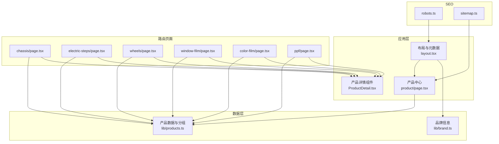
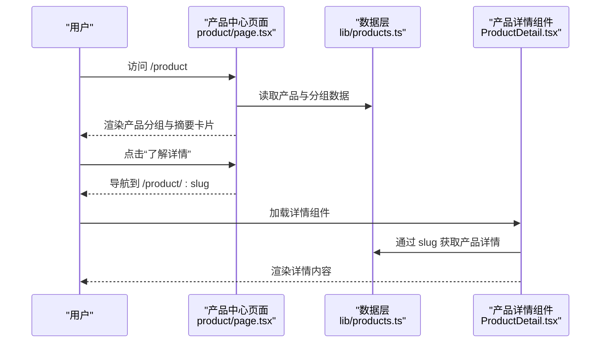
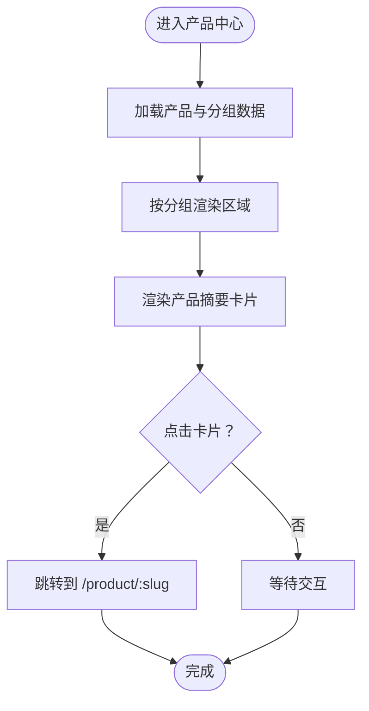
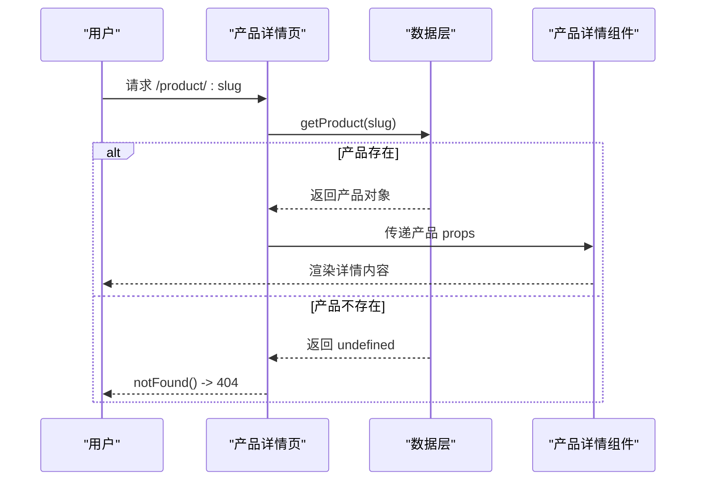
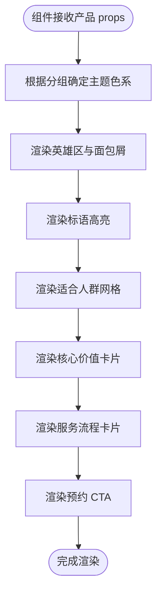
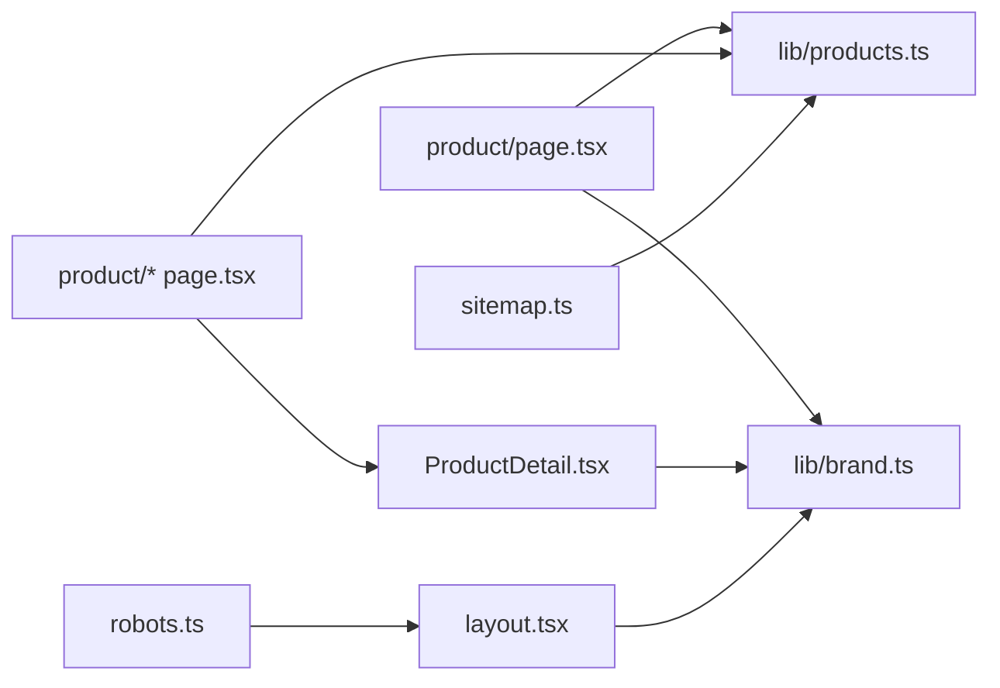

# 产品展示系统

<cite>
**本文档引用的文件**
- [src/lib/products.ts](file://src/lib/products.ts)
- [src/components/ProductDetail.tsx](file://src/components/ProductDetail.tsx)
- [src/app/product/page.tsx](file://src/app/product/page.tsx)
- [src/app/product/chassis/page.tsx](file://src/app/product/chassis/page.tsx)
- [src/app/product/electric-steps/page.tsx](file://src/app/product/electric-steps/page.tsx)
- [src/app/product/wheels/page.tsx](file://src/app/product/wheels/page.tsx)
- [src/app/product/window-film/page.tsx](file://src/app/product/window-film/page.tsx)
- [src/app/product/color-film/page.tsx](file://src/app/product/color-film/page.tsx)
- [src/app/product/ppf/page.tsx](file://src/app/product/ppf/page.tsx)
- [src/app/layout.tsx](file://src/app/layout.tsx)
- [src/lib/brand.ts](file://src/lib/brand.ts)
- [src/app/robots.ts](file://src/app/robots.ts)
- [src/app/sitemap.ts](file://src/app/sitemap.ts)
- [package.json](file://package.json)
</cite>

## 目录
1. [简介](#简介)
2. [项目结构](#项目结构)
3. [核心组件](#核心组件)
4. [架构总览](#架构总览)
5. [详细组件分析](#详细组件分析)
6. [依赖关系分析](#依赖关系分析)
7. [性能考量](#性能考量)
8. [故障排查指南](#故障排查指南)
9. [结论](#结论)
10. [附录](#附录)

## 简介
本文件为“蓝辉轻改”网站产品展示系统的综合技术文档。系统基于 Next.js 构建，采用静态路由与数据层分离的设计，提供产品列表、产品分类、筛选与排序能力，以及动态产品详情页的 slug 路由与数据获取机制。文档涵盖产品数据模型、组件展示逻辑与交互设计、数据获取策略与缓存优化、SEO 与多语言支持方案、CRUD 扩展与最佳实践。

## 项目结构
系统采用 Next.js App Router 的目录约定式路由，产品相关的核心文件组织如下：
- 数据层：产品数据与分组定义位于 [src/lib/products.ts](file://src/lib/products.ts)，包含产品类型、分组、查询函数与图片映射。
- 列表页：产品中心页面位于 [src/app/product/page.tsx](file://src/app/product/page.tsx)，负责渲染产品分组与摘要卡片。
- 详情页：每个产品对应独立页面，如 [src/app/product/chassis/page.tsx](file://src/app/product/chassis/page.tsx)、[src/app/product/electric-steps/page.tsx](file://src/app/product/electric-steps/page.tsx) 等，均通过 slug 获取产品并渲染详情组件。
- 组件层：产品详情组件位于 [src/components/ProductDetail.tsx](file://src/components/ProductDetail.tsx)，负责展示产品详情内容。
- 布局与品牌：全局布局与 SEO 元数据位于 [src/app/layout.tsx](file://src/app/layout.tsx)，品牌信息位于 [src/lib/brand.ts](file://src/lib/brand.ts)。
- SEO：robots 与 sitemap 生成位于 [src/app/robots.ts](file://src/app/robots.ts) 与 [src/app/sitemap.ts](file://src/app/sitemap.ts)。
- 依赖：前端框架与工具库位于 [package.json](file://package.json)。



图表来源
- [src/app/product/page.tsx:25-108](file://src/app/product/page.tsx#L25-L108)
- [src/components/ProductDetail.tsx:12-183](file://src/components/ProductDetail.tsx#L12-L183)
- [src/lib/products.ts:46-282](file://src/lib/products.ts#L46-L282)
- [src/app/product/chassis/page.tsx:12-16](file://src/app/product/chassis/page.tsx#L12-L16)
- [src/app/layout.tsx:4-17](file://src/app/layout.tsx#L4-L17)
- [src/lib/brand.ts:8-25](file://src/lib/brand.ts#L8-L25)
- [src/app/robots.ts:4-16](file://src/app/robots.ts#L4-L16)
- [src/app/sitemap.ts:17-123](file://src/app/sitemap.ts#L17-L123)

章节来源
- [src/app/product/page.tsx:25-108](file://src/app/product/page.tsx#L25-L108)
- [src/lib/products.ts:46-282](file://src/lib/products.ts#L46-L282)
- [src/app/layout.tsx:4-17](file://src/app/layout.tsx#L4-L17)

## 核心组件
- 产品数据模型与分组
  - 类型定义：产品类型包含 slug、名称、分组标识、分组标签、标语、英雄描述、受众、核心价值、服务流程、CTA 等字段；分组包含 id、label、description。
  - 数据源：产品数组与分组数组定义于 [src/lib/products.ts:10-264](file://src/lib/products.ts#L10-L264)。
  - 查询函数：提供按 slug 获取产品与获取所有 slug 的方法，见 [src/lib/products.ts:266-272](file://src/lib/products.ts#L266-L272)。
  - 图片映射：产品 slug 到图片路径的映射，见 [src/lib/products.ts:274-281](file://src/lib/products.ts#L274-L281)。

- 产品详情组件
  - 功能：根据产品数据渲染头部、标语高亮、受众、核心价值、服务流程与 CTA 区域；根据分组切换主题色系。
  - 文件位置：[src/components/ProductDetail.tsx:12-183](file://src/components/ProductDetail.tsx#L12-L183)。

- 产品中心页面
  - 功能：渲染产品分组标题与描述，遍历分组内产品生成摘要卡片，点击跳转至详情页。
  - 文件位置：[src/app/product/page.tsx:25-108](file://src/app/product/page.tsx#L25-L108)。

- 详情页路由与数据获取
  - 功能：每个产品页面通过 slug 从数据层获取产品，若不存在则返回 404。
  - 示例：底盘升级详情页 [src/app/product/chassis/page.tsx:12-16](file://src/app/product/chassis/page.tsx#L12-L16)，其他产品页面同理。
  - 全部产品详情页文件：[src/app/product/electric-steps/page.tsx:12-16](file://src/app/product/electric-steps/page.tsx#L12-L16)、[src/app/product/wheels/page.tsx:12-16](file://src/app/product/wheels/page.tsx#L12-L16)、[src/app/product/window-film/page.tsx:12-16](file://src/app/product/window-film/page.tsx#L12-L16)、[src/app/product/color-film/page.tsx:12-16](file://src/app/product/color-film/page.tsx#L12-L16)、[src/app/product/ppf/page.tsx:12-16](file://src/app/product/ppf/page.tsx#L12-L16)。

章节来源
- [src/lib/products.ts:10-282](file://src/lib/products.ts#L10-L282)
- [src/components/ProductDetail.tsx:12-183](file://src/components/ProductDetail.tsx#L12-L183)
- [src/app/product/page.tsx:25-108](file://src/app/product/page.tsx#L25-L108)
- [src/app/product/chassis/page.tsx:12-16](file://src/app/product/chassis/page.tsx#L12-L16)

## 架构总览
系统采用“数据层 + 页面层 + 组件层”的三层架构：
- 数据层：集中管理产品与分组数据，提供查询与映射能力。
- 页面层：产品中心与各产品详情页，负责路由与页面级元数据。
- 组件层：产品详情组件复用性强，便于扩展与维护。
- SEO 层：全局元数据、robots 与 sitemap 自动生成，保障搜索引擎收录。



图表来源
- [src/app/product/page.tsx:25-108](file://src/app/product/page.tsx#L25-L108)
- [src/lib/products.ts:266-272](file://src/lib/products.ts#L266-L272)
- [src/components/ProductDetail.tsx:12-183](file://src/components/ProductDetail.tsx#L12-L183)

## 详细组件分析

### 产品数据模型与分组
- 数据模型结构
  - 字段说明：slug（URL 友好标识）、name（产品名称）、group（分组标识）、groupLabel（分组显示标签）、tagline（标语）、heroDescription（英雄描述）、audience（受众列表）、values（核心价值项列表）、process（服务流程项列表）、cta（行动号召链接）。
  - 复杂度：查询按 slug 使用线性查找，时间复杂度 O(n)；获取全部 slug 为 O(n)。
  - 优化建议：若产品数量增长，可引入 Map 结构以实现 O(1) 查找；或在构建阶段生成索引文件。

- 分组定义
  - 分组包含 id、label、description，用于页面分组展示与样式区分。
  - 适用场景：产品中心按分组渲染，详情页根据分组切换主题色系。

- 图片映射
  - 提供产品 slug 到图片路径的映射，便于在列表与详情中统一加载图片资源。

```mermaid
classDiagram
class Product {
+string slug
+string name
+ProductGroup group
+string groupLabel
+string tagline
+string heroDescription
+string[] audience
+values[] values
+process[] process
+cta cta
}
class ProductGroup {
<<enumeration>>
"light-mod"
"film"
}
class ProductDetailProps {
+Product product
}
class ProductService {
+getProduct(slug) Product|undefined
+getAllProductSlugs() string[]
}
ProductDetailProps --> Product : "接收"
ProductService --> Product : "提供"
```

图表来源
- [src/lib/products.ts:10-272](file://src/lib/products.ts#L10-L272)
- [src/components/ProductDetail.tsx:8-10](file://src/components/ProductDetail.tsx#L8-L10)

章节来源
- [src/lib/products.ts:10-282](file://src/lib/products.ts#L10-L282)

### 产品中心页面（列表页）
- 功能要点
  - 渲染产品分组标题与描述，按分组过滤产品并生成摘要卡片。
  - 卡片包含图标、名称、分组标签、标语与“了解详情”链接。
  - 点击卡片跳转至对应详情页。

- 交互设计
  - 使用语义化标题与面包屑，提升可访问性。
  - 悬停效果与过渡动画增强用户体验。



图表来源
- [src/app/product/page.tsx:25-108](file://src/app/product/page.tsx#L25-L108)

章节来源
- [src/app/product/page.tsx:25-108](file://src/app/product/page.tsx#L25-L108)

### 产品详情页面（动态路由）
- 路由结构
  - 每个产品拥有独立页面，路由为 /product/:slug。
  - 示例：底盘升级页面 [src/app/product/chassis/page.tsx:12-16](file://src/app/product/chassis/page.tsx#L12-L16)，其他产品页面同理。

- 数据获取与错误处理
  - 通过 slug 从数据层获取产品，若不存在则调用 notFound 返回 404。
  - 页面级元数据针对每个产品进行定制，提升 SEO 表现。



图表来源
- [src/app/product/chassis/page.tsx:12-16](file://src/app/product/chassis/page.tsx#L12-L16)
- [src/lib/products.ts:266-268](file://src/lib/products.ts#L266-L268)
- [src/components/ProductDetail.tsx:12-183](file://src/components/ProductDetail.tsx#L12-L183)

章节来源
- [src/app/product/chassis/page.tsx:12-16](file://src/app/product/chassis/page.tsx#L12-L16)
- [src/app/product/electric-steps/page.tsx:12-16](file://src/app/product/electric-steps/page.tsx#L12-L16)
- [src/app/product/wheels/page.tsx:12-16](file://src/app/product/wheels/page.tsx#L12-L16)
- [src/app/product/window-film/page.tsx:12-16](file://src/app/product/window-film/page.tsx#L12-L16)
- [src/app/product/color-film/page.tsx:12-16](file://src/app/product/color-film/page.tsx#L12-L16)
- [src/app/product/ppf/page.tsx:12-16](file://src/app/product/ppf/page.tsx#L12-L16)

### 产品详情组件展示逻辑
- 主题适配
  - 根据产品分组切换文本强调色、背景圆球、渐变色与卡片边框颜色，确保视觉一致性。
- 内容分区
  - 英雄区：展示分组标签、产品名称与英雄描述。
  - 标语高亮：突出产品核心卖点。
  - 适合人群：网格展示受众列表。
  - 核心价值：四列卡片展示价值点，含勾选图标。
  - 服务流程：四步流程卡片，含步骤编号与说明。
  - CTA：引导到预约页面，包含地图图标与品牌名。



图表来源
- [src/components/ProductDetail.tsx:12-183](file://src/components/ProductDetail.tsx#L12-L183)

章节来源
- [src/components/ProductDetail.tsx:12-183](file://src/components/ProductDetail.tsx#L12-L183)

## 依赖关系分析
- 组件依赖
  - 产品中心页面依赖产品数据层与品牌信息，用于渲染分组与品牌文案。
  - 详情页依赖数据层查询函数与产品详情组件。
  - 产品详情组件依赖品牌信息以生成 CTA 文案。
- 外部依赖
  - Next.js 提供路由、元数据与构建能力。
  - Tailwind CSS 与 lucide-react 提供样式与图标支持。
  - SEO 依赖 robots 与 sitemap 生成器。



图表来源
- [src/app/product/page.tsx:6-8](file://src/app/product/page.tsx#L6-L8)
- [src/components/ProductDetail.tsx:5-6](file://src/components/ProductDetail.tsx#L5-L6)
- [src/lib/products.ts:46-282](file://src/lib/products.ts#L46-L282)
- [src/lib/brand.ts:8-25](file://src/lib/brand.ts#L8-L25)
- [src/app/layout.tsx:4-17](file://src/app/layout.tsx#L4-L17)
- [src/app/robots.ts:4-16](file://src/app/robots.ts#L4-L16)
- [src/app/sitemap.ts:2-10](file://src/app/sitemap.ts#L2-L10)

章节来源
- [src/app/product/page.tsx:6-8](file://src/app/product/page.tsx#L6-L8)
- [src/components/ProductDetail.tsx:5-6](file://src/components/ProductDetail.tsx#L5-L6)
- [src/lib/products.ts:46-282](file://src/lib/products.ts#L46-L282)
- [src/lib/brand.ts:8-25](file://src/lib/brand.ts#L8-L25)
- [src/app/layout.tsx:4-17](file://src/app/layout.tsx#L4-L17)
- [src/app/robots.ts:4-16](file://src/app/robots.ts#L4-L16)
- [src/app/sitemap.ts:2-10](file://src/app/sitemap.ts#L2-L10)

## 性能考量
- 数据获取策略
  - 当前为客户端渲染与静态数据读取，适合中小规模数据集。
  - 若产品数量增长，建议：
    - 将产品数据迁移至构建时生成的 JSON 或数据库，减少运行时解析成本。
    - 引入 Map 结构以实现 O(1) 查询；或在构建阶段生成索引。
- 缓存机制
  - 利用 Next.js 的静态导出与浏览器缓存策略，减少重复请求。
  - 对图片资源使用 CDN 与合适的尺寸与格式，降低带宽占用。
- 渲染优化
  - 列表页使用虚拟滚动（如需）以减少 DOM 节点数量。
  - 组件拆分与懒加载，避免一次性渲染过多内容。
- SEO 与性能
  - 通过 sitemap 与 robots 控制爬虫抓取范围，提升索引效率。
  - 元数据与 Open Graph 设置有助于提升搜索结果质量。

## 故障排查指南
- 404 页面
  - 现象：访问不存在的 slug 时出现 404。
  - 原因：详情页通过 notFound() 处理不存在的产品。
  - 排查：确认 slug 是否存在于产品数据中，检查路由参数是否正确。
  - 参考：[src/app/product/chassis/page.tsx](file://src/app/product/chassis/page.tsx#L14)

- SEO 问题
  - 现象：搜索引擎收录异常或元数据缺失。
  - 原因：robots 与 sitemap 配置不当。
  - 排查：核对 robots 中的 sitemap 地址与 host，检查 sitemap 生成逻辑是否包含产品详情页。
  - 参考：[src/app/robots.ts:4-16](file://src/app/robots.ts#L4-L16)、[src/app/sitemap.ts:17-123](file://src/app/sitemap.ts#L17-L123)

- 品牌信息不一致
  - 现象：页面中品牌名或门店名显示不一致。
  - 原因：品牌信息未统一更新。
  - 排查：检查品牌数据文件，确认引用位置。
  - 参考：[src/lib/brand.ts:8-25](file://src/lib/brand.ts#L8-L25)

章节来源
- [src/app/product/chassis/page.tsx](file://src/app/product/chassis/page.tsx#L14)
- [src/app/robots.ts:4-16](file://src/app/robots.ts#L4-L16)
- [src/app/sitemap.ts:17-123](file://src/app/sitemap.ts#L17-L123)
- [src/lib/brand.ts:8-25](file://src/lib/brand.ts#L8-L25)

## 结论
本产品展示系统以清晰的三层架构实现了从数据到页面的完整链路：数据层提供标准化产品模型与查询能力，页面层负责路由与元数据，组件层专注于可复用的展示逻辑。系统具备良好的可扩展性，可通过引入索引、CDN 与构建时优化进一步提升性能与 SEO 表现。建议在产品数量增长后进行数据结构与缓存策略的迭代，以满足更高并发与更优体验的需求。

## 附录

### 产品数据 CRUD 扩展指南
- 新增产品
  - 在数据层添加产品条目，设置唯一 slug 与分组标识。
  - 更新图片映射，确保列表与详情页图片可用。
  - 参考：[src/lib/products.ts:46-282](file://src/lib/products.ts#L46-L282)
- 删除产品
  - 从数据数组移除对应条目，清理图片映射。
  - 更新 sitemap 生成逻辑，避免生成已删除产品的链接。
  - 参考：[src/app/sitemap.ts:69-77](file://src/app/sitemap.ts#L69-L77)
- 修改产品
  - 更新字段值，必要时调整分组或 slug（需同步更新路由与链接）。
  - 重新生成 sitemap 并验证 SEO 元数据。
  - 参考：[src/app/product/chassis/page.tsx:6-10](file://src/app/product/chassis/page.tsx#L6-L10)

### SEO 优化策略
- 元数据
  - 为每个详情页设置独特的 title 与 description，提升点击率。
  - 参考：[src/app/product/chassis/page.tsx:6-10](file://src/app/product/chassis/page.tsx#L6-L10)
- 结构化数据
  - 可在详情页注入结构化数据（如 JSON-LD），帮助搜索引擎理解页面内容。
- sitemap 与 robots
  - 确保 sitemap 包含所有详情页，robots 限制敏感路径。
  - 参考：[src/app/sitemap.ts:17-123](file://src/app/sitemap.ts#L17-L123)、[src/app/robots.ts:4-16](file://src/app/robots.ts#L4-L16)

### 多语言支持方案
- 当前状态
  - 页面默认语言为 zh-CN，品牌与文案为中文。
- 实施建议
  - 引入 i18n 工具（如 next-i18next 或 react-i18next），在数据层与组件层分别提供多语言版本。
  - 为产品数据增加多语言字段，详情页根据语言切换渲染。
  - 更新路由策略（如多语言子路径）与 sitemap 生成逻辑。

### 产品图片处理最佳实践
- 资源管理
  - 使用 CDN 存储图片，启用压缩与格式优化（WebP/JPEG）。
  - 为不同设备提供合适尺寸的图片，避免过度加载。
- 显示策略
  - 列表页使用占位图与懒加载，提升首屏性能。
  - 详情页使用响应式图片与适当的占位符，改善加载体验。
- 维护
  - 统一命名规范与目录结构，便于批量替换与更新。