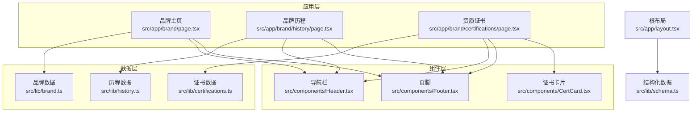
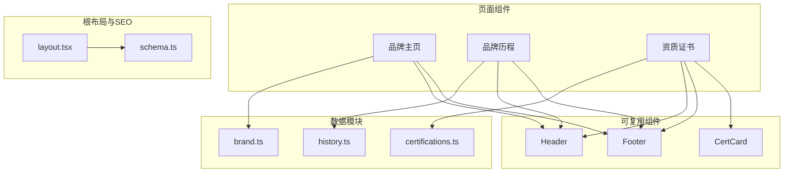
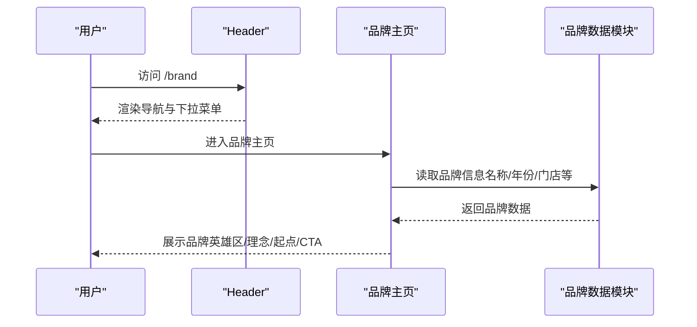
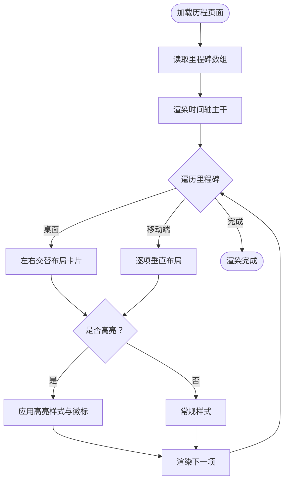
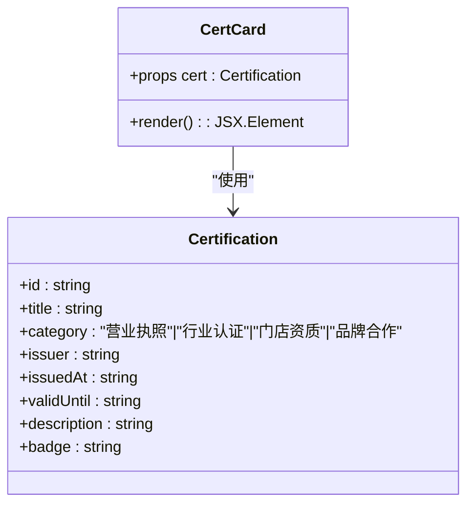
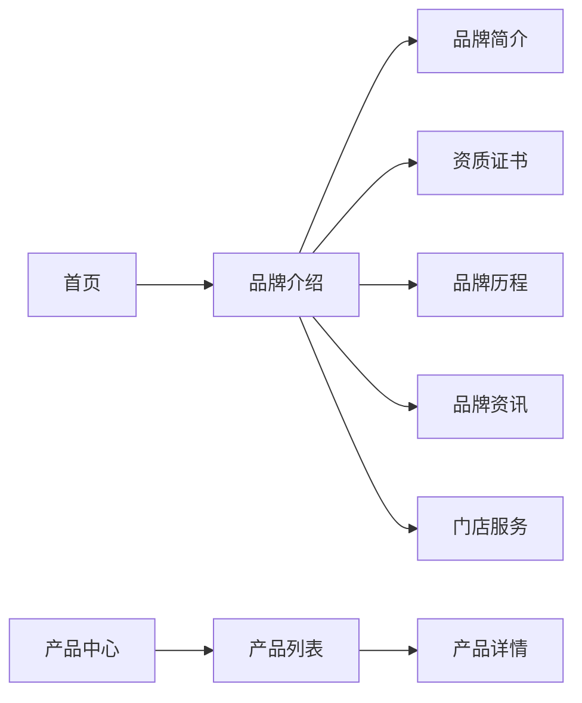
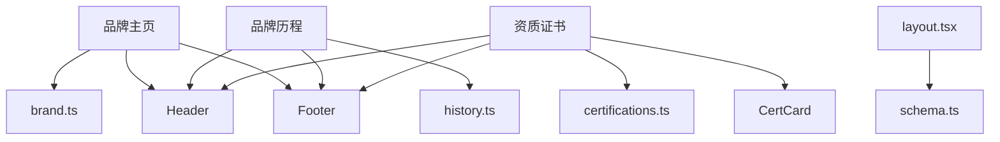

# 品牌介绍系统

<cite>
**本文档引用的文件**
- [src/app/brand/page.tsx](file://src/app/brand/page.tsx)
- [src/app/brand/history/page.tsx](file://src/app/brand/history/page.tsx)
- [src/app/brand/certifications/page.tsx](file://src/app/brand/certifications/page.tsx)
- [src/lib/brand.ts](file://src/lib/brand.ts)
- [src/lib/history.ts](file://src/lib/history.ts)
- [src/lib/certifications.ts](file://src/lib/certifications.ts)
- [src/components/CertCard.tsx](file://src/components/CertCard.tsx)
- [src/components/Header.tsx](file://src/components/Header.tsx)
- [src/components/Footer.tsx](file://src/components/Footer.tsx)
- [src/app/layout.tsx](file://src/app/layout.tsx)
- [src/lib/schema.ts](file://src/lib/schema.ts)
</cite>

## 目录
1. [引言](#引言)
2. [项目结构](#项目结构)
3. [核心组件](#核心组件)
4. [架构总览](#架构总览)
5. [详细组件分析](#详细组件分析)
6. [依赖关系分析](#依赖关系分析)
7. [性能考虑](#性能考虑)
8. [故障排除指南](#故障排除指南)
9. [结论](#结论)
10. [附录](#附录)

## 引言
本文件系统性梳理蓝辉轻改网站的品牌介绍体系，覆盖品牌主页的品牌形象与理念传达、品牌历史的时间轴展示与发展历程、品牌资质认证的证书展示与信任建立三大板块。文档从数据模型设计、内容管理策略、展示逻辑、页面组织与导航设计、编辑更新维护流程，到品牌故事叙述技巧、视觉元素运用与用户体验优化进行全面阐述，并结合实际代码路径给出实现参考与最佳实践。

## 项目结构
品牌介绍系统采用 Next.js App Router 的路由组织方式，品牌相关页面位于 `src/app/brand/` 下，配套的数据与组件分别位于 `src/lib/` 和 `src/components/`。整体结构清晰、职责分离，便于扩展与维护。

**图表来源**
- [src/app/brand/page.tsx](file://src/app/brand/page.tsx)
- [src/app/brand/history/page.tsx](file://src/app/brand/history/page.tsx)
- [src/app/brand/certifications/page.tsx](file://src/app/brand/certifications/page.tsx)
- [src/lib/brand.ts](file://src/lib/brand.ts)
- [src/lib/history.ts](file://src/lib/history.ts)
- [src/lib/certifications.ts](file://src/lib/certifications.ts)
- [src/components/Header.tsx](file://src/components/Header.tsx)
- [src/components/Footer.tsx](file://src/components/Footer.tsx)
- [src/components/CertCard.tsx](file://src/components/CertCard.tsx)
- [src/app/layout.tsx](file://src/app/layout.tsx)
- [src/lib/schema.ts](file://src/lib/schema.ts)

**章节来源**
- [src/app/brand/page.tsx](file://src/app/brand/page.tsx)
- [src/app/brand/history/page.tsx](file://src/app/brand/history/page.tsx)
- [src/app/brand/certifications/page.tsx](file://src/app/brand/certifications/page.tsx)
- [src/lib/brand.ts](file://src/lib/brand.ts)
- [src/lib/history.ts](file://src/lib/history.ts)
- [src/lib/certifications.ts](file://src/lib/certifications.ts)
- [src/components/Header.tsx](file://src/components/Header.tsx)
- [src/components/Footer.tsx](file://src/components/Footer.tsx)
- [src/components/CertCard.tsx](file://src/components/CertCard.tsx)
- [src/app/layout.tsx](file://src/app/layout.tsx)
- [src/lib/schema.ts](file://src/lib/schema.ts)

## 核心组件
- 品牌主页：通过品牌数据模块集中注入品牌名称、成立年份、定位描述等，统一在头部、英雄区、理念区、发展起点与行动号召区展示，形成完整的品牌叙事闭环。
- 品牌历程：基于里程碑数组渲染时间轴，支持移动端与桌面端交替布局，突出关键节点的高亮样式。
- 资质证书：以分类卡片与证书卡片网格展示，占位徽章与颜色区分不同类别，强调“到店查验”的信任机制。

**章节来源**
- [src/app/brand/page.tsx](file://src/app/brand/page.tsx)
- [src/app/brand/history/page.tsx](file://src/app/brand/history/page.tsx)
- [src/app/brand/certifications/page.tsx](file://src/app/brand/certifications/page.tsx)
- [src/lib/brand.ts](file://src/lib/brand.ts)
- [src/lib/history.ts](file://src/lib/history.ts)
- [src/lib/certifications.ts](file://src/lib/certifications.ts)
- [src/components/CertCard.tsx](file://src/components/CertCard.tsx)

## 架构总览
品牌介绍系统遵循“页面组件 + 数据模块 + 可复用组件”的分层架构。页面组件负责布局与交互，数据模块提供品牌、历程、证书等纯数据；Header/Footer 提供跨页面一致的导航与信息；结构化数据模块在根布局注入组织信息，增强 SEO 与可发现性。

**图表来源**
- [src/app/brand/page.tsx](file://src/app/brand/page.tsx)
- [src/app/brand/history/page.tsx](file://src/app/brand/history/page.tsx)
- [src/app/brand/certifications/page.tsx](file://src/app/brand/certifications/page.tsx)
- [src/lib/brand.ts](file://src/lib/brand.ts)
- [src/lib/history.ts](file://src/lib/history.ts)
- [src/lib/certifications.ts](file://src/lib/certifications.ts)
- [src/components/Header.tsx](file://src/components/Header.tsx)
- [src/components/Footer.tsx](file://src/components/Footer.tsx)
- [src/components/CertCard.tsx](file://src/components/CertCard.tsx)
- [src/app/layout.tsx](file://src/app/layout.tsx)
- [src/lib/schema.ts](file://src/lib/schema.ts)

## 详细组件分析

### 品牌主页（品牌介绍）
- 页面结构：头部导航、品牌英雄区、关于品牌、品牌理念、发展起点、行动号召与页脚。
- 数据来源：品牌数据模块集中提供品牌中英文名、成立年份、当前门店、城市、短描述等。
- 展示逻辑：理念区以三宫格展示“轻量升级”“实用优先”“审美表达”，发展起点以双列卡片呈现品牌成立与门店启航的关键信息。
- 导航集成：Header 中“品牌介绍”下拉菜单包含“品牌简介”“资质证书”“品牌历程”，History/Certifications 页面通过面包屑回到品牌主页。

**图表来源**
- [src/app/brand/page.tsx](file://src/app/brand/page.tsx)
- [src/lib/brand.ts](file://src/lib/brand.ts)
- [src/components/Header.tsx](file://src/components/Header.tsx)

**章节来源**
- [src/app/brand/page.tsx](file://src/app/brand/page.tsx)
- [src/lib/brand.ts](file://src/lib/brand.ts)
- [src/components/Header.tsx](file://src/components/Header.tsx)

### 品牌历程（时间轴）
- 时间轴布局：桌面端使用居中竖线作为主干，左右交替放置里程碑卡片；移动端每项独立显示，使用时间点装饰。
- 数据驱动：里程碑数组包含年份、季度、标题、描述与高亮标记；高亮项带有特殊样式与徽标。
- 导航与回溯：页面顶部面包屑从品牌主页进入，末尾提供“未完待续”提示与资讯入口。

**图表来源**
- [src/app/brand/history/page.tsx](file://src/app/brand/history/page.tsx)
- [src/lib/history.ts](file://src/lib/history.ts)

**章节来源**
- [src/app/brand/history/page.tsx](file://src/app/brand/history/page.tsx)
- [src/lib/history.ts](file://src/lib/history.ts)

### 资质证书（信任建立）
- 分类展示：顶部网格展示四大类别（营业执照、行业认证、门店资质、品牌合作），辅助说明各类型别。
- 证书网格：每个证书卡片包含占位视觉、类别徽章、标题、描述与颁发信息（颁发方、日期、有效期），通过颜色区分类别。
- 信任策略：明确“证书以到店出示为准”，引导用户预约到店查阅，强化可信度与到店转化。

**图表来源**
- [src/components/CertCard.tsx](file://src/components/CertCard.tsx)
- [src/lib/certifications.ts](file://src/lib/certifications.ts)

**章节来源**
- [src/app/brand/certifications/page.tsx](file://src/app/brand/certifications/page.tsx)
- [src/lib/certifications.ts](file://src/lib/certifications.ts)
- [src/components/CertCard.tsx](file://src/components/CertCard.tsx)

### 数据模型设计与内容管理策略
- 品牌数据模型（brand.ts）：集中存放品牌名称、成立年份、定位、当前门店、城市、联系方式、ICP/公安备案、简短描述等，便于全局复用与一致性控制。
- 历程数据模型（history.ts）：里程碑对象包含年份、季度、标题、描述与高亮标记，支持未来扩展月份与更细粒度事件。
- 证书数据模型（certifications.ts）：证书对象包含类别、颁发方、日期、有效期、描述与占位徽章，类别枚举确保一致性；提供查询函数按 ID 获取证书详情。
- 内容管理策略：
  - 占位与留白：证书与联系方式等敏感信息采用占位文案，避免误用与法律风险。
  - 分类与标签：通过类别与高亮标记实现内容分级与重点突出。
  - 扩展性：里程碑与证书数组支持追加新条目；类别与颜色映射便于新增类型。

**章节来源**
- [src/lib/brand.ts](file://src/lib/brand.ts)
- [src/lib/history.ts](file://src/lib/history.ts)
- [src/lib/certifications.ts](file://src/lib/certifications.ts)

### 页面组织与导航设计
- Header 导航：包含“首页”“产品中心”“门店服务”“品牌介绍”“品牌资讯”，其中“品牌介绍”下拉菜单包含“品牌简介”“资质证书”“品牌历程”，支持桌面端与移动端两套交互。
- Footer 导航：提供快捷导航、产品中心链接、联系方式等，强化品牌信息触达。
- 面包屑：历程与证书页面顶部提供从品牌主页返回的导航路径，提升可回溯性。

**图表来源**
- [src/components/Header.tsx](file://src/components/Header.tsx)
- [src/components/Footer.tsx](file://src/components/Footer.tsx)

**章节来源**
- [src/components/Header.tsx](file://src/components/Header.tsx)
- [src/components/Footer.tsx](file://src/components/Footer.tsx)

### 编辑、更新与维护流程
- 品牌主页：修改品牌数据模块中的品牌信息即可影响所有使用该模块的页面与组件。
- 品牌历程：在里程碑数组中添加或调整条目，必要时设置高亮标记以突出关键节点。
- 资质证书：在证书数组中新增条目，选择合适类别与占位徽章，描述部分保持“到店查验”原则。
- 导航与面包屑：如新增品牌子页面，需同步更新 Header 的导航配置与对应页面的面包屑。
- SEO 与结构化数据：根布局注入组织结构化数据，确保搜索引擎正确识别品牌信息。

**章节来源**
- [src/lib/brand.ts](file://src/lib/brand.ts)
- [src/lib/history.ts](file://src/lib/history.ts)
- [src/lib/certifications.ts](file://src/lib/certifications.ts)
- [src/components/Header.tsx](file://src/components/Header.tsx)
- [src/app/layout.tsx](file://src/app/layout.tsx)
- [src/lib/schema.ts](file://src/lib/schema.ts)

### 品牌故事叙述技巧、视觉元素与用户体验优化
- 叙述技巧：
  - 以“起点—成长—未来”的时间线串联品牌发展历程，强调“到店沟通—车型确认—方案推荐—施工交付”的服务闭环。
  - 在理念区用简洁关键词与图标强化品牌价值观，降低理解成本。
- 视觉元素：
  - 英雄区渐变背景与模糊光晕营造科技感与品牌氛围；时间轴使用渐变竖线与时间点装饰，增强节奏感。
  - 证书卡片采用重复线条纹理与类别专属边框/背景色，提升辨识度与层级感。
- 用户体验：
  - 移动端时间轴与证书网格采用响应式布局，保证在小屏设备上的可读性与可操作性。
  - 明确的“到店查验”提示与预约入口，降低用户疑虑并促进转化。

**章节来源**
- [src/app/brand/page.tsx](file://src/app/brand/page.tsx)
- [src/app/brand/history/page.tsx](file://src/app/brand/history/page.tsx)
- [src/app/brand/certifications/page.tsx](file://src/app/brand/certifications/page.tsx)
- [src/components/CertCard.tsx](file://src/components/CertCard.tsx)

## 依赖关系分析
- 页面对数据模块的依赖：品牌主页依赖品牌数据模块；历程页面依赖里程碑数组；证书页面依赖证书数组与类别定义。
- 页面对组件的依赖：三个品牌页面均依赖 Header 与 Footer，证书页面额外依赖 CertCard。
- SEO 依赖：根布局依赖结构化数据模块，向搜索引擎提供组织信息。

**图表来源**
- [src/app/brand/page.tsx](file://src/app/brand/page.tsx)
- [src/app/brand/history/page.tsx](file://src/app/brand/history/page.tsx)
- [src/app/brand/certifications/page.tsx](file://src/app/brand/certifications/page.tsx)
- [src/lib/brand.ts](file://src/lib/brand.ts)
- [src/lib/history.ts](file://src/lib/history.ts)
- [src/lib/certifications.ts](file://src/lib/certifications.ts)
- [src/components/Header.tsx](file://src/components/Header.tsx)
- [src/components/Footer.tsx](file://src/components/Footer.tsx)
- [src/components/CertCard.tsx](file://src/components/CertCard.tsx)
- [src/app/layout.tsx](file://src/app/layout.tsx)
- [src/lib/schema.ts](file://src/lib/schema.ts)

**章节来源**
- [src/app/brand/page.tsx](file://src/app/brand/page.tsx)
- [src/app/brand/history/page.tsx](file://src/app/brand/history/page.tsx)
- [src/app/brand/certifications/page.tsx](file://src/app/brand/certifications/page.tsx)
- [src/lib/brand.ts](file://src/lib/brand.ts)
- [src/lib/history.ts](file://src/lib/history.ts)
- [src/lib/certifications.ts](file://src/lib/certifications.ts)
- [src/components/Header.tsx](file://src/components/Header.tsx)
- [src/components/Footer.tsx](file://src/components/Footer.tsx)
- [src/components/CertCard.tsx](file://src/components/CertCard.tsx)
- [src/app/layout.tsx](file://src/app/layout.tsx)
- [src/lib/schema.ts](file://src/lib/schema.ts)

## 性能考虑
- 组件复用：Header/Footer 与 CertCard 在多个页面共享，减少重复渲染与代码体积。
- 数据扁平化：品牌、历程、证书数据以数组形式存储，避免深层嵌套带来的渲染开销。
- 图片与资源：公共图片位于 public/images，建议使用 Next.js 图像优化与懒加载策略（如适用）。
- SEO 与结构化数据：根布局注入 JSON-LD，有助于搜索引擎抓取与索引，间接提升访问流量。

## 故障排除指南
- 导航高亮异常：检查 Header 中的路径匹配规则与当前路由，确保 matchPrefix 正确。
- 证书卡片样式错乱：确认类别枚举值与颜色映射一致，避免新增类别未配置颜色导致的样式缺失。
- 时间轴布局问题：检查里程碑数组长度与移动端/桌面端断点条件，确保交替布局正常。
- 结构化数据缺失：确认根布局已注入组织 Schema，且品牌数据模块中的地址/电话等字段未保留占位文案。

**章节来源**
- [src/components/Header.tsx](file://src/components/Header.tsx)
- [src/components/CertCard.tsx](file://src/components/CertCard.tsx)
- [src/app/brand/history/page.tsx](file://src/app/brand/history/page.tsx)
- [src/app/layout.tsx](file://src/app/layout.tsx)
- [src/lib/schema.ts](file://src/lib/schema.ts)

## 结论
蓝辉轻改品牌介绍系统通过清晰的页面分层、统一的数据模块与可复用组件，构建了从品牌形象、发展历程到资质信任的完整展示体系。系统具备良好的扩展性与维护性，能够随着业务发展持续迭代。建议在真实证书补齐后，及时替换占位信息并完善到店查验流程，进一步提升用户信任与转化效果。

## 附录
- 实际实现参考路径（不含代码内容）：
  - 品牌主页：[品牌主页页面](file://src/app/brand/page.tsx)
  - 品牌历程：[品牌历程页面](file://src/app/brand/history/page.tsx)
  - 资质证书：[资质证书页面](file://src/app/brand/certifications/page.tsx)
  - 品牌数据：[品牌数据模块](file://src/lib/brand.ts)
  - 历程数据：[历程数据模块](file://src/lib/history.ts)
  - 证书数据：[证书数据模块](file://src/lib/certifications.ts)
  - 证书卡片组件：[证书卡片组件](file://src/components/CertCard.tsx)
  - 导航组件：[导航组件](file://src/components/Header.tsx)
  - 页脚组件：[页脚组件](file://src/components/Footer.tsx)
  - 根布局与SEO：[根布局](file://src/app/layout.tsx)，[结构化数据](file://src/lib/schema.ts)