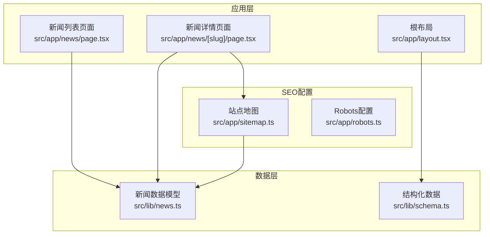
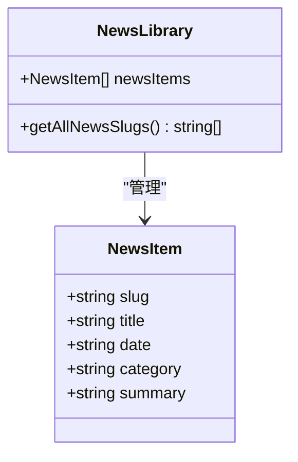
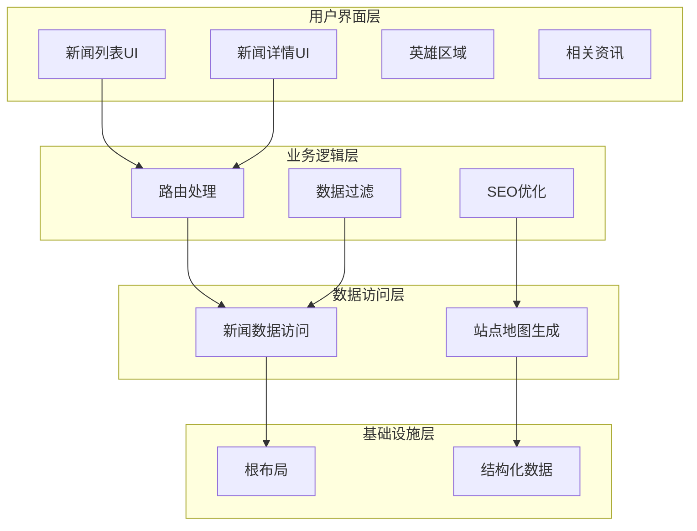
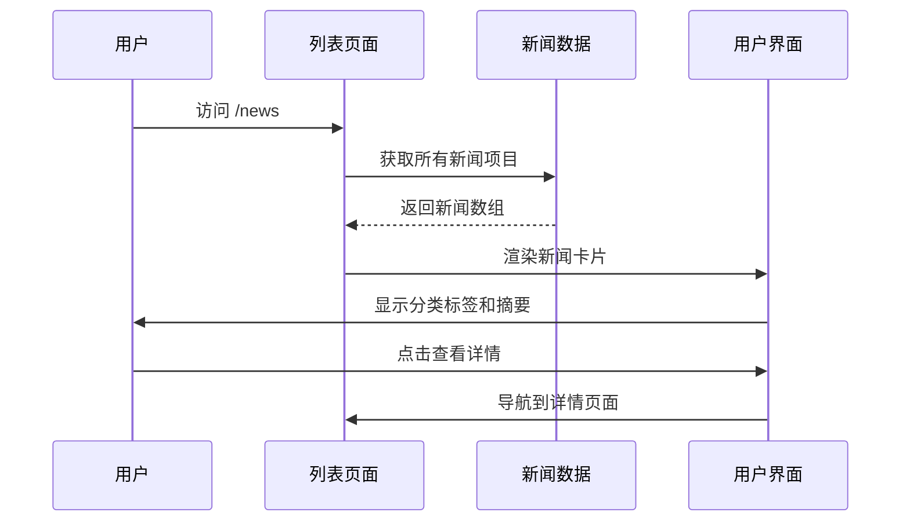
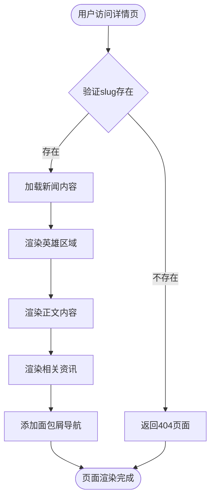
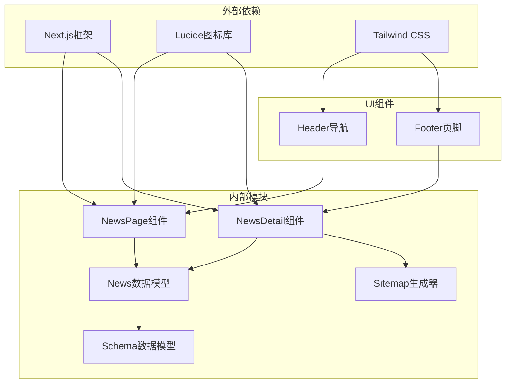
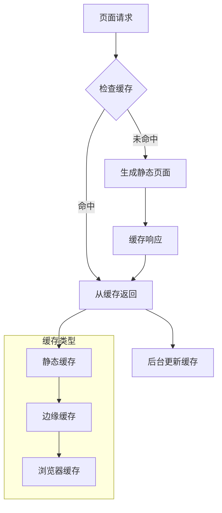

# 新闻资讯系统

<cite>
**本文档引用的文件**
- [src/app/news/page.tsx](file://src/app/news/page.tsx)
- [src/app/news/[slug]/page.tsx](file://src/app/news/[slug]/page.tsx)
- [src/lib/news.ts](file://src/lib/news.ts)
- [src/app/sitemap.ts](file://src/app/sitemap.ts)
- [src/app/robots.ts](file://src/app/robots.ts)
- [src/app/layout.tsx](file://src/app/layout.tsx)
- [src/lib/schema.ts](file://src/lib/schema.ts)
- [.claude/skills/next-cache-components/SKILL.md](file://.claude/skills/next-cache-components/SKILL.md)
</cite>

## 目录
1. [引言](#引言)
2. [项目结构](#项目结构)
3. [核心组件](#核心组件)
4. [架构概览](#架构概览)
5. [详细组件分析](#详细组件分析)
6. [依赖关系分析](#依赖关系分析)
7. [性能考虑](#性能考虑)
8. [故障排除指南](#故障排除指南)
9. [结论](#结论)
10. [附录](#附录)

## 引言

蓝辉轻改网站的新闻资讯系统是一个基于Next.js构建的企业级内容管理系统。该系统实现了完整的新闻展示功能，包括新闻列表页面的文章分类、标签筛选和分页机制，动态文章详情页面的slug路由处理和内容渲染，以及新闻数据模型的结构设计。

系统采用静态生成（SSG）和动态路由相结合的方式，通过`generateStaticParams`实现预渲染，确保了优秀的性能表现和SEO优化效果。新闻数据目前存储在本地数组中，为后续集成CMS系统提供了清晰的扩展路径。

## 项目结构

新闻资讯系统主要由以下核心文件组成：



**图表来源**
- [src/app/news/page.tsx:1-77](file://src/app/news/page.tsx#L1-L77)
- [src/app/news/[slug]/page.tsx:1-181](file://src/app/news/[slug]/page.tsx#L1-L181)
- [src/lib/news.ts:1-46](file://src/lib/news.ts#L1-L46)

**章节来源**
- [src/app/news/page.tsx:1-77](file://src/app/news/page.tsx#L1-L77)
- [src/app/news/[slug]/page.tsx:1-181](file://src/app/news/[slug]/page.tsx#L1-L181)
- [src/lib/news.ts:1-46](file://src/lib/news.ts#L1-L46)

## 核心组件

### 数据模型设计

新闻系统采用简洁而强大的数据模型设计，支持未来扩展需求：



**图表来源**
- [src/lib/news.ts:8-14](file://src/lib/news.ts#L8-L14)
- [src/lib/news.ts:43-45](file://src/lib/news.ts#L43-L45)

### 页面路由架构

系统采用Next.js的动态路由机制，支持多层级URL结构：

- 列表页面：`/news`
- 详情页面：`/news/[slug]`
- 自动生成静态参数：`generateStaticParams()`

**章节来源**
- [src/lib/news.ts:8-14](file://src/lib/news.ts#L8-L14)
- [src/app/news/[slug]/page.tsx:9-11](file://src/app/news/[slug]/page.tsx#L9-L11)

## 架构概览

新闻资讯系统采用分层架构设计，确保了良好的可维护性和扩展性：



**图表来源**
- [src/app/news/page.tsx:34-76](file://src/app/news/page.tsx#L34-L76)
- [src/app/news/[slug]/page.tsx:27-180](file://src/app/news/[slug]/page.tsx#L27-L180)
- [src/app/sitemap.ts:17-123](file://src/app/sitemap.ts#L17-L123)

## 详细组件分析

### 新闻列表页面

新闻列表页面实现了完整的新闻展示功能，包括卡片式布局、分类标签显示和分页机制：



**图表来源**
- [src/app/news/page.tsx:34-76](file://src/app/news/page.tsx#L34-L76)
- [src/lib/news.ts:16-41](file://src/lib/news.ts#L16-L41)

#### 核心特性

1. **响应式布局设计**：使用Tailwind CSS实现自适应布局
2. **分类标签系统**：支持品牌动态、门店动态、产品动态三类分类
3. **日期显示机制**：统一显示格式，便于用户理解发布时间
4. **分页准备**：为未来的分页功能预留接口

**章节来源**
- [src/app/news/page.tsx:34-76](file://src/app/news/page.tsx#L34-L76)

### 新闻详情页面

新闻详情页面采用深度链接设计，支持SEO友好的URL结构和相关内容推荐：



**图表来源**
- [src/app/news/[slug]/page.tsx:27-180](file://src/app/news/[slug]/page.tsx#L27-L180)

#### 动态路由处理

系统通过`generateStaticParams`实现静态生成，确保每个新闻详情页面都被预渲染：

```typescript
export function generateStaticParams() {
  return getAllNewsSlugs().map((slug) => ({ slug }));
}
```

**章节来源**
- [src/app/news/[slug]/page.tsx:9-11](file://src/app/news/[slug]/page.tsx#L9-L11)
- [src/lib/news.ts:43-45](file://src/lib/news.ts#L43-L45)

### SEO优化策略

系统实现了全面的SEO优化方案，包括结构化数据、站点地图和Robots配置：

```mermaid
graph LR
subgraph "SEO配置"
SchemaOrg["结构化数据<br/>JSON-LD"]
SiteMap["站点地图<br/>XML"]
RobotsTxt["Robots.txt<br/>爬虫规则]
end
subgraph "内容优化"
MetaTags["元标签<br/>标题和描述]
BreadCrumbs["面包屑导航"]
OpenGraph["Open Graph<br/>社交媒体优化]
end
SchemaOrg --> MetaTags
SiteMap --> MetaTags
RobotsTxt --> MetaTags
BreadCrumbs --> OpenGraph
```

**图表来源**
- [src/lib/schema.ts:12-38](file://src/lib/schema.ts#L12-L38)
- [src/app/sitemap.ts:17-123](file://src/app/sitemap.ts#L17-L123)
- [src/app/robots.ts:4-16](file://src/app/robots.ts#L4-L16)

**章节来源**
- [src/lib/schema.ts:12-38](file://src/lib/schema.ts#L12-L38)
- [src/app/sitemap.ts:17-123](file://src/app/sitemap.ts#L17-L123)
- [src/app/robots.ts:4-16](file://src/app/robots.ts#L4-L16)

## 依赖关系分析

新闻资讯系统的依赖关系清晰明确，遵循单一职责原则：



**图表来源**
- [src/app/news/page.tsx:1-77](file://src/app/news/page.tsx#L1-L77)
- [src/app/news/[slug]/page.tsx:1-181](file://src/app/news/[slug]/page.tsx#L1-L181)
- [src/lib/news.ts:1-46](file://src/lib/news.ts#L1-L46)

**章节来源**
- [src/app/news/page.tsx:1-77](file://src/app/news/page.tsx#L1-L77)
- [src/app/news/[slug]/page.tsx:1-181](file://src/app/news/[slug]/page.tsx#L1-L181)

## 性能考虑

### 缓存策略

系统采用多层次的缓存策略确保最佳性能：



**图表来源**
- [.claude/skills/next-cache-components/SKILL.md:46-83](file://.claude/skills/next-cache-components/SKILL.md#L46-L83)

### 性能优化建议

1. **图片优化**：使用Next.js内置的Image组件进行响应式图片处理
2. **代码分割**：利用Next.js的自动代码分割功能
3. **懒加载**：对非首屏内容实施懒加载策略
4. **CDN集成**：通过边缘缓存提升全球访问速度

**章节来源**
- [.claude/skills/next-cache-components/SKILL.md:46-83](file://.claude/skills/next-cache-components/SKILL.md#L46-L83)

## 故障排除指南

### 常见问题及解决方案

| 问题类型 | 症状 | 解决方案 |
|---------|------|----------|
| 404页面 | 访问不存在的新闻详情页 | 检查slug是否正确，确认generateStaticParams配置 |
| SEO问题 | Google搜索结果不正确 | 验证generateMetadata函数，检查结构化数据 |
| 性能问题 | 页面加载缓慢 | 实施图片懒加载，优化CSS打包 |
| 分类显示错误 | 新闻分类标签不显示 | 检查NewsItem接口定义，确认数据源 |

**章节来源**
- [src/app/news/[slug]/page.tsx:33-34](file://src/app/news/[slug]/page.tsx#L33-L34)
- [src/app/news/[slug]/page.tsx:13-25](file://src/app/news/[slug]/page.tsx#L13-L25)

## 结论

蓝辉轻改新闻资讯系统展现了现代Web应用的最佳实践，通过合理的架构设计和完善的SEO优化，为用户提供了优质的阅读体验。系统的核心优势包括：

1. **高性能架构**：基于Next.js的静态生成和缓存策略
2. **SEO友好**：完整的结构化数据和站点地图支持
3. **可扩展设计**：清晰的数据模型为CMS集成预留空间
4. **响应式设计**：适配各种设备的用户体验

该系统为后续的功能扩展和内容管理提供了坚实的基础，是企业级内容管理系统的优秀范例。

## 附录

### 开发最佳实践

1. **数据模型扩展**：新增字段时需同步更新NewsItem接口
2. **SEO维护**：定期检查生成的元数据和结构化数据
3. **性能监控**：使用Next.js内置的性能指标工具
4. **测试策略**：为关键路由和组件编写单元测试

### 扩展开发指南

系统为未来的功能扩展提供了清晰的路径：

- **分类管理**：通过修改NewsItem.category字段实现新的分类维度
- **标签系统**：可以扩展NewsItem接口添加tags字段
- **评论功能**：建议创建独立的评论模块，避免与新闻数据耦合
- **富文本编辑**：集成Markdown或WYSIWYG编辑器，存储HTML内容

**章节来源**
- [src/lib/news.ts:8-14](file://src/lib/news.ts#L8-L14)
- [src/app/news/[slug]/page.tsx:36-39](file://src/app/news/[slug]/page.tsx#L36-L39)