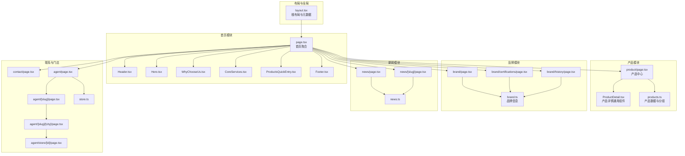
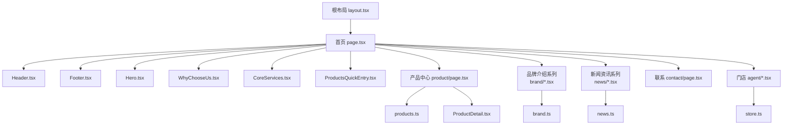
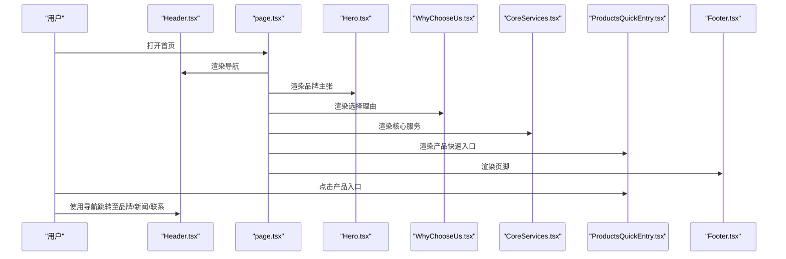
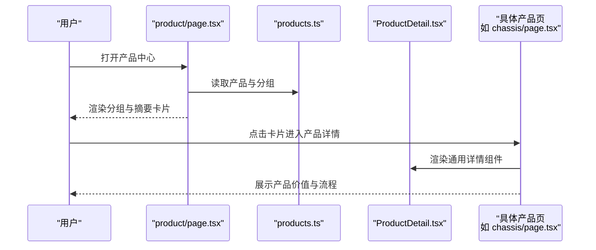
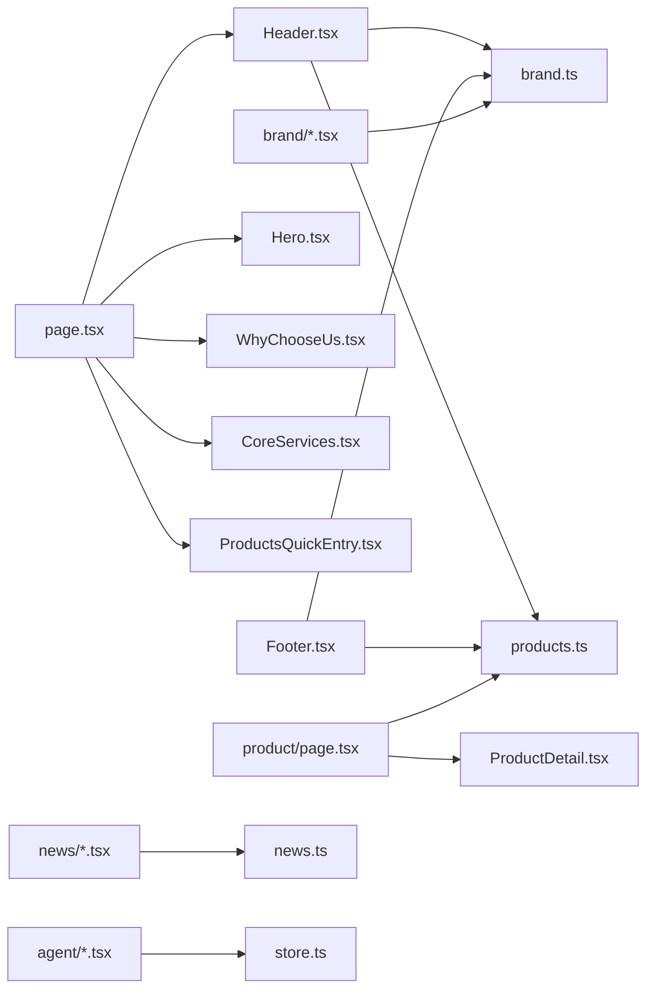

# 核心功能模块

<cite>
**本文档引用的文件**
- [src/app/layout.tsx](file://src/app/layout.tsx)
- [src/app/page.tsx](file://src/app/page.tsx)
- [src/components/Header.tsx](file://src/components/Header.tsx)
- [src/components/Footer.tsx](file://src/components/Footer.tsx)
- [src/components/Hero.tsx](file://src/components/Hero.tsx)
- [src/components/WhyChooseUs.tsx](file://src/components/WhyChooseUs.tsx)
- [src/components/CoreServices.tsx](file://src/components/CoreServices.tsx)
- [src/components/ProductsQuickEntry.tsx](file://src/components/ProductsQuickEntry.tsx)
- [src/lib/brand.ts](file://src/lib/brand.ts)
- [src/lib/products.ts](file://src/lib/products.ts)
- [src/app/product/page.tsx](file://src/app/product/page.tsx)
- [src/app/product/chassis/page.tsx](file://src/app/product/chassis/page.tsx)
- [src/app/product/color-film/page.tsx](file://src/app/product/color-film/page.tsx)
- [src/app/product/electric-steps/page.tsx](file://src/app/product/electric-steps/page.tsx)
- [src/components/ProductDetail.tsx](file://src/components/ProductDetail.tsx)
- [src/app/brand/page.tsx](file://src/app/brand/page.tsx)
- [src/app/brand/certifications/page.tsx](file://src/app/brand/certifications/page.tsx)
- [src/app/brand/history/page.tsx](file://src/app/brand/history/page.tsx)
- [src/app/news/page.tsx](file://src/app/news/page.tsx)
- [src/app/news/[slug]/page.tsx](file://src/app/news/[slug]/page.tsx)
- [src/lib/news.ts](file://src/lib/news.ts)
- [src/app/contact/page.tsx](file://src/app/contact/page.tsx)
- [src/lib/store.ts](file://src/lib/store.ts)
- [src/app/agent/page.tsx](file://src/app/agent/page.tsx)
- [src/app/agent/[slug]/page.tsx](file://src/app/agent/[slug]/page.tsx)
- [src/app/agent/[slug]/[city]/page.tsx](file://src/app/agent/[slug]/[city]/page.tsx)
- [src/app/agent/store/[id]/page.tsx](file://src/app/agent/store/[id]/page.tsx)
</cite>

## 目录
1. [引言](#引言)
2. [项目结构](#项目结构)
3. [核心组件](#核心组件)
4. [架构总览](#架构总览)
5. [详细组件分析](#详细组件分析)
6. [依赖分析](#依赖分析)
7. [性能考虑](#性能考虑)
8. [故障排查指南](#故障排查指南)
9. [结论](#结论)
10. [附录](#附录)

## 引言
本文件面向业务与开发双重角色，系统化梳理蓝辉轻改网站的核心功能模块：首页展示系统、产品展示系统、品牌介绍系统、新闻资讯系统、联系系统。文档从“业务价值—用户交互—技术实现—模块协作—配置与扩展”的维度展开，帮助读者快速理解各模块的设计意图与落地方式，并提供可操作的优化建议与扩展路径。

## 项目结构
网站基于 Next.js App Router 构建，采用“按页面组织”的目录结构，配合共享组件与数据层库文件，形成清晰的视图层、布局层与数据层分离：

- 视图层（页面与组件）
  - 页面：首页、产品中心、品牌介绍、新闻资讯、联系、门店服务等
  - 共享组件：Header、Footer、Hero、WhyChooseUs、CoreServices、ProductsQuickEntry、产品详情卡片等
- 数据层（品牌、产品、新闻、门店）
  - 品牌信息：src/lib/brand.ts
  - 产品数据：src/lib/products.ts
  - 新闻数据：src/lib/news.ts
  - 门店数据：src/lib/store.ts
- 布局与元数据：src/app/layout.tsx、各页面的 metadata 定义

图表来源
- [src/app/layout.tsx:1-32](file://src/app/layout.tsx#L1-L32)
- [src/app/page.tsx:1-22](file://src/app/page.tsx#L1-L22)
- [src/components/Header.tsx:1-292](file://src/components/Header.tsx#L1-L292)
- [src/components/Footer.tsx:1-113](file://src/components/Footer.tsx#L1-L113)
- [src/components/Hero.tsx:1-56](file://src/components/Hero.tsx#L1-L56)
- [src/components/WhyChooseUs.tsx:1-84](file://src/components/WhyChooseUs.tsx#L1-L84)
- [src/components/CoreServices.tsx:1-89](file://src/components/CoreServices.tsx#L1-L89)
- [src/components/ProductsQuickEntry.tsx:1-81](file://src/components/ProductsQuickEntry.tsx#L1-L81)
- [src/app/product/page.tsx:1-146](file://src/app/product/page.tsx#L1-L146)
- [src/lib/products.ts:1-282](file://src/lib/products.ts#L1-L282)
- [src/lib/brand.ts:1-28](file://src/lib/brand.ts#L1-L28)
- [src/app/brand/page.tsx](file://src/app/brand/page.tsx)
- [src/app/brand/certifications/page.tsx](file://src/app/brand/certifications/page.tsx)
- [src/app/brand/history/page.tsx](file://src/app/brand/history/page.tsx)
- [src/app/news/page.tsx](file://src/app/news/page.tsx)
- [src/app/news/[slug]/page.tsx](file://src/app/news/[slug]/page.tsx)
- [src/lib/news.ts](file://src/lib/news.ts)
- [src/app/contact/page.tsx](file://src/app/contact/page.tsx)
- [src/lib/store.ts](file://src/lib/store.ts)
- [src/app/agent/page.tsx](file://src/app/agent/page.tsx)
- [src/app/agent/[slug]/page.tsx](file://src/app/agent/[slug]/page.tsx)
- [src/app/agent/[slug]/[city]/page.tsx](file://src/app/agent/[slug]/[city]/page.tsx)
- [src/app/agent/store/[id]/page.tsx](file://src/app/agent/store/[id]/page.tsx)

章节来源
- [src/app/layout.tsx:1-32](file://src/app/layout.tsx#L1-L32)
- [src/app/page.tsx:1-22](file://src/app/page.tsx#L1-L22)

## 核心组件
- 布局与元数据：根布局负责语言、主题、SEO 元信息注入；首页页面聚合主要模块。
- 导航与页脚：Header 提供桌面/移动端导航、下拉子菜单、活动态样式；Footer 提供快捷导航、产品导航、联系方式与版权信息。
- 首页模块：Hero 展示品牌主张与行动号召；WhyChooseUs 突出三大价值点；CoreServices 概述三类核心服务；ProductsQuickEntry 快速入口直达产品分类。
- 数据层：brand.ts 统一品牌信息；products.ts 定义产品骨架、分组、服务流程模板与图片映射。

章节来源
- [src/components/Header.tsx:1-292](file://src/components/Header.tsx#L1-L292)
- [src/components/Footer.tsx:1-113](file://src/components/Footer.tsx#L1-L113)
- [src/components/Hero.tsx:1-56](file://src/components/Hero.tsx#L1-L56)
- [src/components/WhyChooseUs.tsx:1-84](file://src/components/WhyChooseUs.tsx#L1-L84)
- [src/components/CoreServices.tsx:1-89](file://src/components/CoreServices.tsx#L1-L89)
- [src/components/ProductsQuickEntry.tsx:1-81](file://src/components/ProductsQuickEntry.tsx#L1-L81)
- [src/lib/brand.ts:1-28](file://src/lib/brand.ts#L1-L28)
- [src/lib/products.ts:1-282](file://src/lib/products.ts#L1-L282)

## 架构总览
整体采用“页面路由 + 组件复用 + 数据库/静态数据”的三层架构。页面路由负责 URL 与页面渲染，组件负责 UI 与交互，数据层负责品牌、产品、新闻、门店等业务数据。导航与页脚贯穿多个页面，形成一致的用户体验。

图表来源
- [src/app/layout.tsx:1-32](file://src/app/layout.tsx#L1-L32)
- [src/app/page.tsx:1-22](file://src/app/page.tsx#L1-L22)
- [src/components/Header.tsx:1-292](file://src/components/Header.tsx#L1-L292)
- [src/components/Footer.tsx:1-113](file://src/components/Footer.tsx#L1-L113)
- [src/components/Hero.tsx:1-56](file://src/components/Hero.tsx#L1-L56)
- [src/components/WhyChooseUs.tsx:1-84](file://src/components/WhyChooseUs.tsx#L1-L84)
- [src/components/CoreServices.tsx:1-89](file://src/components/CoreServices.tsx#L1-L89)
- [src/components/ProductsQuickEntry.tsx:1-81](file://src/components/ProductsQuickEntry.tsx#L1-L81)
- [src/app/product/page.tsx:1-146](file://src/app/product/page.tsx#L1-L146)
- [src/lib/products.ts:1-282](file://src/lib/products.ts#L1-L282)
- [src/app/brand/page.tsx](file://src/app/brand/page.tsx)
- [src/app/brand/certifications/page.tsx](file://src/app/brand/certifications/page.tsx)
- [src/app/brand/history/page.tsx](file://src/app/brand/history/page.tsx)
- [src/lib/brand.ts:1-28](file://src/lib/brand.ts#L1-L28)
- [src/app/news/page.tsx](file://src/app/news/page.tsx)
- [src/lib/news.ts](file://src/lib/news.ts)
- [src/app/contact/page.tsx](file://src/app/contact/page.tsx)
- [src/app/agent/page.tsx](file://src/app/agent/page.tsx)
- [src/lib/store.ts](file://src/lib/store.ts)

## 详细组件分析

### 首页展示系统
- 业务价值
  - 通过 Hero 明确品牌主张与服务定位，吸引目标用户；
  - WhyChooseUs 传递差异化价值，建立信任；
  - CoreServices 概览三大服务，降低决策成本；
  - ProductsQuickEntry 引导用户进入产品详情，提升转化。
- 用户交互流程
  - 访问首页 → 浏览 Hero 与 WhyChooseUs → 查看 CoreServices → 通过 ProductsQuickEntry 进入产品 → 通过 Footer/导航跳转至品牌、新闻、联系等。
- 技术实现要点
  - Header 动态高亮当前路由，支持桌面/移动端下拉菜单；
  - Footer 统一品牌信息与产品导航，便于二次触达；
  - Hero、WhyChooseUs、CoreServices、ProductsQuickEntry 作为独立组件，便于迭代与复用。
- 配置与扩展
  - 品牌信息集中在 brand.ts，统一更新品牌名、标语、门店等；
  - 产品列表来自 products.ts，新增产品只需扩展数据即可；
  - 可通过修改组件样式类名与配色映射，快速调整视觉风格。

图表来源
- [src/app/page.tsx:1-22](file://src/app/page.tsx#L1-L22)
- [src/components/Header.tsx:1-292](file://src/components/Header.tsx#L1-L292)
- [src/components/Footer.tsx:1-113](file://src/components/Footer.tsx#L1-L113)
- [src/components/Hero.tsx:1-56](file://src/components/Hero.tsx#L1-L56)
- [src/components/WhyChooseUs.tsx:1-84](file://src/components/WhyChooseUs.tsx#L1-L84)
- [src/components/CoreServices.tsx:1-89](file://src/components/CoreServices.tsx#L1-L89)
- [src/components/ProductsQuickEntry.tsx:1-81](file://src/components/ProductsQuickEntry.tsx#L1-L81)

章节来源
- [src/app/page.tsx:1-22](file://src/app/page.tsx#L1-L22)
- [src/components/Header.tsx:1-292](file://src/components/Header.tsx#L1-L292)
- [src/components/Footer.tsx:1-113](file://src/components/Footer.tsx#L1-L113)
- [src/components/Hero.tsx:1-56](file://src/components/Hero.tsx#L1-L56)
- [src/components/WhyChooseUs.tsx:1-84](file://src/components/WhyChooseUs.tsx#L1-L84)
- [src/components/CoreServices.tsx:1-89](file://src/components/CoreServices.tsx#L1-L89)
- [src/components/ProductsQuickEntry.tsx:1-81](file://src/components/ProductsQuickEntry.tsx#L1-L81)
- [src/lib/brand.ts:1-28](file://src/lib/brand.ts#L1-L28)
- [src/lib/products.ts:1-282](file://src/lib/products.ts#L1-L282)

### 产品展示系统
- 业务价值
  - 将轻改装备与汽车膜系两大类目清晰呈现，降低用户认知负担；
  - 通过产品摘要卡片引导到详情页，促进到店沟通与成交。
- 用户交互流程
  - 访问产品中心 → 查看分组与摘要 → 点击进入产品详情 → 通过 CTA 预约门店。
- 技术实现要点
  - 产品数据集中于 products.ts，包含分组、标签、受众、价值点、流程模板与图片映射；
  - 产品中心页面按分组渲染摘要卡片，点击跳转至对应详情页；
  - 产品详情页由 ProductDetail.tsx 通用组件承载，页面仅负责 SEO 元数据与路由参数校验。
- 配置与扩展
  - 新增产品：在 products.ts 中追加条目，设置分组、标签、受众、价值点、流程模板与图片映射；
  - 新增分组：在 productGroups 中添加新组，页面会自动渲染；
  - 图片资源：在 public/images/products 下新增图片，并在 productImageMap 中映射。

图表来源
- [src/app/product/page.tsx:1-146](file://src/app/product/page.tsx#L1-L146)
- [src/lib/products.ts:1-282](file://src/lib/products.ts#L1-L282)
- [src/app/product/chassis/page.tsx:1-17](file://src/app/product/chassis/page.tsx#L1-L17)
- [src/app/product/color-film/page.tsx:1-17](file://src/app/product/color-film/page.tsx#L1-L17)
- [src/app/product/electric-steps/page.tsx:1-17](file://src/app/product/electric-steps/page.tsx#L1-L17)
- [src/components/ProductDetail.tsx](file://src/components/ProductDetail.tsx)

章节来源
- [src/app/product/page.tsx:1-146](file://src/app/product/page.tsx#L1-L146)
- [src/lib/products.ts:1-282](file://src/lib/products.ts#L1-L282)
- [src/app/product/chassis/page.tsx:1-17](file://src/app/product/chassis/page.tsx#L1-L17)
- [src/app/product/color-film/page.tsx:1-17](file://src/app/product/color-film/page.tsx#L1-L17)
- [src/app/product/electric-steps/page.tsx:1-17](file://src/app/product/electric-steps/page.tsx#L1-L17)

### 品牌介绍系统
- 业务价值
  - 通过品牌简介、资质证书、品牌历程三个维度，构建品牌可信度与专业形象。
- 用户交互流程
  - 从首页导航进入品牌页 → 选择子页面（简介/证书/历程） → 查看品牌故事与背书。
- 技术实现要点
  - Header 与 Footer 内嵌品牌子菜单，确保跨页面一致性；
  - 品牌数据集中于 brand.ts，统一用于页面与组件。
- 配置与扩展
  - 更新品牌信息：在 brand.ts 中修改字段；
  - 新增页面：在 src/app/brand 下新增页面文件，遵循现有命名与结构。

章节来源
- [src/components/Header.tsx:1-292](file://src/components/Header.tsx#L1-L292)
- [src/components/Footer.tsx:1-113](file://src/components/Footer.tsx#L1-L113)
- [src/lib/brand.ts:1-28](file://src/lib/brand.ts#L1-L28)
- [src/app/brand/page.tsx](file://src/app/brand/page.tsx)
- [src/app/brand/certifications/page.tsx](file://src/app/brand/certifications/page.tsx)
- [src/app/brand/history/page.tsx](file://src/app/brand/history/page.tsx)

### 新闻资讯系统
- 业务价值
  - 通过新闻资讯传递行业动态、案例分享与品牌声音，增强用户粘性与信任。
- 用户交互流程
  - 从首页导航进入新闻列表 → 点击文章进入详情页 → 返回或继续浏览。
- 技术实现要点
  - 列表页与详情页分别渲染，详情页通过动态路由 [slug] 匹配文章；
  - 新闻数据由 news.ts 提供，页面负责 SEO 元数据与渲染。
- 配置与扩展
  - 新增文章：在 news.ts 中添加条目，确保 slug 唯一；
  - 新增页面：在 src/app/news 下新增页面文件，遵循现有结构。

章节来源
- [src/app/news/page.tsx](file://src/app/news/page.tsx)
- [src/app/news/[slug]/page.tsx](file://src/app/news/[slug]/page.tsx)
- [src/lib/news.ts](file://src/lib/news.ts)

### 联系系统
- 业务价值
  - 提供预约咨询入口，推动用户到店沟通与成交。
- 用户交互流程
  - 从首页导航或页脚进入联系页 → 查看联系方式与预约入口 → 提交预约。
- 技术实现要点
  - Header 与 Footer 均提供预约入口，确保多渠道触达；
  - 联系信息来源于 brand.ts，统一管理。
- 配置与扩展
  - 更新联系方式：在 brand.ts 中修改电话、地址、营业时间等；
  - 新增页面：在 src/app/contact 下新增页面文件。

章节来源
- [src/components/Header.tsx:1-292](file://src/components/Header.tsx#L1-L292)
- [src/components/Footer.tsx:1-113](file://src/components/Footer.tsx#L1-L113)
- [src/lib/brand.ts:1-28](file://src/lib/brand.ts#L1-L28)
- [src/app/contact/page.tsx](file://src/app/contact/page.tsx)

### 门店服务系统
- 业务价值
  - 以顺德大良店为中心，提供到店沟通、方案推荐与施工交付，强化线下服务能力。
- 用户交互流程
  - 从首页导航进入门店页 → 选择门店/城市 → 预约到店 → 完成服务流程。
- 技术实现要点
  - 采用多级动态路由：agent、agent/[slug]、agent/[slug]/[city]、agent/store/[id]；
  - 门店数据由 store.ts 提供，页面负责渲染与交互。
- 配置与扩展
  - 新增门店：在 store.ts 中添加门店信息；
  - 新增页面：在 src/app/agent 下新增页面文件，遵循现有结构。

章节来源
- [src/app/agent/page.tsx](file://src/app/agent/page.tsx)
- [src/app/agent/[slug]/page.tsx](file://src/app/agent/[slug]/page.tsx)
- [src/app/agent/[slug]/[city]/page.tsx](file://src/app/agent/[slug]/[city]/page.tsx)
- [src/app/agent/store/[id]/page.tsx](file://src/app/agent/store/[id]/page.tsx)
- [src/lib/store.ts](file://src/lib/store.ts)

## 依赖分析
- 组件耦合
  - Header 依赖品牌与产品数据，用于生成导航与下拉菜单；
  - Footer 依赖品牌与产品数据，用于快捷导航与产品导航；
  - 首页模块相互独立，通过共享数据层解耦。
- 数据依赖
  - 品牌信息集中于 brand.ts；
  - 产品信息集中于 products.ts；
  - 新闻信息集中于 news.ts；
  - 门店信息集中于 store.ts。
- 外部依赖
  - Next.js App Router 路由与动态路由；
  - Lucide React 图标库；
  - Tailwind CSS 样式工具。

图表来源
- [src/components/Header.tsx:1-292](file://src/components/Header.tsx#L1-L292)
- [src/components/Footer.tsx:1-113](file://src/components/Footer.tsx#L1-L113)
- [src/app/page.tsx:1-22](file://src/app/page.tsx#L1-L22)
- [src/components/Hero.tsx:1-56](file://src/components/Hero.tsx#L1-L56)
- [src/components/WhyChooseUs.tsx:1-84](file://src/components/WhyChooseUs.tsx#L1-L84)
- [src/components/CoreServices.tsx:1-89](file://src/components/CoreServices.tsx#L1-L89)
- [src/components/ProductsQuickEntry.tsx:1-81](file://src/components/ProductsQuickEntry.tsx#L1-L81)
- [src/app/product/page.tsx:1-146](file://src/app/product/page.tsx#L1-L146)
- [src/lib/products.ts:1-282](file://src/lib/products.ts#L1-L282)
- [src/lib/brand.ts:1-28](file://src/lib/brand.ts#L1-L28)
- [src/app/brand/page.tsx](file://src/app/brand/page.tsx)
- [src/app/brand/certifications/page.tsx](file://src/app/brand/certifications/page.tsx)
- [src/app/brand/history/page.tsx](file://src/app/brand/history/page.tsx)
- [src/app/news/page.tsx](file://src/app/news/page.tsx)
- [src/app/news/[slug]/page.tsx](file://src/app/news/[slug]/page.tsx)
- [src/lib/news.ts](file://src/lib/news.ts)
- [src/app/agent/page.tsx](file://src/app/agent/page.tsx)
- [src/app/agent/[slug]/page.tsx](file://src/app/agent/[slug]/page.tsx)
- [src/app/agent/[slug]/[city]/page.tsx](file://src/app/agent/[slug]/[city]/page.tsx)
- [src/app/agent/store/[id]/page.tsx](file://src/app/agent/store/[id]/page.tsx)
- [src/lib/store.ts](file://src/lib/store.ts)

章节来源
- [src/components/Header.tsx:1-292](file://src/components/Header.tsx#L1-L292)
- [src/components/Footer.tsx:1-113](file://src/components/Footer.tsx#L1-L113)
- [src/lib/brand.ts:1-28](file://src/lib/brand.ts#L1-L28)
- [src/lib/products.ts:1-282](file://src/lib/products.ts#L1-L282)
- [src/lib/news.ts](file://src/lib/news.ts)
- [src/lib/store.ts](file://src/lib/store.ts)

## 性能考虑
- 资源加载
  - 图片资源位于 public/images，建议使用合适的尺寸与格式，开启懒加载与 WebP 优化；
  - 图标库按需引入，减少首屏体积。
- 渲染策略
  - 首屏优先：首页模块按顺序渲染，Hero 与 WhyChooseUs 优先；
  - 列表渲染：产品中心与新闻列表采用虚拟滚动或分页，避免一次性渲染过多节点。
- 缓存与预取
  - 动态路由页面可利用 Next.js 的预取能力，提升交互流畅度；
  - SEO 元数据在页面层定义，减少重复计算。
- 主题与样式
  - 使用 Tailwind 工具类，避免运行时样式计算；
  - 深色主题与渐变背景在组件内局部应用，避免全局样式污染。

## 故障排查指南
- 导航异常
  - 症状：导航高亮不正确或下拉菜单无法关闭；
  - 排查：检查 Header 中 isActive 逻辑与 matchPrefix 设置，确认 pathname 是否正确；
  - 参考：[src/components/Header.tsx:50-78](file://src/components/Header.tsx#L50-L78)
- 产品未显示
  - 症状：产品中心无产品或详情页 404；
  - 排查：确认 products.ts 中是否存在对应 slug，页面是否正确调用 getProduct；
  - 参考：[src/app/product/page.tsx:25-108](file://src/app/product/page.tsx#L25-L108)、[src/lib/products.ts:266-268](file://src/lib/products.ts#L266-L268)
- 品牌信息不一致
  - 症状：品牌名、地址、电话等不一致；
  - 排查：统一在 brand.ts 中更新，确保 Header、Footer、Hero、品牌页均引用同一数据源；
  - 参考：[src/lib/brand.ts:8-25](file://src/lib/brand.ts#L8-L25)
- 新闻详情缺失
  - 症状：文章详情页空白或 404；
  - 排查：确认 news.ts 中存在对应 slug，动态路由参数是否正确传递；
  - 参考：[src/app/news/[slug]/page.tsx](file://src/app/news/[slug]/page.tsx)、[src/lib/news.ts](file://src/lib/news.ts)
- 门店信息错误
  - 症状：门店地址、电话或城市不正确；
  - 排查：在 store.ts 中核对数据，确认动态路由参数与页面渲染逻辑；
  - 参考：[src/lib/store.ts](file://src/lib/store.ts)、[src/app/agent/[slug]/[city]/page.tsx](file://src/app/agent/[slug]/[city]/page.tsx)

章节来源
- [src/components/Header.tsx:1-292](file://src/components/Header.tsx#L1-L292)
- [src/app/product/page.tsx:1-146](file://src/app/product/page.tsx#L1-L146)
- [src/lib/products.ts:1-282](file://src/lib/products.ts#L1-L282)
- [src/lib/brand.ts:1-28](file://src/lib/brand.ts#L1-L28)
- [src/app/news/[slug]/page.tsx](file://src/app/news/[slug]/page.tsx)
- [src/lib/news.ts](file://src/lib/news.ts)
- [src/lib/store.ts](file://src/lib/store.ts)
- [src/app/agent/[slug]/[city]/page.tsx](file://src/app/agent/[slug]/[city]/page.tsx)

## 结论
该网站以清晰的模块划分与共享数据层为基础，实现了从首页引流、产品展示到品牌塑造与线下服务闭环的完整路径。通过统一的品牌与产品数据源、可扩展的页面与组件结构，能够快速响应业务变化并持续优化用户体验。建议在后续迭代中进一步完善 SEO、性能与可访问性，并根据用户反馈持续优化导航与转化路径。

## 附录
- 最佳实践
  - 统一使用 brand.ts 与 products.ts 作为数据源，避免硬编码；
  - 页面仅负责路由与 SEO，业务逻辑下沉至组件与数据层；
  - 动态路由参数需进行存在性校验，防止 404；
  - 图片资源按需裁剪与压缩，提升加载速度。
- 扩展建议
  - 新增产品：在 products.ts 中添加条目并在图片目录放置资源；
  - 新增品牌页：在 src/app/brand 下新增页面并接入品牌数据；
  - 新增新闻：在 news.ts 中添加条目并创建对应页面；
  - 新增门店：在 store.ts 中添加条目并完善路由页面。