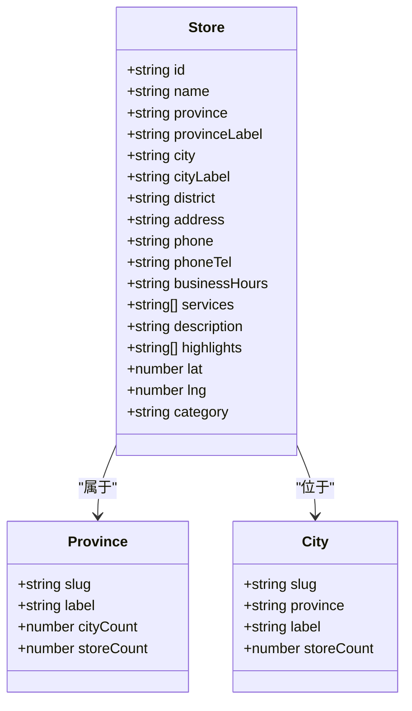
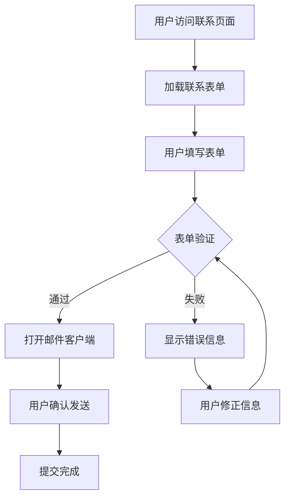
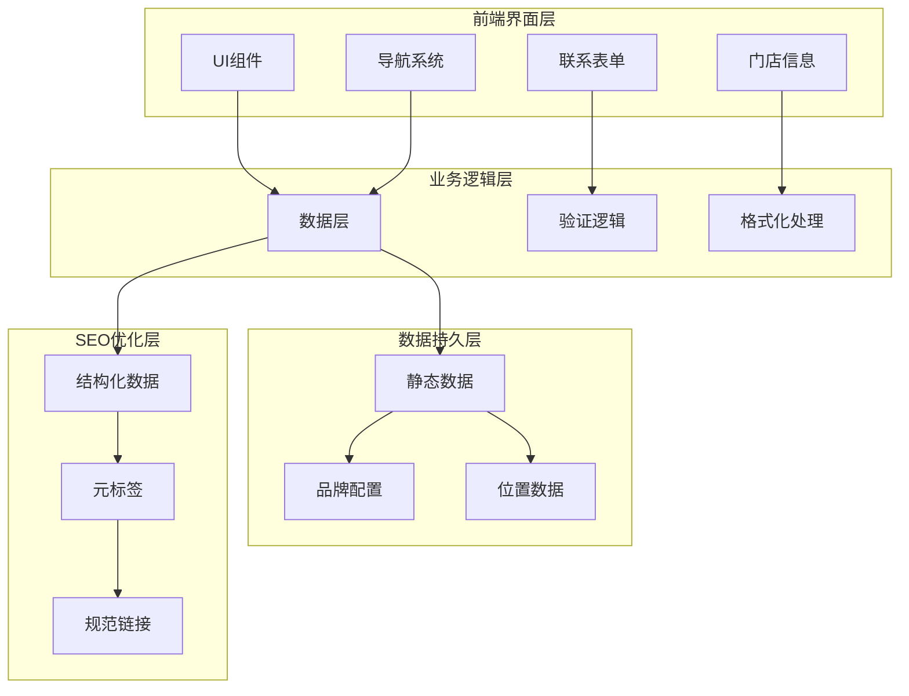
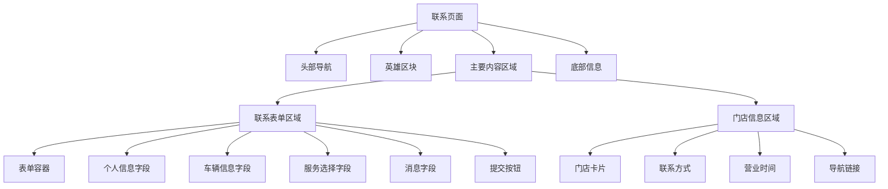
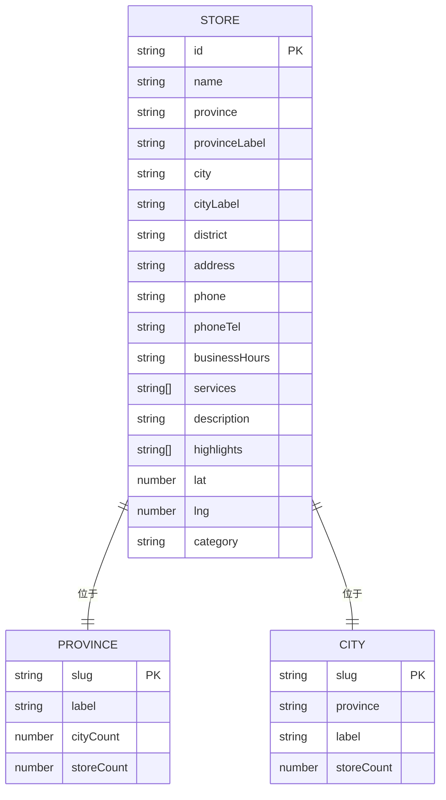
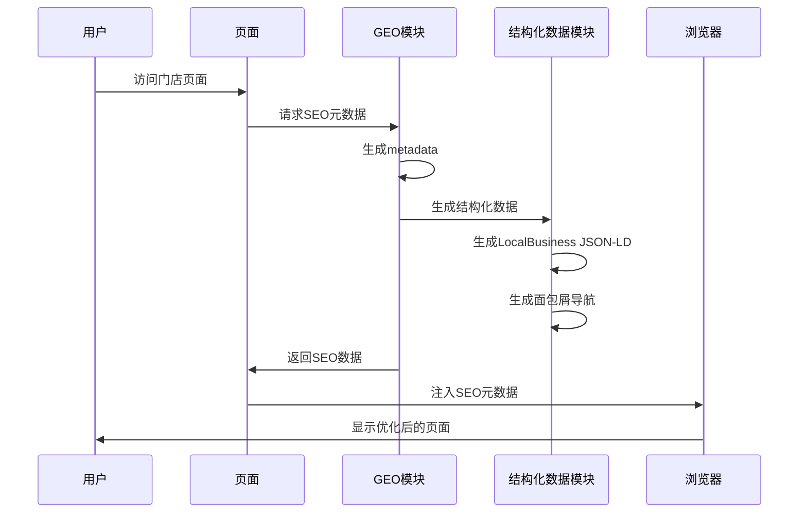
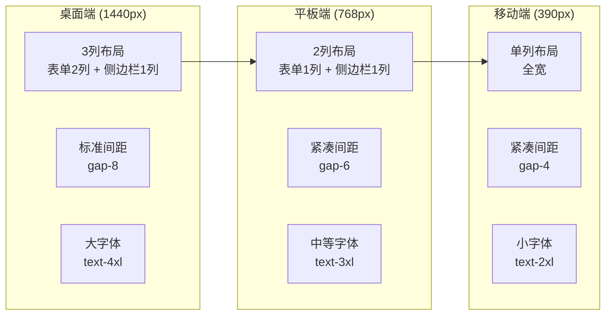
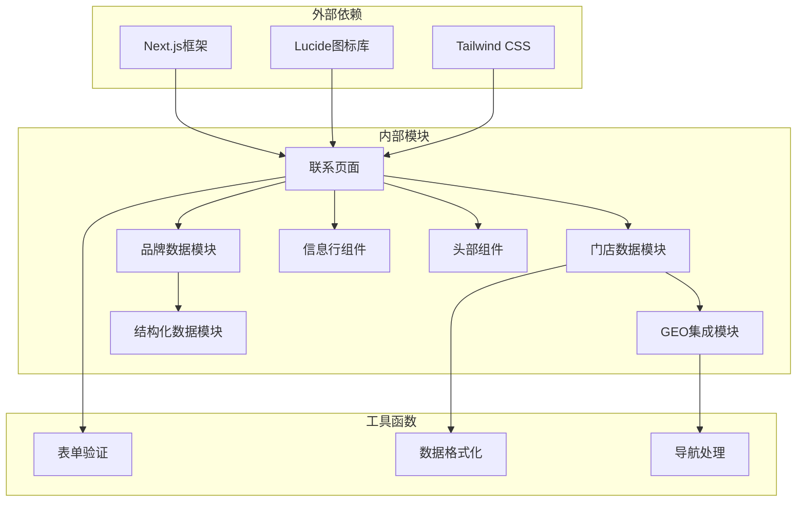

# 联系系统

<cite>
**本文档引用的文件**
- [src/app/contact/page.tsx](file://src/app/contact/page.tsx)
- [src/lib/store.ts](file://src/lib/store.ts)
- [src/lib/brand.ts](file://src/lib/brand.ts)
- [src/components/InfoRow.tsx](file://src/components/InfoRow.tsx)
- [src/lib/geo.ts](file://src/lib/geo.ts)
- [src/lib/schema.ts](file://src/lib/schema.ts)
- [src/app/layout.tsx](file://src/app/layout.tsx)
- [src/app/agent/store/[id]/page.tsx](file://src/app/agent/store/[id]/page.tsx)
- [src/app/agent/page.tsx](file://src/app/agent/page.tsx)
- [src/components/Header.tsx](file://src/components/Header.tsx)
</cite>

## 目录
1. [简介](#简介)
2. [项目结构](#项目结构)
3. [核心组件](#核心组件)
4. [架构概览](#架构概览)
5. [详细组件分析](#详细组件分析)
6. [依赖关系分析](#依赖关系分析)
7. [性能考虑](#性能考虑)
8. [故障排除指南](#故障排除指南)
9. [结论](#结论)
10. [附录](#附录)

## 简介

蓝辉轻改网站的联系系统是一个集成了多门店信息展示、地理位置集成和导航链接的综合联系平台。该系统实现了以下核心功能：

- **多门店信息展示**：通过统一的数据模型管理门店信息，支持地理位置集成和导航链接
- **联系表单设计**：采用静态邮箱提交机制，提供直观的用户交互体验
- **联系方式展示**：整合多种联系方式，包括电话、地址、营业时间等
- **响应式适配**：基于Tailwind CSS实现完整的响应式布局
- **SEO优化**：集成结构化数据和动态元数据生成

## 项目结构

联系系统主要分布在以下目录结构中：

```mermaid
graph TB
subgraph "应用层"
ContactPage[联系页面<br/>src/app/contact/page.tsx]
AgentPage[门店页面<br/>src/app/agent/page.tsx]
StoreDetail[门店详情<br/>src/app/agent/store/[id]/page.tsx]
end
subgraph "数据层"
StoreLib[门店数据<br/>src/lib/store.ts]
BrandLib[品牌数据<br/>src/lib/brand.ts]
GeoLib[GEO模块<br/>src/lib/geo.ts]
SchemaLib[结构化数据<br/>src/lib/schema.ts]
end
subgraph "组件层"
InfoRow[信息行组件<br/>src/components/InfoRow.tsx]
Header[头部组件<br/>src/components/Header.tsx]
end
subgraph "布局层"
Layout[根布局<br/>src/app/layout.tsx]
end
ContactPage --> StoreLib
ContactPage --> BrandLib
ContactPage --> InfoRow
StoreDetail --> GeoLib
AgentPage --> StoreLib
Layout --> SchemaLib
```

**图表来源**
- [src/app/contact/page.tsx:1-250](file://src/app/contact/page.tsx#L1-L250)
- [src/lib/store.ts:1-122](file://src/lib/store.ts#L1-L122)
- [src/lib/geo.ts:1-99](file://src/lib/geo.ts#L1-L99)

**章节来源**
- [src/app/contact/page.tsx:1-250](file://src/app/contact/page.tsx#L1-L250)
- [src/lib/store.ts:1-122](file://src/lib/store.ts#L1-L122)

## 核心组件

### 门店数据模型

联系系统的核心是统一的门店数据模型，定义了完整的门店信息结构：



**图表来源**
- [src/lib/store.ts:8-26](file://src/lib/store.ts#L8-L26)
- [src/lib/store.ts:59-89](file://src/lib/store.ts#L59-L89)

### 联系表单组件

联系表单采用静态邮箱提交机制，提供了完整的用户交互设计：



**图表来源**
- [src/app/contact/page.tsx:63-160](file://src/app/contact/page.tsx#L63-L160)

**章节来源**
- [src/lib/store.ts:28-57](file://src/lib/store.ts#L28-L57)
- [src/app/contact/page.tsx:224-247](file://src/app/contact/page.tsx#L224-L247)

## 架构概览

联系系统的整体架构采用了分层设计模式：



**图表来源**
- [src/app/contact/page.tsx:18-222](file://src/app/contact/page.tsx#L18-L222)
- [src/lib/geo.ts:43-99](file://src/lib/geo.ts#L43-L99)

## 详细组件分析

### 联系页面实现

联系页面是整个联系系统的核心，集成了表单、门店信息展示和导航功能：

#### 页面布局结构



**图表来源**
- [src/app/contact/page.tsx:24-222](file://src/app/contact/page.tsx#L24-L222)

#### 表单字段设计

联系表单包含了完整的用户信息收集字段：

| 字段类型 | 字段名称 | 必填 | 验证规则 | 描述 |
|---------|---------|------|----------|------|
| 文本输入 | 称呼 | 是 | 非空 | 用户姓名 |
| 电话输入 | 联系电话 | 是 | 数字格式 [0-9+\-\s]{6,20} | 手机号码 |
| 文本输入 | 所在城市 | 否 | 可选 | 用户所在城市 |
| 文本输入 | 车型 | 否 | 可选 | 车辆型号 |
| 下拉选择 | 意向服务 | 否 | 预定义选项 | 服务类型选择 |
| 文本域 | 用车场景 | 否 | 可选 | 详细需求描述 |

**章节来源**
- [src/app/contact/page.tsx:63-160](file://src/app/contact/page.tsx#L63-L160)

### 门店数据管理系统

#### 数据模型设计

门店数据采用类型安全的设计，确保数据的一致性和完整性：



**图表来源**
- [src/lib/store.ts:8-26](file://src/lib/store.ts#L8-L26)
- [src/lib/store.ts:59-89](file://src/lib/store.ts#L59-L89)

#### 数据访问方法

系统提供了完整的数据访问接口：

| 方法名 | 参数 | 返回值 | 功能描述 |
|--------|------|--------|----------|
| getStore | id: string | Store \| undefined | 根据ID获取门店信息 |
| getProvince | slug: string | Province \| undefined | 根据省slug获取省信息 |
| getCity | province: string, city: string | City \| undefined | 根据省市区获取城市信息 |
| getStoresByCity | province: string, city: string | Store[] | 获取指定城市的门店列表 |
| getStoresByProvince | province: string | Store[] | 获取指定省的门店列表 |
| getAllStoreIds | 无 | string[] | 获取所有门店ID列表 |

**章节来源**
- [src/lib/store.ts:91-122](file://src/lib/store.ts#L91-L122)

### GEO集成和SEO优化

#### 结构化数据生成

系统集成了完整的SEO优化功能，包括结构化数据和动态元数据：



**图表来源**
- [src/lib/geo.ts:17-99](file://src/lib/geo.ts#L17-L99)
- [src/lib/schema.ts:11-69](file://src/lib/schema.ts#L11-L69)

#### SEO特性实现

| SEO特性 | 实现方式 | 效果 |
|---------|----------|------|
| 动态标题 | generateMetadata函数 | 每页独立标题 |
| 关键词优化 | 动态关键词生成 | 提升搜索排名 |
| 规范链接 | alternates.canonical | 防止重复索引 |
| 结构化数据 | JSON-LD格式 | 增强搜索结果展示 |
| 面包屑导航 | BreadcrumbList | 改善用户体验 |

**章节来源**
- [src/lib/geo.ts:17-99](file://src/lib/geo.ts#L17-L99)
- [src/lib/schema.ts:11-69](file://src/lib/schema.ts#L11-L69)

### 响应式设计实现

联系系统采用了完整的响应式设计策略：



**图表来源**
- [src/app/contact/page.tsx:49-217](file://src/app/contact/page.tsx#L49-L217)

## 依赖关系分析

联系系统的依赖关系体现了清晰的分层架构：



**图表来源**
- [src/app/contact/page.tsx:1-16](file://src/app/contact/page.tsx#L1-L16)
- [src/lib/store.ts:1-6](file://src/lib/store.ts#L1-L6)

### 模块间耦合度分析

| 模块 | 主要依赖 | 内聚性 | 耦合度 | 复杂度 |
|------|----------|--------|--------|--------|
| 联系页面 | StoreLib, BrandLib, InfoRow | 高 | 低 | 中等 |
| 门店数据模块 | 无外部依赖 | 高 | 无 | 低 |
| GEO集成模块 | StoreLib, BrandLib | 中等 | 中等 | 中等 |
| 结构化数据模块 | BrandLib | 高 | 低 | 低 |
| 信息行组件 | LucideIcons | 高 | 无 | 低 |

**章节来源**
- [src/app/contact/page.tsx:12-16](file://src/app/contact/page.tsx#L12-L16)
- [src/lib/store.ts:1-6](file://src/lib/store.ts#L1-L6)

## 性能考虑

### 加载性能优化

联系系统在性能方面采用了多项优化策略：

1. **静态资源优化**
   - 使用Next.js的自动图片优化
   - 图片格式采用WebP和AVIF
   - 实现懒加载和预加载策略

2. **代码分割**
   - 页面级别的代码分割
   - 组件级别的按需加载
   - 减少初始包大小

3. **缓存策略**
   - 浏览器缓存配置
   - CDN加速静态资源
   - API响应缓存

### 用户体验优化

1. **交互反馈**
   - 实时表单验证反馈
   - 加载状态指示器
   - 错误信息友好提示

2. **无障碍访问**
   - 语义化HTML结构
   - 键盘导航支持
   - 屏幕阅读器兼容

## 故障排除指南

### 常见问题诊断

#### 表单提交问题

**问题症状**：点击提交按钮无响应或邮件客户端未打开

**可能原因**：
1. 邮件客户端未正确配置
2. 表单验证规则过于严格
3. 浏览器安全设置阻止弹窗

**解决方案**：
1. 检查邮箱配置是否正确
2. 简化验证规则进行测试
3. 允许弹窗或手动复制邮件内容

#### 门店信息显示异常

**问题症状**：门店地址或联系方式显示为空白

**可能原因**：
1. 门店数据未正确加载
2. 数据格式不匹配
3. API请求失败

**解决方案**：
1. 检查数据源连接
2. 验证数据格式
3. 实现降级显示方案

**章节来源**
- [src/app/contact/page.tsx:63-160](file://src/app/contact/page.tsx#L63-L160)
- [src/lib/store.ts:91-122](file://src/lib/store.ts#L91-L122)

### 调试工具和技巧

1. **浏览器开发者工具**
   - 网络面板检查API请求
   - 控制台查看JavaScript错误
   - 元数据检查SEO效果

2. **性能监控**
   - 使用Lighthouse进行性能评估
   - 监控关键渲染指标
   - 分析用户行为路径

## 结论

蓝辉轻改网站的联系系统展现了现代Web应用的最佳实践：

### 主要成就

1. **架构设计**：采用清晰的分层架构，模块职责明确
2. **用户体验**：提供直观的表单设计和响应式布局
3. **技术实现**：集成SEO优化和结构化数据
4. **扩展性**：模块化设计便于功能扩展

### 技术亮点

- **类型安全**：完整的TypeScript类型定义
- **性能优化**：静态生成和缓存策略
- **SEO友好**：动态元数据和结构化数据
- **响应式设计**：完整的移动端适配

### 改进建议

1. **功能增强**：考虑添加在线预约和实时聊天功能
2. **数据管理**：实现门店数据的动态管理界面
3. **分析集成**：添加用户行为分析和转化跟踪
4. **多语言支持**：扩展国际化功能

## 附录

### 开发指南

#### 新增门店功能

1. **数据模型扩展**
   ```typescript
   // 在store.ts中添加新的门店配置
   export const stores: Store[] = [
     // 现有门店...
     {
       id: "新门店ID",
       name: "新门店名称",
       // 其他属性...
     }
   ];
   ```

2. **路由配置**
   ```typescript
   // 在generateStaticParams中添加新门店
   export function generateStaticParams() {
     return getAllStoreIds().map((id) => ({ id }));
   }
   ```

#### 自定义样式

1. **主题定制**
   - 修改Tailwind配置文件
   - 添加自定义颜色变量
   - 创建响应式断点

2. **组件扩展**
   - 基于现有组件创建新组件
   - 实现一致的样式规范
   - 保持组件复用性

#### API集成

1. **后端API**
   - 实现RESTful API接口
   - 添加数据验证中间件
   - 集成数据库连接

2. **第三方服务**
   - 集成地图服务API
   - 添加分析服务
   - 实现社交媒体分享