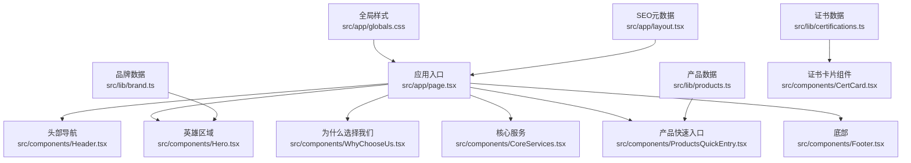
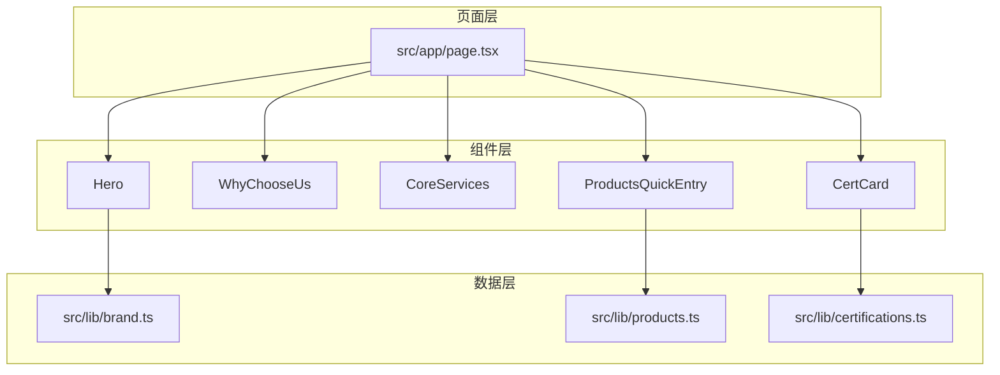
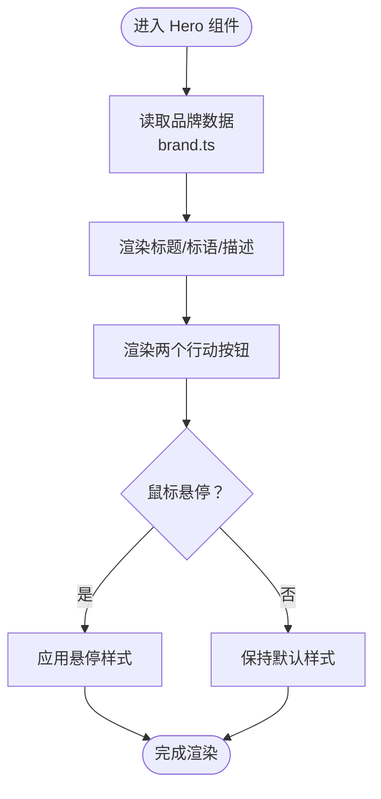
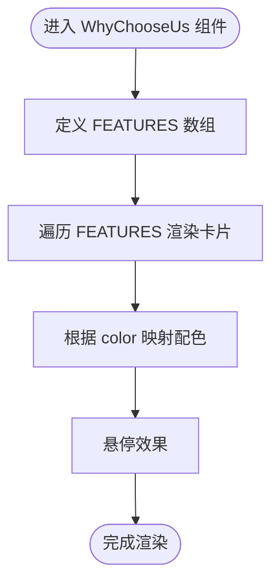
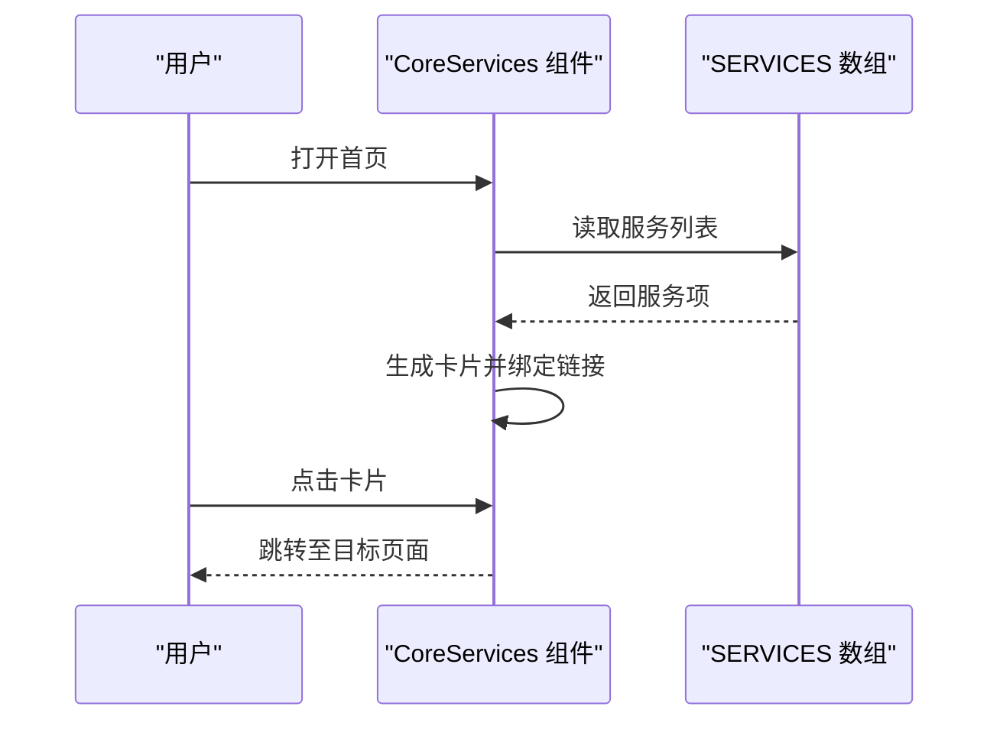
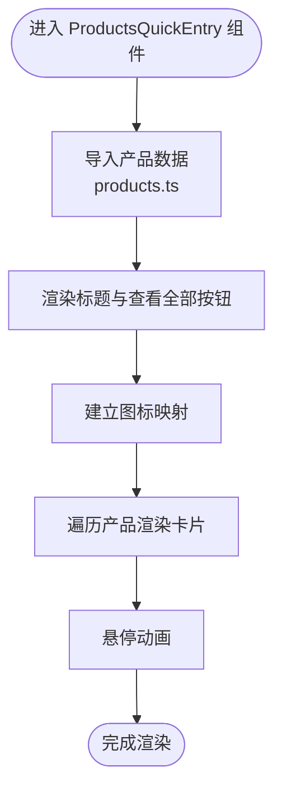
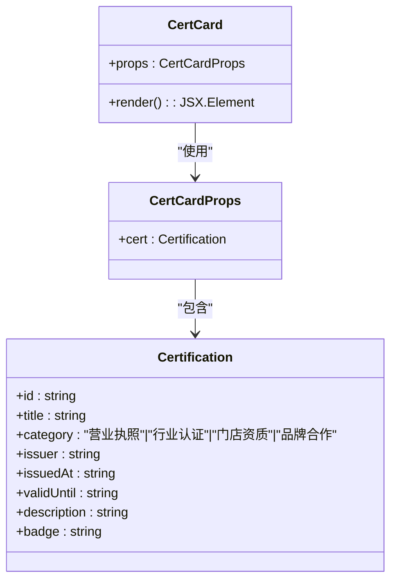
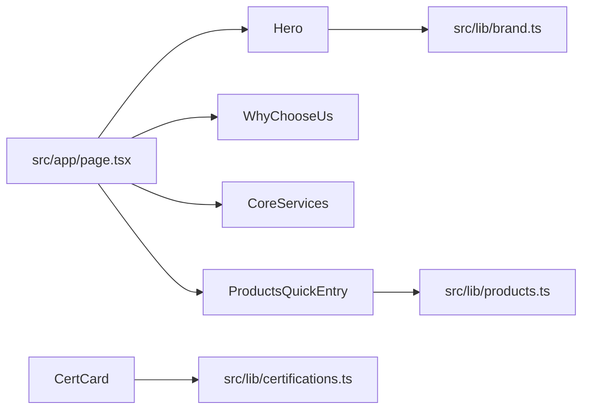

# 首页展示系统

<cite>
**本文档引用的文件**
- [src/app/page.tsx](file://src/app/page.tsx)
- [src/app/layout.tsx](file://src/app/layout.tsx)
- [src/app/globals.css](file://src/app/globals.css)
- [src/components/Hero.tsx](file://src/components/Hero.tsx)
- [src/components/WhyChooseUs.tsx](file://src/components/WhyChooseUs.tsx)
- [src/components/CoreServices.tsx](file://src/components/CoreServices.tsx)
- [src/components/ProductsQuickEntry.tsx](file://src/components/ProductsQuickEntry.tsx)
- [src/components/CertCard.tsx](file://src/components/CertCard.tsx)
- [src/components/ui/button.tsx](file://src/components/ui/button.tsx)
- [src/lib/brand.ts](file://src/lib/brand.ts)
- [src/lib/products.ts](file://src/lib/products.ts)
- [src/lib/certifications.ts](file://src/lib/certifications.ts)
- [src/lib/utils.ts](file://src/lib/utils.ts)
</cite>

## 目录
1. [简介](#简介)
2. [项目结构](#项目结构)
3. [核心组件](#核心组件)
4. [架构总览](#架构总览)
5. [详细组件分析](#详细组件分析)
6. [依赖关系分析](#依赖关系分析)
7. [性能考量](#性能考量)
8. [故障排查指南](#故障排查指南)
9. [结论](#结论)
10. [附录](#附录)

## 简介
本项目为蓝辉轻改（LANHUI）的首页展示系统，围绕“首页五大模块”构建：英雄区域 Hero、为什么选择我们 WhyChooseUs、核心服务 CoreServices、产品快速入口 ProductsQuickEntry、资质证书展示 CertCard。系统采用 Next.js 应用程序路由与 Tailwind CSS 实现响应式布局，通过数据层（lib/*）集中管理品牌、产品与证书信息，确保跨页面一致性与可维护性。

## 项目结构
首页由应用入口页面聚合多个业务组件，配合全局样式与 SEO 元数据配置，形成统一的视觉与语义体验。

**图表来源**
- [src/app/page.tsx:1-22](file://src/app/page.tsx#L1-L22)
- [src/app/layout.tsx:1-32](file://src/app/layout.tsx#L1-L32)
- [src/app/globals.css:1-130](file://src/app/globals.css#L1-L130)
- [src/lib/brand.ts:1-28](file://src/lib/brand.ts#L1-L28)
- [src/lib/products.ts:1-282](file://src/lib/products.ts#L1-L282)
- [src/lib/certifications.ts:1-114](file://src/lib/certifications.ts#L1-L114)

**章节来源**
- [src/app/page.tsx:1-22](file://src/app/page.tsx#L1-L22)
- [src/app/layout.tsx:1-32](file://src/app/layout.tsx#L1-L32)
- [src/app/globals.css:1-130](file://src/app/globals.css#L1-L130)

## 核心组件
- 英雄区域 Hero：以品牌信息为核心，提供产品浏览与门店预约的主行动按钮，强调视觉层次与品牌调性。
- 为什么选择我们 WhyChooseUs：以三要素网格展示品牌价值主张，统一配色体系与图标风格。
- 核心服务 CoreServices：以卡片链接形式呈现三大服务类别，突出渐变背景与交互动效。
- 产品快速入口 ProductsQuickEntry：基于产品数据动态渲染产品卡片，支持分组与图标映射。
- 资质证书展示 CertCard：以卡片形式承载证书信息，采用分类色板与占位视觉元素，便于后续替换真实图片。

**章节来源**
- [src/components/Hero.tsx:1-56](file://src/components/Hero.tsx#L1-L56)
- [src/components/WhyChooseUs.tsx:1-84](file://src/components/WhyChooseUs.tsx#L1-L84)
- [src/components/CoreServices.tsx:1-89](file://src/components/CoreServices.tsx#L1-L89)
- [src/components/ProductsQuickEntry.tsx:1-81](file://src/components/ProductsQuickEntry.tsx#L1-L81)
- [src/components/CertCard.tsx:1-77](file://src/components/CertCard.tsx#L1-L77)

## 架构总览
首页采用“页面聚合 + 组件拆分 + 数据层”的三层架构：
- 页面层：应用入口负责组件编排与布局容器。
- 组件层：各模块组件独立渲染，内部使用图标库与品牌/产品/证书数据。
- 数据层：品牌、产品、证书以只读常量与查询函数形式暴露，便于复用与测试。

**图表来源**
- [src/app/page.tsx:8-21](file://src/app/page.tsx#L8-L21)
- [src/lib/brand.ts:8-25](file://src/lib/brand.ts#L8-L25)
- [src/lib/products.ts:46-251](file://src/lib/products.ts#L46-L251)
- [src/lib/certifications.ts:19-86](file://src/lib/certifications.ts#L19-L86)

## 详细组件分析

### 英雄区域 Hero
- 设计理念
  - 使用深色背景与蓝色/橙色调渐变，营造科技与动感氛围。
  - 品牌中英文标识与标语强化认知，副标题强调服务范围。
  - 主行动按钮提供“浏览产品”和“预约门店”的明确转化路径。
- 交互逻辑
  - 按钮悬停时渐变与阴影变化，提供即时反馈。
  - 地址信息通过品牌数据注入，保证一致性。
- Props 接口
  - 无外部 props，内部通过品牌数据与路由链接渲染。
- 状态管理与数据绑定
  - 依赖品牌数据模块，无本地状态。
- 响应式设计
  - 标题字号、内边距随断点递增，按钮堆叠至水平排列。
- 性能优化
  - 使用静态背景与纯 CSS 渐变，避免额外资源加载。
- SEO 优化
  - 标题与描述在布局元数据中统一设置，利于搜索引擎抓取。

**图表来源**
- [src/components/Hero.tsx:5-56](file://src/components/Hero.tsx#L5-L56)
- [src/lib/brand.ts:8-25](file://src/lib/brand.ts#L8-L25)

**章节来源**
- [src/components/Hero.tsx:1-56](file://src/components/Hero.tsx#L1-L56)
- [src/lib/brand.ts:1-28](file://src/lib/brand.ts#L1-L28)

### 为什么选择我们 WhyChooseUs
- 设计理念
  - 三要素网格体现品牌优势：轻改方案整合、本地门店交付、兼顾颜值与实用。
  - 每个要素使用对应色环、背景与文本色，形成统一的视觉语言。
- 交互逻辑
  - 卡片悬停时边框与阴影变化，增强点击意图。
- Props 接口
  - 无外部 props，内部常量 FEATURES 与 COLOR_MAP 驱动渲染。
- 状态管理与数据绑定
  - 内部静态数据驱动，无本地状态。
- 响应式设计
  - 移动端单列，平板/桌面多列布局，间距随断点调整。
- 性能优化
  - 静态数组渲染，无副作用计算。
- SEO 优化
  - 标题与描述在组件内声明，有助于页面主题表达。

**图表来源**
- [src/components/WhyChooseUs.tsx:3-25](file://src/components/WhyChooseUs.tsx#L3-L25)
- [src/components/WhyChooseUs.tsx:27-43](file://src/components/WhyChooseUs.tsx#L27-L43)
- [src/components/WhyChooseUs.tsx:45-84](file://src/components/WhyChooseUs.tsx#L45-L84)

**章节来源**
- [src/components/WhyChooseUs.tsx:1-84](file://src/components/WhyChooseUs.tsx#L1-L84)

### 核心服务 CoreServices
- 设计理念
  - 三大服务卡片以渐变背景强调主题色，图标直观传达服务类型。
  - 描述文字简洁，引导用户进一步了解。
- 交互逻辑
  - 卡片链接跳转至对应页面；悬停时边框与阴影变化。
- Props 接口
  - 无外部 props，内部常量 SERVICES 与 ACCENT_MAP 驱动渲染。
- 状态管理与数据绑定
  - 内部静态数据驱动，无本地状态。
- 响应式设计
  - 卡片网格随断点扩展，间距与字体大小适配不同屏幕。
- 性能优化
  - 静态数组渲染，无复杂计算。
- SEO 优化
  - 标题与描述在组件内声明，配合布局元数据提升主题相关性。

**图表来源**
- [src/components/CoreServices.tsx:5-30](file://src/components/CoreServices.tsx#L5-L30)
- [src/components/CoreServices.tsx:38-89](file://src/components/CoreServices.tsx#L38-L89)

**章节来源**
- [src/components/CoreServices.tsx:1-89](file://src/components/CoreServices.tsx#L1-L89)

### 产品快速入口 ProductsQuickEntry
- 设计理念
  - 以产品卡片集合展示六大产品方向，支持“查看全部产品”跳转。
  - 分组标识区分“轻改装备”与“汽车膜系”，图标映射增强识别度。
- 交互逻辑
  - 卡片链接跳转至产品详情页；悬停时边框与箭头动画变化。
- Props 接口
  - 外部传入产品数组，内部通过产品分组与图标映射决定样式与内容。
- 状态管理与数据绑定
  - 依赖产品数据模块，无本地状态。
- 响应式设计
  - 卡片网格随断点扩展，移动端堆叠，桌面端三列布局。
- 性能优化
  - 动态渲染产品卡片，按需加载；图标映射减少条件判断。
- SEO 优化
  - 标题与描述在组件内声明，配合布局元数据提升主题相关性。

**图表来源**
- [src/components/ProductsQuickEntry.tsx:15-44](file://src/components/ProductsQuickEntry.tsx#L15-L44)
- [src/components/ProductsQuickEntry.tsx:46-81](file://src/components/ProductsQuickEntry.tsx#L46-L81)
- [src/lib/products.ts:46-251](file://src/lib/products.ts#L46-L251)

**章节来源**
- [src/components/ProductsQuickEntry.tsx:1-81](file://src/components/ProductsQuickEntry.tsx#L1-L81)
- [src/lib/products.ts:1-282](file://src/lib/products.ts#L1-L282)

### 资质证书展示 CertCard
- 设计理念
  - 证书卡片采用占位视觉元素与分类色板，突出颁发方与有效期信息。
  - 通过分类映射实现统一的边框、背景与文本色彩。
- 交互逻辑
  - 卡片悬停时边框变化，增强可点击性。
- Props 接口
  - 接收证书对象 cert，类型来自证书数据模块。
- 状态管理与数据绑定
  - 无本地状态，仅渲染传入数据。
- 响应式设计
  - 卡片采用弹性布局，内容区域随断点适配。
- 性能优化
  - 占位图与重复线性渐变背景，避免额外资源。
- SEO 优化
  - 标题与描述在组件内声明，辅助页面主题表达。

**图表来源**
- [src/components/CertCard.tsx:4-6](file://src/components/CertCard.tsx#L4-L6)
- [src/lib/certifications.ts:8-17](file://src/lib/certifications.ts#L8-L17)

**章节来源**
- [src/components/CertCard.tsx:1-77](file://src/components/CertCard.tsx#L1-L77)
- [src/lib/certifications.ts:1-114](file://src/lib/certifications.ts#L1-L114)

## 依赖关系分析
- 组件间耦合
  - 首页页面聚合所有模块，模块间低耦合，通过数据层解耦。
  - Hero 依赖品牌数据，ProductsQuickEntry 依赖产品数据，CertCard 依赖证书数据。
- 外部依赖
  - 图标库 lucide-react 提供图标；Tailwind CSS 提供原子化样式；Next.js 提供路由与页面渲染。
- 可能的循环依赖
  - 当前结构无循环依赖风险。

**图表来源**
- [src/app/page.tsx:8-21](file://src/app/page.tsx#L8-L21)
- [src/lib/brand.ts:8-25](file://src/lib/brand.ts#L8-L25)
- [src/lib/products.ts:46-251](file://src/lib/products.ts#L46-L251)
- [src/lib/certifications.ts:19-86](file://src/lib/certifications.ts#L19-L86)

**章节来源**
- [src/app/page.tsx:1-22](file://src/app/page.tsx#L1-L22)

## 性能考量
- 渲染层面
  - 静态数据驱动渲染，避免不必要的状态更新与重计算。
  - 使用 CSS 渐变与占位图，减少首屏资源体积。
- 样式层面
  - Tailwind 原子类减少样式冲突，全局样式集中管理，避免重复定义。
- 路由与缓存
  - Next.js 应用程序路由具备内置预渲染与客户端导航能力，提升交互流畅度。
- SEO 与可访问性
  - 布局元数据统一设置标题、描述与关键词；组件内使用语义化标签与可访问性属性（如 aria-*）。

**章节来源**
- [src/app/layout.tsx:4-17](file://src/app/layout.tsx#L4-L17)
- [src/app/globals.css:1-130](file://src/app/globals.css#L1-L130)

## 故障排查指南
- 布局错位
  - 检查断点类名是否正确，确认容器最大宽度与内边距设置。
- 图标未显示
  - 确认 lucide-react 已安装且图标名称拼写正确。
- 数据未渲染
  - 检查数据模块导出是否正确，组件是否正确导入并使用。
- 样式异常
  - 确认 Tailwind 配置已正确引入，未被覆盖或冲突。
- SEO 信息缺失
  - 检查布局元数据是否正确设置，关键词与描述是否符合页面主题。

**章节来源**
- [src/app/layout.tsx:4-17](file://src/app/layout.tsx#L4-L17)
- [src/app/globals.css:1-130](file://src/app/globals.css#L1-L130)

## 结论
首页展示系统通过清晰的模块划分与数据层抽象，实现了品牌信息、服务介绍与产品导航的一体化展示。组件设计遵循统一的视觉语言与交互反馈，配合响应式布局与 SEO 元数据，为用户提供一致、高效且具信任感的首页体验。后续可在此基础上扩展更多业务模块与数据源，保持组件的可复用性与可维护性。

## 附录
- 最佳实践
  - 将品牌、产品、证书等数据集中管理，避免分散硬编码。
  - 使用一致的色板与间距体系，确保跨模块视觉统一。
  - 为关键交互添加微动效，提升用户体验。
- 自定义扩展
  - 新增模块时，遵循“页面聚合 + 组件拆分 + 数据层”的模式。
  - 通过 props 接口与类型约束，确保组件可测试与可演进。
- 响应式设计要点
  - 使用 Tailwind 断点类进行布局切换，优先考虑移动优先策略。
- 性能优化建议
  - 静态数据渲染优先；对动态内容使用懒加载与分页。
  - 合理使用 CSS 动画与过渡，避免过度重绘。
- SEO 优化建议
  - 在布局元数据中设置准确的标题与描述；组件内使用语义化标签与 alt 文本。