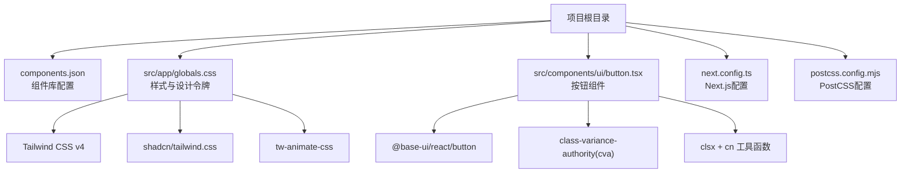
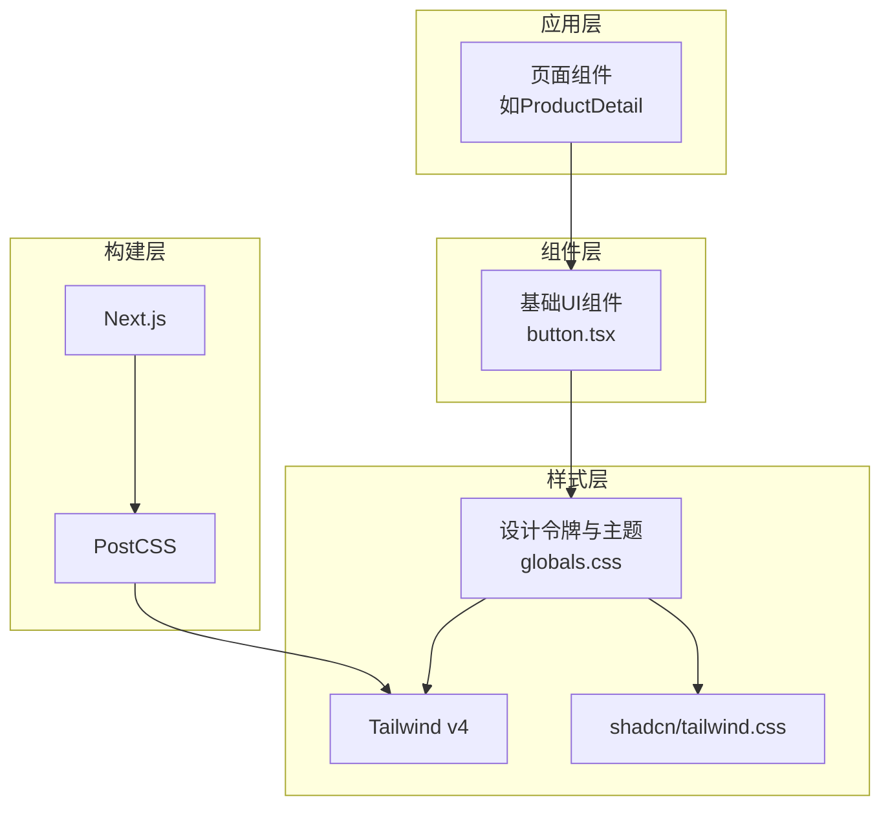
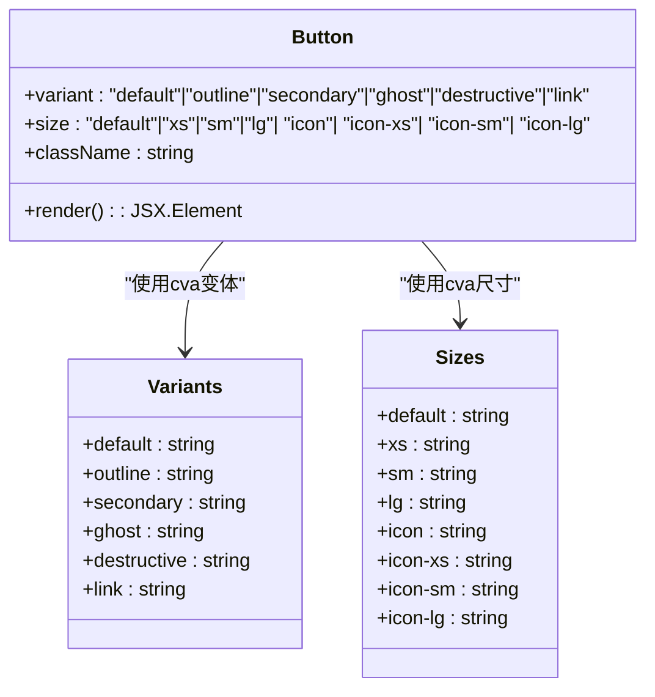
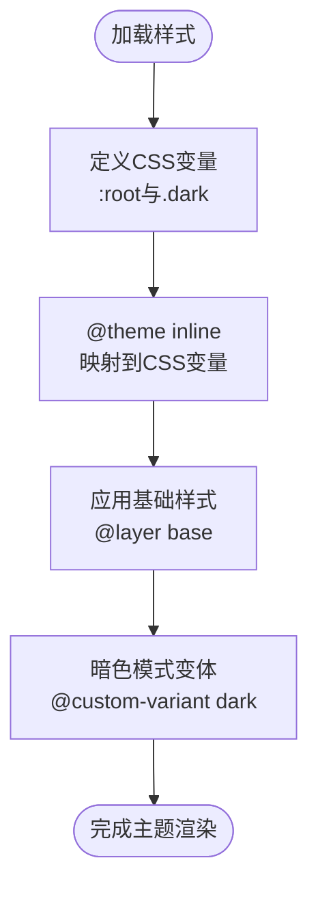
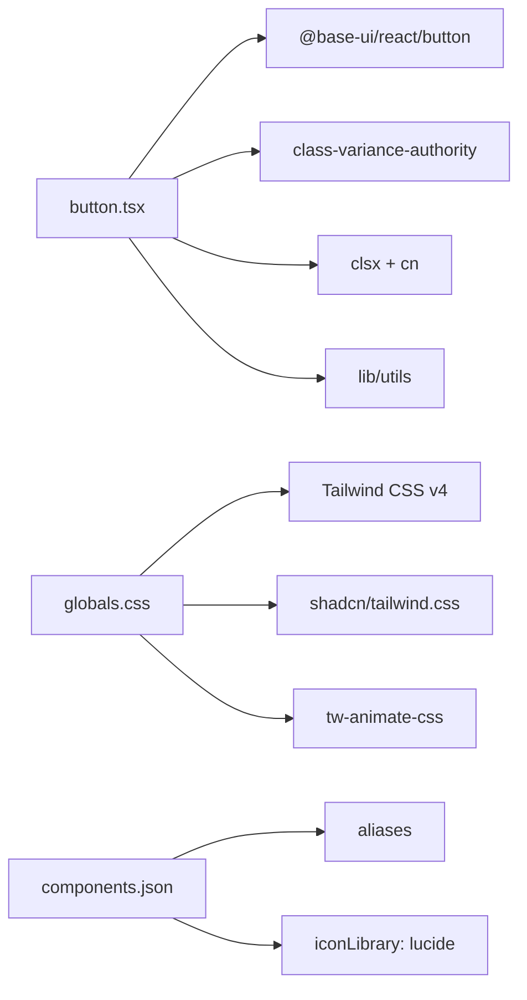

# UI组件库集成

<cite>
**本文档引用的文件**
- [package.json](file://package.json)
- [components.json](file://components.json)
- [src/components/ui/button.tsx](file://src/components/ui/button.tsx)
- [src/app/globals.css](file://src/app/globals.css)
- [next.config.ts](file://next.config.ts)
- [postcss.config.mjs](file://postcss.config.mjs)
- [src/components/ProductDetail.tsx](file://src/components/ProductDetail.tsx)
</cite>

## 目录
1. [简介](#简介)
2. [项目结构](#项目结构)
3. [核心组件](#核心组件)
4. [架构概览](#架构概览)
5. [详细组件分析](#详细组件分析)
6. [依赖分析](#依赖分析)
7. [性能考虑](#性能考虑)
8. [故障排除指南](#故障排除指南)
9. [结论](#结论)
10. [附录](#附录)

## 简介
本文件为蓝辉轻改网站的UI组件库集成创建详细文档，重点围绕shadcn/ui组件库的配置与使用展开。内容涵盖组件库的安装、配置与定制策略，深入解析button组件的实现原理与使用方法（包括变体、尺寸与颜色方案），阐述设计系统原则（设计令牌、主题定制与样式覆盖），并提供可访问性支持、响应式设计与性能优化的最佳实践。同时给出具体的使用场景与扩展自定义建议。

## 项目结构
该项目采用Next.js 16与Tailwind CSS v4构建，集成了shadcn/ui组件库与Base UI基础组件。核心结构如下：
- 组件库配置：通过components.json统一管理组件库风格、Tailwind配置、别名等
- 样式系统：在src/app/globals.css中引入Tailwind、动画库与shadcn/tailwind.css，并定义CSS变量与暗色模式
- 基础组件：src/components/ui目录下提供button等基础UI组件
- 构建配置：next.config.ts设置输出模式；postcss.config.mjs启用Tailwind插件

图表来源
- [components.json:1-26](file://components.json#L1-L26)
- [src/app/globals.css:1-130](file://src/app/globals.css#L1-L130)
- [src/components/ui/button.tsx:1-61](file://src/components/ui/button.tsx#L1-L61)
- [next.config.ts:1-9](file://next.config.ts#L1-L9)
- [postcss.config.mjs:1-8](file://postcss.config.mjs#L1-L8)

章节来源
- [package.json:1-60](file://package.json#L1-L60)
- [components.json:1-26](file://components.json#L1-L26)
- [src/app/globals.css:1-130](file://src/app/globals.css#L1-L130)
- [next.config.ts:1-9](file://next.config.ts#L1-L9)
- [postcss.config.mjs:1-8](file://postcss.config.mjs#L1-L8)

## 核心组件
本项目的核心组件是button，它基于Base UI的Button原生组件，结合class-variance-authority(cva)实现变体与尺寸的组合式样式管理，并通过cn工具函数进行类名合并。该组件支持多种变体（如default、outline、secondary、ghost、destructive、link）与尺寸（default、xs、sm、lg、icon系列等），并内置焦点可见性、禁用状态、错误状态与暗色模式适配等交互细节。

- 变体variants：通过cva定义不同视觉语义的样式集合，如默认(primary)、描边(outline)、次级(secondary)、幽灵(ghost)、破坏性(destructive)与链接(link)
- 尺寸sizes：提供标准(default)与多种紧凑/放大尺寸，以及图标专用尺寸
- 颜色方案：依赖设计令牌（CSS变量）与Tailwind工具类，自动适配明/暗模式
- 可访问性：内置焦点可见性样式与键盘可达性支持
- 性能：使用cva按需生成样式，减少运行时计算开销

章节来源
- [src/components/ui/button.tsx:1-61](file://src/components/ui/button.tsx#L1-L61)

## 架构概览
组件库的整体架构由以下层次构成：
- 组件层：业务组件（如ProductDetail）复用基础UI组件（如Button）
- 基础组件层：src/components/ui下的组件（当前为button），封装样式与行为
- 样式层：src/app/globals.css集中定义设计令牌、主题变量与暗色模式
- 构建层：Next.js与Tailwind v4配合PostCSS插件，确保样式正确注入与编译

图表来源
- [src/components/ProductDetail.tsx:95-131](file://src/components/ProductDetail.tsx#L95-L131)
- [src/components/ui/button.tsx:1-61](file://src/components/ui/button.tsx#L1-L61)
- [src/app/globals.css:1-130](file://src/app/globals.css#L1-L130)
- [next.config.ts:1-9](file://next.config.ts#L1-L9)
- [postcss.config.mjs:1-8](file://postcss.config.mjs#L1-L8)

## 详细组件分析

### Button组件实现与使用
Button组件通过以下机制实现高内聚、低耦合的样式管理：
- 使用Base UI的Button作为原生语义容器，保证可访问性
- 使用cva定义变体与尺寸的样式映射，支持组合与默认值
- 使用cn工具函数合并传入className与cva生成的样式
- 内置焦点可见性、禁用态、错误态与暗色模式适配

图表来源
- [src/components/ui/button.tsx:8-43](file://src/components/ui/button.tsx#L8-L43)

使用场景示例（路径引用而非代码展示）：
- 在产品详情页中使用不同变体与尺寸的按钮，参考路径：[src/components/ProductDetail.tsx:95-131](file://src/components/ProductDetail.tsx#L95-L131)

章节来源
- [src/components/ui/button.tsx:1-61](file://src/components/ui/button.tsx#L1-L61)
- [src/components/ProductDetail.tsx:95-131](file://src/components/ProductDetail.tsx#L95-L131)

### 设计系统与主题定制
设计系统通过CSS变量与Tailwind v4的@theme指令实现：
- 设计令牌：在:root与.dark选择器中定义背景、前景、主色、次色、破坏性、边框、输入、环形光晕等变量
- 主题变量：通过--radius系列变量控制圆角尺度，支持不同断点下的缩放
- 暗色模式：使用@custom-variant dark与CSS变量切换实现明暗适配
- 样式覆盖：通过Tailwind工具类与CSS变量优先级实现局部覆盖

图表来源
- [src/app/globals.css:1-130](file://src/app/globals.css#L1-L130)

章节来源
- [src/app/globals.css:1-130](file://src/app/globals.css#L1-L130)

### 组件库配置与安装
组件库配置集中在components.json中，关键项包括：
- style: "base-nova"（组件库风格）
- rsc: true（支持React Server Components）
- tsx: true（启用TSX）
- tailwind: 配置css入口、基础色、CSS变量开关等
- iconLibrary: "lucide"（图标库）
- aliases: 自定义导入别名（components、ui、lib、hooks）

安装与初始化流程（概念性说明）：
- 安装依赖：确保package.json中包含shadcn相关依赖
- 初始化：执行shadcn命令根据components.json生成或更新组件
- 样式注入：在src/app/globals.css中引入shadcn/tailwind.css
- 构建配置：next.config.ts与postcss.config.mjs确保Tailwind正确工作

章节来源
- [components.json:1-26](file://components.json#L1-L26)
- [package.json:1-60](file://package.json#L1-L60)

## 依赖分析
组件库相关依赖与作用：
- @base-ui/react：提供无障碍语义的原生组件（如Button）
- class-variance-authority：用于定义变体与尺寸的样式映射
- clsx + cn：合并类名，避免重复与冲突
- lucide-react：图标库，与components.json中的iconLibrary保持一致
- shadcn：组件库工具（命令行），用于安装与管理组件
- tailwind-merge：合并Tailwind类名，提升性能
- tw-animate-css：动画库，增强微交互体验

图表来源
- [src/components/ui/button.tsx:1-61](file://src/components/ui/button.tsx#L1-L61)
- [src/app/globals.css:1-130](file://src/app/globals.css#L1-L130)
- [components.json:1-26](file://components.json#L1-L26)

章节来源
- [package.json:1-60](file://package.json#L1-L60)
- [src/components/ui/button.tsx:1-61](file://src/components/ui/button.tsx#L1-L61)
- [src/app/globals.css:1-130](file://src/app/globals.css#L1-L130)
- [components.json:1-26](file://components.json#L1-L26)

## 性能考虑
- 样式生成：cva在构建期生成样式映射，运行时仅做类名拼接，降低计算成本
- 类名合并：使用tailwind-merge与clsx合并类名，避免冗余样式
- 按需加载：组件按需引入，避免全局样式污染
- 动画优化：tw-animate-css提供轻量动画，建议在交互触发时按需启用
- 构建优化：Next.js standalone输出模式减少运行时体积

## 故障排除指南
常见问题与解决思路：
- 样式未生效
  - 检查src/app/globals.css是否正确引入shadcn/tailwind.css
  - 确认components.json中tailwind.css路径与实际文件一致
- 暗色模式不生效
  - 确认:root与.dark选择器中的CSS变量定义完整
  - 检查@custom-variant dark是否正确应用
- 图标显示异常
  - 确认components.json中iconLibrary为"lucide"
  - 检查lucide-react依赖版本兼容性
- 组件变体/尺寸无效
  - 确认cva变体与尺寸键名与调用参数一致
  - 检查className合并逻辑，避免被覆盖

章节来源
- [src/app/globals.css:1-130](file://src/app/globals.css#L1-L130)
- [components.json:1-26](file://components.json#L1-L26)

## 结论
本项目通过shadcn/ui与Tailwind CSS v4实现了高可定制的基础UI组件体系，button组件以cva为核心，结合Base UI与CSS变量，提供了丰富的变体、尺寸与主题适配能力。配合明确的配置文件与构建设置，能够高效地支撑业务组件开发。建议在后续扩展中遵循设计令牌优先、样式最小化与可访问性至上的原则，持续完善组件库生态。

## 附录
- 使用场景参考：产品详情页中的按钮使用，参考路径：[src/components/ProductDetail.tsx:95-131](file://src/components/ProductDetail.tsx#L95-L131)
- 组件配置参考：组件库配置文件，参考路径：[components.json:1-26](file://components.json#L1-L26)
- 样式与主题参考：设计令牌与暗色模式，参考路径：[src/app/globals.css:1-130](file://src/app/globals.css#L1-L130)
- 构建配置参考：Next.js与PostCSS，参考路径：[next.config.ts:1-9](file://next.config.ts#L1-L9)、[postcss.config.mjs:1-8](file://postcss.config.mjs#L1-L8)