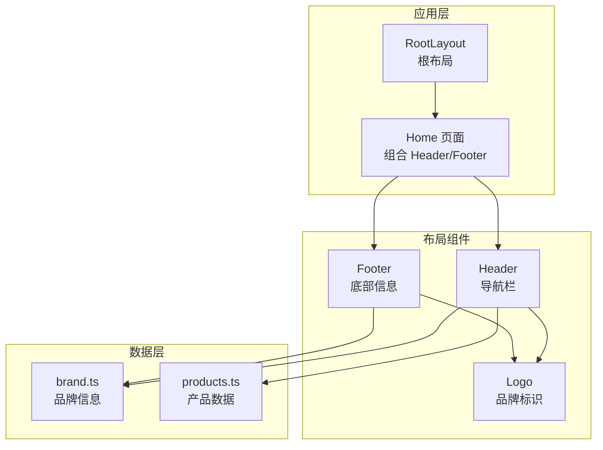
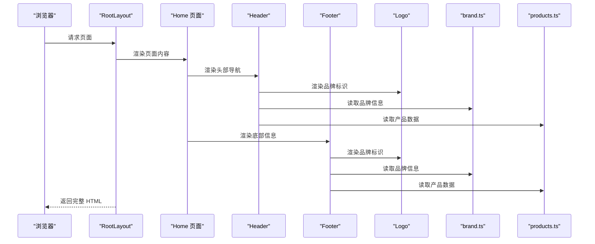
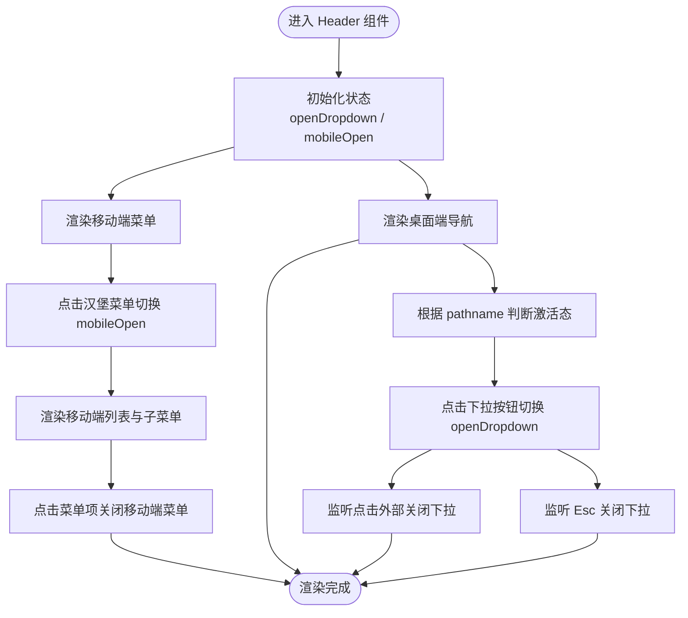
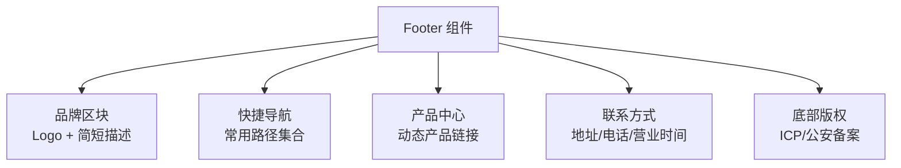
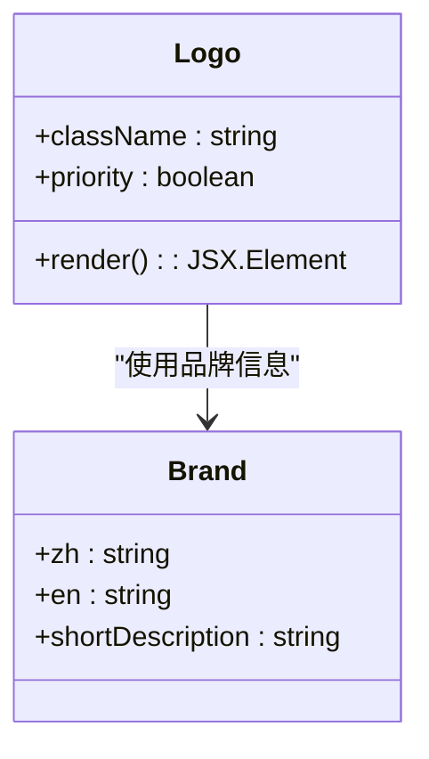
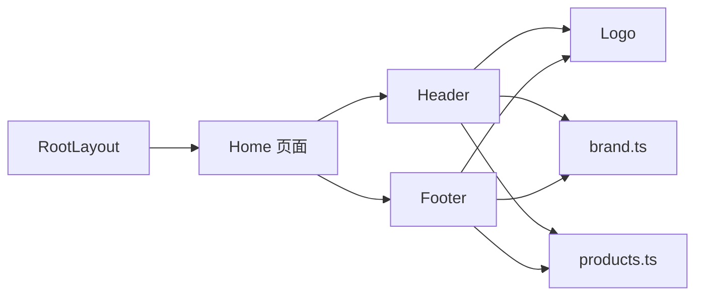

# 布局组件系统

<cite>
**本文档引用的文件**
- [src/components/Header.tsx](file://src/components/Header.tsx)
- [src/components/Footer.tsx](file://src/components/Footer.tsx)
- [src/components/Logo.tsx](file://src/components/Logo.tsx)
- [src/lib/brand.ts](file://src/lib/brand.ts)
- [src/lib/products.ts](file://src/lib/products.ts)
- [src/app/layout.tsx](file://src/app/layout.tsx)
- [src/app/page.tsx](file://src/app/page.tsx)
- [src/app/globals.css](file://src/app/globals.css)
- [src/app/robots.ts](file://src/app/robots.ts)
- [src/app/sitemap.ts](file://src/app/sitemap.ts)
</cite>

## 目录
1. [引言](#引言)
2. [项目结构](#项目结构)
3. [核心组件](#核心组件)
4. [架构概览](#架构概览)
5. [详细组件分析](#详细组件分析)
6. [依赖关系分析](#依赖关系分析)
7. [性能考量](#性能考量)
8. [故障排除指南](#故障排除指南)
9. [结论](#结论)
10. [附录](#附录)

## 引言
本文件系统性地梳理蓝辉轻改网站的布局组件体系，重点覆盖 Header 头部导航、Footer 底部信息与 Logo 品牌标识三大核心组件。文档从设计与实现角度深入解析：
- 导航组件的响应式设计与移动端适配策略
- Footer 组件的信息架构与链接组织方式
- Logo 组件的品牌一致性维护与多尺寸适配
- 组件的状态管理、路由集成与用户交互处理
- 可访问性支持与 SEO 优化考虑
- 布局组件的使用示例、集成方法与定制扩展指南

## 项目结构
布局组件位于 `src/components` 目录，品牌与产品数据位于 `src/lib` 目录，页面级布局与全局样式位于 `src/app` 目录。整体采用 Next.js App Router 的目录结构，Header/Footer/Logo 在页面中被组合使用，形成统一的品牌视觉与导航体验。

**图表来源**
- [src/app/layout.tsx:20-38](file://src/app/layout.tsx#L20-L38)
- [src/app/page.tsx:8-21](file://src/app/page.tsx#L8-L21)
- [src/components/Header.tsx:44-249](file://src/components/Header.tsx#L44-L249)
- [src/components/Footer.tsx:18-112](file://src/components/Footer.tsx#L18-L112)
- [src/components/Logo.tsx:20-31](file://src/components/Logo.tsx#L20-L31)
- [src/lib/brand.ts:8-25](file://src/lib/brand.ts#L8-L25)
- [src/lib/products.ts:46-251](file://src/lib/products.ts#L46-L251)

**章节来源**
- [src/app/layout.tsx:20-38](file://src/app/layout.tsx#L20-L38)
- [src/app/page.tsx:8-21](file://src/app/page.tsx#L8-L21)
- [src/components/Header.tsx:44-249](file://src/components/Header.tsx#L44-L249)
- [src/components/Footer.tsx:18-112](file://src/components/Footer.tsx#L18-L112)
- [src/components/Logo.tsx:20-31](file://src/components/Logo.tsx#L20-L31)
- [src/lib/brand.ts:8-25](file://src/lib/brand.ts#L8-L25)
- [src/lib/products.ts:46-251](file://src/lib/products.ts#L46-L251)

## 核心组件
本节概述三大布局组件的核心职责与协作关系：
- Header：负责主导航、下拉子菜单、桌面端与移动端菜单切换、预约入口等
- Footer：负责品牌信息、快捷导航、产品中心链接、联系方式与版权信息
- Logo：负责品牌标识渲染与多尺寸适配，确保在不同场景下的 LCP 优化

关键特性：
- 响应式断点：桌面端（md 及以上）显示完整导航，移动端（md 以下）折叠为汉堡菜单
- 路由集成：基于 Next.js 的 usePathname 判断当前激活状态，支持 matchPrefix 前缀匹配
- 可访问性：为导航、按钮、下拉菜单提供 aria-* 属性
- SEO：根布局注入结构化数据，页面元数据与 sitemap、robots 配置完善

**章节来源**
- [src/components/Header.tsx:44-249](file://src/components/Header.tsx#L44-L249)
- [src/components/Footer.tsx:18-112](file://src/components/Footer.tsx#L18-L112)
- [src/components/Logo.tsx:20-31](file://src/components/Logo.tsx#L20-L31)
- [src/app/layout.tsx:5-18](file://src/app/layout.tsx#L5-L18)

## 架构概览
下图展示布局组件在页面中的装配关系与数据流向：

**图表来源**
- [src/app/layout.tsx:20-38](file://src/app/layout.tsx#L20-L38)
- [src/app/page.tsx:8-21](file://src/app/page.tsx#L8-L21)
- [src/components/Header.tsx:44-249](file://src/components/Header.tsx#L44-L249)
- [src/components/Footer.tsx:18-112](file://src/components/Footer.tsx#L18-L112)
- [src/components/Logo.tsx:20-31](file://src/components/Logo.tsx#L20-L31)
- [src/lib/brand.ts:8-25](file://src/lib/brand.ts#L8-L25)
- [src/lib/products.ts:46-251](file://src/lib/products.ts#L46-L251)

## 详细组件分析

### Header 头部导航组件
Header 是页面的主导航容器，承担品牌标识展示、主导航项、下拉菜单、移动端菜单与预约入口等功能。其设计遵循以下原则：
- 激活态判断：通过 usePathname 与 matchPrefix 实现精确或前缀匹配的导航高亮
- 下拉菜单：支持带子菜单的导航项，点击外部区域或按下 Esc 键自动关闭
- 移动端适配：汉堡菜单切换，子菜单以可展开的 MobileDropdown 形式呈现
- 可访问性：为导航、按钮、下拉菜单设置 aria-label、aria-haspopup、aria-expanded 等属性
- 性能优化：Logo 设置 priority 以提升首屏 LCP；导航使用受控状态减少重渲染

**图表来源**
- [src/components/Header.tsx:44-249](file://src/components/Header.tsx#L44-L249)

**章节来源**
- [src/components/Header.tsx:44-249](file://src/components/Header.tsx#L44-L249)

### Footer 底部信息组件
Footer 提供品牌信息、快捷导航、产品中心链接与联系方式四大区块，并在底部展示版权与备案信息。其信息架构与组织方式如下：
- 品牌区块：Logo + 简短描述，统一品牌调性
- 快捷导航：首页、产品中心、门店服务、品牌介绍、资讯与预约入口
- 产品中心：动态读取产品数据生成链接，保证与产品页一致
- 联系方式：地址、电话、营业时间，配合图标增强可读性
- 版权信息：ICP 与公安备案信息分段展示

**图表来源**
- [src/components/Footer.tsx:18-112](file://src/components/Footer.tsx#L18-L112)

**章节来源**
- [src/components/Footer.tsx:18-112](file://src/components/Footer.tsx#L18-L112)

### Logo 品牌标识组件
Logo 组件负责品牌标识的渲染与多尺寸适配，确保在不同场景下的视觉一致性与性能表现：
- 多尺寸适配：基于固定宽高比（约 3:1），通过 className 控制高度，宽度自动适配
- LCP 优化：支持 priority 参数标记首屏关键元素，提升首屏加载性能
- 品牌一致性：统一使用品牌配置中的中英文名称作为 alt 文本，确保可访问性与 SEO

**图表来源**
- [src/components/Logo.tsx:20-31](file://src/components/Logo.tsx#L20-L31)
- [src/lib/brand.ts:8-25](file://src/lib/brand.ts#L8-L25)

**章节来源**
- [src/components/Logo.tsx:20-31](file://src/components/Logo.tsx#L20-L31)
- [src/lib/brand.ts:8-25](file://src/lib/brand.ts#L8-L25)

## 依赖关系分析
布局组件之间的依赖关系与数据流向如下：
- Header 依赖 Logo、brand.ts、products.ts，用于渲染导航与产品链接
- Footer 依赖 Logo、brand.ts、products.ts，用于渲染品牌信息与产品链接
- 页面层通过 RootLayout 注入结构化数据，页面组合 Header/Footer

**图表来源**
- [src/components/Header.tsx:44-249](file://src/components/Header.tsx#L44-L249)
- [src/components/Footer.tsx:18-112](file://src/components/Footer.tsx#L18-L112)
- [src/components/Logo.tsx:20-31](file://src/components/Logo.tsx#L20-L31)
- [src/lib/brand.ts:8-25](file://src/lib/brand.ts#L8-L25)
- [src/lib/products.ts:46-251](file://src/lib/products.ts#L46-L251)
- [src/app/page.tsx:8-21](file://src/app/page.tsx#L8-L21)
- [src/app/layout.tsx:20-38](file://src/app/layout.tsx#L20-L38)

**章节来源**
- [src/components/Header.tsx:44-249](file://src/components/Header.tsx#L44-L249)
- [src/components/Footer.tsx:18-112](file://src/components/Footer.tsx#L18-L112)
- [src/components/Logo.tsx:20-31](file://src/components/Logo.tsx#L20-L31)
- [src/lib/brand.ts:8-25](file://src/lib/brand.ts#L8-L25)
- [src/lib/products.ts:46-251](file://src/lib/products.ts#L46-L251)
- [src/app/page.tsx:8-21](file://src/app/page.tsx#L8-L21)
- [src/app/layout.tsx:20-38](file://src/app/layout.tsx#L20-L38)

## 性能考量
- 首屏优化：Header 中的 Logo 使用 priority，提升 LCP 表现
- 渲染优化：导航与下拉菜单使用受控状态，避免不必要的重渲染
- 图片优化：Logo 使用 Next.js Image，自动进行尺寸与格式优化
- 样式优化：全局 CSS 使用 Tailwind 与自定义变量，减少重复样式

**章节来源**
- [src/components/Header.tsx:85-90](file://src/components/Header.tsx#L85-L90)
- [src/components/Logo.tsx:22-29](file://src/components/Logo.tsx#L22-L29)
- [src/app/globals.css:1-130](file://src/app/globals.css#L1-L130)

## 故障排除指南
- 导航激活态异常：检查 usePathname 返回值与 matchPrefix 配置是否正确
- 下拉菜单无法关闭：确认监听事件是否正确绑定与解绑，Esc 键事件是否生效
- 移动端菜单不显示：检查 mobileOpen 状态切换逻辑与断点条件
- Logo 显示异常：确认图片路径与宽高比，检查 className 对高度的影响
- SEO 数据缺失：确认 RootLayout 中结构化数据注入与页面元数据配置

**章节来源**
- [src/components/Header.tsx:50-78](file://src/components/Header.tsx#L50-L78)
- [src/components/Logo.tsx:22-29](file://src/components/Logo.tsx#L22-L29)
- [src/app/layout.tsx:28-33](file://src/app/layout.tsx#L28-L33)

## 结论
蓝辉轻改的布局组件系统以 Header、Footer、Logo 为核心，结合品牌与产品数据，实现了统一的品牌视觉、清晰的信息架构与良好的用户体验。通过响应式设计、可访问性支持与 SEO 优化，组件在不同设备与场景下均能稳定运行。未来可在导航层级扩展、多语言支持与主题切换等方面进一步增强。

## 附录

### 使用示例与集成方法
- 在页面中引入 Header 与 Footer 并组合使用
- 在需要突出品牌标识的场景（如头部）传入 priority
- 通过品牌配置与产品数据动态生成导航与链接

**章节来源**
- [src/app/page.tsx:8-21](file://src/app/page.tsx#L8-L21)
- [src/components/Header.tsx:85-90](file://src/components/Header.tsx#L85-L90)
- [src/components/Footer.tsx:26-35](file://src/components/Footer.tsx#L26-L35)

### 组件状态管理与路由集成
- 使用 usePathname 判断当前路由，结合 matchPrefix 实现前缀匹配
- 使用 useState 管理下拉菜单与移动端菜单的开关状态
- 通过 Link 组件实现页面内跳转，保持 SPA 体验

**章节来源**
- [src/components/Header.tsx:48-55](file://src/components/Header.tsx#L48-L55)
- [src/components/Header.tsx:46-47](file://src/components/Header.tsx#L46-L47)

### 用户交互处理
- 桌面端：鼠标悬停与点击切换下拉菜单；点击外部区域或按 Esc 关闭
- 移动端：汉堡菜单切换；子菜单可展开/收起

**章节来源**
- [src/components/Header.tsx:62-78](file://src/components/Header.tsx#L62-L78)
- [src/components/Header.tsx:251-291](file://src/components/Header.tsx#L251-L291)

### 可访问性支持
- 为导航与按钮提供 aria-label、aria-haspopup、aria-expanded 等属性
- 语义化标签与键盘可操作性保障

**章节来源**
- [src/components/Header.tsx:97-127](file://src/components/Header.tsx#L97-L127)
- [src/components/Footer.tsx:26-31](file://src/components/Footer.tsx#L26-L31)

### SEO 优化考虑
- 页面元数据：标题、描述、关键词、Open Graph
- 结构化数据：根布局注入 organizationSchema
- 站点地图与 robots：动态生成 sitemap，配置 robots 规则

**章节来源**
- [src/app/layout.tsx:5-18](file://src/app/layout.tsx#L5-L18)
- [src/app/layout.tsx:28-33](file://src/app/layout.tsx#L28-L33)
- [src/app/robots.ts:4-16](file://src/app/robots.ts#L4-L16)
- [src/app/sitemap.ts:17-123](file://src/app/sitemap.ts#L17-L123)

### 定制与扩展指南
- 自定义导航：在 NAV_ITEMS 中添加或修改导航项，支持 children 与 matchPrefix
- 品牌信息：在 brand.ts 中更新品牌名称、联系方式与描述
- 产品链接：在 products.ts 中新增产品，自动同步至 Header 与 Footer
- 样式扩展：通过 className 与 Tailwind 类名调整尺寸与外观

**章节来源**
- [src/components/Header.tsx:19-42](file://src/components/Header.tsx#L19-L42)
- [src/lib/brand.ts:8-25](file://src/lib/brand.ts#L8-L25)
- [src/lib/products.ts:46-251](file://src/lib/products.ts#L46-L251)
- [src/app/globals.css:1-130](file://src/app/globals.css#L1-L130)