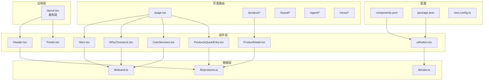
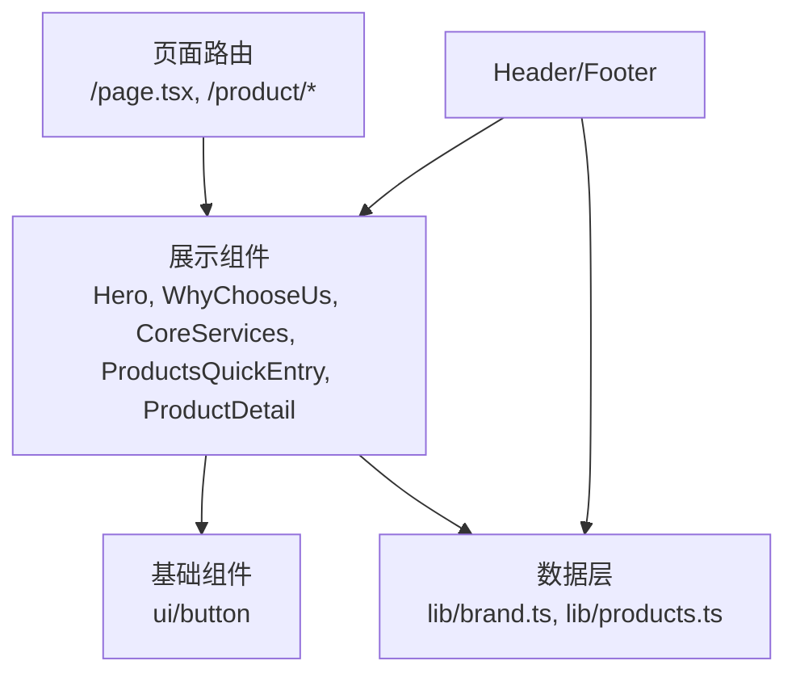
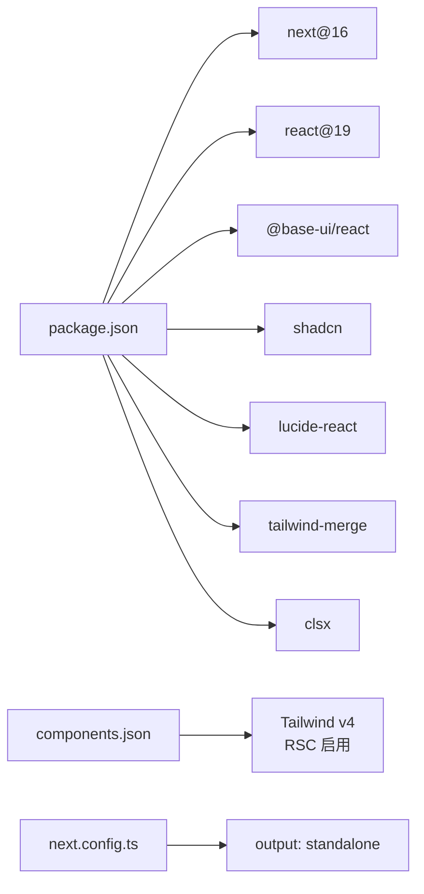
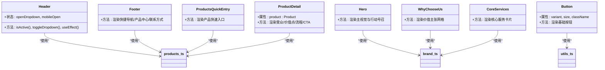

# 组件系统

<cite>
**本文档引用的文件**
- [Hero.tsx](file://src/components/Hero.tsx)
- [WhyChooseUs.tsx](file://src/components/WhyChooseUs.tsx)
- [CoreServices.tsx](file://src/components/CoreServices.tsx)
- [ProductsQuickEntry.tsx](file://src/components/ProductsQuickEntry.tsx)
- [ProductDetail.tsx](file://src/components/ProductDetail.tsx)
- [Header.tsx](file://src/components/Header.tsx)
- [Footer.tsx](file://src/components/Footer.tsx)
- [button.tsx](file://src/components/ui/button.tsx)
- [brand.ts](file://src/lib/brand.ts)
- [products.ts](file://src/lib/products.ts)
- [utils.ts](file://src/lib/utils.ts)
- [layout.tsx](file://src/app/layout.tsx)
- [components.json](file://components.json)
- [package.json](file://package.json)
- [next.config.ts](file://next.config.ts)
</cite>

## 目录
1. [引言](#引言)
2. [项目结构](#项目结构)
3. [核心组件](#核心组件)
4. [架构总览](#架构总览)
5. [组件详解](#组件详解)
6. [依赖关系分析](#依赖关系分析)
7. [性能考量](#性能考量)
8. [故障排查指南](#故障排查指南)
9. [结论](#结论)
10. [附录](#附录)

## 引言
本文件面向蓝辉轻改网站的组件系统，基于 React 19 与 Next.js 16 的技术栈，系统化梳理组件化架构设计、组织结构与命名规范；详解 shadcn/ui 组件库的使用与定制策略；深入剖析自定义组件如 Hero、WhyChooseUs、CoreServices 等的核心实现；提供 Props 接口、事件与状态管理、组件复用最佳实践、性能优化与无障碍支持建议，并给出组件间通信与数据传递策略，帮助开发者理解并高效扩展组件系统。

## 项目结构
项目采用“按功能域分层 + 组件目录”的组织方式：
- 页面级应用位于 src/app 下，采用 App Router 结构，根布局负责全局样式与元数据。
- 自定义 UI 组件集中在 src/components，其中 src/components/ui 提供基于 Base UI 的变体按钮等基础组件。
- 数据与业务逻辑集中在 src/lib，如品牌信息、产品数据、工具函数等。
- 组件库配置与主题由 components.json 管理，Tailwind v4 与 RSC 开启。

图表来源
- [layout.tsx:1-32](file://src/app/layout.tsx#L1-L32)
- [Header.tsx:1-292](file://src/components/Header.tsx#L1-L292)
- [Footer.tsx:1-113](file://src/components/Footer.tsx#L1-L113)
- [Hero.tsx:1-56](file://src/components/Hero.tsx#L1-L56)
- [WhyChooseUs.tsx:1-84](file://src/components/WhyChooseUs.tsx#L1-L84)
- [CoreServices.tsx:1-89](file://src/components/CoreServices.tsx#L1-L89)
- [ProductsQuickEntry.tsx:1-81](file://src/components/ProductsQuickEntry.tsx#L1-L81)
- [ProductDetail.tsx:1-184](file://src/components/ProductDetail.tsx#L1-L184)
- [button.tsx:1-61](file://src/components/ui/button.tsx#L1-L61)
- [brand.ts:1-28](file://src/lib/brand.ts#L1-L28)
- [products.ts:1-282](file://src/lib/products.ts#L1-L282)
- [utils.ts:1-7](file://src/lib/utils.ts#L1-L7)
- [components.json:1-26](file://components.json#L1-L26)
- [package.json:1-60](file://package.json#L1-L60)
- [next.config.ts:1-9](file://next.config.ts#L1-L9)

章节来源
- [layout.tsx:1-32](file://src/app/layout.tsx#L1-L32)
- [components.json:1-26](file://components.json#L1-L26)
- [package.json:1-60](file://package.json#L1-L60)
- [next.config.ts:1-9](file://next.config.ts#L1-L9)

## 核心组件
本节概述关键展示组件的职责与交互模式：
- Hero：首页头部主视觉，承载品牌标语、行动号召与门店预约入口。
- WhyChooseUs：价值主张网格，强调轻改整合、本地交付与颜值与实用兼顾。
- CoreServices：核心服务卡片网格，涵盖轻改装备、汽车膜系与线下门店。
- ProductsQuickEntry：产品快速入口，聚合六大产品方向，引导到详情页。
- ProductDetail：产品详情页容器，按产品类型渲染受众、价值点、服务流程与预约 CTA。
- Header/Footer：导航与页脚，提供移动端响应式菜单、品牌信息与快捷导航。
- ui/button：基于 Base UI 的按钮变体组件，支持多种尺寸与风格变体。

章节来源
- [Hero.tsx:1-56](file://src/components/Hero.tsx#L1-L56)
- [WhyChooseUs.tsx:1-84](file://src/components/WhyChooseUs.tsx#L1-L84)
- [CoreServices.tsx:1-89](file://src/components/CoreServices.tsx#L1-L89)
- [ProductsQuickEntry.tsx:1-81](file://src/components/ProductsQuickEntry.tsx#L1-L81)
- [ProductDetail.tsx:1-184](file://src/components/ProductDetail.tsx#L1-L184)
- [Header.tsx:1-292](file://src/components/Header.tsx#L1-L292)
- [Footer.tsx:1-113](file://src/components/Footer.tsx#L1-L113)
- [button.tsx:1-61](file://src/components/ui/button.tsx#L1-L61)

## 架构总览
组件系统遵循“页面驱动 + 展示组件 + 基础组件 + 数据层”的分层架构：
- 页面路由负责数据加载与页面级布局，展示组件负责内容区块，基础组件提供通用交互与样式能力，数据层提供品牌与产品等静态/动态数据。
- 组件间通过 props 与数据层进行解耦，Header 与 Footer 在多页面复用，Hero/WhyChooseUs/CoreServices 在首页组合使用，ProductDetail 作为产品详情页的容器组件。

图表来源
- [Hero.tsx:1-56](file://src/components/Hero.tsx#L1-L56)
- [WhyChooseUs.tsx:1-84](file://src/components/WhyChooseUs.tsx#L1-L84)
- [CoreServices.tsx:1-89](file://src/components/CoreServices.tsx#L1-L89)
- [ProductsQuickEntry.tsx:1-81](file://src/components/ProductsQuickEntry.tsx#L1-L81)
- [ProductDetail.tsx:1-184](file://src/components/ProductDetail.tsx#L1-L184)
- [Header.tsx:1-292](file://src/components/Header.tsx#L1-L292)
- [Footer.tsx:1-113](file://src/components/Footer.tsx#L1-L113)
- [brand.ts:1-28](file://src/lib/brand.ts#L1-L28)
- [products.ts:1-282](file://src/lib/products.ts#L1-L282)
- [button.tsx:1-61](file://src/components/ui/button.tsx#L1-L61)

## 组件详解

### Hero 组件
- 角色：首页主视觉区块，传达品牌与服务定位，提供“浏览产品”“预约门店”两类行动号召。
- 关键实现要点：
  - 使用渐变背景与装饰圆环营造科技感与层次。
  - 通过品牌数据模块注入品牌中英文名与标语。
  - 使用 Link 组件实现内部路由跳转，配合图标与悬停动画增强交互。
- Props 与事件：无外部 Props；内部通过 Link 处理点击导航。
- 状态管理：无内部状态，纯展示组件。
- 可访问性：为背景元素设置 aria-hidden，为品牌链接提供 aria-label。

章节来源
- [Hero.tsx:1-56](file://src/components/Hero.tsx#L1-L56)
- [brand.ts:1-28](file://src/lib/brand.ts#L1-L28)

### WhyChooseUs 组件
- 角色：价值主张网格，三列展示“轻改整合、本地交付、兼顾颜值与实用”三大优势。
- 关键实现要点：
  - FEATURES 定义图标、标题、描述与色彩标识；COLOR_MAP 将色彩映射为边框、背景与文字色。
  - 使用循环渲染网格项，hover 效果与过渡动画提升交互体验。
- Props 与事件：无外部 Props；内部通过 Link 处理导航。
- 状态管理：无内部状态，纯展示组件。
- 可访问性：为网格容器提供语义化标题与段落。

章节来源
- [WhyChooseUs.tsx:1-84](file://src/components/WhyChooseUs.tsx#L1-L84)

### CoreServices 组件
- 角色：核心服务卡片网格，展示“轻改装备、汽车膜系、线下门店”三大板块。
- 关键实现要点：
  - SERVICES 定义图标、标题、描述、跳转链接与强调色；ACCENT_MAP 将强调色映射为渐变与边框。
  - Link 包裹卡片，hover 时展示阴影与过渡动画；底部尾注说明门店现状。
- Props 与事件：无外部 Props；内部通过 Link 处理导航。
- 状态管理：无内部状态，纯展示组件。
- 可访问性：为卡片提供语义化标题与描述。

章节来源
- [CoreServices.tsx:1-89](file://src/components/CoreServices.tsx#L1-L89)
- [brand.ts:1-28](file://src/lib/brand.ts#L1-L28)

### ProductsQuickEntry 组件
- 角色：产品快速入口，聚合六大产品方向，引导用户到详情页。
- 关键实现要点：
  - ICON_MAP 将产品 slug 映射到对应图标；ProductCard 渲染单个产品卡片，根据产品类型决定强调色。
  - 通过 Link 实现到产品详情页的导航。
- Props 与事件：接收产品数组；内部通过 Link 处理导航。
- 状态管理：无内部状态，纯展示组件。
- 可访问性：为链接提供明确文本与 hover 状态反馈。

章节来源
- [ProductsQuickEntry.tsx:1-81](file://src/components/ProductsQuickEntry.tsx#L1-L81)
- [products.ts:1-282](file://src/lib/products.ts#L1-L282)

### ProductDetail 组件
- 角色：产品详情页容器，按产品类型渲染受众、核心价值、服务流程与预约 CTA。
- 关键实现要点：
  - 根据产品组别动态选择强调色与渐变；渲染面包屑、标题、标语高亮、受众、价值点、流程与预约 CTA。
  - 通过 Link 实现到预约页的导航。
- Props 与事件：接收 Product 类型的 props；内部通过 Link 处理导航。
- 状态管理：无内部状态，纯展示组件。
- 可访问性：为各区块提供语义化标题与清晰的列表结构。

章节来源
- [ProductDetail.tsx:1-184](file://src/components/ProductDetail.tsx#L1-L184)
- [products.ts:1-282](file://src/lib/products.ts#L1-L282)

### Header 组件
- 角色：主导航与移动端菜单，支持下拉子菜单与路径高亮。
- 关键实现要点：
  - NAV_ITEMS 定义导航项与子菜单；isActive 判断当前路径；toggleDropdown 控制下拉开关。
  - 桌面端使用固定导航，移动端使用抽屉式菜单；支持点击外部关闭与 Esc 键盘关闭。
  - 与品牌数据模块集成，提供品牌 Logo 与链接。
- Props 与事件：无外部 Props；内部通过 Link 处理导航。
- 状态管理：使用 useState 管理下拉与移动端菜单状态；useEffect 处理点击外部与键盘事件。
- 可访问性：为菜单按钮与下拉容器提供 aria-* 属性，支持键盘操作。

章节来源
- [Header.tsx:1-292](file://src/components/Header.tsx#L1-L292)
- [brand.ts:1-28](file://src/lib/brand.ts#L1-L28)
- [products.ts:1-282](file://src/lib/products.ts#L1-L282)

### Footer 组件
- 角色：页脚区域，包含品牌信息、快捷导航、产品中心与联系方式。
- 关键实现要点：
  - QUICK_LINKS 定义快捷导航；产品中心通过 products 动态生成链接。
  - 使用图标组件展示地址、电话与营业时间。
- Props 与事件：无外部 Props；内部通过 Link 处理导航。
- 状态管理：无内部状态，纯展示组件。
- 可访问性：为链接提供 hover 状态与清晰的标题层级。

章节来源
- [Footer.tsx:1-113](file://src/components/Footer.tsx#L1-L113)
- [brand.ts:1-28](file://src/lib/brand.ts#L1-L28)
- [products.ts:1-282](file://src/lib/products.ts#L1-L282)

### ui/button 组件
- 角色：基础按钮组件，基于 Base UI 与 class-variance-authority 提供变体与尺寸。
- 关键实现要点：
  - buttonVariants 定义 variant 与 size 的样式映射；cn 合并类名。
  - 支持禁用、焦点可见性、错误态等通用交互状态。
- Props 与事件：继承 ButtonPrimitive.Props；支持 className、variant、size 等变体参数。
- 状态管理：无内部状态，纯展示组件。
- 可访问性：提供焦点可见性与键盘可用性。

章节来源
- [button.tsx:1-61](file://src/components/ui/button.tsx#L1-L61)
- [utils.ts:1-7](file://src/lib/utils.ts#L1-L7)

### 组件间通信与数据传递
- 页面到组件：页面路由通过 props 将产品数据传入 ProductDetail；首页通过 Hero/WhyChooseUs/CoreServices/ProductsQuickEntry 组合展示。
- 组件到组件：Header 与 Footer 在多页面复用；Header 通过品牌与产品数据模块注入导航项；Footer 通过产品数据模块生成产品中心链接。
- 数据层：brand.ts 提供品牌信息；products.ts 提供产品清单与模板流程；utils.ts 提供类名合并工具。

章节来源
- [ProductDetail.tsx:1-184](file://src/components/ProductDetail.tsx#L1-L184)
- [Header.tsx:1-292](file://src/components/Header.tsx#L1-L292)
- [Footer.tsx:1-113](file://src/components/Footer.tsx#L1-L113)
- [brand.ts:1-28](file://src/lib/brand.ts#L1-L28)
- [products.ts:1-282](file://src/lib/products.ts#L1-L282)
- [utils.ts:1-7](file://src/lib/utils.ts#L1-L7)

## 依赖关系分析
- 组件库与主题：components.json 指定 shadcn 风格与 Tailwind v4，启用 RSC 与 TSX。
- 运行时依赖：Next.js 16、React 19、Base UI、Lucide React、Tailwind Merge、clsx。
- 构建配置：next.config.ts 设置输出模式为 standalone。

图表来源
- [package.json:1-60](file://package.json#L1-L60)
- [components.json:1-26](file://components.json#L1-L26)
- [next.config.ts:1-9](file://next.config.ts#L1-L9)

章节来源
- [package.json:1-60](file://package.json#L1-L60)
- [components.json:1-26](file://components.json#L1-L26)
- [next.config.ts:1-9](file://next.config.ts#L1-L9)

## 性能考量
- 组件拆分与复用：将导航、页脚、展示区块拆分为独立组件，减少重复渲染与逻辑耦合。
- 事件绑定与副作用：Header 中的点击外部与键盘事件仅在需要时注册，且在卸载时清理，避免内存泄漏。
- 样式合并：使用 utils.cn 合并类名，减少不必要的样式冲突与重排。
- 图标与资源：Lucide React 图标按需引入，避免打包冗余。
- 路由与懒加载：Next.js App Router 默认支持路由级懒加载，结合组件拆分可进一步优化首屏。
- 无障碍与可访问性：为交互元素提供 aria-* 属性与键盘支持，提升可访问性同时改善 SEO。

## 故障排查指南
- 导航高亮异常：检查 Header 中 isActive 的路径匹配逻辑，确认 matchPrefix 与 href 是否正确。
- 下拉菜单无法关闭：确认 useEffect 注册的事件监听是否在组件卸载时移除，以及 openDropdown 状态是否正确切换。
- 产品详情渲染异常：确认传入 ProductDetail 的产品对象是否完整，特别是 slug、values、process 等字段。
- 样式错乱：检查 utils.cn 的类名合并顺序与 Tailwind 配置，确保未被覆盖或冲突。
- 图标显示问题：确认 lucide-react 版本与组件导入路径一致，避免未解析的图标组件。

章节来源
- [Header.tsx:1-292](file://src/components/Header.tsx#L1-L292)
- [ProductDetail.tsx:1-184](file://src/components/ProductDetail.tsx#L1-L184)
- [utils.ts:1-7](file://src/lib/utils.ts#L1-L7)

## 结论
该组件系统以 React 19 与 Next.js 16 为基础，结合 shadcn/ui 与 Tailwind v4，实现了清晰的分层架构与良好的可复用性。通过数据层抽象、组件化展示与基础组件的统一风格，开发者可以快速扩展新的页面与组件。建议在后续迭代中持续完善 Props 类型、事件处理与状态管理的契约，强化无障碍支持与性能监控，以提升整体开发效率与用户体验。

## 附录

### Props 接口与事件处理清单
- Hero：无外部 Props；内部通过 Link 处理导航。
- WhyChooseUs：无外部 Props；内部通过 Link 处理导航。
- CoreServices：无外部 Props；内部通过 Link 处理导航。
- ProductsQuickEntry：接收产品数组；内部通过 Link 处理导航。
- ProductDetail：接收 Product 类型 props；内部通过 Link 处理导航。
- Header：无外部 Props；内部通过 Link 处理导航；useState 管理下拉与移动端菜单；useEffect 处理外部点击与键盘事件。
- Footer：无外部 Props；内部通过 Link 处理导航。
- ui/button：继承 ButtonPrimitive.Props；支持 className、variant、size 等变体参数。

章节来源
- [Hero.tsx:1-56](file://src/components/Hero.tsx#L1-L56)
- [WhyChooseUs.tsx:1-84](file://src/components/WhyChooseUs.tsx#L1-L84)
- [CoreServices.tsx:1-89](file://src/components/CoreServices.tsx#L1-L89)
- [ProductsQuickEntry.tsx:1-81](file://src/components/ProductsQuickEntry.tsx#L1-L81)
- [ProductDetail.tsx:1-184](file://src/components/ProductDetail.tsx#L1-L184)
- [Header.tsx:1-292](file://src/components/Header.tsx#L1-L292)
- [Footer.tsx:1-113](file://src/components/Footer.tsx#L1-L113)
- [button.tsx:1-61](file://src/components/ui/button.tsx#L1-L61)

### 组件类图（代码级）

图表来源
- [Header.tsx:1-292](file://src/components/Header.tsx#L1-L292)
- [Footer.tsx:1-113](file://src/components/Footer.tsx#L1-L113)
- [Hero.tsx:1-56](file://src/components/Hero.tsx#L1-L56)
- [WhyChooseUs.tsx:1-84](file://src/components/WhyChooseUs.tsx#L1-L84)
- [CoreServices.tsx:1-89](file://src/components/CoreServices.tsx#L1-L89)
- [ProductsQuickEntry.tsx:1-81](file://src/components/ProductsQuickEntry.tsx#L1-L81)
- [ProductDetail.tsx:1-184](file://src/components/ProductDetail.tsx#L1-L184)
- [button.tsx:1-61](file://src/components/ui/button.tsx#L1-L61)
- [brand.ts:1-28](file://src/lib/brand.ts#L1-L28)
- [products.ts:1-282](file://src/lib/products.ts#L1-L282)
- [utils.ts:1-7](file://src/lib/utils.ts#L1-L7)