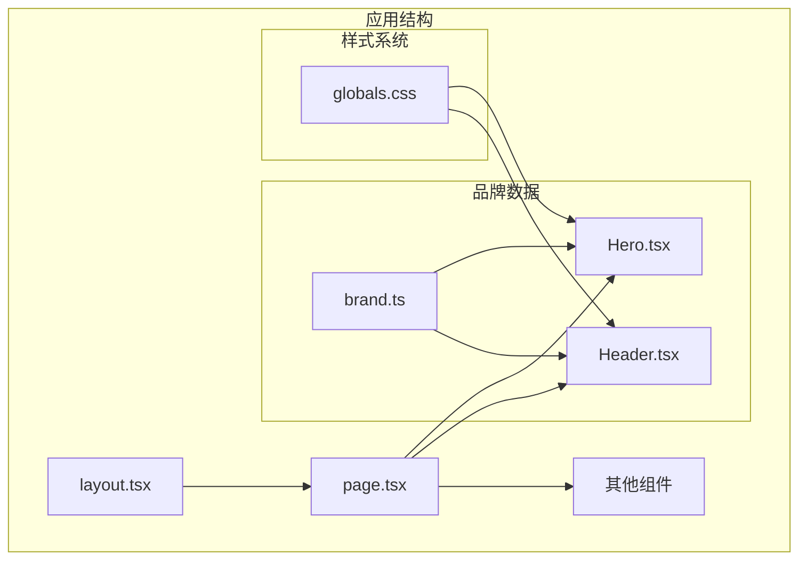
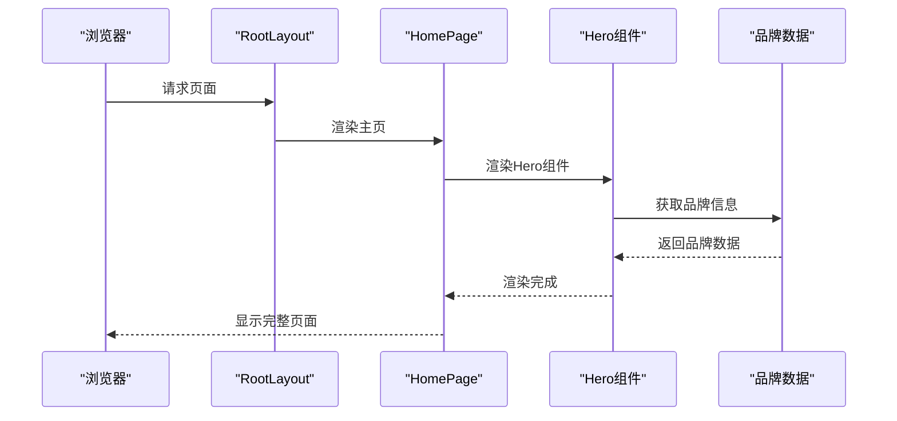
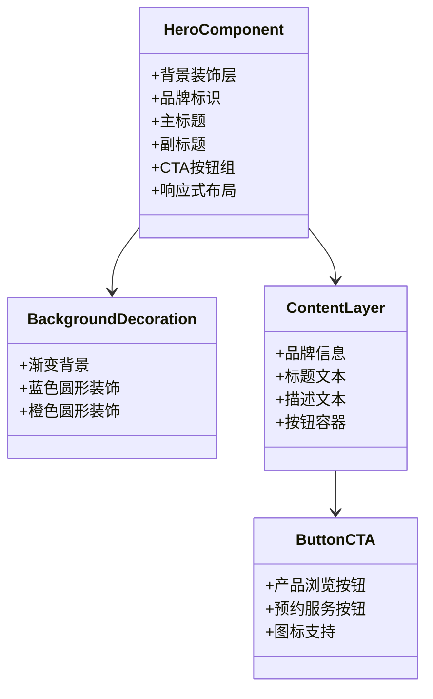
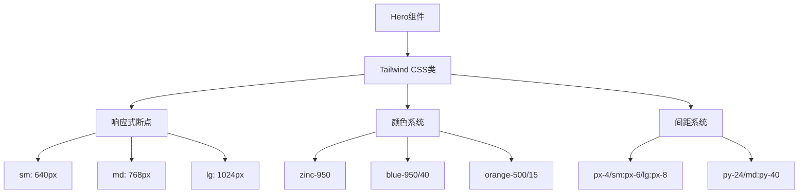
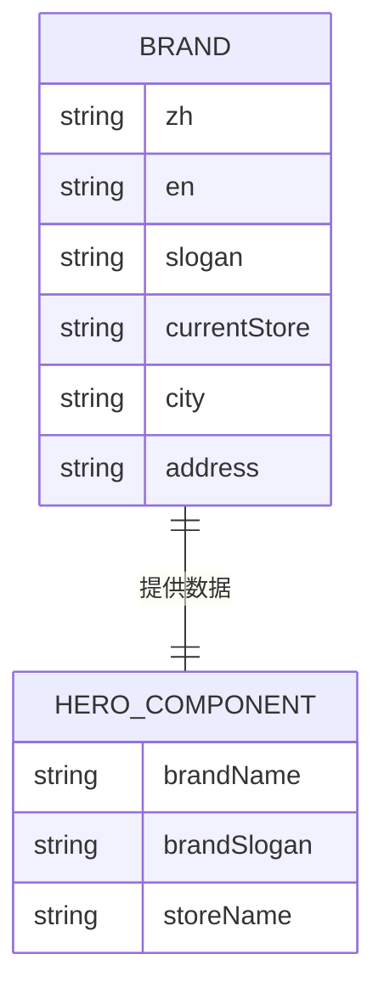
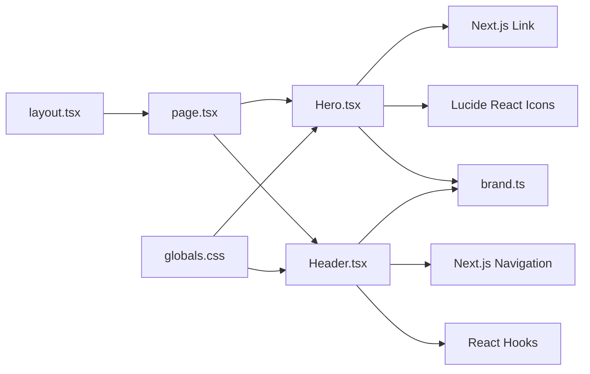
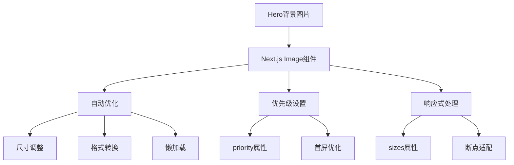

# Hero英雄区域组件

<cite>
**本文档引用的文件**
- [Hero.tsx](file://src/components/Hero.tsx)
- [page.tsx](file://src/app/page.tsx)
- [layout.tsx](file://src/app/layout.tsx)
- [brand.ts](file://src/lib/brand.ts)
- [globals.css](file://src/app/globals.css)
- [Header.tsx](file://src/components/Header.tsx)
- [ARCHITECTURE_IMAGE_STRATEGY.md](file://docs/ARCHITECTURE_IMAGE_STRATEGY.md)
- [image.md](file://.claude/skills/next-best-practices/image.md)
</cite>

## 目录
1. [简介](#简介)
2. [项目结构](#项目结构)
3. [核心组件](#核心组件)
4. [架构概览](#架构概览)
5. [详细组件分析](#详细组件分析)
6. [依赖关系分析](#依赖关系分析)
7. [性能考虑](#性能考虑)
8. [故障排除指南](#故障排除指南)
9. [结论](#结论)
10. [附录](#附录)

## 简介

Hero英雄区域组件是蓝辉轻改网站的核心视觉元素，负责在首页提供引人注目的首屏展示。该组件采用深色主题设计，结合渐变背景和装饰性圆形元素，营造出专业的汽车轻改装品牌形象。组件包含品牌标识、主标题、副标题描述以及两个CTA按钮，为用户提供清晰的导航路径和行动指引。

## 项目结构

Hero组件位于项目的组件目录中，与其他UI组件协同工作，形成完整的网站架构。组件通过品牌信息模块获取动态内容，并在页面布局中正确渲染。



**图表来源**
- [layout.tsx:20-38](file://src/app/layout.tsx#L20-L38)
- [page.tsx:8-21](file://src/app/page.tsx#L8-L21)
- [Hero.tsx:5-56](file://src/components/Hero.tsx#L5-L56)

**章节来源**
- [Hero.tsx:1-56](file://src/components/Hero.tsx#L1-L56)
- [page.tsx:1-22](file://src/app/page.tsx#L1-L22)
- [layout.tsx:1-39](file://src/app/layout.tsx#L1-L39)

## 核心组件

Hero组件采用函数式组件设计，使用React Hooks进行状态管理。组件结构简洁明了，主要包含以下核心部分：

### 设计理念
- **深色主题**：使用zinc-950背景色营造专业氛围
- **渐变效果**：蓝色到橙色的渐变突出品牌特色
- **层次分明**：通过z-index控制背景装饰元素的层级关系
- **响应式布局**：适配移动端和桌面端的不同屏幕尺寸

### 主要特性
- 动态品牌内容显示（中英文品牌名）
- 渐变背景装饰（蓝色和橙色圆形元素）
- 响应式文本排版（标题和副标题）
- 交互式CTA按钮（产品浏览和预约服务）

**章节来源**
- [Hero.tsx:5-56](file://src/components/Hero.tsx#L5-L56)
- [brand.ts:8-25](file://src/lib/brand.ts#L8-L25)

## 架构概览

Hero组件在整个网站架构中扮演着关键角色，作为首页的首屏展示元素，需要与其他组件协调工作。



**图表来源**
- [layout.tsx:20-38](file://src/app/layout.tsx#L20-L38)
- [page.tsx:8-21](file://src/app/page.tsx#L8-L21)
- [Hero.tsx:5-56](file://src/components/Hero.tsx#L5-L56)

## 详细组件分析

### 组件结构分析

Hero组件采用语义化的HTML结构，确保良好的可访问性和SEO表现：



**图表来源**
- [Hero.tsx:7-52](file://src/components/Hero.tsx#L7-L52)

### 样式系统分析

组件使用Tailwind CSS进行样式管理，结合自定义CSS变量实现主题一致性：



**图表来源**
- [Hero.tsx:19-52](file://src/components/Hero.tsx#L19-L52)
- [globals.css:51-130](file://src/app/globals.css#L51-L130)

### 品牌数据集成

Hero组件通过品牌信息模块获取动态内容，确保品牌信息的一致性和可维护性：



**图表来源**
- [brand.ts:8-25](file://src/lib/brand.ts#L8-L25)
- [Hero.tsx:21-49](file://src/components/Hero.tsx#L21-L49)

**章节来源**
- [Hero.tsx:1-56](file://src/components/Hero.tsx#L1-L56)
- [brand.ts:1-28](file://src/lib/brand.ts#L1-L28)

## 依赖关系分析

Hero组件的依赖关系相对简单，主要依赖于品牌数据模块和外部图标库。



**图表来源**
- [Hero.tsx:1-3](file://src/components/Hero.tsx#L1-L3)
- [page.tsx:1-6](file://src/app/page.tsx#L1-L6)

### 外部依赖分析

组件使用了以下外部依赖：

- **Next.js Link**：用于页面内导航
- **Lucide React Icons**：提供矢量图标支持
- **Tailwind CSS**：提供实用类样式系统
- **品牌数据模块**：提供动态品牌信息

**章节来源**
- [Hero.tsx:1-3](file://src/components/Hero.tsx#L1-L3)
- [Header.tsx:1-10](file://src/components/Header.tsx#L1-L10)

## 性能考虑

### 图片优化策略

根据项目文档，Hero组件的背景图片优化是性能优化的重点：



**图表来源**
- [ARCHITECTURE_IMAGE_STRATEGY.md:238-249](file://docs/ARCHITECTURE_IMAGE_STRATEGY.md#L238-L249)

### 响应式性能优化

组件采用移动优先的设计策略，通过断点优化不同设备的性能表现：

- **移动端**：简化装饰元素，减少渲染负担
- **平板端**：适度增加装饰元素
- **桌面端**：完整展现所有视觉效果

**章节来源**
- [ARCHITECTURE_IMAGE_STRATEGY.md:216-256](file://docs/ARCHITECTURE_IMAGE_STRATEGY.md#L216-L256)
- [Hero.tsx:19-52](file://src/components/Hero.tsx#L19-L52)

## 故障排除指南

### 常见问题及解决方案

#### 图片加载问题
- **问题**：Hero背景图片无法加载
- **解决方案**：检查图片路径是否正确，确认图片已放置在public/images目录下

#### 品牌信息显示异常
- **问题**：品牌名称或标语显示为空
- **解决方案**：验证brand.ts中的品牌数据是否正确配置

#### 响应式布局问题
- **问题**：在某些设备上布局错乱
- **解决方案**：检查Tailwind CSS断点设置，确保响应式类正确应用

**章节来源**
- [ARCHITECTURE_IMAGE_STRATEGY.md:416-449](file://docs/ARCHITECTURE_IMAGE_STRATEGY.md#L416-L449)

## 结论

Hero英雄区域组件成功实现了品牌展示的核心目标，通过精心设计的视觉效果和响应式布局，为用户提供了优质的首屏体验。组件采用现代化的技术栈，具有良好的可维护性和扩展性。未来可以进一步优化图片加载性能，并考虑添加更多的交互效果来提升用户体验。

## 附录

### 使用示例

Hero组件的使用非常简单，只需在页面中导入并渲染即可：

```typescript
// 在页面组件中使用
import { Hero } from "@/components/Hero";

export default function HomePage() {
  return (
    <div>
      <Hero />
    </div>
  );
}
```

### 集成方法

1. **基础集成**：直接在页面组件中导入Hero组件
2. **品牌定制**：通过修改brand.ts文件定制品牌信息
3. **样式调整**：通过修改globals.css调整主题颜色
4. **内容更新**：通过修改Hero组件的文本内容更新展示信息

### 最佳实践

- 确保Hero组件在页面中的唯一性
- 合理配置图片的priority属性以优化首屏加载
- 定期更新品牌信息保持内容新鲜度
- 监控组件的性能指标确保用户体验