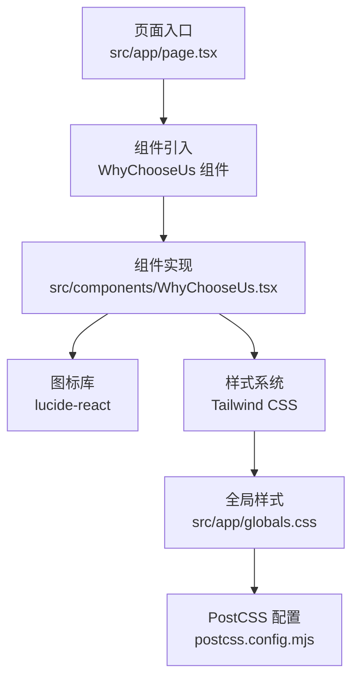
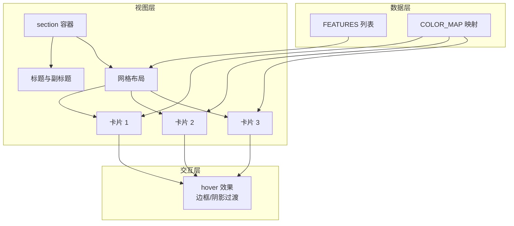
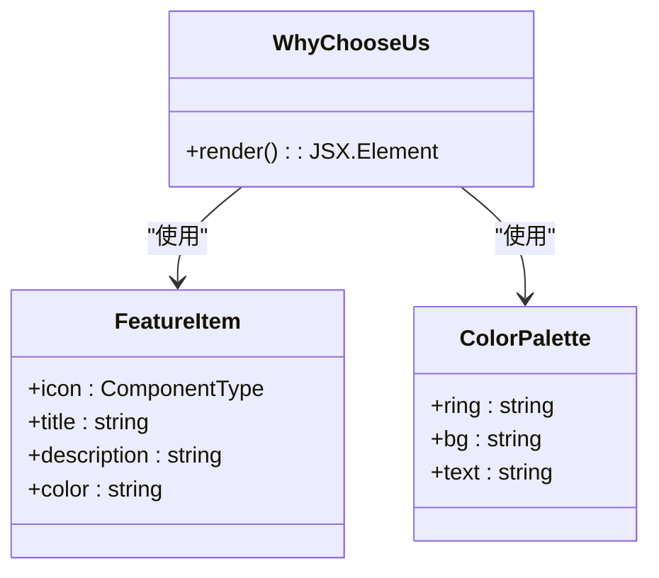
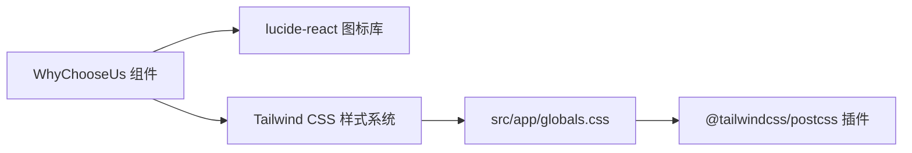

# 为什么选择我们组件

<cite>
**本文引用的文件**
- [WhyChooseUs.tsx](file://src/components/WhyChooseUs.tsx)
- [page.tsx](file://src/app/page.tsx)
- [globals.css](file://src/app/globals.css)
- [postcss.config.mjs](file://postcss.config.mjs)
</cite>

## 目录
1. [简介](#简介)
2. [项目结构](#项目结构)
3. [核心组件](#核心组件)
4. [架构总览](#架构总览)
5. [详细组件分析](#详细组件分析)
6. [依赖关系分析](#依赖关系分析)
7. [性能考量](#性能考量)
8. [故障排查指南](#故障排查指南)
9. [结论](#结论)
10. [附录](#附录)

## 简介
WhyChooseUs 是一个用于展示品牌核心优势与服务亮点的卡片网格组件，常用于首页或落地页中，向用户直观传达“为什么选择蓝辉轻改”的关键信息。组件通过三列布局展示三条优势，每条优势包含图标、标题与描述，并在悬停时提供边框与阴影的过渡反馈，整体采用深色背景与高对比度文字，确保在暗色主题下具备良好的可读性与视觉层次。

## 项目结构
WhyChooseUs 组件位于 src/components 目录下，作为页面级组件被首页引用。其样式由全局 Tailwind CSS 提供，PostCSS 通过 @tailwindcss/postcss 插件进行构建处理。

图表来源
- [page.tsx:1-21](file://src/app/page.tsx#L1-L21)
- [WhyChooseUs.tsx:1-84](file://src/components/WhyChooseUs.tsx#L1-L84)
- [globals.css:1-84](file://src/app/globals.css#L1-L84)
- [postcss.config.mjs:1-7](file://postcss.config.mjs#L1-L7)

章节来源
- [page.tsx:1-21](file://src/app/page.tsx#L1-L21)

## 核心组件
WhyChooseUs 组件的核心职责是渲染一组优势卡片，包含以下关键要素：
- 数据层：内置 FEATURES 列表，定义三条优势项，每项包含图标、标题、描述与颜色标识。
- 视觉层：COLOR_MAP 将颜色标识映射为边框环、背景与文本的颜色类名，确保图标区域与文字色彩一致。
- 布局层：使用栅格布局在移动端为单列，在中等及以上屏幕为三列，卡片内含圆角背景、边框与悬停阴影过渡。
- 交互层：卡片在 hover 时改变边框与阴影，提供平滑的过渡动画，增强可用性与反馈感。

章节来源
- [WhyChooseUs.tsx:1-84](file://src/components/WhyChooseUs.tsx#L1-L84)

## 架构总览
WhyChooseUs 的运行时架构围绕“数据-视图-交互”三层展开：
- 数据层：FEATURES 定义优势项；COLOR_MAP 提供颜色映射。
- 视图层：组件根据 FEATURES 动态渲染卡片，每个卡片包含图标容器、标题与描述。
- 交互层：通过 Tailwind 的 hover 与 transition 类实现悬停边框与阴影变化。

图表来源
- [WhyChooseUs.tsx:3-25](file://src/components/WhyChooseUs.tsx#L3-L25)
- [WhyChooseUs.tsx:27-43](file://src/components/WhyChooseUs.tsx#L27-L43)
- [WhyChooseUs.tsx:45-83](file://src/components/WhyChooseUs.tsx#L45-L83)

## 详细组件分析

### 数据结构与 Props 接口
当前组件未对外暴露 Props 接口，而是以内置常量的方式定义优势项与颜色映射。若需扩展为可复用组件，建议抽象出如下接口：

- 优势项接口
  - 字段：icon（图标组件）、title（标题字符串）、description（描述字符串）、color（颜色标识字符串）
  - 复杂度：O(1) 访问，数组长度固定为 3
- 颜色映射接口
  - 字段：ring（边框环类名）、bg（背景类名）、text（文本类名）
  - 复杂度：O(1) 查找，键空间有限（blue/orange/yellow）

图表来源
- [WhyChooseUs.tsx:3-25](file://src/components/WhyChooseUs.tsx#L3-L25)
- [WhyChooseUs.tsx:27-43](file://src/components/WhyChooseUs.tsx#L27-L43)
- [WhyChooseUs.tsx:45-83](file://src/components/WhyChooseUs.tsx#L45-L83)

章节来源
- [WhyChooseUs.tsx:3-25](file://src/components/WhyChooseUs.tsx#L3-L25)
- [WhyChooseUs.tsx:27-43](file://src/components/WhyChooseUs.tsx#L27-L43)

### 布局与视觉层次
- 布局策略
  - 容器：section 提供垂直内边距与最大宽度约束，居中容器承载标题与网格。
  - 标题区：副标题、主标题与描述形成清晰的信息层级。
  - 网格：1 列（移动端）至 3 列（中等及以上屏幕），列间距与卡片内边距保证呼吸感。
- 视觉层次
  - 文字：标题使用白色，描述使用浅灰，确保对比度；副标题使用橙色强调。
  - 图标：图标容器采用圆角背景与对应色系文本，突出信息区块。
  - 卡片：深色背景与浅色文字，边框与阴影在悬停时增强可点击感。

章节来源
- [WhyChooseUs.tsx:45-83](file://src/components/WhyChooseUs.tsx#L45-L83)

### 交互设计与用户体验
- 悬停效果
  - 边框：hover 时从深灰变为浅灰，提供即时反馈。
  - 阴影：hover 时增加阴影，提升卡片的立体感与注意力引导。
  - 过渡：统一的 transition-all 实现平滑过渡，避免突兀。
- 响应式布局
  - 移动端：单列网格，保证阅读与触摸操作体验。
  - 中等及以上屏幕：三列网格，充分利用横向空间，提升信息密度。
- 可访问性
  - 使用语义化标签（h2、p）与清晰的层级结构。
  - 高对比度配色与明确的焦点路径（hover）。

章节来源
- [WhyChooseUs.tsx:60-83](file://src/components/WhyChooseUs.tsx#L60-L83)

### 数据绑定与动态更新机制
- 当前实现
  - 数据绑定：FEATURES 与 COLOR_MAP 在组件内部定义，渲染阶段通过 map 遍历生成卡片。
  - 动态更新：无外部 Props，无法在调用侧传入自定义数据；若需动态更新，可在父组件传递数据并通过 Props 注入。
- 扩展建议
  - 引入 Props 接口接收优势列表与颜色映射，组件内部保持现有渲染逻辑不变。
  - 支持外部状态驱动（如从 API 获取数据），在父组件完成数据加载后再渲染组件。

章节来源
- [WhyChooseUs.tsx:3-25](file://src/components/WhyChooseUs.tsx#L3-L25)
- [WhyChooseUs.tsx:27-43](file://src/components/WhyChooseUs.tsx#L27-L43)
- [WhyChooseUs.tsx:60-83](file://src/components/WhyChooseUs.tsx#L60-L83)

### 样式定制与主题适配
- 主题适配
  - 深色主题：组件默认使用深色背景与浅色文字，与暗色主题环境契合。
  - 颜色映射：COLOR_MAP 将 color 标识映射为特定色系的 ring/bg/text 类名，便于在不同主题下统一风格。
- 定制选项
  - 调整网格列数：通过修改栅格类名实现不同断点下的列数变化。
  - 修改卡片样式：调整圆角、内边距、边框与阴影类名以匹配品牌风格。
  - 更换图标：替换 FEATURES 中的图标组件即可快速切换视觉元素。
- 样式来源
  - Tailwind 类名：组件内直接使用 Tailwind 工具类，无需额外样式文件。
  - 全局样式：src/app/globals.css 引入 Tailwind 与第三方样式，postcss.config.mjs 配置 PostCSS 插件。

章节来源
- [WhyChooseUs.tsx:27-43](file://src/components/WhyChooseUs.tsx#L27-L43)
- [WhyChooseUs.tsx:45-83](file://src/components/WhyChooseUs.tsx#L45-L83)
- [globals.css:1-84](file://src/app/globals.css#L1-L84)
- [postcss.config.mjs:1-7](file://postcss.config.mjs#L1-L7)

### 使用示例与最佳实践
- 基础用法
  - 在页面中直接引入组件并放置于合适位置，组件自带标题与网格布局。
- 最佳实践
  - 内容管理：将 FEATURES 与 COLOR_MAP 抽象为可配置的 Props，便于在不同页面复用。
  - 性能优化：若优势项数量增长，建议使用虚拟滚动或分页，避免一次性渲染过多卡片。
  - 可访问性：为图标容器添加适当的 aria-label 或 role 属性，确保屏幕阅读器可识别。
  - 主题一致性：通过 COLOR_MAP 与 Tailwind 类名统一各卡片的视觉风格，避免跨页面风格漂移。

章节来源
- [page.tsx:1-21](file://src/app/page.tsx#L1-L21)
- [WhyChooseUs.tsx:45-83](file://src/components/WhyChooseUs.tsx#L45-L83)

## 依赖关系分析
WhyChooseUs 组件的依赖关系简洁明确，主要依赖于图标库与样式系统。

图表来源
- [WhyChooseUs.tsx:1-1](file://src/components/WhyChooseUs.tsx#L1-L1)
- [globals.css:1-4](file://src/app/globals.css#L1-L4)
- [postcss.config.mjs:1-7](file://postcss.config.mjs#L1-L7)

章节来源
- [WhyChooseUs.tsx:1-1](file://src/components/WhyChooseUs.tsx#L1-L1)
- [globals.css:1-84](file://src/app/globals.css#L1-L84)
- [postcss.config.mjs:1-7](file://postcss.config.mjs#L1-L7)

## 性能考量
- 渲染开销
  - 当前组件仅渲染固定数量的卡片，渲染成本极低，适合在首屏使用。
- 样式体积
  - 使用 Tailwind 工具类，按需生成样式，避免额外 CSS 文件，减少打包体积。
- 交互性能
  - hover 效果基于 CSS 过渡，性能开销小，适合在低端设备上流畅运行。

## 故障排查指南
- 图标不显示
  - 检查 lucide-react 是否正确安装与导入。
  - 确认图标组件在渲染时传入了正确的尺寸类名。
- 颜色不生效
  - 检查 color 标识是否在 COLOR_MAP 中存在对应键值。
  - 确认 Tailwind 类名拼写正确且已启用暗色主题支持。
- 响应式布局异常
  - 检查容器的最大宽度与栅格类名是否正确。
  - 确认断点类名（如 md:grid-cols-3）在目标屏幕尺寸下生效。

章节来源
- [WhyChooseUs.tsx:27-43](file://src/components/WhyChooseUs.tsx#L27-L43)
- [WhyChooseUs.tsx:60-83](file://src/components/WhyChooseUs.tsx#L60-L83)

## 结论
WhyChooseUs 组件通过简洁的数据结构、清晰的视觉层次与顺滑的交互反馈，有效传达品牌优势。其基于 Tailwind 的样式体系与 lucide-react 图标库，使组件具备良好的可维护性与扩展性。建议在实际业务中将其抽象为可配置的通用组件，以便在多页面场景中复用并保持一致的品牌体验。

## 附录
- 页面集成
  - 组件已在首页中直接引入并渲染，作为首屏信息展示的一部分。
- 样式与构建
  - 全局样式通过 @import 方式引入 Tailwind 与第三方样式，PostCSS 使用 @tailwindcss/postcss 插件进行构建。

章节来源
- [page.tsx:1-21](file://src/app/page.tsx#L1-L21)
- [globals.css:1-84](file://src/app/globals.css#L1-L84)
- [postcss.config.mjs:1-7](file://postcss.config.mjs#L1-L7)